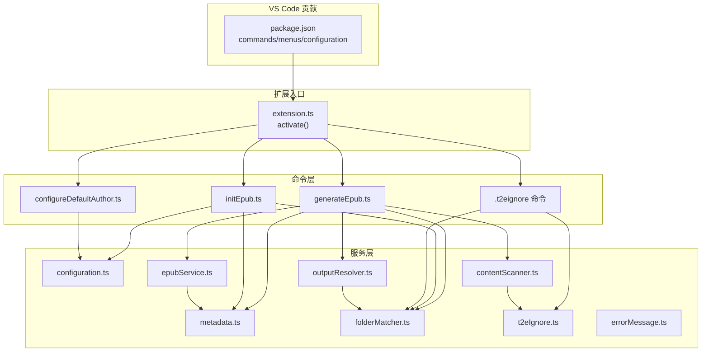
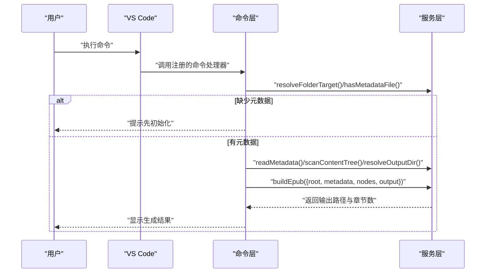
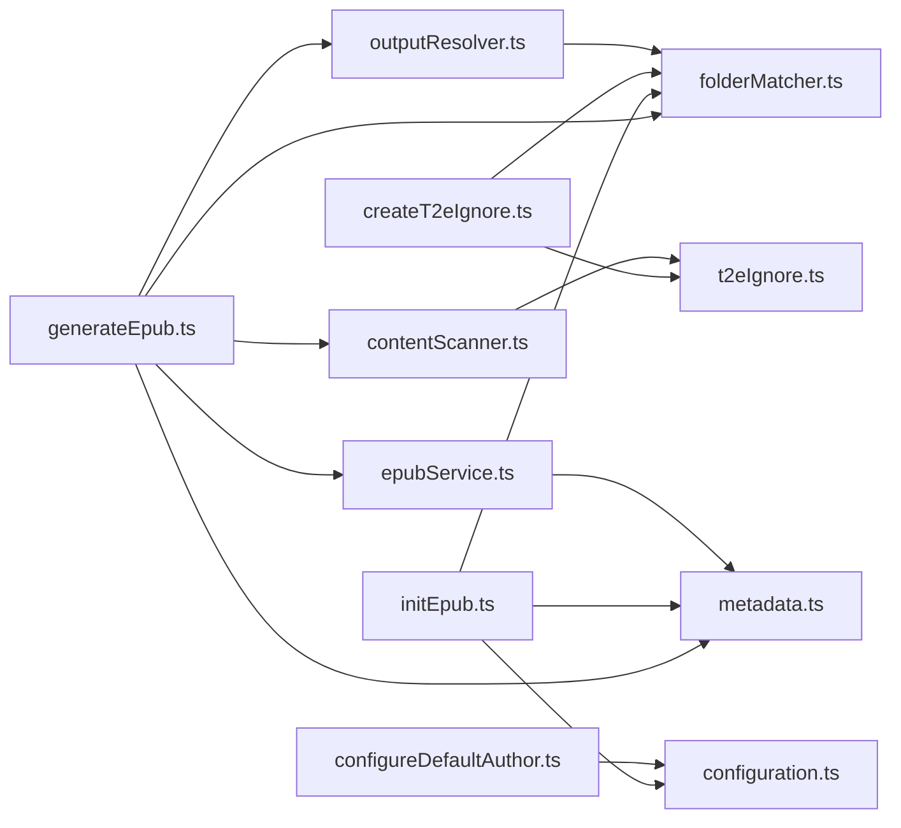

# API 参考文档

<cite>
**本文引用的文件**
- [package.json](file://package.json)
- [extension.ts](file://src/extension.ts)
- [generateEpub.ts](file://src/commands/generateEpub.ts)
- [initEpub.ts](file://src/commands/initEpub.ts)
- [createT2eIgnore.ts](file://src/commands/createT2eIgnore.ts)
- [configureDefaultAuthor.ts](file://src/commands/configureDefaultAuthor.ts)
- [configuration.ts](file://src/services/configuration.ts)
- [metadata.ts](file://src/services/metadata.ts)
- [contentScanner.ts](file://src/services/contentScanner.ts)
- [epubService.ts](file://src/services/epubService.ts)
- [folderMatcher.ts](file://src/services/folderMatcher.ts)
- [outputResolver.ts](file://src/services/outputResolver.ts)
- [t2eIgnore.ts](file://src/services/t2eIgnore.ts)
- [errorMessage.ts](file://src/services/errorMessage.ts)
- [README.md](file://README.md)
</cite>

## 目录
1. [简介](#简介)
2. [项目结构](#项目结构)
3. [核心组件](#核心组件)
4. [架构总览](#架构总览)
5. [详细组件分析](#详细组件分析)
6. [依赖关系分析](#依赖关系分析)
7. [性能考量](#性能考量)
8. [故障排查指南](#故障排查指南)
9. [结论](#结论)
10. [附录](#附录)

## 简介
本文件为 VS Code 扩展 Folder2EPUB 的完整 API 参考文档，涵盖：
- 公共命令接口：命令名称、参数、返回值、使用示例与行为说明
- 核心服务 API：方法签名、参数类型、错误处理机制
- 数据模型定义：元数据结构、配置格式、文件格式
- 事件与回调机制：扩展生命周期事件、用户交互事件
- 代码示例与使用场景
- API 版本兼容性与迁移指南
- 第三方集成接口与扩展点
- 调试与监控相关 API

## 项目结构
- 扩展入口注册命令：在激活时注册四个公共命令
- 命令层：封装用户操作，串联服务层流程
- 服务层：负责配置、元数据、内容扫描、EPUB 打包、输出解析、忽略规则、错误消息等
- 配置与贡献：VS Code 贡献区声明命令、菜单、设置项

图表来源
- [package.json:43-96](file://package.json#L43-L96)
- [extension.ts:13-18](file://src/extension.ts#L13-L18)
- [generateEpub.ts:18-65](file://src/commands/generateEpub.ts#L18-L65)
- [initEpub.ts:18-62](file://src/commands/initEpub.ts#L18-L62)
- [createT2eIgnore.ts:15-33](file://src/commands/createT2eIgnore.ts#L15-L33)
- [configureDefaultAuthor.ts:12-25](file://src/commands/configureDefaultAuthor.ts#L12-L25)
- [configuration.ts:18-79](file://src/services/configuration.ts#L18-L79)
- [metadata.ts:41-117](file://src/services/metadata.ts#L41-L117)
- [contentScanner.ts:51-340](file://src/services/contentScanner.ts#L51-L340)
- [epubService.ts:146-216](file://src/services/epubService.ts#L146-L216)
- [folderMatcher.ts:23-84](file://src/services/folderMatcher.ts#L23-L84)
- [outputResolver.ts:15-90](file://src/services/outputResolver.ts#L15-L90)
- [t2eIgnore.ts:13-45](file://src/services/t2eIgnore.ts#L13-L45)
- [errorMessage.ts:9-15](file://src/services/errorMessage.ts#L9-L15)

章节来源
- [package.json:43-96](file://package.json#L43-L96)
- [extension.ts:13-18](file://src/extension.ts#L13-L18)

## 核心组件
- 命令注册与入口
  - activate(context)：注册四个公共命令，挂载到扩展上下文
- 命令接口
  - folder2epub.generateEpub：生成 EPUB
  - folder2epub.initEpub：初始化 EPUB 元数据目录与文件
  - folder2epub.createT2eIgnore：创建 .t2eignore 文件
  - folder2epub.configureDefaultAuthor：交互式配置当前工作区默认作者
- 服务接口
  - 配置：读取/设置默认作者、交互式配置
  - 元数据：读取/序列化/规范化/文件名格式化
  - 内容扫描：目录扫描、排序、index 文件选择、忽略规则
  - EPUB 打包：章节渲染、封面加载、OPF/导航/NCX/样式生成、ZIP 输出
  - 目录定位：目标目录校验、元数据路径、存在性判断
  - 输出解析：向上查找 __epub.yml 并解析 saveTo
  - 忽略规则：读取 .t2eignore，按 .gitignore 语法过滤
  - 错误消息：统一错误转文本

章节来源
- [extension.ts:13-18](file://src/extension.ts#L13-L18)
- [generateEpub.ts:18-65](file://src/commands/generateEpub.ts#L18-L65)
- [initEpub.ts:18-62](file://src/commands/initEpub.ts#L18-L62)
- [createT2eIgnore.ts:15-33](file://src/commands/createT2eIgnore.ts#L15-L33)
- [configureDefaultAuthor.ts:12-25](file://src/commands/configureDefaultAuthor.ts#L12-L25)
- [configuration.ts:18-79](file://src/services/configuration.ts#L18-L79)
- [metadata.ts:41-117](file://src/services/metadata.ts#L41-L117)
- [contentScanner.ts:51-340](file://src/services/contentScanner.ts#L51-L340)
- [epubService.ts:146-216](file://src/services/epubService.ts#L146-L216)
- [folderMatcher.ts:23-84](file://src/services/folderMatcher.ts#L23-L84)
- [outputResolver.ts:15-90](file://src/services/outputResolver.ts#L15-L90)
- [t2eIgnore.ts:13-45](file://src/services/t2eIgnore.ts#L13-L45)
- [errorMessage.ts:9-15](file://src/services/errorMessage.ts#L9-L15)

## 架构总览
从命令到服务的调用链路如下：

图表来源
- [generateEpub.ts:19-64](file://src/commands/generateEpub.ts#L19-L64)
- [folderMatcher.ts:23-38](file://src/services/folderMatcher.ts#L23-L38)
- [metadata.ts:41-59](file://src/services/metadata.ts#L41-L59)
- [contentScanner.ts:51-58](file://src/services/contentScanner.ts#L51-L58)
- [outputResolver.ts:15-42](file://src/services/outputResolver.ts#L15-L42)
- [epubService.ts:146-216](file://src/services/epubService.ts#L146-L216)

## 详细组件分析

### 命令接口 API

#### 命令：folder2epub.generateEpub
- 参数
  - uri?: Uri（可选）：资源管理器中选中的本地目录
- 返回值
  - 无（命令注册返回 Disposable；实际执行无显式返回）
- 行为
  - 校验目标为本地目录
  - 检查是否存在 __t2e.data/metadata.yml
  - 读取元数据、扫描内容、解析输出目录、打包 EPUB
  - 成功：显示生成完成与输出路径
  - 失败：统一错误消息提示
- 使用示例
  - 在资源管理器中右键本地目录 → “Folder2EPUB: 生成 epub”
  - 或通过命令面板执行“Folder2EPUB: 生成 epub”

章节来源
- [generateEpub.ts:18-65](file://src/commands/generateEpub.ts#L18-L65)
- [folderMatcher.ts:23-38](file://src/services/folderMatcher.ts#L23-L38)
- [metadata.ts:41-59](file://src/services/metadata.ts#L41-L59)
- [contentScanner.ts:51-58](file://src/services/contentScanner.ts#L51-L58)
- [outputResolver.ts:15-42](file://src/services/outputResolver.ts#L15-L42)
- [epubService.ts:146-216](file://src/services/epubService.ts#L146-L216)

#### 命令：folder2epub.initEpub
- 参数
  - uri?: Uri（可选）：资源管理器中选中的本地目录
- 返回值
  - 无（命令注册返回 Disposable；实际执行无显式返回）
- 行为
  - 校验目标为本地目录
  - 若已存在 __t2e.data/metadata.yml，中止并提示
  - 读取工作区默认作者；若未配置，交互式引导配置
  - 写入默认模板 metadata.yml
- 使用示例
  - 在资源管理器中右键本地目录 → “Folder2EPUB: 初始化 epub”
  - 或通过命令面板执行“Folder2EPUB: 初始化 epub”

章节来源
- [initEpub.ts:18-62](file://src/commands/initEpub.ts#L18-L62)
- [configuration.ts:18-79](file://src/services/configuration.ts#L18-L79)
- [metadata.ts:24-33](file://src/services/metadata.ts#L24-L33)

#### 命令：folder2epub.createT2eIgnore
- 参数
  - uri?: Uri（可选）：资源管理器中选中的本地目录
- 返回值
  - 无（命令注册返回 Disposable；实际执行无显式返回）
- 行为
  - 校验目标为本地目录
  - 若 .t2eignore 已存在，提示并中止
  - 否则创建空的 .t2eignore 文件
- 使用示例
  - 在资源管理器中右键本地目录 → “Folder2EPUB: 新增 .t2eignore”

章节来源
- [createT2eIgnore.ts:15-33](file://src/commands/createT2eIgnore.ts#L15-L33)
- [t2eIgnore.ts:13-26](file://src/services/t2eIgnore.ts#L13-L26)

#### 命令：folder2epub.configureDefaultAuthor
- 参数
  - 无（无参数）
- 返回值
  - Promise<ConfigureDefaultAuthorResult>：包含 applied 与 author 字段
- 行为
  - 交互式输入作者名，写入当前工作区配置
  - 返回应用状态与最终作者值
- 使用示例
  - 通过命令面板执行“Folder2EPUB: 配置当前 Workspace 默认作者”

章节来源
- [configureDefaultAuthor.ts:12-25](file://src/commands/configureDefaultAuthor.ts#L12-L25)
- [configuration.ts:47-79](file://src/services/configuration.ts#L47-L79)

### 核心服务 API

#### 配置服务 configuration.ts
- getDefaultAuthor(): string
  - 读取当前工作区的默认作者配置（去空白）
- setDefaultAuthor(author: string): Promise<void>
  - 写入当前工作区默认作者（trim 后）
  - 未打开工作区时抛出错误
- configureDefaultAuthorInteractively(): Promise<ConfigureDefaultAuthorResult>
  - 交互式输入作者名，返回应用状态与作者值

章节来源
- [configuration.ts:18-79](file://src/services/configuration.ts#L18-L79)

#### 元数据服务 metadata.ts
- EpubMetadata
  - 字段：author, cover, description, title, titleSuffix, version
- createDefaultMetadata(folderName: string, author: string): EpubMetadata
  - 生成默认模板
- readMetadata(folderPath: string): Promise<EpubMetadata>
  - 读取并解析 __t2e.data/metadata.yml
- stringifyMetadata(metadata: EpubMetadata): string
  - 序列化为 YAML 文本
- getBookAuthor(metadata: EpubMetadata): string
- getBookTitle(metadata: EpubMetadata): string
- getBookDisplayTitle(metadata: EpubMetadata): string
- formatBookFileName(metadata: EpubMetadata): string
  - 生成 EPUB 文件名（清洗非法字符）

章节来源
- [metadata.ts:8-157](file://src/services/metadata.ts#L8-L157)

#### 内容扫描服务 contentScanner.ts
- ContentFileNode / ContentFolderNode / ContentNode
- ContentScanResult
  - files: ContentFileNode[]
  - nodes: ContentNode[]
- scanContentTree(rootFolderPath: string): Promise<ContentScanResult>
  - 扫描目录，保留层级与线性文件列表
- 排序规则
  - 数字前缀优先，名称次之；中文友好 localeCompare
- index 文件策略
  - 目录优先使用直接 index 文件；否则使用首文件
- 忽略规则
  - __t2e.data 永远不过滤（系统保留）
  - 合并 .t2eignore 规则（.gitignore 语法）

章节来源
- [contentScanner.ts:10-340](file://src/services/contentScanner.ts#L10-L340)

#### EPUB 打包服务 epubService.ts
- buildEpub(input: BuildEpubInput): Promise<BuildEpubResult>
  - 输入：metadata, nodes, outputFilePath, rootFolderPath
  - 输出：{ chapterCount, outputFilePath }
  - 流程：章节渲染、封面加载、OPF/导航/NCX/样式生成、ZIP 写出
- createChapters(nodes, markdown, root): Promise<{ chapters, contentImages }>
- loadCoverAsset(root, coverName): Promise<CoverAsset|undefined>
- createContentOpf(...) / createNavXhtml(...) / createTocNcx(...)
- escapeXml / renderPlainText / renderMarkdownChapter
- getMediaType(ext): string | undefined

章节来源
- [epubService.ts:93-800](file://src/services/epubService.ts#L93-L800)

#### 目录定位与存在性 folderMatcher.ts
- resolveFolderTarget(uri?: Uri): Promise<FolderTarget>
  - 校验本地目录并返回标准化目标
- getMetadataDirPath(folderPath: string): string
- getMetadataFilePath(folderPath: string): string
- exists(filePath: string): Promise<boolean>
- hasMetadataFile(folderPath: string): Promise<boolean>

章节来源
- [folderMatcher.ts:11-84](file://src/services/folderMatcher.ts#L11-L84)

#### 输出目录解析 outputResolver.ts
- resolveOutputDir(folderPath: string): Promise<string>
  - 自上而下查找 __epub.yml，解析 saveTo
  - 支持 ~ 与 ~/... 展开为用户目录
  - 相对路径以配置文件所在目录为基准

章节来源
- [outputResolver.ts:15-90](file://src/services/outputResolver.ts#L15-L90)

#### 忽略规则 t2eIgnore.ts
- readT2eIgnore(dirPath: string): Promise<string[]>
  - 读取 .t2eignore，过滤空行与注释
- createIgnoreFilter(parentFilter?: IgnoreFilter): IgnoreFilter
  - 基于 ignore 库创建过滤器

章节来源
- [t2eIgnore.ts:13-45](file://src/services/t2eIgnore.ts#L13-L45)

#### 错误消息 errorMessage.ts
- toErrorMessage(error: unknown): string
  - 统一错误转文本，未知错误返回本地化提示

章节来源
- [errorMessage.ts:9-15](file://src/services/errorMessage.ts#L9-L15)

### 数据模型定义

#### 元数据结构 EpubMetadata
- 字段
  - title: string
  - titleSuffix: string
  - author: string
  - description: string
  - cover: string
  - version: string

章节来源
- [metadata.ts:8-15](file://src/services/metadata.ts#L8-L15)

#### 目录目标 FolderTarget
- 字段
  - fsPath: string
  - name: string
  - uri: Uri

章节来源
- [folderMatcher.ts:11-15](file://src/services/folderMatcher.ts#L11-L15)

#### 内容节点 ContentNode
- 文件节点 ContentFileNode
  - displayName, extension, fsPath, isIndexFile, kind='file', name, order, relativePath
- 目录节点 ContentFolderNode
  - children, displayName, firstFile, fsPath, indexFile?, kind='folder', name, order, relativePath

章节来源
- [contentScanner.ts:10-31](file://src/services/contentScanner.ts#L10-L31)

#### EPUB 构建输入/输出
- BuildEpubInput
  - metadata: EpubMetadata
  - nodes: ContentNode[]
  - outputFilePath: string
  - rootFolderPath: string
- BuildEpubResult
  - chapterCount: number
  - outputFilePath: string

章节来源
- [epubService.ts:93-103](file://src/services/epubService.ts#L93-L103)

### 事件与回调机制
- 扩展生命周期事件
  - activate(context: ExtensionContext): void
    - 注册四个公共命令，挂载到 context.subscriptions
  - deactivate(): void
    - 预留停用钩子（当前无清理逻辑）
- 用户交互事件
  - configureDefaultAuthorInteractively()
    - 输入框交互，返回应用状态与作者值
  - initEpub() 与 generateEpub() 中的进度通知与警告/信息提示
- 菜单与快捷入口
  - 资源管理器目录右键菜单：生成 epub、初始化 epub、新增 .t2eignore
  - 贡献区声明命令与分类

章节来源
- [extension.ts:13-23](file://src/extension.ts#L13-L23)
- [configureDefaultAuthor.ts:12-25](file://src/commands/configureDefaultAuthor.ts#L12-L25)
- [initEpub.ts:19-61](file://src/commands/initEpub.ts#L19-L61)
- [generateEpub.ts:19-64](file://src/commands/generateEpub.ts#L19-L64)
- [package.json:43-96](file://package.json#L43-L96)

### 代码示例与使用场景
- 初始化 EPUB
  - 场景：首次生成前准备元数据
  - 步骤：执行“Folder2EPUB: 初始化 epub”，填写默认作者（可选），生成 __t2e.data/metadata.yml
- 生成 EPUB
  - 场景：批量打包目录内容为 EPUB
  - 步骤：执行“Folder2EPUB: 生成 epub”，自动扫描 .md/.txt、解析 .t2eignore、打包 EPUB
- 创建 .t2eignore
  - 场景：按 .gitignore 语法过滤不需要的文件/目录
  - 步骤：执行“Folder2EPUB: 新增 .t2eignore”，编辑规则
- 配置默认作者
  - 场景：工作区级作者复用
  - 步骤：执行“Folder2EPUB: 配置当前 Workspace 默认作者”，后续初始化自动写入

章节来源
- [README.md:20-122](file://README.md#L20-L122)
- [initEpub.ts:19-61](file://src/commands/initEpub.ts#L19-L61)
- [generateEpub.ts:19-64](file://src/commands/generateEpub.ts#L19-L64)
- [createT2eIgnore.ts:15-33](file://src/commands/createT2eIgnore.ts#L15-L33)
- [configureDefaultAuthor.ts:12-25](file://src/commands/configureDefaultAuthor.ts#L12-L25)

### API 版本兼容性与迁移指南
- VS Code 引擎要求
  - engines.vscode: ^1.116.0
- 语言与本地化
  - 使用 l10n 国际化，支持中文/英文
- 迁移建议
  - 若升级 VS Code 版本，请确认引擎版本满足要求
  - 若调整命令/菜单贡献，请同步更新 package.json 与命令注册位置
  - 若引入新配置项，遵循 VS Code 设置 schema 与 l10n 约定

章节来源
- [package.json:31-33](file://package.json#L31-L33)
- [package.json:66-76](file://package.json#L66-L76)

### 第三方集成接口与扩展点
- markdown-it：Markdown 渲染
- jszip：EPUB ZIP 打包
- yaml：YAML 解析/序列化
- ignore：.t2eignore 过滤（.gitignore 语法）
- VS Code API：命令注册、窗口交互、工作区配置、进度通知

章节来源
- [package.json:97-102](file://package.json#L97-L102)
- [epubService.ts:147-152](file://src/services/epubService.ts#L147-L152)
- [t2eIgnore.ts:3](file://src/services/t2eIgnore.ts#L3)

### 调试与监控相关 API
- 进度通知
  - withProgress(location=Notification, title, cancellable=false)
  - 分阶段报告：读取元数据、扫描内容、解析输出目录、打包 EPUB
- 错误消息
  - toErrorMessage(error)：统一错误转文本
- 日志与提示
  - 信息/警告/错误消息通过 window.showInformationMessage/showWarningMessage/showErrorMessage

章节来源
- [generateEpub.ts:28-57](file://src/commands/generateEpub.ts#L28-L57)
- [errorMessage.ts:9-15](file://src/services/errorMessage.ts#L9-L15)

## 依赖关系分析

图表来源
- [generateEpub.ts:18-65](file://src/commands/generateEpub.ts#L18-L65)
- [initEpub.ts:18-62](file://src/commands/initEpub.ts#L18-L62)
- [createT2eIgnore.ts:15-33](file://src/commands/createT2eIgnore.ts#L15-L33)
- [configureDefaultAuthor.ts:12-25](file://src/commands/configureDefaultAuthor.ts#L12-L25)
- [folderMatcher.ts:23-84](file://src/services/folderMatcher.ts#L23-L84)
- [metadata.ts:41-117](file://src/services/metadata.ts#L41-L117)
- [contentScanner.ts:51-340](file://src/services/contentScanner.ts#L51-L340)
- [outputResolver.ts:15-90](file://src/services/outputResolver.ts#L15-L90)
- [t2eIgnore.ts:13-45](file://src/services/t2eIgnore.ts#L13-L45)
- [epubService.ts:146-216](file://src/services/epubService.ts#L146-L216)

## 性能考量
- 目录扫描与过滤
  - 使用 ignore 过滤器合并 .t2eignore 规则，减少 IO
  - __t2e.data 优先硬过滤，避免重复扫描
- 渲染与打包
  - Markdown 渲染一次性完成，避免多次解析
  - EPUB 打包采用 jszip，压缩级别可调
- I/O 优化
  - 批量读取文件与资源，避免重复 stat/access
  - 输出目录解析自上而下查找，命中最近配置

## 故障排查指南
- 常见错误与处理
  - 目标不是本地目录：请在资源管理器中选择本地目录
  - 缺少元数据：先执行“初始化 epub”
  - 无可用 .md/.txt：确保目录包含受支持文件
  - .t2eignore 语法错误：检查 .t2eignore 规则，仅支持 .gitignore 语法
  - 封面缺失或格式不支持：确认 __t2e.data/cover 与媒体类型
- 统一错误消息
  - 使用 toErrorMessage(error) 获取可读错误文本
- 调试建议
  - 查看进度通知阶段定位问题
  - 检查 VS Code 输出面板与日志

章节来源
- [generateEpub.ts:23-26](file://src/commands/generateEpub.ts#L23-L26)
- [generateEpub.ts:41-43](file://src/commands/generateEpub.ts#L41-L43)
- [epubService.ts:604-633](file://src/services/epubService.ts#L604-L633)
- [errorMessage.ts:9-15](file://src/services/errorMessage.ts#L9-L15)

## 结论
本 API 参考文档梳理了 Folder2EPUB 的命令接口、核心服务、数据模型与事件机制，提供了清晰的调用流程、错误处理与使用场景。通过模块化设计与 VS Code 扩展 API 的良好集成，扩展实现了从目录到 EPUB 的自动化流程。

## 附录

### 命令与菜单贡献对照
- commands
  - folder2epub.generateEpub
  - folder2epub.initEpub
  - folder2epub.createT2eIgnore
  - folder2epub.configureDefaultAuthor
- menus.explorer/context
  - 生成 epub（当 explorerResourceIsFolder 且 scheme=file）
  - 初始化 epub（当 explorerResourceIsFolder 且 scheme=file）
  - 新增 .t2eignore（当 explorerResourceIsFolder 且 scheme=file）

章节来源
- [package.json:43-96](file://package.json#L43-L96)