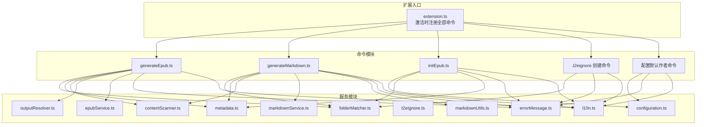
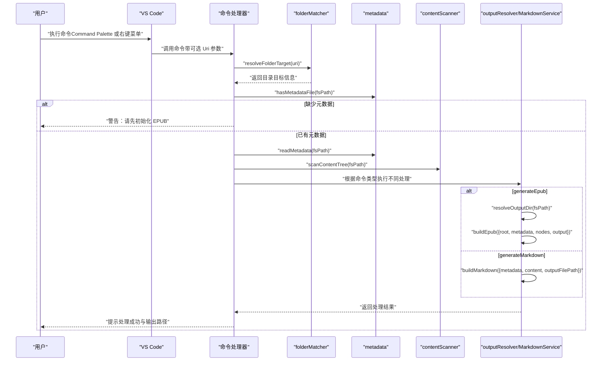
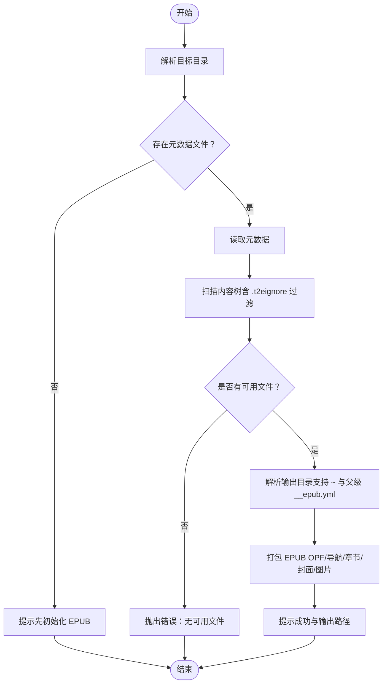
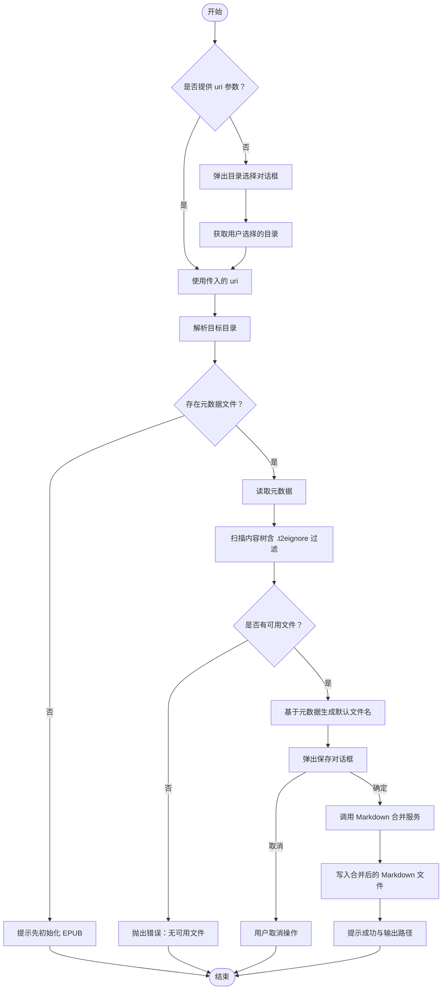
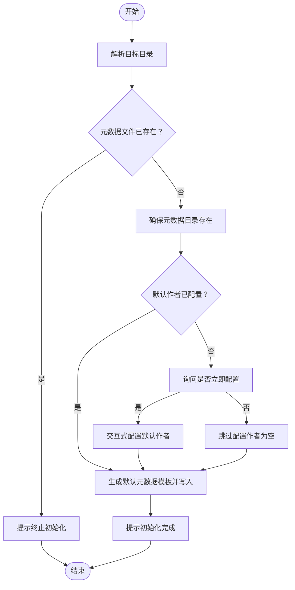
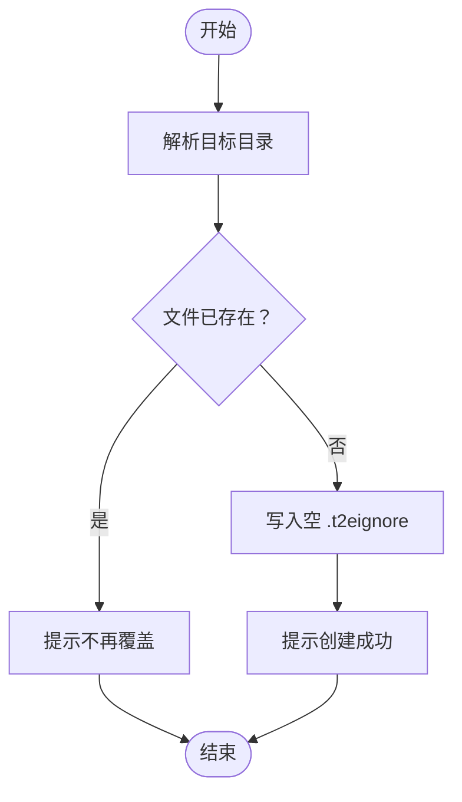
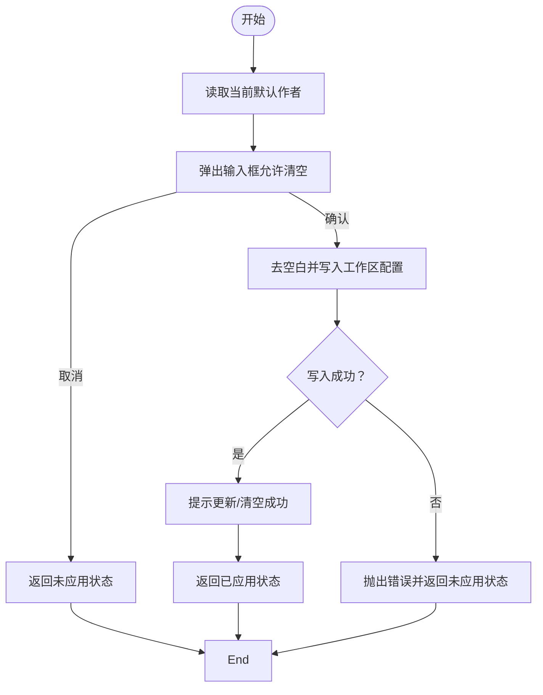
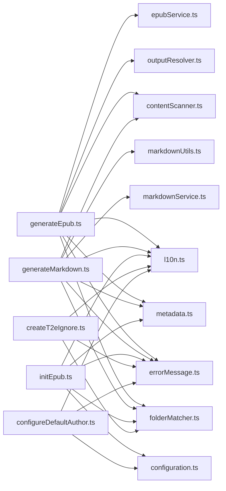

# 命令 API

<cite>
**本文引用的文件**
- [package.json](file://package.json)
- [extension.ts](file://src/extension.ts)
- [generateEpub.ts](file://src/commands/generateEpub.ts)
- [generateMarkdown.ts](file://src/commands/generateMarkdown.ts)
- [initEpub.ts](file://src/commands/initEpub.ts)
- [createT2eIgnore.ts](file://src/commands/createT2eIgnore.ts)
- [configureDefaultAuthor.ts](file://src/commands/configureDefaultAuthor.ts)
- [configuration.ts](file://src/services/configuration.ts)
- [folderMatcher.ts](file://src/services/folderMatcher.ts)
- [metadata.ts](file://src/services/metadata.ts)
- [contentScanner.ts](file://src/services/contentScanner.ts)
- [outputResolver.ts](file://src/services/outputResolver.ts)
- [epubService.ts](file://src/services/epubService.ts)
- [t2eIgnore.ts](file://src/services/t2eIgnore.ts)
- [errorMessage.ts](file://src/services/errorMessage.ts)
- [l10n.ts](file://src/services/l10n.ts)
- [markdownService.ts](file://src/services/markdownService.ts)
- [markdownUtils.ts](file://src/utils/markdownUtils.ts)
- [README.md](file://README.md)
</cite>

## 更新摘要
**变更内容**
- 新增 generateMarkdown 命令的完整文档描述
- 添加了 Markdown 合并生成服务的技术细节
- 更新了命令注册和依赖关系分析
- 完善了错误处理和用户反馈机制说明

## 目录
1. [简介](#简介)
2. [项目结构](#项目结构)
3. [核心组件](#核心组件)
4. [架构总览](#架构总览)
5. [详细组件分析](#详细组件分析)
6. [依赖关系分析](#依赖关系分析)
7. [性能考量](#性能考量)
8. [故障排除指南](#故障排除指南)
9. [结论](#结论)
10. [附录](#附录)

## 简介
本文件系统性梳理 VS Code 扩展 Folder2EPUB 的命令 API，覆盖所有已注册命令的接口定义、调用方式、参数与返回值、错误处理、执行流程、权限与安全注意事项，以及调试与排障方法。读者可据此在 VS Code 的 Command Palette 或资源管理器右键菜单中准确使用这些命令。

## 项目结构
- 命令注册集中在扩展入口文件中，按功能拆分为六个命令模块。
- 命令通过 VS Code 的命令注册机制暴露，同时在资源管理器右键菜单中提供快捷入口。
- 命令内部依赖若干服务模块，分别负责配置、元数据、内容扫描、输出目录解析、EPUB 打包、Markdown 合并等职责。

**图表来源**
- [extension.ts:14-20](file://src/extension.ts#L14-L20)
- [generateEpub.ts:18-65](file://src/commands/generateEpub.ts#L18-L65)
- [generateMarkdown.ts:17-75](file://src/commands/generateMarkdown.ts#L17-L75)
- [initEpub.ts:18-62](file://src/commands/initEpub.ts#L18-L62)
- [createT2eIgnore.ts:15-33](file://src/commands/createT2eIgnore.ts#L15-L33)
- [configureDefaultAuthor.ts:12-25](file://src/commands/configureDefaultAuthor.ts#L12-L25)

**章节来源**
- [package.json:43-105](file://package.json#L43-L105)
- [extension.ts:14-20](file://src/extension.ts#L14-L20)

## 核心组件
- generateEpub：将选定本地目录内的 md/txt 内容扫描、解析元数据、解析输出目录、打包 EPUB，并返回输出文件路径与章节数量。
- generateMarkdown：将选定本地目录内的 md/txt 内容扫描、解析元数据、合并为单一 Markdown 文件，并提供保存对话框。
- initEpub：在选定目录初始化元数据目录与元数据文件，必要时交互式配置默认作者。
- createT2eIgnore：在选定目录创建空的 .t2eignore 文件。
- configureDefaultAuthor：交互式配置当前工作区默认作者。

**章节来源**
- [generateEpub.ts:18-65](file://src/commands/generateEpub.ts#L18-L65)
- [generateMarkdown.ts:17-75](file://src/commands/generateMarkdown.ts#L17-L75)
- [initEpub.ts:18-62](file://src/commands/initEpub.ts#L18-L62)
- [createT2eIgnore.ts:15-33](file://src/commands/createT2eIgnore.ts#L15-L33)
- [configureDefaultAuthor.ts:12-25](file://src/commands/configureDefaultAuthor.ts#L12-L25)

## 架构总览
命令层负责用户交互与流程编排，服务层负责具体的数据处理与文件操作。命令通过统一的本地目录校验与元数据校验，串联内容扫描、输出目录解析与 EPUB 打包或 Markdown 合并。

**图表来源**
- [generateEpub.ts:19-65](file://src/commands/generateEpub.ts#L19-L65)
- [generateMarkdown.ts:18-75](file://src/commands/generateMarkdown.ts#L18-L75)
- [folderMatcher.ts:23-38](file://src/services/folderMatcher.ts#L23-L38)
- [metadata.ts:41-59](file://src/services/metadata.ts#L41-L59)
- [contentScanner.ts:51-58](file://src/services/contentScanner.ts#L51-L58)
- [outputResolver.ts:15-42](file://src/services/outputResolver.ts#L15-L42)
- [markdownService.ts:30-54](file://src/services/markdownService.ts#L30-L54)

## 详细组件分析

### 命令：generateEpub
- 命令 ID：folder2epub.generateEpub
- 访问路径：
  - Command Palette：Folder2EPUB: 生成 EPUB
  - 资源管理器右键菜单：在本地文件夹上右键，选择"生成 epub"
- 参数
  - uri?: vscode.Uri（可选）；若未提供，将使用当前选中的资源管理器条目。
- 返回值
  - 无显式返回；通过通知与信息提示告知结果。
- 错误处理
  - 若目标不是本地目录或非目录，抛出错误并提示。
  - 若缺少元数据文件，提示先执行"初始化 EPUB"。
  - 扫描阶段若无可用文件，抛出错误。
  - 打包阶段异常统一转为用户可读消息。
- 执行流程
  1) 校验并解析目标目录
  2) 检查元数据文件是否存在
  3) 读取元数据
  4) 扫描内容树（含 .t2eignore 过滤、数字前缀排序、index 文件处理）
  5) 解析输出目录（支持父级 __epub.yml 与 ~ 展开）
  6) 打包 EPUB（生成 mimetype、OPF、导航、章节、封面与图片资源）
  7) 输出成功信息与文件路径
- 权限与安全
  - 仅对本地文件系统进行读取与写入；写入目标由输出目录解析决定。
  - 不涉及网络请求，安全性较高。
- 使用场景
  - 已完成目录内容组织与元数据初始化后，一键生成 EPUB。
  - 配合 .t2eignore 控制扫描范围，配合 __epub.yml 控制输出位置。

**图表来源**
- [generateEpub.ts:19-65](file://src/commands/generateEpub.ts#L19-L65)
- [contentScanner.ts:51-58](file://src/services/contentScanner.ts#L51-L58)
- [outputResolver.ts:15-42](file://src/services/outputResolver.ts#L15-L42)
- [epubService.ts:146-216](file://src/services/epubService.ts#L146-L216)

**章节来源**
- [generateEpub.ts:18-65](file://src/commands/generateEpub.ts#L18-L65)
- [package.json:44-64](file://package.json#L44-L64)
- [README.md:35-47](file://README.md#L35-L47)

### 命令：generateMarkdown
- 命令 ID：folder2epub.generateMarkdown
- 访问路径：
  - Command Palette：Folder2EPUB: 生成合并 Markdown
  - 资源管理器右键菜单：在本地文件夹上右键，选择"生成合并 Markdown"
- 参数
  - uri?: vscode.Uri（可选）；若未提供，将弹出目录选择对话框。
- 返回值
  - 无显式返回；通过通知提示告知结果。
- 错误处理
  - 若目标不是本地目录或非目录，抛出错误并提示。
  - 若缺少元数据文件，提示先执行"初始化 EPUB"。
  - 扫描阶段若无可用文件，抛出错误。
  - 保存对话框取消时不执行任何操作。
  - 写入文件失败时统一转为错误消息。
- 执行流程
  1) 校验并解析目标目录（若未提供 uri 则弹出目录选择对话框）
  2) 检查元数据文件是否存在
  3) 读取元数据
  4) 扫描内容树（含 .t2eignore 过滤、数字前缀排序、index 文件处理）
  5) 生成默认文件名（基于元数据标题）
  6) 弹出保存对话框让用户选择输出路径
  7) 调用 Markdown 合并服务生成文件
  8) 输出成功信息与文件路径
- 权限与安全
  - 仅对本地文件系统进行读取与写入；写入目标由用户选择的保存路径决定。
  - 不涉及网络请求，安全性较高。
- 使用场景
  - 需要将目录内容导出为单一 Markdown 文件时使用。
  - 便于在其他工具中进一步处理或分享内容。
  - 支持图片过滤和标题层级调整，确保输出质量。

**图表来源**
- [generateMarkdown.ts:18-75](file://src/commands/generateMarkdown.ts#L18-L75)
- [contentScanner.ts:51-58](file://src/services/contentScanner.ts#L51-L58)
- [markdownService.ts:30-54](file://src/services/markdownService.ts#L30-L54)

**章节来源**
- [generateMarkdown.ts:17-75](file://src/commands/generateMarkdown.ts#L17-L75)
- [package.json:65-69](file://package.json#L65-L69)
- [README.md:49-56](file://README.md#L49-L56)

### 命令：initEpub
- 命令 ID：folder2epub.initEpub
- 访问路径：
  - Command Palette：Folder2EPUB: 初始化 EPUB
  - 资源管理器右键菜单：在本地文件夹上右键，选择"初始化 epub"
- 参数
  - uri?: vscode.Uri（可选）
- 返回值
  - 无显式返回；通过通知提示初始化状态。
- 错误处理
  - 若元数据文件已存在，提示终止初始化。
  - 若未配置默认作者，弹窗询问是否立即配置。
  - 写入元数据文件失败时统一转为错误消息。
- 执行流程
  1) 校验并解析目标目录
  2) 检查元数据文件是否已存在
  3) 确保元数据目录存在
  4) 读取默认作者（若为空则交互式配置）
  5) 生成默认元数据模板并写入
  6) 成功提示
- 权限与安全
  - 仅写入本地目录；无网络访问。
- 使用场景
  - 首次组织内容目录时，快速生成元数据与默认作者。

**图表来源**
- [initEpub.ts:19-62](file://src/commands/initEpub.ts#L19-L62)
- [configuration.ts:18-40](file://src/services/configuration.ts#L18-L40)
- [metadata.ts:24-33](file://src/services/metadata.ts#L24-L33)

**章节来源**
- [initEpub.ts:18-62](file://src/commands/initEpub.ts#L18-L62)
- [package.json:50-64](file://package.json#L50-L64)
- [README.md:27-34](file://README.md#L27-L34)

### 命令：createT2eIgnore
- 命令 ID：folder2epub.createT2eIgnore
- 访问路径：
  - Command Palette：Folder2EPUB: 新增 .t2eignore
  - 资源管理器右键菜单：在本地文件夹上右键，选择"新增 .t2eignore"
- 参数
  - uri?: vscode.Uri（可选）
- 返回值
  - 无显式返回；通过通知提示创建结果。
- 错误处理
  - 若 .t2eignore 已存在，提示不再覆盖。
  - 写入空文件失败时统一转为错误消息。
- 执行流程
  1) 校验并解析目标目录
  2) 检查 .t2eignore 是否已存在
  3) 写入空文件
  4) 成功提示
- 权限与安全
  - 仅写入本地目录；无网络访问。
- 使用场景
  - 需要控制扫描范围时，快速创建 .t2eignore 并添加规则。

**图表来源**
- [createT2eIgnore.ts:16-33](file://src/commands/createT2eIgnore.ts#L16-L33)
- [t2eIgnore.ts:13-26](file://src/services/t2eIgnore.ts#L13-L26)

**章节来源**
- [createT2eIgnore.ts:15-33](file://src/commands/createT2eIgnore.ts#L15-L33)
- [package.json:55-64](file://package.json#L55-L64)
- [README.md:32-34](file://README.md#L32-L34)

### 命令：configureDefaultAuthor
- 命令 ID：folder2epub.configureDefaultAuthor
- 访问路径：
  - Command Palette：Folder2EPUB: 配置当前 Workspace 默认作者
- 参数
  - 无
- 返回值
  - ConfigureDefaultAuthorResult：包含 applied 与 author 字段的对象。
- 错误处理
  - 若未打开工作区，抛出错误并提示。
  - 输入取消时返回未应用状态。
  - 写入配置失败时统一转为错误消息并返回未应用状态。
- 执行流程
  1) 读取当前默认作者
  2) 弹出输入框，允许编辑或清空
  3) 写入工作区配置
  4) 返回应用结果与最新作者值
- 权限与安全
  - 仅修改当前工作区设置；无网络访问。
- 使用场景
  - 在初始化 EPUB 之前，提前设定默认作者，避免重复输入。

**图表来源**
- [configureDefaultAuthor.ts:13-25](file://src/commands/configureDefaultAuthor.ts#L13-L25)
- [configuration.ts:47-79](file://src/services/configuration.ts#L47-L79)

**章节来源**
- [configureDefaultAuthor.ts:12-25](file://src/commands/configureDefaultAuthor.ts#L12-L25)
- [package.json:61-64](file://package.json#L61-L64)
- [README.md:66-71](file://README.md#L66-L71)

## 依赖关系分析
- 命令与服务的耦合
  - generateEpub 依赖 folderMatcher（目录校验）、metadata（元数据读取与格式化）、contentScanner（内容扫描）、outputResolver（输出目录解析）、epubService（EPUB 打包）、errorMessage（错误消息）、l10n（本地化）。
  - generateMarkdown 依赖 folderMatcher（目录校验）、metadata（元数据读取与格式化）、contentScanner（内容扫描）、markdownService（Markdown 合并）、markdownUtils（Frontmatter 解析）、errorMessage（错误消息）、l10n（本地化）。
  - initEpub 依赖 configuration（默认作者配置）、folderMatcher（目录校验）、metadata（默认模板生成）、errorMessage、l10n。
  - createT2eIgnore 依赖 folderMatcher（目录校验）、errorMessage、l10n。
  - configureDefaultAuthor 依赖 configuration、errorMessage、l10n。
- 外部依赖
  - jszip、markdown-it、yaml、ignore 等库用于 EPUB 打包、Markdown 渲染、YAML 解析与 .t2eignore 过滤。

**图表来源**
- [generateEpub.ts:5-11](file://src/commands/generateEpub.ts#L5-L11)
- [generateMarkdown.ts:5-10](file://src/commands/generateMarkdown.ts#L5-L10)
- [initEpub.ts:4-8](file://src/commands/initEpub.ts#L4-L8)
- [createT2eIgnore.ts:6-8](file://src/commands/createT2eIgnore.ts#L6-L8)
- [configureDefaultAuthor.ts:3-5](file://src/commands/configureDefaultAuthor.ts#L3-L5)

**章节来源**
- [package.json:107-112](file://package.json#L107-L112)

## 性能考量
- 扫描与渲染
  - 内容扫描采用深度优先与自然排序，复杂度受目录层级与文件数量影响；建议合理组织目录结构，减少不必要的子目录与大文件。
  - Markdown 渲染与图片重写在内存中进行，大体量图片会增加内存占用；建议控制图片尺寸与数量。
  - Markdown 合并服务会读取所有文件内容到内存中进行处理，对于大型项目可能消耗较多内存。
- 打包压缩
  - EPUB 打包使用 JSZip 压缩，I/O 为主要瓶颈；输出目录位于本地磁盘时性能最佳。
- 进度反馈
  - generateEpub 使用进度通知分阶段提示，有助于用户感知耗时。
  - generateMarkdown 会在文件写入完成后提示完成，但不会显示进度条。

## 故障排除指南
- 常见问题与排查
  - "请先初始化 EPUB"：确认目标目录存在 __t2e.data/metadata.yml；或先执行"初始化 EPUB"。
  - "无可用文件"：确认目录包含 .md/.txt 文件；检查 .t2eignore 规则是否过度过滤；确认目录未被 __t2e.data 排除。
  - "未配置默认作者"：执行"配置当前 Workspace 默认作者"，或在初始化时选择立即配置。
  - "输出目录解析失败"：检查父级 __epub.yml 的 saveTo 配置；确认路径可解析且存在。
  - "封面文件未找到或格式不支持"：确认 metadata.yml 中 cover 指向的文件存在于 __t2e.data；仅支持常见图片格式。
  - "生成 Markdown 失败"：检查磁盘空间是否充足；确认目标路径具有写入权限；查看 VS Code 输出面板获取详细错误信息。
- 调试建议
  - 使用 VS Code 调试扩展，断点定位在命令注册与关键服务函数处。
  - 查看输出面板中的日志与错误消息，结合本地化提示定位问题。
  - 逐步验证：先 initEpub，再 createT2eIgnore，最后 generateEpub 或 generateMarkdown。

**章节来源**
- [generateEpub.ts:20-63](file://src/commands/generateEpub.ts#L20-L63)
- [generateMarkdown.ts:20-73](file://src/commands/generateMarkdown.ts#L20-L73)
- [initEpub.ts:20-60](file://src/commands/initEpub.ts#L20-L60)
- [epubService.ts:604-633](file://src/services/epubService.ts#L604-L633)
- [README.md:131-135](file://README.md#L131-L135)

## 结论
本扩展通过六个核心命令与一组配套服务，实现了从目录到 EPUB 和 Markdown 的完整工作流。命令接口简洁、执行流程清晰、错误处理一致，适合在 VS Code 中高效组织与导出电子书内容。新增的 generateMarkdown 命令为用户提供了更多样化的输出选项，特别适用于需要将内容导出为单一 Markdown 文件的场景。建议在使用前完成默认作者配置与必要的 .t2eignore 规则设置，以获得最佳体验。

## 附录

### 命令清单与接口定义
- generateEpub
  - 命令 ID：folder2epub.generateEpub
  - 参数：uri?: vscode.Uri
  - 返回：无（通过通知提示）
  - 错误：缺少元数据、无可用文件、打包异常
  - 适用场景：已有元数据与内容，一键生成 EPUB
- generateMarkdown
  - 命令 ID：folder2epub.generateMarkdown
  - 参数：uri?: vscode.Uri（可选）
  - 返回：无（通过通知提示）
  - 错误：缺少元数据、无可用文件、保存失败、写入失败
  - 适用场景：将目录内容合并为单一 Markdown 文件
- initEpub
  - 命令 ID：folder2epub.initEpub
  - 参数：uri?: vscode.Uri
  - 返回：无（通过通知提示）
  - 错误：元数据已存在、配置默认作者失败
  - 适用场景：首次初始化元数据与默认作者
- createT2eIgnore
  - 命令 ID：folder2epub.createT2eIgnore
  - 参数：uri?: vscode.Uri
  - 返回：无（通过通知提示）
  - 错误：文件已存在、写入失败
  - 适用场景：控制扫描范围
- configureDefaultAuthor
  - 命令 ID：folder2epub.configureDefaultAuthor
  - 参数：无
  - 返回：ConfigureDefaultAuthorResult（applied, author）
  - 错误：未打开工作区、写入失败
  - 适用场景：配置当前工作区默认作者

**章节来源**
- [package.json:44-69](file://package.json#L44-L69)
- [extension.ts:14-20](file://src/extension.ts#L14-L20)
- [configuration.ts:8-11](file://src/services/configuration.ts#L8-L11)

### Markdown 合并服务技术细节
- buildMarkdown 函数
  - 输入：metadata（元数据）、content（内容扫描结果）、outputFilePath（输出文件路径）
  - 输出：BuildMarkdownResult（包含 chapterCount 和 outputFilePath）
  - 功能：将内容树合并为单一 Markdown 文件，包含标题、作者信息和内容
- processNodes 函数
  - 递归处理内容树，支持嵌套目录结构
  - 文件夹输出分组标题，文件输出标题与内容
  - 支持 index 文件的特殊处理
- readFileContent 函数
  - 读取单个文件内容，处理 Frontmatter
  - 过滤 Markdown 图片和 HTML img 标签
  - 调整内容中的子标题层级，避免与外层标题冲突
- parseMarkdownFrontmatter 函数
  - 解析 Markdown 文件开头的 YAML Frontmatter
  - 提取 title 并返回清除 Frontmatter 后的内容
- 标题层级处理函数
  - normalizeMarkdownHeadings：将 Markdown 内容中的标题层级规范化，统一从 # 开始
  - adjustMarkdownHeadings：根据章节层级调整内容中的子标题层级，避免与外层标题冲突
  - 两个函数都跳过 fenced code block 内的行，确保代码块不受影响

**章节来源**
- [markdownService.ts:10-238](file://src/services/markdownService.ts#L10-L238)
- [markdownUtils.ts:1-26](file://src/utils/markdownUtils.ts#L1-L26)