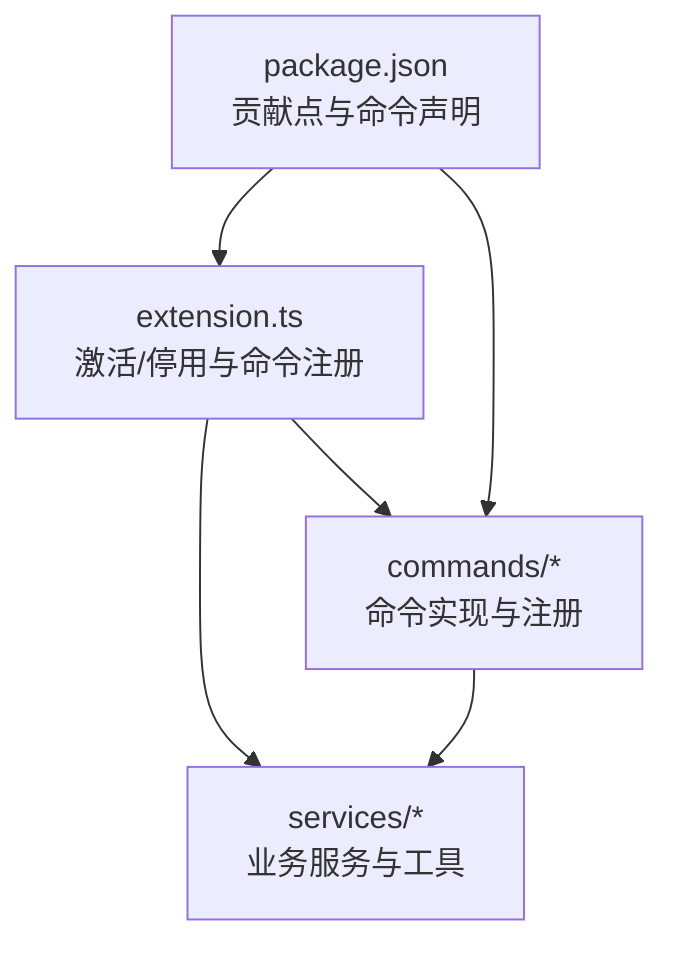
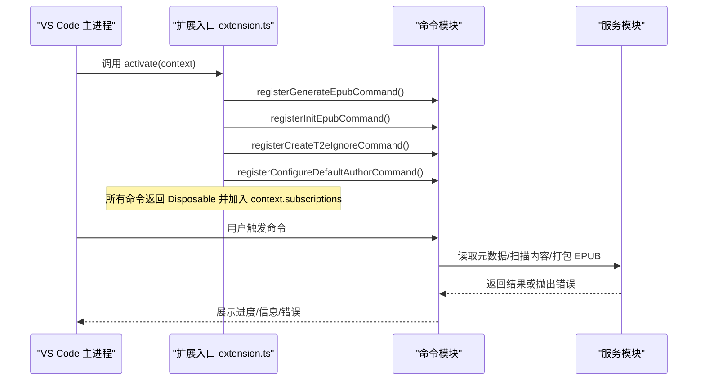
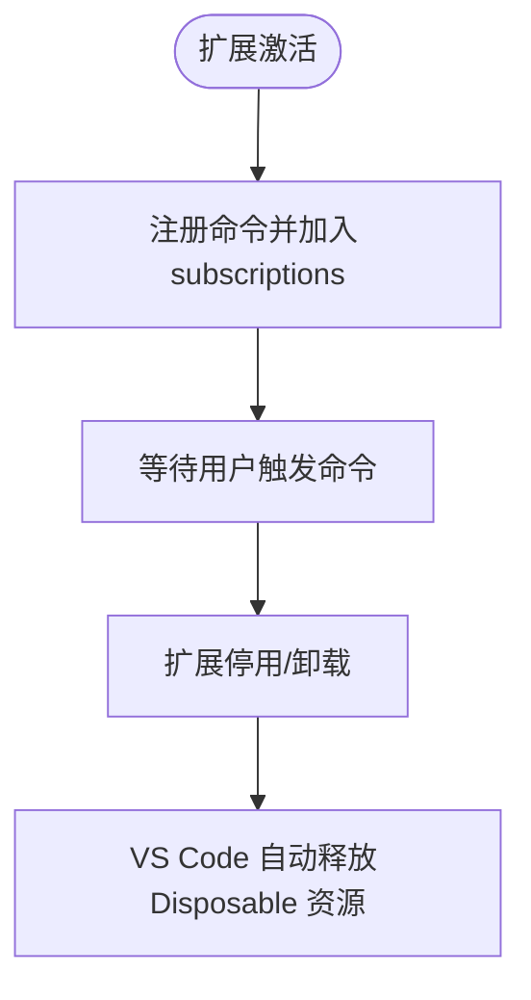
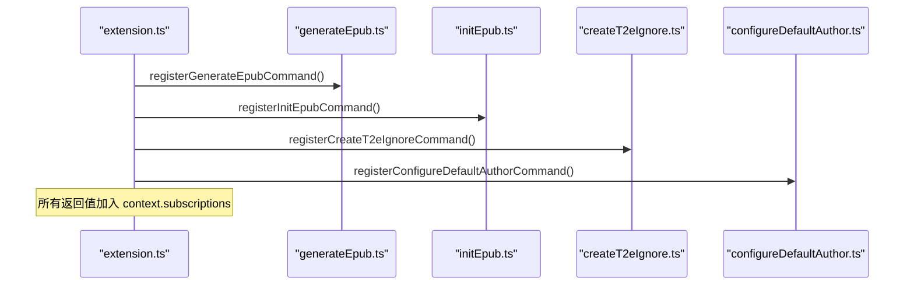
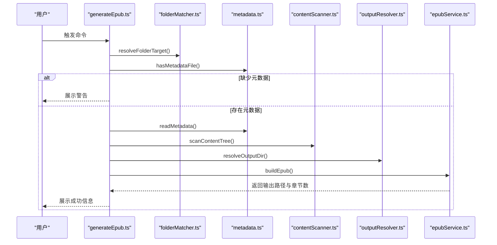
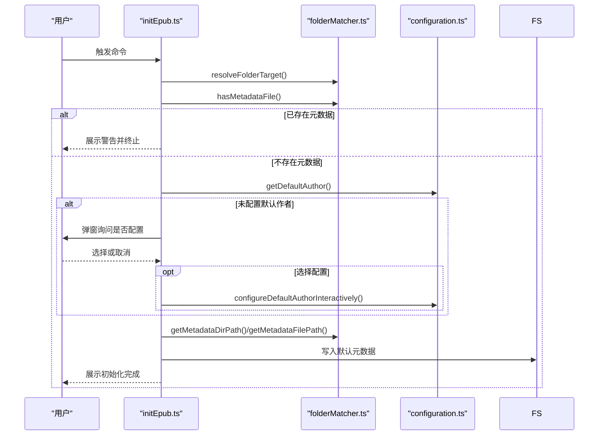
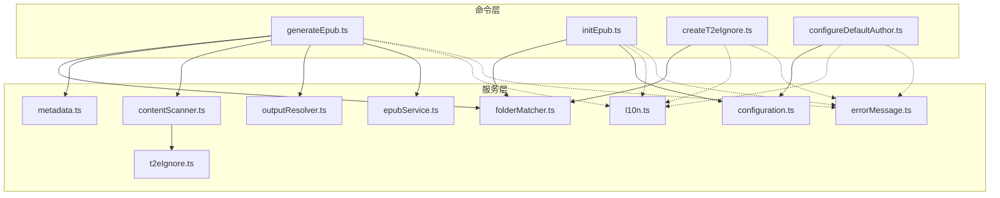
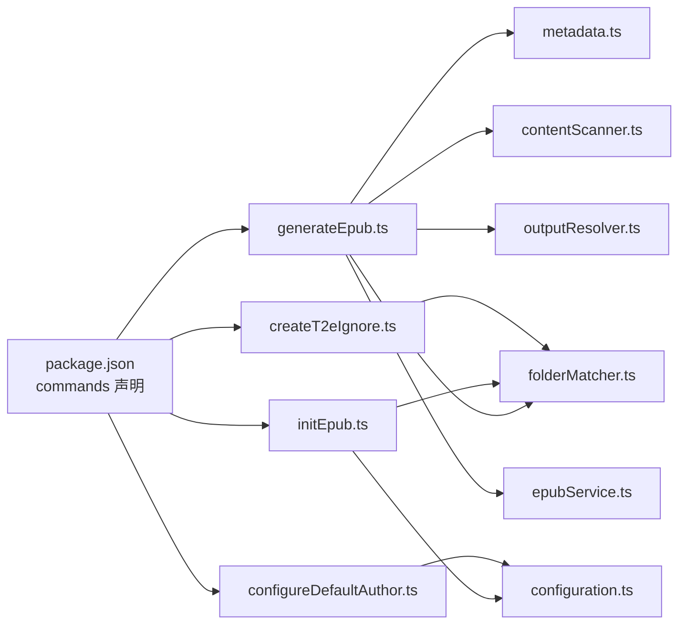

# 扩展生命周期

<cite>
**本文引用的文件**
- [extension.ts](file://src/extension.ts)
- [package.json](file://package.json)
- [generateEpub.ts](file://src/commands/generateEpub.ts)
- [initEpub.ts](file://src/commands/initEpub.ts)
- [createT2eIgnore.ts](file://src/commands/createT2eIgnore.ts)
- [configureDefaultAuthor.ts](file://src/commands/configureDefaultAuthor.ts)
- [configuration.ts](file://src/services/configuration.ts)
- [contentScanner.ts](file://src/services/contentScanner.ts)
- [epubService.ts](file://src/services/epubService.ts)
- [metadata.ts](file://src/services/metadata.ts)
- [folderMatcher.ts](file://src/services/folderMatcher.ts)
- [outputResolver.ts](file://src/services/outputResolver.ts)
- [t2eIgnore.ts](file://src/services/t2eIgnore.ts)
- [l10n.ts](file://src/services/l10n.ts)
- [errorMessage.ts](file://src/services/errorMessage.ts)
</cite>

## 目录
1. [简介](#简介)
2. [项目结构](#项目结构)
3. [核心组件](#核心组件)
4. [架构总览](#架构总览)
5. [详细组件分析](#详细组件分析)
6. [依赖关系分析](#依赖关系分析)
7. [性能考虑](#性能考虑)
8. [故障排查指南](#故障排查指南)
9. [结论](#结论)
10. [附录](#附录)

## 简介
本文件聚焦 VS Code Folder2EPUB 扩展的生命周期 API，系统阐述扩展的激活与停用流程、扩展上下文的使用与订阅管理、命令注册的生命周期与管理机制、扩展状态管理与资源清理最佳实践、与 VS Code 主进程的通信方式、调试与监控相关 API、热重载与动态更新机制，以及性能监控与诊断工具的使用方法。文档面向不同技术背景的读者，既提供高层概览，也包含代码级细节与可视化图示。

## 项目结构
扩展采用“入口文件 + 命令模块 + 服务模块”的分层组织方式：
- 入口文件负责激活与停用钩子，集中注册所有命令并将命令对象纳入上下文订阅。
- 命令模块封装具体功能，每个命令均返回一个可释放对象，以便统一管理。
- 服务模块提供业务能力，如元数据读取、内容扫描、EPUB 打包、配置管理等。

图表来源
- [extension.ts:13-23](file://src/extension.ts#L13-L23)
- [package.json:44-95](file://package.json#L44-L95)

章节来源
- [extension.ts:1-24](file://src/extension.ts#L1-L24)
- [package.json:1-114](file://package.json#L1-L114)

## 核心组件
- 激活函数 activate(context: ExtensionContext): 在扩展被启用时调用，负责注册所有命令并将返回的可释放对象加入 context.subscriptions，实现自动资源回收。
- 停用函数 deactivate(): 预留停用钩子，当前为空实现，便于未来扩展清理逻辑。
- 命令注册：每个命令通过 registerXxxCommand() 返回 vscode.Disposable，由激活函数统一订阅。
- 扩展上下文与订阅管理：通过 context.subscriptions 管理命令、事件监听器等资源，VS Code 在扩展停用或卸载时自动释放这些资源。
- 与 VS Code 主进程通信：通过 vscode.* API（命令注册、窗口提示、进度、工作区配置、国际化等）与主进程交互。

章节来源
- [extension.ts:13-23](file://src/extension.ts#L13-L23)
- [package.json:44-95](file://package.json#L44-L95)

## 架构总览
扩展生命周期的关键流程如下：
- VS Code 加载扩展后调用 activate，激活函数注册四个命令。
- 用户在菜单或命令面板触发命令，对应命令处理器执行业务流程。
- 命令内部通过服务模块完成元数据读取、内容扫描、EPUB 打包等操作。
- 错误通过统一的错误消息转换函数进行展示。
- deactivate 作为预留钩子，当前无需额外逻辑。

图表来源
- [extension.ts:13-18](file://src/extension.ts#L13-L18)
- [generateEpub.ts:18-65](file://src/commands/generateEpub.ts#L18-L65)
- [initEpub.ts:18-62](file://src/commands/initEpub.ts#L18-L62)
- [createT2eIgnore.ts:15-33](file://src/commands/createT2eIgnore.ts#L15-L33)
- [configureDefaultAuthor.ts:12-25](file://src/commands/configureDefaultAuthor.ts#L12-L25)

## 详细组件分析

### 激活与停用钩子
- activate(context):
  - 作用：集中注册所有命令，将命令返回的可释放对象加入 context.subscriptions，确保扩展停用或卸载时自动释放资源。
  - 订阅管理：通过 push 多个 Disposable，形成统一的资源生命周期管理。
- deactivate():
  - 作用：预留停用钩子，当前为空实现，便于未来扩展清理逻辑（如关闭长连接、取消定时任务等）。

图表来源
- [extension.ts:13-23](file://src/extension.ts#L13-L23)

章节来源
- [extension.ts:13-23](file://src/extension.ts#L13-L23)

### 命令注册与生命周期管理
- 四个命令均由独立模块实现，每个模块提供 registerXxxCommand()，返回 vscode.Disposable。
- 命令注册清单在 package.json 的 contributes.commands 中声明，确保命令在菜单与命令面板可见。
- 命令触发后执行异步流程，期间可使用进度条与通知向用户反馈状态。

图表来源
- [extension.ts:13-18](file://src/extension.ts#L13-L18)
- [package.json:44-64](file://package.json#L44-L64)

章节来源
- [generateEpub.ts:18-65](file://src/commands/generateEpub.ts#L18-L65)
- [initEpub.ts:18-62](file://src/commands/initEpub.ts#L18-L62)
- [createT2eIgnore.ts:15-33](file://src/commands/createT2eIgnore.ts#L15-L33)
- [configureDefaultAuthor.ts:12-25](file://src/commands/configureDefaultAuthor.ts#L12-L25)
- [package.json:44-95](file://package.json#L44-L95)

### 生成 EPUB 命令（registerGenerateEpubCommand）
- 功能链路：解析目标目录 → 校验元数据文件是否存在 → 读取元数据 → 扫描内容树 → 解析输出目录 → 打包 EPUB → 显示结果或错误。
- 进度反馈：使用 withProgress 提供阶段性进度提示，提升用户体验。
- 错误处理：统一通过错误消息转换函数展示可读错误信息。

图表来源
- [generateEpub.ts:19-57](file://src/commands/generateEpub.ts#L19-L57)
- [folderMatcher.ts:23-38](file://src/services/folderMatcher.ts#L23-L38)
- [metadata.ts:41-59](file://src/services/metadata.ts#L41-L59)
- [contentScanner.ts:51-58](file://src/services/contentScanner.ts#L51-L58)
- [outputResolver.ts:15-42](file://src/services/outputResolver.ts#L15-L42)
- [epubService.ts:146-216](file://src/services/epubService.ts#L146-L216)

章节来源
- [generateEpub.ts:18-65](file://src/commands/generateEpub.ts#L18-L65)
- [folderMatcher.ts:1-85](file://src/services/folderMatcher.ts#L1-L85)
- [metadata.ts:1-157](file://src/services/metadata.ts#L1-L157)
- [contentScanner.ts:1-340](file://src/services/contentScanner.ts#L1-L340)
- [outputResolver.ts:1-90](file://src/services/outputResolver.ts#L1-L90)
- [epubService.ts:146-216](file://src/services/epubService.ts#L146-L216)

### 初始化 EPUB 命令（registerInitEpubCommand）
- 功能：在目标目录创建元数据目录与默认元数据文件；若工作区未配置默认作者，引导用户交互式配置。
- 交互：通过窗口警告与信息提示，引导用户完成初始化。

图表来源
- [initEpub.ts:19-56](file://src/commands/initEpub.ts#L19-L56)
- [folderMatcher.ts:23-38](file://src/services/folderMatcher.ts#L23-L38)
- [configuration.ts:18-79](file://src/services/configuration.ts#L18-L79)

章节来源
- [initEpub.ts:18-62](file://src/commands/initEpub.ts#L18-L62)
- [configuration.ts:1-80](file://src/services/configuration.ts#L1-L80)

### 创建 .t2eignore 命令（registerCreateT2eIgnoreCommand）
- 功能：在目标目录创建空的 .t2eignore 文件，便于后续内容扫描时忽略特定文件或目录。
- 行为：若文件已存在则提示警告，否则创建空文件并提示成功。

章节来源
- [createT2eIgnore.ts:15-33](file://src/commands/createT2eIgnore.ts#L15-L33)
- [t2eIgnore.ts:13-26](file://src/services/t2eIgnore.ts#L13-L26)

### 配置默认作者命令（registerConfigureDefaultAuthorCommand）
- 功能：交互式配置当前工作区的默认作者，并返回配置结果。
- 交互：弹出输入框，支持清空配置；配置成功后提示信息。

章节来源
- [configureDefaultAuthor.ts:12-25](file://src/commands/configureDefaultAuthor.ts#L12-L25)
- [configuration.ts:47-79](file://src/services/configuration.ts#L47-L79)

### 服务模块与数据流
- 元数据管理：读取/写入 __t2e.data/metadata.yml，提供默认模板与文件名格式化。
- 内容扫描：解析目录结构，支持数字前缀排序、index 文件定位、.t2eignore 过滤。
- 输出解析：自上而下查找 __epub.yml 并解析 saveTo 配置，支持 ~ 展开。
- EPUB 打包：基于 MarkdownIt 渲染、JSZip 打包，生成 EPUB 3 标准文件。
- 国际化与错误处理：统一使用 l10n.t() 与 toErrorMessage()。

图表来源
- [generateEpub.ts:18-65](file://src/commands/generateEpub.ts#L18-L65)
- [initEpub.ts:18-62](file://src/commands/initEpub.ts#L18-L62)
- [createT2eIgnore.ts:15-33](file://src/commands/createT2eIgnore.ts#L15-L33)
- [configureDefaultAuthor.ts:12-25](file://src/commands/configureDefaultAuthor.ts#L12-L25)
- [folderMatcher.ts:1-85](file://src/services/folderMatcher.ts#L1-L85)
- [metadata.ts:1-157](file://src/services/metadata.ts#L1-L157)
- [contentScanner.ts:1-340](file://src/services/contentScanner.ts#L1-L340)
- [outputResolver.ts:1-90](file://src/services/outputResolver.ts#L1-L90)
- [epubService.ts:146-216](file://src/services/epubService.ts#L146-L216)
- [configuration.ts:1-80](file://src/services/configuration.ts#L1-L80)
- [l10n.ts:1-10](file://src/services/l10n.ts#L1-L10)
- [errorMessage.ts:1-16](file://src/services/errorMessage.ts#L1-L16)
- [t2eIgnore.ts:1-45](file://src/services/t2eIgnore.ts#L1-L45)

章节来源
- [metadata.ts:1-157](file://src/services/metadata.ts#L1-L157)
- [contentScanner.ts:1-340](file://src/services/contentScanner.ts#L1-L340)
- [outputResolver.ts:1-90](file://src/services/outputResolver.ts#L1-L90)
- [epubService.ts:146-216](file://src/services/epubService.ts#L146-L216)
- [configuration.ts:1-80](file://src/services/configuration.ts#L1-L80)
- [l10n.ts:1-10](file://src/services/l10n.ts#L1-L10)
- [errorMessage.ts:1-16](file://src/services/errorMessage.ts#L1-L16)
- [t2eIgnore.ts:1-45](file://src/services/t2eIgnore.ts#L1-L45)

## 依赖关系分析
- package.json 的 contributes.commands 声明了四个命令，分别与各命令模块一一对应。
- 命令模块依赖服务模块完成业务逻辑，服务模块之间存在清晰的职责边界。
- 扩展上下文 subscriptions 作为统一的资源生命周期管理容器，避免资源泄漏。

图表来源
- [package.json:44-95](file://package.json#L44-L95)
- [generateEpub.ts:18-65](file://src/commands/generateEpub.ts#L18-L65)
- [initEpub.ts:18-62](file://src/commands/initEpub.ts#L18-L62)
- [createT2eIgnore.ts:15-33](file://src/commands/createT2eIgnore.ts#L15-L33)
- [configureDefaultAuthor.ts:12-25](file://src/commands/configureDefaultAuthor.ts#L12-L25)
- [folderMatcher.ts:1-85](file://src/services/folderMatcher.ts#L1-L85)
- [metadata.ts:1-157](file://src/services/metadata.ts#L1-L157)
- [contentScanner.ts:1-340](file://src/services/contentScanner.ts#L1-L340)
- [outputResolver.ts:1-90](file://src/services/outputResolver.ts#L1-L90)
- [epubService.ts:146-216](file://src/services/epubService.ts#L146-L216)
- [configuration.ts:1-80](file://src/services/configuration.ts#L1-L80)

章节来源
- [package.json:44-95](file://package.json#L44-L95)

## 性能考虑
- I/O 优化：内容扫描与文件读取集中在服务模块，建议在命令层仅做轻量调度，避免在 UI 线程阻塞。
- 进度反馈：使用 withProgress 分阶段报告，减少长时间无响应带来的体验问题。
- 资源释放：通过 context.subscriptions 自动释放命令资源，避免内存泄漏。
- 打包策略：EPUB 打包使用 JSZip，注意大文件场景下的内存占用，必要时可分批处理或限制并发。

## 故障排查指南
- 常见错误类型与处理：
  - 目录校验失败：检查命令触发来源是否为本地目录。
  - 元数据缺失：提示先执行初始化命令。
  - 扫描无可用文件：确认目录中存在 md/txt 文件且未被 .t2eignore 过滤。
  - 输出目录解析失败：检查 __epub.yml 的 saveTo 配置是否有效。
- 统一错误展示：使用 toErrorMessage() 将异常转换为可读消息，结合 l10n.t() 进行本地化。
- 调试建议：
  - 使用 VS Code 开发者工具查看扩展日志。
  - 在命令执行前后添加日志标记，定位耗时步骤。
  - 对 I/O 操作增加超时与重试策略（如适用）。

章节来源
- [folderMatcher.ts:23-38](file://src/services/folderMatcher.ts#L23-L38)
- [generateEpub.ts:23-26](file://src/commands/generateEpub.ts#L23-L26)
- [contentScanner.ts:51-58](file://src/services/contentScanner.ts#L51-L58)
- [outputResolver.ts:15-42](file://src/services/outputResolver.ts#L15-L42)
- [errorMessage.ts:9-15](file://src/services/errorMessage.ts#L9-L15)
- [l10n.ts:1-10](file://src/services/l10n.ts#L1-L10)

## 结论
本扩展通过清晰的入口激活与命令注册机制，实现了稳定的生命周期管理。命令模块与服务模块职责分离，配合 VS Code 的上下文订阅机制，确保资源的自动释放与良好的用户体验。未来可在 deactivate 中扩展清理逻辑，并针对大文件场景进一步优化 I/O 与内存使用。

## 附录
- 与 VS Code 主进程通信要点：
  - 命令注册与调用：通过 vscode.commands.registerCommand 与命令面板/菜单触发。
  - 窗口交互：使用 vscode.window.showInformationMessage/showWarningMessage/showErrorMessage 与进度条。
  - 工作区配置：通过 vscode.workspace.getConfiguration 读取与更新设置。
  - 国际化：通过 vscode.l10n.t() 进行本地化消息输出。
- 热重载与动态更新：
  - 开发模式下可通过监视脚本与构建工具实现增量编译与重启。
  - 发布版本遵循 package.json 的脚本与引擎要求，确保兼容性。
- 性能监控与诊断：
  - 使用 VS Code 的输出面板与开发者工具查看扩展日志。
  - 在关键流程中插入计时与日志，定位性能瓶颈。