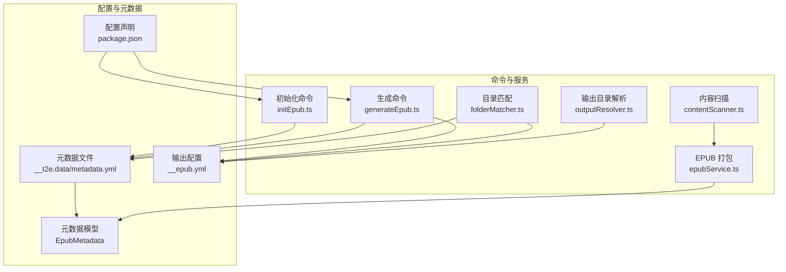
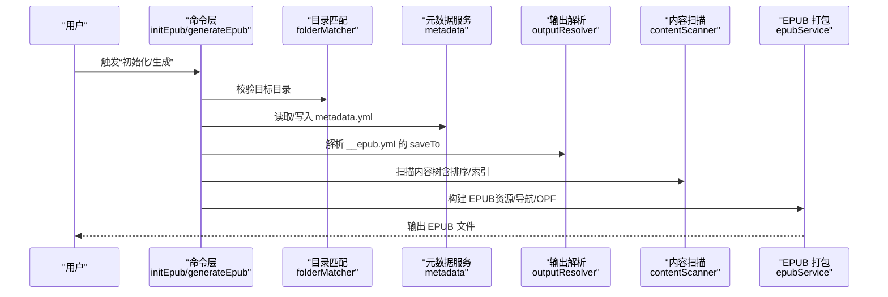
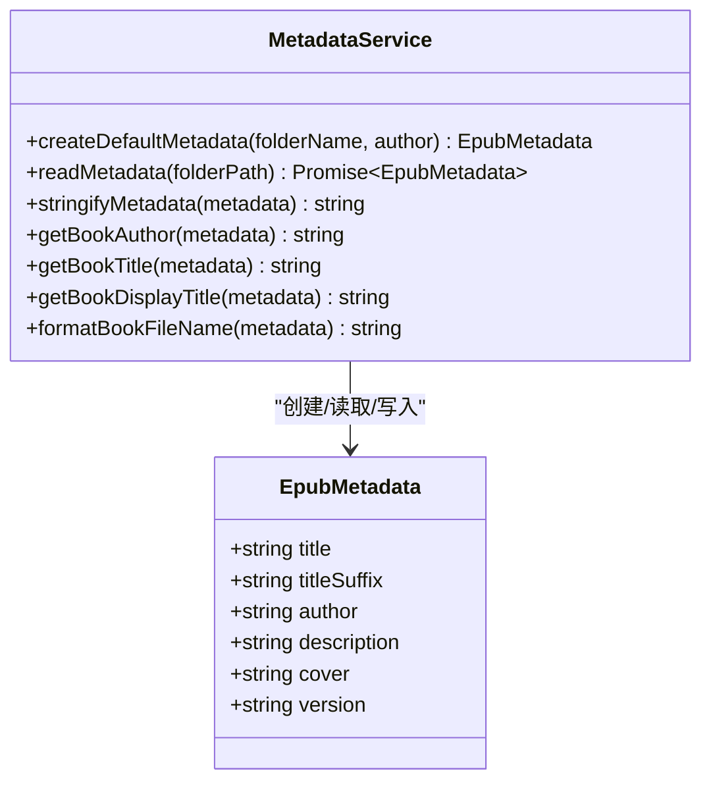
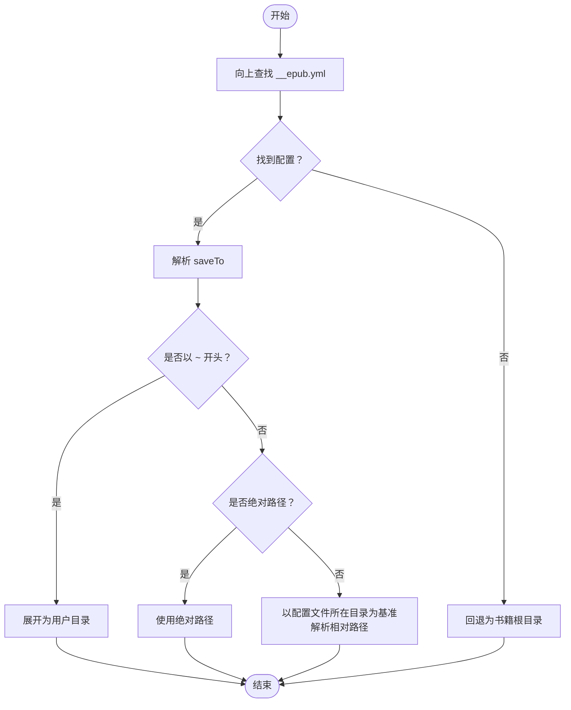
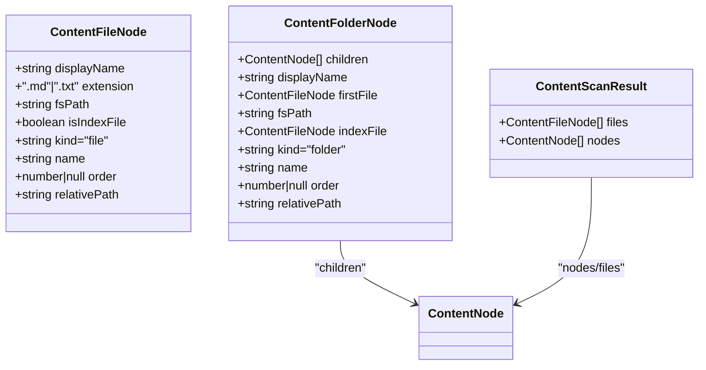
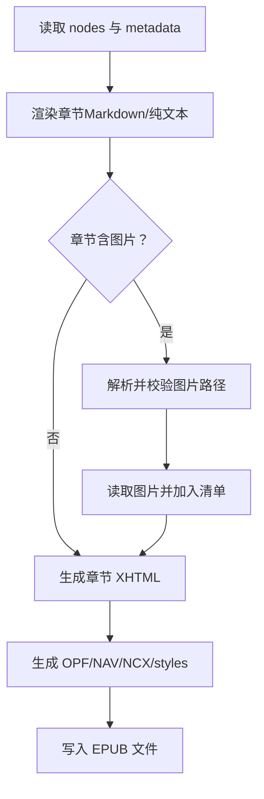
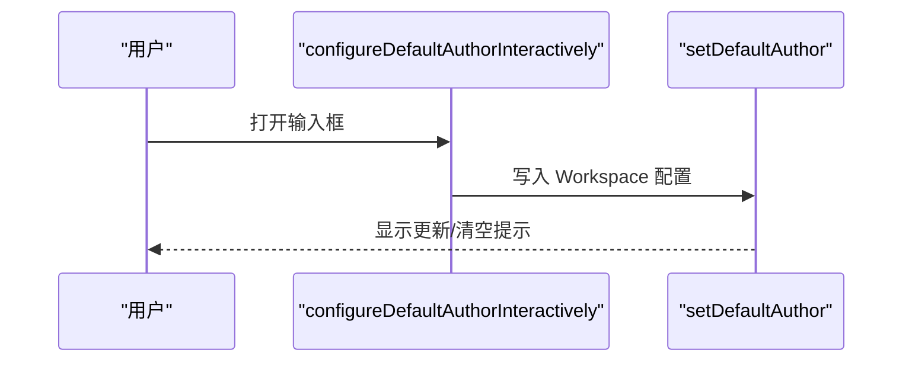
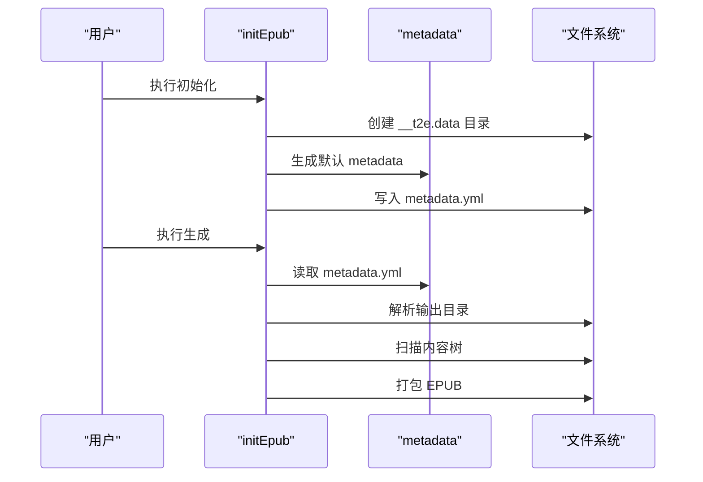
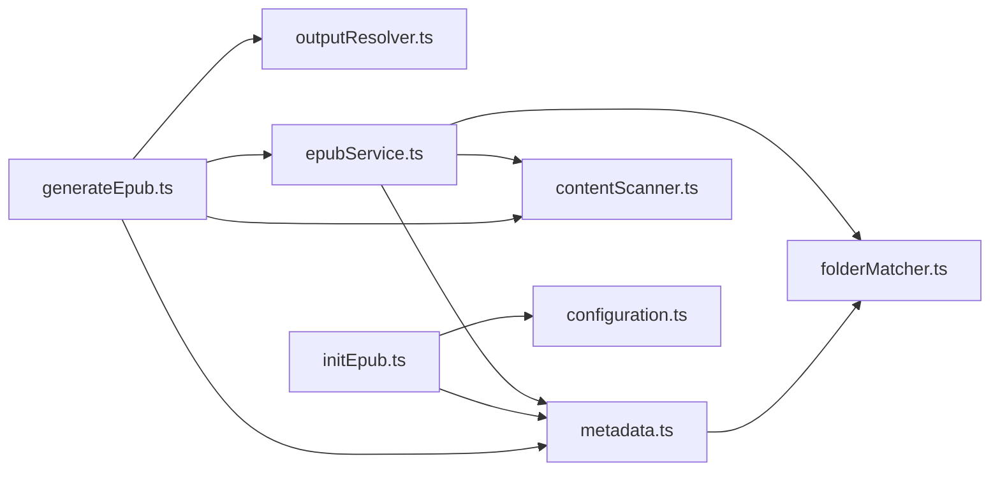
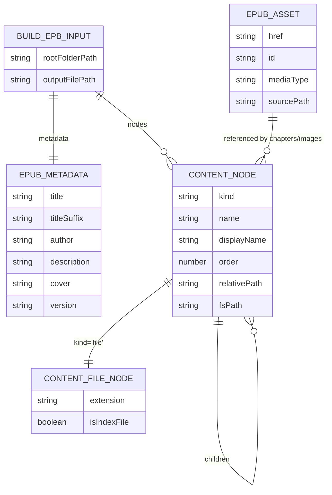

# 数据模型

<cite>
**本文引用的文件**
- [metadata.ts](file://src/services/metadata.ts)
- [configuration.ts](file://src/services/configuration.ts)
- [outputResolver.ts](file://src/services/outputResolver.ts)
- [folderMatcher.ts](file://src/services/folderMatcher.ts)
- [contentScanner.ts](file://src/services/contentScanner.ts)
- [epubService.ts](file://src/services/epubService.ts)
- [initEpub.ts](file://src/commands/initEpub.ts)
- [generateEpub.ts](file://src/commands/generateEpub.ts)
- [__epub.yml](file://example/__epub.yml)
- [metadata.yml](file://example/init-folder/__t2e.data/metadata.yml)
- [package.json](file://package.json)
- [README.md](file://README.md)
</cite>

## 目录
1. [简介](#简介)
2. [项目结构](#项目结构)
3. [核心组件](#核心组件)
4. [架构总览](#架构总览)
5. [详细组件分析](#详细组件分析)
6. [依赖分析](#依赖分析)
7. [性能考虑](#性能考虑)
8. [故障排查指南](#故障排查指南)
9. [结论](#结论)
10. [附录](#附录)

## 简介
本文件系统化梳理 VS Code Folder2EPUB 扩展的数据模型，涵盖 EPUB 元数据模型、配置文件格式、输出路径结构、文件命名约定与目录结构要求，并说明 YAML 配置字段定义、数据类型与验证规则，记录序列化/反序列化过程、错误处理机制、版本兼容性与迁移建议。

## 项目结构
围绕数据模型的关键文件与职责如下：
- 元数据与文件命名：metadata.ts
- 输出目录解析：outputResolver.ts
- 目录与文件常量：folderMatcher.ts
- 内容扫描与排序：contentScanner.ts
- EPUB 打包与资源处理：epubService.ts
- 初始化与生成命令：initEpub.ts、generateEpub.ts
- VS Code 配置声明：package.json
- 示例配置与元数据：example/__epub.yml、example/init-folder/__t2e.data/metadata.yml
- 项目说明与约定：README.md

图表来源
- [package.json:66-76](file://package.json#L66-L76)
- [metadata.ts:8-15](file://src/services/metadata.ts#L8-L15)
- [folderMatcher.ts:7-9](file://src/services/folderMatcher.ts#L7-L9)
- [outputResolver.ts:15-42](file://src/services/outputResolver.ts#L15-L42)
- [contentScanner.ts:10-38](file://src/services/contentScanner.ts#L10-L38)
- [epubService.ts:93-131](file://src/services/epubService.ts#L93-L131)
- [initEpub.ts:18-62](file://src/commands/initEpub.ts#L18-L62)
- [generateEpub.ts:18-65](file://src/commands/generateEpub.ts#L18-L65)

章节来源
- [package.json:66-76](file://package.json#L66-L76)
- [README.md:48-122](file://README.md#L48-L122)

## 核心组件
- 元数据模型 EpubMetadata：描述 EPUB 的标题、作者、封面、描述、副标题与版本等关键字段。
- 输出配置 __epub.yml：定义 saveTo 输出目录（支持 ~ 展开）。
- 内容节点 ContentNode：描述扫描后的树状/线性内容结构，含排序与索引规则。
- EPUB 构建输入 BuildEpubInput：包含元数据、内容树、根目录与输出路径。
- VS Code 配置：folder2epub.defaultAuthor，默认作者 Workspace 级配置。

章节来源
- [metadata.ts:8-15](file://src/services/metadata.ts#L8-L15)
- [outputResolver.ts:15-42](file://src/services/outputResolver.ts#L15-L42)
- [contentScanner.ts:10-38](file://src/services/contentScanner.ts#L10-L38)
- [epubService.ts:93-98](file://src/services/epubService.ts#L93-L98)
- [configuration.ts:18-24](file://src/services/configuration.ts#L18-L24)

## 架构总览
下图展示从命令到数据模型与文件系统的端到端流程。

图表来源
- [initEpub.ts:19-56](file://src/commands/initEpub.ts#L19-L56)
- [generateEpub.ts:19-59](file://src/commands/generateEpub.ts#L19-L59)
- [folderMatcher.ts:23-38](file://src/services/folderMatcher.ts#L23-L38)
- [metadata.ts:41-69](file://src/services/metadata.ts#L41-L69)
- [outputResolver.ts:15-42](file://src/services/outputResolver.ts#L15-L42)
- [contentScanner.ts:51-58](file://src/services/contentScanner.ts#L51-L58)
- [epubService.ts:146-216](file://src/services/epubService.ts#L146-L216)

## 详细组件分析

### EPUB 元数据模型
- 字段定义与类型
  - title: string（书名，展示与文件名使用）
  - titleSuffix: string（副标题，可空）
  - author: string（作者，展示与文件名使用）
  - description: string（描述，可空）
  - cover: string（封面文件名，位于 __t2e.data 下）
  - version: string（版本号，缺省 1.0.0）
- 序列化/反序列化
  - 反序列化：读取 __t2e.data/metadata.yml，YAML.parse 后收敛为字符串字段。
  - 序列化：将 EpubMetadata 对象 YAML.stringify 写回文件。
- 默认值与回退
  - 缺失或非字符串字段回退为空字符串；version 缺省为 1.0.0；作者为空时展示为“未知”。
- 文件命名与清洗
  - 基于标题、副标题与作者生成 EPUB 文件名，对非法字符进行清洗，保证文件系统安全。
- 读取与展示辅助
  - 规范化标题与作者，组合展示标题（副标题以中文括号包裹）。

图表来源
- [metadata.ts:8-15](file://src/services/metadata.ts#L8-L15)
- [metadata.ts:24-33](file://src/services/metadata.ts#L24-L33)
- [metadata.ts:41-69](file://src/services/metadata.ts#L41-L69)
- [metadata.ts:77-117](file://src/services/metadata.ts#L77-L117)

章节来源
- [metadata.ts:8-15](file://src/services/metadata.ts#L8-L15)
- [metadata.ts:24-33](file://src/services/metadata.ts#L24-L33)
- [metadata.ts:41-69](file://src/services/metadata.ts#L41-L69)
- [metadata.ts:77-117](file://src/services/metadata.ts#L77-L117)
- [metadata.ts:125-145](file://src/services/metadata.ts#L125-L145)
- [metadata.ts:154-156](file://src/services/metadata.ts#L154-L156)

### 输出路径结构与 __epub.yml 配置
- 配置文件位置：自当前目录向上查找 __epub.yml，解析 saveTo。
- 路径展开：支持 "~" 与 "~/..."，解析为当前用户目录；相对路径以配置文件所在目录为基准。
- 回退策略：未找到配置时，输出目录回退为书籍根目录。

图表来源
- [outputResolver.ts:15-42](file://src/services/outputResolver.ts#L15-L42)
- [outputResolver.ts:50-71](file://src/services/outputResolver.ts#L50-L71)
- [outputResolver.ts:79-89](file://src/services/outputResolver.ts#L79-L89)

章节来源
- [outputResolver.ts:15-42](file://src/services/outputResolver.ts#L15-L42)
- [outputResolver.ts:50-71](file://src/services/outputResolver.ts#L50-L71)
- [outputResolver.ts:79-89](file://src/services/outputResolver.ts#L79-L89)
- [__epub.yml:1-2](file://example/__epub.yml#L1-L2)

### 内容扫描与排序规则
- 支持文件类型：.md/.txt
- 目录与文件命名规则
  - 数字前缀（形如 0120_）参与排序，其余部分作为显示名。
  - 目录优先使用“index”文件作为入口（支持 0000__index.md 或 __index.md 等），且该文件不作为独立目录项展示。
  - index 文件不自动注入 h1 标题，避免与正文重复。
- 过滤机制
  - __t2e.data 为系统保留目录，不受 .t2eignore 影响。
  - .t2eignore 按 .gitignore 语法过滤，支持注释与空行。
- 数据结构
  - ContentNode：文件/目录节点，包含 displayName、order、isIndexFile、relativePath 等。
  - ContentScanResult：nodes（树）、files（线性文件列表）。

图表来源
- [contentScanner.ts:10-38](file://src/services/contentScanner.ts#L10-L38)
- [contentScanner.ts:51-58](file://src/services/contentScanner.ts#L51-L58)

章节来源
- [contentScanner.ts:10-38](file://src/services/contentScanner.ts#L10-L38)
- [contentScanner.ts:51-58](file://src/services/contentScanner.ts#L51-L58)
- [contentScanner.ts:191-238](file://src/services/contentScanner.ts#L191-L238)
- [contentScanner.ts:258-329](file://src/services/contentScanner.ts#L258-L329)

### EPUB 构建输入与资源处理
- 输入结构 BuildEpubInput：包含 metadata、nodes、rootFolderPath、outputFilePath。
- 资源与清单
  - 标题页、章节、正文图片、封面均纳入 manifest 与 spine。
  - 封面文件位于 __t2e.data/<cover>，需存在且为受支持的图片格式。
- Markdown 图片处理
  - 解析 Markdown frontmatter 获取章节标题。
  - 重写图片 src 为 EPUB 内部路径，仅打包本地图片，外链/数据 URI 不处理。
  - 校验图片存在性、文件类型与路径范围（不得越出书籍根目录）。

图表来源
- [epubService.ts:494-544](file://src/services/epubService.ts#L494-L544)
- [epubService.ts:604-633](file://src/services/epubService.ts#L604-L633)
- [epubService.ts:713-731](file://src/services/epubService.ts#L713-L731)
- [epubService.ts:828-867](file://src/services/epubService.ts#L828-L867)

章节来源
- [epubService.ts:93-98](file://src/services/epubService.ts#L93-L98)
- [epubService.ts:604-633](file://src/services/epubService.ts#L604-L633)
- [epubService.ts:713-731](file://src/services/epubService.ts#L713-L731)
- [epubService.ts:828-867](file://src/services/epubService.ts#L828-L867)

### VS Code 配置与默认作者
- 配置键：folder2epub.defaultAuthor（string 类型，window 作用域）。
- 行为：初始化时优先使用 Workspace 默认作者；未配置时交互提示设置。
- 交互流程：showInputBox -> trim -> setDefaultAuthor -> 更新配置。

图表来源
- [configuration.ts:47-79](file://src/services/configuration.ts#L47-L79)
- [configuration.ts:32-40](file://src/services/configuration.ts#L32-L40)
- [package.json:69-74](file://package.json#L69-L74)

章节来源
- [configuration.ts:18-24](file://src/services/configuration.ts#L18-L24)
- [configuration.ts:32-40](file://src/services/configuration.ts#L32-L40)
- [configuration.ts:47-79](file://src/services/configuration.ts#L47-L79)
- [package.json:69-74](file://package.json#L69-L74)

### 命令流程与数据流
- 初始化命令：创建 __t2e.data/metadata.yml（使用默认模板），写入文件。
- 生成命令：读取 metadata.yml -> 扫描内容树 -> 解析输出目录 -> 打包 EPUB -> 输出文件。

图表来源
- [initEpub.ts:19-56](file://src/commands/initEpub.ts#L19-L56)
- [generateEpub.ts:19-59](file://src/commands/generateEpub.ts#L19-L59)
- [metadata.ts:41-69](file://src/services/metadata.ts#L41-L69)
- [outputResolver.ts:15-42](file://src/services/outputResolver.ts#L15-L42)
- [contentScanner.ts:51-58](file://src/services/contentScanner.ts#L51-L58)

章节来源
- [initEpub.ts:19-56](file://src/commands/initEpub.ts#L19-L56)
- [generateEpub.ts:19-59](file://src/commands/generateEpub.ts#L19-L59)

## 依赖分析
- 组件耦合
  - generateEpub 依赖 metadata、contentScanner、outputResolver、epubService。
  - initEpub 依赖 configuration、metadata、folderMatcher。
  - metadata 依赖 folderMatcher（路径常量）。
  - epubService 依赖 contentScanner、metadata、folderMatcher。
- 外部依赖
  - yaml：YAML 解析/序列化。
  - jszip：EPUB 打包。
  - markdown-it：Markdown 渲染。
  - ignore：.t2eignore 过滤。

图表来源
- [generateEpub.ts:18-65](file://src/commands/generateEpub.ts#L18-L65)
- [initEpub.ts:18-62](file://src/commands/initEpub.ts#L18-L62)
- [metadata.ts:5-6](file://src/services/metadata.ts#L5-L6)
- [epubService.ts:13-15](file://src/services/epubService.ts#L13-L15)

章节来源
- [generateEpub.ts:18-65](file://src/commands/generateEpub.ts#L18-L65)
- [initEpub.ts:18-62](file://src/commands/initEpub.ts#L18-L62)
- [metadata.ts:5-6](file://src/services/metadata.ts#L5-L6)
- [epubService.ts:13-15](file://src/services/epubService.ts#L13-L15)

## 性能考虑
- 扫描与排序：采用自然排序与数字前缀优先，避免复杂正则；目录树仅在存在有效文件时保留。
- 资源去重：正文图片按源路径缓存，避免重复读取与打包。
- IO 优化：批量读取与 ZIP 一次性生成，减少磁盘写入次数。
- 渲染：Markdown 渲染与 token 遍历在内存中完成，避免多次文件 IO。

## 故障排查指南
- 元数据文件异常
  - 现象：metadata.yml 内容无效或非对象。
  - 处理：抛出错误，提示内容无效；请检查 YAML 语法与结构。
- 封面文件缺失或类型不支持
  - 现象：封面路径不存在、非文件或格式不受支持。
  - 处理：抛出错误，提示封面文件未找到或格式不支持。
- Markdown 图片问题
  - 现象：图片路径为空、越出书籍根目录、非文件或格式不支持。
  - 处理：构造统一错误消息，包含相对路径与文件名，便于定位。
- 输出目录解析失败
  - 现象：saveTo 非字符串或解析失败。
  - 处理：回退为书籍根目录；确认 __epub.yml 语法与路径格式。
- 生成阶段无可用文件
  - 现象：扫描不到任何 .md/.txt 文件。
  - 处理：提示无可用文件，检查目录与 .t2eignore 规则。

章节来源
- [metadata.ts:45-47](file://src/services/metadata.ts#L45-L47)
- [epubService.ts:610-618](file://src/services/epubService.ts#L610-L618)
- [epubService.ts:841-854](file://src/services/epubService.ts#L841-L854)
- [epubService.ts:887-904](file://src/services/epubService.ts#L887-L904)
- [outputResolver.ts:50-71](file://src/services/outputResolver.ts#L50-L71)
- [generateEpub.ts:41-43](file://src/commands/generateEpub.ts#L41-L43)

## 结论
本数据模型以元数据为核心，结合内容扫描、输出解析与 EPUB 打包服务，形成从目录到 EPUB 的完整数据流。通过严格的字段收敛、路径校验与错误消息规范化，确保生成过程稳定可靠。建议在升级时保持元数据字段与配置键的向后兼容，并在变更前提供迁移指引。

## 附录

### YAML 配置字段定义与验证规则
- __epub.yml（saveTo）
  - 字段：saveTo
  - 类型：string
  - 语义：输出目录路径，支持 "~" 与 "~/..." 展开为用户目录；相对路径以配置文件所在目录为基准。
  - 验证：非字符串或空白时视为无效；当 YAML 解析为 null 且源为 "~" 时兼容处理。
- __t2e.data/metadata.yml
  - 字段：title、titleSuffix、author、description、cover、version
  - 类型：string
  - 语义：书名、副标题、作者、描述、封面文件名、版本号
  - 验证：非字符串字段回退为空；version 缺省 1.0.0；cover 缺失时不强制要求；index 文件用于目录入口。

章节来源
- [outputResolver.ts:50-71](file://src/services/outputResolver.ts#L50-L71)
- [outputResolver.ts:79-89](file://src/services/outputResolver.ts#L79-L89)
- [metadata.ts:41-59](file://src/services/metadata.ts#L41-L59)
- [metadata.ts:154-156](file://src/services/metadata.ts#L154-L156)

### 文件命名约定与目录结构
- 目录与文件命名
  - 数字前缀（如 0010_）参与排序；index 文件（如 _index.md、__index.md）作为目录入口。
- 目录结构
  - __t2e.data：存放 metadata.yml 与封面文件（如 cover.jpg）。
  - __epub.yml：存放输出配置（saveTo）。
  - 内容文件：.md/.txt，支持 Markdown frontmatter。
- 资源约束
  - 封面文件必须位于 __t2e.data 下且为受支持格式。
  - 正文图片必须位于书籍根目录范围内，且为受支持格式。

章节来源
- [README.md:48-122](file://README.md#L48-L122)
- [folderMatcher.ts:7-9](file://src/services/folderMatcher.ts#L7-L9)
- [epubService.ts:604-633](file://src/services/epubService.ts#L604-L633)

### 数据模型关系图

图表来源
- [metadata.ts:8-15](file://src/services/metadata.ts#L8-L15)
- [contentScanner.ts:10-38](file://src/services/contentScanner.ts#L10-L38)
- [epubService.ts:93-131](file://src/services/epubService.ts#L93-L131)

### 配置示例与数据样本
- __epub.yml 示例
  - saveTo: ~/Downloads
- __t2e.data/metadata.yml 示例
  - title: init-folder
  - titleSuffix: 测试
  - author: i3166
  - description: ""
  - cover: cover.webp
  - version: 1.0.0

章节来源
- [__epub.yml:1-2](file://example/__epub.yml#L1-L2)
- [metadata.yml:1-7](file://example/init-folder/__t2e.data/metadata.yml#L1-L7)

### 序列化与反序列化过程
- 元数据
  - 反序列化：YAML.parse -> toStringValue 收敛为字符串 -> EpubMetadata 对象。
  - 序列化：YAML.stringify(EpubMetadata) -> 写入 metadata.yml。
- 输出配置
  - 解析：YAML.parseDocument -> toJS 读取 saveTo；兼容 "~" 源为 null 的场景。
  - 展开：expandHomeDir -> os.homedir()。

章节来源
- [metadata.ts:41-69](file://src/services/metadata.ts#L41-L69)
- [outputResolver.ts:50-71](file://src/services/outputResolver.ts#L50-L71)
- [outputResolver.ts:79-89](file://src/services/outputResolver.ts#L79-L89)

### 版本兼容性与迁移指南
- 版本字段：metadata.yml 的 version 字段用于标识元数据版本，当前默认 1.0.0。
- 迁移建议：
  - 新增字段：若未来引入新字段，应保持现有字段默认值不变，避免破坏既有元数据。
  - 配置键：VS Code 配置键 folder2epub.defaultAuthor 为 string 类型，保持向后兼容。
  - 输出配置：saveTo 保持字符串类型，兼容 "~" 与相对路径。
- 升级步骤：
  - 读取 metadata.yml 时对新增字段采用安全回退；
  - 生成命令中对新增逻辑进行条件判断；
  - 保持 __t2e.data 与 __epub.yml 的相对路径解析策略不变。

章节来源
- [metadata.ts:24-33](file://src/services/metadata.ts#L24-L33)
- [metadata.ts:51-58](file://src/services/metadata.ts#L51-L58)
- [package.json:69-74](file://package.json#L69-L74)