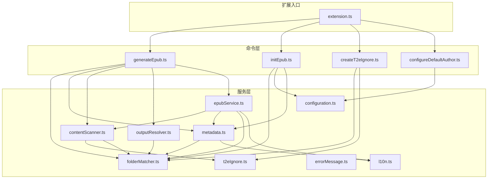
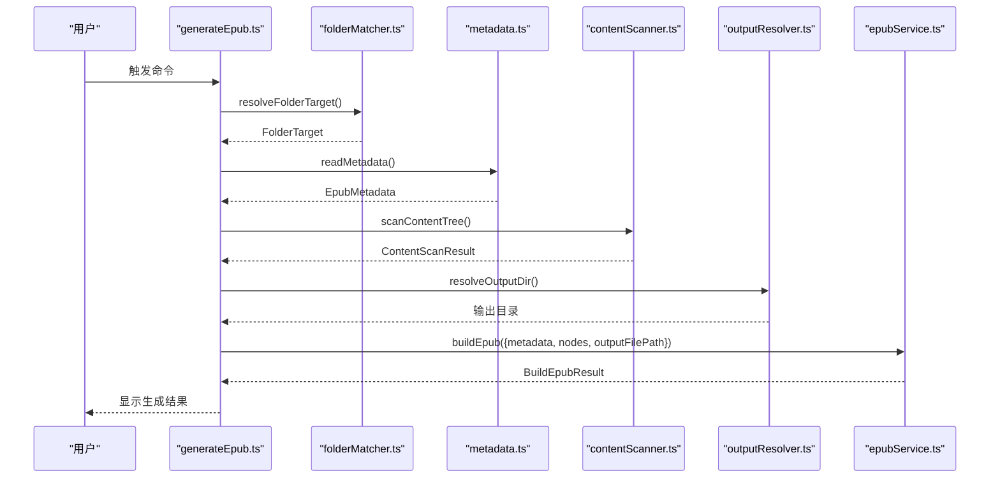
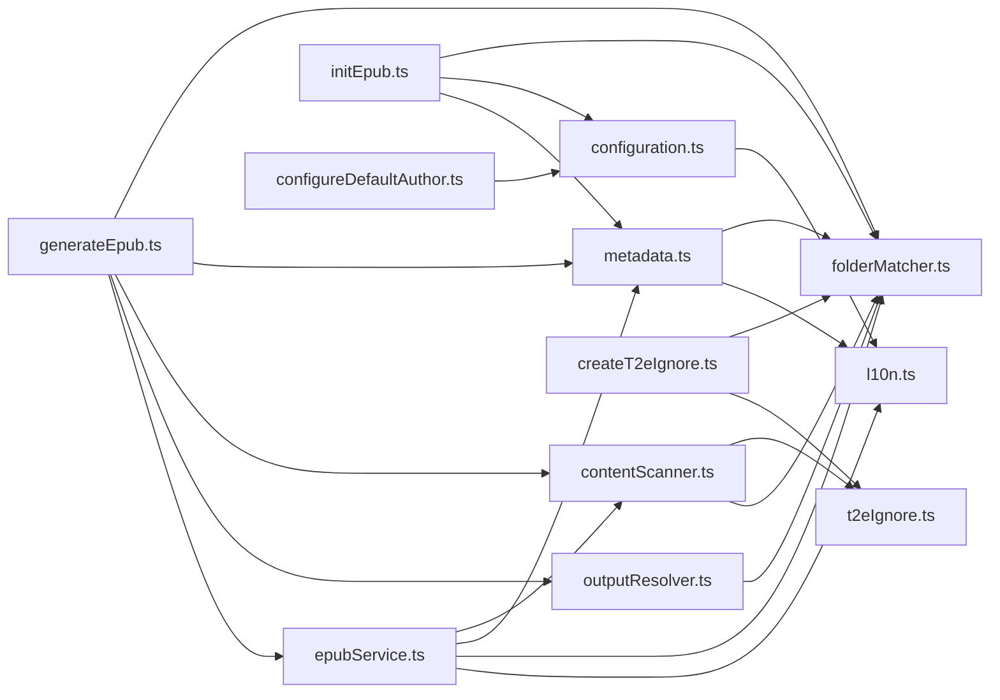

# 服务 API

<cite>
**本文引用的文件**
- [src/services/contentScanner.ts](file://src/services/contentScanner.ts)
- [src/services/epubService.ts](file://src/services/epubService.ts)
- [src/services/metadata.ts](file://src/services/metadata.ts)
- [src/services/configuration.ts](file://src/services/configuration.ts)
- [src/services/folderMatcher.ts](file://src/services/folderMatcher.ts)
- [src/services/outputResolver.ts](file://src/services/outputResolver.ts)
- [src/services/t2eIgnore.ts](file://src/services/t2eIgnore.ts)
- [src/services/errorMessage.ts](file://src/services/errorMessage.ts)
- [src/services/l10n.ts](file://src/services/l10n.ts)
- [src/commands/generateEpub.ts](file://src/commands/generateEpub.ts)
- [src/commands/initEpub.ts](file://src/commands/initEpub.ts)
- [src/commands/createT2eIgnore.ts](file://src/commands/createT2eIgnore.ts)
- [src/commands/configureDefaultAuthor.ts](file://src/commands/configureDefaultAuthor.ts)
- [src/extension.ts](file://src/extension.ts)
- [package.json](file://package.json)
</cite>

## 目录
1. [简介](#简介)
2. [项目结构](#项目结构)
3. [核心组件](#核心组件)
4. [架构总览](#架构总览)
5. [详细组件分析](#详细组件分析)
6. [依赖分析](#依赖分析)
7. [性能考虑](#性能考虑)
8. [故障排查指南](#故障排查指南)
9. [结论](#结论)
10. [附录](#附录)

## 简介
本文件面向 VS Code Folder2EPUB 扩展的服务层 API，系统性梳理 contentScanner、epubService、metadata、configuration、folderMatcher、outputResolver、t2eIgnore 等服务的公共接口、职责边界、调用关系、初始化与配置方法、错误处理策略、性能优化建议及可扩展性说明。文档同时给出关键流程的时序图与类图，帮助开发者快速理解与集成。

## 项目结构
扩展采用“命令驱动 + 服务分层”的组织方式：
- extension.ts 注册全部命令，作为入口。
- commands/* 负责用户交互与流程编排，串联各服务。
- services/* 提供独立功能模块，彼此通过明确接口耦合。

图表来源
- [src/extension.ts:13-18](file://src/extension.ts#L13-L18)
- [src/commands/generateEpub.ts:18-65](file://src/commands/generateEpub.ts#L18-L65)
- [src/commands/initEpub.ts:18-62](file://src/commands/initEpub.ts#L18-L62)
- [src/commands/createT2eIgnore.ts:15-33](file://src/commands/createT2eIgnore.ts#L15-L33)
- [src/commands/configureDefaultAuthor.ts:12-24](file://src/commands/configureDefaultAuthor.ts#L12-L24)
- [src/services/contentScanner.ts:51-58](file://src/services/contentScanner.ts#L51-L58)
- [src/services/epubService.ts:146-216](file://src/services/epubService.ts#L146-L216)
- [src/services/metadata.ts:41-59](file://src/services/metadata.ts#L41-L59)
- [src/services/configuration.ts:18-79](file://src/services/configuration.ts#L18-L79)
- [src/services/folderMatcher.ts:23-38](file://src/services/folderMatcher.ts#L23-L38)
- [src/services/outputResolver.ts:15-42](file://src/services/outputResolver.ts#L15-L42)
- [src/services/t2eIgnore.ts:13-44](file://src/services/t2eIgnore.ts#L13-L44)
- [src/services/errorMessage.ts:9-15](file://src/services/errorMessage.ts#L9-L15)
- [src/services/l10n.ts:9](file://src/services/l10n.ts#L9)

章节来源
- [src/extension.ts:13-18](file://src/extension.ts#L13-L18)
- [package.json:43-96](file://package.json#L43-L96)

## 核心组件
本节概述各服务的职责与公共接口要点，便于快速查阅。

- contentScanner
  - 职责：扫描书籍根目录，构建保留层级与线性遍历能力的树形内容结构，过滤非支持格式与忽略项，解析数字前缀排序与 index 文件。
  - 关键导出：scanContentTree(rootFolderPath)，返回 ContentScanResult。
  - 依赖：t2eIgnore、folderMatcher、本地文件系统。
  - 复杂度：对每个目录进行一次读取与排序，整体近似 O(N log N)，N 为有效文件数量。

- epubService
  - 职责：将内容树、元数据与资源打包为 EPUB3，生成 content.opf、nav.xhtml、toc.ncx、样式与图片资源，构建章节与导航映射。
  - 关键导出：buildEpub(input)，返回 BuildEpubResult。
  - 依赖：contentScanner、metadata、folderMatcher、l10n、markdown-it、jszip、yaml。
  - 复杂度：线性遍历文件并渲染，生成多份 XML/XHTML 文本，整体 O(N)。

- metadata
  - 职责：读取/写入 __t2e.data/metadata.yml，提供默认模板、标题/作者规范化、文件名格式化等。
  - 关键导出：readMetadata、createDefaultMetadata、formatBookFileName 等。
  - 依赖：folderMatcher、l10n、yaml。
  - 复杂度：常数级。

- configuration
  - 职责：VS Code Workspace 级默认作者配置读取/设置与交互式配置。
  - 关键导出：getDefaultAuthor、setDefaultAuthor、configureDefaultAuthorInteractively。
  - 依赖：l10n。
  - 复杂度：常数级。

- folderMatcher
  - 职责：校验并标准化目录目标，计算 __t2e.data 与 metadata.yml 路径，判断文件存在性。
  - 关键导出：resolveFolderTarget、getMetadataDirPath、getMetadataFilePath、hasMetadataFile、exists。
  - 复杂度：常数级。

- outputResolver
  - 职责：自上而下查找 __epub.yml 并解析 saveTo 输出目录，支持 ~ 展开。
  - 关键导出：resolveOutputDir。
  - 复杂度：向上遍历目录树，最坏 O(H)（H 为目录层级）。

- t2eIgnore
  - 职责：读取 .t2eignore 规则，创建/合并 ignore 过滤器。
  - 关键导出：readT2eIgnore、createIgnoreFilter。
  - 复杂度：常数级（读取与过滤）。

- errorMessage
  - 职责：统一错误消息转换，便于 UI 展示。
  - 关键导出：toErrorMessage。
  - 复杂度：常数级。

- l10n
  - 职责：提供本地化文本接口。
  - 关键导出：l10n。
  - 复杂度：常数级。

章节来源
- [src/services/contentScanner.ts:51-58](file://src/services/contentScanner.ts#L51-L58)
- [src/services/epubService.ts:146-216](file://src/services/epubService.ts#L146-L216)
- [src/services/metadata.ts:41-59](file://src/services/metadata.ts#L41-L59)
- [src/services/configuration.ts:18-79](file://src/services/configuration.ts#L18-L79)
- [src/services/folderMatcher.ts:23-38](file://src/services/folderMatcher.ts#L23-L38)
- [src/services/outputResolver.ts:15-42](file://src/services/outputResolver.ts#L15-L42)
- [src/services/t2eIgnore.ts:13-44](file://src/services/t2eIgnore.ts#L13-L44)
- [src/services/errorMessage.ts:9-15](file://src/services/errorMessage.ts#L9-L15)
- [src/services/l10n.ts:9](file://src/services/l10n.ts#L9)

## 架构总览
以下时序图展示“生成 EPUB”命令的端到端流程，体现服务间的数据传递与调用关系。

图表来源
- [src/commands/generateEpub.ts:19-64](file://src/commands/generateEpub.ts#L19-L64)
- [src/services/folderMatcher.ts:23-38](file://src/services/folderMatcher.ts#L23-L38)
- [src/services/metadata.ts:41-59](file://src/services/metadata.ts#L41-L59)
- [src/services/contentScanner.ts:51-58](file://src/services/contentScanner.ts#L51-L58)
- [src/services/outputResolver.ts:15-42](file://src/services/outputResolver.ts#L15-L42)
- [src/services/epubService.ts:146-216](file://src/services/epubService.ts#L146-L216)

## 详细组件分析

### contentScanner 服务 API
- 主要类型
  - ContentFileNode：文件节点，包含显示名、扩展名、FS 路径、是否 index、排序序号、相对路径等。
  - ContentFolderNode：文件夹节点，包含子节点、首文件、index 文件等。
  - ContentNode：联合类型，文件或文件夹。
  - ContentScanResult：扫描结果，包含树状节点与线性文件列表。
- 核心方法
  - scanContentTree(rootFolderPath: string): Promise<ContentScanResult>
    - 输入：书籍根目录绝对路径。
    - 行为：递归扫描，应用 .t2eignore 与 __t2e.data 硬过滤，解析数字前缀与 index 文件，按序排列。
    - 返回：包含 nodes 与 files 的结果对象。
  - 辅助函数：compareNodes、compareByName、findDirectIndexFile、findIndexFile、findFirstFile、flattenFiles、parseOrderedName、isIndexDisplayName、scanDirectory、isDigit。
- 错误处理
  - 目录不存在或非目录时由 folderMatcher.resolveFolderTarget 抛错。
  - 扫描阶段遵循“先硬过滤（__t2e.data）再软过滤（.t2eignore）”策略。
- 性能与复杂度
  - 时间复杂度近似 O(N log N)，主要消耗在排序与文件读取。
  - 建议：对大目录启用 .t2eignore 控制扫描范围；避免在扫描阶段进行昂贵的后处理。

章节来源
- [src/services/contentScanner.ts:10-38](file://src/services/contentScanner.ts#L10-L38)
- [src/services/contentScanner.ts:51-58](file://src/services/contentScanner.ts#L51-L58)
- [src/services/contentScanner.ts:258-329](file://src/services/contentScanner.ts#L258-L329)

### epubService 服务 API
- 主要类型
  - BuildEpubInput：构建输入，包含 metadata、nodes、outputFilePath、rootFolderPath。
  - BuildEpubResult：构建结果，包含 chapterCount 与 outputFilePath。
  - Chapter：章节，包含 href、id、sourcePath、title、xhtml。
  - FrontMatterPage：标题页。
  - EpubAsset：资源，包含 buffer、href、id、mediaType、sourcePath。
  - NavEntry：导航条目。
- 核心方法
  - buildEpub(input: BuildEpubInput): Promise<BuildEpubResult>
    - 输入：元数据、内容树、输出文件路径、根目录。
    - 行为：渲染章节、生成导航与 NCX、写入 mimetype/container.xml、content.opf、nav.xhtml、toc.ncx、样式与图片资源，最终写入 EPUB 文件。
    - 返回：章节数量与输出路径。
  - createChapters(nodes, markdown, rootFolderPath): Promise<{ chapters, contentImages }>
    - 行为：将树拍平为线性文件，逐个渲染为 XHTML，收集正文图片资源。
  - loadCoverAsset(rootFolderPath, configuredCover): Promise<CoverAsset | undefined>
    - 行为：根据 metadata.cover 加载封面，校验媒体类型与存在性。
  - createContentOpf、createNavXhtml、createTocNcx、createTitlePage、createChapterDocument 等：生成各 EPUB 文件。
  - escapeXml、indentLines、getMediaType、parseMarkdownFrontmatter、renderPlainText、renderMarkdownChapter、rewriteTokenImageSources、rewriteImageTokenSource、rewriteHtmlImageSources 等：辅助渲染与资源处理。
- 错误处理
  - 无可用 md/txt 文件时抛错。
  - 目录映射缺失或封面路径不合法时抛错。
  - ZIP/OEBPS 目录创建失败时抛错。
- 性能与复杂度
  - 线性 O(N) 文件渲染与资源收集。
  - 建议：批量写入 ZIP，避免重复 IO；对大图片进行压缩或外部托管以减小体积。

章节来源
- [src/services/epubService.ts:93-144](file://src/services/epubService.ts#L93-L144)
- [src/services/epubService.ts:146-216](file://src/services/epubService.ts#L146-L216)
- [src/services/epubService.ts:494-544](file://src/services/epubService.ts#L494-L544)
- [src/services/epubService.ts:604-633](file://src/services/epubService.ts#L604-L633)
- [src/services/epubService.ts:665-679](file://src/services/epubService.ts#L665-L679)
- [src/services/epubService.ts:713-731](file://src/services/epubService.ts#L713-L731)
- [src/services/epubService.ts:743-783](file://src/services/epubService.ts#L743-L783)
- [src/services/epubService.ts:795-800](file://src/services/epubService.ts#L795-L800)

### metadata 服务 API
- 主要类型
  - EpubMetadata：包含 title、titleSuffix、author、description、cover、version。
- 核心方法
  - createDefaultMetadata(folderName: string, author: string): EpubMetadata
    - 生成初始化模板。
  - readMetadata(folderPath: string): Promise<EpubMetadata>
    - 读取并解析 __t2e.data/metadata.yml。
  - stringifyMetadata(metadata: EpubMetadata): string
    - 序列化为 YAML 文本。
  - getBookAuthor、getBookTitle、getBookDisplayTitle、formatBookFileName、sanitizeFileName。
- 错误处理
  - metadata.yml 内容无效时抛错。
- 性能与复杂度
  - 常数级，I/O 开销低。

章节来源
- [src/services/metadata.ts:8-15](file://src/services/metadata.ts#L8-L15)
- [src/services/metadata.ts:24-33](file://src/services/metadata.ts#L24-L33)
- [src/services/metadata.ts:41-59](file://src/services/metadata.ts#L41-L59)
- [src/services/metadata.ts:67-69](file://src/services/metadata.ts#L67-L69)
- [src/services/metadata.ts:77-102](file://src/services/metadata.ts#L77-L102)
- [src/services/metadata.ts:110-117](file://src/services/metadata.ts#L110-L117)
- [src/services/metadata.ts:125-145](file://src/services/metadata.ts#L125-L145)

### configuration 服务 API
- 核心方法
  - getDefaultAuthor(): string
    - 读取当前 Workspace 级默认作者。
  - setDefaultAuthor(author: string): Promise<void>
    - 写入默认作者。
  - configureDefaultAuthorInteractively(): Promise<{ applied: boolean; author: string }>
    - 交互式配置并返回结果。
- 错误处理
  - 未打开工作区时抛错。
- 性能与复杂度
  - 常数级。

章节来源
- [src/services/configuration.ts:18-24](file://src/services/configuration.ts#L18-L24)
- [src/services/configuration.ts:32-40](file://src/services/configuration.ts#L32-L40)
- [src/services/configuration.ts:47-79](file://src/services/configuration.ts#L47-L79)

### folderMatcher 服务 API
- 核心方法
  - resolveFolderTarget(uri?: Uri): Promise<FolderTarget>
    - 校验本地目录并返回标准化目标。
  - getMetadataDirPath(folderPath: string): string
  - getMetadataFilePath(folderPath: string): string
  - exists(filePath: string): Promise<boolean>
  - hasMetadataFile(folderPath: string): Promise<boolean>
- 错误处理
  - 非本地目录或非目录时抛错。
- 性能与复杂度
  - 常数级。

章节来源
- [src/services/folderMatcher.ts:23-38](file://src/services/folderMatcher.ts#L23-L38)
- [src/services/folderMatcher.ts:46-58](file://src/services/folderMatcher.ts#L46-L58)
- [src/services/folderMatcher.ts:66-84](file://src/services/folderMatcher.ts#L66-L84)

### outputResolver 服务 API
- 核心方法
  - resolveOutputDir(folderPath: string): Promise<string>
    - 自上而下查找 __epub.yml，解析 saveTo，支持 ~ 展开。
- 错误处理
  - 未找到配置时回退到当前目录。
- 性能与复杂度
  - 向上遍历目录树，最坏 O(H)。

章节来源
- [src/services/outputResolver.ts:15-42](file://src/services/outputResolver.ts#L15-L42)
- [src/services/outputResolver.ts:50-71](file://src/services/outputResolver.ts#L50-L71)
- [src/services/outputResolver.ts:79-89](file://src/services/outputResolver.ts#L79-L89)

### t2eIgnore 服务 API
- 核心方法
  - readT2eIgnore(dirPath: string): Promise<string[]>
    - 读取 .t2eignore，过滤空行与注释。
  - createIgnoreFilter(parentFilter?: IgnoreFilter): IgnoreFilter
    - 创建 ignore 实例，可继承父过滤器。
- 错误处理
  - 文件不存在时返回空数组。
- 性能与复杂度
  - 常数级。

章节来源
- [src/services/t2eIgnore.ts:13-26](file://src/services/t2eIgnore.ts#L13-L26)
- [src/services/t2eIgnore.ts:36-44](file://src/services/t2eIgnore.ts#L36-L44)

### errorMessage 服务 API
- 核心方法
  - toErrorMessage(error: unknown): string
    - 统一错误消息转换。
- 性能与复杂度
  - 常数级。

章节来源
- [src/services/errorMessage.ts:9-15](file://src/services/errorMessage.ts#L9-L15)

### l10n 服务 API
- 核心方法
  - l10n：VS Code 本地化对象。
- 性能与复杂度
  - 常数级。

章节来源
- [src/services/l10n.ts:9](file://src/services/l10n.ts#L9)

## 依赖分析
- 命令到服务的依赖
  - generateEpub.ts 依赖：folderMatcher、metadata、contentScanner、outputResolver、epubService。
  - initEpub.ts 依赖：folderMatcher、configuration、metadata。
  - createT2eIgnore.ts 依赖：folderMatcher、t2eIgnore。
  - configureDefaultAuthor.ts 依赖：configuration。
- 服务内部依赖
  - epubService 依赖 contentScanner、metadata、folderMatcher、l10n。
  - contentScanner 依赖 t2eIgnore、folderMatcher。
  - metadata 依赖 folderMatcher、l10n。
  - outputResolver 依赖 folderMatcher。
  - configuration 依赖 l10n。
  - errorMessage 依赖 l10n。
- 外部依赖
  - ignore、jszip、markdown-it、yaml。

图表来源
- [src/commands/generateEpub.ts:19-64](file://src/commands/generateEpub.ts#L19-L64)
- [src/commands/initEpub.ts:19-61](file://src/commands/initEpub.ts#L19-L61)
- [src/commands/createT2eIgnore.ts:16-32](file://src/commands/createT2eIgnore.ts#L16-L32)
- [src/commands/configureDefaultAuthor.ts:13-23](file://src/commands/configureDefaultAuthor.ts#L13-L23)
- [src/services/epubService.ts:146-216](file://src/services/epubService.ts#L146-L216)
- [src/services/contentScanner.ts:51-58](file://src/services/contentScanner.ts#L51-L58)
- [src/services/metadata.ts:41-59](file://src/services/metadata.ts#L41-L59)
- [src/services/configuration.ts:18-79](file://src/services/configuration.ts#L18-L79)
- [src/services/folderMatcher.ts:23-38](file://src/services/folderMatcher.ts#L23-L38)
- [src/services/outputResolver.ts:15-42](file://src/services/outputResolver.ts#L15-L42)
- [src/services/t2eIgnore.ts:13-44](file://src/services/t2eIgnore.ts#L13-L44)
- [src/services/l10n.ts:9](file://src/services/l10n.ts#L9)

## 性能考虑
- 扫描阶段
  - 启用 .t2eignore 控制扫描范围，减少 I/O。
  - 避免在扫描阶段进行昂贵的后处理（如图片压缩）。
- 渲染与打包
  - 使用 markdown-it 的缓存与复用策略，避免重复解析。
  - 批量写入 ZIP，减少磁盘碎片与同步开销。
  - 对大图片进行预压缩或外部托管，降低 EPUB 体积。
- 目录遍历
  - outputResolver 向上查找配置时，尽量将 __epub.yml 放在靠近根的位置，减少层级。
- 错误与回退
  - 早期失败尽早抛错，避免浪费资源；对可恢复场景提供回退路径。

## 故障排查指南
- 常见错误与定位
  - “缺少 __t2e.data/metadata.yml”：确认 initEpub 命令已执行；检查文件是否存在与可读。
  - “无可用 md/txt 文件”：检查目录结构与 .t2eignore；确认文件扩展名为 .md/.txt。
  - “封面路径不合法”：检查 metadata.yml 中 cover 字段与 __t2e.data 下文件名一致且为受支持格式。
  - “未打开工作区”：配置默认作者需在工作区内进行。
- 错误消息统一
  - 使用 toErrorMessage 将错误转换为用户可读文本，便于在 UI 中展示。
- 日志与诊断
  - 建议在命令中使用 withProgress 提供阶段性反馈，便于定位耗时环节。

章节来源
- [src/commands/generateEpub.ts:23-26](file://src/commands/generateEpub.ts#L23-L26)
- [src/commands/generateEpub.ts:42-43](file://src/commands/generateEpub.ts#L42-L43)
- [src/services/epubService.ts:610-618](file://src/services/epubService.ts#L610-L618)
- [src/services/configuration.ts:33-35](file://src/services/configuration.ts#L33-L35)
- [src/services/errorMessage.ts:9-15](file://src/services/errorMessage.ts#L9-L15)

## 结论
本服务层 API 设计清晰、职责单一、接口稳定，能够满足从目录扫描、元数据读取、内容渲染到 EPUB 打包的全链路需求。通过合理的错误处理与性能优化建议，可在 VS Code 环境中高效地将本地文件夹转换为高质量的 EPUB 电子书。建议在实际使用中结合 .t2eignore 与 __epub.yml 进行灵活配置，并在大项目中关注 I/O 与渲染性能瓶颈。

## 附录
- 初始化与配置流程
  - 初始化：initEpub 命令创建 __t2e.data/metadata.yml，默认作者可从 Workspace 配置读取或交互式设置。
  - 配置默认作者：configureDefaultAuthor 命令提供交互式配置。
- 命令注册与贡献
  - extension.ts 注册全部命令；package.json 声明命令、配置与菜单项。

章节来源
- [src/commands/initEpub.ts:19-61](file://src/commands/initEpub.ts#L19-L61)
- [src/commands/configureDefaultAuthor.ts:12-24](file://src/commands/configureDefaultAuthor.ts#L12-L24)
- [src/extension.ts:13-18](file://src/extension.ts#L13-L18)
- [package.json:43-96](file://package.json#L43-L96)