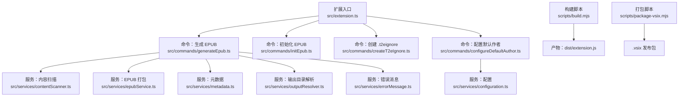
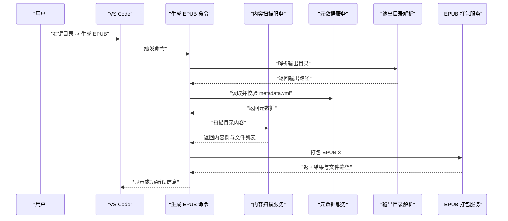
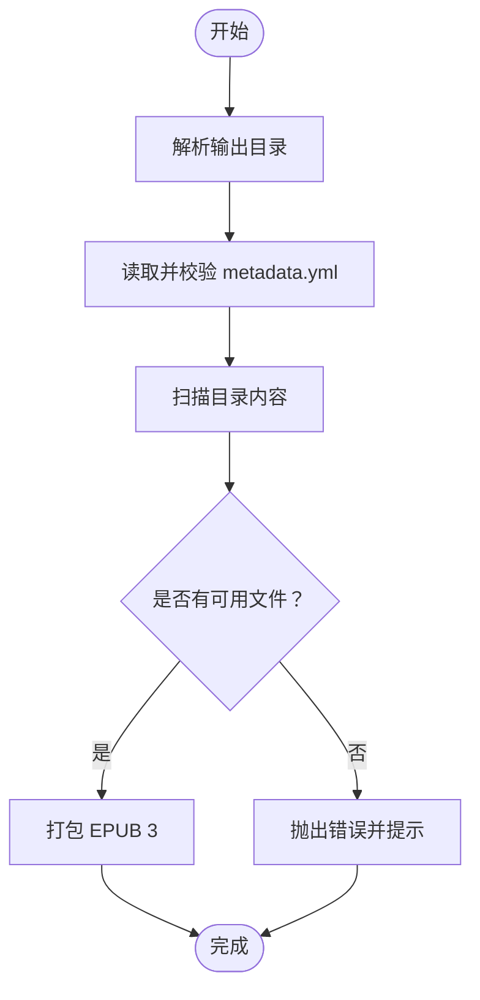
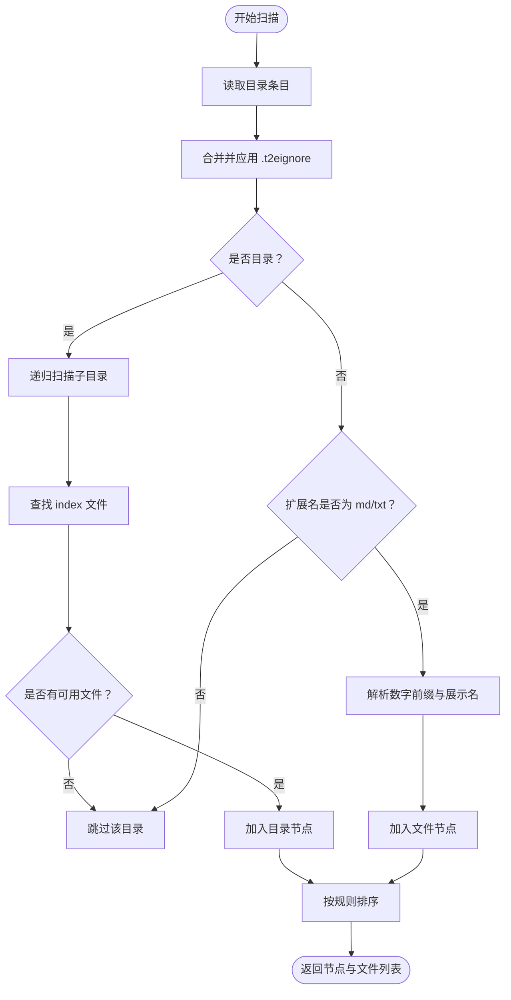
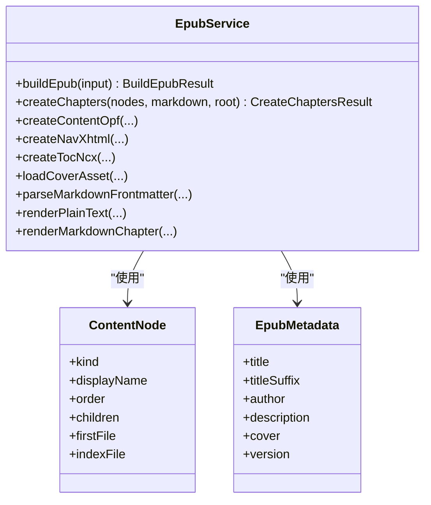
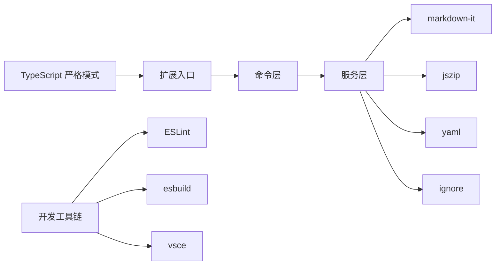

# 代码贡献

<cite>
**本文引用的文件**
- [package.json](file://package.json)
- [eslint.config.mjs](file://eslint.config.mjs)
- [tsconfig.json](file://tsconfig.json)
- [.editorconfig](file://.editorconfig)
- [README.md](file://README.md)
- [src/extension.ts](file://src/extension.ts)
- [src/commands/generateEpub.ts](file://src/commands/generateEpub.ts)
- [src/services/epubService.ts](file://src/services/epubService.ts)
- [src/services/contentScanner.ts](file://src/services/contentScanner.ts)
- [src/services/metadata.ts](file://src/services/metadata.ts)
- [src/services/configuration.ts](file://src/services/configuration.ts)
- [scripts/build.mjs](file://scripts/build.mjs)
- [scripts/package-vsix.mjs](file://scripts/package-vsix.mjs)
- [test/epub-index-navigation.test.cjs](file://test/epub-index-navigation.test.cjs)
- [test/output-resolver.test.cjs](file://test/output-resolver.test.cjs)
</cite>

## 目录
1. [简介](#简介)
2. [项目结构](#项目结构)
3. [核心组件](#核心组件)
4. [架构总览](#架构总览)
5. [详细组件分析](#详细组件分析)
6. [依赖关系分析](#依赖关系分析)
7. [性能考量](#性能考量)
8. [故障排查指南](#故障排查指南)
9. [结论](#结论)
10. [附录](#附录)

## 简介
本指南面向贡献者，帮助你理解并参与 VS Code Folder2EPUB 扩展的开发。内容涵盖代码规范与风格、Git 工作流与分支策略、Pull Request 流程与评审标准、注释与文档规范、版本号管理与发布流程、代码审查要点与质量保障、行为准则与社区参与、开发最佳实践与重构指导，以及如何报告 Bug 与提出功能请求。

## 项目结构
该项目采用“命令注册 + 服务模块”的分层设计：
- 扩展入口负责注册所有命令
- 命令层负责 UI 交互与流程编排
- 服务层负责业务逻辑（内容扫描、EPUB 打包、元数据、配置等）
- 脚本负责构建与打包
- 测试负责关键流程与边界场景验证

图表来源
- [src/extension.ts:1-24](file://src/extension.ts#L1-L24)
- [src/commands/generateEpub.ts:1-66](file://src/commands/generateEpub.ts#L1-L66)
- [src/services/contentScanner.ts:1-340](file://src/services/contentScanner.ts#L1-L340)
- [src/services/epubService.ts:1-800](file://src/services/epubService.ts#L1-L800)
- [src/services/metadata.ts:1-157](file://src/services/metadata.ts#L1-L157)
- [scripts/build.mjs:1-43](file://scripts/build.mjs#L1-L43)
- [scripts/package-vsix.mjs:1-57](file://scripts/package-vsix.mjs#L1-L57)

章节来源
- [package.json:1-114](file://package.json#L1-L114)
- [tsconfig.json:1-25](file://tsconfig.json#L1-L25)
- [README.md:124-241](file://README.md#L124-L241)

## 核心组件
- 扩展入口与命令注册：集中注册所有命令，便于生命周期管理与依赖注入
- 生成 EPUB 命令：串联元数据读取、内容扫描、输出目录解析与 EPUB 打包
- 内容扫描服务：递归扫描目录、解析数字前缀排序、处理 .t2eignore、识别 index 目录入口
- EPUB 打包服务：将内容树与资源打包为 EPUB 3，生成 content.opf、nav.xhtml、toc.ncx 与样式
- 元数据服务：读取/校验/格式化 metadata.yml，生成文件名与展示标题
- 配置服务：读取/设置 Workspace 默认作者
- 构建与打包脚本：esbuild 构建、vsce 打包

章节来源
- [src/extension.ts:1-24](file://src/extension.ts#L1-L24)
- [src/commands/generateEpub.ts:1-66](file://src/commands/generateEpub.ts#L1-L66)
- [src/services/contentScanner.ts:1-340](file://src/services/contentScanner.ts#L1-L340)
- [src/services/epubService.ts:1-800](file://src/services/epubService.ts#L1-L800)
- [src/services/metadata.ts:1-157](file://src/services/metadata.ts#L1-L157)
- [src/services/configuration.ts:1-80](file://src/services/configuration.ts#L1-L80)
- [scripts/build.mjs:1-43](file://scripts/build.mjs#L1-L43)
- [scripts/package-vsix.mjs:1-57](file://scripts/package-vsix.mjs#L1-L57)

## 架构总览
下图展示了“生成 EPUB”命令的端到端流程，包括 UI 交互、进度反馈、服务调用与错误处理。

图表来源
- [src/commands/generateEpub.ts:18-66](file://src/commands/generateEpub.ts#L18-L66)
- [src/services/contentScanner.ts:51-58](file://src/services/contentScanner.ts#L51-L58)
- [src/services/metadata.ts:41-59](file://src/services/metadata.ts#L41-L59)
- [src/services/epubService.ts:146-216](file://src/services/epubService.ts#L146-L216)

## 详细组件分析

### 生成 EPUB 命令
职责：校验元数据、扫描内容、解析输出目录、打包 EPUB，并提供进度反馈与错误提示。

图表来源
- [src/commands/generateEpub.ts:18-66](file://src/commands/generateEpub.ts#L18-L66)

章节来源
- [src/commands/generateEpub.ts:1-66](file://src/commands/generateEpub.ts#L1-L66)

### 内容扫描服务
职责：递归扫描、解析数字前缀排序、处理 .t2eignore、识别 index 目录入口、拍平为线性文件列表。

图表来源
- [src/services/contentScanner.ts:258-329](file://src/services/contentScanner.ts#L258-L329)

章节来源
- [src/services/contentScanner.ts:1-340](file://src/services/contentScanner.ts#L1-L340)

### EPUB 打包服务
职责：将内容树与资源打包为 EPUB 3，生成 content.opf、nav.xhtml、toc.ncx 与样式表，处理封面与图片资源。

图表来源
- [src/services/epubService.ts:93-131](file://src/services/epubService.ts#L93-L131)
- [src/services/contentScanner.ts:10-38](file://src/services/contentScanner.ts#L10-L38)
- [src/services/metadata.ts:8-15](file://src/services/metadata.ts#L8-L15)

章节来源
- [src/services/epubService.ts:1-800](file://src/services/epubService.ts#L1-L800)

### 元数据服务
职责：读取/校验 metadata.yml、生成展示标题与文件名、清洗非法字符。

章节来源
- [src/services/metadata.ts:1-157](file://src/services/metadata.ts#L1-L157)

### 配置服务
职责：读取/设置 Workspace 默认作者，提供交互式配置体验。

章节来源
- [src/services/configuration.ts:1-80](file://src/services/configuration.ts#L1-L80)

### 构建与打包脚本
职责：使用 esbuild 编译扩展入口，生产模式压缩与 SourceMap 控制；使用 vsce 打包为 .vsix。

章节来源
- [scripts/build.mjs:1-43](file://scripts/build.mjs#L1-L43)
- [scripts/package-vsix.mjs:1-57](file://scripts/package-vsix.mjs#L1-L57)

## 依赖关系分析
- 语言与类型：TypeScript ES2022 + strict 模式，Node 模块解析
- 外部库：markdown-it、jszip、yaml、ignore
- 开发工具：esbuild、eslint、@antfu/eslint-config、vsce

图表来源
- [tsconfig.json:1-25](file://tsconfig.json#L1-L25)
- [package.json:97-112](file://package.json#L97-L112)
- [eslint.config.mjs:1-22](file://eslint.config.mjs#L1-L22)

章节来源
- [package.json:1-114](file://package.json#L1-L114)
- [tsconfig.json:1-25](file://tsconfig.json#L1-L25)
- [eslint.config.mjs:1-22](file://eslint.config.mjs#L1-L22)

## 性能考量
- 扫描与排序：内容扫描使用数字前缀 + 本地化自然排序，复杂度近似 O(n log n)，注意目录层级与文件数量增长带来的开销
- 打包与压缩：JSZip 生成 EPUB 时启用 DEFLATE 压缩，I/O 成本主要受文件数量与大小影响
- 资源处理：图片与封面读取与媒体类型判定在打包阶段集中进行，避免重复 I/O
- 构建优化：生产模式启用压缩与最小化，开发模式启用 SourceMap 便于调试

## 故障排查指南
- 无可用文件生成 EPUB：检查目录是否包含 .md/.txt，确认 .t2eignore 规则与 __t2e.data 目录
- 缺少 metadata.yml：执行“初始化 EPUB”后再尝试生成
- 输出目录解析异常：检查父级 __epub.yml 的 saveTo 配置，支持 ~ 展开到用户目录
- 封面缺失或格式不支持：确认 __t2e.data/cover.jpg 存在且为支持的媒体类型
- 打包失败：查看控制台错误信息，确认目录权限与磁盘空间

章节来源
- [src/commands/generateEpub.ts:20-64](file://src/commands/generateEpub.ts#L20-L64)
- [src/services/epubService.ts:604-633](file://src/services/epubService.ts#L604-L633)
- [test/output-resolver.test.cjs:1-72](file://test/output-resolver.test.cjs#L1-L72)

## 结论
本指南提供了从代码规范、工作流、评审标准到发布流程与质量保障的完整贡献路径。请遵循统一的风格与流程，确保变更可维护、可测试、可发布。

## 附录

### 代码规范与风格
- ESLint 配置
  - 使用 @antfu/eslint-config，类型库与库类型启用
  - 忽略示例目录与特定文件
  - 规则调整：关闭 console 使用、JSON 键/数组排序规则
- EditorConfig
  - 统一换行、缩进、字符集与尾随空白处理
- TypeScript
  - 严格模式、ES2022 目标、Node 解析、SourceMap 开启
- 命名与注释
  - 函数/类/接口使用清晰语义命名
  - 关键流程与边界条件添加注释说明

章节来源
- [eslint.config.mjs:1-22](file://eslint.config.mjs#L1-L22)
- [.editorconfig:1-13](file://.editorconfig#L1-L13)
- [tsconfig.json:1-25](file://tsconfig.json#L1-L25)

### Git 工作流与分支管理
- 分支策略
  - 主分支：稳定版本与发布
  - 开发分支：集成特性与修复
  - 功能分支：短期特性开发
- 提交规范
  - 标题简洁明确，正文说明动机与影响
  - 按变更类型分类（feat/fix/docs/style/refactor/test/chore）
- 合并与冲突解决
  - 优先 rebase 保持线性历史
  - 合并前确保通过 lint、测试与本地构建

### Pull Request 流程与评审标准
- PR 要求
  - 关联 Issue 或需求背景
  - 包含测试用例与变更说明
  - 通过本地 lint 与测试
- 评审关注点
  - 代码可读性与一致性
  - 边界条件与错误处理
  - 性能与资源占用
  - 文档与国际化文案

### 代码注释与文档编写规范
- 函数/类/接口
  - 使用 JSDoc 风格注释，说明参数、返回值与异常
- 复杂逻辑
  - 添加步骤说明与决策依据
- README 与变更记录
  - 更新相关章节，保持与实现一致

### 版本号管理与发布流程
- 版本号
  - 遵循语义化版本，发布前在 package.json 中递增
- 发布前检查
  - 本地构建、打包与 lint
  - README 与图标合规性检查
- 发布步骤
  - 登录 Publisher，执行 vsce 打包或直接发布
  - 可选择自动递增版本号

章节来源
- [README.md:136-232](file://README.md#L136-L232)
- [package.json:5](file://package.json#L5)

### 代码审查要点与质量保证
- 代码审查
  - 关注可维护性、健壮性与性能
  - 确保错误处理与国际化文案完善
- 质量保障
  - 单元测试与集成测试覆盖关键流程
  - 本地预检：lint、编译、打包、基本功能验证

章节来源
- [test/epub-index-navigation.test.cjs:1-140](file://test/epub-index-navigation.test.cjs#L1-L140)
- [test/output-resolver.test.cjs:1-72](file://test/output-resolver.test.cjs#L1-L72)

### 行为准则与社区参与
- 社区行为
  - 尊重与包容，聚焦技术讨论
  - 提供清晰问题描述与复现步骤
- 贡献参与
  - 从 Issue 开始讨论，再提交 PR
  - 遵循仓库规范与流程

### 开发最佳实践与重构指导
- 最佳实践
  - 单一职责、高内聚低耦合
  - 明确的错误传播与用户提示
  - 资源与 I/O 的最小化与幂等
- 重构指导
  - 先写测试，再修改实现
  - 逐步演进，保持向后兼容
  - 保持对外 API 稳定

### 报告 Bug 与提出功能请求
- 报告 Bug
  - 提供环境信息、操作步骤、期望与实际结果
  - 附带最小可复现示例
- 功能请求
  - 描述使用场景与收益
  - 提供验收标准与测试建议