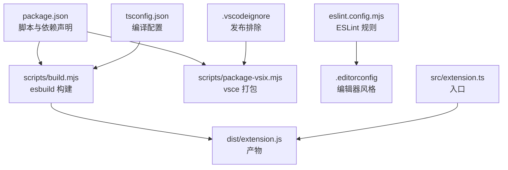
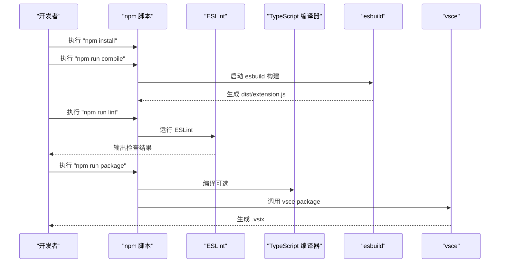
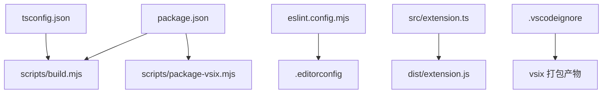

# 开发环境搭建

<cite>
**本文引用的文件**
- [package.json](file://package.json)
- [tsconfig.json](file://tsconfig.json)
- [eslint.config.mjs](file://eslint.config.mjs)
- [scripts/build.mjs](file://scripts/build.mjs)
- [scripts/package-vsix.mjs](file://scripts/package-vsix.mjs)
- [.editorconfig](file://.editorconfig)
- [.vscodeignore](file://.vscodeignore)
- [README.md](file://README.md)
- [src/extension.ts](file://src/extension.ts)
- [example/__epub.yml](file://example/__epub.yml)
- [example/init-folder/__t2e.data/metadata.yml](file://example/init-folder/__t2e.data/metadata.yml)
- [package.nls.json](file://package.nls.json)
- [package.nls.zh-cn.json](file://package.nls.zh-cn.json)
</cite>

## 目录
1. [简介](#简介)
2. [项目结构](#项目结构)
3. [核心组件](#核心组件)
4. [架构总览](#架构总览)
5. [详细组件分析](#详细组件分析)
6. [依赖分析](#依赖分析)
7. [性能考虑](#性能考虑)
8. [故障排查指南](#故障排查指南)
9. [结论](#结论)
10. [附录](#附录)

## 简介
本指南面向 VS Code Folder2EPUB 扩展的开发者，提供从零搭建开发环境的完整步骤，涵盖 Node.js 版本与兼容性、依赖安装、TypeScript 编译配置、ESLint 规范、开发工具链（esbuild、TypeScript 编译器）、环境变量与 IDE 设置建议，以及常见问题排查与解决方案。

## 项目结构
该项目采用“源码分层 + 脚本驱动”的组织方式：
- 源码位于 src/，按功能模块拆分命令与服务层
- 构建与打包脚本位于 scripts/，包含 esbuild 构建、图标生成、vsix 打包
- 示例与本地化配置位于 example/ 与 l10n/、package.nls.*.json
- 根目录提供编译、lint、打包等 npm scripts

图表来源
- [package.json:12-22](file://package.json#L12-L22)
- [scripts/build.mjs:12-27](file://scripts/build.mjs#L12-L27)
- [scripts/package-vsix.mjs:21-31](file://scripts/package-vsix.mjs#L21-L31)
- [tsconfig.json:1-25](file://tsconfig.json#L1-L25)
- [eslint.config.mjs:1-22](file://eslint.config.mjs#L1-L22)
- [.editorconfig:1-13](file://.editorconfig#L1-L13)
- [src/extension.ts:13-18](file://src/extension.ts#L13-L18)
- [.vscodeignore:1-24](file://.vscodeignore#L1-L24)

章节来源
- [package.json:12-22](file://package.json#L12-L22)
- [README.md:124-135](file://README.md#L124-L135)

## 核心组件
- 构建与打包
  - esbuild：负责将 TypeScript 源码打包为 Node.js 可运行的 CommonJS 产物
  - vsce：负责将扩展打包为 .vsix
- 规范与质量
  - ESLint：基于 @antfu/eslint-config 提供统一规则
  - EditorConfig：统一编码风格
- 本地化与菜单
  - package.nls.*.json：多语言标题与描述
  - package.json 贡献：命令、菜单、配置项

章节来源
- [scripts/build.mjs:12-27](file://scripts/build.mjs#L12-L27)
- [scripts/package-vsix.mjs:38-56](file://scripts/package-vsix.mjs#L38-L56)
- [eslint.config.mjs:1-22](file://eslint.config.mjs#L1-L22)
- [package.nls.json:1-9](file://package.nls.json#L1-L9)
- [package.nls.zh-cn.json:1-9](file://package.nls.zh-cn.json#L1-L9)

## 架构总览
下图展示了从开发到发布的端到端流程，包括依赖安装、TypeScript 编译、ESLint 检查、打包与发布。

图表来源
- [package.json:12-22](file://package.json#L12-L22)
- [scripts/build.mjs:29-37](file://scripts/build.mjs#L29-L37)
- [scripts/package-vsix.mjs:38-56](file://scripts/package-vsix.mjs#L38-L56)

## 详细组件分析

### Node.js 环境与版本兼容性
- VS Code 引擎要求：package.json 中 engines.vscode 指定最低版本，确保扩展在指定版本范围内运行
- 构建目标：esbuild 目标设置为 node20，建议本地 Node.js 版本与之匹配，避免运行期差异
- 发布工具：vsce 通过 npx 调用，依赖 Node.js 运行时

章节来源
- [package.json:31-33](file://package.json#L31-L33)
- [scripts/build.mjs:18](file://scripts/build.mjs#L18)
- [scripts/package-vsix.mjs:40](file://scripts/package-vsix.mjs#L40)

### 依赖安装与脚本
- 安装生产依赖与开发依赖：使用 npm install 安装 package.json 中的 dependencies 与 devDependencies
- 常用脚本
  - compile：一次性构建
  - watch：监听模式增量构建
  - compile:prod：生产模式构建（启用压缩、关闭 SourceMap）
  - clean：清理 dist 与 release
  - lint / lint:fix：ESLint 检查与自动修复
  - package：构建后调用 vsix 打包脚本

章节来源
- [package.json:12-22](file://package.json#L12-L22)
- [README.md:126-129](file://README.md#L126-L129)

### TypeScript 编译配置（tsconfig.json）
- 目标与模块：target 为 ES2022，module 与 moduleResolution 设为 node16，适配现代 Node.js
- 输出与源码：outDir 指向 dist，rootDir 指向 src，开启 sourceMap
- 类型与严格性：内置 node、vscode 类型，启用 strict、esModuleInterop、resolveJsonModule、skipLibCheck
- 包含范围：仅编译 src/**/*.ts

章节来源
- [tsconfig.json:1-25](file://tsconfig.json#L1-L25)

### ESLint 代码规范（eslint.config.mjs）
- 规则来源：基于 @antfu/eslint-config，启用 TypeScript 支持
- 忽略项：排除示例目录与特定文件
- 自定义规则：关闭 console 使用、JSON 键值排序等规则以适配项目风格

章节来源
- [eslint.config.mjs:1-22](file://eslint.config.mjs#L1-L22)

### 开发工具链
- esbuild：作为主要打包工具，入口为 src/extension.ts，输出 CommonJS 至 dist/extension.js
- TypeScript 编译器：用于类型检查与源码生成（可选）
- vsce：用于生成 .vsix 包，输出至 release/ 目录

章节来源
- [scripts/build.mjs:12-27](file://scripts/build.mjs#L12-L27)
- [scripts/package-vsix.mjs:21-31](file://scripts/package-vsix.mjs#L21-L31)

### 环境变量与 IDE 设置
- 环境变量
  - NODE_ENV：由 esbuild define 注入，区分开发/生产模式
- IDE 建议
  - 使用 VS Code，安装推荐扩展（如 ESLint、EditorConfig）
  - 保持 EditorConfig 与项目一致（缩进、换行、字符集）

章节来源
- [scripts/build.mjs:24-26](file://scripts/build.mjs#L24-L26)
- [.editorconfig:1-13](file://.editorconfig#L1-L13)

### 本地化与菜单贡献
- 多语言：package.nls.json 与 package.nls.zh-cn.json 提供命令与配置标题
- 菜单与命令：package.json 的 contributes 字段注册命令、菜单与配置项

章节来源
- [package.nls.json:1-9](file://package.nls.json#L1-L9)
- [package.nls.zh-cn.json:1-9](file://package.nls.zh-cn.json#L1-L9)
- [package.json:43-96](file://package.json#L43-L96)

### 示例与配置参考
- 示例配置：example/__epub.yml 展示 saveTo 的使用
- 初始化元数据：example/init-folder/__t2e.data/metadata.yml 展示默认字段

章节来源
- [example/__epub.yml:1-2](file://example/__epub.yml#L1-L2)
- [example/init-folder/__t2e.data/metadata.yml:1-7](file://example/init-folder/__t2e.data/metadata.yml#L1-L7)

## 依赖分析
- 运行时依赖
  - ignore：文件/目录过滤
  - jszip：EPUB 内容打包
  - markdown-it：Markdown 渲染
  - yaml：YAML 解析
- 开发依赖
  - @antfu/eslint-config、eslint：代码规范
  - @types/*：Node、VS Code、markdown-it 类型声明
  - esbuild：构建打包
  - rimraf：清理
  - typescript：类型检查与编译

章节来源
- [package.json:97-112](file://package.json#L97-L112)

## 性能考虑
- 生产构建启用压缩与关闭 SourceMap，减少产物体积与加载时间
- 监听模式仅在开发阶段使用，避免不必要的全量编译
- ESLint 仅在变更文件上运行，提升迭代效率

章节来源
- [scripts/build.mjs:22-26](file://scripts/build.mjs#L22-L26)
- [package.json:12-22](file://package.json#L12-L22)

## 故障排查指南
- 构建失败（esbuild）
  - 症状：构建时报错或无法生成 dist/extension.js
  - 排查：确认 Node.js 版本与 esbuild 目标一致；检查入口路径与 define 的环境变量
- 生产构建异常
  - 症状：生产模式下运行报错
  - 排查：确认 define 的 NODE_ENV 与构建参数；检查压缩是否引入兼容性问题
- Lint 失败
  - 症状：ESLint 报错
  - 排查：执行 npm run lint:fix；检查 eslint.config.mjs 的规则与忽略项
- 打包失败（vsix）
  - 症状：vsce 打包失败
  - 排查：确认 npx 可用；检查 release 目录权限；核对 package.json 字段
- 发布前检查
  - 症状：发布被拒或失败
  - 排查：README.md 中列出的发布前检查清单（图标格式、图片链接、SVG 限制等）

章节来源
- [scripts/build.mjs:29-42](file://scripts/build.mjs#L29-L42)
- [scripts/package-vsix.mjs:38-56](file://scripts/package-vsix.mjs#L38-L56)
- [README.md:217-232](file://README.md#L217-L232)

## 结论
通过本指南，您可以完成从 Node.js 环境准备、依赖安装、TypeScript 与 ESLint 配置、esbuild 构建到 vsix 打包的全流程开发环境搭建。建议在开发过程中结合 watch 模式进行迭代，并在提交前执行 lint 与 package 脚本，确保质量与一致性。

## 附录

### A. 开发常用命令速查
- 安装依赖：npm install
- 一次性构建：npm run compile
- 监听构建：npm run watch
- 生产构建：npm run compile:prod
- 清理：npm run clean
- 代码检查：npm run lint
- 自动修复：npm run lint:fix
- 打包 vsix：npm run package

章节来源
- [package.json:12-22](file://package.json#L12-L22)
- [README.md:126-129](file://README.md#L126-L129)

### B. 关键文件与职责映射

图表来源
- [package.json:12-22](file://package.json#L12-L22)
- [scripts/build.mjs:12-27](file://scripts/build.mjs#L12-L27)
- [scripts/package-vsix.mjs:21-31](file://scripts/package-vsix.mjs#L21-L31)
- [tsconfig.json:1-25](file://tsconfig.json#L1-L25)
- [eslint.config.mjs:1-22](file://eslint.config.mjs#L1-L22)
- [.editorconfig:1-13](file://.editorconfig#L1-L13)
- [src/extension.ts:13-18](file://src/extension.ts#L13-L18)
- [.vscodeignore:1-24](file://.vscodeignore#L1-L24)