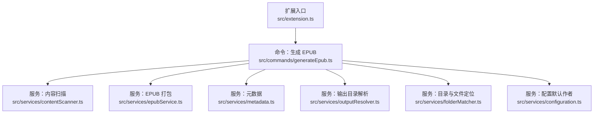
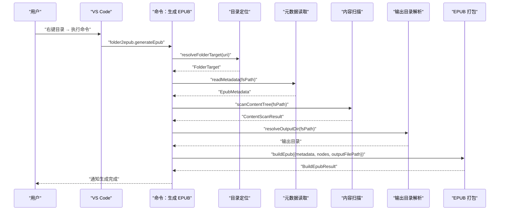
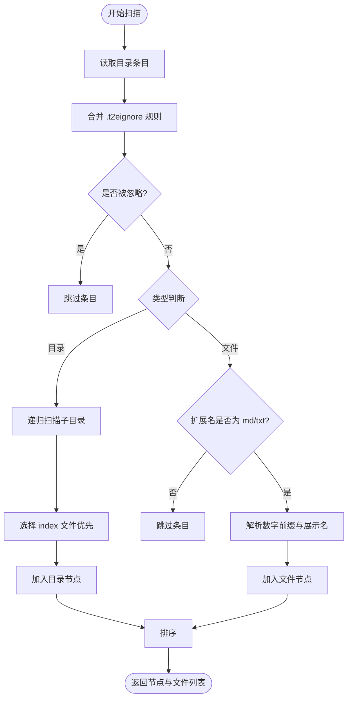
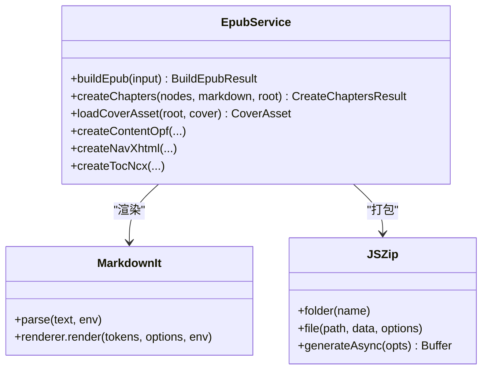
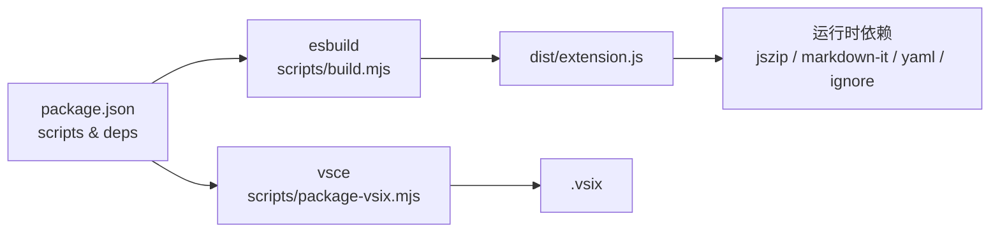
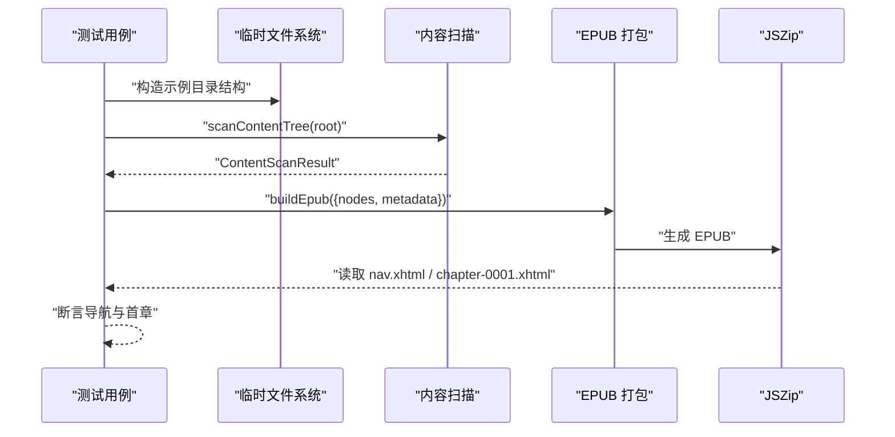
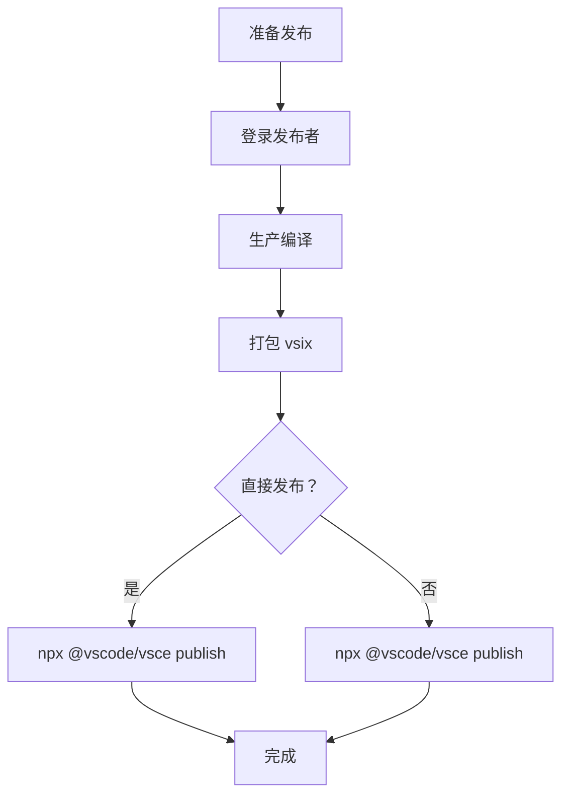

# 开发者指南

<cite>
**本文引用的文件**
- [package.json](file://package.json)
- [README.md](file://README.md)
- [tsconfig.json](file://tsconfig.json)
- [eslint.config.mjs](file://eslint.config.mjs)
- [scripts/build.mjs](file://scripts/build.mjs)
- [scripts/package-vsix.mjs](file://scripts/package-vsix.mjs)
- [src/extension.ts](file://src/extension.ts)
- [src/commands/generateEpub.ts](file://src/commands/generateEpub.ts)
- [src/services/contentScanner.ts](file://src/services/contentScanner.ts)
- [src/services/epubService.ts](file://src/services/epubService.ts)
- [src/services/metadata.ts](file://src/services/metadata.ts)
- [src/services/folderMatcher.ts](file://src/services/folderMatcher.ts)
- [src/services/outputResolver.ts](file://src/services/outputResolver.ts)
- [src/services/configuration.ts](file://src/services/configuration.ts)
- [test/epub-index-navigation.test.cjs](file://test/epub-index-navigation.test.cjs)
</cite>

## 目录
1. [简介](#简介)
2. [项目结构](#项目结构)
3. [核心组件](#核心组件)
4. [架构总览](#架构总览)
5. [详细组件分析](#详细组件分析)
6. [依赖关系分析](#依赖关系分析)
7. [性能考量](#性能考量)
8. [调试与测试](#调试与测试)
9. [发布流程](#发布流程)
10. [常见问题排查](#常见问题排查)
11. [结论](#结论)

## 简介
本指南面向 VS Code 扩展开发者，围绕 Folder2EPUB 的代码库提供从开发环境搭建、构建与测试、到发布与维护的全流程说明。内容涵盖：
- 开发环境与工具链配置
- 代码贡献流程与规范
- VS Code API 使用、异步编程与错误处理最佳实践
- 调试与测试方法（单元与集成）
- 发布流程（vsix 打包与 Marketplace 发布）
- 性能优化与安全注意事项
- 常见问题与排障建议

## 项目结构
该项目采用“命令注册 + 服务模块”的分层设计：
- 扩展入口负责注册所有命令
- 命令层串联业务流程（读取元数据、扫描内容、打包 EPUB）
- 服务层拆分职责：内容扫描、EPUB 打包、元数据、输出目录解析、配置与国际化等

**图表来源**
- [src/extension.ts:13-18](file://src/extension.ts#L13-L18)
- [src/commands/generateEpub.ts:18-65](file://src/commands/generateEpub.ts#L18-L65)
- [src/services/contentScanner.ts:51-58](file://src/services/contentScanner.ts#L51-L58)
- [src/services/epubService.ts:146-216](file://src/services/epubService.ts#L146-L216)
- [src/services/metadata.ts:41-59](file://src/services/metadata.ts#L41-L59)
- [src/services/outputResolver.ts:15-42](file://src/services/outputResolver.ts#L15-L42)
- [src/services/folderMatcher.ts:23-38](file://src/services/folderMatcher.ts#L23-L38)
- [src/services/configuration.ts:18-80](file://src/services/configuration.ts#L18-L80)

**章节来源**
- [package.json:12-22](file://package.json#L12-L22)
- [tsconfig.json:1-25](file://tsconfig.json#L1-L25)

## 核心组件
- 扩展入口：注册所有命令，挂载到扩展生命周期
- 命令层：将“元数据校验 → 内容扫描 → 输出目录解析 → EPUB 打包”的流程串联起来
- 服务层：
  - 内容扫描：按数字前缀与中文友好排序，支持 index 文件优先跳转
  - EPUB 打包：生成 content.opf、nav.xhtml、toc.ncx、样式与资源
  - 元数据：读取/格式化/文件名清洗
  - 输出目录解析：自上而下查找 __epub.yml 的 saveTo 配置，支持 ~ 展开
  - 目录与文件定位：统一本地目录校验与路径计算
  - 配置：Workspace 默认作者配置与交互

**章节来源**
- [src/extension.ts:13-18](file://src/extension.ts#L13-L18)
- [src/commands/generateEpub.ts:18-65](file://src/commands/generateEpub.ts#L18-L65)
- [src/services/contentScanner.ts:51-340](file://src/services/contentScanner.ts#L51-L340)
- [src/services/epubService.ts:146-1089](file://src/services/epubService.ts#L146-L1089)
- [src/services/metadata.ts:41-157](file://src/services/metadata.ts#L41-L157)
- [src/services/outputResolver.ts:15-90](file://src/services/outputResolver.ts#L15-L90)
- [src/services/folderMatcher.ts:23-85](file://src/services/folderMatcher.ts#L23-L85)
- [src/services/configuration.ts:18-80](file://src/services/configuration.ts#L18-L80)

## 架构总览
下图展示了从命令触发到 EPUB 生成的关键调用链与数据流。

**图表来源**
- [src/commands/generateEpub.ts:19-65](file://src/commands/generateEpub.ts#L19-L65)
- [src/services/folderMatcher.ts:23-38](file://src/services/folderMatcher.ts#L23-L38)
- [src/services/metadata.ts:41-59](file://src/services/metadata.ts#L41-L59)
- [src/services/contentScanner.ts:51-58](file://src/services/contentScanner.ts#L51-L58)
- [src/services/outputResolver.ts:15-42](file://src/services/outputResolver.ts#L15-L42)
- [src/services/epubService.ts:146-216](file://src/services/epubService.ts#L146-L216)

## 详细组件分析

### 命令：生成 EPUB
- 负责参数校验、进度提示、串联服务流程、错误处理与国际化消息
- 关键流程：
  - 校验目标为本地目录
  - 校验 __t2e.data/metadata.yml 是否存在
  - 读取元数据、扫描内容、解析输出目录
  - 调用 EPUB 打包服务，产出文件并提示结果

**图表来源**
- [src/commands/generateEpub.ts:19-65](file://src/commands/generateEpub.ts#L19-L65)

**章节来源**
- [src/commands/generateEpub.ts:18-65](file://src/commands/generateEpub.ts#L18-L65)

### 服务：内容扫描（contentScanner）
- 支持 .md/.txt，按数字前缀优先、中文友好排序
- 支持目录内 index 文件优先跳转，且不作为独立目录项展示
- 忽略规则：.t2eignore（遵循 .gitignore 语法），以及 __t2e.data 目录最高优先级硬过滤
- 输出：树状节点 + 线性文件列表，用于后续章节编号与导航

**图表来源**
- [src/services/contentScanner.ts:258-340](file://src/services/contentScanner.ts#L258-L340)

**章节来源**
- [src/services/contentScanner.ts:51-340](file://src/services/contentScanner.ts#L51-L340)

### 服务：EPUB 打包（epubService）
- Markdown 渲染：使用 markdown-it，支持 HTML 图片标签与 frontmatter
- 资源处理：收集正文图片，统一媒体类型映射，转为包内资源
- 结构生成：content.opf、nav.xhtml、toc.ncx、样式 main.css、标题页
- 输出：ZIP 格式 EPUB，包含 mimetype（store 压缩）

**图表来源**
- [src/services/epubService.ts:146-216](file://src/services/epubService.ts#L146-L216)
- [src/services/epubService.ts:494-544](file://src/services/epubService.ts#L494-L544)
- [src/services/epubService.ts:604-633](file://src/services/epubService.ts#L604-L633)

**章节来源**
- [src/services/epubService.ts:146-1089](file://src/services/epubService.ts#L146-L1089)

### 服务：元数据（metadata）
- 读取与解析 YAML 元数据，提供默认值与清洗
- 生成展示标题与文件名，进行文件系统安全清洗

**章节来源**
- [src/services/metadata.ts:41-157](file://src/services/metadata.ts#L41-L157)

### 服务：输出目录解析（outputResolver）
- 自上而下查找 __epub.yml 的 saveTo 配置
- 支持 ~ 与 ~/... 展开为用户目录
- 相对路径以配置文件所在目录为基准解析

**章节来源**
- [src/services/outputResolver.ts:15-90](file://src/services/outputResolver.ts#L15-L90)

### 服务：目录与文件定位（folderMatcher）
- 统一本地目录校验与路径计算
- 提供 __t2e.data 与 metadata.yml 的路径工具函数

**章节来源**
- [src/services/folderMatcher.ts:23-85](file://src/services/folderMatcher.ts#L23-L85)

### 服务：配置（默认作者）
- 通过 VS Code 配置读取/设置 Workspace 默认作者
- 交互式输入框，支持清空与即时反馈

**章节来源**
- [src/services/configuration.ts:18-80](file://src/services/configuration.ts#L18-L80)

## 依赖关系分析
- 构建与脚本
  - esbuild：打包扩展入口，生成 dist/extension.js
  - vsce：打包 vsix
- 运行时依赖
  - jszip：EPUB ZIP 打包
  - markdown-it：Markdown 渲染
  - yaml：YAML 解析
  - ignore：.t2eignore 过滤

**图表来源**
- [package.json:12-22](file://package.json#L12-L22)
- [package.json:97-112](file://package.json#L97-L112)
- [scripts/build.mjs:12-27](file://scripts/build.mjs#L12-L27)
- [scripts/package-vsix.mjs:21-31](file://scripts/package-vsix.mjs#L21-L31)

**章节来源**
- [package.json:12-112](file://package.json#L12-L112)
- [scripts/build.mjs:12-43](file://scripts/build.mjs#L12-L43)
- [scripts/package-vsix.mjs:18-57](file://scripts/package-vsix.mjs#L18-L57)

## 性能考量
- 扫描与渲染
  - 大型目录扫描：尽量减少不必要的文件读取与 token 遍历
  - Markdown 渲染：避免重复实例化，复用 markdown-it 实例
- 资源处理
  - 图片收集：使用 Map 去重与序号分配，避免重复写入
  - ZIP 生成：批量写入后再一次性生成 Buffer，降低内存抖动
- I/O 与并发
  - 批量读取与写入尽量串行化，避免过多并发导致磁盘压力过大
  - 进度提示：合理划分阶段，提升用户感知

[本节为通用指导，无需特定文件引用]

## 调试与测试

### 开发环境与构建
- 安装依赖与编译
  - 安装：npm install
  - 开发编译：npm run compile
  - Watch 模式：npm run watch
- 调试
  - 在 VS Code 中按 F5 启动扩展开发宿主，右键本地目录执行命令进行验证

**章节来源**
- [README.md:124-135](file://README.md#L124-L135)
- [package.json:12-22](file://package.json#L12-L22)
- [scripts/build.mjs:29-43](file://scripts/build.mjs#L29-L43)

### 单元与集成测试
- 测试策略
  - 使用 Node 内置 test 与断言模块，结合临时目录模拟书籍结构
  - 通过扫描与打包流程验证导航结构、章节数量与首章行为
- 关键断言
  - 子目录存在 index 时，目录优先链接该文件且不展示独立目录项
  - 上层目录无 index 时，可回退到深层子目录的 index
  - 首章文件存在且标题正确

**图表来源**
- [test/epub-index-navigation.test.cjs:12-72](file://test/epub-index-navigation.test.cjs#L12-L72)
- [test/epub-index-navigation.test.cjs:74-140](file://test/epub-index-navigation.test.cjs#L74-L140)

**章节来源**
- [test/epub-index-navigation.test.cjs:1-140](file://test/epub-index-navigation.test.cjs#L1-L140)

## 发布流程
- 本地构建与打包
  - 安装依赖：npm install
  - 生产编译：npm run compile:prod
  - 打包 vsix：npm run package
- Marketplace 发布
  - 登录发布者：npx @vscode/vsce login <publisher-id>
  - 直接发布或带版本号递增发布
- 发布前检查
  - 图标非 SVG、README/CHANGELOG 图片使用 https、避免用户上传 SVG 导致审核失败
  - 建议执行：lint → compile → package

**图表来源**
- [README.md:136-232](file://README.md#L136-L232)
- [package.json:20-21](file://package.json#L20-L21)
- [scripts/package-vsix.mjs:21-31](file://scripts/package-vsix.mjs#L21-L31)

**章节来源**
- [README.md:136-232](file://README.md#L136-L232)
- [package.json:20-21](file://package.json#L20-L21)
- [scripts/package-vsix.mjs:18-57](file://scripts/package-vsix.mjs#L18-L57)

## 常见问题排查
- “请在资源管理器的本地目录执行此命令”
  - 确认命令触发时传入的 URI 为 file 协议且指向目录
- “缺少 __t2e.data/metadata.yml”
  - 先执行“初始化 EPUB”，或手动创建 __t2e.data/metadata.yml
- “当前目录无可用 md/txt 文件”
  - 检查文件扩展名是否为 .md 或 .txt，确认未被 .t2eignore 过滤
- “未找到封面文件”
  - 确认 __t2e.data 下存在配置的封面文件，且为受支持的媒体类型
- “输出目录解析失败”
  - 检查 __epub.yml 的 saveTo 配置，确认路径可解析或使用 ~ 展开

**章节来源**
- [src/commands/generateEpub.ts:20-26](file://src/commands/generateEpub.ts#L20-L26)
- [src/services/folderMatcher.ts:23-38](file://src/services/folderMatcher.ts#L23-L38)
- [src/services/epubService.ts:604-633](file://src/services/epubService.ts#L604-L633)
- [src/services/outputResolver.ts:15-42](file://src/services/outputResolver.ts#L15-L42)

## 结论
本指南提供了从开发环境到发布的完整路径，强调了 VS Code API 的正确使用、异步流程的组织、错误处理与国际化、以及构建与测试的最佳实践。建议在贡献代码时遵循 ESLint 规则、保持服务层职责单一、并通过测试用例保障关键行为（如目录索引进阶、导航结构、输出目录解析等）的稳定性。