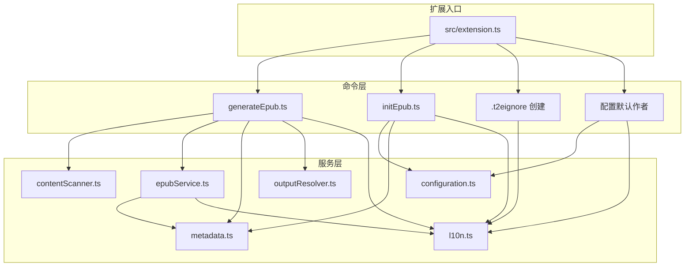
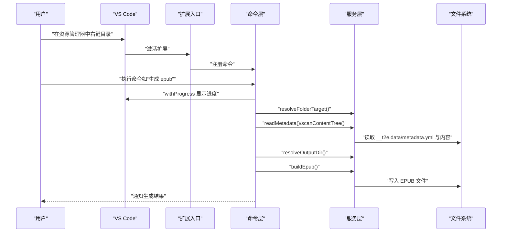
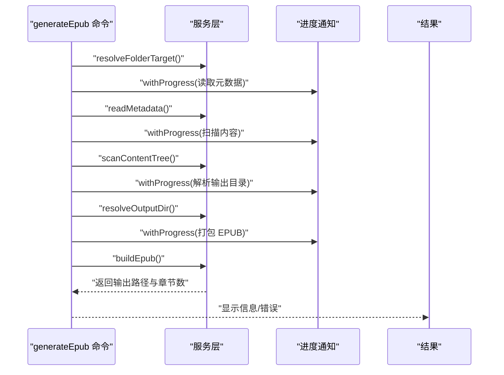
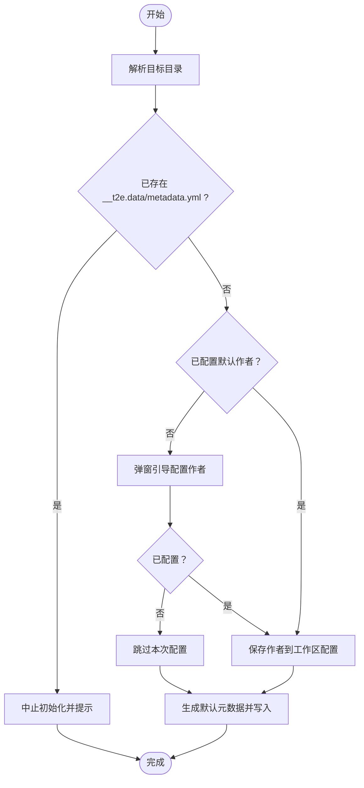
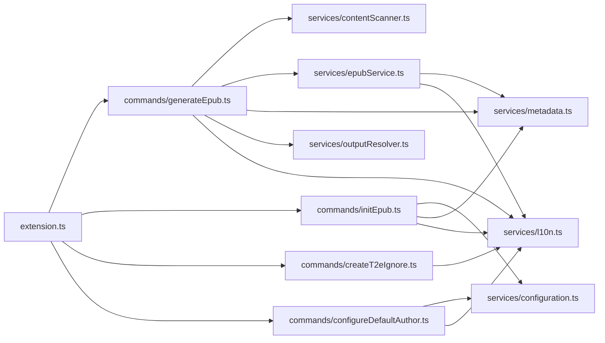

# 扩展开发

<cite>
**本文引用的文件**
- [package.json](file://package.json)
- [README.md](file://README.md)
- [tsconfig.json](file://tsconfig.json)
- [eslint.config.mjs](file://eslint.config.mjs)
- [src/extension.ts](file://src/extension.ts)
- [src/commands/generateEpub.ts](file://src/commands/generateEpub.ts)
- [src/commands/initEpub.ts](file://src/commands/initEpub.ts)
- [src/commands/createT2eIgnore.ts](file://src/commands/createT2eIgnore.ts)
- [src/commands/configureDefaultAuthor.ts](file://src/commands/configureDefaultAuthor.ts)
- [src/services/configuration.ts](file://src/services/configuration.ts)
- [src/services/contentScanner.ts](file://src/services/contentScanner.ts)
- [src/services/epubService.ts](file://src/services/epubService.ts)
- [src/services/metadata.ts](file://src/services/metadata.ts)
- [src/services/outputResolver.ts](file://src/services/outputResolver.ts)
- [src/services/l10n.ts](file://src/services/l10n.ts)
- [l10n/bundle.l10n.json](file://l10n/bundle.l10n.json)
- [l10n/bundle.l10n.zh-cn.json](file://l10n/bundle.l10n.zh-cn.json)
</cite>

## 目录
1. [简介](#简介)
2. [项目结构](#项目结构)
3. [核心组件](#核心组件)
4. [架构总览](#架构总览)
5. [组件详解](#组件详解)
6. [依赖关系分析](#依赖关系分析)
7. [性能考量](#性能考量)
8. [故障排查指南](#故障排查指南)
9. [结论](#结论)
10. [附录](#附录)

## 简介
本指南面向 VS Code 扩展开发者，围绕 Folder2EPUB 扩展的架构与实现进行系统化讲解。内容涵盖扩展生命周期与命令注册、菜单集成、服务层设计与模块化、VS Code API 使用（workspace、window、l10n）、异步与错误处理、国际化、调试与开发工具、性能优化与安全、发布与分发等。读者可据此完成从需求分析到代码实现的全流程开发。

## 项目结构
该仓库采用“命令 + 服务层”的模块化组织方式：
- 入口文件负责注册所有命令，形成扩展生命周期内的对外能力。
- 命令层仅负责参数解析、UI 交互与进度反馈，不承载业务逻辑。
- 服务层封装具体业务：内容扫描、EPUB 构建、元数据解析、输出目录解析、配置与国际化等。
- package.json 定义贡献点（命令、菜单、配置）、依赖与脚本；l10n 提供多语言资源。

图表来源
- [src/extension.ts:13-18](file://src/extension.ts#L13-L18)
- [src/commands/generateEpub.ts:18-65](file://src/commands/generateEpub.ts#L18-L65)
- [src/commands/initEpub.ts:18-62](file://src/commands/initEpub.ts#L18-L62)
- [src/commands/createT2eIgnore.ts:15-33](file://src/commands/createT2eIgnore.ts#L15-L33)
- [src/commands/configureDefaultAuthor.ts:12-25](file://src/commands/configureDefaultAuthor.ts#L12-L25)
- [src/services/configuration.ts:18-79](file://src/services/configuration.ts#L18-L79)
- [src/services/contentScanner.ts:51-58](file://src/services/contentScanner.ts#L51-L58)
- [src/services/epubService.ts:146-216](file://src/services/epubService.ts#L146-L216)
- [src/services/metadata.ts:41-117](file://src/services/metadata.ts#L41-L117)
- [src/services/outputResolver.ts:15-42](file://src/services/outputResolver.ts#L15-L42)
- [src/services/l10n.ts:1-10](file://src/services/l10n.ts#L1-L10)

章节来源
- [package.json:43-96](file://package.json#L43-L96)
- [src/extension.ts:13-23](file://src/extension.ts#L13-L23)

## 核心组件
- 扩展入口与生命周期
  - 入口文件在激活时注册全部命令，停用时预留钩子。
- 命令注册与菜单集成
  - package.json 的 contributes.commands 定义命令与分类；menus.explorer/context 将命令绑定到资源管理器右键菜单。
- 服务层设计
  - 将业务逻辑拆分为内容扫描、EPUB 构建、元数据、输出目录解析、配置与国际化等模块，提升内聚与可测试性。
- VS Code API 使用
  - workspace：读取/更新配置、解析工作区状态。
  - window：输入框、进度、通知、警告/错误消息。
  - l10n：统一本地化消息。
- 国际化
  - l10n 资源位于 l10n 目录，扩展通过 package.json 的 l10n 字段声明本地化目录。

章节来源
- [src/extension.ts:13-23](file://src/extension.ts#L13-L23)
- [package.json:43-96](file://package.json#L43-L96)
- [src/services/l10n.ts:1-10](file://src/services/l10n.ts#L1-L10)

## 架构总览
下图展示了从命令触发到 EPUB 生成的关键调用链路与数据流。

图表来源
- [src/extension.ts:13-18](file://src/extension.ts#L13-L18)
- [src/commands/generateEpub.ts:19-64](file://src/commands/generateEpub.ts#L19-L64)
- [src/services/contentScanner.ts:51-58](file://src/services/contentScanner.ts#L51-L58)
- [src/services/epubService.ts:146-216](file://src/services/epubService.ts#L146-L216)
- [src/services/outputResolver.ts:15-42](file://src/services/outputResolver.ts#L15-L42)

## 组件详解

### 命令注册与菜单集成
- 命令注册
  - 扩展入口在激活时注册四个命令：生成 EPUB、初始化 EPUB、创建 .t2eignore、配置默认作者。
- 菜单集成
  - 在资源管理器目录右键菜单中，针对本地文件夹提供“生成 epub”“新增 .t2eignore”“初始化 epub”，并设置 when 条件与 group 排序。
- 贡献点定义
  - package.json 的 contributes.commands 与 contributes.menus 定义了命令标题、分类、快捷键占位与菜单位置。

章节来源
- [src/extension.ts:13-18](file://src/extension.ts#L13-L18)
- [package.json:44-95](file://package.json#L44-L95)

### 生成 EPUB 命令（generateEpub）
- 流程要点
  - 解析目标目录 → 校验元数据文件存在 → 读取元数据 → 扫描内容树 → 解析输出目录 → 构建 EPUB → 输出结果。
  - 使用进度条分阶段反馈，异常时统一转为错误消息。
- 关键服务
  - 内容扫描：contentScanner.scanContentTree
  - EPUB 构建：epubService.buildEpub
  - 元数据：metadata.readMetadata
  - 输出目录：outputResolver.resolveOutputDir

图表来源
- [src/commands/generateEpub.ts:19-64](file://src/commands/generateepub.ts#L19-L64)
- [src/services/contentScanner.ts:51-58](file://src/services/contentScanner.ts#L51-L58)
- [src/services/epubService.ts:146-216](file://src/services/epubService.ts#L146-L216)
- [src/services/outputResolver.ts:15-42](file://src/services/outputResolver.ts#L15-L42)

章节来源
- [src/commands/generateEpub.ts:18-65](file://src/commands/generateEpub.ts#L18-L65)

### 初始化 EPUB 命令（initEpub）
- 流程要点
  - 解析目标目录 → 检查元数据文件是否存在 → 读取默认作者（若无则引导用户配置）→ 生成默认元数据模板 → 写入 __t2e.data/metadata.yml。
- 关键服务
  - 配置：configuration.getDefaultAuthor / configureDefaultAuthorInteractively
  - 元数据：metadata.createDefaultMetadata / stringifyMetadata

图表来源
- [src/commands/initEpub.ts:19-61](file://src/commands/initEpub.ts#L19-L61)
- [src/services/configuration.ts:47-79](file://src/services/configuration.ts#L47-L79)
- [src/services/metadata.ts:24-69](file://src/services/metadata.ts#L24-L69)

章节来源
- [src/commands/initEpub.ts:18-62](file://src/commands/initEpub.ts#L18-L62)

### 创建 .t2eignore 命令（createT2eIgnore）
- 流程要点
  - 解析目标目录 → 计算 .t2eignore 路径 → 若已存在则警告，否则创建空文件。
- 关键服务
  - folderMatcher.resolveFolderTarget / exists
  - l10n 用于本地化消息

章节来源
- [src/commands/createT2eIgnore.ts:15-33](file://src/commands/createT2eIgnore.ts#L15-L33)

### 配置默认作者命令（configureDefaultAuthor）
- 流程要点
  - 交互式输入作者名 → 校验工作区状态 → 更新工作区配置 → 反馈结果。
- 关键服务
  - configuration.configureDefaultAuthorInteractively / setDefaultAuthor
  - l10n 用于本地化消息

章节来源
- [src/commands/configureDefaultAuthor.ts:12-25](file://src/commands/configureDefaultAuthor.ts#L12-L25)
- [src/services/configuration.ts:47-79](file://src/services/configuration.ts#L47-L79)

### 服务层设计与模块化

#### 内容扫描（contentScanner）
- 功能
  - 递归扫描目录，过滤 __t2e.data 与非 md/txt 文件；支持 .t2eignore；按数字前缀与名称排序；识别 index 文件作为目录入口。
- 数据结构
  - ContentNode/ContentFileNode/ContentFolderNode 表示树与扁平化文件列表。
- 复杂度
  - 时间复杂度近似 O(N log N)，主要由排序决定；空间复杂度 O(N)。

章节来源
- [src/services/contentScanner.ts:10-38](file://src/services/contentScanner.ts#L10-L38)
- [src/services/contentScanner.ts:51-340](file://src/services/contentScanner.ts#L51-L340)

#### EPUB 构建（epubService）
- 功能
  - 将内容树与元数据打包为 EPUB 3：生成 OPF、导航页、NCX、样式表、章节与资源；处理 Markdown frontmatter、图片资源与 HTML 内联图片；校验封面。
- 关键流程
  - createChapters → buildNavEntries → createContentOpf/createNavXhtml/createTocNcx → 写入 ZIP 文件。
- 安全与健壮性
  - XML 转义、媒体类型校验、封面存在性与类型检查、错误消息本地化。

章节来源
- [src/services/epubService.ts:146-800](file://src/services/epubService.ts#L146-L800)

#### 元数据（metadata）
- 功能
  - 读取/写入 YAML 元数据；生成展示标题与文件名；清洗非法字符。
- 错误处理
  - 对 YAML 解析失败与字段类型不合法进行兜底。

章节来源
- [src/services/metadata.ts:41-157](file://src/services/metadata.ts#L41-L157)

#### 输出目录解析（outputResolver）
- 功能
  - 自顶向下查找 __epub.yml，解析 saveTo；支持 ~ 与相对路径；展开到用户目录。
- 边界处理
  - 兼容 YAML 解析 null 的边界情况；无配置时回退到当前目录。

章节来源
- [src/services/outputResolver.ts:15-90](file://src/services/outputResolver.ts#L15-L90)

#### 配置（configuration）
- 功能
  - 读取/设置工作区默认作者；交互式配置；工作区有效性校验。
- 用户体验
  - 输入框标题、提示、占位与信息/警告/错误消息均本地化。

章节来源
- [src/services/configuration.ts:18-79](file://src/services/configuration.ts#L18-L79)

#### 国际化（l10n）
- 功能
  - 暴露 vscode.l10n 对象，业务层统一调用 l10n.t()。
- 资源
  - l10n 目录包含英文与中文资源文件；package.json 声明 l10n 目录。

章节来源
- [src/services/l10n.ts:1-10](file://src/services/l10n.ts#L1-L10)
- [package.json:11](file://package.json#L11)

## 依赖关系分析

图表来源
- [src/extension.ts:3-6](file://src/extension.ts#L3-L6)
- [src/commands/generateEpub.ts:5-11](file://src/commands/generateEpub.ts#L5-L11)
- [src/commands/initEpub.ts:4-8](file://src/commands/initEpub.ts#L4-L8)
- [src/commands/createT2eIgnore.ts:7](file://src/commands/createT2eIgnore.ts#L7)
- [src/commands/configureDefaultAuthor.ts:3](file://src/commands/configureDefaultAuthor.ts#L3)
- [src/services/epubService.ts:13-15](file://src/services/epubService.ts#L13-L15)

章节来源
- [src/extension.ts:13-18](file://src/extension.ts#L13-L18)

## 性能考量
- I/O 与压缩
  - EPUB 打包使用 JSZip 生成压缩包，注意大文件场景的内存占用；可考虑分块写入或流式处理以降低峰值内存。
- 扫描与排序
  - 内容扫描与排序为 O(N log N)，建议在超大目录下提供“预览扫描”或分页展示。
- 渲染与图片处理
  - Markdown 渲染与图片重写遍历 token 树，建议对超长文档分段处理或延迟渲染。
- 进度反馈
  - 使用 withProgress 分阶段报告，避免长时间无响应导致的卡顿感。

[本节为通用指导，无需列出章节来源]

## 故障排查指南
- 常见问题与定位
  - 缺少元数据文件：命令执行前校验 __t2e.data/metadata.yml 是否存在，提示先初始化。
  - 无可用内容：扫描结果为空时抛出明确错误，检查 .t2eignore 与文件扩展名。
  - 输出目录解析失败：检查 __epub.yml 的 saveTo 配置与路径格式。
  - 封面缺失或格式不支持：构建阶段校验封面文件存在性与媒体类型。
- 错误消息本地化
  - 统一通过 l10n.t() 输出，确保用户看到符合当前语言的消息。
- 调试建议
  - 使用 VS Code F5 启动扩展主机，右键本地目录触发菜单命令；结合控制台日志与断点定位问题。

章节来源
- [src/commands/generateEpub.ts:23-26](file://src/commands/generateEpub.ts#L23-L26)
- [src/commands/generateEpub.ts:41-43](file://src/commands/generateEpub.ts#L41-L43)
- [src/services/epubService.ts:604-633](file://src/services/epubService.ts#L604-L633)
- [README.md:131-135](file://README.md#L131-L135)

## 结论
本扩展以清晰的命令-服务分层实现了“目录即书籍”的 EPUB 生成能力。通过 VS Code API 的合理使用与本地化支持，提供了良好的用户体验。建议在后续迭代中关注大文件场景的性能优化、更细粒度的进度反馈与可配置的构建选项。

[本节为总结性内容，无需列出章节来源]

## 附录

### VS Code API 使用要点
- workspace
  - 读取配置：getConfiguration(section).inspect(key) / update(key, value, target)
  - 工作区状态：判断是否存在工作区文件与文件夹
- window
  - 输入框：showInputBox(options)
  - 进度：withProgress(options, callback)
  - 通知：showInformationMessage / showWarningMessage / showErrorMessage
- l10n
  - 统一消息：l10n.t(默认英文文本, ...args)

章节来源
- [src/services/configuration.ts:18-79](file://src/services/configuration.ts#L18-L79)
- [src/commands/generateEpub.ts:28-57](file://src/commands/generateEpub.ts#L28-L57)
- [src/services/l10n.ts:1-10](file://src/services/l10n.ts#L1-L10)

### 新功能开发流程（从需求到实现）
- 需求分析
  - 明确输入/输出、约束条件（如文件类型、忽略规则、输出位置）。
- 设计
  - 命令层：职责最小化，仅处理参数与 UI；服务层：封装业务逻辑与数据结构。
- 实现
  - 在 src/services 下新增模块，暴露纯函数；在 src/commands 下注册命令并调用服务。
- 测试
  - 单元测试覆盖关键算法（如排序、路径解析、文件名清洗）。
- 文档与国际化
  - 更新 README 与 l10n 资源，确保消息一致。
- 发布
  - 本地构建与打包，检查图标与图片链接，登录发布者账号并发布。

[本节为通用流程说明，无需列出章节来源]

### 调试技巧与开发工具
- 调试
  - 使用 VS Code F5 启动扩展主机，右键本地目录触发菜单命令。
- 代码质量
  - ESLint 配置已启用，遵循 @antfu/eslint-config；可调整规则以满足团队规范。
- 类型与编译
  - TypeScript 目标 ES2022，模块解析 node16；构建产物输出至 dist。

章节来源
- [README.md:131-135](file://README.md#L131-L135)
- [eslint.config.mjs:1-22](file://eslint.config.mjs#L1-L22)
- [tsconfig.json:1-25](file://tsconfig.json#L1-L25)

### 发布与分发流程
- 准备
  - 修改 package.json 中 publisher、version 等字段；确保图标为 PNG；检查 README/图片链接。
- 登录与打包
  - 使用 vsce login 与 npm run package 生成 .vsix。
- 发布
  - npx @vscode/vsce publish 或手动上传 .vsix 至 Marketplace。
- 发布前检查
  - 图标格式、图片链接、SVG 使用限制；建议执行 lint、compile、package 三步验证。

章节来源
- [README.md:136-232](file://README.md#L136-L232)
- [package.json:112-114](file://package.json#L112-L114)