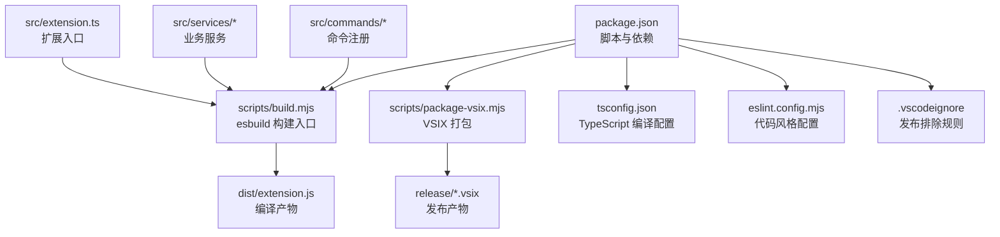
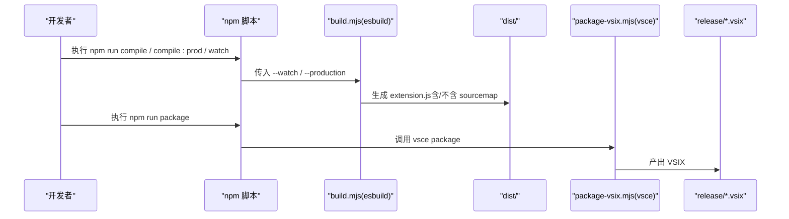
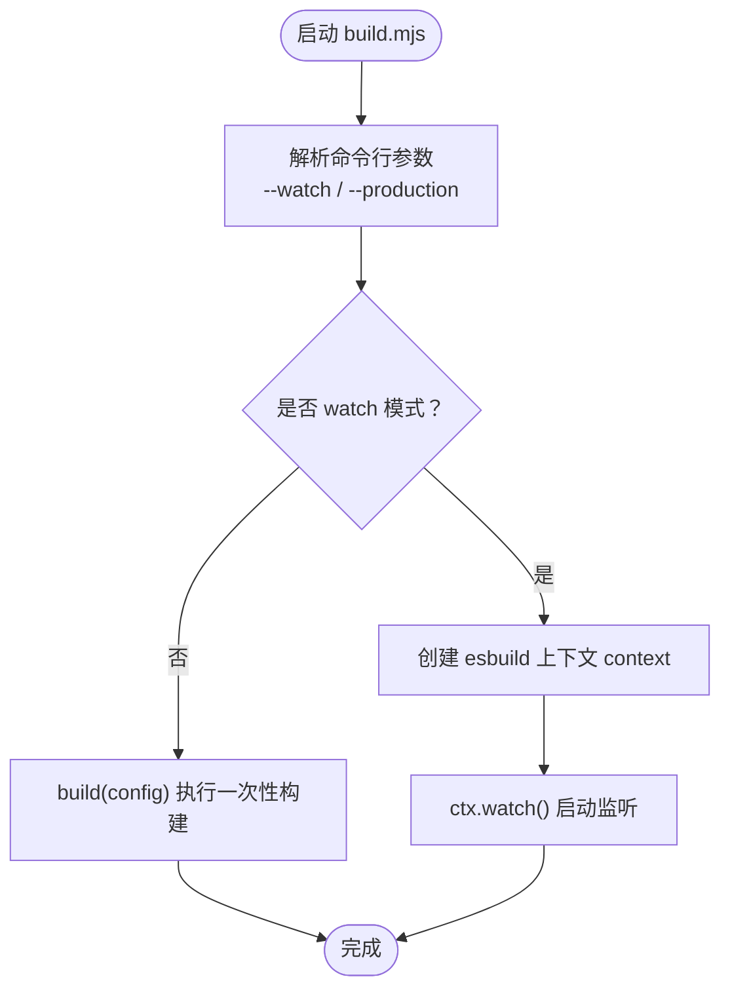
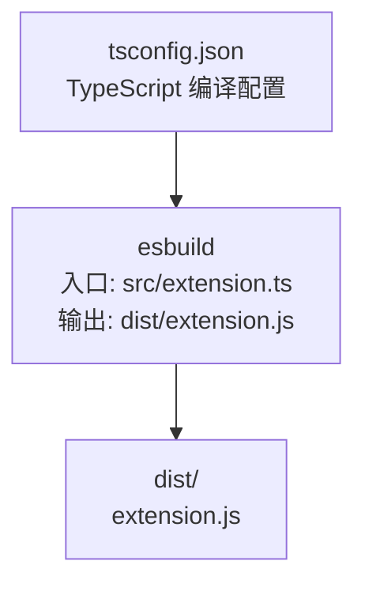
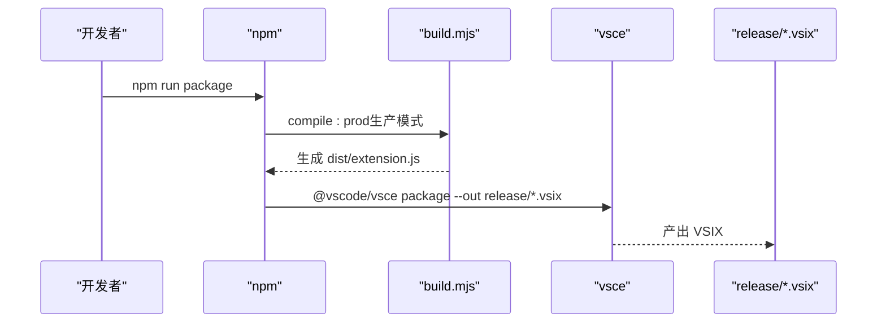
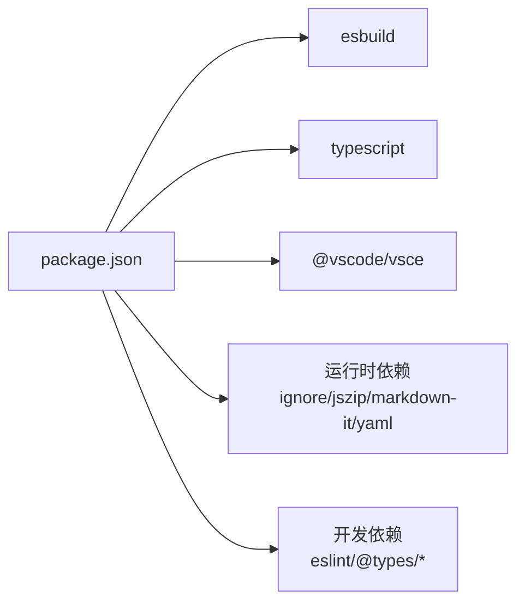

# 构建与编译

<cite>
**本文引用的文件**
- [scripts/build.mjs](file://scripts/build.mjs)
- [package.json](file://package.json)
- [tsconfig.json](file://tsconfig.json)
- [eslint.config.mjs](file://eslint.config.mjs)
- [scripts/generate-icon.mjs](file://scripts/generate-icon.mjs)
- [scripts/package-vsix.mjs](file://scripts/package-vsix.mjs)
- [src/extension.ts](file://src/extension.ts)
- [src/services/configuration.ts](file://src/services/configuration.ts)
- [src/commands/generateEpub.ts](file://src/commands/generateEpub.ts)
- [.vscodeignore](file://.vscodeignore)
- [README.md](file://README.md)
</cite>

## 目录
1. [简介](#简介)
2. [项目结构](#项目结构)
3. [核心组件](#核心组件)
4. [架构总览](#架构总览)
5. [详细组件分析](#详细组件分析)
6. [依赖分析](#依赖分析)
7. [性能考量](#性能考量)
8. [故障排查指南](#故障排查指南)
9. [结论](#结论)
10. [附录](#附录)

## 简介
本指南聚焦 VS Code Folder2EPUB 扩展的构建与编译体系，围绕构建脚本、编译流程、esbuild 配置、生产与开发模式、watch 实时编译、产物组织与优化策略进行系统讲解，并提供常见问题与排障建议。读者无需深入的工程背景即可理解并高效使用本项目的构建链路。

## 项目结构
该项目采用“脚本驱动 + esbuild 编译 + VS Code 扩展打包”的组合方案：
- 构建脚本位于 scripts/build.mjs，负责 TypeScript 到 JavaScript 的编译与打包。
- package.json 定义了构建、打包、预发布等脚本命令。
- tsconfig.json 控制 TypeScript 编译选项，确保源码与目标产物的一致性。
- scripts/generate-icon.mjs 用于生成扩展图标（PNG/SVG）。
- scripts/package-vsix.mjs 用于调用 vsce 打包 VSIX。
- src/extension.ts 为扩展入口，其余模块按功能分层组织在 services 与 commands 下。
- .vscodeignore 控制发布时排除的文件与目录。

图表来源
- [package.json:12-22](file://package.json#L12-L22)
- [scripts/build.mjs:12-27](file://scripts/build.mjs#L12-L27)
- [tsconfig.json:1-25](file://tsconfig.json#L1-L25)
- [.vscodeignore:1-24](file://.vscodeignore#L1-L24)

章节来源
- [package.json:12-22](file://package.json#L12-L22)
- [tsconfig.json:1-25](file://tsconfig.json#L1-L25)
- [.vscodeignore:1-24](file://.vscodeignore#L1-L24)

## 核心组件
- 构建脚本 build.mjs：基于 esbuild 的异步构建入口，支持 watch 与生产模式，定义入口、目标平台、格式、外部依赖、源码映射与压缩等关键配置。
- package.json：定义 npm 脚本（compile、compile:prod、watch、package 等）、主入口指向 dist/extension.js、开发依赖（esbuild、typescript 等）。
- tsconfig.json：TypeScript 编译目标与模块系统设置，确保与 esbuild 的 Node 平台兼容。
- scripts/generate-icon.mjs：生成扩展图标（PNG/SVG），用于媒体资源。
- scripts/package-vsix.mjs：调用 vsce 打包 VSIX，输出至 release 目录。
- src/extension.ts：扩展激活入口，注册所有命令。
- .vscodeignore：发布时排除 src、scripts、example、测试、源码映射等文件。

章节来源
- [scripts/build.mjs:12-27](file://scripts/build.mjs#L12-L27)
- [package.json:8-22](file://package.json#L8-L22)
- [tsconfig.json:2-20](file://tsconfig.json#L2-L20)
- [scripts/generate-icon.mjs:1-631](file://scripts/generate-icon.mjs#L1-L631)
- [scripts/package-vsix.mjs:1-57](file://scripts/package-vsix.mjs#L1-L57)
- [src/extension.ts:1-24](file://src/extension.ts#L1-L24)
- [.vscodeignore:1-24](file://.vscodeignore#L1-L24)

## 架构总览
下图展示了从源码到 VSIX 的完整构建与发布链路，涵盖开发与生产的差异、watch 模式与产物组织。

图表来源
- [package.json:12-22](file://package.json#L12-L22)
- [scripts/build.mjs:9-37](file://scripts/build.mjs#L9-L37)
- [scripts/package-vsix.mjs:21-31](file://scripts/package-vsix.mjs#L21-L31)

## 详细组件分析

### 构建脚本 build.mjs：工作原理与参数
- 入口与目标
  - 入口点：src/extension.ts
  - 输出：dist/extension.js
  - 平台与目标：node、node20
  - 格式：cjs（CommonJS）
- 关键配置
  - external: ['vscode']，避免将 VS Code API 打包进扩展
  - mainFields: ['module', 'main']，选择模块解析优先级
  - sourcemap: 非生产模式启用
  - minify: 生产模式启用
  - define: 注入 NODE_ENV，区分开发/生产
- 模式切换
  - watch 模式：通过 --watch 启用，使用 context.watch() 实时监听变更
  - 生产模式：通过 --production 启用压缩与关闭 sourcemap

图表来源
- [scripts/build.mjs:9-37](file://scripts/build.mjs#L9-L37)

章节来源
- [scripts/build.mjs:12-27](file://scripts/build.mjs#L12-L27)
- [scripts/build.mjs:29-37](file://scripts/build.mjs#L29-L37)

### TypeScript 到 JavaScript 的编译流程
- TypeScript 编译器配置
  - module/target/lib/moduleResolution：与 esbuild 的 node 平台保持一致，避免运行时错误
  - outDir/rootDir：dist/src，确保产物目录结构清晰
  - sourceMap：开启，便于调试
  - strict/esModuleInterop/resolveJsonModule/skipLibCheck/types：提升类型安全与互操作性
- esbuild 编译
  - 以 src/extension.ts 为入口，bundle 打包所有依赖（除 external 的 vscode）
  - 输出 dist/extension.js，格式 cjs，平台 node，目标 node20
  - sourcemap 与 minify 根据模式动态开启

图表来源
- [tsconfig.json:2-20](file://tsconfig.json#L2-L20)
- [scripts/build.mjs:12-27](file://scripts/build.mjs#L12-L27)

章节来源
- [tsconfig.json:2-20](file://tsconfig.json#L2-L20)
- [scripts/build.mjs:12-27](file://scripts/build.mjs#L12-L27)

### 生产环境与开发环境的构建模式
- 开发模式（默认）
  - sourcemap: true
  - minify: false
  - define: NODE_ENV='development'
  - 适合调试与快速迭代
- 生产模式（--production）
  - sourcemap: false
  - minify: true
  - define: NODE_ENV='production'
  - 适合发布与打包

章节来源
- [scripts/build.mjs:9-27](file://scripts/build.mjs#L9-L27)
- [package.json:14-16](file://package.json#L14-L16)

### watch 模式下的实时编译配置
- 启动方式：npm run watch
- 行为：使用 esbuild context.watch()，监听文件变更并增量重建
- 日志级别：logLevel: 'info'

章节来源
- [package.json:16](file://package.json#L16)
- [scripts/build.mjs:30-33](file://scripts/build.mjs#L30-L33)

### dist 目录结构与产物组织
- dist/extension.js：扩展主入口的编译产物，由 esbuild 生成
- 其他源码映射文件（.map）与 TypeScript 源码（.ts/.tsx）不会进入发布包（受 .vscodeignore 控制）

章节来源
- [package.json:10](file://package.json#L10)
- [.vscodeignore:18-23](file://.vscodeignore#L18-L23)

### VSIX 打包与发布流程
- 打包命令：npm run package
- 流程：先执行 compile:prod，再调用 vsce package 输出到 release 目录
- 输出：release/<name>-<version>.vsix

图表来源
- [package.json:21](file://package.json#L21)
- [scripts/package-vsix.mjs:21-31](file://scripts/package-vsix.mjs#L21-L31)

章节来源
- [package.json:21](file://package.json#L21)
- [scripts/package-vsix.mjs:21-31](file://scripts/package-vsix.mjs#L21-L31)

### 扩展入口与模块组织
- src/extension.ts：激活函数中注册所有命令（生成 EPUB、初始化 EPUB、创建 .t2eignore、配置默认作者）
- services 与 commands：按职责拆分，便于维护与测试

章节来源
- [src/extension.ts:13-18](file://src/extension.ts#L13-L18)
- [src/commands/generateEpub.ts:18-66](file://src/commands/generateEpub.ts#L18-L66)
- [src/services/configuration.ts:18-40](file://src/services/configuration.ts#L18-L40)

## 依赖分析
- 构建工具链
  - esbuild：高性能打包与编译，支持 watch、minify、sourcemap
  - TypeScript：类型安全与模块解析
  - vsce：VSIX 打包
- 运行时依赖
  - ignore/jszip/markdown-it/yaml：EPUB 生成与内容处理所需
- 开发依赖
  - @antfu/eslint-config/eslint/typescript/@types/*：代码规范与类型声明

图表来源
- [package.json:97-112](file://package.json#L97-L112)

章节来源
- [package.json:97-112](file://package.json#L97-L112)

## 性能考量
- 使用 esbuild 的优势
  - 构建速度快，支持 watch 增量编译
  - 仅打包扩展自身代码，external 排除 vscode，减少体积
- 生产模式优化
  - 启用 minify，减小产物体积
  - 关闭 sourcemap，降低构建时间与产物大小
- TypeScript 与 esbuild 的协同
  - tsconfig.json 与 esbuild 的 target/platform 保持一致，避免运行时错误
  - sourceMap 在开发模式开启，便于调试
- 发布体积控制
  - .vscodeignore 排除 src、scripts、example、测试、源码映射与 node_modules，确保发布包精简

章节来源
- [scripts/build.mjs:17-26](file://scripts/build.mjs#L17-L26)
- [tsconfig.json:2-20](file://tsconfig.json#L2-L20)
- [.vscodeignore:1-24](file://.vscodeignore#L1-L24)

## 故障排查指南
- 构建失败
  - 常见原因
    - TypeScript 编译错误：检查 tsconfig.json 与源码类型标注
    - esbuild 外部依赖问题：确认 external 是否包含 vscode
    - 权限不足：确保 dist 与 release 目录可写
  - 排查步骤
    - 清理产物：npm run clean
    - 重新安装依赖：npm install
    - 单独运行构建：node scripts/build.mjs 或 node scripts/build.mjs --production
- watch 模式无变化
  - 确认已执行 npm run watch
  - 检查文件是否被 .vscodeignore 排除
  - 查看终端日志，确认 esbuild context 正常
- VSIX 打包失败
  - 确认已执行 npm run compile:prod
  - 检查 package.json 中 name/version/publisher/icon 等字段
  - 使用 npx @vscode/vsce login 登录并确保权限
- 发布前检查
  - 参考 README 的发布前检查清单，确保图标非 SVG、README 中图片使用 HTTPS、避免用户提供的 SVG 导致发布失败

章节来源
- [scripts/build.mjs:39-42](file://scripts/build.mjs#L39-L42)
- [package.json:17-22](file://package.json#L17-L22)
- [README.md:172-232](file://README.md#L172-L232)

## 结论
本项目采用 esbuild 驱动的构建链路，结合 TypeScript 与 VS Code 扩展生态，实现了快速、稳定、可发布的构建流程。通过区分开发与生产模式、启用 watch 增量编译、合理组织 dist 产物与发布排除规则，能够在保证开发效率的同时，产出高质量的 VSIX 包。建议在团队协作中统一使用 npm 脚本，遵循发布前检查清单，确保发布质量与一致性。

## 附录
- 常用命令
  - 开发：npm run watch
  - 构建：npm run compile
  - 生产构建：npm run compile:prod
  - 打包 VSIX：npm run package
  - 清理：npm run clean
  - 代码检查：npm run lint / npm run lint:fix
- 图标生成
  - scripts/generate-icon.mjs 支持生成 PNG/SVG 图标，默认输出到 media/icon.{png|svg}

章节来源
- [package.json:12-22](file://package.json#L12-L22)
- [scripts/generate-icon.mjs:38-48](file://scripts/generate-icon.mjs#L38-L48)