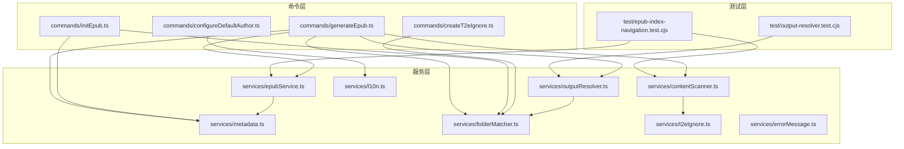
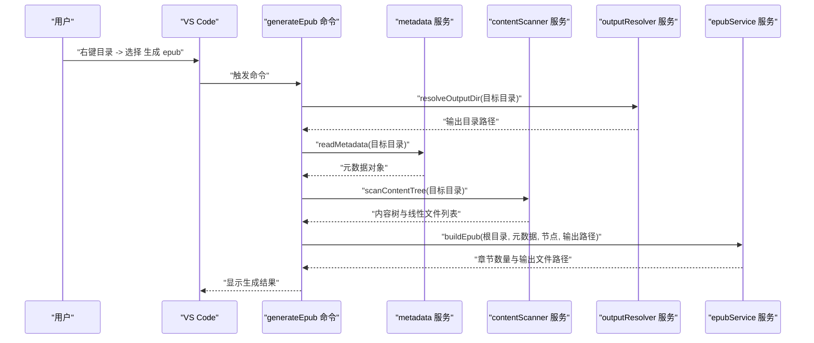
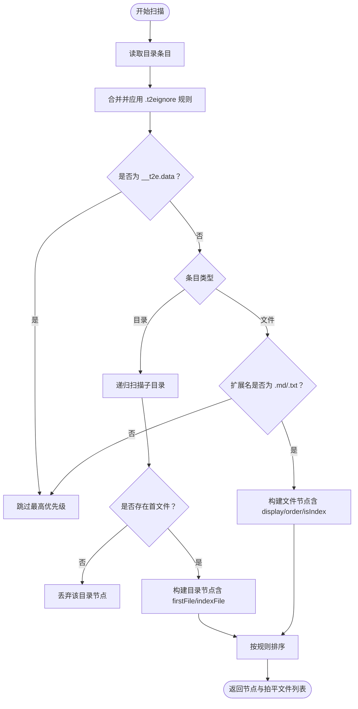
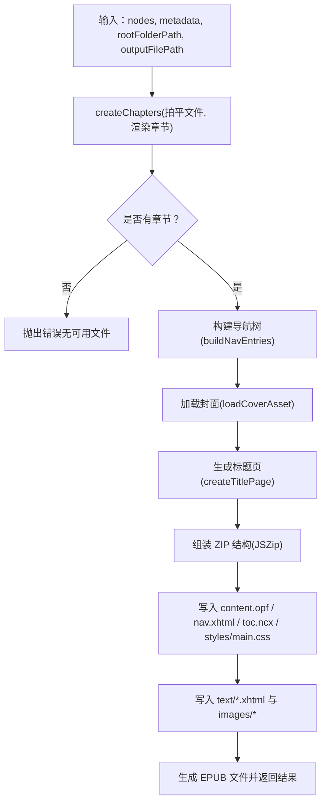
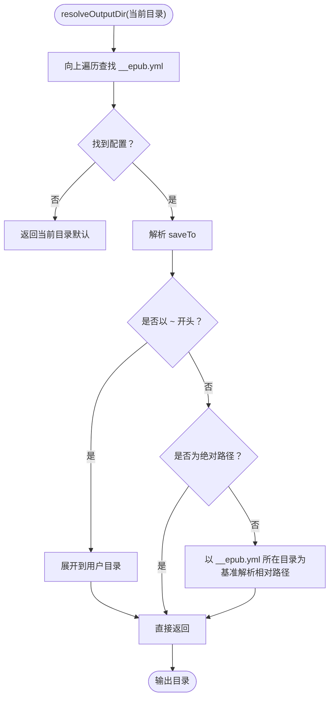
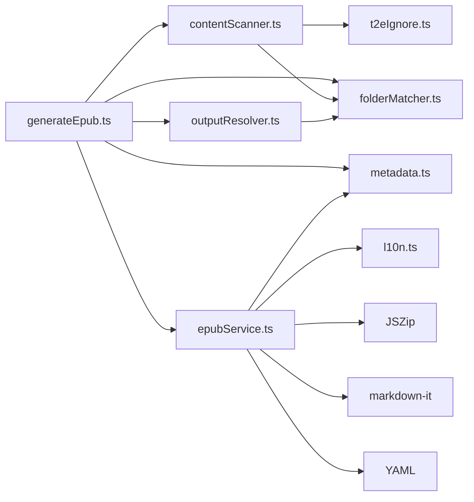

# 测试指南

<cite>
**本文引用的文件**
- [package.json](file://package.json)
- [README.md](file://README.md)
- [src/extension.ts](file://src/extension.ts)
- [src/commands/generateEpub.ts](file://src/commands/generateEpub.ts)
- [src/commands/initEpub.ts](file://src/commands/initEpub.ts)
- [src/commands/createT2eIgnore.ts](file://src/commands/createT2eIgnore.ts)
- [src/commands/configureDefaultAuthor.ts](file://src/commands/configureDefaultAuthor.ts)
- [src/services/contentScanner.ts](file://src/services/contentScanner.ts)
- [src/services/epubService.ts](file://src/services/epubService.ts)
- [src/services/outputResolver.ts](file://src/services/outputResolver.ts)
- [src/services/metadata.ts](file://src/services/metadata.ts)
- [src/services/folderMatcher.ts](file://src/services/folderMatcher.ts)
- [src/services/t2eIgnore.ts](file://src/services/t2eIgnore.ts)
- [src/services/l10n.ts](file://src/services/l10n.ts)
- [src/services/errorMessage.ts](file://src/services/errorMessage.ts)
- [test/epub-index-navigation.test.cjs](file://test/epub-index-navigation.test.cjs)
- [test/output-resolver.test.cjs](file://test/output-resolver.test.cjs)
</cite>

## 目录
1. [简介](#简介)
2. [项目结构](#项目结构)
3. [核心组件](#核心组件)
4. [架构总览](#架构总览)
5. [详细组件分析](#详细组件分析)
6. [依赖关系分析](#依赖关系分析)
7. [性能考量](#性能考量)
8. [故障排查指南](#故障排查指南)
9. [结论](#结论)
10. [附录](#附录)

## 简介
本测试指南面向 VS Code Folder2EPUB 扩展，提供从测试框架、测试环境搭建、单元测试与集成测试编写、覆盖率与质量标准、关键功能模块测试策略、测试数据与模拟对象使用、测试执行与 CI/CD 集成，到调试技巧与常见问题解决方案的完整实践说明。目标是帮助开发者在不深入源码细节的前提下，也能高效地验证内容扫描、EPUB 构建与输出解析等核心流程的正确性与鲁棒性。

## 项目结构
- 测试位于 test/ 目录，采用 Node.js 原生测试框架（node:test）与断言库（node:assert/strict），并使用 JSZip 读取生成的 EPUB 文件进行校验。
- 源代码位于 src/ 目录，按职责分为命令层（commands）与服务层（services）。命令层负责与 VS Code 扩展生命周期与 UI 交互对接；服务层封装业务逻辑，如内容扫描、EPUB 构建、元数据与输出目录解析等。
- package.json 中定义了构建脚本与开发依赖，测试脚本尚未内置，可在后续章节中补充。

图表来源
- [src/commands/generateEpub.ts:1-66](file://src/commands/generateEpub.ts#L1-L66)
- [src/services/contentScanner.ts:1-340](file://src/services/contentScanner.ts#L1-L340)
- [src/services/epubService.ts:1-800](file://src/services/epubService.ts#L1-L800)
- [src/services/outputResolver.ts:1-90](file://src/services/outputResolver.ts#L1-L90)
- [src/services/metadata.ts:1-157](file://src/services/metadata.ts#L1-L157)
- [src/services/folderMatcher.ts:1-85](file://src/services/folderMatcher.ts#L1-L85)
- [src/services/t2eIgnore.ts:1-45](file://src/services/t2eIgnore.ts#L1-L45)
- [src/services/l10n.ts:1-10](file://src/services/l10n.ts#L1-L10)
- [src/services/errorMessage.ts:1-16](file://src/services/errorMessage.ts#L1-L16)
- [test/epub-index-navigation.test.cjs:1-140](file://test/epub-index-navigation.test.cjs#L1-L140)
- [test/output-resolver.test.cjs:1-72](file://test/output-resolver.test.cjs#L1-L72)

章节来源
- [README.md:124-135](file://README.md#L124-L135)
- [package.json:12-22](file://package.json#L12-L22)

## 核心组件
- 内容扫描（contentScanner）：负责扫描目录、解析数字前缀排序、识别 index 文件、构建树状与线性节点结构，并应用 .t2eignore 规则与 __t2e.data 系统保留目录策略。
- EPUB 构建（epubService）：将扫描结果渲染为 XHTML 章节，收集图片资源，生成 content.opf、nav.xhtml、toc.ncx、样式表与封面，最终打包为 EPUB。
- 输出解析（outputResolver）：自顶向下查找 __epub.yml，解析 saveTo 配置，支持 ~ 与相对路径展开。
- 元数据（metadata）：读取/写入 metadata.yml，格式化文件名，提供展示标题与作者。
- 目录匹配（folderMatcher）：解析目标目录、计算 __t2e.data 与 metadata.yml 路径，判断文件存在性。
- 忽略规则（t2eIgnore）：读取 .t2eignore，基于 ignore 库实现 .gitignore 语义过滤。
- 命令（commands）：注册扩展命令，串联元数据读取、内容扫描、输出目录解析与 EPUB 打包流程。

章节来源
- [src/services/contentScanner.ts:51-340](file://src/services/contentScanner.ts#L51-L340)
- [src/services/epubService.ts:146-216](file://src/services/epubService.ts#L146-L216)
- [src/services/outputResolver.ts:15-42](file://src/services/outputResolver.ts#L15-L42)
- [src/services/metadata.ts:41-117](file://src/services/metadata.ts#L41-L117)
- [src/services/folderMatcher.ts:23-84](file://src/services/folderMatcher.ts#L23-L84)
- [src/services/t2eIgnore.ts:13-44](file://src/services/t2eIgnore.ts#L13-L44)
- [src/commands/generateEpub.ts:18-65](file://src/commands/generateEpub.ts#L18-L65)

## 架构总览
下图展示了“生成 EPUB”命令的端到端流程，从 VS Code 命令触发到最终输出文件落地，中间穿插了元数据读取、内容扫描、输出目录解析与 EPUB 打包等步骤。

图表来源
- [src/commands/generateEpub.ts:19-57](file://src/commands/generateEpub.ts#L19-L57)
- [src/services/outputResolver.ts:15-42](file://src/services/outputResolver.ts#L15-L42)
- [src/services/metadata.ts:41-59](file://src/services/metadata.ts#L41-L59)
- [src/services/contentScanner.ts:51-58](file://src/services/contentScanner.ts#L51-L58)
- [src/services/epubService.ts:146-216](file://src/services/epubService.ts#L146-L216)

## 详细组件分析

### 内容扫描（contentScanner）
- 关键职责：扫描目录、解析数字前缀排序、识别 index 文件、构建树与拍平文件列表、应用 .t2eignore 与 __t2e.data 策略。
- 测试要点：
  - 目录优先链接 index 且隐藏独立目录项
  - 无 index 时遵循首文件跳转规则
  - 深层子目录 index 回退策略
  - 数字前缀与中文友好排序
  - 忽略规则与 __t2e.data 系统保留目录
- 断言建议：
  - 校验节点类型（folder/file）、display 名称、order 值
  - 校验 firstFile/indexFile 的选择逻辑
  - 校验 flattenFiles 的线性顺序
  - 校验 .t2eignore 与 __t2e.data 的过滤效果

图表来源
- [src/services/contentScanner.ts:258-329](file://src/services/contentScanner.ts#L258-L329)
- [src/services/t2eIgnore.ts:13-26](file://src/services/t2eIgnore.ts#L13-L26)
- [src/services/folderMatcher.ts:46-58](file://src/services/folderMatcher.ts#L46-L58)

章节来源
- [src/services/contentScanner.ts:51-340](file://src/services/contentScanner.ts#L51-L340)
- [test/epub-index-navigation.test.cjs:74-140](file://test/epub-index-navigation.test.cjs#L74-L140)

### EPUB 构建（epubService）
- 关键职责：渲染章节、收集图片、生成 OPF/导航/NCX/样式、打包 EPUB。
- 测试要点：
  - 无可用文件时抛出明确错误
  - 导航结构与目录层级映射正确
  - 章节编号与命名规范
  - 图片资源收集与重写路径
  - 封面加载与媒体类型校验
  - 标题页与 spine 顺序
- 断言建议：
  - 校验生成的 mimetype、container.xml、content.opf、nav.xhtml、toc.ncx、main.css
  - 校验章节数量与首章存在性
  - 校验图片资源与 manifest 条目
  - 校验封面存在与媒体类型

图表来源
- [src/services/epubService.ts:146-216](file://src/services/epubService.ts#L146-L216)
- [src/services/epubService.ts:494-544](file://src/services/epubService.ts#L494-L544)
- [src/services/epubService.ts:226-260](file://src/services/epubService.ts#L226-L260)
- [src/services/epubService.ts:604-633](file://src/services/epubService.ts#L604-L633)

章节来源
- [src/services/epubService.ts:146-800](file://src/services/epubService.ts#L146-L800)
- [test/epub-index-navigation.test.cjs:39-72](file://test/epub-index-navigation.test.cjs#L39-L72)

### 输出解析（outputResolver）
- 关键职责：自顶向下查找 __epub.yml，解析 saveTo，支持 ~ 与相对路径展开。
- 测试要点：
  - saveTo: ~/... 展开到用户目录
  - saveTo: ~ 直接指向用户目录
  - 相对路径基于 __epub.yml 所在目录解析
- 断言建议：
  - 校验返回的绝对路径
  - 校验 YAML 解析兼容性（含裸 ~ 场景）

图表来源
- [src/services/outputResolver.ts:15-42](file://src/services/outputResolver.ts#L15-L42)
- [src/services/outputResolver.ts:50-89](file://src/services/outputResolver.ts#L50-L89)

章节来源
- [src/services/outputResolver.ts:15-90](file://src/services/outputResolver.ts#L15-L90)
- [test/output-resolver.test.cjs:36-71](file://test/output-resolver.test.cjs#L36-L71)

### 命令层（generateEpub）
- 关键职责：串联元数据读取、内容扫描、输出目录解析与 EPUB 打包，并提供进度反馈与错误提示。
- 测试要点：
  - 缺失 metadata.yml 时的警告与提前返回
  - 无可用文件时的错误提示
  - 成功生成后的结果展示
- 断言建议：
  - 校验命令注册与生命周期
  - 校验进度消息与最终信息/错误消息

章节来源
- [src/commands/generateEpub.ts:18-65](file://src/commands/generateEpub.ts#L18-L65)
- [src/extension.ts:13-23](file://src/extension.ts#L13-L23)

## 依赖关系分析
- 命令层依赖服务层：generateEpub 依赖 contentScanner、epubService、outputResolver、metadata、folderMatcher。
- 服务层内部耦合：
  - contentScanner 依赖 t2eIgnore 与 folderMatcher
  - epubService 依赖 metadata、l10n、JSZip、markdown-it、YAML
  - outputResolver 依赖 folderMatcher 与 YAML
- 测试对被测函数的依赖最小化，通过临时目录与 JSZip 读取 EPUB 内容进行断言。

图表来源
- [src/commands/generateEpub.ts:5-11](file://src/commands/generateEpub.ts#L5-L11)
- [src/services/contentScanner.ts:1-7](file://src/services/contentScanner.ts#L1-L7)
- [src/services/epubService.ts:1-15](file://src/services/epubService.ts#L1-L15)
- [src/services/outputResolver.ts:1-8](file://src/services/outputResolver.ts#L1-L8)
- [src/services/metadata.ts:1-7](file://src/services/metadata.ts#L1-L7)
- [src/services/folderMatcher.ts:1-6](file://src/services/folderMatcher.ts#L1-L6)
- [src/services/t2eIgnore.ts:1-4](file://src/services/t2eIgnore.ts#L1-L4)
- [src/services/l10n.ts:1-10](file://src/services/l10n.ts#L1-L10)

章节来源
- [src/commands/generateEpub.ts:18-65](file://src/commands/generateEpub.ts#L18-L65)
- [src/services/contentScanner.ts:51-340](file://src/services/contentScanner.ts#L51-L340)
- [src/services/epubService.ts:146-800](file://src/services/epubService.ts#L146-L800)
- [src/services/outputResolver.ts:15-90](file://src/services/outputResolver.ts#L15-L90)

## 性能考量
- 扫描与渲染：
  - 大型目录扫描与大量图片渲染可能成为瓶颈。建议在测试中使用中等规模示例目录，避免极端大文件与超多图片。
  - 对图片资源的收集与重写应避免重复处理，epubService 中已通过 Map 去重。
- I/O 与压缩：
  - EPUB 打包涉及多次文件读写与 ZIP 压缩，建议在内存中构造临时目录并在完成后清理，减少磁盘抖动。
- 并行与批处理：
  - 对于多文件渲染，可考虑分批处理与进度上报，但当前命令层已提供阶段性进度提示。

## 故障排查指南
- 常见错误与定位：
  - “无可用文件生成 EPUB”：检查 contentScanner 是否正确拍平文件、是否被 .t2eignore 过滤、__t2e.data 是否被误过滤。
  - “缺少导航/首章文件”：确认 buildNavEntries 与 createChapters 的映射关系，校验 index 文件选择逻辑。
  - “封面未找到/格式不支持”：核对 metadata.yml 中 cover 配置与 __t2e.data 下文件存在性及媒体类型。
  - “输出目录解析异常”：检查 __epub.yml 的 saveTo 配置、路径展开与相对路径解析。
- 调试技巧：
  - 使用临时目录与 JSZip 读取 EPUB 内容，断言关键文件存在与内容片段。
  - 在命令层 withProgress 中观察阶段性消息，定位卡顿环节。
  - 对照测试用例的目录结构与断言，逐步缩小问题范围。

章节来源
- [src/services/epubService.ts:156-158](file://src/services/epubService.ts#L156-L158)
- [src/services/epubService.ts:604-633](file://src/services/epubService.ts#L604-L633)
- [src/services/outputResolver.ts:15-42](file://src/services/outputResolver.ts#L15-L42)
- [test/epub-index-navigation.test.cjs:39-72](file://test/epub-index-navigation.test.cjs#L39-L72)

## 结论
本指南提供了针对 Folder2EPUB 的测试策略与实施路径：以现有测试为起点，围绕内容扫描、EPUB 构建与输出解析三大核心模块设计单元与集成测试；通过临时目录与 EPUB 内容断言，确保关键流程的正确性与稳定性；结合进度提示与错误消息，提升用户体验与可观测性。建议在 CI/CD 中引入自动化测试与覆盖率统计，持续保障质量。

## 附录

### 测试框架与环境搭建
- 测试框架：Node.js 原生测试（node:test）与断言（node:assert/strict），第三方依赖 JSZip 用于读取 EPUB 内容。
- 运行环境：Node.js（与 VS Code 扩展引擎版本兼容），建议使用与项目 ESLint 配置一致的 Node 版本。
- 依赖安装：执行安装脚本后，确保 dist 目录产物可用（由编译脚本生成）。

章节来源
- [package.json:12-22](file://package.json#L12-L22)
- [test/epub-index-navigation.test.cjs:1-11](file://test/epub-index-navigation.test.cjs#L1-L11)
- [test/output-resolver.test.cjs:1-7](file://test/output-resolver.test.cjs#L1-L7)

### 单元测试编写方法
- 测试组织：
  - 每个被测函数/模块对应一个测试文件或测试用例组。
  - 使用临时目录模拟文件系统，结束后清理。
- 测试用例设计：
  - 正常路径：覆盖 index 优先、排序规则、图片收集、封面加载等。
  - 边界条件：空目录、仅目录无文件、全被忽略、无 metadata.yml、无 __epub.yml 等。
  - 错误场景：无可用文件、封面缺失/非文件、不支持的封面格式、路径展开失败等。
- 断言使用：
  - 使用 strict 断言进行精确匹配，如节点类型、display 名称、顺序、文件存在性、EPUB 内容片段等。
  - 对 XML/HTML/XHTML 片段使用正则匹配，避免脆弱的结构断言。

章节来源
- [test/epub-index-navigation.test.cjs:74-140](file://test/epub-index-navigation.test.cjs#L74-L140)
- [test/output-resolver.test.cjs:36-71](file://test/output-resolver.test.cjs#L36-L71)

### 集成测试实现（EPUB 生成流程）
- 流程步骤：
  - 准备示例目录（含 __t2e.data/metadata.yml、内容文件与图片）。
  - 调用 scanContentTree 获取内容树与线性文件列表。
  - 调用 buildEpub 生成 EPUB。
  - 使用 JSZip 读取并断言关键文件（mimetype、container.xml、content.opf、nav.xhtml、toc.ncx、main.css、text/*.xhtml、images/*）。
- 断言重点：
  - 导航结构与层级映射正确，index 优先与隐藏逻辑生效。
  - 首章存在且内容正确，章节数量与编号符合预期。
  - 图片资源被收集并写入 manifest 与 OEBPS/images。
  - 封面存在且媒体类型合法。

章节来源
- [test/epub-index-navigation.test.cjs:39-72](file://test/epub-index-navigation.test.cjs#L39-L72)
- [src/services/epubService.ts:146-216](file://src/services/epubService.ts#L146-L216)

### 测试覆盖率与质量标准
- 覆盖率目标（建议）：
  - 语句覆盖率：≥80%
  - 分支覆盖率：≥70%
  - 函数覆盖率：≥85%
  - 行覆盖率：≥80%
- 质量标准：
  - 所有公共接口与核心业务逻辑均需有测试覆盖。
  - 错误路径与边界条件必须断言。
  - 测试用例命名清晰，断言信息可读性强。
  - 避免测试间相互依赖，每个测试独立可运行。

### 关键功能模块测试策略
- 内容扫描：
  - 设计多层级目录与 index 回退场景，断言 firstFile/indexFile 选择。
  - 验证数字前缀与中文排序一致性。
- EPUB 构建：
  - 断言 OPF、导航、NCX、CSS、标题页与 spine 顺序。
  - 断言图片资源收集与重写路径。
- 输出解析：
  - 断言 ~ 展开、相对路径解析与默认回退。

章节来源
- [src/services/contentScanner.ts:107-161](file://src/services/contentScanner.ts#L107-L161)
- [src/services/epubService.ts:226-260](file://src/services/epubService.ts#L226-L260)
- [src/services/outputResolver.ts:50-89](file://src/services/outputResolver.ts#L50-L89)

### 测试数据准备与模拟对象
- 测试数据：
  - 使用临时目录写入 __t2e.data/metadata.yml、内容文件与图片。
  - 使用 JSZip 读取 EPUB 内容进行断言。
- 模拟对象：
  - 对于外部依赖（如文件系统、网络请求），在单元测试中通过替换模块或使用代理对象隔离。
  - 对于 l10n 与 VS Code API，可通过测试框架的模块替换或注入策略进行控制。

章节来源
- [test/epub-index-navigation.test.cjs:12-37](file://test/epub-index-navigation.test.cjs#L12-L37)
- [test/output-resolver.test.cjs:9-34](file://test/output-resolver.test.cjs#L9-L34)

### 测试执行命令与 CI/CD 集成
- 本地执行：
  - 使用 Node.js 原生测试运行器执行 test/*.cjs 文件。
  - 建议在 package.json 中添加测试脚本，如 "test": "node test/*.cjs"。
- CI/CD 集成：
  - 在流水线中加入安装依赖、编译产物、运行测试与覆盖率统计步骤。
  - 将测试报告与覆盖率阈值纳入质量门禁。

章节来源
- [package.json:12-22](file://package.json#L12-L22)
- [README.md:124-135](file://README.md#L124-L135)