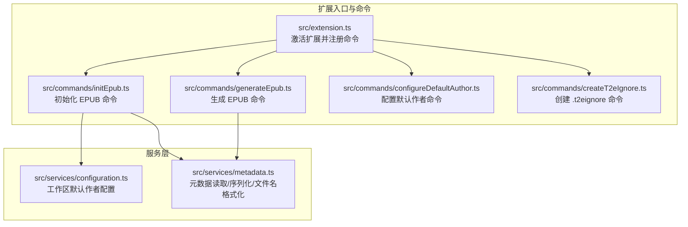
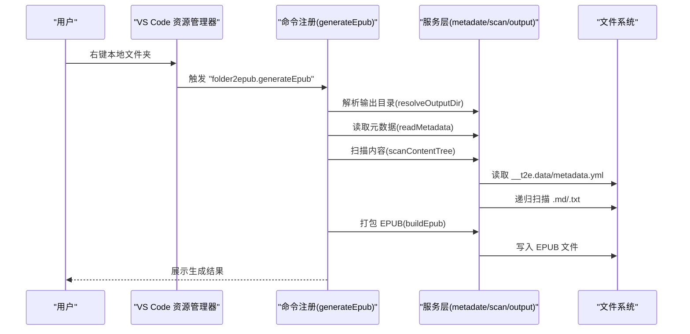

# 快速开始

<cite>
**本文档引用的文件**
- [README.md](file://README.md)
- [package.json](file://package.json)
- [src/extension.ts](file://src/extension.ts)
- [src/commands/generateEpub.ts](file://src/commands/generateEpub.ts)
- [src/commands/initEpub.ts](file://src/commands/initEpub.ts)
- [src/commands/configureDefaultAuthor.ts](file://src/commands/configureDefaultAuthor.ts)
- [src/commands/createT2eIgnore.ts](file://src/commands/createT2eIgnore.ts)
- [src/services/configuration.ts](file://src/services/configuration.ts)
- [src/services/metadata.ts](file://src/services/metadata.ts)
- [example/__epub.yml](file://example/__epub.yml)
- [example/init-folder/.t2eignore](file://example/init-folder/.t2eignore)
- [example/init-folder/__t2e.data/metadata.yml](file://example/init-folder/__t2e.data/metadata.yml)
- [example/init-folder/00100__章节 1.txt](file://example/init-folder/00100__章节 1.txt)
- [example/init-folder/00110__章节 2.md](file://example/init-folder/00110__章节 2.md)
- [l10n/bundle.l10n.json](file://l10n/bundle.l10n.json)
</cite>

## 目录
1. [简介](#简介)
2. [项目结构](#项目结构)
3. [核心组件](#核心组件)
4. [架构总览](#架构总览)
5. [详细组件分析](#详细组件分析)
6. [依赖分析](#依赖分析)
7. [性能考虑](#性能考虑)
8. [故障排除指南](#故障排除指南)
9. [结论](#结论)
10. [附录](#附录)

## 简介
本指南面向初次使用 VS Code Folder2EPUB 扩展的用户，帮助你在最短时间内完成安装、配置与首次生成 EPUB 的全流程。你将学会：
- 如何从 VS Code Marketplace 安装扩展
- 如何进行本地开发安装与调试
- 如何通过右键菜单生成 EPUB
- 如何初始化项目结构与配置默认作者
- 如何使用示例项目验证工作流
- 常见使用场景与最佳实践
- 常见问题的排查思路

## 项目结构
该扩展采用 VS Code 扩展标准结构：入口文件注册命令，命令调用服务层完成具体任务。示例目录展示了推荐的目录组织方式与文件命名约定。

图表来源
- [src/extension.ts:13-18](file://src/extension.ts#L13-L18)
- [src/commands/generateEpub.ts:18-66](file://src/commands/generateEpub.ts#L18-L66)
- [src/commands/initEpub.ts:18-63](file://src/commands/initEpub.ts#L18-L63)
- [src/commands/configureDefaultAuthor.ts:12-26](file://src/commands/configureDefaultAuthor.ts#L12-L26)
- [src/commands/createT2eIgnore.ts:15-34](file://src/commands/createT2eIgnore.ts#L15-L34)
- [src/services/configuration.ts:18-40](file://src/services/configuration.ts#L18-L40)
- [src/services/metadata.ts:41-69](file://src/services/metadata.ts#L41-L69)

章节来源
- [package.json:43-96](file://package.json#L43-L96)
- [src/extension.ts:13-18](file://src/extension.ts#L13-L18)

## 核心组件
- 右键菜单与命令
  - 菜单项：在资源管理器中右键本地文件夹时出现“生成 epub”“初始化 epub”“新增 .t2eignore”，均在 package.json 中声明并绑定到对应命令 ID。
- 命令实现
  - 生成 EPUB：读取元数据、扫描内容、解析输出目录、打包 EPUB。
  - 初始化 EPUB：创建元数据目录与文件，支持工作区默认作者配置。
  - 配置默认作者：交互式设置当前工作区默认作者。
  - 新增 .t2eignore：在目标目录创建空的忽略文件。
- 服务层
  - 元数据服务：读取/校验/序列化 metadata.yml，格式化输出文件名。
  - 配置服务：读取/设置工作区默认作者，交互式输入。

章节来源
- [package.json:43-96](file://package.json#L43-L96)
- [src/commands/generateEpub.ts:18-66](file://src/commands/generateEpub.ts#L18-L66)
- [src/commands/initEpub.ts:18-63](file://src/commands/initEpub.ts#L18-L63)
- [src/commands/configureDefaultAuthor.ts:12-26](file://src/commands/configureDefaultAuthor.ts#L12-L26)
- [src/commands/createT2eIgnore.ts:15-34](file://src/commands/createT2eIgnore.ts#L15-L34)
- [src/services/metadata.ts:41-69](file://src/services/metadata.ts#L41-L69)
- [src/services/configuration.ts:18-40](file://src/services/configuration.ts#L18-L40)

## 架构总览
下图展示了从右键菜单到 EPUB 生成的关键调用链路与职责分工。

图表来源
- [src/commands/generateEpub.ts:19-59](file://src/commands/generateEpub.ts#L19-L59)
- [src/services/metadata.ts:41-59](file://src/services/metadata.ts#L41-L59)

## 详细组件分析

### 安装与环境要求
- 从 VS Code Marketplace 安装
  - 在 VS Code 扩展市场搜索“Folder2EPUB”，安装后重启即可使用。
- 本地开发安装与调试
  - 安装依赖：执行安装脚本。
  - 编译：执行编译脚本。
  - 调试：在 VS Code 中按 F5 启动扩展开发宿主，打开资源管理器右键测试菜单。
- 版本要求
  - 扩展声明最低 VS Code 版本，请确保你的 VS Code 版本满足要求。

章节来源
- [README.md:124-135](file://README.md#L124-L135)
- [package.json:31-33](file://package.json#L31-L33)

### 基本使用方法

#### 通过右键菜单生成 EPUB
- 步骤
  1) 在资源管理器中右键任意本地文件夹。
  2) 选择“生成 epub”。
  3) 若目录缺少元数据文件，系统会提示先执行“初始化 epub”。
  4) 成功后会显示生成的 EPUB 文件路径。

图表来源
- [src/commands/generateEpub.ts:23-43](file://src/commands/generateEpub.ts#L23-L43)
- [src/services/metadata.ts:41-59](file://src/services/metadata.ts#L41-L59)

章节来源
- [package.json:77-94](file://package.json#L77-L94)
- [src/commands/generateEpub.ts:19-59](file://src/commands/generateEpub.ts#L19-L59)

#### 初始化项目结构
- 步骤
  1) 在资源管理器中右键本地文件夹，选择“初始化 epub”。
  2) 若当前工作区未配置默认作者，会弹窗询问是否立即配置。
  3) 成功后会在目标目录创建 __t2e.data/metadata.yml，并写入默认作者（若已配置）。

图表来源
- [src/commands/initEpub.ts:23-26](file://src/commands/initEpub.ts#L23-L26)
- [src/commands/initEpub.ts:33-50](file://src/commands/initEpub.ts#L33-L50)
- [src/services/configuration.ts:47-79](file://src/services/configuration.ts#L47-L79)

章节来源
- [src/commands/initEpub.ts:18-63](file://src/commands/initEpub.ts#L18-L63)
- [src/services/configuration.ts:18-40](file://src/services/configuration.ts#L18-L40)

#### 配置默认作者
- 方法
  - 通过命令面板执行“Folder2EPUB: 配置当前 Workspace 默认作者”，弹出输入框填写作者名。
  - 该作者将被写入工作区配置，初始化 EPUB 时会自动填入 metadata.yml 的 author 字段。

章节来源
- [src/commands/configureDefaultAuthor.ts:12-26](file://src/commands/configureDefaultAuthor.ts#L12-L26)
- [src/services/configuration.ts:47-79](file://src/services/configuration.ts#L47-L79)

#### 新增 .t2eignore 忽略文件
- 作用
  - 在目标目录创建空的 .t2eignore 文件，用于按 .gitignore 语法过滤不需要打包的文件与目录。
- 注意
  - 若文件已存在，会提示并阻止覆盖。

章节来源
- [src/commands/createT2eIgnore.ts:15-34](file://src/commands/createT2eIgnore.ts#L15-L34)

### 示例项目演示
- 推荐目录结构
  - 书籍根目录下放置 __t2e.data/metadata.yml 与封面文件。
  - 根目录与子目录均可放置 .md 与 .txt。
  - 子目录可包含 index 文件作为入口，该文件不会作为独立目录项展示。
- 示例文件
  - 示例元数据文件：包含标题、副标题、作者、描述、封面、版本等字段。
  - 示例内容文件：数字前缀命名的章节文本与 Markdown。
  - 示例忽略文件：按 .gitignore 语法列出需要忽略的文件或目录。
  - 示例输出配置：通过父级 __epub.yml 指定保存目录（支持 ~ 展开到用户目录）。

章节来源
- [README.md:81-122](file://README.md#L81-L122)
- [example/__epub.yml:1-2](file://example/__epub.yml#L1-L2)
- [example/init-folder/.t2eignore:1-2](file://example/init-folder/.t2eignore#L1-L2)
- [example/init-folder/__t2e.data/metadata.yml:1-7](file://example/init-folder/__t2e.data/metadata.yml#L1-L7)
- [example/init-folder/00100__章节 1.txt:1-9](file://example/init-folder/00100__章节 1.txt#L1-L9)
- [example/init-folder/00110__章节 2.md:1-9](file://example/init-folder/00110__章节 2.md#L1-L9)

### 常见使用场景与最佳实践
- 场景一：快速生成 EPUB
  - 步骤：初始化 -> 准备内容 -> 生成。
  - 建议：使用数字前缀命名章节，便于排序；子目录可使用 index 作为入口。
- 场景二：批量处理多个书籍
  - 建议：在每个书籍根目录维护独立的 __t2e.data/metadata.yml；通过父级 __epub.yml 统一指定输出目录。
- 场景三：控制打包范围
  - 建议：在需要忽略的目录创建 .t2eignore，按需过滤临时文件、缓存文件等。
- 最佳实践
  - 使用工作区默认作者，减少重复配置。
  - 元数据字段尽量完整，有助于生成更规范的 EPUB。
  - 封面文件与 metadata.yml 中的 cover 字段保持一致。

章节来源
- [README.md:48-122](file://README.md#L48-L122)
- [example/__epub.yml:1-2](file://example/__epub.yml#L1-L2)
- [example/init-folder/.t2eignore:1-2](file://example/init-folder/.t2eignore#L1-L2)

## 依赖分析
- 扩展声明的运行时依赖
  - ignore：用于解析 .t2eignore/.gitignore 语法。
  - jszip：用于打包 EPUB。
  - markdown-it：用于解析 Markdown。
  - yaml：用于读写 YAML 元数据文件。
- 开发依赖
  - TypeScript、ESLint、esbuild 等，用于类型检查、代码质量与构建。

章节来源
- [package.json:97-112](file://package.json#L97-L112)

## 性能考虑
- 目录扫描与打包
  - 扫描阶段会遍历所有 .md/.txt 文件并按数字前缀排序，建议合理组织目录层级，避免过深或过多文件导致扫描耗时增加。
- 输出目录解析
  - 支持使用 ~ 展开到用户目录，注意磁盘 IO 性能与权限。
- 多语言与国际化
  - 扩展内置多语言支持，切换 VS Code 语言时自动生效，无需额外配置。

章节来源
- [README.md:18-18](file://README.md#L18-L18)
- [l10n/bundle.l10n.json:1-50](file://l10n/bundle.l10n.json#L1-L50)

## 故障排除指南
- 无法生成 EPUB
  - 检查是否存在 __t2e.data/metadata.yml；若不存在，请先执行“初始化 epub”。
  - 确认目录中存在 .md 或 .txt 文件；否则会提示无可用内容。
- 无法创建 .t2eignore
  - 若文件已存在，系统会提示并阻止覆盖。
- 无法配置默认作者
  - 需要在已打开的工作区中进行配置；若无工作区，请先打开一个工作区。
- 封面文件相关错误
  - 若 metadata.yml 中配置了 cover，必须确保 __t2e.data/ 下存在对应文件且为有效格式；否则会报错。
- 输出目录解析异常
  - 父级 __epub.yml 中的 saveTo 支持 ~ 展开；请确认路径有效且具有写入权限。

章节来源
- [src/commands/generateEpub.ts:23-43](file://src/commands/generateEpub.ts#L23-L43)
- [src/commands/createT2eIgnore.ts:21-24](file://src/commands/createT2eIgnore.ts#L21-L24)
- [src/services/configuration.ts:33-35](file://src/services/configuration.ts#L33-L35)
- [l10n/bundle.l10n.json:36-46](file://l10n/bundle.l10n.json#L36-L46)

## 结论
通过本快速开始指南，你已经掌握了从安装到生成 EPUB 的完整流程。建议结合示例项目进行练习，逐步熟悉目录结构、命名约定与忽略规则，从而高效产出符合预期的 EPUB 电子书。

## 附录

### 常用命令与触发方式
- 生成 EPUB：在资源管理器右键本地文件夹，选择“生成 epub”。
- 初始化 EPUB：在资源管理器右键本地文件夹，选择“初始化 epub”。
- 新增 .t2eignore：在资源管理器右键本地文件夹，选择“新增 .t2eignore”。
- 配置默认作者：通过命令面板执行“Folder2EPUB: 配置当前 Workspace 默认作者”。

章节来源
- [package.json:77-94](file://package.json#L77-L94)
- [src/commands/configureDefaultAuthor.ts:12-26](file://src/commands/configureDefaultAuthor.ts#L12-L26)