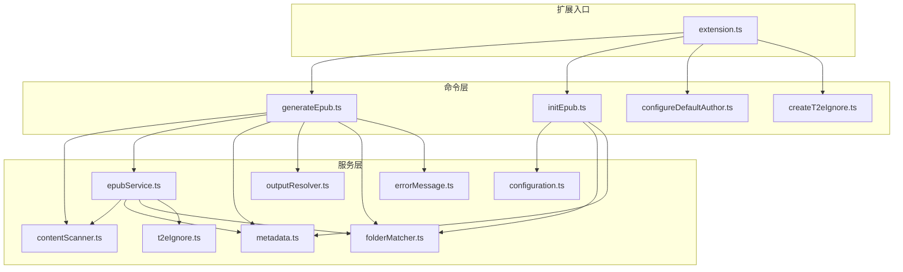
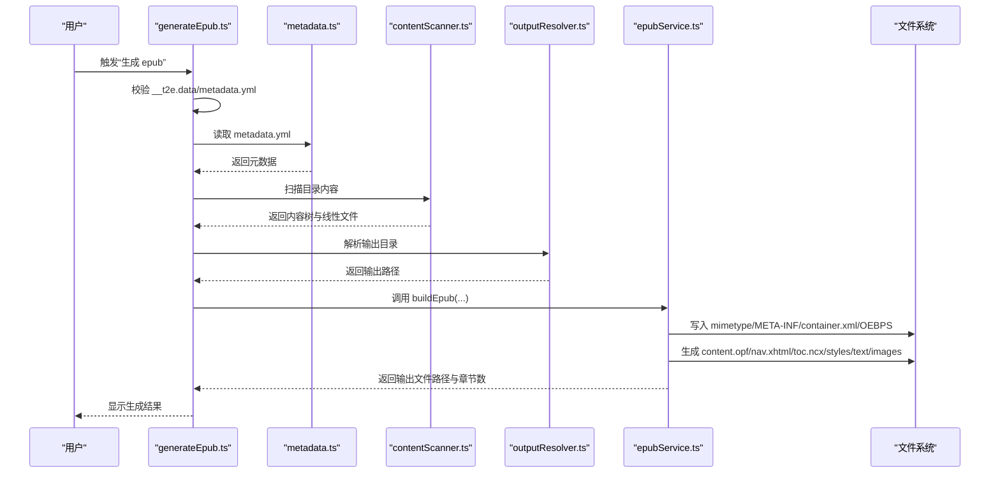
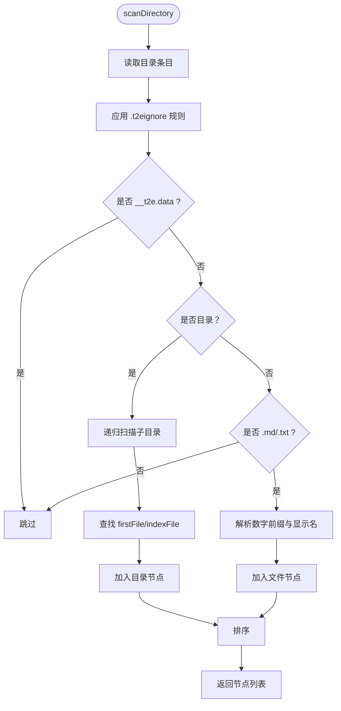
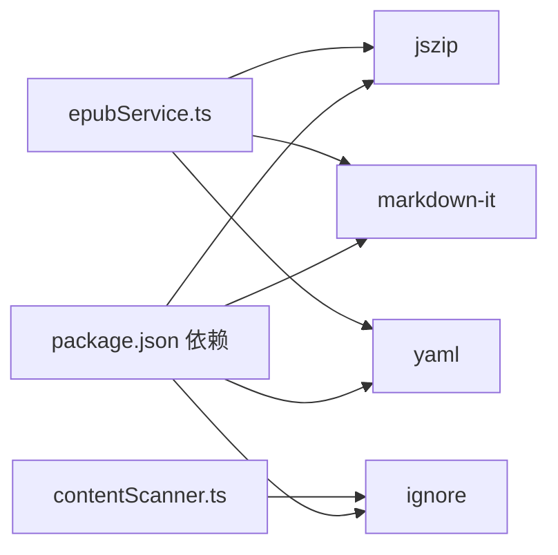

# EPUB 文件打包

<cite>
**本文引用的文件**
- [epubService.ts](file://src/services/epubService.ts)
- [generateEpub.ts](file://src/commands/generateEpub.ts)
- [contentScanner.ts](file://src/services/contentScanner.ts)
- [folderMatcher.ts](file://src/services/folderMatcher.ts)
- [outputResolver.ts](file://src/services/outputResolver.ts)
- [initEpub.ts](file://src/commands/initEpub.ts)
- [metadata.ts](file://src/services/metadata.ts)
- [configuration.ts](file://src/services/configuration.ts)
- [t2eIgnore.ts](file://src/services/t2eIgnore.ts)
- [errorMessage.ts](file://src/services/errorMessage.ts)
- [extension.ts](file://src/extension.ts)
- [package.json](file://package.json)
- [__epub.yml](file://example/__epub.yml)
- [README.md](file://README.md)
</cite>

## 目录
1. [简介](#简介)
2. [项目结构](#项目结构)
3. [核心组件](#核心组件)
4. [架构总览](#架构总览)
5. [详细组件分析](#详细组件分析)
6. [依赖关系分析](#依赖关系分析)
7. [性能考量](#性能考量)
8. [故障排查指南](#故障排查指南)
9. [结论](#结论)
10. [附录](#附录)

## 简介
本技术文档围绕 EPUB 3.0 文件打包系统进行深入解析，涵盖标准实现要点（mimetype 处理、META-INF/container.xml、OPF 包文件 content.opf、导航页 nav.xhtml、NCX 目录 toc.ncx）、文件结构组织（OEBPS 目录布局、命名规范、层级管理）、ZIP 压缩配置（算法选择、存储模式）、校验机制与错误处理策略，并提供结构图与打包流程图，帮助开发者与使用者全面掌握该系统的设计与实现。

## 项目结构
该仓库采用 VS Code 扩展的模块化组织方式，核心功能集中在 src 目录下，按职责划分为命令层（commands）、服务层（services）与扩展入口（extension）。命令层负责用户交互与流程编排，服务层负责具体业务逻辑（扫描、打包、元数据、忽略规则等），扩展入口注册所有命令。

图表来源
- [extension.ts:13-18](file://src/extension.ts#L13-L18)
- [generateEpub.ts:18-65](file://src/commands/generateEpub.ts#L18-L65)
- [initEpub.ts:18-62](file://src/commands/initEpub.ts#L18-L62)
- [epubService.ts:146-216](file://src/services/epubService.ts#L146-L216)
- [contentScanner.ts:51-58](file://src/services/contentScanner.ts#L51-L58)
- [folderMatcher.ts:23-38](file://src/services/folderMatcher.ts#L23-L38)
- [outputResolver.ts:15-42](file://src/services/outputResolver.ts#L15-L42)
- [metadata.ts:41-59](file://src/services/metadata.ts#L41-L59)
- [configuration.ts:18-40](file://src/services/configuration.ts#L18-L40)
- [t2eIgnore.ts:13-26](file://src/services/t2eIgnore.ts#L13-L26)
- [errorMessage.ts:9-15](file://src/services/errorMessage.ts#L9-L15)

章节来源
- [extension.ts:13-18](file://src/extension.ts#L13-L18)
- [package.json:44-96](file://package.json#L44-L96)

## 核心组件
- 打包服务（epubService）：负责将扫描结果、元数据与资源打包为 EPUB 3 文件，生成 mimetype、META-INF/container.xml、OEBPS 下的 content.opf、nav.xhtml、toc.ncx、样式与正文资源。
- 内容扫描（contentScanner）：递归扫描目录，按数字前缀与名称进行自然排序，识别 index 文件作为目录入口，过滤 __t2e.data 与 .t2eignore 规则。
- 元数据（metadata）：读取/写入 __t2e.data/metadata.yml，格式化输出文件名，提供展示标题与作者。
- 输出解析（outputResolver）：自上而下查找 __epub.yml 的 saveTo 配置，支持 ~ 展开到用户目录。
- 目录匹配（folderMatcher）：统一目录目标解析、metadata.yml 路径计算、存在性判断。
- 忽略规则（t2eIgnore）：读取 .t2eignore，按 .gitignore 语法过滤。
- 错误消息（errorMessage）：统一错误消息转换。
- 命令（generateEpub/initEpub）：编排流程、进度提示、错误处理与结果反馈。

章节来源
- [epubService.ts:146-216](file://src/services/epubService.ts#L146-L216)
- [contentScanner.ts:51-58](file://src/services/contentScanner.ts#L51-L58)
- [metadata.ts:41-59](file://src/services/metadata.ts#L41-L59)
- [outputResolver.ts:15-42](file://src/services/outputResolver.ts#L15-L42)
- [folderMatcher.ts:23-38](file://src/services/folderMatcher.ts#L23-L38)
- [t2eIgnore.ts:13-26](file://src/services/t2eIgnore.ts#L13-L26)
- [errorMessage.ts:9-15](file://src/services/errorMessage.ts#L9-L15)
- [generateEpub.ts:18-65](file://src/commands/generateEpub.ts#L18-L65)
- [initEpub.ts:18-62](file://src/commands/initEpub.ts#L18-L62)

## 架构总览
EPUB 打包流程由“初始化元数据 -> 扫描内容 -> 解析输出目录 -> 打包 EPUB”四步组成。打包阶段使用 JSZip 生成 ZIP 流，mimetype 采用 STORE 存储模式，其余文件采用 DEFLATE 压缩。

图表来源
- [generateEpub.ts:28-57](file://src/commands/generateEpub.ts#L28-L57)
- [metadata.ts:41-59](file://src/services/metadata.ts#L41-L59)
- [contentScanner.ts:51-58](file://src/services/contentScanner.ts#L51-L58)
- [outputResolver.ts:15-42](file://src/services/outputResolver.ts#L15-L42)
- [epubService.ts:168-216](file://src/services/epubService.ts#L168-L216)

## 详细组件分析

### 打包服务（epubService）
- EPUB 3 标准实现要点
  - mimetype：固定为 application/epub+zip，使用 STORE 不压缩。
  - META-INF/container.xml：声明根文件为 OEBPS/content.opf。
  - OEBPS 目录：content.opf、nav.xhtml、toc.ncx、styles/main.css、text/*、images/*。
- 核心文件生成
  - content.opf：声明 manifest（含 nav、ncx、main.css、标题页、章节、正文图片、封面）、spine（标题页在首位）、metadata（identifier、title、creator、language、description、modified）。
  - nav.xhtml：基于导航树生成，使用 epub:type="toc"。
  - toc.ncx：兼容旧阅读器，递归生成 navPoint，playOrder 自增。
  - 标题页：text/title-page.xhtml，包含封面与作者信息。
- 资源处理
  - 封面：从 __t2e.data/cover 加载，媒体类型映射至 image/*。
  - 正文图片：扫描 Markdown/HTML 中的图片引用，重写为包内相对路径，统一收集到 images/。
- ZIP 压缩配置
  - mimetype 使用 STORE（无压缩）。
  - 其余文件使用 DEFLATE 压缩。
  - 输出为 nodebuffer。
- 错误处理
  - 无可用 md/txt 文件时报错。
  - 缺失章节映射或导航映射时报错。
  - 封面路径不存在或非文件、不支持格式时报错。

图表来源
- [epubService.ts:146-216](file://src/services/epubService.ts#L146-L216)
- [epubService.ts:340-390](file://src/services/epubService.ts#L340-L390)
- [epubService.ts:412-430](file://src/services/epubService.ts#L412-L430)
- [epubService.ts:440-463](file://src/services/epubService.ts#L440-L463)
- [epubService.ts:598-633](file://src/services/epubService.ts#L598-L633)
- [epubService.ts:641-657](file://src/services/epubService.ts#L641-L657)

章节来源
- [epubService.ts:17-23](file://src/services/epubService.ts#L17-L23)
- [epubService.ts:168-216](file://src/services/epubService.ts#L168-L216)
- [epubService.ts:340-390](file://src/services/epubService.ts#L340-L390)
- [epubService.ts:412-430](file://src/services/epubService.ts#L412-L430)
- [epubService.ts:440-463](file://src/services/epubService.ts#L440-L463)
- [epubService.ts:598-633](file://src/services/epubService.ts#L598-L633)
- [epubService.ts:641-657](file://src/services/epubService.ts#L641-L657)

### 内容扫描（contentScanner）
- 扫描范围：仅 .md/.txt，忽略 __t2e.data 与 .t2eignore。
- 排序规则：数字前缀优先，名称次之；中文友好 localeCompare；目录优先于文件。
- index 文件：子目录优先使用 index 文件作为入口，index 文件不作为独立目录项展示。
- 线性化：将树状节点拍平为线性文件列表，用于章节编号与顺序。

图表来源
- [contentScanner.ts:258-329](file://src/services/contentScanner.ts#L258-L329)
- [contentScanner.ts:67-105](file://src/services/contentScanner.ts#L67-L105)
- [contentScanner.ts:191-238](file://src/services/contentScanner.ts#L191-L238)
- [contentScanner.ts:107-161](file://src/services/contentScanner.ts#L107-L161)

章节来源
- [contentScanner.ts:51-58](file://src/services/contentScanner.ts#L51-L58)
- [contentScanner.ts:258-329](file://src/services/contentScanner.ts#L258-L329)
- [contentScanner.ts:67-105](file://src/services/contentScanner.ts#L67-L105)
- [contentScanner.ts:191-238](file://src/services/contentScanner.ts#L191-L238)
- [contentScanner.ts:107-161](file://src/services/contentScanner.ts#L107-L161)

### 元数据（metadata）
- 读取与校验：解析 __t2e.data/metadata.yml，字段类型收敛为字符串，默认值处理。
- 展示与文件名：组合主标题与副标题，生成展示标题；规范化作者；生成文件名并清洗非法字符。
- 序列化：YAML.stringify 用于写入模板。

章节来源
- [metadata.ts:41-59](file://src/services/metadata.ts#L41-L59)
- [metadata.ts:77-102](file://src/services/metadata.ts#L77-L102)
- [metadata.ts:110-117](file://src/services/metadata.ts#L110-L117)
- [metadata.ts:125-145](file://src/services/metadata.ts#L125-L145)

### 输出解析（outputResolver）
- 自上而下查找 __epub.yml 的 saveTo 配置，支持 ~ 与 ~/... 展开到用户目录。
- 无配置时回退到书籍根目录。

章节来源
- [outputResolver.ts:15-42](file://src/services/outputResolver.ts#L15-L42)
- [outputResolver.ts:50-71](file://src/services/outputResolver.ts#L50-L71)
- [outputResolver.ts:79-89](file://src/services/outputResolver.ts#L79-L89)
- [__epub.yml:1-2](file://example/__epub.yml#L1-L2)

### 目录匹配（folderMatcher）
- 统一目录目标解析，校验本地目录有效性。
- 计算 __t2e.data 与 metadata.yml 的绝对路径。
- 存在性检查与元数据文件存在性判断。

章节来源
- [folderMatcher.ts:23-38](file://src/services/folderMatcher.ts#L23-L38)
- [folderMatcher.ts:46-58](file://src/services/folderMatcher.ts#L46-L58)
- [folderMatcher.ts:66-84](file://src/services/folderMatcher.ts#L66-L84)

### 忽略规则（t2eIgnore）
- 读取 .t2eignore，过滤空行与注释行。
- 基于 ignore 库实现 .gitignore 语法。

章节来源
- [t2eIgnore.ts:13-26](file://src/services/t2eIgnore.ts#L13-L26)
- [t2eIgnore.ts:36-44](file://src/services/t2eIgnore.ts#L36-L44)

### 错误消息（errorMessage）
- 统一错误消息转换，保证 UI 可读性。

章节来源
- [errorMessage.ts:9-15](file://src/services/errorMessage.ts#L9-L15)

### 命令（generateEpub/initEpub）
- generateEpub：进度提示、读取元数据、扫描内容、解析输出目录、调用打包、结果反馈。
- initEpub：创建 __t2e.data/metadata.yml，支持默认作者配置。

章节来源
- [generateEpub.ts:18-65](file://src/commands/generateEpub.ts#L18-L65)
- [initEpub.ts:18-62](file://src/commands/initEpub.ts#L18-L62)

## 依赖关系分析
- JSZip：用于生成 EPUB ZIP 流，mimetype 使用 STORE，其他文件使用 DEFLATE。
- markdown-it：渲染 Markdown 为 HTML，支持 HTML inline/block。
- yaml：解析与序列化元数据。
- ignore：解析 .t2eignore 规则。

图表来源
- [package.json:97-101](file://package.json#L97-L101)
- [epubService.ts:8-11](file://src/services/epubService.ts#L8-L11)
- [contentScanner.ts:5-6](file://src/services/contentScanner.ts#L5-L6)

章节来源
- [package.json:97-101](file://package.json#L97-L101)
- [epubService.ts:8-11](file://src/services/epubService.ts#L8-L11)
- [contentScanner.ts:5-6](file://src/services/contentScanner.ts#L5-L6)

## 性能考量
- 扫描阶段：递归读取目录，忽略 __t2e.data 与 .t2eignore，减少 IO 与解析开销。
- 渲染阶段：markdown-it token 遍历，深度优先处理图片与 HTML 内联图片，避免重复解析。
- ZIP 生成：mimetype 使用 STORE，其余文件 DEFLATE，兼顾体积与速度。
- 文件命名：章节按 4 位前缀编号，便于排序与检索。
- 输出解析：自上而下查找 __epub.yml，避免深层遍历。

[本节为通用性能讨论，不直接分析具体文件]

## 故障排查指南
- 无可用 md/txt 文件：检查目录是否包含 .md/.txt，确认 .t2eignore 未过度过滤。
- 缺失 __t2e.data/metadata.yml：先执行“初始化 epub”，或在目标目录创建 metadata.yml。
- 封面路径问题：确认 __t2e.data/cover 与 metadata.yml 中 cover 字段一致，文件存在且为受支持格式。
- 导航映射缺失：检查内容树中是否存在未映射的文件或目录。
- 输出目录异常：检查 __epub.yml 的 saveTo 配置，确认 ~ 展开正确。

章节来源
- [generateEpub.ts:23-26](file://src/commands/generateEpub.ts#L23-L26)
- [epubService.ts:156-158](file://src/services/epubService.ts#L156-L158)
- [epubService.ts:604-633](file://src/services/epubService.ts#L604-L633)
- [outputResolver.ts:15-42](file://src/services/outputResolver.ts#L15-L42)

## 结论
该 EPUB 打包系统遵循 EPUB 3.0 标准，通过清晰的模块划分与严格的流程控制，实现了从目录内容到 EPUB 文件的自动化生成。系统在文件结构、命名规范、压缩配置、校验与错误处理方面均体现了工程化实践，适合在 VS Code 环境中高效地批量生成电子书。

[本节为总结性内容，不直接分析具体文件]

## 附录

### EPUB 目录结构与命名规范
- mimetype：application/epub+zip，STORE。
- META-INF/container.xml：声明根文件为 OEBPS/content.opf。
- OEBPS：
  - content.opf：包清单与阅读顺序。
  - nav.xhtml：导航页。
  - toc.ncx：兼容旧阅读器的目录。
  - styles/main.css：样式表。
  - text/：章节 XHTML，标题页在首位。
  - images/：正文图片与封面。

章节来源
- [epubService.ts:17-23](file://src/services/epubService.ts#L17-L23)
- [epubService.ts:168-216](file://src/services/epubService.ts#L168-L216)
- [epubService.ts:340-390](file://src/services/epubService.ts#L340-L390)
- [epubService.ts:412-430](file://src/services/epubService.ts#L412-L430)
- [epubService.ts:440-463](file://src/services/epubService.ts#L440-L463)

### ZIP 压缩配置
- mimetype：STORE（无压缩）。
- 其他文件：DEFLATE（有压缩）。
- 输出类型：nodebuffer。

章节来源
- [epubService.ts:169](file://src/services/epubService.ts#L169)
- [epubService.ts:204-208](file://src/services/epubService.ts#L204-L208)

### 校验机制与验证流程
- 元数据校验：读取并解析 metadata.yml，字段类型收敛与默认值处理。
- 目录校验：目录目标解析与存在性检查。
- 内容校验：扫描阶段过滤 __t2e.data 与 .t2eignore，确保只处理 .md/.txt。
- 资源校验：封面存在性、媒体类型支持、图片引用重写。
- 错误处理：统一转换为用户可读消息。

章节来源
- [metadata.ts:41-59](file://src/services/metadata.ts#L41-L59)
- [folderMatcher.ts:23-38](file://src/services/folderMatcher.ts#L23-L38)
- [contentScanner.ts:258-329](file://src/services/contentScanner.ts#L258-L329)
- [epubService.ts:604-633](file://src/services/epubService.ts#L604-L633)
- [errorMessage.ts:9-15](file://src/services/errorMessage.ts#L9-L15)