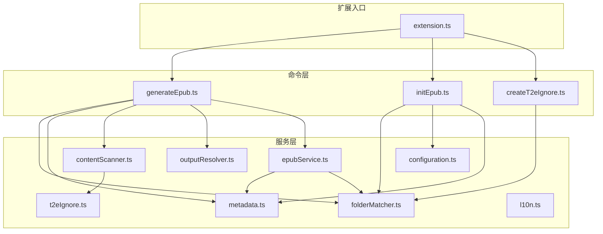
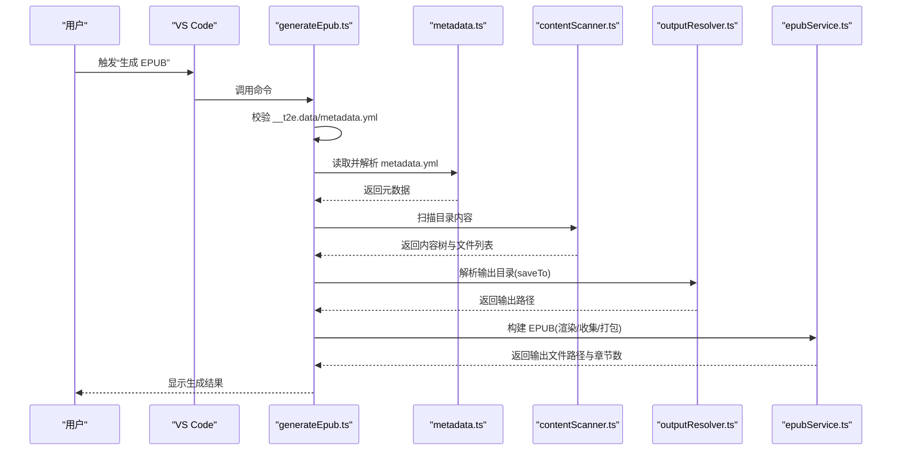
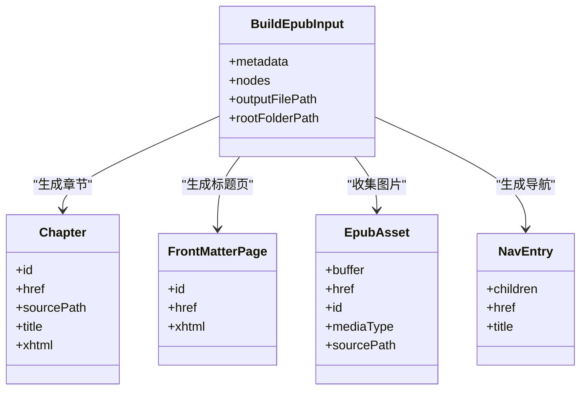
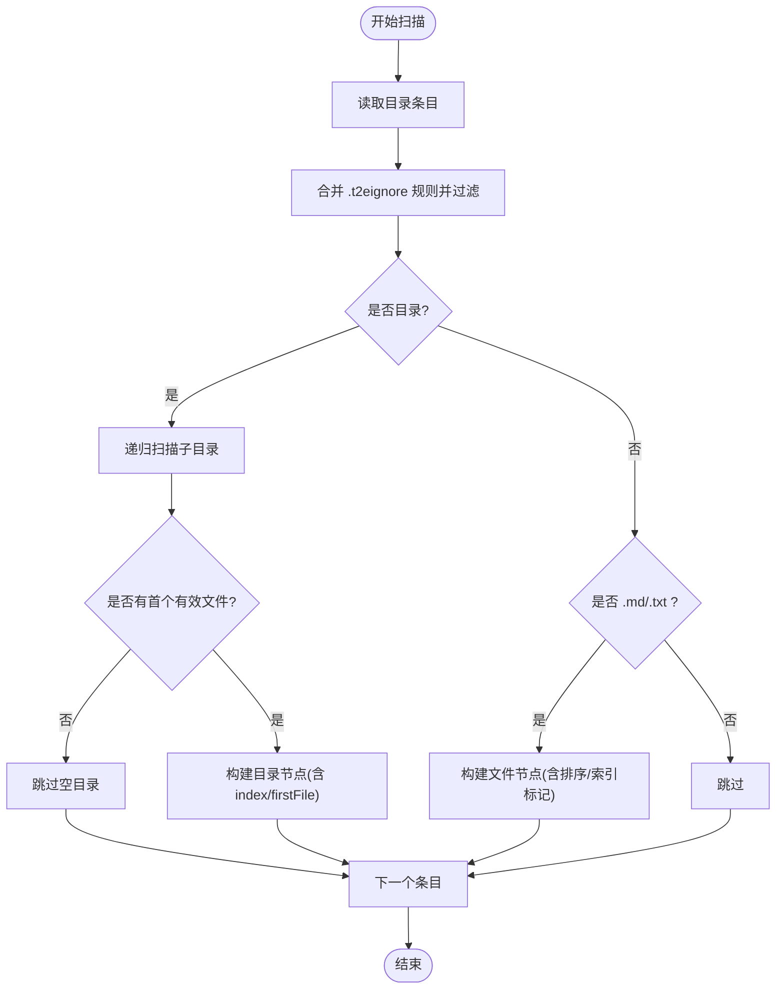
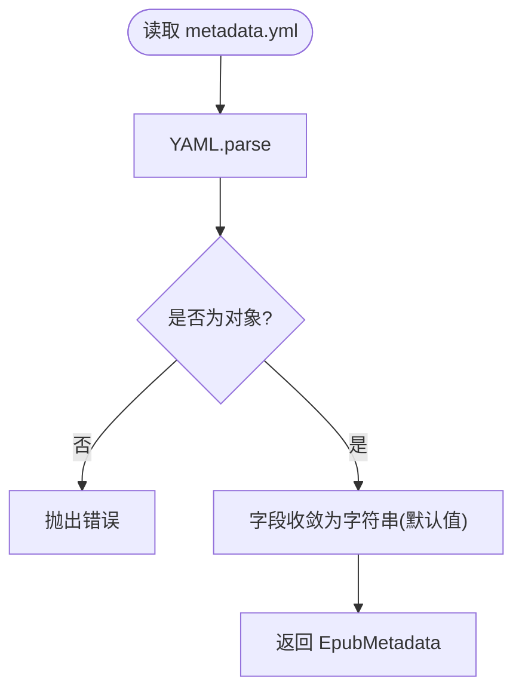
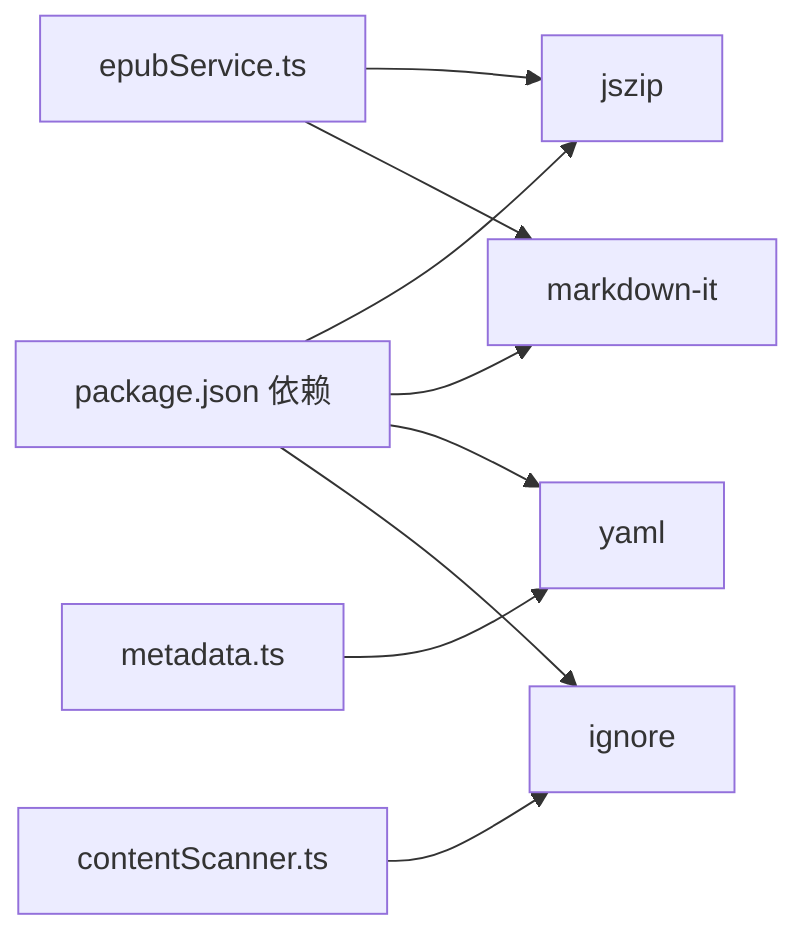

# EPUB 构建系统

<cite>
**本文引用的文件**
- [package.json](file://package.json)
- [README.md](file://README.md)
- [src/extension.ts](file://src/extension.ts)
- [src/commands/generateEpub.ts](file://src/commands/generateEpub.ts)
- [src/commands/initEpub.ts](file://src/commands/initEpub.ts)
- [src/commands/createT2eIgnore.ts](file://src/commands/createT2eIgnore.ts)
- [src/services/epubService.ts](file://src/services/epubService.ts)
- [src/services/metadata.ts](file://src/services/metadata.ts)
- [src/services/contentScanner.ts](file://src/services/contentScanner.ts)
- [src/services/folderMatcher.ts](file://src/services/folderMatcher.ts)
- [src/services/t2eIgnore.ts](file://src/services/t2eIgnore.ts)
- [src/services/outputResolver.ts](file://src/services/outputResolver.ts)
- [src/services/configuration.ts](file://src/services/configuration.ts)
- [src/services/l10n.ts](file://src/services/l10n.ts)
- [example/__epub.yml](file://example/__epub.yml)
</cite>

## 目录
1. [简介](#简介)
2. [项目结构](#项目结构)
3. [核心组件](#核心组件)
4. [架构总览](#架构总览)
5. [详细组件分析](#详细组件分析)
6. [依赖关系分析](#依赖关系分析)
7. [性能考量](#性能考量)
8. [故障排查指南](#故障排查指南)
9. [结论](#结论)
10. [附录](#附录)

## 简介
本项目是一个 VS Code 扩展，用于将符合约定的本地文件夹一键转换为 EPUB 3 电子书。其核心能力包括：
- 基于目录内容递归扫描，按数字前缀与中文友好排序生成章节
- 将 Markdown/TXT 内容渲染为 XHTML，并自动收集正文内图片资源
- 生成 EPUB 3 所需的包清单（OPF）、导航（nav.xhtml）、旧版目录（toc.ncx）及样式表
- 通过 JSZip 打包为标准 EPUB，包含 mimetype、META-INF/container.xml 等必要文件
- 元数据管理：读取并格式化 __t2e.data/metadata.yml，支持作者、标题、描述、封面、版本等字段
- 输出目录解析：支持通过父级 __epub.yml 的 saveTo 配置输出到指定路径（支持 ~ 展开）

## 项目结构
项目采用模块化组织，主要分为命令层（commands）、服务层（services）与扩展入口（extension.ts）。命令层负责 VS Code 菜单与交互，服务层封装业务逻辑（扫描、元数据、打包、输出解析等），扩展入口注册所有命令。

图表来源
- [src/extension.ts:13-18](file://src/extension.ts#L13-L18)
- [src/commands/generateEpub.ts:18-65](file://src/commands/generateEpub.ts#L18-L65)
- [src/commands/initEpub.ts:18-62](file://src/commands/initEpub.ts#L18-L62)
- [src/commands/createT2eIgnore.ts:15-33](file://src/commands/createT2eIgnore.ts#L15-L33)
- [src/services/contentScanner.ts:51-58](file://src/services/contentScanner.ts#L51-L58)
- [src/services/metadata.ts:41-69](file://src/services/metadata.ts#L41-L69)
- [src/services/epubService.ts:146-216](file://src/services/epubService.ts#L146-L216)
- [src/services/folderMatcher.ts:23-38](file://src/services/folderMatcher.ts#L23-L38)
- [src/services/t2eIgnore.ts:13-26](file://src/services/t2eIgnore.ts#L13-L26)
- [src/services/outputResolver.ts:15-42](file://src/services/outputResolver.ts#L15-L42)
- [src/services/configuration.ts:18-40](file://src/services/configuration.ts#L18-L40)
- [src/services/l10n.ts:9](file://src/services/l10n.ts#L9)

章节来源
- [src/extension.ts:13-18](file://src/extension.ts#L13-L18)
- [src/commands/generateEpub.ts:18-65](file://src/commands/generateEpub.ts#L18-L65)
- [src/commands/initEpub.ts:18-62](file://src/commands/initEpub.ts#L18-L62)
- [src/commands/createT2eIgnore.ts:15-33](file://src/commands/createT2eIgnore.ts#L15-L33)

## 核心组件
- 扩展入口：注册所有命令，挂载到 VS Code 生命周期
- 命令层：
  - 生成 EPUB：串联元数据读取、内容扫描、输出目录解析、EPUB 打包
  - 初始化 EPUB：创建 __t2e.data/metadata.yml，支持默认作者配置
  - 新增 .t2eignore：在目录下创建空的忽略文件
- 服务层：
  - 内容扫描：递归扫描、过滤、排序、索引文件选择
  - 元数据管理：读取/格式化/序列化 metadata.yml
  - EPUB 打包：Markdown/TXT 渲染、图片资源收集、OPF/nav/ncx 生成、ZIP 打包
  - 路径与匹配：目录目标解析、__t2e.data 与 __epub.yml 路径定位
  - 忽略规则：基于 .t2eignore 的 gitignore 风格过滤
  - 输出解析：解析父级 __epub.yml 的 saveTo，支持 ~ 展开
  - 配置：VS Code 工作区默认作者配置
  - 国际化：统一使用 l10n.t 提供本地化消息

章节来源
- [src/extension.ts:13-18](file://src/extension.ts#L13-L18)
- [src/commands/generateEpub.ts:18-65](file://src/commands/generateEpub.ts#L18-L65)
- [src/commands/initEpub.ts:18-62](file://src/commands/initEpub.ts#L18-L62)
- [src/commands/createT2eIgnore.ts:15-33](file://src/commands/createT2eIgnore.ts#L15-L33)
- [src/services/contentScanner.ts:51-58](file://src/services/contentScanner.ts#L51-L58)
- [src/services/metadata.ts:41-69](file://src/services/metadata.ts#L41-L69)
- [src/services/epubService.ts:146-216](file://src/services/epubService.ts#L146-L216)
- [src/services/folderMatcher.ts:23-38](file://src/services/folderMatcher.ts#L23-L38)
- [src/services/t2eIgnore.ts:13-26](file://src/services/t2eIgnore.ts#L13-L26)
- [src/services/outputResolver.ts:15-42](file://src/services/outputResolver.ts#L15-L42)
- [src/services/configuration.ts:18-40](file://src/services/configuration.ts#L18-L40)
- [src/services/l10n.ts:9](file://src/services/l10n.ts#L9)

## 架构总览
EPUB 构建流程由“命令 -> 服务 -> 打包”三层组成。命令层负责用户交互与进度提示；服务层负责数据与业务逻辑；打包层负责生成标准文件并写入 ZIP。

图表来源
- [src/commands/generateEpub.ts:19-57](file://src/commands/generateEpub.ts#L19-L57)
- [src/services/metadata.ts:41-59](file://src/services/metadata.ts#L41-L59)
- [src/services/contentScanner.ts:51-58](file://src/services/contentScanner.ts#L51-L58)
- [src/services/outputResolver.ts:15-42](file://src/services/outputResolver.ts#L15-L42)
- [src/services/epubService.ts:146-216](file://src/services/epubService.ts#L146-L216)

## 详细组件分析

### EPUB 打包服务（epubService.ts）
职责与流程
- Markdown 渲染：使用 markdown-it，启用 HTML、换行、硬换行为 XHTML
- 章节生成：将扫描树拍平为线性文件列表，逐个渲染为 XHTML，同时收集正文图片
- 目录与索引：基于内容树生成 nav.xhtml 与 toc.ncx
- 标题页：生成首章标题页，展示封面、标题、作者
- OPF 包清单：声明 manifest（含 nav、ncx、main.css、章节、图片、封面）与 spine
- ZIP 打包：mimetype 使用 STORE 不压缩；container.xml、OEBPS 下各文件按 EPUB 3 规范放置
- 资源媒体类型：仅支持常见图片类型（JPEG/PNG/GIF/SVG/WEBP）

关键接口与数据结构
- 输入 BuildEpubInput：元数据、内容树、输出路径、根目录
- 章节 Chapter：id、href、sourcePath、title、xhtml
- 前言页 FrontMatterPage：id、href、xhtml
- 资源 EpubAsset：Buffer、href、id、mediaType、sourcePath
- 导航 NavEntry：children、href、title

图表来源
- [src/services/epubService.ts:93-137](file://src/services/epubService.ts#L93-L137)

章节来源
- [src/services/epubService.ts:146-216](file://src/services/epubService.ts#L146-L216)
- [src/services/epubService.ts:340-390](file://src/services/epubService.ts#L340-L390)
- [src/services/epubService.ts:412-430](file://src/services/epubService.ts#L412-L430)
- [src/services/epubService.ts:440-463](file://src/services/epubService.ts#L440-L463)
- [src/services/epubService.ts:597-633](file://src/services/epubService.ts#L597-L633)
- [src/services/epubService.ts:641-657](file://src/services/epubService.ts#L641-L657)
- [src/services/epubService.ts:713-731](file://src/services/epubService.ts#L713-L731)
- [src/services/epubService.ts:743-783](file://src/services/epubService.ts#L743-L783)
- [src/services/epubService.ts:795-800](file://src/services/epubService.ts#L795-L800)

### 内容扫描服务（contentScanner.ts）
职责与流程
- 递归扫描：读取目录条目，忽略 __t2e.data 与非 md/txt 文件
- 忽略规则：支持 .t2eignore（gitignore 风格），逐层合并
- 排序规则：数字前缀优先，其次中文友好排序；目录与文件同名时目录优先
- 索引文件：优先选择目录内的 index 文件作为目录入口，index 文件不单独作为目录项展示
- 输出：树状节点与线性文件列表，供后续章节编号与导航生成

图表来源
- [src/services/contentScanner.ts:258-329](file://src/services/contentScanner.ts#L258-L329)
- [src/services/t2eIgnore.ts:13-26](file://src/services/t2eIgnore.ts#L13-L26)

章节来源
- [src/services/contentScanner.ts:51-58](file://src/services/contentScanner.ts#L51-L58)
- [src/services/contentScanner.ts:67-105](file://src/services/contentScanner.ts#L67-L105)
- [src/services/contentScanner.ts:108-161](file://src/services/contentScanner.ts#L108-L161)
- [src/services/contentScanner.ts:184-238](file://src/services/contentScanner.ts#L184-L238)
- [src/services/contentScanner.ts:258-329](file://src/services/contentScanner.ts#L258-L329)

### 元数据管理（metadata.ts）
职责与流程
- 读取：解析 __t2e.data/metadata.yml，字段收敛为字符串，提供默认值
- 序列化：将元数据对象写回 YAML 文本
- 格式化：生成展示标题（主标题+副标题）、作者、文件名（清洗非法字符）
- 默认模板：初始化时生成默认 metadata.yml

图表来源
- [src/services/metadata.ts:41-59](file://src/services/metadata.ts#L41-L59)
- [src/services/metadata.ts:67-69](file://src/services/metadata.ts#L67-L69)
- [src/services/metadata.ts:24-33](file://src/services/metadata.ts#L24-L33)

章节来源
- [src/services/metadata.ts:8-15](file://src/services/metadata.ts#L8-L15)
- [src/services/metadata.ts:24-33](file://src/services/metadata.ts#L24-L33)
- [src/services/metadata.ts:41-59](file://src/services/metadata.ts#L41-L59)
- [src/services/metadata.ts:67-69](file://src/services/metadata.ts#L67-L69)
- [src/services/metadata.ts:77-102](file://src/services/metadata.ts#L77-L102)
- [src/services/metadata.ts:110-117](file://src/services/metadata.ts#L110-L117)
- [src/services/metadata.ts:125-145](file://src/services/metadata.ts#L125-L145)

### 输出目录解析（outputResolver.ts）
职责与流程
- 自顶向下查找 __epub.yml，解析 saveTo
- 支持 ~ 与 ~/... 展开为用户主目录
- 相对路径以配置文件所在目录为基准解析

章节来源
- [src/services/outputResolver.ts:15-42](file://src/services/outputResolver.ts#L15-L42)
- [src/services/outputResolver.ts:50-71](file://src/services/outputResolver.ts#L50-L71)
- [src/services/outputResolver.ts:79-89](file://src/services/outputResolver.ts#L79-L89)
- [example/__epub.yml:1-2](file://example/__epub.yml#L1-L2)

### 命令与交互
- 生成 EPUB：进度提示、错误处理、结果通知
- 初始化 EPUB：交互式配置默认作者、创建 metadata.yml
- 新增 .t2eignore：创建空文件，避免覆盖

章节来源
- [src/commands/generateEpub.ts:18-65](file://src/commands/generateEpub.ts#L18-L65)
- [src/commands/initEpub.ts:18-62](file://src/commands/initEpub.ts#L18-L62)
- [src/commands/createT2eIgnore.ts:15-33](file://src/commands/createT2eIgnore.ts#L15-L33)

## 依赖关系分析
外部依赖
- jszip：EPUB 打包（mimetype STORE、DEFLATE 压缩）
- markdown-it：Markdown 渲染（开启 HTML、换行、硬换行）
- yaml：metadata.yml 解析与序列化
- ignore：.t2eignore 规则解析（gitignore 风格）

图表来源
- [package.json:97-102](file://package.json#L97-L102)
- [src/services/epubService.ts:8-11](file://src/services/epubService.ts#L8-L11)
- [src/services/metadata.ts:3](file://src/services/metadata.ts#L3)
- [src/services/contentScanner.ts:6](file://src/services/contentScanner.ts#L6)

章节来源
- [package.json:97-102](file://package.json#L97-L102)

## 性能考量
- 扫描与渲染：I/O 与 token 遍历为主，复杂度与文件数量与大小线性相关
- 图片处理：按引用收集，避免重复读取；媒体类型映射为常量时间查询
- 打包：JSZip 生成 Buffer 后一次性写入磁盘，避免多次 I/O
- 建议：大体积书籍建议提前清理无关文件，减少扫描范围；合理使用 .t2eignore

## 故障排查指南
常见问题与处理
- 缺少 __t2e.data/metadata.yml：执行“初始化 EPUB”后再生成
- 目录无 md/txt：确认内容扫描规则与 .t2eignore 设置
- 封面缺失或格式不支持：检查 __t2e.data/cover 文件存在且为 JPEG/PNG/GIF/SVG/WEBP
- 输出目录异常：检查父级 __epub.yml 的 saveTo 配置与 ~ 展开
- 错误消息：统一通过本地化消息返回，便于定位

章节来源
- [src/commands/generateEpub.ts:23-26](file://src/commands/generateEpub.ts#L23-L26)
- [src/services/epubService.ts:604-633](file://src/services/epubService.ts#L604-L633)
- [src/services/outputResolver.ts:15-42](file://src/services/outputResolver.ts#L15-L42)
- [src/services/l10n.ts:9](file://src/services/l10n.ts#L9)

## 结论
本系统以清晰的模块划分与稳健的业务流程实现了从目录到 EPUB 3 的自动化构建。通过严格的文件结构约定、完善的元数据与资源管理、以及标准的 EPUB 打包流程，能够稳定地生成符合 EPUB 3 规范的电子书。建议在实际使用中配合 .t2eignore 与 __epub.yml 进行精细化控制，以获得更佳的构建体验与结果质量。

## 附录
- EPUB 3 文件结构要点
  - mimetype：application/epub+zip，STORE 不压缩
  - META-INF/container.xml：指向 OEBPS/content.opf
  - OEBPS：content.opf（包清单）、nav.xhtml（导航）、toc.ncx（旧版目录）、styles/main.css、text/*.xhtml、images/*
- 目录与导航
  - navEntries 基于内容树生成，index 文件作为目录入口
  - spine 以标题页为首，随后为章节
- 资源媒体类型
  - 仅支持 JPEG/PNG/GIF/SVG/WEBP；其他格式将被忽略或报错

章节来源
- [src/services/epubService.ts:17-23](file://src/services/epubService.ts#L17-L23)
- [src/services/epubService.ts:168-201](file://src/services/epubService.ts#L168-L201)
- [src/services/epubService.ts:340-390](file://src/services/epubService.ts#L340-L390)
- [src/services/epubService.ts:412-430](file://src/services/epubService.ts#L412-L430)
- [src/services/epubService.ts:440-463](file://src/services/epubService.ts#L440-L463)
- [src/services/epubService.ts:641-657](file://src/services/epubService.ts#L641-L657)