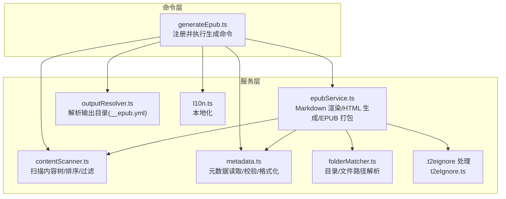
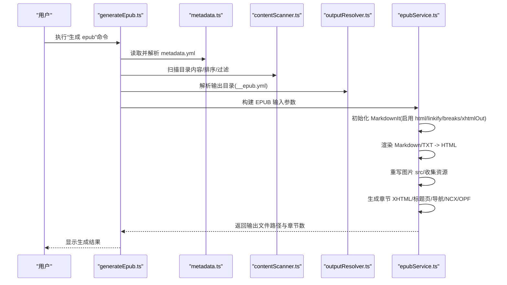
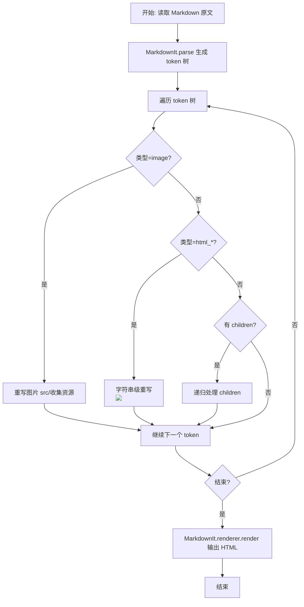
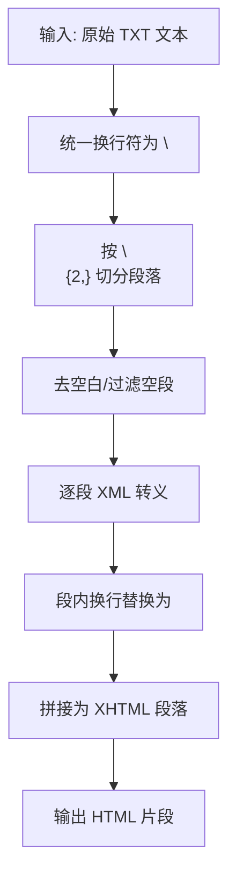
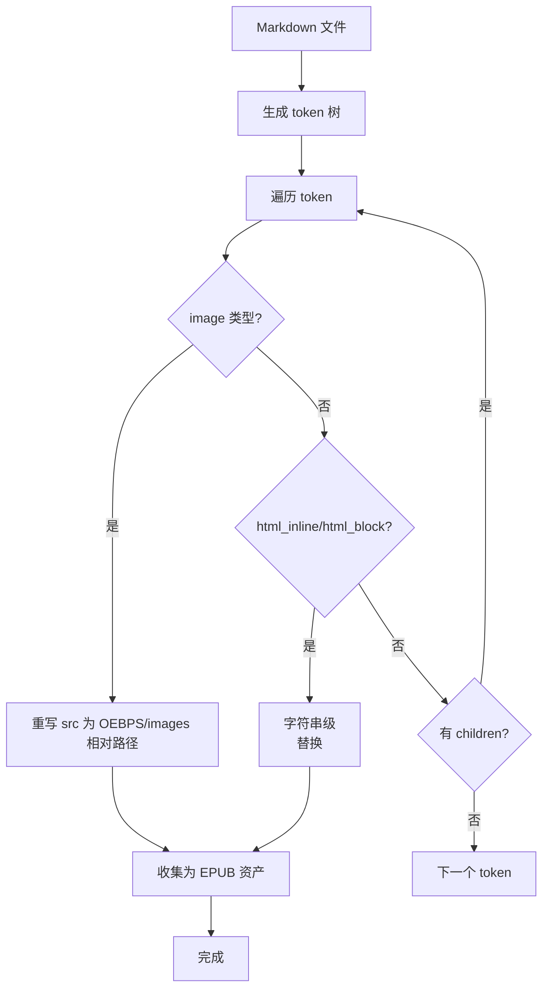
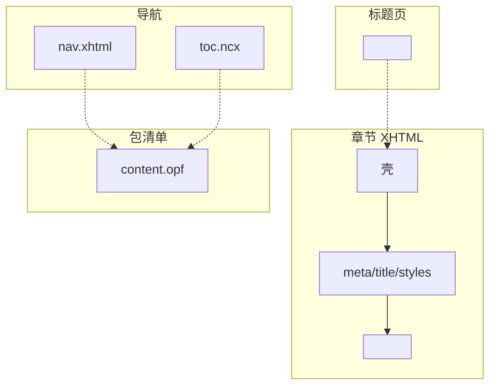
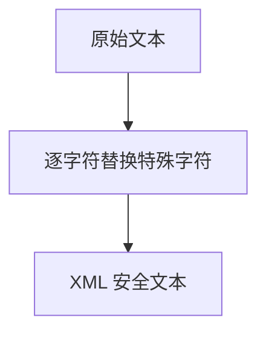
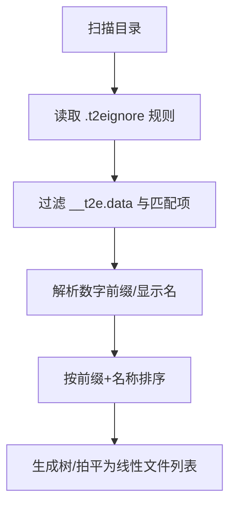
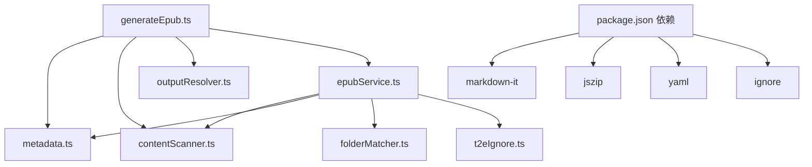

# HTML 渲染系统

<cite>
**本文引用的文件**
- [package.json](file://package.json)
- [README.md](file://README.md)
- [src/extension.ts](file://src/extension.ts)
- [src/commands/generateEpub.ts](file://src/commands/generateEpub.ts)
- [src/services/contentScanner.ts](file://src/services/contentScanner.ts)
- [src/services/epubService.ts](file://src/services/epubService.ts)
- [src/services/metadata.ts](file://src/services/metadata.ts)
- [src/services/folderMatcher.ts](file://src/services/folderMatcher.ts)
- [src/services/outputResolver.ts](file://src/services/outputResolver.ts)
- [src/services/t2eIgnore.ts](file://src/services/t2eIgnore.ts)
- [src/services/l10n.ts](file://src/services/l10n.ts)
</cite>

## 目录
1. [简介](#简介)
2. [项目结构](#项目结构)
3. [核心组件](#核心组件)
4. [架构总览](#架构总览)
5. [详细组件分析](#详细组件分析)
6. [依赖关系分析](#依赖关系分析)
7. [性能考量](#性能考量)
8. [故障排查指南](#故障排查指南)
9. [结论](#结论)
10. [附录](#附录)

## 简介
本文件面向“将目录内容转换为 EPUB”的 VS Code 扩展，聚焦 HTML 渲染系统的技术细节，涵盖：
- Markdown 到 HTML 的转换流程（markdown-it 配置与使用、token 树处理）
- 纯文本渲染机制（段落分割、换行处理、XML 转义）
- 图片资源处理流程（本地图片引用重写、相对路径转换、资源收集）
- HTML/DOM 结构生成（章节文档模板、标题处理、样式应用）
- XML 转义机制（特殊字符处理、安全防护）
- 渲染流程图与代码示例路径

## 项目结构
该扩展采用模块化服务层设计，命令层负责用户交互与流程编排，服务层负责具体功能实现（内容扫描、EPUB 打包、元数据、忽略规则、输出目录解析等）。Markdown 渲染与 HTML 输出集中在 epubService 中。

图表来源
- [src/commands/generateEpub.ts:18-66](file://src/commands/generateEpub.ts#L18-L66)
- [src/services/contentScanner.ts:51-340](file://src/services/contentScanner.ts#L51-L340)
- [src/services/epubService.ts:146-216](file://src/services/epubService.ts#L146-L216)
- [src/services/metadata.ts:41-102](file://src/services/metadata.ts#L41-L102)
- [src/services/folderMatcher.ts:23-84](file://src/services/folderMatcher.ts#L23-L84)
- [src/services/outputResolver.ts:15-90](file://src/services/outputResolver.ts#L15-L90)
- [src/services/t2eIgnore.ts:13-44](file://src/services/t2eIgnore.ts#L13-L44)
- [src/services/l10n.ts:1-10](file://src/services/l10n.ts#L1-L10)

章节来源
- [src/extension.ts:13-24](file://src/extension.ts#L13-L24)
- [package.json:97-112](file://package.json#L97-L112)

## 核心组件
- Markdown 渲染与 HTML 生成：由 epubService 中的 MarkdownIt 实例驱动，支持 HTML 内联、自动换行、链接识别、XHTML 输出。
- 纯文本渲染：将 TXT 内容按段落拆分，逐段进行 XML 转义并插入换行标签。
- 图片资源处理：深度遍历 token 树，重写 Markdown 与内联 HTML 中的图片 src，收集本地图片为 EPUB 资源。
- DOM 结构生成：章节 XHTML、标题页、导航页、NCX、OPF 等，均使用 XML 转义保障安全。
- 目录与排序：contentScanner 负责按数字前缀与名称排序，支持 index 文件优先跳转。
- 忽略规则与输出目录：t2eIgnore 与 outputResolver 分别处理 .t2eignore 与 __epub.yml 的 saveTo 配置。

章节来源
- [src/services/epubService.ts:146-216](file://src/services/epubService.ts#L146-L216)
- [src/services/epubService.ts:687-700](file://src/services/epubService.ts#L687-L700)
- [src/services/epubService.ts:743-783](file://src/services/epubService.ts#L743-L783)
- [src/services/contentScanner.ts:51-340](file://src/services/contentScanner.ts#L51-L340)
- [src/services/t2eIgnore.ts:13-44](file://src/services/t2eIgnore.ts#L13-L44)
- [src/services/outputResolver.ts:15-90](file://src/services/outputResolver.ts#L15-L90)

## 架构总览
下图展示了从命令触发到 EPUB 生成的关键步骤，重点标注了 HTML 渲染与资源处理位置。

图表来源
- [src/commands/generateEpub.ts:18-66](file://src/commands/generateEpub.ts#L18-L66)
- [src/services/epubService.ts:146-216](file://src/services/epubService.ts#L146-L216)
- [src/services/metadata.ts:41-102](file://src/services/metadata.ts#L41-L102)
- [src/services/outputResolver.ts:15-90](file://src/services/outputResolver.ts#L15-L90)
- [src/services/contentScanner.ts:51-340](file://src/services/contentScanner.ts#L51-L340)

## 详细组件分析

### Markdown 渲染与 token 树处理
- MarkdownIt 配置要点
  - html: true（允许内联 HTML）
  - linkify: true（自动识别 URL）
  - breaks: true（段内换行保留）
  - xhtmlOut: true（输出 XHTML）
- 渲染流程
  - 解析：使用 MarkdownIt.parse 生成 token 树
  - 重写：遍历 token 树，处理 image、html_inline、html_block 等类型
  - 渲染：使用 MarkdownIt.renderer.render 输出 HTML
- 图片重写策略
  - 标准 Markdown 图片：重写 token 的 src，收集本地图片资源
  - 内联 HTML 图片： 标签通过正则匹配与替换
  - 递归处理：某些行内元素的图片 token 在 children 中，需递归遍历

图表来源
- [src/services/epubService.ts:713-731](file://src/services/epubService.ts#L713-L731)
- [src/services/epubService.ts:743-783](file://src/services/epubService.ts#L743-L783)

章节来源
- [src/services/epubService.ts:146-152](file://src/services/epubService.ts#L146-L152)
- [src/services/epubService.ts:713-731](file://src/services/epubService.ts#L713-L731)
- [src/services/epubService.ts:743-783](file://src/services/epubService.ts#L743-L783)

### 纯文本渲染机制
- 步骤
  - 统一换行符为 \n
  - 按两个及以上换行符切分为段落
  - 去除空白段落，逐段进行 XML 转义
  - 段内换行使用   标签
  - 拼接为 XHTML 片段
- 安全性
  - 所有段内文本均经过 XML 转义，防止注入与解析错误

图表来源
- [src/services/epubService.ts:687-700](file://src/services/epubService.ts#L687-L700)

章节来源
- [src/services/epubService.ts:687-700](file://src/services/epubService.ts#L687-L700)

### 图片资源处理流程
- 收集与重写
  - 以 Markdown 文件为单位，遍历 token 树，命中 image 类型即重写 src
  - 对内联 HTML 中的  标签进行字符串级替换
  - 将本地图片资源收集为 EPUB 资产，统一写入 OEBPS/images
- 路径转换
  - 重写后的 src 指向 OEBPS/images 下的相对路径
  - 封面与正文图片统一纳入 manifest 与 spine
- 媒体类型映射
  - 基于扩展名映射为 image/jpeg、image/png、image/gif、image/svg+xml、image/webp

图表来源
- [src/services/epubService.ts:743-783](file://src/services/epubService.ts#L743-L783)
- [src/services/epubService.ts:604-633](file://src/services/epubService.ts#L604-L633)
- [src/services/epubService.ts:641-657](file://src/services/epubService.ts#L641-L657)

章节来源
- [src/services/epubService.ts:743-783](file://src/services/epubService.ts#L743-L783)
- [src/services/epubService.ts:604-633](file://src/services/epubService.ts#L604-L633)
- [src/services/epubService.ts:641-657](file://src/services/epubService.ts#L641-L657)

### HTML/DOM 结构生成
- 章节文档模板
  - 使用 XHTML 壳，包含 head（meta、title、样式）与 body（article）
  - 根据是否为 index 文件决定是否输出自动生成的 h1 标题
- 标题页
  - 展示封面、标题、作者，使用 epup:type="titlepage"
- 导航与目录
  - nav.xhtml：基于树状导航节点生成有序列表
  - toc.ncx：兼容旧阅读器的 NCX 导航
- OPF 包文件
  - manifest 声明所有资源（章节、样式、图片、封面）
  - spine 指定阅读顺序（标题页优先）

图表来源
- [src/services/epubService.ts:270-287](file://src/services/epubService.ts#L270-L287)
- [src/services/epubService.ts:296-326](file://src/services/epubService.ts#L296-L326)
- [src/services/epubService.ts:412-430](file://src/services/epubService.ts#L412-L430)
- [src/services/epubService.ts:440-484](file://src/services/epubService.ts#L440-L484)
- [src/services/epubService.ts:340-390](file://src/services/epubService.ts#L340-L390)

章节来源
- [src/services/epubService.ts:270-287](file://src/services/epubService.ts#L270-L287)
- [src/services/epubService.ts:296-326](file://src/services/epubService.ts#L296-L326)
- [src/services/epubService.ts:412-430](file://src/services/epubService.ts#L412-L430)
- [src/services/epubService.ts:440-484](file://src/services/epubService.ts#L440-L484)
- [src/services/epubService.ts:340-390](file://src/services/epubService.ts#L340-L390)

### XML 转义机制
- 转义范围
  - 标题、描述、导航文本、属性值等所有写入 XML/XHTML 的文本
- 转义规则
  - & → &amp;
  - < → &lt;
  - > → &gt;
  - " → &quot;
  - ' → &apos;
- 应用场景
  - OPF、nav.xhtml、toc.ncx、章节与标题页的文本与属性

图表来源
- [src/services/epubService.ts:552-559](file://src/services/epubService.ts#L552-L559)

章节来源
- [src/services/epubService.ts:552-559](file://src/services/epubService.ts#L552-L559)

### 目录扫描与排序
- 扫描与过滤
  - 递归扫描目录，忽略 __t2e.data 与 .t2eignore 匹配项
  - 支持子目录 index 文件优先跳转，index 文件不作为独立目录项展示
- 排序规则
  - 文件/目录名形如 0120_章节名.md，数字前缀参与排序
  - 去掉前缀后按名称进行本地化友好排序
  - 目录与文件同名时，目录优先

图表来源
- [src/services/contentScanner.ts:258-329](file://src/services/contentScanner.ts#L258-L329)
- [src/services/contentScanner.ts:67-105](file://src/services/contentScanner.ts#L67-L105)
- [src/services/contentScanner.ts:191-238](file://src/services/contentScanner.ts#L191-L238)

章节来源
- [src/services/contentScanner.ts:258-329](file://src/services/contentScanner.ts#L258-L329)
- [src/services/contentScanner.ts:67-105](file://src/services/contentScanner.ts#L67-L105)
- [src/services/contentScanner.ts:191-238](file://src/services/contentScanner.ts#L191-L238)

### 忽略规则与输出目录解析
- .t2eignore
  - 读取并过滤空行与注释行，使用 ignore 库进行匹配
  - 子目录规则与父级合并，支持递归继承
- __epub.yml
  - 自顶向下查找，解析 saveTo 配置
  - 支持 ~ 与 ~/... 展开为用户目录

图表来源
- [src/services/t2eIgnore.ts:13-44](file://src/services/t2eIgnore.ts#L13-L44)
- [src/services/outputResolver.ts:15-90](file://src/services/outputResolver.ts#L15-L90)

章节来源
- [src/services/t2eIgnore.ts:13-44](file://src/services/t2eIgnore.ts#L13-L44)
- [src/services/outputResolver.ts:15-90](file://src/services/outputResolver.ts#L15-L90)

## 依赖关系分析
- 外部库
  - markdown-it：Markdown 解析与渲染
  - jszip：EPUB 打包（ZIP + mimetype）
  - yaml：YAML 解析（metadata/frontmatter）
  - ignore：.t2eignore 规则匹配
- 内部模块耦合
  - generateEpub.ts 串联 metadata、contentScanner、outputResolver、epubService
  - epubService 依赖 contentScanner 的排序结果与资源收集
  - folderMatcher 提供路径解析与存在性判断

图表来源
- [package.json:97-112](file://package.json#L97-L112)
- [src/commands/generateEpub.ts:18-66](file://src/commands/generateEpub.ts#L18-L66)
- [src/services/epubService.ts:146-216](file://src/services/epubService.ts#L146-L216)

章节来源
- [package.json:97-112](file://package.json#L97-L112)
- [src/commands/generateEpub.ts:18-66](file://src/commands/generateEpub.ts#L18-L66)

## 性能考量
- token 树遍历
  - 图片重写与内联 HTML 替换均为 O(n) 遍历，注意避免重复处理
- 文件 I/O
  - 章节与图片读取为异步，建议批量读取并缓存媒体类型映射
- 渲染与打包
  - MarkdownIt 渲染与 JSZip 生成在内存中进行，大书需关注内存峰值
- 建议
  - 对重复出现的图片路径进行去重与复用
  - 控制并发读取数量，避免磁盘 I/O 抖动
  - 对超长段落进行分块处理，减少单次渲染压力

## 故障排查指南
- 缺少 metadata.yml
  - 现象：生成命令提示缺少元数据文件
  - 处理：先执行“初始化 epub”，再重新生成
- 封面文件缺失或格式不支持
  - 现象：封面路径不存在或媒体类型不被识别
  - 处理：确认 __t2e.data 下的封面文件存在且扩展名为受支持格式
- 目录扫描无可用文件
  - 现象：扫描结果为空
  - 处理：检查 .t2eignore 规则与文件扩展名（仅支持 .md/.txt）
- 输出目录解析异常
  - 现象：saveTo 配置未生效或路径展开失败
  - 处理：确认 __epub.yml 中 saveTo 配置格式正确，支持 ~ 与 ~/...

章节来源
- [src/commands/generateEpub.ts:23-26](file://src/commands/generateEpub.ts#L23-L26)
- [src/services/epubService.ts:604-633](file://src/services/epubService.ts#L604-L633)
- [src/services/contentScanner.ts:310-313](file://src/services/contentScanner.ts#L310-L313)
- [src/services/outputResolver.ts:15-42](file://src/services/outputResolver.ts#L15-L42)

## 结论
本 HTML 渲染系统以 markdown-it 为核心，结合自定义 token 树遍历与字符串级替换，实现了对 Markdown 与 TXT 的稳定渲染，并通过严格的 XML 转义与资源收集机制，确保生成的 EPUB 符合规范与安全要求。配合目录扫描、排序与忽略规则，能够高效地将复杂目录结构转化为结构清晰、可导航的电子书。

## 附录
- 关键实现路径参考
  - Markdown 渲染与 token 处理：[src/services/epubService.ts:146-152](file://src/services/epubService.ts#L146-L152)、[src/services/epubService.ts:713-731](file://src/services/epubService.ts#L713-L731)、[src/services/epubService.ts:743-783](file://src/services/epubService.ts#L743-L783)
  - 纯文本渲染：[src/services/epubService.ts:687-700](file://src/services/epubService.ts#L687-L700)
  - 图片资源处理：[src/services/epubService.ts:604-633](file://src/services/epubService.ts#L604-L633)、[src/services/epubService.ts:641-657](file://src/services/epubService.ts#L641-L657)
  - DOM 结构生成：[src/services/epubService.ts:270-287](file://src/services/epubService.ts#L270-L287)、[src/services/epubService.ts:296-326](file://src/services/epubService.ts#L296-L326)、[src/services/epubService.ts:412-430](file://src/services/epubService.ts#L412-L430)、[src/services/epubService.ts:440-484](file://src/services/epubService.ts#L440-L484)、[src/services/epubService.ts:340-390](file://src/services/epubService.ts#L340-L390)
  - XML 转义：[src/services/epubService.ts:552-559](file://src/services/epubService.ts#L552-L559)
  - 目录扫描与排序：[src/services/contentScanner.ts:51-340](file://src/services/contentScanner.ts#L51-L340)
  - 忽略规则与输出目录：[src/services/t2eIgnore.ts:13-44](file://src/services/t2eIgnore.ts#L13-L44)、[src/services/outputResolver.ts:15-90](file://src/services/outputResolver.ts#L15-L90)
  - 命令入口与流程编排：[src/commands/generateEpub.ts:18-66](file://src/commands/generateEpub.ts#L18-L66)
  - 项目依赖与功能说明：[package.json:97-112](file://package.json#L97-L112)、[README.md:5-47](file://README.md#L5-L47)