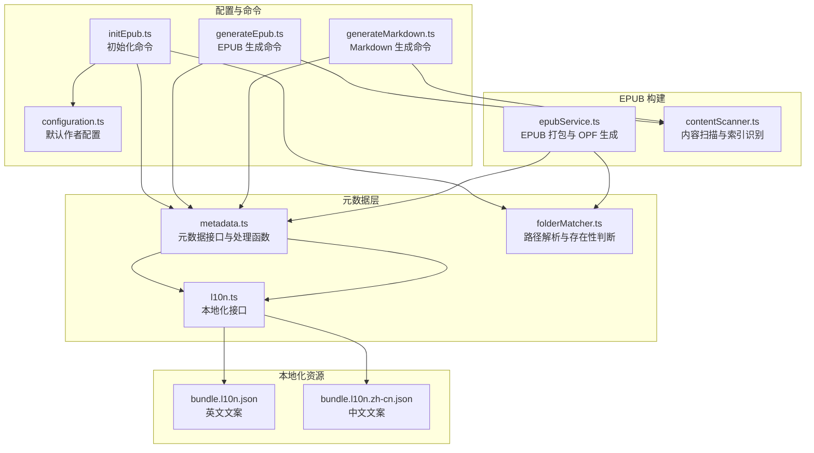
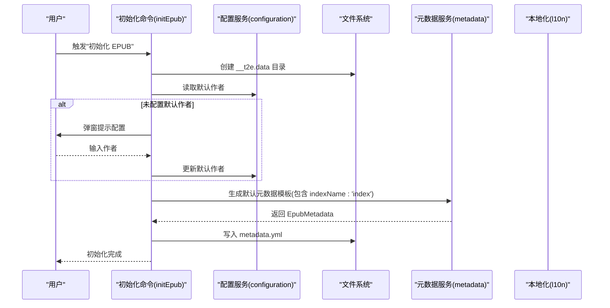
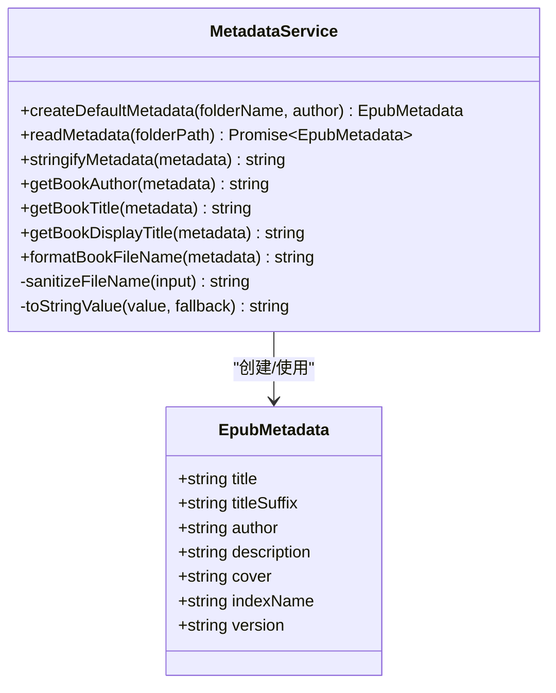
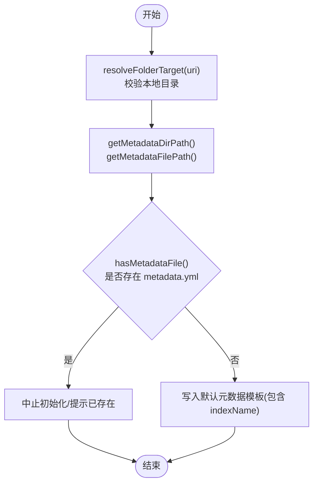
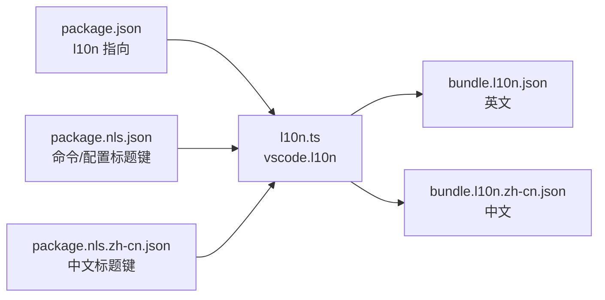
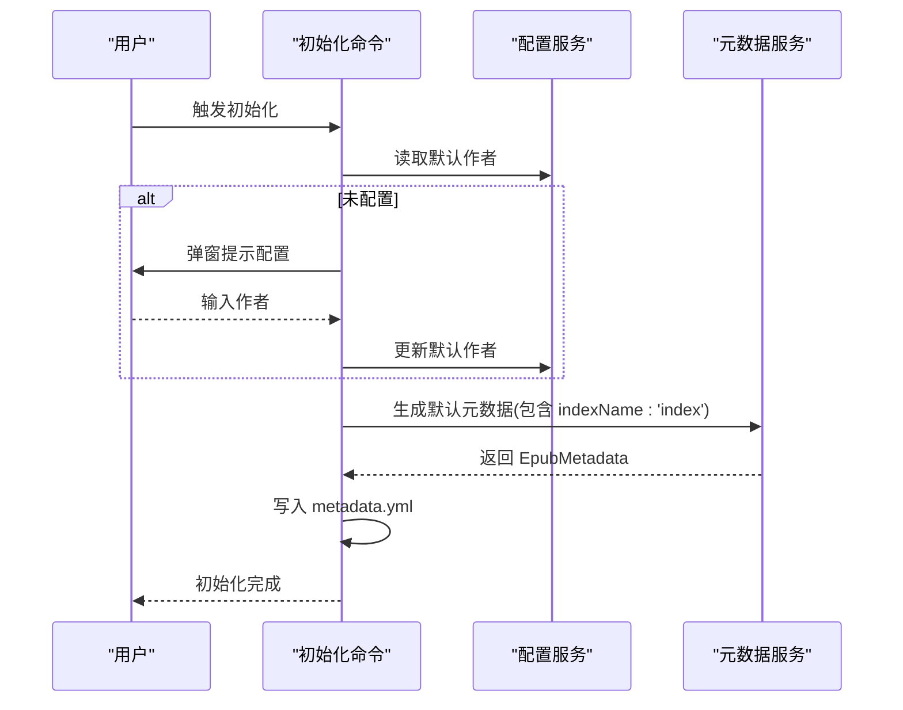
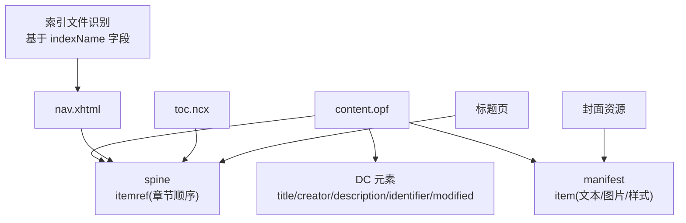
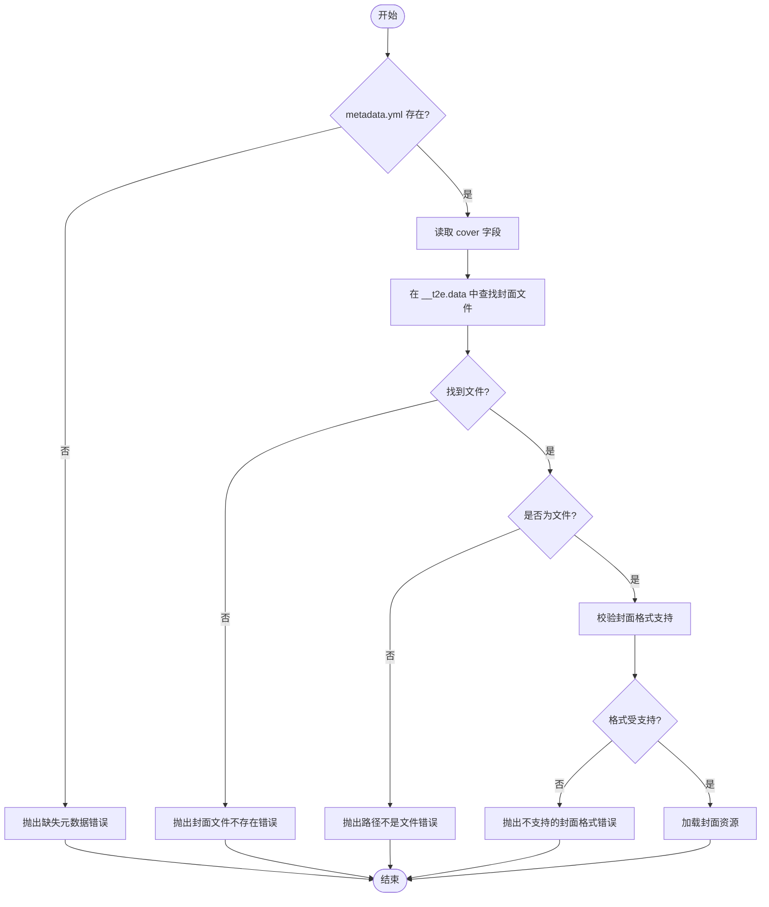
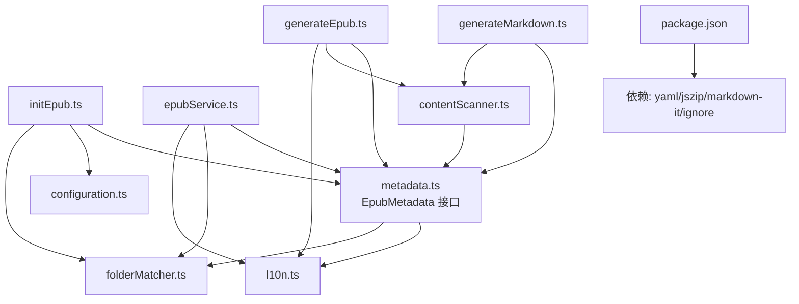
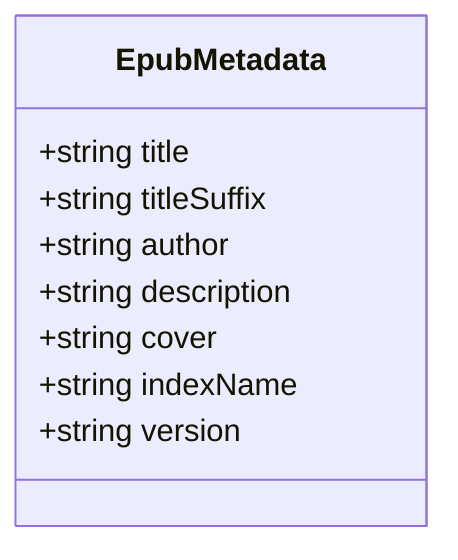

# 元数据管理系统

<cite>
**本文引用的文件**
- [src/services/metadata.ts](file://src/services/metadata.ts)
- [src/services/contentScanner.ts](file://src/services/contentScanner.ts)
- [src/commands/generateEpub.ts](file://src/commands/generateEpub.ts)
- [src/commands/generateMarkdown.ts](file://src/commands/generateMarkdown.ts)
- [example/init-folder/__t2e.data/metadata.yml](file://example/init-folder/__t2e.data/metadata.yml)
- [example/index-demo/__t2e.data/metadata.yml](file://example/index-demo/__t2e.data/metadata.yml)
- [src/services/folderMatcher.ts](file://src/services/folderMatcher.ts)
- [src/services/l10n.ts](file://src/services/l10n.ts)
- [l10n/bundle.l10n.json](file://l10n/bundle.l10n.json)
- [l10n/bundle.l10n.zh-cn.json](file://l10n/bundle.l10n.zh-cn.json)
- [src/services/configuration.ts](file://src/services/configuration.ts)
- [src/commands/initEpub.ts](file://src/commands/initEpub.ts)
- [src/services/epubService.ts](file://src/services/epubService.ts)
- [README.md](file://README.md)
- [package.json](file://package.json)
- [package.nls.json](file://package.nls.json)
- [package.nls.zh-cn.json](file://package.nls.zh-cn.json)
</cite>

## 更新摘要
**变更内容**
- 更新 EpubMetadata 接口，新增 indexName 字段及其默认值处理
- 增强 createDefaultMetadata 函数，包含 indexName: 'index' 模板
- 改进 readMetadata 函数，增强对 indexName 的读取和回退处理逻辑
- 新增 indexName 字段在内容扫描和 EPUB 生成中的使用说明
- 更新配置示例，展示自定义索引名称功能

## 目录
1. [简介](#简介)
2. [项目结构](#项目结构)
3. [核心组件](#核心组件)
4. [架构总览](#架构总览)
5. [详细组件分析](#详细组件分析)
6. [依赖分析](#依赖分析)
7. [性能考虑](#性能考虑)
8. [故障排查指南](#故障排查指南)
9. [结论](#结论)
10. [附录](#附录)

## 简介
本文件为"元数据管理系统"的技术文档，聚焦于元数据文件 metadata.yml 的解析与验证、字段处理、封面文件处理流程、与 EPUB 标准（OPF/DC 元素）的映射关系、以及本地化支持机制。文档同时提供元数据结构图与配置示例，帮助开发者与使用者准确理解与使用该系统。

**更新** 本版本新增了索引名称配置功能，允许用户自定义目录索引文件的识别名称，增强了内容组织的灵活性。

## 项目结构
围绕元数据管理的关键模块与文件如下：
- 元数据服务：负责读取、解析、校验、格式化与序列化 metadata.yml
- 目录匹配服务：负责定位 __t2e.data 与 metadata.yml 的路径
- 本地化服务：提供 l10n.t() 接口，支撑多语言错误与提示文案
- 配置服务：管理 Workspace 级别的默认作者配置
- 初始化命令：引导用户创建 __t2e.data/metadata.yml
- EPUB 构建服务：在打包 EPUB 时使用元数据生成 OPF/导航/封面等
- 内容扫描服务：基于 indexName 字段识别目录索引文件

```mermaid
graph TB
subgraph "元数据层"
M["metadata.ts<br/>元数据接口与处理函数"]
F["folderMatcher.ts<br/>路径解析与存在性判断"]
L["l10n.ts<br/>本地化接口"]
end
subgraph "配置与命令"
C["configuration.ts<br/>默认作者配置"]
I["initEpub.ts<br/>初始化命令"]
GE["generateEpub.ts<br/>EPUB 生成命令"]
GM["generateMarkdown.ts<br/>Markdown 生成命令"]
end
subgraph "EPUB 构建"
E["epubService.ts<br/>EPUB 打包与 OPF 生成"]
CS["contentScanner.ts<br/>内容扫描与索引识别"]
end
subgraph "本地化资源"
BL["bundle.l10n.json<br/>英文文案"]
BZ["bundle.l10n.zh-cn.json<br/>中文文案"]
end
I --> M
I --> C
I --> F
M --> L
GE --> M
GE --> CS
GM --> M
GM --> CS
M --> L
E --> M
E --> F
L --> BL
L --> BZ
```

**图表来源**
- [src/services/metadata.ts:1-160](file://src/services/metadata.ts#L1-L160)
- [src/services/folderMatcher.ts:1-85](file://src/services/folderMatcher.ts#L1-L85)
- [src/services/l10n.ts:1-10](file://src/services/l10n.ts#L1-L10)
- [src/services/configuration.ts:1-80](file://src/services/configuration.ts#L1-L80)
- [src/commands/initEpub.ts:1-63](file://src/commands/initEpub.ts#L1-L63)
- [src/services/epubService.ts:1-200](file://src/services/epubService.ts#L1-L200)
- [src/services/contentScanner.ts:1-350](file://src/services/contentScanner.ts#L1-L350)
- [src/commands/generateEpub.ts:1-66](file://src/commands/generateEpub.ts#L1-L66)
- [src/commands/generateMarkdown.ts:1-75](file://src/commands/generateMarkdown.ts#L1-L75)
- [l10n/bundle.l10n.json:1-50](file://l10n/bundle.l10n.json#L1-L50)
- [l10n/bundle.l10n.zh-cn.json:1-50](file://l10n/bundle.l10n.zh-cn.json#L1-L50)

**章节来源**
- [README.md:1-241](file://README.md#L1-L241)
- [package.json:1-114](file://package.json#L1-L114)

## 核心组件
- 元数据接口与处理
  - EpubMetadata 接口定义：title、titleSuffix、author、description、cover、indexName、version
  - 读取与解析：从 __t2e.data/metadata.yml 读取并使用 YAML.parse 解析
  - 字段收敛：toStringValue 将任意类型字段收敛为字符串，提供回退值
  - 标题与作者格式化：getBookTitle、getBookDisplayTitle、getBookAuthor
  - 文件名格式化：formatBookFileName，结合 sanitizeFileName 清洗非法字符
  - 序列化：stringifyMetadata 使用 YAML.stringify 输出标准 YAML 文本
- 目录匹配与路径解析
  - getMetadataDirPath/getMetadataFilePath：计算 __t2e.data 与 metadata.yml 的绝对路径
  - hasMetadataFile：判断 metadata.yml 是否存在
  - exists：通用文件存在性检测
- 本地化与错误文案
  - l10n.ts 导出 vscode.l10n，统一使用 l10n.t() 获取多语言文案
  - bundle.l10n.json 与 bundle.l10n.zh-cn.json 提供英文与中文文案
- 默认作者配置
  - configuration.ts 提供 Workspace 级默认作者的读取与设置
  - initEpub.ts 在初始化时优先使用默认作者，否则引导用户输入
- EPUB 构建与元数据映射
  - epubService.ts 在构建 EPUB 时使用元数据生成 OPF、导航、NCX 与标题页
- 内容扫描与索引识别
  - contentScanner.ts 基于 indexName 字段识别目录索引文件，支持自定义索引名称

**更新** 新增 indexName 字段处理，增强内容扫描的灵活性。

**章节来源**
- [src/services/metadata.ts:8-160](file://src/services/metadata.ts#L8-L160)
- [src/services/folderMatcher.ts:46-85](file://src/services/folderMatcher.ts#L46-L85)
- [src/services/l10n.ts:1-10](file://src/services/l10n.ts#L1-L10)
- [l10n/bundle.l10n.json:1-50](file://l10n/bundle.l10n.json#L1-L50)
- [l10n/bundle.l10n.zh-cn.json:1-50](file://l10n/bundle.l10n.zh-cn.json#L1-L50)
- [src/services/configuration.ts:1-80](file://src/services/configuration.ts#L1-L80)
- [src/commands/initEpub.ts:1-63](file://src/commands/initEpub.ts#L1-L63)
- [src/services/epubService.ts:146-200](file://src/services/epubService.ts#L146-L200)
- [src/services/contentScanner.ts:45-350](file://src/services/contentScanner.ts#L45-L350)

## 架构总览
元数据管理在系统中的位置与交互如下：

```mermaid
sequenceDiagram
participant U as "用户"
participant CMD as "初始化命令(initEpub)"
participant CFG as "配置服务(configuration)"
participant FS as "文件系统"
participant META as "元数据服务(metadata)"
participant LOC as "本地化(l10n)"
U->>CMD : 触发"初始化 EPUB"
CMD->>FS : 创建 __t2e.data 目录
CMD->>CFG : 读取默认作者
alt 未配置默认作者
CMD->>U : 弹窗提示配置
U-->>CMD : 输入作者
CMD->>CFG : 更新默认作者
end
CMD->>META : 生成默认元数据模板(包含 indexName : 'index')
META-->>CMD : 返回 EpubMetadata
CMD->>FS : 写入 metadata.yml
CMD-->>U : 初始化完成
```

**图表来源**
- [src/commands/initEpub.ts:18-62](file://src/commands/initEpub.ts#L18-L62)
- [src/services/configuration.ts:18-80](file://src/services/configuration.ts#L18-L80)
- [src/services/metadata.ts:25-35](file://src/services/metadata.ts#L25-L35)
- [src/services/folderMatcher.ts:23-38](file://src/services/folderMatcher.ts#L23-L38)

**章节来源**
- [src/commands/initEpub.ts:1-63](file://src/commands/initEpub.ts#L1-L63)
- [src/services/configuration.ts:1-80](file://src/services/configuration.ts#L1-L80)
- [src/services/metadata.ts:1-160](file://src/services/metadata.ts#L1-L160)
- [src/services/folderMatcher.ts:1-85](file://src/services/folderMatcher.ts#L1-L85)

## 详细组件分析

### 元数据接口与处理（metadata.ts）
- 数据模型
  - EpubMetadata：包含 title、titleSuffix、author、description、cover、indexName、version
- 解析与验证
  - readMetadata：读取并解析 YAML；校验对象有效性；使用 toStringValue 收敛字段类型
  - **新增** indexName 字段处理：toStringValue(metadata.indexName, 'index').trim() || 'index'
  - 错误处理：当内容非对象时抛出本地化错误
- 格式化与命名
  - getBookTitle/getBookDisplayTitle：标题清洗与组合
  - getBookAuthor：作者清洗与回退
  - formatBookFileName：生成 EPUB 文件名，结合 sanitizeFileName 清洗非法字符
- 序列化
  - stringifyMetadata：将 EpubMetadata 序列化为 YAML 文本

```mermaid
classDiagram
class EpubMetadata {
+string title
+string titleSuffix
+string author
+string description
+string cover
+string indexName
+string version
}
class MetadataService {
+createDefaultMetadata(folderName, author) EpubMetadata
+readMetadata(folderPath) Promise~EpubMetadata~
+stringifyMetadata(metadata) string
+getBookAuthor(metadata) string
+getBookTitle(metadata) string
+getBookDisplayTitle(metadata) string
+formatBookFileName(metadata) string
-sanitizeFileName(input) string
-toStringValue(value, fallback) string
}
MetadataService --> EpubMetadata : "创建/使用"
```

**图表来源**
- [src/services/metadata.ts:8-160](file://src/services/metadata.ts#L8-L160)

**章节来源**
- [src/services/metadata.ts:1-160](file://src/services/metadata.ts#L1-L160)

### 目录匹配与路径解析（folderMatcher.ts）
- 常量与路径
  - METADATA_DIRNAME/METADATA_FILENAME/EPUB_CONFIG_FILENAME
  - getMetadataDirPath/getMetadataFilePath：拼接 __t2e.data 与 metadata.yml 的绝对路径
- 目录目标解析
  - resolveFolderTarget：校验本地目录并返回标准化结构
- 存在性判断
  - hasMetadataFile：判断 metadata.yml 是否存在
  - exists：通用文件存在性检测

```mermaid
flowchart TD
Start(["开始"]) --> Resolve["resolveFolderTarget(uri)<br/>校验本地目录"]
Resolve --> PathCalc["getMetadataDirPath()<br/>getMetadataFilePath()"]
PathCalc --> Exists{"hasMetadataFile()<br/>是否存在 metadata.yml"}
Exists --> |是| Abort["中止初始化/提示已存在"]
Exists --> |否| Write["写入默认元数据模板(包含 indexName)"]
Abort --> End(["结束"])
Write --> End
```

**图表来源**
- [src/services/folderMatcher.ts:23-85](file://src/services/folderMatcher.ts#L23-L85)
- [src/commands/initEpub.ts:18-62](file://src/commands/initEpub.ts#L18-L62)

**章节来源**
- [src/services/folderMatcher.ts:1-85](file://src/services/folderMatcher.ts#L1-L85)
- [src/commands/initEpub.ts:1-63](file://src/commands/initEpub.ts#L1-L63)

### 本地化支持（l10n.ts 与 bundle.l10n.*.json）
- l10n.ts：导出 vscode.l10n，业务代码统一使用 l10n.t() 获取多语言文案
- bundle.l10n.json：英文默认文案集合
- bundle.l10n.zh-cn.json：中文本地化文案集合
- package.json 与 package.nls.*.json：声明本地化目录与命令/配置标题的本地化键

```mermaid
graph LR
L["l10n.ts<br/>vscode.l10n"] --> B["bundle.l10n.json<br/>英文"]
L --> Z["bundle.l10n.zh-cn.json<br/>中文"]
P["package.json<br/>l10n 指向"] --> L
NLS["package.nls.json<br/>命令/配置标题键"] --> L
NLSZ["package.nls.zh-cn.json<br/>中文标题键"] --> L
```

**图表来源**
- [src/services/l10n.ts:1-10](file://src/services/l10n.ts#L1-L10)
- [l10n/bundle.l10n.json:1-50](file://l10n/bundle.l10n.json#L1-L50)
- [l10n/bundle.l10n.zh-cn.json:1-50](file://l10n/bundle.l10n.zh-cn.json#L1-L50)
- [package.json:1-114](file://package.json#L1-L114)
- [package.nls.json:1-9](file://package.nls.json#L1-L9)
- [package.nls.zh-cn.json:1-9](file://package.nls.zh-cn.json#L1-L9)

**章节来源**
- [src/services/l10n.ts:1-10](file://src/services/l10n.ts#L1-L10)
- [l10n/bundle.l10n.json:1-50](file://l10n/bundle.l10n.json#L1-L50)
- [l10n/bundle.l10n.zh-cn.json:1-50](file://l10n/bundle.l10n.zh-cn.json#L1-L50)
- [package.json:1-114](file://package.json#L1-L114)
- [package.nls.json:1-9](file://package.nls.json#L1-L9)
- [package.nls.zh-cn.json:1-9](file://package.nls.zh-cn.json#L1-L9)

### 默认作者配置（configuration.ts 与 initEpub.ts）
- configuration.ts
  - getDefaultAuthor：读取 Workspace 级默认作者
  - setDefaultAuthor：设置默认作者
  - configureDefaultAuthorInteractively：交互式配置并返回结果
- initEpub.ts
  - 初始化时优先使用默认作者；若未配置则弹窗引导用户输入
  - 成功后写入 __t2e.data/metadata.yml（包含 indexName: 'index'）

```mermaid
sequenceDiagram
participant U as "用户"
participant INIT as "初始化命令"
participant CFG as "配置服务"
participant META as "元数据服务"
U->>INIT : 触发初始化
INIT->>CFG : 读取默认作者
alt 未配置
INIT->>U : 弹窗提示配置
U-->>INIT : 输入作者
INIT->>CFG : 更新默认作者
end
INIT->>META : 生成默认元数据(包含 indexName : 'index')
META-->>INIT : 返回 EpubMetadata
INIT->>INIT : 写入 metadata.yml
INIT-->>U : 初始化完成
```

**图表来源**
- [src/services/configuration.ts:18-80](file://src/services/configuration.ts#L18-L80)
- [src/commands/initEpub.ts:18-62](file://src/commands/initEpub.ts#L18-L62)
- [src/services/metadata.ts:25-35](file://src/services/metadata.ts#L25-L35)

**章节来源**
- [src/services/configuration.ts:1-80](file://src/services/configuration.ts#L1-L80)
- [src/commands/initEpub.ts:1-63](file://src/commands/initEpub.ts#L1-L63)
- [src/services/metadata.ts:1-160](file://src/services/metadata.ts#L1-L160)

### 元数据与 EPUB 标准映射
- OPF 元数据映射
  - title → dc:title
  - author → dc:creator
  - description → dc:description
  - cover → 封面资源与封面项
  - version → 标识符（如 UUID）与修改时间（modified）
- 导航与 NCX
  - 基于章节与目录树生成 nav.xhtml 与 toc.ncx
  - **新增** 索引文件识别：基于 indexName 字段识别目录索引文件
- 标题页
  - 根据元数据生成标题页 XHTML，置于 spine 首位

```mermaid
graph TB
OPF["content.opf"] --> DC["DC 元素<br/>title/creator/description/identifier/modified"]
OPF --> MANIFEST["manifest<br/>item(文本/图片/样式)"]
OPF --> SPINE["spine<br/>itemref(章节顺序)"]
NAV["nav.xhtml"] --> SPINE
NCX["toc.ncx"] --> SPINE
TITLE["标题页"] --> SPINE
COVER["封面资源"] --> MANIFEST
INDEX["索引文件识别<br/>基于 indexName 字段"] --> NAV
```

**图表来源**
- [src/services/epubService.ts:146-200](file://src/services/epubService.ts#L146-L200)

**章节来源**
- [src/services/epubService.ts:146-200](file://src/services/epubService.ts#L146-L200)

### 封面文件处理流程
- 查找与存在性
  - hasMetadataFile：判断 metadata.yml 是否存在
  - loadCoverAsset：从 __t2e.data 目录加载封面文件
- 格式验证与媒体类型
  - 支持 cover.jpg、cover.webp 等常见封面格式
  - 媒体类型映射由 EPUB 规范与实际文件扩展名决定
- 错误处理
  - 封面文件不存在、路径不是文件、格式不支持等情况抛出本地化错误

```mermaid
flowchart TD
S(["开始"]) --> CheckMeta{"metadata.yml 存在?"}
CheckMeta --> |否| ErrMeta["抛出缺失元数据错误"]
CheckMeta --> |是| ReadCover["读取 cover 字段"]
ReadCover --> FindFile["在 __t2e.data 中查找封面文件"]
FindFile --> Found{"找到文件?"}
Found --> |否| ErrNotFound["抛出封面文件不存在错误"]
Found --> |是| IsFile{"是否为文件?"}
IsFile --> |否| ErrNotFile["抛出路径不是文件错误"]
IsFile --> |是| ValidateFmt["校验封面格式支持"]
ValidateFmt --> Supported{"格式受支持?"}
Supported --> |否| ErrFmt["抛出不支持的封面格式错误"]
Supported --> |是| LoadOK["加载封面资源"]
LoadOK --> End(["结束"])
ErrMeta --> End
ErrNotFound --> End
ErrNotFile --> End
ErrFmt --> End
```

**图表来源**
- [src/services/epubService.ts:163-164](file://src/services/epubService.ts#L163-L164)
- [l10n/bundle.l10n.json:36-38](file://l10n/bundle.l10n.json#L36-L38)
- [l10n/bundle.l10n.zh-cn.json:36-38](file://l10n/bundle.l10n.zh-cn.json#L36-L38)

**章节来源**
- [src/services/epubService.ts:146-200](file://src/services/epubService.ts#L146-L200)
- [l10n/bundle.l10n.json:1-50](file://l10n/bundle.l10n.json#L1-L50)
- [l10n/bundle.l10n.zh-cn.json:1-50](file://l10n/bundle.l10n.zh-cn.json#L1-L50)

### 元数据字段处理细节
- 标题格式化
  - getBookTitle：去除空白，缺失时回退为"未命名"
  - getBookDisplayTitle：主标题 + 副标题（如存在）组合为展示标题
- 作者信息处理
  - getBookAuthor：去除空白，缺失时回退为本地化"Unknown"
- 描述文本处理
  - toStringValue：将任意类型描述收敛为字符串
- 文件名处理
  - sanitizeFileName：移除控制字符与非法字符，避免文件系统错误
- **新增** 索引名称处理
  - indexName：默认值为 'index'，支持自定义索引文件名称
  - readMetadata 中的回退逻辑：toStringValue(metadata.indexName, 'index').trim() || 'index'

**章节来源**
- [src/services/metadata.ts:77-160](file://src/services/metadata.ts#L77-L160)

### 配置示例与约定
- 默认元数据模板（初始化时生成）
  - 来源：createDefaultMetadata
  - 字段：title、titleSuffix、author、description、cover、indexName、version
  - **新增** indexName 默认值：'index'
- 示例 metadata.yml（示例目录）
  - **更新** example/init-folder/__t2e.data/metadata.yml：包含基础字段
  - **新增** example/index-demo/__t2e.data/metadata.yml：演示自定义 indexName 配置
- README 中的约定与示例
  - 默认模板字段与示例
  - 目录结构与封面文件对应关系
  - **新增** 自定义索引名称功能说明

**章节来源**
- [src/services/metadata.ts:25-35](file://src/services/metadata.ts#L25-L35)
- [example/init-folder/__t2e.data/metadata.yml:1-7](file://example/init-folder/__t2e.data/metadata.yml#L1-L7)
- [example/index-demo/__t2e.data/metadata.yml:1-8](file://example/index-demo/__t2e.data/metadata.yml#L1-L8)
- [README.md:50-122](file://README.md#L50-L122)

### 索引名称功能详解
- 功能概述
  - 允许用户自定义目录索引文件的识别名称
  - 默认值为 'index'，保持向后兼容
  - 支持多语言和自定义命名
- 实现机制
  - contentScanner.ts 中的 isIndexDisplayName 函数
  - 基于 indexName.trim().toLowerCase() 进行大小写不敏感比较
  - 支持空字符串回退到默认 'index'
- 使用场景
  - 不同语言的索引文件命名：如 'preface'、'introduction'、'前言'
  - 特定主题的索引文件：如 'overview'、'summary'、'概要'
  - 个性化命名需求

**章节来源**
- [src/services/contentScanner.ts:255-258](file://src/services/contentScanner.ts#L255-L258)
- [src/services/contentScanner.ts:268-339](file://src/services/contentScanner.ts#L268-L339)
- [src/commands/generateEpub.ts:40](file://src/commands/generateEpub.ts#L40)
- [src/commands/generateMarkdown.ts:43](file://src/commands/generateMarkdown.ts#L43)

## 依赖分析
- 组件耦合
  - metadata.ts 依赖 l10n.ts 与 folderMatcher.ts（路径解析）
  - initEpub.ts 依赖 configuration.ts、metadata.ts、folderMatcher.ts
  - epubService.ts 依赖 metadata.ts、folderMatcher.ts、l10n.ts
  - **新增** generateEpub.ts 和 generateMarkdown.ts 依赖 contentScanner.ts
  - contentScanner.ts 依赖 metadata.ts 的 indexName 字段
- 外部依赖
  - yaml：YAML 解析与序列化
  - jszip：EPUB 打包
  - markdown-it：Markdown 渲染
  - ignore：忽略规则（与元数据无直接关系）

```mermaid
graph TB
META["metadata.ts<br/>EpubMetadata 接口"] --> L10N["l10n.ts"]
META --> FM["folderMatcher.ts"]
INIT["initEpub.ts"] --> META
INIT --> CFG["configuration.ts"]
INIT --> FM
EPUB["epubService.ts"] --> META
EPUB --> FM
EPUB --> L10N
GEN["generateEpub.ts"] --> META
GEN --> CS["contentScanner.ts"]
GEN --> L10N
GMD["generateMarkdown.ts"] --> META
GMD --> CS
CS --> META
PKG["package.json"] --> DEP["依赖: yaml/jszip/markdown-it/ignore"]
```

**图表来源**
- [src/services/metadata.ts:1-160](file://src/services/metadata.ts#L1-L160)
- [src/services/folderMatcher.ts:1-85](file://src/services/folderMatcher.ts#L1-L85)
- [src/services/l10n.ts:1-10](file://src/services/l10n.ts#L1-L10)
- [src/commands/initEpub.ts:1-63](file://src/commands/initEpub.ts#L1-L63)
- [src/services/epubService.ts:1-200](file://src/services/epubService.ts#L1-L200)
- [src/commands/generateEpub.ts:1-66](file://src/commands/generateEpub.ts#L1-L66)
- [src/commands/generateMarkdown.ts:1-75](file://src/commands/generateMarkdown.ts#L1-L75)
- [src/services/contentScanner.ts:1-350](file://src/services/contentScanner.ts#L1-L350)
- [package.json:97-112](file://package.json#L97-L112)

**章节来源**
- [package.json:97-112](file://package.json#L97-L112)

## 性能考虑
- YAML 解析与序列化
  - metadata.yml 通常较小，解析成本低；建议避免频繁重复读取，可在上层缓存
- 文件系统访问
  - hasMetadataFile 与 exists 仅进行存在性判断，开销极小
- 字符串处理
  - sanitizeFileName 为线性扫描，字符集有限，性能可接受
  - **新增** indexName 处理为简单的字符串操作，性能影响可忽略
- EPUB 构建
  - 大型书籍的章节与图片较多时，建议分批处理与内存控制
  - **新增** 内容扫描中的索引文件识别为 O(n) 操作，性能良好

## 故障排查指南
- 元数据文件缺失
  - 现象：提示缺少 __t2e.data/metadata.yml
  - 处理：执行"初始化 EPUB"生成默认模板
- 元数据内容无效
  - 现象：Invalid metadata.yml content
  - 处理：检查 YAML 语法与顶层为对象
- 封面文件问题
  - 现象：封面文件不存在、路径不是文件、不支持的格式
  - 处理：确认 __t2e.data/cover.jpg 或 cover.webp 存在且为文件
- 无可用章节
  - 现象：当前目录无 md/txt 文件
  - 处理：添加符合命名规则的 .md/.txt 文件
- **新增** 索引文件识别问题
  - 现象：自定义 indexName 未生效
  - 处理：检查 metadata.yml 中的 indexName 字段是否正确设置，确认文件命名符合预期

**章节来源**
- [l10n/bundle.l10n.json:6-6](file://l10n/bundle.l10n.json#L6-L6)
- [l10n/bundle.l10n.json:30-30](file://l10n/bundle.l10n.json#L30-L30)
- [l10n/bundle.l10n.json:36-38](file://l10n/bundle.l10n.json#L36-L38)
- [l10n/bundle.l10n.json:10-10](file://l10n/bundle.l10n.json#L10-L10)
- [src/services/epubService.ts:157-157](file://src/services/epubService.ts#L157-L157)

## 结论
本元数据管理系统以 metadata.yml 为核心，通过严格的解析与验证、稳健的字段收敛与格式化、完善的本地化支持与错误提示，实现了从初始化到 EPUB 打包的全链路元数据管理。系统遵循 EPUB 标准，将元数据映射至 OPF/DC 元素，并提供清晰的封面文件处理流程与配置示例。

**更新** 新版本增强了索引名称配置功能，允许用户自定义目录索引文件的识别名称，提升了内容组织的灵活性和国际化支持能力。通过 EpubMetadata 接口的扩展和相关函数的改进，系统在保持向后兼容的同时，为用户提供了更强大的定制化选项。

## 附录
- 元数据结构图（来自 EpubMetadata 接口）
  

```mermaid
classDiagram
class EpubMetadata {
+string title
+string titleSuffix
+string author
+string description
+string cover
+string indexName
+string version
}
```

**图表来源**
- [src/services/metadata.ts:8-16](file://src/services/metadata.ts#L8-L16)

- 配置示例（默认模板与示例）
  - 默认模板字段：title、titleSuffix、author、description、cover、indexName、version
  - **更新** 示例 metadata.yml 字段：title、titleSuffix、author、description、cover、indexName、version
  - **新增** 自定义索引名称示例：indexName: 'preface'（example/index-demo）

**章节来源**
- [src/services/metadata.ts:25-35](file://src/services/metadata.ts#L25-L35)
- [example/init-folder/__t2e.data/metadata.yml:1-7](file://example/init-folder/__t2e.data/metadata.yml#L1-L7)
- [example/index-demo/__t2e.data/metadata.yml:1-8](file://example/index-demo/__t2e.data/metadata.yml#L1-L8)
- [README.md:50-122](file://README.md#L50-L122)