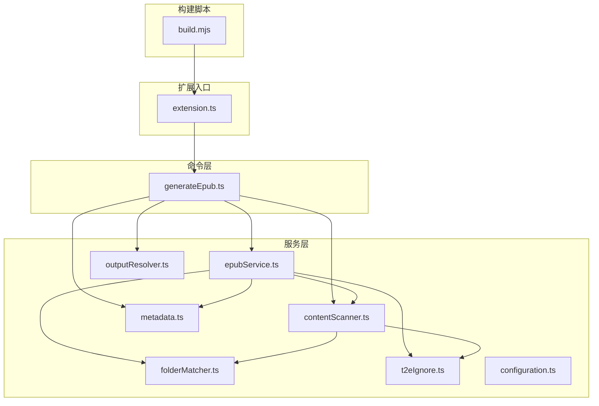
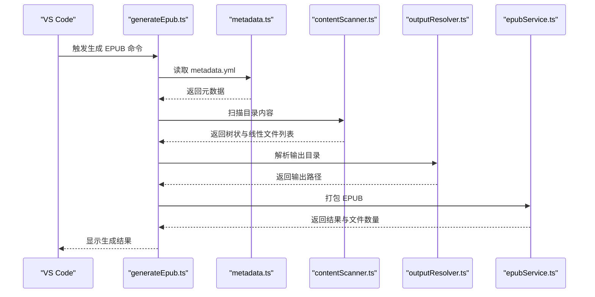
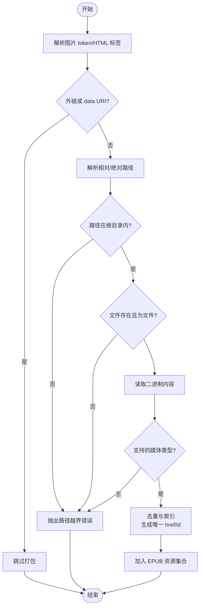
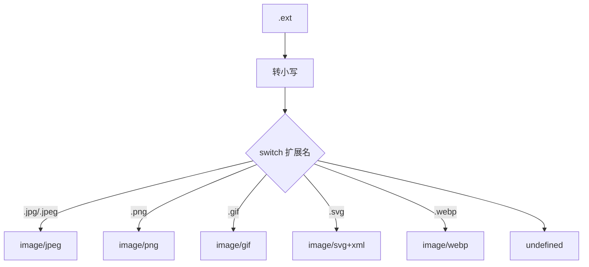
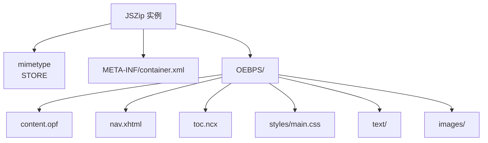
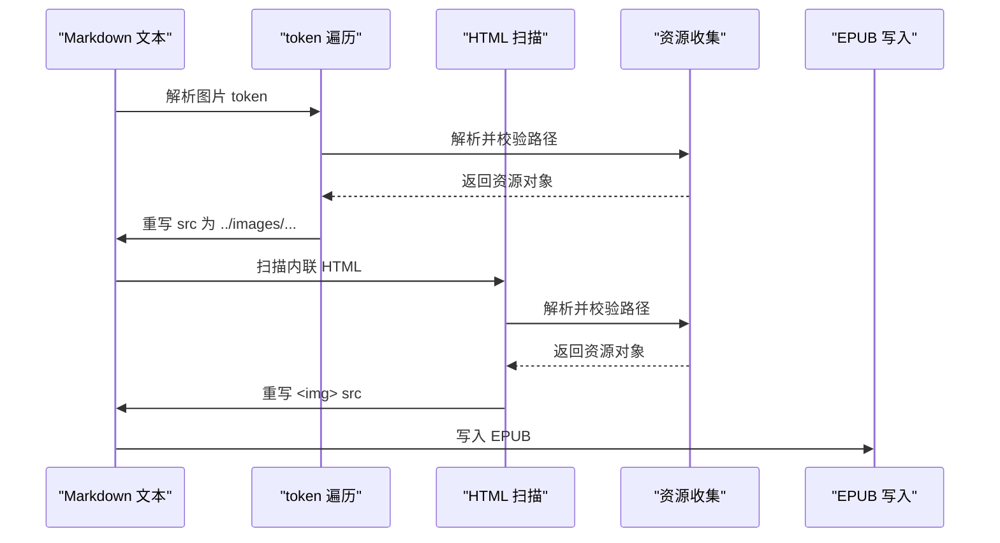
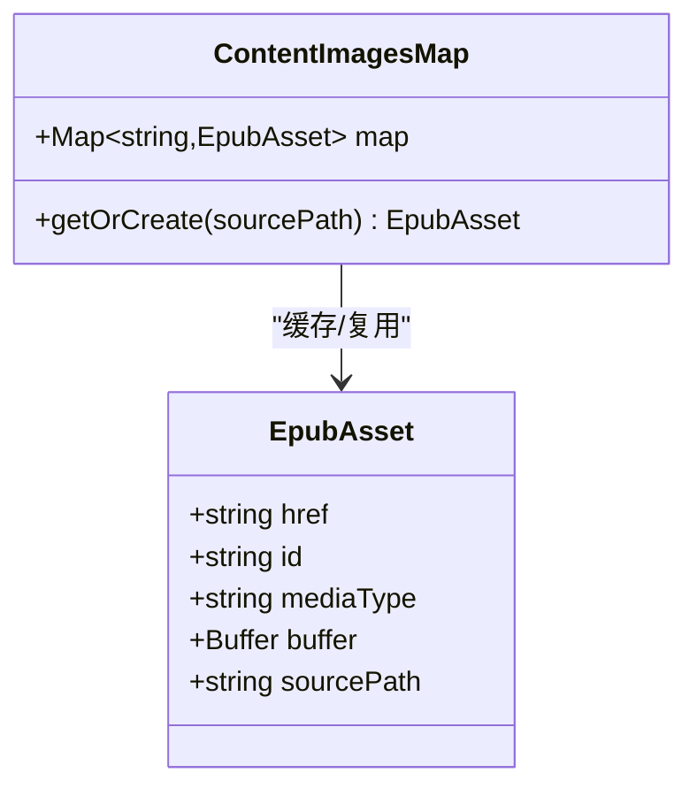
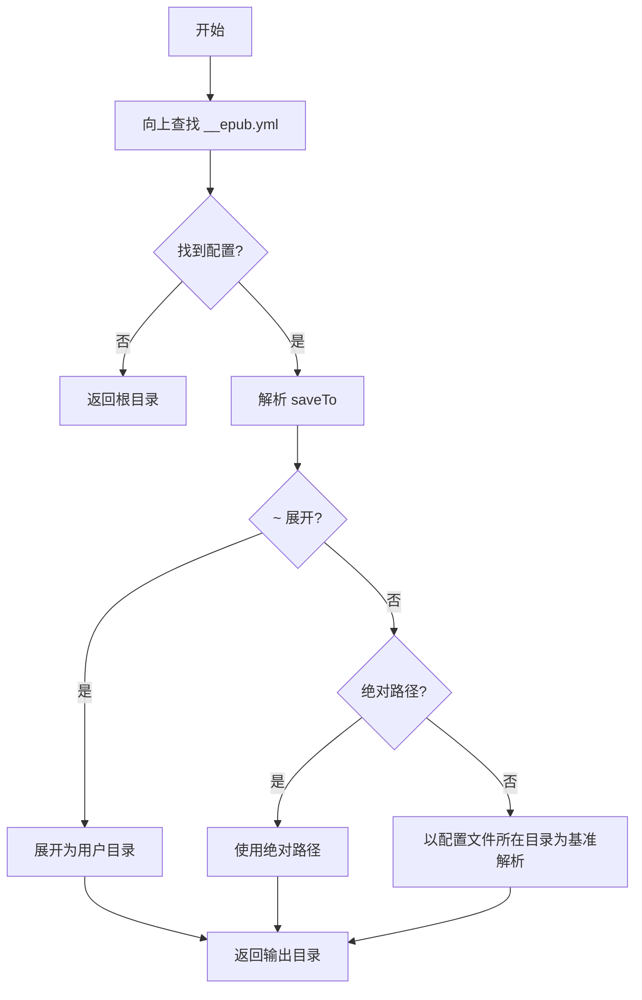
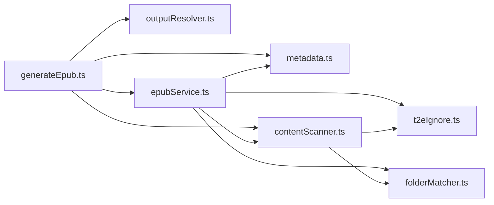

# 资源管理系统

<cite>
**本文档引用的文件**
- [contentScanner.ts](file://src/services/contentScanner.ts)
- [epubService.ts](file://src/services/epubService.ts)
- [configuration.ts](file://src/services/configuration.ts)
- [folderMatcher.ts](file://src/services/folderMatcher.ts)
- [t2eIgnore.ts](file://src/services/t2eIgnore.ts)
- [metadata.ts](file://src/services/metadata.ts)
- [outputResolver.ts](file://src/services/outputResolver.ts)
- [generateEpub.ts](file://src/commands/generateEpub.ts)
- [package.json](file://package.json)
- [README.md](file://README.md)
- [build.mjs](file://scripts/build.mjs)
</cite>

## 目录
1. [简介](#简介)
2. [项目结构](#项目结构)
3. [核心组件](#核心组件)
4. [架构总览](#架构总览)
5. [详细组件分析](#详细组件分析)
6. [依赖关系分析](#依赖关系分析)
7. [性能考虑](#性能考虑)
8. [故障排查指南](#故障排查指南)
9. [结论](#结论)
10. [附录](#附录)

## 简介
本项目是一个 VS Code 扩展，旨在将符合约定的本地文件夹转换为 EPUB 3 电子书。系统围绕“目录即书籍”的理念设计，支持 Markdown、TXT 文本内容，以及 Markdown 图片与 HTML `` 标签中的本地图片资源。核心功能包括：
- 静态资源收集：识别图片文件、解析资源路径、读取文件内容
- 媒体类型映射：JPEG、PNG、GIF、SVG、WEBP 等格式的 MIME 类型处理
- 资源打包流程：使用 JSZip 进行文件压缩与目录结构组织
- 资源链接重写：相对路径转换、URL 生成、引用更新
- 资源去重与索引：重复资源检测、唯一标识生成
- 输出目录解析：基于父级配置文件的输出路径解析

## 项目结构
项目采用模块化服务层设计，主要目录与文件如下：
- src/services：核心业务逻辑服务
  - contentScanner.ts：内容扫描与排序
  - epubService.ts：EPUB 打包与资源处理
  - metadata.ts：元数据读取与格式化
  - outputResolver.ts：输出目录解析
  - folderMatcher.ts：目录与文件路径工具
  - t2eIgnore.ts：忽略规则解析
  - configuration.ts：VS Code 配置交互
- src/commands：VS Code 命令注册与流程编排
- scripts：构建脚本
- package.json：依赖与脚本配置
- README.md：功能说明与使用指南

图表来源
- [generateEpub.ts:18-66](file://src/commands/generateEpub.ts#L18-L66)
- [epubService.ts:146-216](file://src/services/epubService.ts#L146-L216)
- [contentScanner.ts:51-58](file://src/services/contentScanner.ts#L51-L58)
- [outputResolver.ts:15-42](file://src/services/outputResolver.ts#L15-L42)
- [build.mjs:29-37](file://scripts/build.mjs#L29-L37)

章节来源
- [README.md:1-241](file://README.md#L1-L241)
- [package.json:1-114](file://package.json#L1-L114)

## 核心组件
- 内容扫描器：递归扫描目录，解析数字前缀排序，识别 index 文件，过滤忽略规则，生成树状与线性结构
- EPUB 打包器：渲染 Markdown/TXT，重写图片链接，收集资源，使用 JSZip 组织 EPUB 结构，生成 OPF、导航页、NCX 与样式表
- 元数据管理：读取与格式化 metadata.yml，生成展示标题与文件名
- 输出目录解析：向上查找配置文件，解析 saveTo，支持 ~ 展开
- 忽略规则：基于 .t2eignore 的 gitignore 语法过滤
- VS Code 配置：默认作者配置与交互

章节来源
- [contentScanner.ts:51-340](file://src/services/contentScanner.ts#L51-L340)
- [epubService.ts:146-1089](file://src/services/epubService.ts#L146-L1089)
- [metadata.ts:41-157](file://src/services/metadata.ts#L41-L157)
- [outputResolver.ts:15-90](file://src/services/outputResolver.ts#L15-L90)
- [t2eIgnore.ts:13-45](file://src/services/t2eIgnore.ts#L13-L45)
- [configuration.ts:18-80](file://src/services/configuration.ts#L18-L80)

## 架构总览
系统通过命令层串联各服务层，形成“读取元数据 -> 扫描内容 -> 解析输出目录 -> 打包 EPUB”的完整流程。EPUB 打包器负责资源收集与链接重写，使用 JSZip 组织 mimetype、container.xml、OEBPS 目录及内部文件。

图表来源
- [generateEpub.ts:19-57](file://src/commands/generateEpub.ts#L19-L57)
- [epubService.ts:146-216](file://src/services/epubService.ts#L146-L216)

## 详细组件分析

### 静态资源收集机制
- 图片文件识别
  - 仅处理 Markdown 与 HTML 中的本地图片，外链与 data URI 不参与打包
  - 通过 token 遍历与 HTML 字符串扫描相结合，确保内联 HTML 图片也被识别
- 资源路径解析
  - 支持相对路径、绝对路径与查询参数/哈希剥离
  - 严格限制图片路径不得越出书籍根目录
  - 统一相对路径分隔符为 POSIX 风格
- 文件读取
  - 读取图片二进制内容，生成资源对象
  - 校验文件存在性与类型合法性

图表来源
- [epubService.ts:743-783](file://src/services/epubService.ts#L743-L783)
- [epubService.ts:800-816](file://src/services/epubService.ts#L800-L816)
- [epubService.ts:828-867](file://src/services/epubService.ts#L828-L867)
- [epubService.ts:875-877](file://src/services/epubService.ts#L875-L877)
- [epubService.ts:887-904](file://src/services/epubService.ts#L887-L904)
- [epubService.ts:916-950](file://src/services/epubService.ts#L916-L950)
- [epubService.ts:962-991](file://src/services/epubService.ts#L962-L991)

章节来源
- [epubService.ts:743-1089](file://src/services/epubService.ts#L743-L1089)

### 媒体类型映射
- 支持格式：JPEG、PNG、GIF、SVG、WEBP
- 映射规则：基于文件扩展名的小写形式进行判断
- 不支持格式：直接抛出错误，阻止打包

图表来源
- [epubService.ts:641-657](file://src/services/epubService.ts#L641-L657)

章节来源
- [epubService.ts:641-657](file://src/services/epubService.ts#L641-L657)

### 资源打包流程
- JSZip 使用
  - mimetype 使用 STORE 压缩（EPUB 规定）
  - 其余文件使用 DEFLATE 压缩
- 目录结构组织
  - 根目录：mimetype、META-INF/container.xml
  - OEBPS：content.opf、nav.xhtml、toc.ncx、styles/main.css、text/*、images/*
- 文件写入
  - 标题页与章节写入 text 目录
  - 封面与正文图片写入 images 目录
  - OPF manifest 声明所有资源，spine 决定阅读顺序

图表来源
- [epubService.ts:168-216](file://src/services/epubService.ts#L168-L216)
- [epubService.ts:340-390](file://src/services/epubService.ts#L340-L390)
- [epubService.ts:412-430](file://src/services/epubService.ts#L412-L430)
- [epubService.ts:440-463](file://src/services/epubService.ts#L440-L463)

章节来源
- [epubService.ts:168-216](file://src/services/epubService.ts#L168-L216)

### 资源链接重写机制
- Markdown 图片
  - 通过 markdown-it token 遍历，重写 src 属性为 ../images/...
- HTML 图片
  - 使用正则匹配  标签，解析 src 属性，重写为 ../images/...
- 外链与 data URI
  - 直接跳过，不参与本地打包
- 相对路径转换
  - 统一使用 POSIX 分隔符，确保跨平台兼容
  - 去除查询参数与哈希，避免路径歧义

图表来源
- [epubService.ts:743-783](file://src/services/epubService.ts#L743-L783)
- [epubService.ts:916-950](file://src/services/epubService.ts#L916-L950)
- [epubService.ts:962-991](file://src/services/epubService.ts#L962-L991)

章节来源
- [epubService.ts:743-1089](file://src/services/epubService.ts#L743-L1089)

### 资源去重与索引机制
- 去重策略
  - 以源文件绝对路径为键，缓存已收集的资源对象
  - 同一源文件仅打包一次，避免重复资源
- 唯一标识生成
  - 资源 ID：image-{index}（4 位前缀）
  - 资源 href：images/content/image-{index}{.ext}
  - 媒体类型：基于扩展名映射
- 索引与引用
  - OPF manifest 声明所有资源
  - spine 顺序与章节顺序一致

图表来源
- [epubService.ts:124-130](file://src/services/epubService.ts#L124-L130)
- [epubService.ts:828-867](file://src/services/epubService.ts#L828-L867)

章节来源
- [epubService.ts:828-867](file://src/services/epubService.ts#L828-L867)

### 内容扫描与排序
- 扫描范围
  - 仅处理 .md 与 .txt 文件
  - 忽略 __t2e.data 目录（最高优先级）
  - 应用 .t2eignore 规则（gitignore 语法）
- 排序规则
  - 数字前缀优先，名称次之，中文友好排序
  - 目录优先使用 index 文件作为入口，隐藏该文件的独立目录项
- 索引文件
  - 支持直接 index 与带数字前缀的 index（如 0000__index.md）

图表来源
- [contentScanner.ts:258-329](file://src/services/contentScanner.ts#L258-L329)
- [contentScanner.ts:191-238](file://src/services/contentScanner.ts#L191-L238)
- [contentScanner.ts:113-141](file://src/services/contentScanner.ts#L113-L141)

章节来源
- [contentScanner.ts:51-340](file://src/services/contentScanner.ts#L51-L340)

### 输出目录解析
- 查找策略
  - 从当前目录向上查找 __epub.yml
  - 解析 saveTo 配置，支持相对路径与 ~ 展开
- 路径展开
  - ~ 或 ~/... 展开为用户目录
  - 绝对路径直接使用
- 默认行为
  - 未找到配置时，默认输出到书籍根目录

图表来源
- [outputResolver.ts:15-42](file://src/services/outputResolver.ts#L15-L42)
- [outputResolver.ts:50-71](file://src/services/outputResolver.ts#L50-L71)
- [outputResolver.ts:79-89](file://src/services/outputResolver.ts#L79-L89)

章节来源
- [outputResolver.ts:15-90](file://src/services/outputResolver.ts#L15-L90)

## 依赖关系分析
- 外部依赖
  - jszip：EPUB 打包与压缩
  - markdown-it：Markdown 渲染
  - yaml：YAML 解析与序列化
  - ignore：.t2eignore 规则解析
- 内部模块耦合
  - generateEpub.ts 依赖 metadata.ts、contentScanner.ts、outputResolver.ts、epubService.ts
  - epubService.ts 依赖 folderMatcher.ts、t2eIgnore.ts、contentScanner.ts、metadata.ts
  - contentScanner.ts 依赖 t2eIgnore.ts、folderMatcher.ts

图表来源
- [generateEpub.ts:18-66](file://src/commands/generateEpub.ts#L18-L66)
- [epubService.ts:146-216](file://src/services/epubService.ts#L146-L216)
- [contentScanner.ts:51-58](file://src/services/contentScanner.ts#L51-L58)

章节来源
- [package.json:97-112](file://package.json#L97-L112)

## 性能考虑
- IO 优化
  - 使用 Promise API 进行异步文件读取，避免阻塞主线程
  - 资源去重减少重复读取与打包
- 压缩策略
  - mimetype 使用 STORE，其余文件使用 DEFLATE，平衡体积与速度
- 路径解析
  - 统一相对路径分隔符，减少跨平台差异带来的额外处理
- 扫描效率
  - 早期过滤非目标文件与忽略项，减少后续处理成本

## 故障排查指南
- 常见错误与定位
  - “未找到 __t2e.data/metadata.yml”：确认目录初始化与文件存在
  - “无可用的 .md/.txt 文件”：检查目录结构与 .t2eignore 规则
  - “封面文件未找到”：确认 metadata.yml 中 cover 与实际文件一致
  - “图片路径越界”：检查图片路径是否位于书籍根目录内
  - “不支持的图片格式”：确认扩展名为 JPEG/PNG/GIF/SVG/WEBP
- 建议排查步骤
  - 检查 .t2eignore 是否误删必要文件
  - 确认图片路径使用相对路径且未包含查询参数/哈希
  - 验证 metadata.yml 格式与字段完整性
  - 使用 VS Code 输出面板查看详细错误信息

章节来源
- [generateEpub.ts:23-26](file://src/commands/generateEpub.ts#L23-L26)
- [epubService.ts:604-633](file://src/services/epubService.ts#L604-L633)
- [epubService.ts:841-854](file://src/services/epubService.ts#L841-L854)
- [epubService.ts:899-901](file://src/services/epubService.ts#L899-L901)

## 结论
本资源管理系统围绕 EPUB 3 的规范与 VS Code 的工作流进行了深度集成，实现了从内容扫描、资源收集、链接重写到打包输出的全链路自动化。通过严格的路径校验、媒体类型映射与资源去重机制，确保生成的 EPUB 文件结构正确、资源完整且跨平台兼容。配合 .t2eignore 与 __epub.yml 的灵活配置，用户可以高效地将本地文件夹转换为高质量的电子书。

## 附录
- 代码示例路径
  - 静态资源收集与链接重写：[epubService.ts:743-1089](file://src/services/epubService.ts#L743-L1089)
  - 媒体类型映射：[epubService.ts:641-657](file://src/services/epubService.ts#L641-L657)
  - EPUB 打包流程：[epubService.ts:168-216](file://src/services/epubService.ts#L168-L216)
  - 内容扫描与排序：[contentScanner.ts:258-329](file://src/services/contentScanner.ts#L258-L329)
  - 输出目录解析：[outputResolver.ts:15-42](file://src/services/outputResolver.ts#L15-L42)
  - VS Code 命令编排：[generateEpub.ts:19-57](file://src/commands/generateEpub.ts#L19-L57)