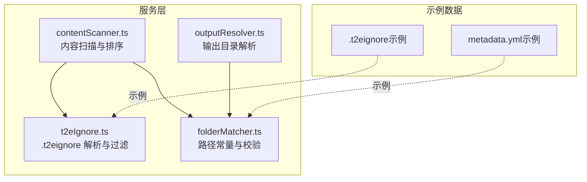
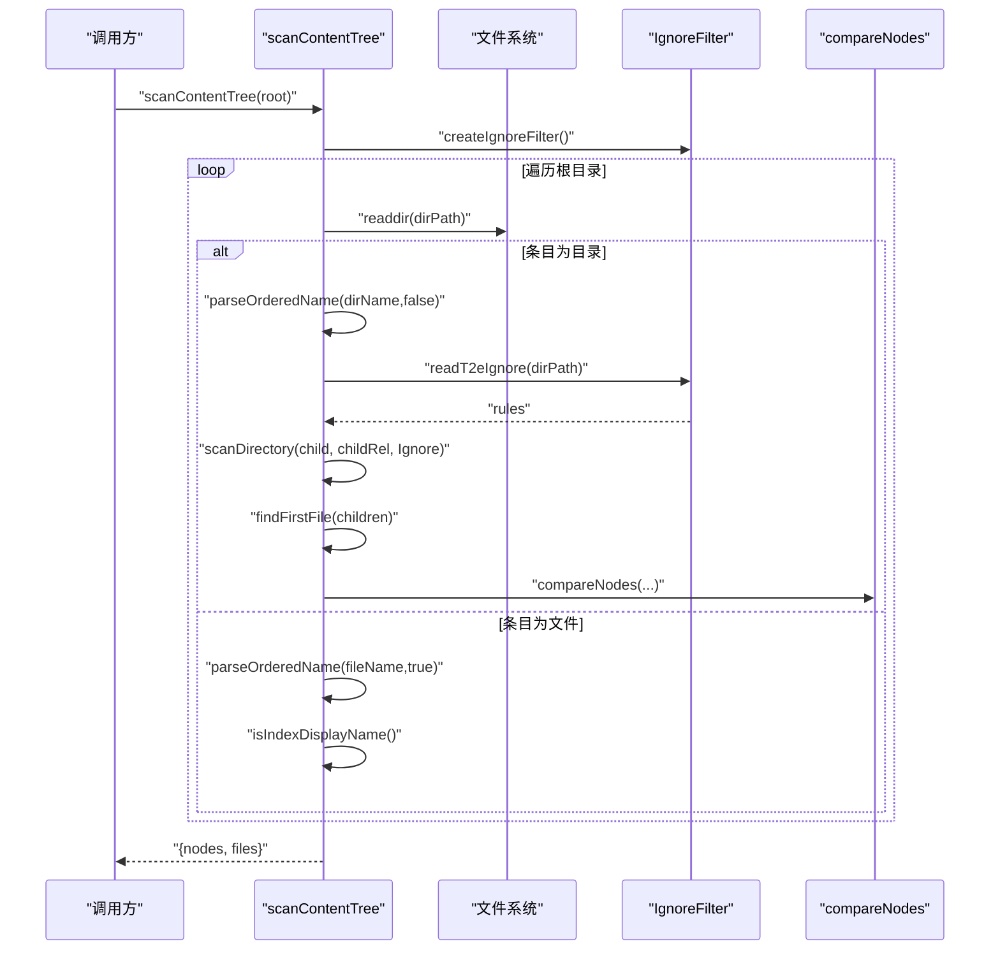
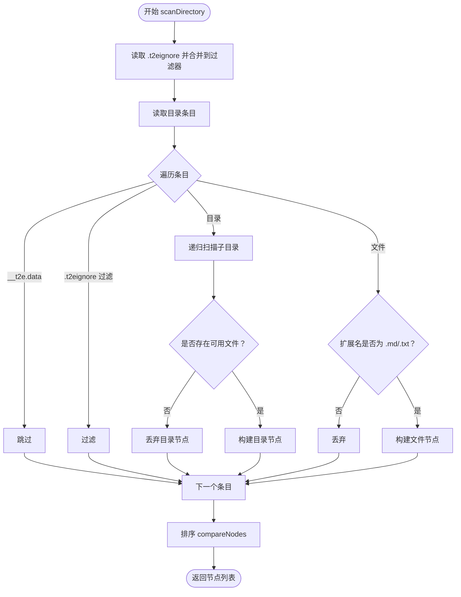
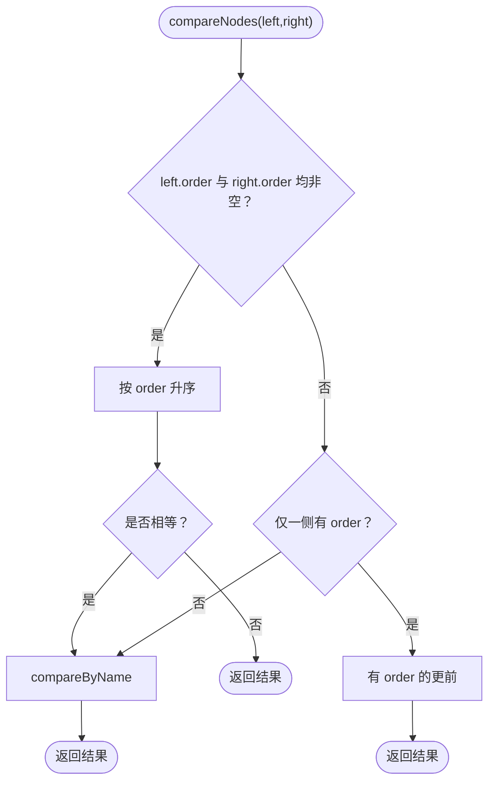
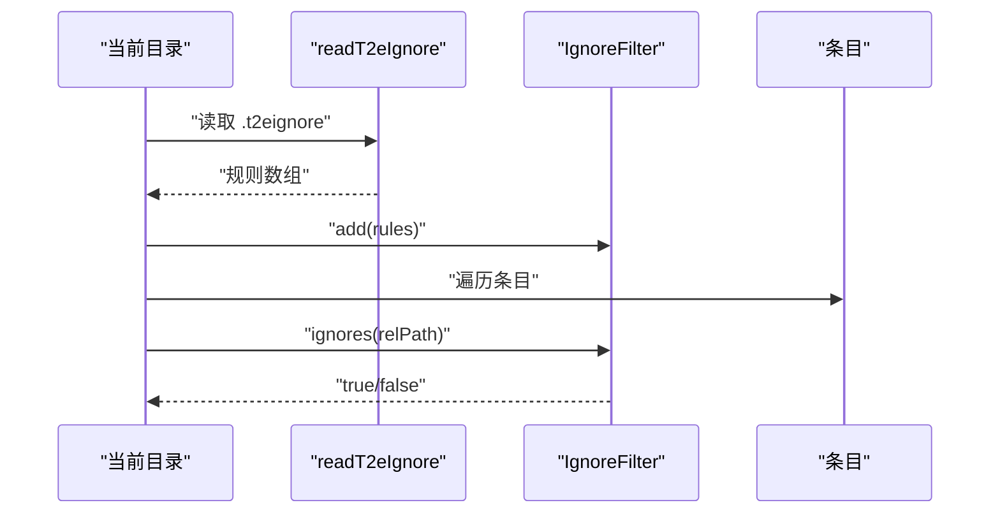
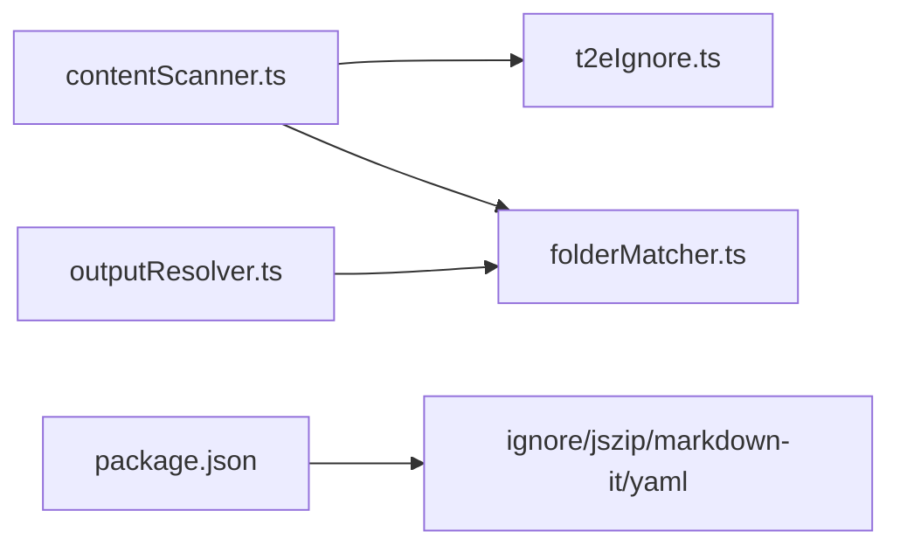
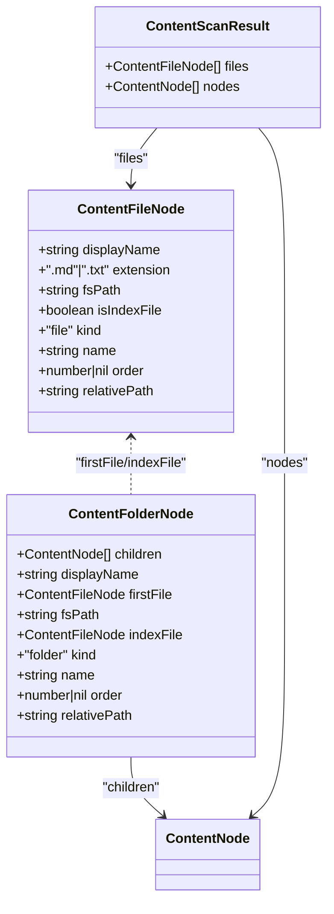

# 内容扫描系统

<cite>
**本文引用的文件**
- [contentScanner.ts](file://src/services/contentScanner.ts)
- [folderMatcher.ts](file://src/services/folderMatcher.ts)
- [t2eIgnore.ts](file://src/services/t2eIgnore.ts)
- [outputResolver.ts](file://src/services/outputResolver.ts)
- [.t2eignore（示例）](file://example/init-folder/.t2eignore)
- [metadata.yml（示例）](file://example/init-folder/__t2e.data/metadata.yml)
- [package.json](file://package.json)
</cite>

## 目录
1. [简介](#简介)
2. [项目结构](#项目结构)
3. [核心组件](#核心组件)
4. [架构总览](#架构总览)
5. [详细组件分析](#详细组件分析)
6. [依赖分析](#依赖分析)
7. [性能考虑](#性能考虑)
8. [故障排查指南](#故障排查指南)
9. [结论](#结论)
10. [附录](#附录)

## 简介
本文件面向内容扫描系统，聚焦于以下能力：
- 目录遍历与递归扫描策略、文件过滤机制、深度控制
- 文件类型识别与命名规则（.md 与 .txt）
- 智能排序算法（数字前缀优先、中文友好自然排序、索引文件优先）
- 路径解析与匹配（folderMatcher 的作用域、路径规范化、相对路径处理）
- 忽略规则（.t2eignore 的解析、通配符匹配、继承规则）
- 性能优化（缓存、并发、内存）

## 项目结构
本项目采用按职责分层的服务模块组织，内容扫描为核心服务之一，配合忽略规则、路径解析与元数据目录常量等协作。

图表来源
- [contentScanner.ts:1-340](file://src/services/contentScanner.ts#L1-L340)
- [t2eIgnore.ts:1-45](file://src/services/t2eIgnore.ts#L1-L45)
- [folderMatcher.ts:1-85](file://src/services/folderMatcher.ts#L1-L85)
- [outputResolver.ts:1-90](file://src/services/outputResolver.ts#L1-L90)

章节来源
- [contentScanner.ts:1-340](file://src/services/contentScanner.ts#L1-L340)
- [t2eIgnore.ts:1-45](file://src/services/t2eIgnore.ts#L1-L45)
- [folderMatcher.ts:1-85](file://src/services/folderMatcher.ts#L1-L85)
- [outputResolver.ts:1-90](file://src/services/outputResolver.ts#L1-L90)

## 核心组件
- 内容扫描器（contentScanner.ts）
  - 负责递归扫描目录、过滤非目标文件、解析数字前缀排序、识别索引文件、生成树与线性文件列表、进行智能排序。
- 忽略规则（t2eIgnore.ts）
  - 负责读取 .t2eignore 并构建 ignore 过滤器，支持规则继承。
- 路径常量与校验（folderMatcher.ts）
  - 定义 __t2e.data 等关键目录/文件名常量，提供路径拼接与存在性检测。
- 输出目录解析（outputResolver.ts）
  - 自上而下查找 __epub.yml 并解析 saveTo，支持 ~ 展开与相对路径解析。

章节来源
- [contentScanner.ts:1-340](file://src/services/contentScanner.ts#L1-L340)
- [t2eIgnore.ts:1-45](file://src/services/t2eIgnore.ts#L1-L45)
- [folderMatcher.ts:1-85](file://src/services/folderMatcher.ts#L1-L85)
- [outputResolver.ts:1-90](file://src/services/outputResolver.ts#L1-L90)

## 架构总览
内容扫描在扫描入口处创建全局忽略过滤器，随后对每个目录：
- 读取 .t2eignore 并合并到过滤器
- 遍历条目，跳过 __t2e.data
- 应用 .t2eignore 过滤
- 对目录：递归扫描子目录，仅当存在可用文件时保留目录节点
- 对文件：仅保留 .md 与 .txt，解析数字前缀与索引标识
- 排序后返回树与线性文件列表

图表来源
- [contentScanner.ts:51-329](file://src/services/contentScanner.ts#L51-L329)

## 详细组件分析

### 目录遍历与递归扫描策略
- 入口函数负责创建全局忽略过滤器并调用递归扫描。
- 递归扫描步骤：
  - 读取当前目录的 .t2eignore 并加入过滤器（规则继承）
  - 遍历目录项，跳过 __t2e.data（最高优先级硬过滤）
  - 应用 .t2eignore 过滤
  - 目录：递归扫描子目录，仅当子树存在可用文件时保留该目录节点
  - 文件：仅保留 .md 与 .txt
  - 解析数字前缀与索引标识，构建节点
  - 对当前层级节点进行排序

图表来源
- [contentScanner.ts:258-329](file://src/services/contentScanner.ts#L258-L329)

章节来源
- [contentScanner.ts:51-329](file://src/services/contentScanner.ts#L51-L329)

### 文件类型识别与命名规则
- 支持扩展名：.md 与 .txt
- 名称解析规则（parseOrderedName）：
  - 读取最前端连续数字，仅当紧随下划线时视为有效排序前缀
  - 特殊处理：形如 __xxx 的名称，视为 displayName=xxx，order=0
  - 否则 displayName=原始名称（去前后空白），order=null
- 索引文件识别（isIndexDisplayName）：
  - 去空白与小写后判断是否为 index

章节来源
- [contentScanner.ts:8-340](file://src/services/contentScanner.ts#L8-L340)

### 智能排序算法
- 比较主逻辑（compareNodes）：
  - 若两侧都有 order：先按 order 升序，再按名称比较
  - 若仅一侧有 order：有 order 的排在前
  - 若两侧都无 order：按名称比较
- 名称比较（compareByName）：
  - 使用 localeCompare，区域 zh-Hans-CN，numeric=true，sensitivity='base'
  - 名称相同时，folder 优先于 file
- 索引文件优先：
  - 目录节点的 firstFile 优先选择当前目录的 index 文件，否则回退到首个文件

图表来源
- [contentScanner.ts:67-105](file://src/services/contentScanner.ts#L67-L105)

章节来源
- [contentScanner.ts:67-105](file://src/services/contentScanner.ts#L67-L105)

### 路径解析与匹配机制
- folderMatcher.ts 提供：
  - 关键目录/文件常量（__t2e.data、metadata.yml、__epub.yml）
  - 目录目标解析（resolveFolderTarget）、路径拼接（getMetadataDirPath/getMetadataFilePath）
  - 存在性检测（exists）、元数据文件存在性检查（hasMetadataFile）
- 内容扫描中：
  - 使用 METADATA_DIRNAME 常量作为最高优先级硬过滤项
  - 相对路径通过 path.join 维护，结合 .t2eignore 的相对路径语义进行过滤

章节来源
- [folderMatcher.ts:1-85](file://src/services/folderMatcher.ts#L1-L85)
- [contentScanner.ts:258-329](file://src/services/contentScanner.ts#L258-L329)

### 忽略规则应用
- .t2eignore 解析：
  - 读取文件内容，按行分割，去空白，过滤空行与以 # 开头的注释行
- 过滤器构建与继承：
  - createIgnoreFilter 支持传入父过滤器，新实例继承父规则
  - 每个目录扫描前读取该目录的 .t2eignore 并 add 到当前过滤器
- 匹配范围：
  - 相对路径基于当前目录计算，与条目名称组合后进行匹配

图表来源
- [t2eIgnore.ts:13-44](file://src/services/t2eIgnore.ts#L13-L44)
- [contentScanner.ts:258-329](file://src/services/contentScanner.ts#L258-L329)

章节来源
- [t2eIgnore.ts:1-45](file://src/services/t2eIgnore.ts#L1-L45)
- [contentScanner.ts:258-329](file://src/services/contentScanner.ts#L258-L329)

### 输出目录解析（与扫描的集成点）
- 自上而下查找 __epub.yml，解析 saveTo
- 支持 ~ 与 ~/... 的用户目录展开
- 若未找到有效配置，回退到当前目录

章节来源
- [outputResolver.ts:1-90](file://src/services/outputResolver.ts#L1-L90)
- [folderMatcher.ts:7-9](file://src/services/folderMatcher.ts#L7-L9)

## 依赖分析
- 外部依赖
  - ignore：提供 .t2eignore 的通配符匹配能力
  - jszip、markdown-it、yaml：用于后续 EPUB 生成与元数据处理（与扫描解耦）
- 内部依赖
  - contentScanner 依赖 t2eIgnore 与 folderMatcher
  - outputResolver 依赖 folderMatcher 的常量与 exists

图表来源
- [contentScanner.ts:1-6](file://src/services/contentScanner.ts#L1-L6)
- [t2eIgnore.ts:1-3](file://src/services/t2eIgnore.ts#L1-L3)
- [folderMatcher.ts:1-9](file://src/services/folderMatcher.ts#L1-L9)
- [package.json:97-101](file://package.json#L97-L101)

章节来源
- [package.json:97-101](file://package.json#L97-L101)
- [contentScanner.ts:1-6](file://src/services/contentScanner.ts#L1-L6)
- [t2eIgnore.ts:1-3](file://src/services/t2eIgnore.ts#L1-L3)
- [folderMatcher.ts:1-9](file://src/services/folderMatcher.ts#L1-L9)

## 性能考虑
- 并发与 I/O
  - 当前实现为串行 readdir 与逐个文件/目录处理，适合中小规模目录
  - 对于大规模目录，建议：
    - 使用 Promise.all 并行处理子目录扫描（需谨慎控制并发度）
    - 对 .t2eignore 的读取与解析可做缓存（见“缓存机制”）
- 缓存机制
  - .t2eignore 内容与 ignore 实例可按目录路径缓存，避免重复读取与重复构建
  - 目录扫描结果可按根路径+时间戳缓存，命中则直接返回
- 内存管理
  - flattenFiles 会递归收集文件，注意大目录树的内存占用
  - 排序阶段使用原地比较，复杂度 O(n log n)，空间取决于语言运行时
- 路径与字符串
  - 相对路径拼接使用 path.join，减少字符串拼接错误
  - 名称解析与 trim 操作为 O(n)，建议在高频场景下复用中间结果

## 故障排查指南
- 常见问题与定位
  - 扫描不到任何文件/目录
    - 检查根目录是否为本地目录（resolveFolderTarget 会抛错）
    - 确认 .t2eignore 是否误将所有条目过滤
    - 确认扩展名为 .md/.txt
  - 目录未显示
    - 仅当子树存在可用文件时才会保留目录节点
  - 排序异常
    - 检查文件/目录名称是否符合数字前缀规则
    - 确认是否期望索引文件优先
  - 忽略规则未生效
    - 确认 .t2eignore 路径为相对路径（相对于当前目录）
    - 确认规则未被父级过滤器覆盖
- 示例参考
  - .t2eignore 示例：[.t2eignore（示例）:1-2](file://example/init-folder/.t2eignore#L1-L2)
  - 元数据目录示例：[__t2e.data/metadata.yml:1-7](file://example/init-folder/__t2e.data/metadata.yml#L1-L7)

章节来源
- [contentScanner.ts:258-329](file://src/services/contentScanner.ts#L258-L329)
- [.t2eignore（示例）:1-2](file://example/init-folder/.t2eignore#L1-L2)
- [metadata.yml（示例）:1-7](file://example/init-folder/__t2e.data/metadata.yml#L1-L7)

## 结论
内容扫描系统通过清晰的递归扫描、严格的文件类型过滤、灵活的命名与索引识别、以及基于 ignore 的规则继承，实现了稳定可靠的内容发现与排序。结合路径常量与输出解析，可无缝衔接后续的 EPUB 生成流程。针对大规模目录，建议引入缓存与并发控制以提升性能。

## 附录

### 数据模型与接口概览

图表来源
- [contentScanner.ts:10-38](file://src/services/contentScanner.ts#L10-L38)