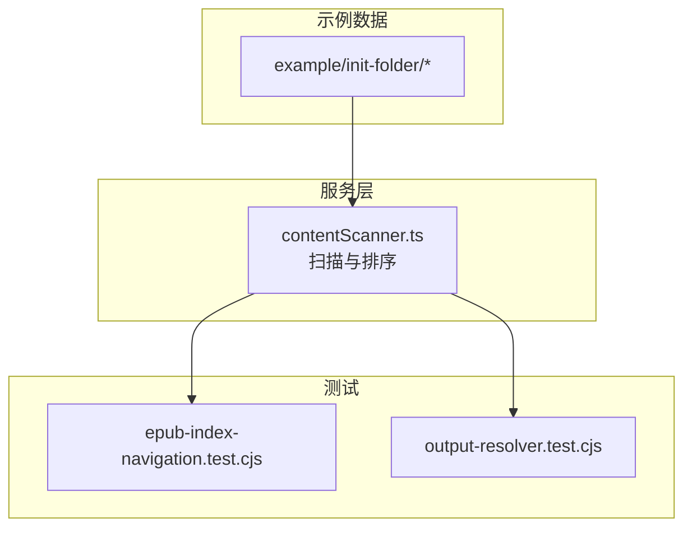
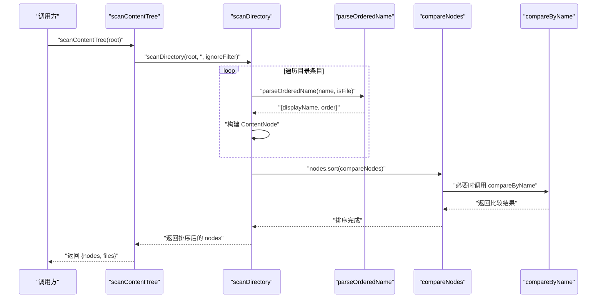
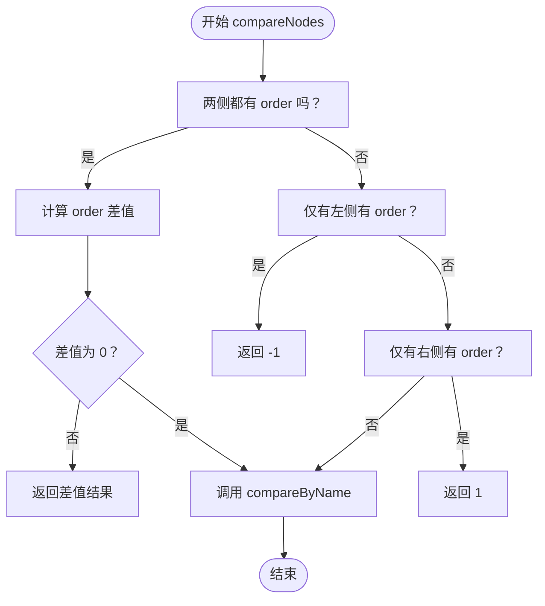
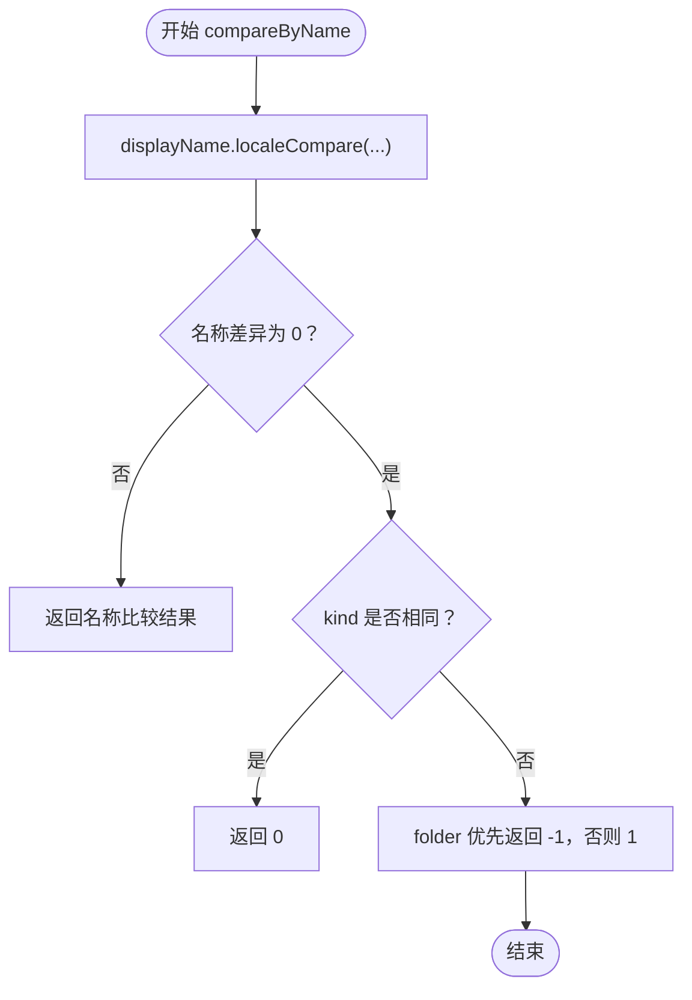
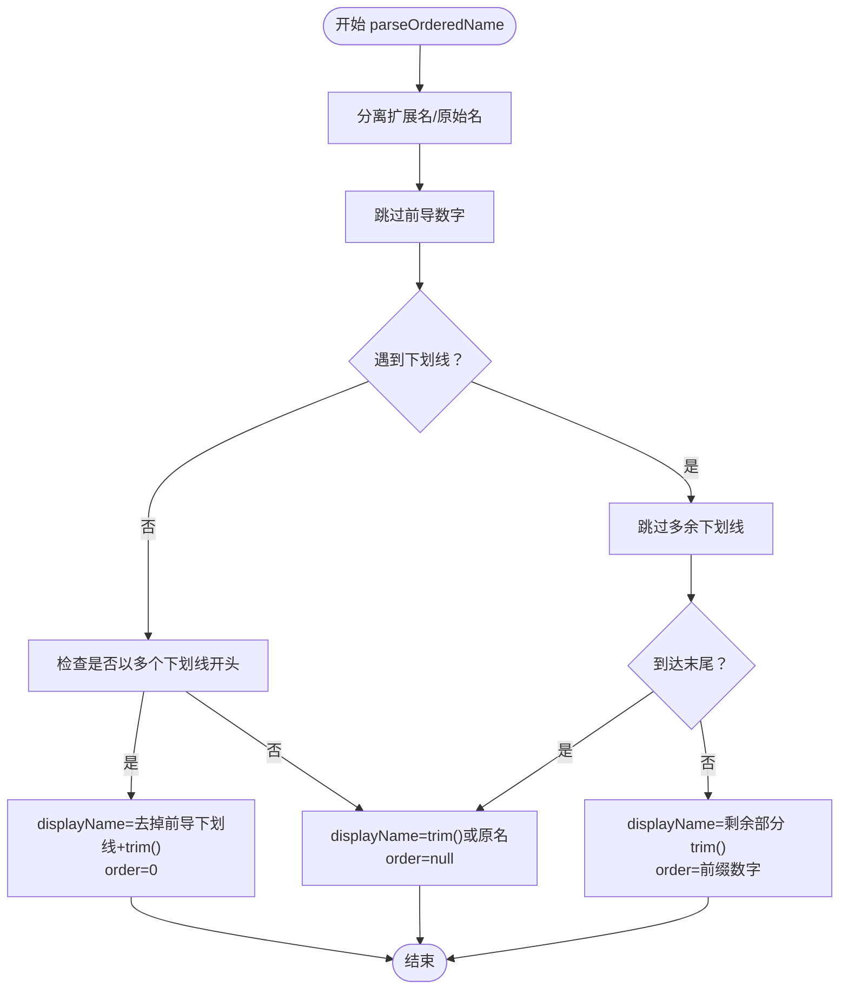
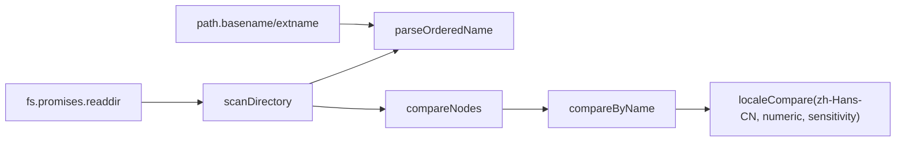

# 排序算法

<cite>
**本文引用的文件**
- [contentScanner.ts](file://src/services/contentScanner.ts)
- [epub-index-navigation.test.cjs](file://test/epub-index-navigation.test.cjs)
- [output-resolver.test.cjs](file://test/output-resolver.test.cjs)
- [init-folder 示例目录结构](file://example/init-folder)
- [00100__章节 1.txt](file://example/init-folder/00100__章节 1.txt)
- [00110__章节 2.md](file://example/init-folder/00110__章节 2.md)
- [00102___子目录 1/00100__章节 11.txt](file://example/init-folder/00102___子目录 1/00100__章节 11.txt)
- [00103___子目录 2/00001_子目录 2-1/000_index.md](file://example/init-folder/00103___子目录 2/00001_子目录 2-1/000_index.md)
- [00103___子目录 2/000_index.txt](file://example/init-folder/00103___子目录 2/000_index.txt)
- [00105___index test/_index.txt](file://example/init-folder/00105___index test/_index.txt)
- [.t2eignore](file://example/init-folder/.t2eignore)
- [__t2e.data/metadata.yml](file://example/init-folder/__t2e.data/metadata.yml)
</cite>

## 目录
1. [简介](#简介)
2. [项目结构](#项目结构)
3. [核心组件](#核心组件)
4. [架构总览](#架构总览)
5. [详细组件分析](#详细组件分析)
6. [依赖关系分析](#依赖关系分析)
7. [性能考量](#性能考量)
8. [故障排查指南](#故障排查指南)
9. [结论](#结论)
10. [附录](#附录)

## 简介
本文件聚焦于内容扫描与排序模块中的排序算法，系统性解析以下关键点：
- compareNodes 复合排序逻辑：数字前缀优先、名称字母序次之、文件夹优先级处理。
- compareByName 中文友好自然排序：localeCompare 的 numeric 与 sensitivity 配置。
- parseOrderedName 数字前缀解析：前缀提取规则、下划线处理、特殊命名模式支持。
- 排序稳定性与性能：相等元素相对顺序、排序复杂度与内存占用。
- 测试数据与排序示例：覆盖多种命名模式的实际排序效果。

## 项目结构
排序算法位于内容扫描服务中，负责从目录树中提取节点并进行稳定排序，以便后续章节线性编号与导航生成。

图表来源
- [contentScanner.ts:51-329](file://src/services/contentScanner.ts#L51-L329)
- [epub-index-navigation.test.cjs:9-72](file://test/epub-index-navigation.test.cjs#L9-L72)

章节来源
- [contentScanner.ts:51-329](file://src/services/contentScanner.ts#L51-L329)

## 核心组件
- ContentNode/ContentFileNode/ContentFolderNode 数据模型：统一描述文件与目录节点，包含排序所需字段（displayName、order、kind）。
- compareNodes：复合排序主函数，优先比较 order，其次按名称排序，最后以文件夹优先。
- compareByName：中文友好自然排序，使用 localeCompare 并设置 numeric 与 sensitivity。
- parseOrderedName：从原始名称解析出 displayName 与 order，支持数字前缀与下划线规则。
- scanDirectory：递归扫描目录，应用过滤规则，构建节点并调用 sort(compareNodes)。

章节来源
- [contentScanner.ts:10-340](file://src/services/contentScanner.ts#L10-L340)

## 架构总览
排序算法在扫描阶段完成，确保输出的节点数组满足“数字前缀优先、名称字母序、文件夹优先”的全局顺序。

图表来源
- [contentScanner.ts:51-329](file://src/services/contentScanner.ts#L51-L329)
- [contentScanner.ts:67-105](file://src/services/contentScanner.ts#L67-L105)
- [contentScanner.ts:191-238](file://src/services/contentScanner.ts#L191-L238)

## 详细组件分析

### compareNodes 复合排序逻辑
- 优先级：当左右节点均具备 order 时，按数值差比较；若相等，则进入名称比较；若仅一侧有 order，则有 order 的优先。
- 名称比较：若 order 相同或均无 order，则调用 compareByName。
- 时间复杂度：O(n log n)，空间复杂度取决于底层排序实现（通常 O(log n) 或 O(n)）。

图表来源
- [contentScanner.ts:67-81](file://src/services/contentScanner.ts#L67-L81)

章节来源
- [contentScanner.ts:67-81](file://src/services/contentScanner.ts#L67-L81)

### compareByName 中文友好排序
- 使用 localeCompare 对 displayName 进行本地化比较，区域设为 zh-Hans-CN。
- numeric: true：使数字片段按数值大小排序，而非字面字符序。
- sensitivity: 'base'：忽略重音、大小写等差异，提升中文语境下的自然排序体验。
- 名称相同时，文件夹优先于文件（folder < file），保证目录在导航中作为“入口”优先出现。

图表来源
- [contentScanner.ts:90-105](file://src/services/contentScanner.ts#L90-L105)

章节来源
- [contentScanner.ts:90-105](file://src/services/contentScanner.ts#L90-L105)

### parseOrderedName 数字前缀解析
- 输入：原始名称（文件或目录），区分文件扩展名。
- 解析步骤：
  - 跳过前导数字，仅当紧随下划线时，该数字序列才被视为有效排序前缀。
  - 若名称以多个连续下划线开头（例如 __index），则视为 displayName 为去掉前导下划线的部分，order 设为 0。
  - 否则：displayName 为去空白后的原始名称，order 设为 null。
  - 若存在有效前缀，displayName 为下划线后剩余部分（跳过多余下划线），order 为前缀数字。
- 输出：{ displayName, order }。

图表来源
- [contentScanner.ts:191-238](file://src/services/contentScanner.ts#L191-L238)

章节来源
- [contentScanner.ts:191-238](file://src/services/contentScanner.ts#L191-L238)

### 排序稳定性与性能
- 稳定性：JavaScript 数组 sort 的稳定性由实现决定。在 V8 引擎中，Array.prototype.sort 为稳定排序。因此，当两个节点在 compareNodes 中判定相等（例如 order 相同且名称相同）时，它们的相对顺序会被保持。
- 性能：
  - 时间复杂度：O(n log n)，其中 n 为节点总数。
  - 空间复杂度：取决于底层排序实现，通常为 O(log n) 到 O(n)。
  - 内存使用：主要消耗在节点对象数组与字符串（displayName、name、路径）上。通过复用 displayName 与 order 字段，避免重复计算。
- 优化建议：
  - 预先计算 displayName 与 order，减少 compareByName 中的重复解析。
  - 对超大目录树，考虑分批处理或延迟排序策略（当前实现为一次性排序）。

章节来源
- [contentScanner.ts:67-105](file://src/services/contentScanner.ts#L67-L105)
- [contentScanner.ts:191-238](file://src/services/contentScanner.ts#L191-L238)

### 测试数据与排序示例
以下示例基于示例目录中的实际文件与命名模式，展示排序效果：

- 示例一：基础章节排序
  - 目录：example/init-folder
  - 文件：
    - 00100__章节 1.txt
    - 00110__章节 2.md
  - 解析与排序：
    - 两者均具有有效前缀，按 order 升序排列；若 order 相同则按名称排序；名称相同时文件夹优先。
  - 预期顺序：00100__章节 1.txt → 00110__章节 2.md

- 示例二：子目录与子目录内 index
  - 目录：00103___子目录 2/00001_子目录 2-1
  - 文件：
    - 000_index.md（子目录内 index）
    - 001200_news.md
  - 解析与排序：
    - 子目录内 index 的 displayName 经过解析后为 index，order 为 0。
    - 该子目录将优先选择 index 作为“目录目标文件”，并在导航中以目录名显示，不单独列出 index 文本。
  - 预期行为：导航中出现“子目录 2-1”链接，点击后首章为 index 内容。

- 示例三：多级目录与 index 回退
  - 目录：00103___子目录 2
  - 文件：
    - 000_index.txt
    - 00100__章节 21.txt
    - 00110__章节 22.md
  - 解析与排序：
    - 上层目录未直接包含 index，但其子目录包含 index，因此目录的 firstFile 将回退到子目录的 index。
  - 预期行为：导航中出现“正文”“卷一”等目录项，点击后首章为对应 index 内容。

- 示例四：忽略文件与元数据目录
  - 文件：.t2eignore
    - 内容：00200_忽略文件.md
  - 目录：__t2e.data
    - 内容：metadata.yml
  - 行为：
    - .t2eignore 会过滤掉指定文件；__t2e.data 为最高优先级硬过滤，不受 .t2eignore 影响。
  - 结果：被忽略的文件不会出现在最终 nodes 中，__t2e.data 不参与排序。

章节来源
- [epub-index-navigation.test.cjs:74-139](file://test/epub-index-navigation.test.cjs#L74-L139)
- [00100__章节 1.txt:1-9](file://example/init-folder/00100__章节 1.txt#L1-L9)
- [00110__章节 2.md:1-9](file://example/init-folder/00110__章节 2.md#L1-L9)
- [00103___子目录 2/00001_子目录 2-1/000_index.md](file://example/init-folder/00103___子目录 2/00001_子目录 2-1/000_index.md)
- [00103___子目录 2/000_index.txt](file://example/init-folder/00103___子目录 2/000_index.txt)
- [.t2eignore:1-2](file://example/init-folder/.t2eignore#L1-L2)
- [__t2e.data/metadata.yml:1-7](file://example/init-folder/__t2e.data/metadata.yml#L1-L7)

## 依赖关系分析
排序算法依赖于以下模块与工具：
- Node.js path 模块：用于分离扩展名与基础名。
- Node.js fs.promises：读取目录与文件，构建节点。
- 忽略过滤器：根据 .t2eignore 与内置规则过滤条目。
- 本地化排序：使用 localeCompare 的 zh-Hans-CN 区域与 numeric/sensitivity 配置。

图表来源
- [contentScanner.ts:258-329](file://src/services/contentScanner.ts#L258-L329)
- [contentScanner.ts:191-238](file://src/services/contentScanner.ts#L191-L238)
- [contentScanner.ts:67-105](file://src/services/contentScanner.ts#L67-L105)
- [contentScanner.ts:90-105](file://src/services/contentScanner.ts#L90-L105)

章节来源
- [contentScanner.ts:258-329](file://src/services/contentScanner.ts#L258-L329)

## 性能考量
- 复杂度：整体为 O(n log n)，其中 n 为有效节点数。
- I/O：扫描阶段涉及多次 readdir 调用，建议在大型仓库中避免频繁小文件操作。
- 内存：节点对象数组与字符串副本占用内存，可通过复用字符串与延迟加载策略优化。
- 稳定性：V8 引擎下 sort 为稳定排序，保证相等元素的相对顺序不变。

## 故障排查指南
- 名称排序不符合预期：
  - 检查 displayName 是否正确解析（确认是否以多个下划线开头被识别为 order=0）。
  - 确认 compareByName 的 numeric 与 sensitivity 设置是否符合需求。
- 数字前缀未生效：
  - 确认前缀后紧随下划线；仅前导数字不跟下划线时不作为排序前缀。
  - 检查是否被 .t2eignore 或 __t2e.data 过滤。
- 目录未显示或链接错误：
  - 确认目录下是否存在可用文件；空目录不会进入结果。
  - 检查 index 文件是否被正确识别（index 命名模式）。

章节来源
- [contentScanner.ts:258-329](file://src/services/contentScanner.ts#L258-L329)
- [contentScanner.ts:191-238](file://src/services/contentScanner.ts#L191-L238)
- [contentScanner.ts:90-105](file://src/services/contentScanner.ts#L90-L105)

## 结论
该排序算法通过“数字前缀优先、名称字母序次之、文件夹优先”的复合规则，结合中文友好自然排序与稳定的排序实现，确保了目录树在生成 EPUB 导航与章节编号时的可预测性与一致性。parseOrderedName 的解析逻辑覆盖了常见命名模式，并对特殊命名提供了明确的行为定义。配合 .t2eignore 与 __t2e.data 的过滤机制，最终输出的节点数组能够准确反映用户的预期顺序。

## 附录
- 相关接口与类型定义：
  - ContentNode/ContentFileNode/ContentFolderNode：统一节点模型。
  - ParsedName：解析结果，包含 displayName 与 order。
- 关键函数路径：
  - [compareNodes:67-81](file://src/services/contentScanner.ts#L67-L81)
  - [compareByName:90-105](file://src/services/contentScanner.ts#L90-L105)
  - [parseOrderedName:191-238](file://src/services/contentScanner.ts#L191-L238)
  - [scanDirectory:258-329](file://src/services/contentScanner.ts#L258-L329)