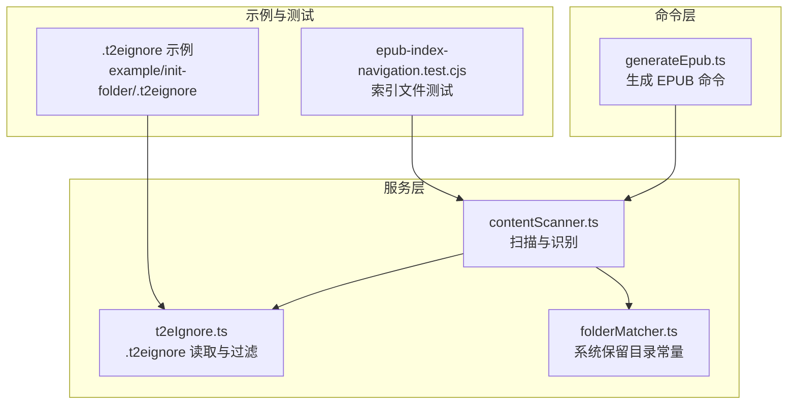
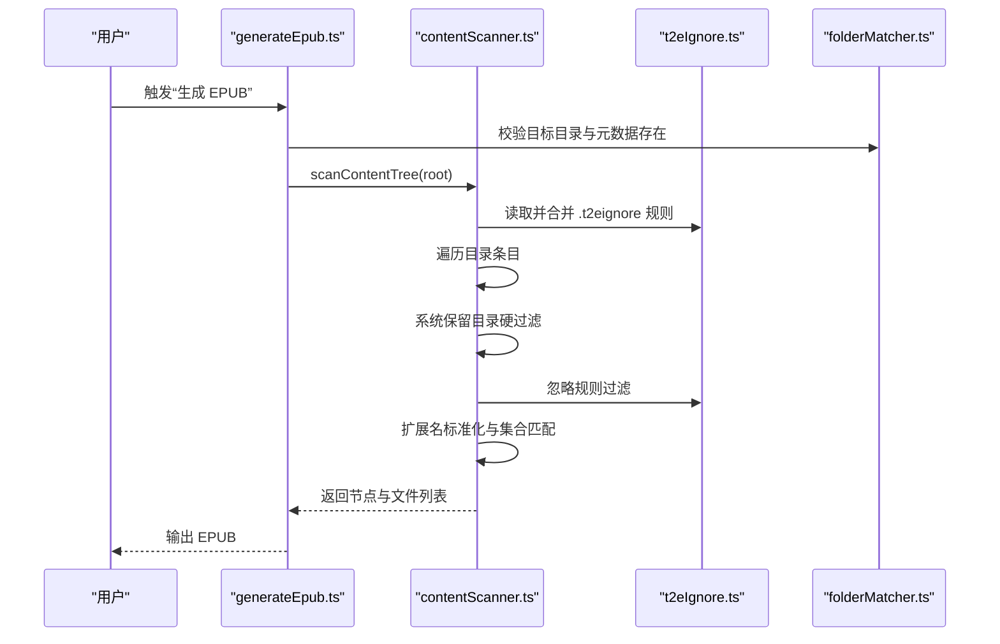
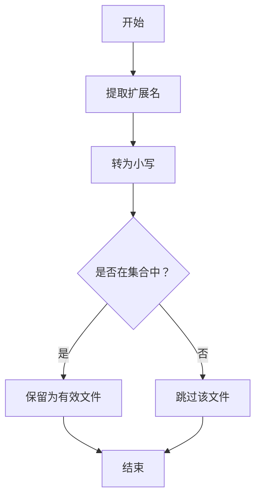
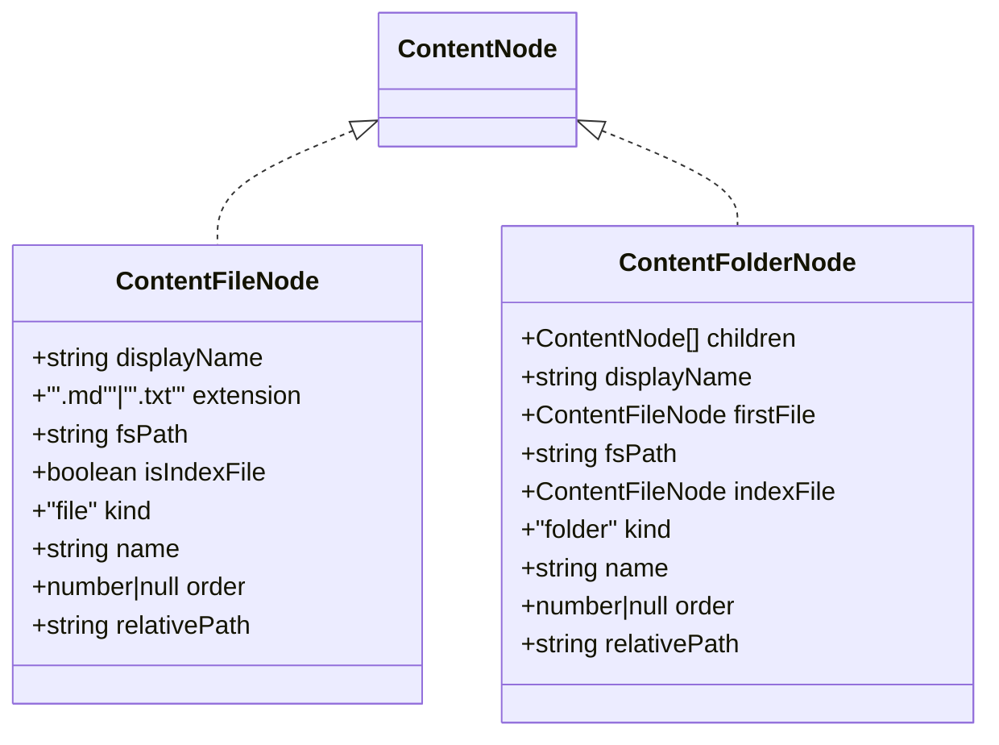
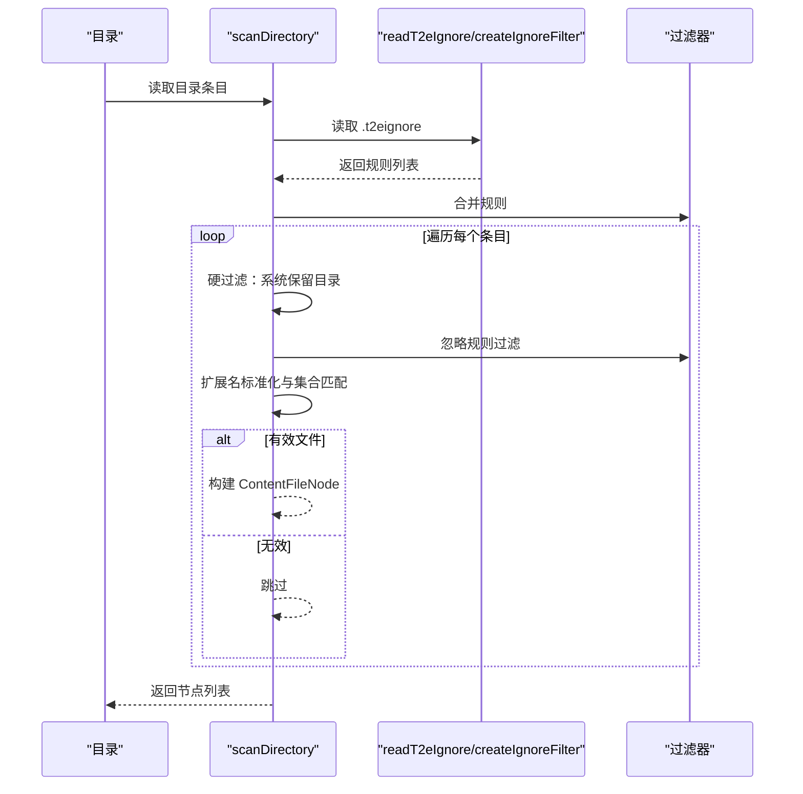
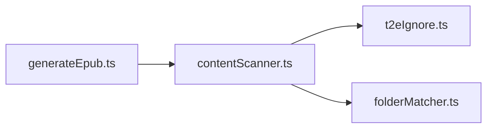

# 文件类型识别

<cite>
**本文档引用的文件**
- [src/services/contentScanner.ts](file://src/services/contentScanner.ts)
- [src/services/t2eIgnore.ts](file://src/services/t2eIgnore.ts)
- [src/services/folderMatcher.ts](file://src/services/folderMatcher.ts)
- [src/commands/generateEpub.ts](file://src/commands/generateEpub.ts)
- [README.md](file://README.md)
- [example/init-folder/00102___子目录 1/0000_index.md](file://example/init-folder/00102___子目录 1/0000_index.md)
- [example/init-folder/00102___子目录 1/00100__章节 11.txt](file://example/init-folder/00102___子目录 1/00100__章节 11.txt)
- [example/init-folder/.t2eignore](file://example/init-folder/.t2eignore)
- [test/epub-index-navigation.test.cjs](file://test/epub-index-navigation.test.cjs)
</cite>

## 目录
1. [简介](#简介)
2. [项目结构](#项目结构)
3. [核心组件](#核心组件)
4. [架构总览](#架构总览)
5. [详细组件分析](#详细组件分析)
6. [依赖关系分析](#依赖关系分析)
7. [性能考量](#性能考量)
8. [故障排查指南](#故障排查指南)
9. [结论](#结论)
10. [附录](#附录)

## 简介
本文件聚焦“文件类型识别机制”，围绕以下目标展开：
- 支持的文件扩展名集合与识别规则（.md 与 .txt）
- 大小写不敏感处理与扩展名标准化
- 文件过滤实现逻辑（扩展名检查、文件类型验证、无效文件跳过）
- 特殊文件处理策略（隐藏文件识别、系统文件过滤、权限检查）
- 性能优化（正则表达式优化、Set 查找效率、内存使用）
- 测试用例与边界情况处理示例

## 项目结构
与文件类型识别直接相关的模块与文件如下：
- 扫描与识别核心：src/services/contentScanner.ts
- 忽略规则与过滤：src/services/t2eIgnore.ts
- 目录匹配与系统保留目录：src/services/folderMatcher.ts
- 命令入口与流程编排：src/commands/generateEpub.ts
- 示例与测试：example/ 与 test/ 目录

图表来源
- [src/services/contentScanner.ts:51-329](file://src/services/contentScanner.ts#L51-L329)
- [src/services/t2eIgnore.ts:13-44](file://src/services/t2eIgnore.ts#L13-L44)
- [src/services/folderMatcher.ts:7-48](file://src/services/folderMatcher.ts#L7-L48)
- [src/commands/generateEpub.ts:18-65](file://src/commands/generateEpub.ts#L18-L65)
- [example/init-folder/.t2eignore:1-2](file://example/init-folder/.t2eignore#L1-L2)
- [test/epub-index-navigation.test.cjs:74-139](file://test/epub-index-navigation.test.cjs#L74-L139)

章节来源
- [src/services/contentScanner.ts:51-329](file://src/services/contentScanner.ts#L51-L329)
- [src/services/t2eIgnore.ts:13-44](file://src/services/t2eIgnore.ts#L13-L44)
- [src/services/folderMatcher.ts:7-48](file://src/services/folderMatcher.ts#L7-L48)
- [src/commands/generateEpub.ts:18-65](file://src/commands/generateEpub.ts#L18-L65)

## 核心组件
- 支持的扩展名集合：通过常量集合限定，仅允许 .md 与 .txt。
- 扩展名标准化：读取扩展名后统一转为小写，再进行集合匹配。
- 过滤链路：系统保留目录优先过滤（硬规则）、.t2eignore 规则过滤、扩展名白名单过滤。
- 索引文件识别：对去前缀展示名进行大小写不敏感判断，识别 index 文件。

章节来源
- [src/services/contentScanner.ts:8](file://src/services/contentScanner.ts#L8)
- [src/services/contentScanner.ts:310-313](file://src/services/contentScanner.ts#L310-L313)
- [src/services/contentScanner.ts:246-248](file://src/services/contentScanner.ts#L246-L248)
- [src/services/folderMatcher.ts:7](file://src/services/folderMatcher.ts#L7)
- [src/services/t2eIgnore.ts:13-26](file://src/services/t2eIgnore.ts#L13-L26)

## 架构总览
文件类型识别在“生成 EPUB”命令流程中的位置如下：

图表来源
- [src/commands/generateEpub.ts:19-57](file://src/commands/generateEpub.ts#L19-L57)
- [src/services/contentScanner.ts:51-329](file://src/services/contentScanner.ts#L51-L329)
- [src/services/t2eIgnore.ts:13-44](file://src/services/t2eIgnore.ts#L13-L44)
- [src/services/folderMatcher.ts:23-38](file://src/services/folderMatcher.ts#L23-L38)

## 详细组件分析

### 支持的扩展名集合与识别规则
- 支持集合：Set 包含 .md 与 .txt。
- 识别步骤：
  1) 读取文件扩展名；
  2) 转为小写；
  3) 在集合中查找；
  4) 不在集合内的文件被跳过。

图表来源
- [src/services/contentScanner.ts:310-313](file://src/services/contentScanner.ts#L310-L313)
- [src/services/contentScanner.ts:8](file://src/services/contentScanner.ts#L8)

章节来源
- [src/services/contentScanner.ts:8](file://src/services/contentScanner.ts#L8)
- [src/services/contentScanner.ts:310-313](file://src/services/contentScanner.ts#L310-L313)

### 大小写不敏感处理与扩展名标准化
- 扩展名标准化：读取扩展名后统一转为小写，确保 .MD、.Txt 等也能被正确识别。
- 索引文件识别：对展示名进行大小写不敏感比较，识别 index 文件。

章节来源
- [src/services/contentScanner.ts:310](file://src/services/contentScanner.ts#L310)
- [src/services/contentScanner.ts:246-248](file://src/services/contentScanner.ts#L246-L248)

### 文件过滤实现逻辑
- 系统保留目录硬过滤：遇到系统保留目录名时，直接跳过，不受 .t2eignore 影响。
- .t2eignore 规则过滤：读取当前目录的 .t2eignore 文件，合并到过滤器，按规则跳过匹配项。
- 扩展名白名单过滤：仅保留 .md 与 .txt 文件，其余跳过。
- 无效文件跳过：非文件条目（如符号链接、设备等）会被忽略。

章节来源
- [src/services/contentScanner.ts:272-280](file://src/services/contentScanner.ts#L272-L280)
- [src/services/contentScanner.ts:277-280](file://src/services/contentScanner.ts#L277-L280)
- [src/services/contentScanner.ts:310-313](file://src/services/contentScanner.ts#L310-L313)
- [src/services/folderMatcher.ts:7](file://src/services/folderMatcher.ts#L7)
- [src/services/t2eIgnore.ts:13-26](file://src/services/t2eIgnore.ts#L13-L26)

### 特殊文件处理策略
- 隐藏文件识别：.t2eignore 文件名以点开头，属于隐藏文件，但其语义是“忽略规则文件”，并非内容文件。
- 系统文件过滤：系统保留目录（如示例中的 __t2e.data）在扫描阶段被硬过滤，避免被误识别为内容。
- 权限检查：代码通过异步读取目录条目与文件属性进行过滤，未显式进行权限校验；若无权限读取，条目将被跳过。

章节来源
- [src/services/folderMatcher.ts:7](file://src/services/folderMatcher.ts#L7)
- [src/services/contentScanner.ts:272-275](file://src/services/contentScanner.ts#L272-L275)
- [src/services/t2eIgnore.ts:5](file://src/services/t2eIgnore.ts#L5)

### 索引文件识别与优先级
- 索引文件识别：当展示名经去前缀处理后为 index（大小写不敏感）时，标记为索引文件。
- 目录优先跳转：若目录下存在索引文件，则该目录优先跳转至该文件，且该文件不再作为独立目录项展示。
- 回退规则：若当前目录无直接索引文件，则回退到子目录中首个索引文件（深度优先）。

章节来源
- [src/services/contentScanner.ts:246-248](file://src/services/contentScanner.ts#L246-L248)
- [src/services/contentScanner.ts:113-141](file://src/services/contentScanner.ts#L113-L141)
- [src/services/contentScanner.ts:149-161](file://src/services/contentScanner.ts#L149-L161)

### 类型安全与数据模型
- ContentFileNode：包含扩展名类型约束（'.md' | '.txt'），确保类型安全。
- ContentNode：联合类型，区分文件与目录节点，便于后续排序与导航生成。

图表来源
- [src/services/contentScanner.ts:10-33](file://src/services/contentScanner.ts#L10-L33)

章节来源
- [src/services/contentScanner.ts:10-33](file://src/services/contentScanner.ts#L10-L33)

### 关键流程时序图：扫描与过滤

图表来源
- [src/services/contentScanner.ts:258-329](file://src/services/contentScanner.ts#L258-L329)
- [src/services/t2eIgnore.ts:13-44](file://src/services/t2eIgnore.ts#L13-L44)
- [src/services/folderMatcher.ts:7](file://src/services/folderMatcher.ts#L7)

## 依赖关系分析
- contentScanner.ts 依赖：
  - t2eIgnore.ts：读取 .t2eignore 并创建过滤器
  - folderMatcher.ts：系统保留目录常量
  - Node FS：读取目录与文件
- generateEpub.ts 依赖：
  - contentScanner.ts：扫描内容树
  - folderMatcher.ts：校验元数据存在

图表来源
- [src/commands/generateEpub.ts:5-11](file://src/commands/generateEpub.ts#L5-L11)
- [src/services/contentScanner.ts:1-6](file://src/services/contentScanner.ts#L1-L6)
- [src/services/t2eIgnore.ts:1-3](file://src/services/t2eIgnore.ts#L1-L3)
- [src/services/folderMatcher.ts:1-5](file://src/services/folderMatcher.ts#L1-L5)

章节来源
- [src/commands/generateEpub.ts:5-11](file://src/commands/generateEpub.ts#L5-L11)
- [src/services/contentScanner.ts:1-6](file://src/services/contentScanner.ts#L1-L6)

## 性能考量
- 正则表达式优化：当前未使用正则表达式进行扩展名匹配，避免了正则编译与回溯成本。
- Set 查找效率：扩展名集合采用 Set，查找为 O(1)，时间复杂度低，适合高频调用场景。
- 内存使用：
  - 递归扫描目录时，节点树在内存中累积，目录层级深且文件数量大时需关注内存峰值。
  - 拍平文件列表用于线性编号，空间复杂度与文件数线性相关。
- I/O 优化：
  - 一次性读取目录条目，减少多次系统调用。
  - .t2eignore 规则按目录粒度读取并合并，避免全局规则带来的匹配开销。

章节来源
- [src/services/contentScanner.ts:8](file://src/services/contentScanner.ts#L8)
- [src/services/contentScanner.ts:258-329](file://src/services/contentScanner.ts#L258-L329)
- [src/services/t2eIgnore.ts:13-26](file://src/services/t2eIgnore.ts#L13-L26)

## 故障排查指南
- 无内容文件可生成 EPUB
  - 现象：扫描结果文件列表为空。
  - 可能原因：目录中不含 .md/.txt 文件；所有文件被 .t2eignore 过滤；系统保留目录被硬过滤导致目录为空。
  - 处理建议：确认目录包含 .md/.txt；检查 .t2eignore 规则；确认未误删内容文件。
  - 参考测试：[test/epub-index-navigation.test.cjs:41-43](file://test/epub-index-navigation.test.cjs#L41-L43)

- 索引文件未生效
  - 现象：子目录未优先跳转到 index 文件。
  - 可能原因：展示名大小写不匹配；数字前缀格式不符合预期；index 文件未被识别。
  - 处理建议：确保展示名为 index（大小写不敏感）；检查数字前缀与下划线格式；确认扩展名为 .md/.txt。
  - 参考示例：[example/init-folder/00102___子目录 1/0000_index.md:1-4](file://example/init-folder/00102___子目录 1/0000_index.md#L1-L4)

- 系统保留目录被过滤
  - 现象：__t2e.data 目录下的文件未被识别。
  - 可能原因：系统保留目录硬过滤。
  - 处理建议：将元数据文件放置在 __t2e.data 下，但不要将其作为内容文件参与识别。
  - 参考常量：[src/services/folderMatcher.ts:7](file://src/services/folderMatcher.ts#L7)

- 忽略规则未生效
  - 现象：某些文件未被过滤。
  - 可能原因：.t2eignore 语法错误或路径不匹配；规则被上层目录覆盖。
  - 处理建议：检查 .t2eignore 文件格式；确认路径为相对路径；验证规则合并顺序。
  - 参考示例：[example/init-folder/.t2eignore:1-2](file://example/init-folder/.t2eignore#L1-L2)

章节来源
- [test/epub-index-navigation.test.cjs:41-43](file://test/epub-index-navigation.test.cjs#L41-L43)
- [example/init-folder/00102___子目录 1/0000_index.md:1-4](file://example/init-folder/00102___子目录 1/0000_index.md#L1-L4)
- [src/services/folderMatcher.ts:7](file://src/services/folderMatcher.ts#L7)
- [example/init-folder/.t2eignore:1-2](file://example/init-folder/.t2eignore#L1-L2)

## 结论
本机制通过“系统保留目录硬过滤 + .t2eignore 规则过滤 + 扩展名白名单匹配”的三层过滤链路，实现了稳定、可预期的文件类型识别。扩展名标准化与 Set 查找保证了大小写不敏感与高效匹配；索引文件识别进一步提升了目录导航体验。整体设计简洁、性能友好，适合在 VS Code 扩展环境中大规模使用。

## 附录

### 测试用例与边界情况
- 子目录存在 index 文件时，目录优先链接该文件且不展示独立目录项
  - 断言要点：目录 firstFile 与 indexFile 均为 index；导航中不出现 index 文本；首章不重复 h1。
  - 参考测试：[test/epub-index-navigation.test.cjs:74-94](file://test/epub-index-navigation.test.cjs#L74-L94)

- 子目录不存在 index 文件时，保持原有首文件跳转规则
  - 断言要点：目录 firstFile 为首个文件；导航包含各章节。
  - 参考测试：[test/epub-index-navigation.test.cjs:96-114](file://test/epub-index-navigation.test.cjs#L96-L114)

- 上层目录没有直接 index 时，可回退到更深层子目录中的 index 文件
  - 断言要点：目录 firstFile 回退到深层 index 文件；导航中不出现 index 文本。
  - 参考测试：[test/epub-index-navigation.test.cjs:116-139](file://test/epub-index-navigation.test.cjs#L116-L139)

- 示例目录中的 .t2eignore 与内容文件
  - .t2eignore：用于演示忽略规则。
  - 内容文件：.md/.txt 示例文件。
  - 参考示例：
    - [example/init-folder/.t2eignore:1-2](file://example/init-folder/.t2eignore#L1-L2)
    - [example/init-folder/00102___子目录 1/0000_index.md:1-4](file://example/init-folder/00102___子目录 1/0000_index.md#L1-L4)
    - [example/init-folder/00102___子目录 1/00100__章节 11.txt:1-9](file://example/init-folder/00102___子目录 1/00100__章节 11.txt#L1-L9)

章节来源
- [test/epub-index-navigation.test.cjs:74-139](file://test/epub-index-navigation.test.cjs#L74-L139)
- [example/init-folder/.t2eignore:1-2](file://example/init-folder/.t2eignore#L1-L2)
- [example/init-folder/00102___子目录 1/0000_index.md:1-4](file://example/init-folder/00102___子目录 1/0000_index.md#L1-L4)
- [example/init-folder/00102___子目录 1/00100__章节 11.txt:1-9](file://example/init-folder/00102___子目录 1/00100__章节 11.txt#L1-L9)