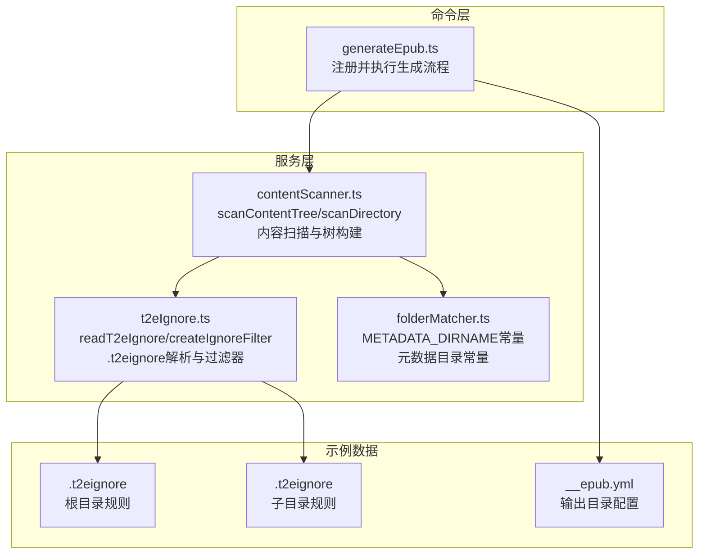
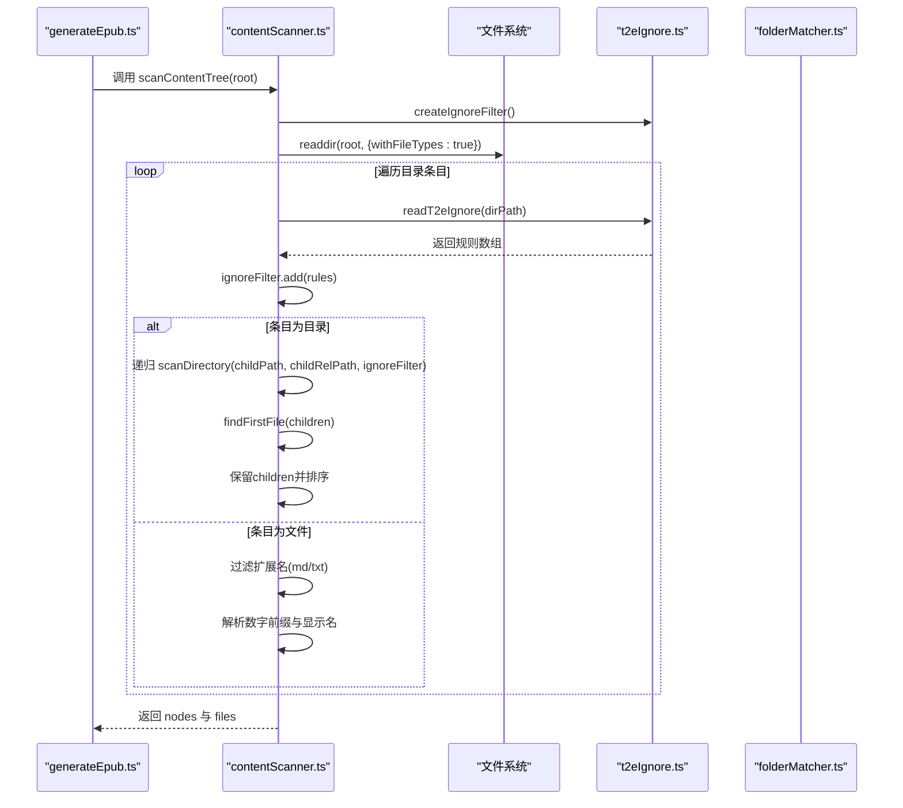
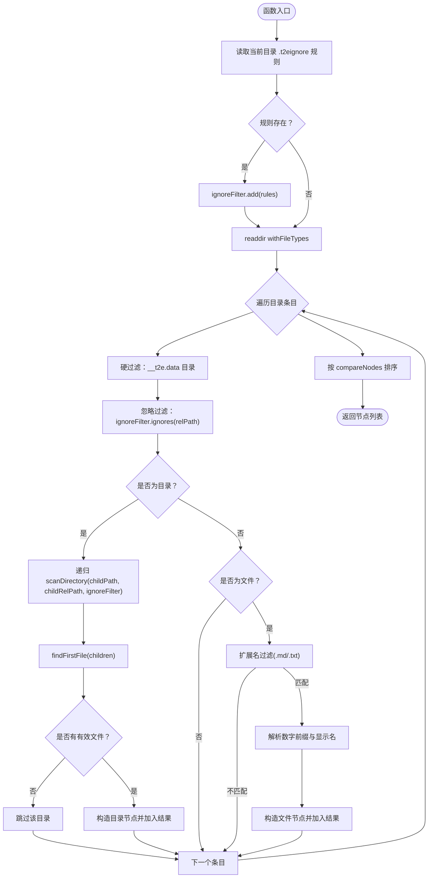
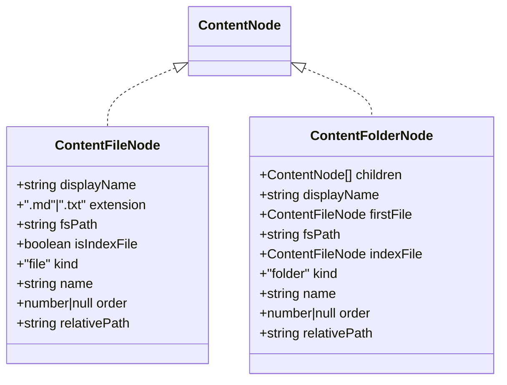
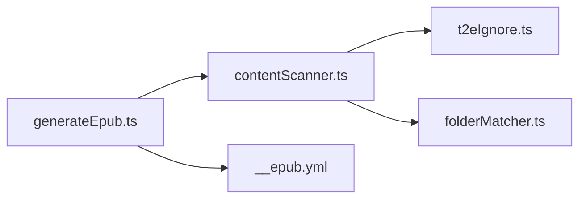
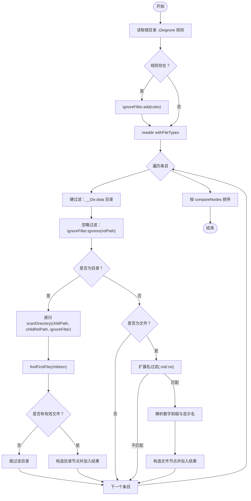

# 目录遍历算法

<cite>
**本文档引用的文件**
- [contentScanner.ts](file://src/services/contentScanner.ts)
- [t2eIgnore.ts](file://src/services/t2eIgnore.ts)
- [folderMatcher.ts](file://src/services/folderMatcher.ts)
- [generateEpub.ts](file://src/commands/generateEpub.ts)
- [.t2eignore](file://example/init-folder/.t2eignore)
- [.t2eignore](file://example/init-folder/00102___子目录 1/.t2eignore)
- [__epub.yml](file://example/__epub.yml)
</cite>

## 目录
1. [简介](#简介)
2. [项目结构](#项目结构)
3. [核心组件](#核心组件)
4. [架构总览](#架构总览)
5. [详细组件分析](#详细组件分析)
6. [依赖关系分析](#依赖关系分析)
7. [性能考量](#性能考量)
8. [故障排查指南](#故障排查指南)
9. [结论](#结论)
10. [附录](#附录)

## 简介
本文件聚焦于目录遍历算法的技术细节，围绕 scanDirectory 函数的递归实现进行深入剖析，涵盖目录读取策略、文件条目处理、路径拼接机制、忽略规则应用流程（含 .t2eignore 动态加载、规则合并策略、过滤器链式调用）、空目录处理逻辑（目录有效性判断、子目录递归扫描、目录保留条件）、性能优化策略（异步 I/O、内存管理、错误处理）以及算法流程图与执行示例，帮助读者全面理解该算法在实际工程中的工作原理与边界条件。

## 项目结构
该项目为 VS Code 扩展，核心功能围绕“将本地目录转换为 EPUB”展开。与目录遍历直接相关的核心文件位于 src/services 目录，命令入口位于 src/commands 目录，示例数据位于 example 目录。下图展示了与目录遍历算法相关的模块关系与职责划分。

图表来源
- [generateEpub.ts:18-66](file://src/commands/generateEpub.ts#L18-L66)
- [contentScanner.ts:51-329](file://src/services/contentScanner.ts#L51-L329)
- [t2eIgnore.ts:13-44](file://src/services/t2eIgnore.ts#L13-L44)
- [folderMatcher.ts:7](file://src/services/folderMatcher.ts#L7)

章节来源
- [generateEpub.ts:18-66](file://src/commands/generateEpub.ts#L18-L66)
- [contentScanner.ts:51-329](file://src/services/contentScanner.ts#L51-L329)
- [t2eIgnore.ts:13-44](file://src/services/t2eIgnore.ts#L13-L44)
- [folderMatcher.ts:7](file://src/services/folderMatcher.ts#L7)

## 核心组件
- 内容扫描入口：scanContentTree，负责启动递归扫描并产出树状节点与线性文件列表。
- 递归扫描核心：scanDirectory，实现目录读取、规则合并、条目过滤、子目录递归与排序。
- 忽略规则引擎：readT2eIgnore 与 createIgnoreFilter，分别负责 .t2eignore 文件读取与 ignore 过滤器实例化与合并。
- 目录匹配工具：folderMatcher 提供元数据目录常量，确保系统保留目录不受忽略规则影响。
- 命令编排：generateEpub 命令在执行过程中调用扫描入口，串联元数据读取、内容扫描与 EPUB 打包。

章节来源
- [contentScanner.ts:51-329](file://src/services/contentScanner.ts#L51-L329)
- [t2eIgnore.ts:13-44](file://src/services/t2eIgnore.ts#L13-L44)
- [folderMatcher.ts:7](file://src/services/folderMatcher.ts#L7)
- [generateEpub.ts:18-66](file://src/commands/generateEpub.ts#L18-L66)

## 架构总览
下图展示了从命令触发到目录扫描再到结果产出的整体流程，重点标注了 .t2eignore 规则的动态加载与合并位置。

图表来源
- [generateEpub.ts:38-43](file://src/commands/generateEpub.ts#L38-L43)
- [contentScanner.ts:51-329](file://src/services/contentScanner.ts#L51-L329)
- [t2eIgnore.ts:13-44](file://src/services/t2eIgnore.ts#L13-L44)
- [folderMatcher.ts:7](file://src/services/folderMatcher.ts#L7)

## 详细组件分析

### scanDirectory 递归实现原理
scanDirectory 是目录遍历的核心，其职责包括：
- 动态加载当前目录的 .t2eignore 规则并合并到过滤器；
- 读取目录条目，进行硬过滤（如 __t2e.data）与 .t2eignore 过滤；
- 递归扫描子目录，仅在子目录包含有效文件时保留该目录节点；
- 解析文件/目录名称的数字前缀，生成排序信息；
- 对结果进行稳定排序（优先数字前缀，其次中文友好排序）。

图表来源
- [contentScanner.ts:258-329](file://src/services/contentScanner.ts#L258-L329)
- [t2eIgnore.ts:13-44](file://src/services/t2eIgnore.ts#L13-L44)
- [folderMatcher.ts:7](file://src/services/folderMatcher.ts#L7)

章节来源
- [contentScanner.ts:258-329](file://src/services/contentScanner.ts#L258-L329)

### 目录读取策略与路径拼接机制
- 目录读取：使用 withFileTypes 选项一次性获取目录条目及其类型，避免二次 stat 调用，提升性能。
- 路径拼接：使用 path.join 合并绝对路径与相对路径，保证跨平台兼容性；同时维护相对路径 relPath 用于 .t2eignore 规则匹配。
- 硬过滤：__t2e.data 目录为系统保留目录，最高优先级过滤，不受 .t2eignore 影响。

章节来源
- [contentScanner.ts:265-275](file://src/services/contentScanner.ts#L265-L275)
- [folderMatcher.ts:7](file://src/services/folderMatcher.ts#L7)

### 文件条目处理与数字前缀解析
- 扩展名过滤：仅保留 .md 与 .txt 文件。
- 名称解析：parseOrderedName 支持数字前缀（如 0010_）与特殊下划线前缀（如 __index）两种模式，生成 displayName 与 order。
- 索引文件识别：isIndexDisplayName 判断去除前缀后的显示名是否为 index，用于目录优先跳转与隐藏独立目录项。

章节来源
- [contentScanner.ts:310-325](file://src/services/contentScanner.ts#L310-L325)
- [contentScanner.ts:191-238](file://src/services/contentScanner.ts#L191-L238)
- [contentScanner.ts:246-248](file://src/services/contentScanner.ts#L246-L248)

### 忽略规则应用流程
- .t2eignore 动态加载：readT2eIgnore 读取当前目录的 .t2eignore 文件，过滤空行与注释行，返回规则数组。
- 规则合并策略：每次进入新目录时，将当前目录规则 add 到 ignoreFilter 实例中，形成“自上而下”的规则叠加效果。
- 过滤器链式调用：ignoreFilter.ignores(relPath) 用于判断相对路径是否被忽略，relPath 由相对路径拼接生成，确保规则匹配的准确性。
- 示例规则：
  - 根目录规则：忽略特定文件。
  - 子目录规则：忽略特定子目录或文件。

章节来源
- [t2eIgnore.ts:13-26](file://src/services/t2eIgnore.ts#L13-L26)
- [t2eIgnore.ts:36-44](file://src/services/t2eIgnore.ts#L36-L44)
- [contentScanner.ts:259-280](file://src/services/contentScanner.ts#L259-L280)
- [.t2eignore:1-2](file://example/init-folder/.t2eignore#L1-L2)
- [.t2eignore:1-2](file://example/init-folder/00102___子目录 1/.t2eignore#L1-L2)

### 空目录处理逻辑
- 目录有效性判断：仅当子目录包含至少一个有效文件（满足扩展名与索引规则）时，该目录才会被保留。
- 子目录递归扫描：对每个子目录递归调用 scanDirectory，并在返回后计算 firstFile 与 indexFile。
- 目录保留条件：若 findFirstFile 返回 undefined（无有效文件），则跳过该目录；否则构造目录节点并加入结果。

章节来源
- [contentScanner.ts:282-289](file://src/services/contentScanner.ts#L282-L289)
- [contentScanner.ts:149-161](file://src/services/contentScanner.ts#L149-L161)

### 排序与稳定性
- compareNodes：优先比较 order（数字前缀），其次按中文友好排序 compareByName。
- compareByName：使用 localeCompare，numeric: true 与 sensitivity: 'base'，确保中文排序符合预期。
- 结果排序：在遍历结束后对节点数组进行排序，保证输出顺序稳定。

章节来源
- [contentScanner.ts:67-105](file://src/services/contentScanner.ts#L67-L105)

### 数据模型与节点结构
- ContentFileNode：文件节点，包含显示名、扩展名、绝对路径、是否索引文件、相对路径等。
- ContentFolderNode：目录节点，包含子节点、首文件、索引文件、显示名、相对路径等。
- ContentNode：联合类型，统一文件与目录节点接口。

图表来源
- [contentScanner.ts:10-33](file://src/services/contentScanner.ts#L10-L33)

## 依赖关系分析
- contentScanner.ts 依赖：
  - t2eIgnore.ts：读取 .t2eignore 与创建 ignore 过滤器。
  - folderMatcher.ts：使用 METADATA_DIRNAME 常量进行硬过滤。
  - Node.js fs/promises 与 path：异步读取目录与路径拼接。
- generateEpub.ts 依赖：
  - contentScanner.ts：调用 scanContentTree 获取内容树。
  - folderMatcher.ts：校验元数据文件存在性。
  - outputResolver.ts：解析输出目录（示例中 __epub.yml）。

图表来源
- [generateEpub.ts:18-66](file://src/commands/generateEpub.ts#L18-L66)
- [contentScanner.ts:51-329](file://src/services/contentScanner.ts#L51-L329)
- [t2eIgnore.ts:13-44](file://src/services/t2eIgnore.ts#L13-L44)
- [folderMatcher.ts:7](file://src/services/folderMatcher.ts#L7)
- [__epub.yml:1-2](file://example/__epub.yml#L1-L2)

章节来源
- [generateEpub.ts:18-66](file://src/commands/generateEpub.ts#L18-L66)
- [contentScanner.ts:51-329](file://src/services/contentScanner.ts#L51-L329)
- [t2eIgnore.ts:13-44](file://src/services/t2eIgnore.ts#L13-L44)
- [folderMatcher.ts:7](file://src/services/folderMatcher.ts#L7)
- [__epub.yml:1-2](file://example/__epub.yml#L1-L2)

## 性能考量
- 异步 I/O 与批量读取：使用 withFileTypes 一次性获取目录条目，减少多次 stat 调用；对每个目录的条目进行同步遍历，但整体采用 async/await 串行递归，避免过多并发导致的资源竞争。
- 内存管理：节点对象在遍历过程中逐步构建，未发现全局缓存；排序与拍平操作均为原地或局部数组操作，复杂度与节点数量线性相关。
- 错误处理：readT2eIgnore 在文件不存在时返回空数组，避免异常传播；scanDirectory 对无效条目直接跳过，保证鲁棒性。
- 规则合并成本：每进入一个目录都会读取 .t2eignore 并 add 到 ignoreFilter，规则数量较多时可能增加合并成本；可通过在上层目录预合并规则或缓存规则集合进一步优化（当前实现未采用缓存）。

章节来源
- [contentScanner.ts:265](file://src/services/contentScanner.ts#L265)
- [t2eIgnore.ts:13-26](file://src/services/t2eIgnore.ts#L13-L26)
- [contentScanner.ts:259-263](file://src/services/contentScanner.ts#L259-L263)

## 故障排查指南
- 无有效文件：若扫描结果 files 为空，命令会抛出错误提示。请检查目录中是否存在 .md/.txt 文件，或确认 .t2eignore 是否过度过滤。
- .t2eignore 语法问题：规则需遵循 .gitignore 语法；注释以 # 开头，空行会被忽略。建议在子目录中逐步添加规则并验证效果。
- 系统保留目录：__t2e.data 不受 .t2eignore 影响，若误删或移动元数据文件，会导致初始化或生成失败。
- 输出目录解析：__epub.yml 中 saveTo 支持 ~ 展开到用户目录，若路径解析失败，请检查路径格式与权限。

章节来源
- [generateEpub.ts:41-43](file://src/commands/generateEpub.ts#L41-L43)
- [t2eIgnore.ts:13-26](file://src/services/t2eIgnore.ts#L13-L26)
- [folderMatcher.ts:7](file://src/services/folderMatcher.ts#L7)
- [__epub.yml:1-2](file://example/__epub.yml#L1-L2)

## 结论
scanDirectory 通过“动态加载规则 + 过滤器合并 + 递归扫描 + 稳定排序”的组合，实现了对本地目录的高效、可控遍历。其设计兼顾了灵活性（支持多层级 .t2eignore）与稳定性（硬过滤与排序规则明确）。在实际使用中，建议合理配置 .t2eignore 与 __epub.yml，以获得最佳的扫描体验与输出质量。

## 附录

### 算法流程图（完整版）

图表来源
- [contentScanner.ts:258-329](file://src/services/contentScanner.ts#L258-L329)
- [t2eIgnore.ts:13-44](file://src/services/t2eIgnore.ts#L13-L44)
- [folderMatcher.ts:7](file://src/services/folderMatcher.ts#L7)

### 执行示例（基于示例数据）
- 示例场景：根目录包含若干 .md/.txt 文件与子目录，子目录中存在 .t2eignore 与 __t2e.data。
- 预期行为：
  - 根目录 .t2eignore 仅影响根目录条目；
  - 子目录 .t2eignore 仅影响该子目录条目；
  - __t2e.data 始终被忽略；
  - 子目录若无有效文件，将被跳过；
  - 目录优先跳转至 index 文件（若存在），且该文件不作为独立目录项展示。

章节来源
- [.t2eignore:1-2](file://example/init-folder/.t2eignore#L1-L2)
- [.t2eignore:1-2](file://example/init-folder/00102___子目录 1/.t2eignore#L1-L2)
- [contentScanner.ts:272-289](file://src/services/contentScanner.ts#L272-L289)
- [folderMatcher.ts:7](file://src/services/folderMatcher.ts#L7)