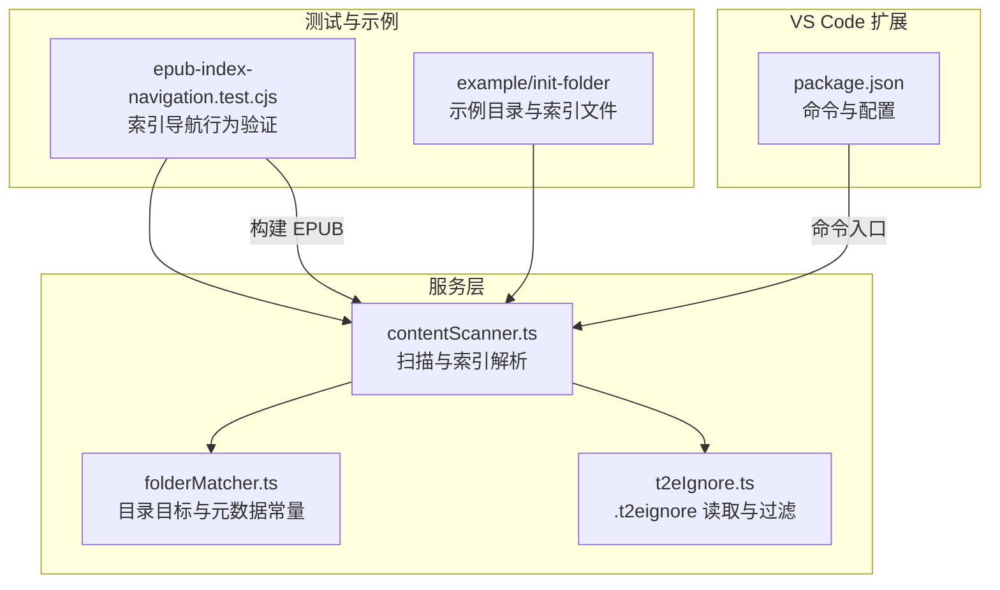
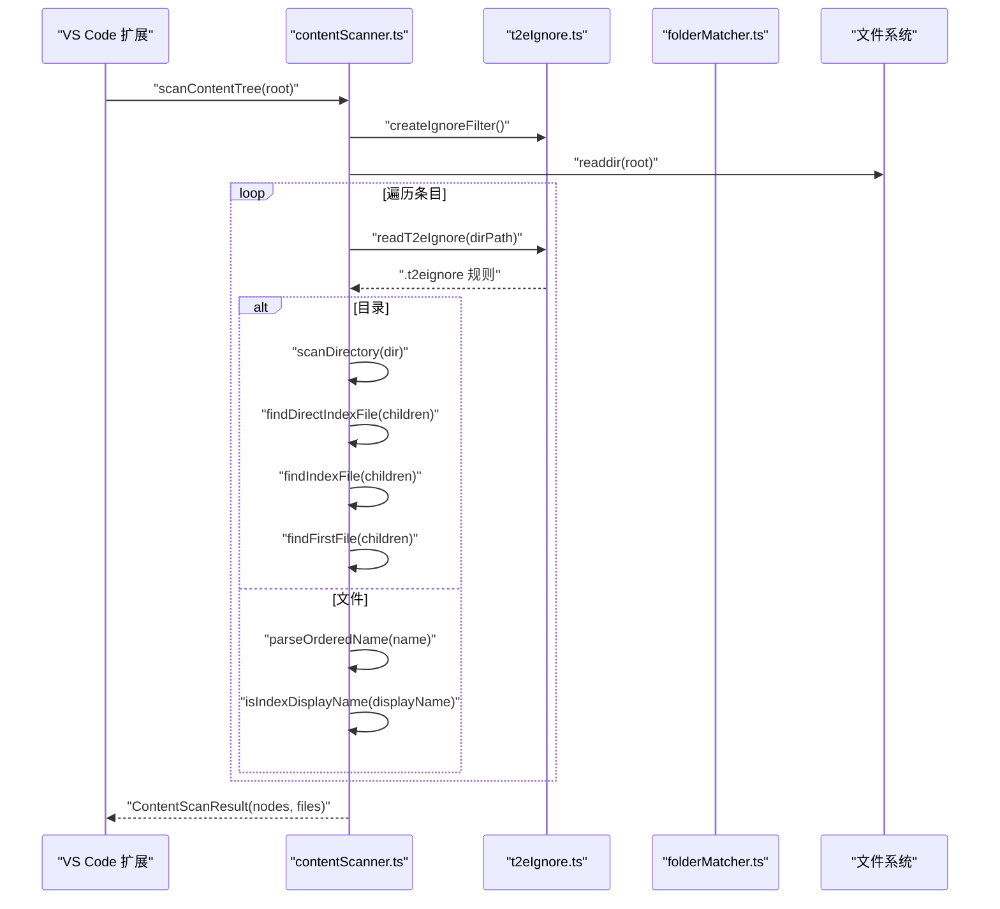
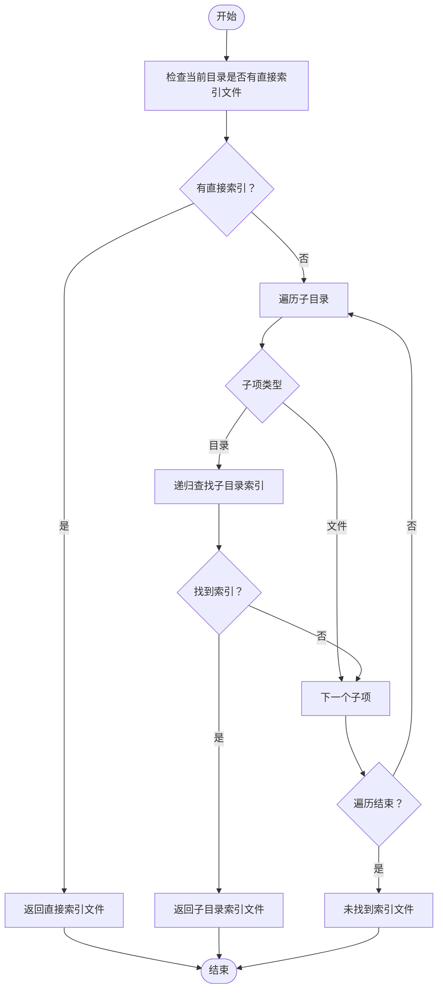
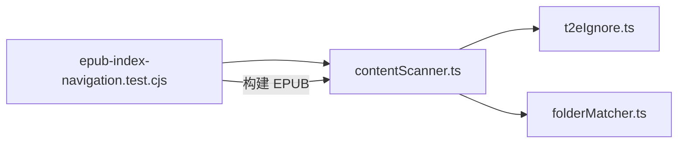

# 索引文件处理

<cite>
**本文引用的文件**
- [contentScanner.ts](file://src/services/contentScanner.ts)
- [folderMatcher.ts](file://src/services/folderMatcher.ts)
- [t2eIgnore.ts](file://src/services/t2eIgnore.ts)
- [epub-index-navigation.test.cjs](file://test/epub-index-navigation.test.cjs)
- [init-folder 示例目录结构](file://example/init-folder)
- [0000_index.md（子目录 1）](file://example/init-folder/00102___子目录 1/0000_index.md)
- [_index.md（子目录 2-1）](file://example/init-folder/00105___index test/00001_子目录 2-1/_index.md)
- [_index.txt（子目录 2-1）](file://example/init-folder/00105___index test/_index.txt)
- [000_index.txt（子目录 2）](file://example/init-folder/00103___子目录 2/000_index.txt)
- [000_index.md（子目录 2-1）](file://example/init-folder/00103___子目录 2/00001_子目录 2-1/000_index.md)
- [metadata.yml（示例元数据）](file://example/init-folder/__t2e.data/metadata.yml)
- [.t2eignore（示例忽略规则）](file://example/init-folder/.t2eignore)
- [package.json（扩展配置与命令）](file://package.json)
</cite>

## 目录
1. [简介](#简介)
2. [项目结构](#项目结构)
3. [核心组件](#核心组件)
4. [架构总览](#架构总览)
5. [详细组件分析](#详细组件分析)
6. [依赖关系分析](#依赖关系分析)
7. [性能考量](#性能考量)
8. [故障排查指南](#故障排查指南)
9. [结论](#结论)
10. [附录](#附录)

## 简介
本文件系统性阐述“索引文件处理”机制，围绕以下主题展开：
- 索引文件识别规则：文件名匹配逻辑、大小写不敏感处理、特殊命名模式支持（如双下划线前缀、多级子目录索引）。
- 查找策略：直接索引优先、嵌套目录递归搜索、查找范围控制（忽略规则、元数据目录隔离）。
- 导航作用：目录跳转中的 firstFile 选择逻辑、目录目标文件确定、导航结构生成。
- 优先级规则：直接索引优先于其他文件、目录索引优先于子目录索引。
- 实际场景与配置示例：不同目录结构下的索引识别效果与 EPUB 导航行为验证。

## 项目结构
与索引文件处理直接相关的模块与文件如下：
- 扫描与索引解析：src/services/contentScanner.ts
- 目录目标解析与元数据目录常量：src/services/folderMatcher.ts
- 忽略规则读取与过滤器：src/services/t2eIgnore.ts
- 行为验证测试：test/epub-index-navigation.test.cjs
- 示例目录与文件：example/init-folder 及其子文件
- VS Code 扩展命令与配置：package.json

图表来源
- [contentScanner.ts:1-340](file://src/services/contentScanner.ts#L1-L340)
- [folderMatcher.ts:1-85](file://src/services/folderMatcher.ts#L1-L85)
- [t2eIgnore.ts:1-45](file://src/services/t2eIgnore.ts#L1-L45)
- [epub-index-navigation.test.cjs:1-140](file://test/epub-index-navigation.test.cjs#L1-L140)
- [package.json:1-114](file://package.json#L1-L114)

章节来源
- [contentScanner.ts:1-340](file://src/services/contentScanner.ts#L1-L340)
- [folderMatcher.ts:1-85](file://src/services/folderMatcher.ts#L1-L85)
- [t2eIgnore.ts:1-45](file://src/services/t2eIgnore.ts#L1-L45)
- [epub-index-navigation.test.cjs:1-140](file://test/epub-index-navigation.test.cjs#L1-L140)
- [package.json:1-114](file://package.json#L1-L114)

## 核心组件
- 内容扫描与树构建：负责读取目录、解析文件名前缀、识别索引文件、计算 firstFile 与 indexFile，并生成树状节点与线性文件列表。
- 目录目标解析：校验 VS Code 资源管理器中的本地目录，确保命令在正确上下文中执行。
- 忽略规则：读取 .t2eignore 并通过 ignore 库进行路径过滤，支持注释与空行。
- 导航行为验证：通过测试用例验证索引文件在导航结构中的优先级与呈现方式。

章节来源
- [contentScanner.ts:51-329](file://src/services/contentScanner.ts#L51-L329)
- [folderMatcher.ts:23-38](file://src/services/folderMatcher.ts#L23-L38)
- [t2eIgnore.ts:13-44](file://src/services/t2eIgnore.ts#L13-L44)
- [epub-index-navigation.test.cjs:74-139](file://test/epub-index-navigation.test.cjs#L74-L139)

## 架构总览
索引文件处理贯穿“扫描—解析—选择—生成”的主流程。下图展示了从目录扫描到导航生成的关键步骤与组件交互。

图表来源
- [contentScanner.ts:51-329](file://src/services/contentScanner.ts#L51-L329)
- [t2eIgnore.ts:13-44](file://src/services/t2eIgnore.ts#L13-L44)
- [folderMatcher.ts:46-58](file://src/services/folderMatcher.ts#L46-L58)

## 详细组件分析

### 索引文件识别规则
- 文件名匹配逻辑
  - 数字前缀解析：仅当“连续数字 + 下划线”出现在文件名开头时，数字部分作为排序序号，其余作为展示名。例如“0000_index.md”会被解析为展示名为“index”，序号为 0。
  - 特殊命名模式：以单个或多个下划线开头的名称（如“__xxx”）被视为展示名为“xxx”，序号为 0。
  - 目录索引判定：去除数字前缀后，展示名经大小写不敏感比较，等于“index”即标记为索引文件。
- 大小写不敏感处理：展示名比较采用大小写不敏感策略，确保“Index”、“INDEX”、“index”均被识别为索引。
- 支持的扩展名：仅“.md”与“.txt”两类文本文件参与索引识别与后续处理。
- 元数据目录隔离：目录名为“__t2e.data”的目录被最高优先级硬过滤，不纳入扫描与索引识别。

章节来源
- [contentScanner.ts:191-248](file://src/services/contentScanner.ts#L191-L248)
- [contentScanner.ts:258-329](file://src/services/contentScanner.ts#L258-L329)
- [folderMatcher.ts:7-8](file://src/services/folderMatcher.ts#L7-L8)

### 索引文件查找策略
- 直接索引优先查找：在当前目录的直接子节点中优先寻找标记为索引文件的文件。
- 嵌套目录递归搜索：若当前目录无直接索引，则递归遍历子目录，返回首个找到的索引文件。
- 查找范围控制：
  - 忽略规则：每个目录读取其 .t2eignore 并合并到全局过滤器，过滤掉匹配的相对路径。
  - 元数据目录：即使子目录内存在索引文件，也不会进入结果，因为“__t2e.data”目录被硬过滤。
  - 文件类型限制：仅支持“.md”与“.txt”。

图表来源
- [contentScanner.ts:113-141](file://src/services/contentScanner.ts#L113-L141)
- [contentScanner.ts:258-329](file://src/services/contentScanner.ts#L258-L329)
- [t2eIgnore.ts:13-26](file://src/services/t2eIgnore.ts#L13-L26)
- [folderMatcher.ts:7-8](file://src/services/folderMatcher.ts#L7-L8)

章节来源
- [contentScanner.ts:113-141](file://src/services/contentScanner.ts#L113-L141)
- [contentScanner.ts:258-329](file://src/services/contentScanner.ts#L258-L329)
- [t2eIgnore.ts:13-26](file://src/services/t2eIgnore.ts#L13-L26)
- [folderMatcher.ts:7-8](file://src/services/folderMatcher.ts#L7-L8)

### 目录跳转中的索引文件作用
- firstFile 选择逻辑：
  - 若当前目录存在索引文件，则 firstFile 指向该索引文件。
  - 否则回退到按排序规则确定的第一个文件（可能是目录内首个文件，或其子目录的 firstFile）。
- 目录目标文件确定：目录节点的 indexFile 字段记录当前目录的直接索引文件；若无直接索引则为空。
- 导航结构生成：在 EPUB 导航中，若某目录存在索引文件，导航项会优先指向该索引文件，且通常不再单独显示该目录项本身（具体以测试断言为准）。

章节来源
- [contentScanner.ts:149-161](file://src/services/contentScanner.ts#L149-L161)
- [contentScanner.ts:285-302](file://src/services/contentScanner.ts#L285-L302)
- [epub-index-navigation.test.cjs:74-139](file://test/epub-index-navigation.test.cjs#L74-L139)

### 优先级规则
- 直接索引优先于其他文件：在当前目录内，索引文件总是优先于普通文件参与 firstFile 选择。
- 目录索引优先于子目录索引：若上层目录无直接索引，可回退到更深一层的子目录索引文件，但该子目录仍会以其“最近的直接索引”作为跳转目标（若存在）。

章节来源
- [contentScanner.ts:113-141](file://src/services/contentScanner.ts#L113-L141)
- [contentScanner.ts:149-161](file://src/services/contentScanner.ts#L149-L161)
- [epub-index-navigation.test.cjs:116-139](file://test/epub-index-navigation.test.cjs#L116-L139)

### 实际应用场景与配置示例
- 场景一：子目录存在 index 文件
  - 行为：目录优先链接该索引文件，导航中不再单独出现“index”项，首章标题来自索引文件内容。
  - 断言要点：firstFile 与 indexFile 的展示名为“index”，导航中出现“正文”而非“index”，首章内容来自索引文件。
  - 参考测试：[epub-index-navigation.test.cjs:74-94](file://test/epub-index-navigation.test.cjs#L74-L94)
- 场景二：子目录不存在 index 文件
  - 行为：保持原有首文件跳转规则，导航中同时出现目录与首文件两项。
  - 断言要点：firstFile 展示名为“第一章”，indexFile 为空，导航中出现“正文”“第一章”“第二章”。
  - 参考测试：[epub-index-navigation.test.cjs:96-114](file://test/epub-index-navigation.test.cjs#L96-L114)
- 场景三：上层目录无直接 index，回退到更深子目录的 index
  - 行为：目录 firstFile 指向上层目录下首个子目录的索引文件，导航中出现“正文”“卷一”，但不出现“index”。
  - 断言要点：firstFile 的相对路径指向“0010_正文/0010_卷一/0000__index.md”，indexFile 为空。
  - 参考测试：[epub-index-navigation.test.cjs:116-139](file://test/epub-index-navigation.test.cjs#L116-L139)
- 示例目录结构与文件
  - 子目录 1 的索引文件：[0000_index.md（子目录 1）](file://example/init-folder/00102___子目录 1/0000_index.md)
  - 子目录 2 的索引文件：[000_index.txt（子目录 2）](file://example/init-folder/00103___子目录 2/000_index.txt)
  - 子目录 2-1 的索引文件：[000_index.md（子目录 2-1）](file://example/init-folder/00103___子目录 2/00001_子目录 2-1/000_index.md)，[_index.md（子目录 2-1）](file://example/init-folder/00105___index test/00001_子目录 2-1/_index.md)
  - 子目录 2-1 的另一种命名：[_index.txt（子目录 2-1）](file://example/init-folder/00105___index test/_index.txt)
  - 忽略规则示例：[.t2eignore](file://example/init-folder/.t2eignore)
  - 元数据示例：[__t2e.data/metadata.yml](file://example/init-folder/__t2e.data/metadata.yml)

章节来源
- [epub-index-navigation.test.cjs:74-139](file://test/epub-index-navigation.test.cjs#L74-L139)
- [0000_index.md（子目录 1）:1-4](file://example/init-folder/00102___子目录 1/0000_index.md#L1-L4)
- [000_index.txt（子目录 2）:1-4](file://example/init-folder/00103___子目录 2/000_index.txt#L1-L4)
- [000_index.md（子目录 2-1）:1-4](file://example/init-folder/00103___子目录 2/00001_子目录 2-1/000_index.md#L1-L4)
- [_index.md（子目录 2-1）:1-4](file://example/init-folder/00105___index test/00001_子目录 2-1/_index.md#L1-L4)
- [_index.txt（子目录 2-1）:1-4](file://example/init-folder/00105___index test/_index.txt#L1-L4)
- [.t2eignore 示例:1-2](file://example/init-folder/.t2eignore#L1-L2)
- [metadata.yml 示例:1-7](file://example/init-folder/__t2e.data/metadata.yml#L1-L7)

## 依赖关系分析
- 组件耦合与职责
  - contentScanner.ts 依赖 t2eIgnore.ts 提供忽略规则，依赖 folderMatcher.ts 提供元数据目录常量。
  - 测试模块 epub-index-navigation.test.cjs 依赖 dist 构建产物中的 contentScanner 与 epubService，验证索引文件在导航中的表现。
- 外部依赖
  - ignore 库用于路径过滤。
  - jszip 用于 EPUB 导航文件与首章内容的读取与断言。

图表来源
- [contentScanner.ts:1-340](file://src/services/contentScanner.ts#L1-L340)
- [t2eIgnore.ts:1-45](file://src/services/t2eIgnore.ts#L1-L45)
- [folderMatcher.ts:1-85](file://src/services/folderMatcher.ts#L1-L85)
- [epub-index-navigation.test.cjs:1-140](file://test/epub-index-navigation.test.cjs#L1-L140)

章节来源
- [contentScanner.ts:1-340](file://src/services/contentScanner.ts#L1-L340)
- [t2eIgnore.ts:1-45](file://src/services/t2eIgnore.ts#L1-L45)
- [folderMatcher.ts:1-85](file://src/services/folderMatcher.ts#L1-L85)
- [epub-index-navigation.test.cjs:1-140](file://test/epub-index-navigation.test.cjs#L1-L140)

## 性能考量
- 时间复杂度
  - 扫描阶段对每个目录进行一次 readdir，随后对子目录递归扫描，整体近似 O(N)（N 为有效文件与目录总数）。
  - 索引查找在每个目录最多进行一次直接索引检查与一次子目录递归检查，不影响总体复杂度。
- 空间复杂度
  - 递归深度受目录层级影响，最坏情况下与最大嵌套深度成正比。
  - 结果集包含树状节点与线性文件列表，空间与节点数量线性相关。
- 优化建议
  - 合理使用 .t2eignore 控制扫描范围，避免不必要的目录进入扫描。
  - 对于超大目录，建议分层组织并利用索引文件减少导航层级。

## 故障排查指南
- 症状：目录未出现在导航中
  - 可能原因：该目录下无可用文件（空目录不会进入结果），或所有文件被 .t2eignore 过滤。
  - 排查步骤：检查目录内是否存在“.md/.txt”文件，确认 .t2eignore 是否误删了目标文件。
- 症状：导航项显示为“index”
  - 可能原因：目录存在索引文件，且导航优先指向该索引文件。
  - 排查步骤：查看目录节点的 indexFile 与 firstFile，确认是否为索引文件导致的跳转。
- 症状：命令无法执行
  - 可能原因：命令未在资源管理器的本地目录中触发。
  - 排查步骤：确认 VS Code 的命令触发上下文，确保选择的是 file 协议的本地目录。

章节来源
- [contentScanner.ts:277-289](file://src/services/contentScanner.ts#L277-L289)
- [t2eIgnore.ts:13-26](file://src/services/t2eIgnore.ts#L13-L26)
- [folderMatcher.ts:23-38](file://src/services/folderMatcher.ts#L23-L38)
- [epub-index-navigation.test.cjs:74-139](file://test/epub-index-navigation.test.cjs#L74-L139)

## 结论
索引文件处理机制通过“数字前缀解析 + 展示名大小写不敏感 + 目录索引优先”的规则，在目录跳转与导航生成中实现了清晰、可控的行为。结合 .t2eignore 与元数据目录隔离，用户可以灵活地组织内容结构并精确控制扫描范围。测试用例进一步验证了在不同目录结构下索引文件的识别与导航表现，确保了功能的稳定性与可预期性。

## 附录
- VS Code 扩展命令与配置
  - 命令：生成 EPUB、初始化 EPUB、创建 .t2eignore、配置默认作者。
  - 配置：默认作者字段位于“folder2epub.defaultAuthor”。

章节来源
- [package.json:44-96](file://package.json#L44-L96)
- [package.json:66-76](file://package.json#L66-L76)