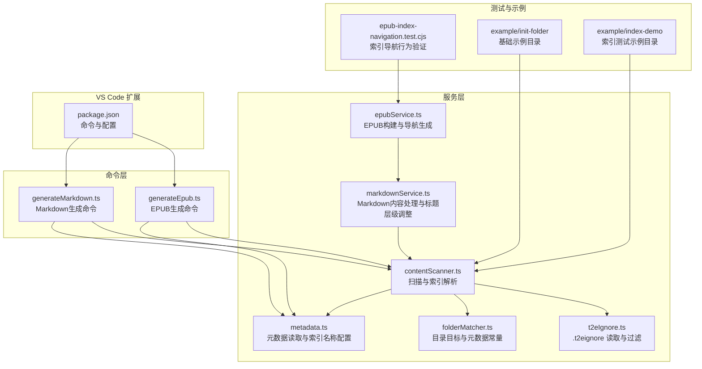
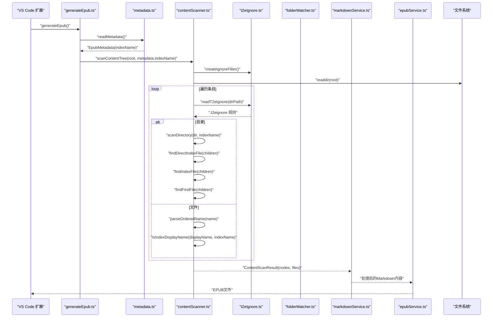
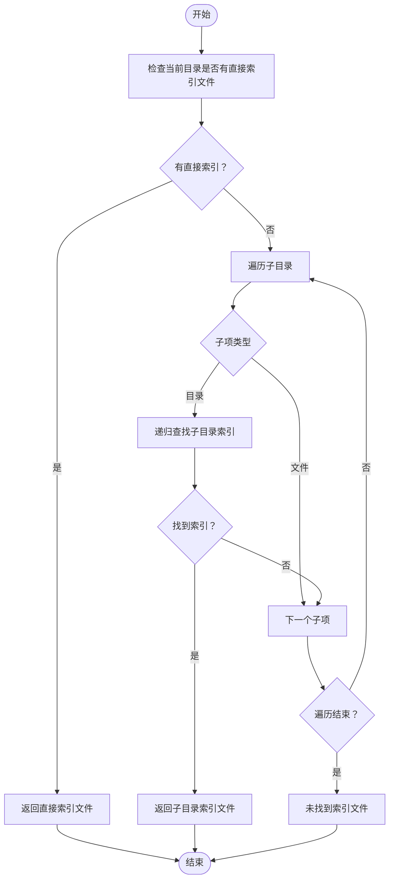
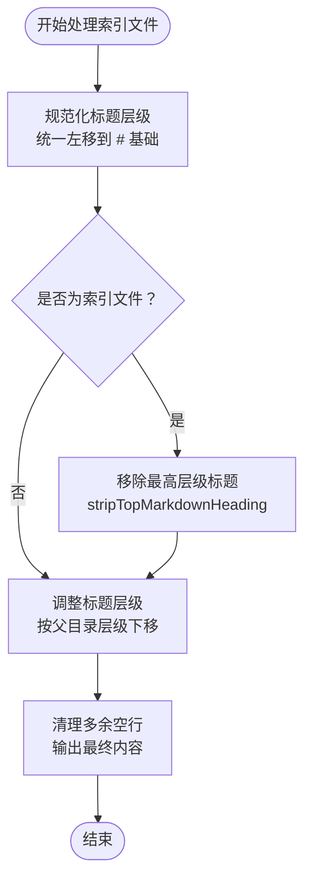
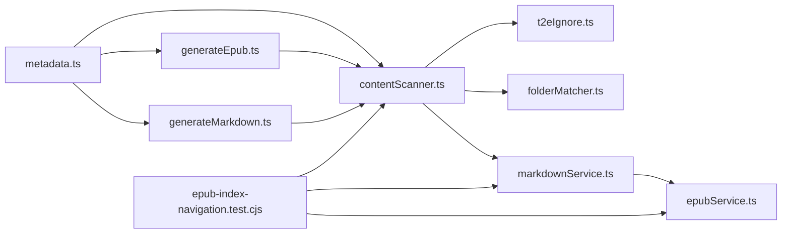

# 索引文件处理

<cite>
**本文引用的文件**
- [contentScanner.ts](file://src/services/contentScanner.ts)
- [folderMatcher.ts](file://src/services/folderMatcher.ts)
- [t2eIgnore.ts](file://src/services/t2eIgnore.ts)
- [metadata.ts](file://src/services/metadata.ts)
- [generateEpub.ts](file://src/commands/generateEpub.ts)
- [generateMarkdown.ts](file://src/commands/generateMarkdown.ts)
- [epub-index-navigation.test.cjs](file://test/epub-index-navigation.test.cjs)
- [init-folder 示例目录结构](file://example/init-folder)
- [index-demo 示例目录结构](file://example/index-demo)
- [0000_index.md（子目录 1）](file://example/init-folder/00102___子目录 1/0000_index.md)
- [_index.md（子目录 2-1）](file://example/init-folder/00105___index test/00001_子目录 2-1/_index.md)
- [_index.txt（子目录 2-1）](file://example/init-folder/00105___index test/_index.txt)
- [000_index.txt（子目录 2）](file://example/init-folder/00103___子目录 2/000_index.txt)
- [000_index.md（子目录 2-1）](file://example/init-folder/00103___子目录 2/00001_子目录 2-1/000_index.md)
- [0000__preface.md（默认索引目录）](file://example/index-demo/0040_默认索引/0000__preface.md)
- [0000__preface.md（混合测试目录）](file://example/index-demo/0050_混合测试/0000__preface.md)
- [0000__preface.md（多格式索引目录）](file://example/index-demo/0080_多格式索引/0000__preface.md)
- [_index.md（默认索引目录）](file://example/index-demo/0040_默认索引/_index.md)
- [metadata.yml（示例元数据）](file://example/init-folder/__t2e.data/metadata.yml)
- [metadata.yml（索引测试元数据）](file://example/index-demo/__t2e.data/metadata.yml)
- [.t2eignore（示例忽略规则）](file://example/init-folder/.t2eignore)
- [package.json（扩展配置与命令）](file://package.json)
- [markdownService.ts](file://src/services/markdownService.ts)
- [epubService.ts](file://src/services/epubService.ts)
</cite>

## 更新摘要
**变更内容**
- 新增可配置 indexName 功能，允许用户自定义索引文件名称
- 扩展 EpubMetadata 接口，增加 indexName 字段支持
- 修改内容扫描逻辑，支持动态索引文件名称配置
- 增强索引文件识别规则的灵活性和可定制性
- 更新索引文件处理机制的技术细节，包括配置驱动的索引识别

## 目录
1. [简介](#简介)
2. [项目结构](#项目结构)
3. [核心组件](#核心组件)
4. [架构总览](#架构总览)
5. [详细组件分析](#详细组件分析)
6. [依赖关系分析](#依赖关系分析)
7. [性能考量](#性能考量)
8. [故障排查指南](#故障排查指南)
9. [结论](#结论)
10. [附录](#附录)

## 简介
本文件系统性阐述"索引文件处理"机制，围绕以下主题展开：
- 索引文件识别规则：文件名匹配逻辑、大小写不敏感处理、特殊命名模式支持（如双下划线前缀、多级子目录索引）。
- 查找策略：直接索引优先、嵌套目录递归搜索、查找范围控制（忽略规则、元数据目录隔离）。
- 导航作用：目录跳转中的 firstFile 选择逻辑、目录目标文件确定、导航结构生成。
- 优先级规则：直接索引优先于其他文件、目录索引优先于子目录索引。
- **新增功能**：可配置 indexName 功能，允许用户自定义索引文件名称（如 'preface' 而非默认的 'index'）。
- 实际场景与配置示例：不同目录结构下的索引识别效果与 EPUB 导航行为验证。

## 项目结构
与索引文件处理直接相关的模块与文件如下：
- 扫描与索引解析：src/services/contentScanner.ts
- 目录目标解析与元数据目录常量：src/services/folderMatcher.ts
- 忽略规则读取与过滤器：src/services/t2eIgnore.ts
- 元数据读取与索引名称配置：src/services/metadata.ts
- EPUB 生成命令：src/commands/generateEpub.ts
- Markdown 生成命令：src/commands/generateMarkdown.ts
- Markdown 内容处理与标题层级调整：src/services/markdownService.ts
- EPUB 构建与导航生成：src/services/epubService.ts
- 行为验证测试：test/epub-index-navigation.test.cjs
- 示例目录与文件：example/init-folder、example/index-demo 及其子文件
- VS Code 扩展命令与配置：package.json


```mermaid
graph TB
subgraph "服务层"
CS["contentScanner.ts<br/>扫描与索引解析"]
FM["folderMatcher.ts<br/>目录目标与元数据常量"]
TI["t2eIgnore.ts<br/>.t2eignore 读取与过滤"]
MS["markdownService.ts<br/>Markdown内容处理与标题层级调整"]
ES["epubService.ts<br/>EPUB构建与导航生成"]
MET["metadata.ts<br/>元数据读取与索引名称配置"]
end
subgraph "命令层"
GE["generateEpub.ts<br/>EPUB生成命令"]
GM["generateMarkdown.ts<br/>Markdown生成命令"]
end
subgraph "测试与示例"
TEST["epub-index-navigation.test.cjs<br/>索引导航行为验证"]
EX1["example/init-folder<br/>基础示例目录"]
EX2["example/index-demo<br/>索引测试示例目录"]
end
subgraph "VS Code 扩展"
PKG["package.json<br/>命令与配置"]
end
CS --> TI
CS --> FM
CS --> MET
GE --> CS
GE --> MET
GM --> CS
GM --> MET
MS --> CS
ES --> MS
TEST --> ES
EX1 --> CS
EX2 --> CS
PKG --> GE
PKG --> GM
```

**图表来源**
- [contentScanner.ts:1-350](file://src/services/contentScanner.ts#L1-L350)
- [folderMatcher.ts:1-85](file://src/services/folderMatcher.ts#L1-L85)
- [t2eIgnore.ts:1-45](file://src/services/t2eIgnore.ts#L1-L45)
- [metadata.ts:1-159](file://src/services/metadata.ts#L1-L159)
- [generateEpub.ts:1-66](file://src/commands/generateEpub.ts#L1-L66)
- [generateMarkdown.ts:1-75](file://src/commands/generateMarkdown.ts#L1-L75)
- [markdownService.ts:1-264](file://src/services/markdownService.ts#L1-L264)
- [epubService.ts:1-200](file://src/services/epubService.ts#L1-L200)
- [epub-index-navigation.test.cjs:1-200](file://test/epub-index-navigation.test.cjs#L1-L200)
- [package.json:1-114](file://package.json#L1-L114)

**章节来源**
- [contentScanner.ts:1-350](file://src/services/contentScanner.ts#L1-L350)
- [folderMatcher.ts:1-85](file://src/services/folderMatcher.ts#L1-L85)
- [t2eIgnore.ts:1-45](file://src/services/t2eIgnore.ts#L1-L45)
- [metadata.ts:1-159](file://src/services/metadata.ts#L1-L159)
- [generateEpub.ts:1-66](file://src/commands/generateEpub.ts#L1-L66)
- [generateMarkdown.ts:1-75](file://src/commands/generateMarkdown.ts#L1-L75)
- [markdownService.ts:1-264](file://src/services/markdownService.ts#L1-L264)
- [epubService.ts:1-200](file://src/services/epubService.ts#L1-L200)
- [epub-index-navigation.test.cjs:1-200](file://test/epub-index-navigation.test.cjs#L1-L200)
- [package.json:1-114](file://package.json#L1-L114)

## 核心组件
- 内容扫描与树构建：负责读取目录、解析文件名前缀、识别索引文件、计算 firstFile 与 indexFile，并生成树状节点与线性文件列表。
- 目录目标解析：校验 VS Code 资源管理器中的本地目录，确保命令在正确上下文中执行。
- 忽略规则：读取 .t2eignore 并通过 ignore 库进行路径过滤，支持注释与空行。
- **新增功能**：元数据读取与索引名称配置，支持从 metadata.yml 中读取自定义 indexName 配置。
- **新增功能**：可配置索引文件识别，scanContentTree 函数接受 indexName 参数，默认为 'index'。
- 导航行为验证：通过测试用例验证索引文件在导航结构中的优先级与呈现方式。

**章节来源**
- [contentScanner.ts:51-350](file://src/services/contentScanner.ts#L51-L350)
- [folderMatcher.ts:23-38](file://src/services/folderMatcher.ts#L23-L38)
- [t2eIgnore.ts:13-44](file://src/services/t2eIgnore.ts#L13-L44)
- [metadata.ts:8-16](file://src/services/metadata.ts#L8-L16)
- [generateEpub.ts:39-40](file://src/commands/generateEpub.ts#L39-L40)
- [generateMarkdown.ts:42-43](file://src/commands/generateMarkdown.ts#L42-L43)
- [epub-index-navigation.test.cjs:141-200](file://test/epub-index-navigation.test.cjs#L141-L200)

## 架构总览
索引文件处理贯穿"扫描—解析—选择—生成"的主流程。下图展示了从目录扫描到导航生成的关键步骤与组件交互，包括新增的可配置索引名称处理。


```mermaid
sequenceDiagram
participant VS as "VS Code 扩展"
participant GE as "generateEpub.ts"
participant MET as "metadata.ts"
participant CS as "contentScanner.ts"
participant TI as "t2eIgnore.ts"
participant FM as "folderMatcher.ts"
participant MS as "markdownService.ts"
participant ES as "epubService.ts"
participant FS as "文件系统"
VS->>GE : "generateEpub()"
GE->>MET : "readMetadata()"
MET-->>GE : "EpubMetadata(indexName)"
GE->>CS : "scanContentTree(root, metadata.indexName)"
CS->>TI : "createIgnoreFilter()"
CS->>FS : "readdir(root)"
loop 遍历条目
CS->>TI : "readT2eIgnore(dirPath)"
TI-->>CS : ".t2eignore 规则"
alt 目录
CS->>CS : "scanDirectory(dir, indexName)"
CS->>CS : "findDirectIndexFile(children)"
CS->>CS : "findIndexFile(children)"
CS->>CS : "findFirstFile(children)"
else 文件
CS->>CS : "parseOrderedName(name)"
CS->>CS : "isIndexDisplayName(displayName, indexName)"
end
end
CS-->>MS : "ContentScanResult(nodes, files)"
MS-->>ES : "处理后的Markdown内容"
ES-->>VS : "EPUB文件"
```

**图表来源**
- [generateEpub.ts:37-40](file://src/commands/generateEpub.ts#L37-L40)
- [metadata.ts:43-62](file://src/services/metadata.ts#L43-L62)
- [contentScanner.ts:51-350](file://src/services/contentScanner.ts#L51-L350)
- [t2eIgnore.ts:13-44](file://src/services/t2eIgnore.ts#L13-L44)
- [folderMatcher.ts:46-58](file://src/services/folderMatcher.ts#L46-L58)
- [markdownService.ts:119-180](file://src/services/markdownService.ts#L119-L180)
- [epubService.ts:493-543](file://src/services/epubService.ts#L493-L543)

## 详细组件分析

### 索引文件识别规则
- 文件名匹配逻辑
  - 数字前缀解析：仅当"连续数字 + 下划线"出现在文件名开头时，数字部分作为排序序号，其余作为展示名。例如"0000_index.md"会被解析为展示名为"index"，序号为 0。
  - 特殊命名模式：以单个或多个下划线开头的名称（如"__xxx"）被视为展示名为"xxx"，序号为 0。
  - **新增功能**：可配置索引名称识别，使用 isIndexDisplayName(displayName, indexName) 进行判断，支持自定义索引文件名称。
- 大小写不敏感处理：展示名比较采用大小写不敏感策略，确保"Index"、"INDEX"、"index"均被识别为索引。
- 支持的扩展名：仅".md"与".txt"两类文本文件参与索引识别与后续处理。
- 元数据目录隔离：目录名为"__t2e.data"的目录被最高优先级硬过滤，不纳入扫描与索引识别。

**章节来源**
- [contentScanner.ts:191-248](file://src/services/contentScanner.ts#L191-L248)
- [contentScanner.ts:255-258](file://src/services/contentScanner.ts#L255-L258)
- [contentScanner.ts:334](file://src/services/contentScanner.ts#L334)
- [folderMatcher.ts:7-8](file://src/services/folderMatcher.ts#L7-L8)

### 可配置 indexName 功能

**更新** 新增可配置索引文件名称功能，增强索引文件处理的灵活性

- **EpubMetadata 接口扩展**：
  - 新增 indexName 字段，用于指定自定义索引文件名称
  - 默认值为 'index'，保持向后兼容性
  - 支持任意字符串作为索引文件名称

- **元数据读取与处理**：
  - 从 metadata.yml 中读取 indexName 配置
  - 提供默认回退机制，空值或无效值回退到 'index'
  - 自动去除首尾空白字符

- **内容扫描集成**：
  - scanContentTree 函数接受 indexName 参数，默认为 'index'
  - 传递给 scanDirectory 函数进行索引文件识别
  - 支持动态配置的索引文件名称

- **配置示例**：
  ```yaml
  title: index-demo
  titleSuffix: 索引测试
  author: i3166
  description: 用于测试 indexName 配置的自定义索引名称功能
  cover: ''
  indexName: preface  # 自定义索引文件名称
  version: 1.0.0
  ```

**章节来源**
- [metadata.ts:8-16](file://src/services/metadata.ts#L8-L16)
- [metadata.ts:25-35](file://src/services/metadata.ts#L25-L35)
- [metadata.ts:43-62](file://src/services/metadata.ts#L43-L62)
- [contentScanner.ts:51](file://src/services/contentScanner.ts#L51)
- [contentScanner.ts:255-258](file://src/services/contentScanner.ts#L255-L258)
- [generateEpub.ts:39-40](file://src/commands/generateEpub.ts#L39-L40)
- [generateMarkdown.ts:42-43](file://src/commands/generateMarkdown.ts#L42-L43)

### 索引文件查找策略
- 直接索引优先查找：在当前目录的直接子节点中优先寻找标记为索引文件的文件。
- 嵌套目录递归搜索：若当前目录无直接索引，则递归遍历子目录，返回首个找到的索引文件。
- 查找范围控制：
  - 忽略规则：每个目录读取其 .t2eignore 并合并到全局过滤器，过滤掉匹配的相对路径。
  - 元数据目录：即使子目录内存在索引文件，也不会进入结果，因为"__t2e.data"目录被硬过滤。
  - 文件类型限制：仅支持".md"与".txt"。


```mermaid
flowchart TD
Start(["开始"]) --> CheckDirect["检查当前目录是否有直接索引文件"]
CheckDirect --> HasDirect{"有直接索引？"}
HasDirect --> |是| ReturnDirect["返回直接索引文件"]
HasDirect --> |否| LoopChildren["遍历子目录"]
LoopChildren --> ChildType{"子项类型"}
ChildType --> |文件| NextChild["下一个子项"]
ChildType --> |目录| Recurse["递归查找子目录索引"]
Recurse --> Found{"找到索引？"}
Found --> |是| ReturnNested["返回子目录索引文件"]
Found --> |否| NextChild
NextChild --> Done{"遍历结束？"}
Done --> |否| LoopChildren
Done --> |是| NoIndex["未找到索引文件"]
ReturnDirect --> End(["结束"])
ReturnNested --> End
NoIndex --> End
```

**图表来源**
- [contentScanner.ts:113-141](file://src/services/contentScanner.ts#L113-L141)
- [contentScanner.ts:258-329](file://src/services/contentScanner.ts#L258-L329)
- [t2eIgnore.ts:13-26](file://src/services/t2eIgnore.ts#L13-L26)
- [folderMatcher.ts:7-8](file://src/services/folderMatcher.ts#L7-L8)

**章节来源**
- [contentScanner.ts:113-141](file://src/services/contentScanner.ts#L113-L141)
- [contentScanner.ts:258-329](file://src/services/contentScanner.ts#L258-L329)
- [t2eIgnore.ts:13-26](file://src/services/t2eIgnore.ts#L13-L26)
- [folderMatcher.ts:7-8](file://src/services/folderMatcher.ts#L7-L8)

### 目录跳转中的索引文件作用
- firstFile 选择逻辑：
  - 若当前目录存在索引文件，则 firstFile 指向该索引文件。
  - 否则回退到按排序规则确定的第一个文件（可能是目录内首个文件，或其子目录的 firstFile）。
- 目录目标文件确定：目录节点的 indexFile 字段记录当前目录的直接索引文件；若无直接索引则为空。
- 导航结构生成：在 EPUB 导航中，若某目录存在索引文件，导航项会优先指向该索引文件，且通常不再单独显示该目录项本身（具体以测试断言为准）。

**章节来源**
- [contentScanner.ts:149-161](file://src/services/contentScanner.ts#L149-L161)
- [contentScanner.ts:285-302](file://src/services/contentScanner.ts#L285-L302)
- [epub-index-navigation.test.cjs:74-139](file://test/epub-index-navigation.test.cjs#L74-L139)

### 优先级规则
- 直接索引优先于其他文件：在当前目录内，索引文件总是优先于普通文件参与 firstFile 选择。
- 目录索引优先于子目录索引：若上层目录无直接索引，可回退到更深一层的子目录索引文件，但该子目录仍会以其"最近的直接索引"作为跳转目标（若存在）。

**章节来源**
- [contentScanner.ts:113-141](file://src/services/contentScanner.ts#L113-L141)
- [contentScanner.ts:149-161](file://src/services/contentScanner.ts#L149-L161)
- [epub-index-navigation.test.cjs:116-139](file://test/epub-index-navigation.test.cjs#L116-L139)

### 标题层级规范化与 stripTopMarkdownHeading 功能

**更新** 新增标题层级规范化处理，确保索引文件内容与父目录标题层次协调

- **stripTopMarkdownHeading 核心功能**：
  - 目标：移除索引文件内容中的最高层级标题，避免与父目录标题产生重复层级
  - 实现：识别内容中第一个非空的标题行，将其移除并清理后续空行
  - 应用场景：当索引文件作为目录入口时，其内容直接附加在父目录标题下，无需重复的顶级标题

- **标题层级处理流程**：
  1. **规范化处理**：将内容中所有标题统一左移到从 # 开始的基础层级
  2. **索引文件特处理**：对索引文件应用 stripTopMarkdownHeading 移除最高层级标题
  3. **层级调整**：根据父目录的章节层级整体下移标题层级，避免与外层标题冲突

- **处理效果**：
  - 索引文件内容不再包含顶级标题，直接作为父目录的子内容展示
  - 避免 EPUB 导航中出现重复的标题层级结构
  - 保持内容的语义完整性，同时优化阅读体验


```mermaid
flowchart TD
Start(["开始处理索引文件"]) --> Normalize["规范化标题层级<br/>统一左移到 # 基础"]
Normalize --> CheckIndex{"是否为索引文件？"}
CheckIndex --> |是| StripTop["移除最高层级标题<br/>stripTopMarkdownHeading"]
CheckIndex --> |否| Adjust["调整标题层级<br/>按父目录层级下移"]
StripTop --> Adjust
Adjust --> Finalize["清理多余空行<br/>输出最终内容"]
Finalize --> End(["结束"])
```

**图表来源**
- [markdownService.ts:142-153](file://src/services/markdownService.ts#L142-L153)
- [markdownService.ts:167-180](file://src/services/markdownService.ts#L167-L180)
- [markdownService.ts:189-263](file://src/services/markdownService.ts#L189-L263)

**章节来源**
- [markdownService.ts:119-180](file://src/services/markdownService.ts#L119-L180)
- [markdownService.ts:167-180](file://src/services/markdownService.ts#L167-L180)
- [markdownService.ts:189-263](file://src/services/markdownService.ts#L189-L263)

### 实际应用场景与配置示例

**更新** 新增可配置 indexName 功能的实际应用场景

- 场景一：子目录存在 index 文件
  - 行为：目录优先链接该索引文件，导航中不再单独出现"index"项，首章标题来自索引文件内容。
  - **新增效果**：索引文件内容中的顶级标题被自动移除，避免与父目录标题重复。
  - 断言要点：firstFile 与 indexFile 的展示名为"index"，导航中出现"正文"而非"index"，首章内容来自索引文件且无重复标题。
  - 参考测试：[epub-index-navigation.test.cjs:74-94](file://test/epub-index-navigation.test.cjs#L74-L94)
- 场景二：子目录不存在 index 文件
  - 行为：保持原有首文件跳转规则，导航中同时出现目录与首文件两项。
  - 断言要点：firstFile 展示名为"第一章"，indexFile 为空，导航中出现"正文""第一章""第二章"。
  - 参考测试：[epub-index-navigation.test.cjs:96-114](file://test/epub-index-navigation.test.cjs#L96-L114)
- 场景三：上层目录无直接 index，回退到更深子目录的 index
  - 行为：目录 firstFile 指向上层目录下首个子目录的索引文件，导航中出现"正文""卷一"，但不出现"index"。
  - 断言要点：firstFile 的相对路径指向"0010_正文/0010_卷一/0000__index.md"，indexFile 为空。
  - 参考测试：[epub-index-navigation.test.cjs:116-139](file://test/epub-index-navigation.test.cjs#L116-L139)
- **新增场景四：自定义 indexName 配置**
  - 行为：使用 metadata.yml 中的 indexName 配置作为索引文件识别标准
  - 配置示例：`indexName: preface` 将 "_preface.md"、"0000__preface.md" 等识别为索引文件
  - 断言要点：配置为 'preface' 时，名为 'index' 的文件不再被识别为索引文件
  - 参考测试：[epub-index-navigation.test.cjs:141-187](file://test/epub-index-navigation.test.cjs#L141-L187)
- **新增场景五：混合索引文件命名**
  - 行为：支持多种命名模式的索引文件同时被识别
  - 示例：1234_preface.md、_preface.md、preface.md、_preface.txt
  - 断言要点：所有符合 preface 命名模式的文件都被识别为索引文件
  - 参考测试：[epub-index-navigation.test.cjs:141-159](file://test/epub-index-navigation.test.cjs#L141-L159)
- 示例目录结构与文件
  - 子目录 1 的索引文件：[0000_index.md（子目录 1）](file://example/init-folder/00102___子目录 1/0000_index.md)
  - 子目录 2 的索引文件：[000_index.txt（子目录 2）](file://example/init-folder/00103___子目录 2/000_index.txt)
  - 子目录 2-1 的索引文件：[000_index.md（子目录 2-1）](file://example/init-folder/00103___子目录 2/00001_子目录 2-1/000_index.md)，[_index.md（子目录 2-1）](file://example/init-folder/00105___index test/00001_子目录 2-1/_index.md)
  - 子目录 2-1 的另一种命名：[_index.txt（子目录 2-1）](file://example/init-folder/00105___index test/_index.txt)
  - **新增示例**：默认索引目录的索引文件 [0000__preface.md（默认索引目录）](file://example/index-demo/0040_默认索引/0000__preface.md)
  - **新增示例**：混合测试目录的索引文件 [0000__preface.md（混合测试目录）](file://example/index-demo/0050_混合测试/0000__preface.md)
  - **新增示例**：多格式索引目录的索引文件 [0000__preface.md（多格式索引目录）](file://example/index-demo/0080_多格式索引/0000__preface.md)
  - **新增示例**：默认索引目录的普通文件 [_index.md（默认索引目录）](file://example/index-demo/0040_默认索引/_index.md)
  - 忽略规则示例：[.t2eignore](file://example/init-folder/.t2eignore)
  - 元数据示例：[__t2e.data/metadata.yml](file://example/init-folder/__t2e.data/metadata.yml)
  - **新增元数据示例**：[metadata.yml（索引测试元数据）](file://example/index-demo/__t2e.data/metadata.yml)

**章节来源**
- [epub-index-navigation.test.cjs:74-139](file://test/epub-index-navigation.test.cjs#L74-L139)
- [epub-index-navigation.test.cjs:141-187](file://test/epub-index-navigation.test.cjs#L141-L187)
- [0000_index.md（子目录 1）:1-4](file://example/init-folder/00102___子目录 1/0000_index.md#L1-L4)
- [000_index.txt（子目录 2）:1-4](file://example/init-folder/00103___子目录 2/000_index.txt#L1-L4)
- [000_index.md（子目录 2-1）:1-4](file://example/init-folder/00103___子目录 2/00001_子目录 2-1/000_index.md#L1-L4)
- [_index.md（子目录 2-1）:1-4](file://example/init-folder/00105___index test/00001_子目录 2-1/_index.md#L1-L4)
- [_index.txt（子目录 2-1）:1-4](file://example/init-folder/00105___index test/_index.txt#L1-L4)
- [0000__preface.md（默认索引目录）:1-4](file://example/index-demo/0040_默认索引/0000__preface.md#L1-L4)
- [0000__preface.md（混合测试目录）:1-4](file://example/index-demo/0050_混合测试/0000__preface.md#L1-L4)
- [0000__preface.md（多格式索引目录）:1-4](file://example/index-demo/0080_多格式索引/0000__preface.md#L1-L4)
- [_index.md（默认索引目录）:1-11](file://example/index-demo/0040_默认索引/_index.md#L1-L11)
- [.t2eignore 示例:1-2](file://example/init-folder/.t2eignore#L1-L2)
- [metadata.yml 示例:1-7](file://example/init-folder/__t2e.data/metadata.yml#L1-L7)
- [metadata.yml（索引测试元数据）:1-8](file://example/index-demo/__t2e.data/metadata.yml#L1-L8)

## 依赖关系分析
- 组件耦合与职责
  - contentScanner.ts 依赖 t2eIgnore.ts 提供忽略规则，依赖 folderMatcher.ts 提供元数据目录常量。
  - **新增依赖**：contentScanner.ts 依赖 metadata.ts 提供的 indexName 配置。
  - **新增依赖**：generateEpub.ts 依赖 metadata.ts 读取 indexName 配置，传递给 contentScanner.ts。
  - **新增依赖**：generateMarkdown.ts 依赖 metadata.ts 读取 indexName 配置，传递给 contentScanner.ts。
  - **新增依赖**：markdownService.ts 依赖 contentScanner.ts 提供的索引文件信息，负责内容处理与标题层级调整。
  - **新增依赖**：epubService.ts 依赖 markdownService.ts 提供的处理后内容，负责 EPUB 构建与导航生成。
  - 测试模块 epub-index-navigation.test.cjs 依赖 dist 构建产物中的 contentScanner、markdownService 与 epubService，验证索引文件在导航中的表现。
- 外部依赖
  - ignore 库用于路径过滤。
  - jszip 用于 EPUB 导航文件与首章内容的读取与断言。
  - markdown-it 用于 Markdown 内容渲染。


```mermaid
graph LR
MET["metadata.ts"] --> CS["contentScanner.ts"]
MET --> GE["generateEpub.ts"]
MET --> GM["generateMarkdown.ts"]
CS --> TI["t2eIgnore.ts"]
CS --> FM["folderMatcher.ts"]
CS --> MS["markdownService.ts"]
MS --> ES["epubService.ts"]
GE --> CS
GM --> CS
TEST["epub-index-navigation.test.cjs"] --> CS
TEST --> MS
TEST --> ES
```

**图表来源**
- [contentScanner.ts:1-350](file://src/services/contentScanner.ts#L1-L350)
- [t2eIgnore.ts:1-45](file://src/services/t2eIgnore.ts#L1-L45)
- [folderMatcher.ts:1-85](file://src/services/folderMatcher.ts#L1-L85)
- [metadata.ts:1-159](file://src/services/metadata.ts#L1-L159)
- [generateEpub.ts:1-66](file://src/commands/generateEpub.ts#L1-L66)
- [generateMarkdown.ts:1-75](file://src/commands/generateMarkdown.ts#L1-L75)
- [markdownService.ts:1-264](file://src/services/markdownService.ts#L1-L264)
- [epubService.ts:1-200](file://src/services/epubService.ts#L1-L200)
- [epub-index-navigation.test.cjs:1-200](file://test/epub-index-navigation.test.cjs#L1-L200)

**章节来源**
- [contentScanner.ts:1-350](file://src/services/contentScanner.ts#L1-L350)
- [t2eIgnore.ts:1-45](file://src/services/t2eIgnore.ts#L1-L45)
- [folderMatcher.ts:1-85](file://src/services/folderMatcher.ts#L1-L85)
- [metadata.ts:1-159](file://src/services/metadata.ts#L1-L159)
- [generateEpub.ts:1-66](file://src/commands/generateEpub.ts#L1-L66)
- [generateMarkdown.ts:1-75](file://src/commands/generateMarkdown.ts#L1-L75)
- [markdownService.ts:1-264](file://src/services/markdownService.ts#L1-L264)
- [epubService.ts:1-200](file://src/services/epubService.ts#L1-L200)
- [epub-index-navigation.test.cjs:1-200](file://test/epub-index-navigation.test.cjs#L1-L200)

## 性能考量
- 时间复杂度
  - 扫描阶段对每个目录进行一次 readdir，随后对子目录递归扫描，整体近似 O(N)（N 为有效文件与目录总数）。
  - 索引查找在每个目录最多进行一次直接索引检查与一次子目录递归检查，不影响总体复杂度。
  - **新增开销**：可配置索引名称处理对每个文件的 isIndexDisplayName 调用开销极小，时间复杂度为 O(1)。
  - **新增开销**：stripTopMarkdownHeading 功能对索引文件内容进行一次性处理，时间复杂度为 O(L)，其中 L 为内容行数。
- 空间复杂度
  - 递归深度受目录层级影响，最坏情况下与最大嵌套深度成正比。
  - 结果集包含树状节点与线性文件列表，空间与节点数量线性相关。
  - **新增开销**：标题层级处理需要临时存储内容行数组，空间复杂度为 O(L)。
  - **新增开销**：元数据读取缓存 indexName 配置，内存开销极小。
- 优化建议
  - 合理使用 .t2eignore 控制扫描范围，避免不必要的目录进入扫描。
  - 对于超大目录，建议分层组织并利用索引文件减少导航层级。
  - **性能优化**：stripTopMarkdownHeading 采用流式处理，只在索引文件上应用，避免对普通文件造成额外开销。
  - **性能优化**：indexName 配置在元数据读取时一次性处理，避免重复计算。

## 故障排查指南
- 症状：目录未出现在导航中
  - 可能原因：该目录下无可用文件（空目录不会进入结果），或所有文件被 .t2eignore 过滤。
  - 排查步骤：检查目录内是否存在".md/.txt"文件，确认 .t2eignore 是否误删了目标文件。
- 症状：导航项显示为"index"
  - 可能原因：目录存在索引文件，且导航优先指向该索引文件。
  - 排查步骤：查看目录节点的 indexFile 与 firstFile，确认是否为索引文件导致的跳转。
- 症状：命令无法执行
  - 可能原因：命令未在资源管理器的本地目录中触发。
  - 排查步骤：确认 VS Code 的命令触发上下文，确保选择的是 file 协议的本地目录。
- **新增症状**：自定义索引文件未被识别
  - 可能原因：metadata.yml 中的 indexName 配置错误或格式不正确。
  - 排查步骤：检查 __t2e.data/metadata.yml 中的 indexName 配置，确认格式正确且无拼写错误。
- **新增症状**：原 index 文件被错误识别为索引文件
  - 可能原因：indexName 配置为空字符串或未正确读取。
  - 排查步骤：确认 metadata.yml 中的 indexName 配置已正确设置，或留空以使用默认 'index'。
- **新增症状**：索引文件内容出现重复标题
  - 可能原因：stripTopMarkdownHeading 功能未正确应用或内容格式不符合预期。
  - 排查步骤：检查索引文件的标题格式，确认是否以标准的 Markdown 标题开头，验证内容处理流程。

**章节来源**
- [contentScanner.ts:277-289](file://src/services/contentScanner.ts#L277-L289)
- [t2eIgnore.ts:13-26](file://src/services/t2eIgnore.ts#L13-L26)
- [folderMatcher.ts:23-38](file://src/services/folderMatcher.ts#L23-L38)
- [metadata.ts:43-62](file://src/services/metadata.ts#L43-L62)
- [epub-index-navigation.test.cjs:74-139](file://test/epub-index-navigation.test.cjs#L74-L139)

## 结论
索引文件处理机制通过"数字前缀解析 + 展示名大小写不敏感 + 目录索引优先"的规则，在目录跳转与导航生成中实现了清晰、可控的行为。**新增的可配置 indexName 功能进一步增强了系统的灵活性，允许用户自定义索引文件名称（如 'preface' 而非默认的 'index'），通过 EpubMetadata 接口扩展和元数据读取机制实现。**结合内容扫描逻辑的动态参数传递和测试用例的全面验证，用户可以灵活地组织内容结构并精确控制索引文件的识别规则。**新增的 stripTopMarkdownHeading 功能进一步增强了索引文件的处理能力，通过标题层级规范化确保索引文件内容与父目录标题层次协调一致，避免了重复标题层级的问题。**测试用例进一步验证了在不同目录结构下索引文件的识别与导航表现，确保了功能的稳定性与可预期性。

## 附录
- VS Code 扩展命令与配置
  - 命令：生成 EPUB、初始化 EPUB、创建 .t2eignore、配置默认作者。
  - 配置：默认作者字段位于"folder2epub.defaultAuthor"。
- **新增配置选项**
  - indexName：自定义索引文件名称，默认为 'index'
  - 支持任意字符串作为索引文件标识符
  - 大小写不敏感匹配
  - 空字符串回退到默认 'index' 行为

**章节来源**
- [package.json:44-96](file://package.json#L44-L96)
- [package.json:66-76](file://package.json#L66-L76)
- [metadata.ts:25-35](file://src/services/metadata.ts#L25-L35)
- [metadata.ts:43-62](file://src/services/metadata.ts#L43-L62)