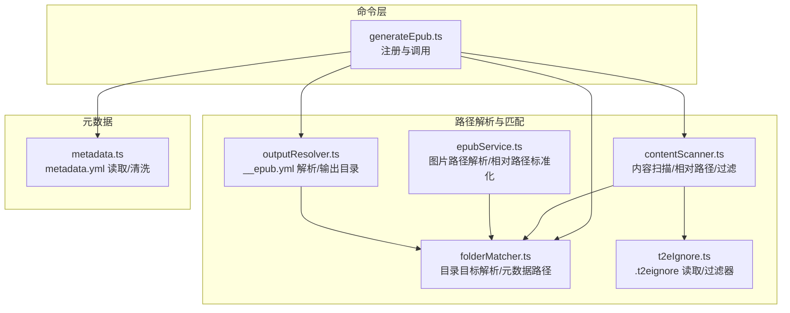
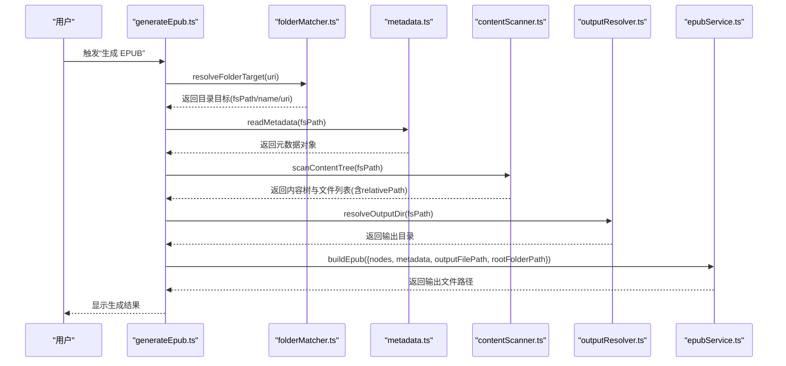
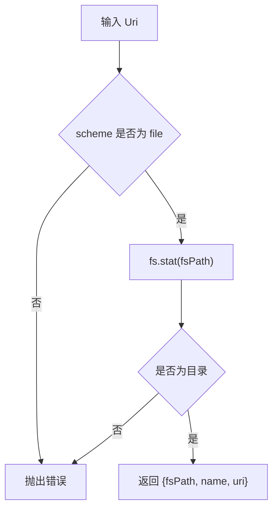
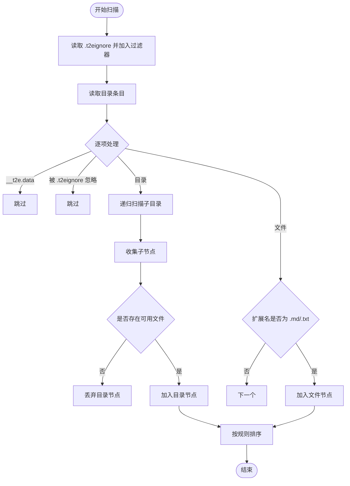
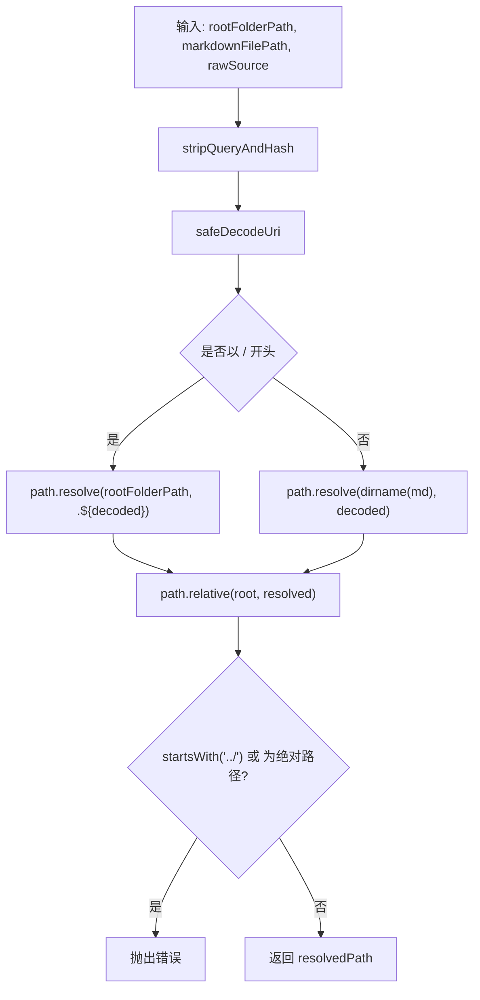
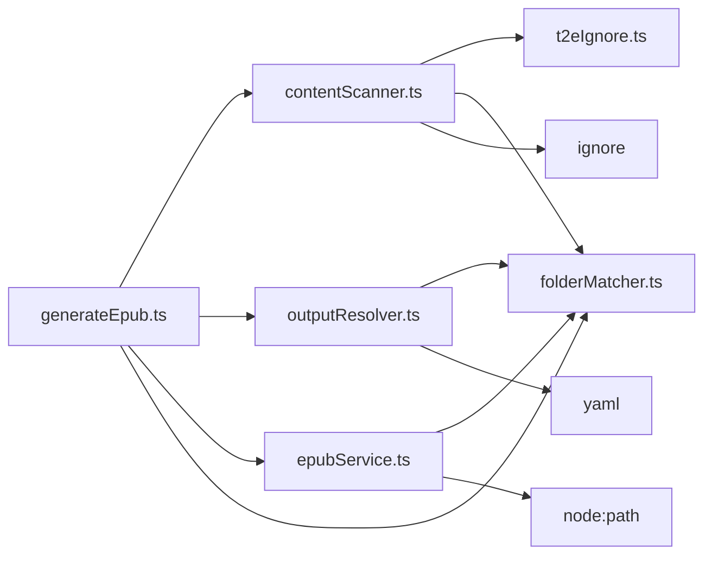

# 路径解析与匹配

<cite>
**本文档引用的文件**
- [src/services/folderMatcher.ts](file://src/services/folderMatcher.ts)
- [src/services/t2eIgnore.ts](file://src/services/t2eIgnore.ts)
- [src/services/outputResolver.ts](file://src/services/outputResolver.ts)
- [src/services/contentScanner.ts](file://src/services/contentScanner.ts)
- [src/services/epubService.ts](file://src/services/epubService.ts)
- [src/commands/generateEpub.ts](file://src/commands/generateEpub.ts)
- [src/services/metadata.ts](file://src/services/metadata.ts)
- [example/__epub.yml](file://example/__epub.yml)
- [example/init-folder/.t2eignore](file://example/init-folder/.t2eignore)
- [example/init-folder/__t2e.data/metadata.yml](file://example/init-folder/__t2e.data/metadata.yml)
</cite>

## 目录
1. [简介](#简介)
2. [项目结构](#项目结构)
3. [核心组件](#核心组件)
4. [架构总览](#架构总览)
5. [详细组件分析](#详细组件分析)
6. [依赖关系分析](#依赖关系分析)
7. [性能考量](#性能考量)
8. [故障排查指南](#故障排查指南)
9. [结论](#结论)
10. [附录](#附录)

## 简介
本文件聚焦于路径解析与匹配机制的技术细节，涵盖以下主题：
- 相对路径处理策略：路径规范化、路径分隔符统一、相对路径计算
- 文件路径解析逻辑：fsPath 与 relativePath 的生成规则、路径安全性检查、跨平台兼容性
- 路径匹配与过滤：METADATA_DIRNAME 常量作用、.t2eignore 规则、匹配精度控制
- 性能优化：路径缓存、字符串处理优化、内存使用控制
- 实际应用示例：不同文件系统下的路径处理效果与边界情况

## 项目结构
本项目围绕“将本地文件夹转换为 EPUB”的核心流程组织，涉及路径解析与匹配的关键模块如下：
- 命令入口：注册并执行“生成 EPUB”命令
- 目录目标解析：校验 VS Code 资源管理器中的本地目录
- 内容扫描：递归扫描书籍目录，构建内容树并生成相对路径
- 忽略规则：基于 .t2eignore 的过滤器
- 输出解析：自上而下查找 __epub.yml 并解析 saveTo 输出目录
- EPUB 打包：解析 Markdown 内部图片引用路径，保证不越界

图表来源
- [src/commands/generateEpub.ts:18-66](file://src/commands/generateEpub.ts#L18-L66)
- [src/services/folderMatcher.ts:23-84](file://src/services/folderMatcher.ts#L23-L84)
- [src/services/contentScanner.ts:51-340](file://src/services/contentScanner.ts#L51-L340)
- [src/services/t2eIgnore.ts:13-45](file://src/services/t2eIgnore.ts#L13-L45)
- [src/services/outputResolver.ts:15-90](file://src/services/outputResolver.ts#L15-L90)
- [src/services/epubService.ts:879-1088](file://src/services/epubService.ts#L879-L1088)
- [src/services/metadata.ts:41-157](file://src/services/metadata.ts#L41-L157)

章节来源
- [src/commands/generateEpub.ts:18-66](file://src/commands/generateEpub.ts#L18-L66)
- [src/services/folderMatcher.ts:23-84](file://src/services/folderMatcher.ts#L23-L84)
- [src/services/contentScanner.ts:51-340](file://src/services/contentScanner.ts#L51-L340)
- [src/services/t2eIgnore.ts:13-45](file://src/services/t2eIgnore.ts#L13-L45)
- [src/services/outputResolver.ts:15-90](file://src/services/outputResolver.ts#L15-L90)
- [src/services/epubService.ts:879-1088](file://src/services/epubService.ts#L879-L1088)
- [src/services/metadata.ts:41-157](file://src/services/metadata.ts#L41-L157)

## 核心组件
- 目录目标解析与元数据路径
  - 校验 VS Code 传入的 Uri 是否为本地目录，返回统一结构（包含 fsPath、name、uri）
  - 生成 __t2e.data 与 metadata.yml 的绝对路径
- 内容扫描与相对路径
  - 递归扫描目录，生成内容树与线性文件列表
  - 为每个节点填充 fsPath 与 relativePath（相对于书籍根目录）
  - 基于 .t2eignore 与内置规则进行过滤
- 忽略规则
  - 读取 .t2eignore 并过滤空行与注释行
  - 使用 ignore 库创建过滤器实例，支持继承父级规则
- 输出目录解析
  - 自上而下查找 __epub.yml，解析 saveTo 配置
  - 支持 ~ 与 ~/... 用户目录展开，支持相对路径解析
- EPUB 打包中的路径处理
  - 解析 Markdown 内部图片引用，限制在书籍根目录范围内
  - 统一相对路径分隔符为 “/”，并标准化前缀

章节来源
- [src/services/folderMatcher.ts:23-84](file://src/services/folderMatcher.ts#L23-L84)
- [src/services/contentScanner.ts:51-340](file://src/services/contentScanner.ts#L51-L340)
- [src/services/t2eIgnore.ts:13-45](file://src/services/t2eIgnore.ts#L13-L45)
- [src/services/outputResolver.ts:15-90](file://src/services/outputResolver.ts#L15-L90)
- [src/services/epubService.ts:879-1088](file://src/services/epubService.ts#L879-L1088)

## 架构总览
下图展示了“生成 EPUB”命令的端到端流程，以及路径解析与匹配在其中的位置。

图表来源
- [src/commands/generateEpub.ts:18-66](file://src/commands/generateEpub.ts#L18-L66)
- [src/services/folderMatcher.ts:23-84](file://src/services/folderMatcher.ts#L23-L84)
- [src/services/metadata.ts:41-157](file://src/services/metadata.ts#L41-L157)
- [src/services/contentScanner.ts:51-340](file://src/services/contentScanner.ts#L51-L340)
- [src/services/outputResolver.ts:15-90](file://src/services/outputResolver.ts#L15-L90)
- [src/services/epubService.ts:146-200](file://src/services/epubService.ts#L146-L200)

## 详细组件分析

### 目录目标解析与元数据路径
- 功能要点
  - 校验 Uri 是否为本地目录，抛出错误或返回标准化目标
  - 生成 __t2e.data 与 metadata.yml 的绝对路径
  - 提供 exists 与 hasMetadataFile 辅助判断
- 关键常量与函数
  - METADATA_DIRNAME、METADATA_FILENAME、EPUB_CONFIG_FILENAME
  - resolveFolderTarget、getMetadataDirPath、getMetadataFilePath、exists、hasMetadataFile

图表来源
- [src/services/folderMatcher.ts:23-38](file://src/services/folderMatcher.ts#L23-L38)

章节来源
- [src/services/folderMatcher.ts:7-84](file://src/services/folderMatcher.ts#L7-L84)

### 内容扫描与相对路径生成
- 功能要点
  - 递归扫描目录，忽略 __t2e.data 与非 md/txt 文件
  - 读取 .t2eignore 并合并到过滤器
  - 为每个节点填充 fsPath 与 relativePath（相对于书籍根目录）
  - 基于数字前缀与名称进行自然排序
  - 优先选择 index 文件作为目录代表文件
- 相对路径生成规则
  - 相对路径由 path.join(relativePath, entry.name) 生成
  - 目录节点的 firstFile 与 indexFile 用于导航与跳转
- 过滤规则
  - __t2e.data 目录最高优先级硬过滤
  - .t2eignore 过滤
  - 扩展名限制（仅 .md 与 .txt）

图表来源
- [src/services/contentScanner.ts:258-329](file://src/services/contentScanner.ts#L258-L329)
- [src/services/t2eIgnore.ts:13-26](file://src/services/t2eIgnore.ts#L13-L26)

章节来源
- [src/services/contentScanner.ts:51-340](file://src/services/contentScanner.ts#L51-L340)
- [src/services/t2eIgnore.ts:13-45](file://src/services/t2eIgnore.ts#L13-L45)

### 忽略规则与匹配精度
- .t2eignore 解析
  - 读取文件内容，按行分割并去空白
  - 过滤空行与以 # 开头的注释行
- 过滤器创建
  - 使用 ignore 库创建实例
  - 支持继承父级过滤器规则
- 匹配精度控制
  - 相对路径基于 relativePath 与 entry.name 组合
  - __t2e.data 为硬过滤，不受 .t2eignore 影响
  - 目录索引文件优先级高于普通文件

章节来源
- [src/services/t2eIgnore.ts:13-45](file://src/services/t2eIgnore.ts#L13-L45)
- [src/services/contentScanner.ts:258-329](file://src/services/contentScanner.ts#L258-L329)

### 输出目录解析与跨平台兼容
- 查找策略
  - 自书籍根目录向上查找 __epub.yml
  - 读取 saveTo 配置，支持裸露的 ~ 被 YAML 识别为 null 的兼容处理
- 路径展开
  - expandHomeDir 支持 ~ 与 ~/... 展开为用户目录
- 相对路径解析
  - 若 saveTo 为相对路径，以配置文件所在目录为基准进行 path.resolve

章节来源
- [src/services/outputResolver.ts:15-90](file://src/services/outputResolver.ts#L15-L90)
- [example/__epub.yml:1-2](file://example/__epub.yml#L1-L2)

### EPUB 打包中的路径安全与标准化
- 图片路径解析
  - 去除 query 与 hash，容错解码 URI
  - 支持绝对路径（以 / 开头）与相对路径（基于 Markdown 文件目录）
  - 通过 path.relative 与越界检查，确保不越出书籍根目录
- 相对路径标准化
  - 使用 path.relative 计算相对路径
  - 统一分隔符为 “/”，并标准化前缀（./ 或 ../）

图表来源
- [src/services/epubService.ts:879-904](file://src/services/epubService.ts#L879-L904)
- [src/services/epubService.ts:1044-1088](file://src/services/epubService.ts#L1044-L1088)

章节来源
- [src/services/epubService.ts:879-1088](file://src/services/epubService.ts#L879-L1088)

### 相对路径处理策略与跨平台兼容
- 路径规范化
  - 使用 path.relative 计算相对路径
  - split(path.sep).join('/') 统一分隔符为 “/”
- 相对路径前缀标准化
  - 确保以 ./ 或 ../ 开头，便于在不同平台间一致使用
- 相对路径计算
  - toPortableRelativePath 与 normalizeRelativePath 组合，保证跨平台一致性

章节来源
- [src/services/epubService.ts:1054-1088](file://src/services/epubService.ts#L1054-L1088)

### 路径安全性检查
- 目录范围检查
  - 通过 path.relative(root, resolved) 判断是否越界
  - 若结果以 “../” 开头或为绝对路径，则拒绝
- 错误提示
  - 提供明确的错误消息，包含文件相对路径（标准化格式）

章节来源
- [src/services/epubService.ts:898-901](file://src/services/epubService.ts#L898-L901)

### 数字前缀与名称解析规则
- 数字前缀规则
  - 仅当“连续数字 + 下划线”模式出现时，数字部分作为排序序号
  - 特殊处理“__xxx”形式，视为 displayName 为 xxx，order 为 0
- 名称解析
  - 去除扩展名后进行 trim 与回退逻辑
- 排序规则
  - 优先比较 order，其次按中文友好自然排序
  - 目录优先于文件（同名时）

章节来源
- [src/services/contentScanner.ts:191-238](file://src/services/contentScanner.ts#L191-L238)
- [src/services/contentScanner.ts:67-105](file://src/services/contentScanner.ts#L67-L105)

## 依赖关系分析
- 组件耦合
  - contentScanner 依赖 t2eIgnore 与 folderMatcher
  - epubService 依赖 folderMatcher 与 path 模块
  - outputResolver 依赖 folderMatcher 与 YAML
  - generateEpub 串联上述模块
- 外部依赖
  - ignore：.t2eignore 规则解析与匹配
  - yaml：__epub.yml 与 metadata.yml 的解析
  - jszip/markdown-it：EPUB 打包与 Markdown 渲染

图表来源
- [src/services/contentScanner.ts:1-340](file://src/services/contentScanner.ts#L1-L340)
- [src/services/t2eIgnore.ts:1-45](file://src/services/t2eIgnore.ts#L1-L45)
- [src/services/folderMatcher.ts:1-85](file://src/services/folderMatcher.ts#L1-L85)
- [src/services/outputResolver.ts:1-90](file://src/services/outputResolver.ts#L1-L90)
- [src/services/epubService.ts:1-200](file://src/services/epubService.ts#L1-L200)
- [src/commands/generateEpub.ts:1-66](file://src/commands/generateEpub.ts#L1-L66)

章节来源
- [src/services/contentScanner.ts:1-340](file://src/services/contentScanner.ts#L1-L340)
- [src/services/t2eIgnore.ts:1-45](file://src/services/t2eIgnore.ts#L1-L45)
- [src/services/folderMatcher.ts:1-85](file://src/services/folderMatcher.ts#L1-L85)
- [src/services/outputResolver.ts:1-90](file://src/services/outputResolver.ts#L1-L90)
- [src/services/epubService.ts:1-200](file://src/services/epubService.ts#L1-L200)
- [src/commands/generateEpub.ts:1-66](file://src/commands/generateEpub.ts#L1-L66)

## 性能考量
- 相对路径计算
  - 使用 path.relative 与 split/join 统一分隔符，避免重复正则替换
- 字符串处理优化
  - 仅在必要时进行 trim 与大小写转换，减少中间字符串对象数量
- 内存使用控制
  - flattenFiles 将树状结构拍平为线性列表，降低嵌套层级带来的内存占用
- 过滤器复用
  - createIgnoreFilter 支持继承父级规则，减少重复解析成本
- I/O 优化
  - exists 与 hasMetadataFile 使用异步 fs.access，避免不必要的读取
  - resolveOutputDir 自上而下查找 __epub.yml，尽早命中可减少遍历深度

章节来源
- [src/services/epubService.ts:1054-1088](file://src/services/epubService.ts#L1054-L1088)
- [src/services/contentScanner.ts:169-182](file://src/services/contentScanner.ts#L169-L182)
- [src/services/t2eIgnore.ts:36-44](file://src/services/t2eIgnore.ts#L36-L44)
- [src/services/folderMatcher.ts:66-84](file://src/services/folderMatcher.ts#L66-L84)
- [src/services/outputResolver.ts:15-42](file://src/services/outputResolver.ts#L15-L42)

## 故障排查指南
- 常见问题与定位
  - 目录目标解析失败：确认 Uri scheme 为 file，且指向本地目录
  - 缺少元数据文件：确认 __t2e.data/metadata.yml 存在
  - 内容扫描无文件：检查 .t2eignore 与扩展名限制
  - 输出目录解析异常：检查 __epub.yml 中 saveTo 配置与 ~ 展开
  - 图片路径越界：检查 Markdown 中的图片路径是否位于书籍根目录内
- 错误消息来源
  - 统一通过 toErrorMessage 转换为可展示文本
  - 具体错误由各模块抛出并在命令层捕获

章节来源
- [src/commands/generateEpub.ts:20-64](file://src/commands/generateEpub.ts#L20-L64)
- [src/services/errorMessage.ts:9-15](file://src/services/errorMessage.ts#L9-L15)

## 结论
本项目在路径解析与匹配方面实现了：
- 明确的相对路径生成与标准化策略，确保跨平台一致性
- 严格的安全性检查，防止路径越界
- 精细的过滤规则与排序逻辑，兼顾灵活性与可预测性
- 清晰的模块职责划分，便于维护与扩展

## 附录

### 示例与边界情况
- 示例一：基础内容扫描
  - 输入：example/init-folder
  - 行为：扫描目录，忽略 .t2eignore 中列出的文件，生成内容树与相对路径
  - 参考：[example/init-folder/.t2eignore:1-2](file://example/init-folder/.t2eignore#L1-L2)
- 示例二：元数据读取
  - 输入：example/init-folder/__t2e.data/metadata.yml
  - 行为：解析 YAML 并清洗字段，生成元数据对象
  - 参考：[example/init-folder/__t2e.data/metadata.yml:1-7](file://example/init-folder/__t2e.data/metadata.yml#L1-L7)
- 示例三：输出目录解析
  - 输入：example/__epub.yml
  - 行为：解析 saveTo，支持 ~ 与 ~/... 展开，相对路径以配置文件所在目录为基准
  - 参考：[example/__epub.yml:1-2](file://example/__epub.yml#L1-L2)

章节来源
- [example/init-folder/.t2eignore:1-2](file://example/init-folder/.t2eignore#L1-L2)
- [example/init-folder/__t2e.data/metadata.yml:1-7](file://example/init-folder/__t2e.data/metadata.yml#L1-L7)
- [example/__epub.yml:1-2](file://example/__epub.yml#L1-L2)