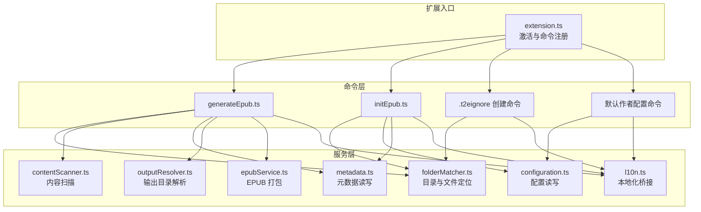
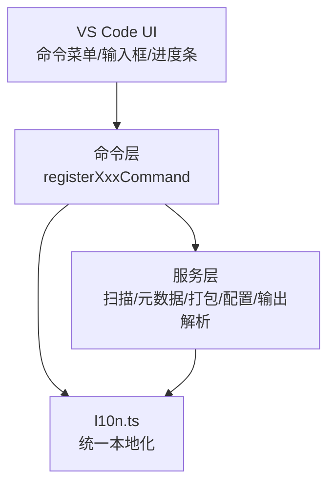
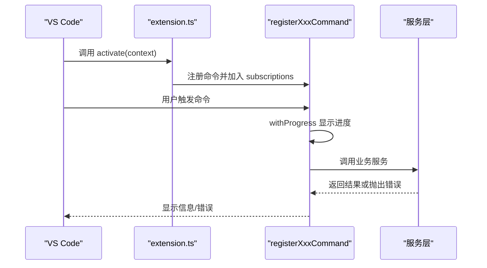
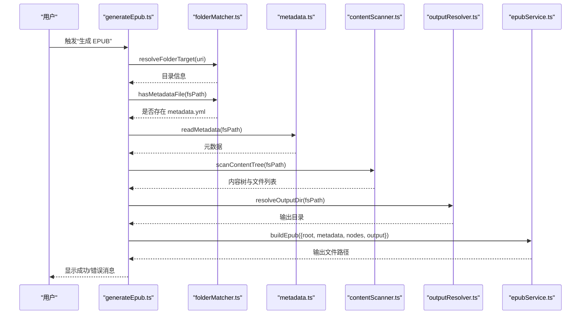
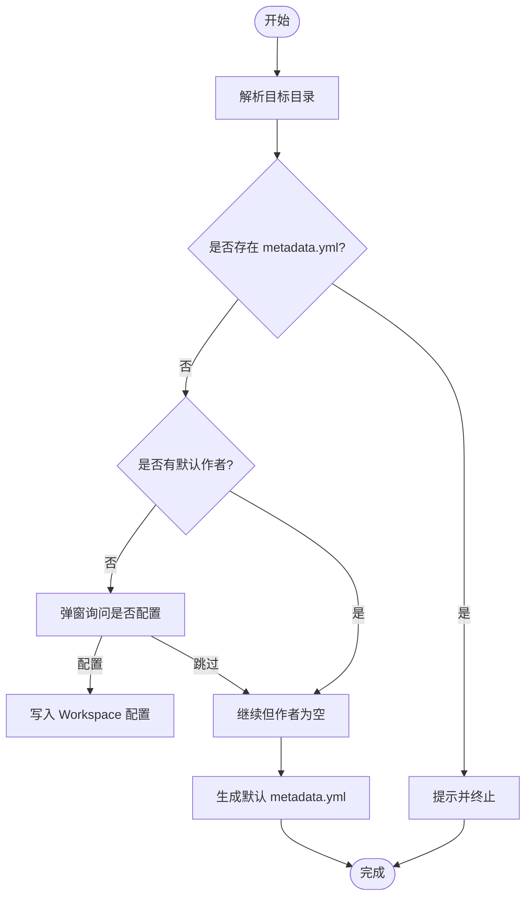
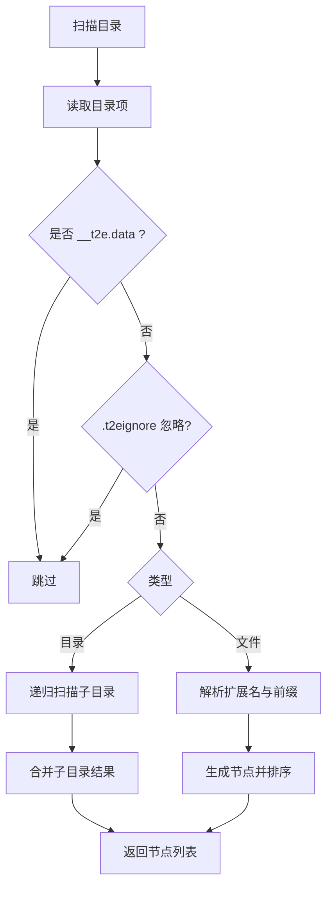
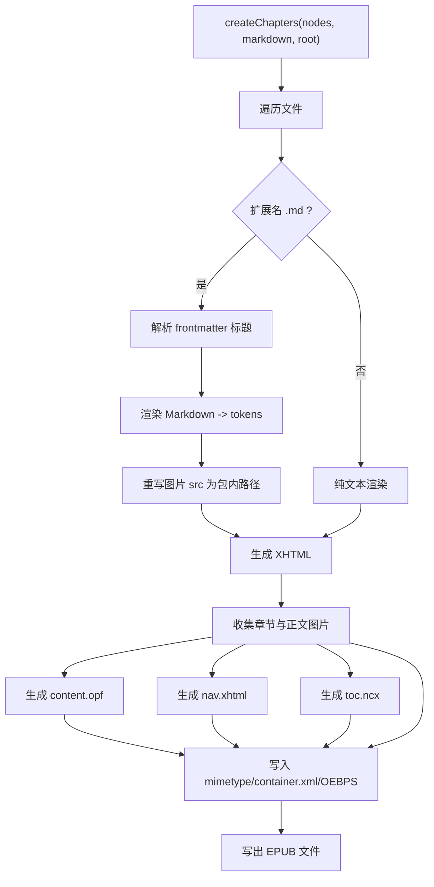
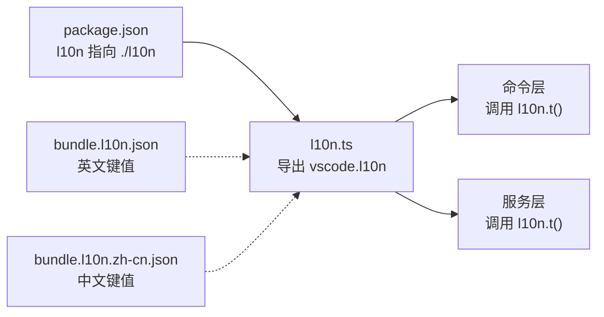
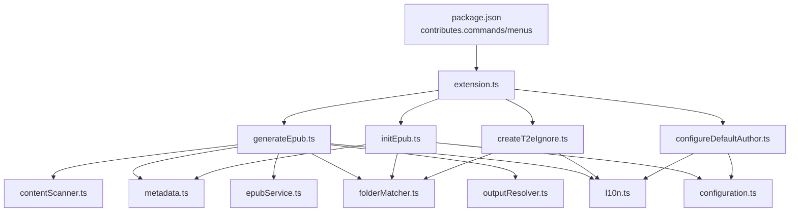

# 扩展架构设计

<cite>
**本文引用的文件**
- [package.json](file://package.json)
- [extension.ts](file://src/extension.ts)
- [generateEpub.ts](file://src/commands/generateEpub.ts)
- [initEpub.ts](file://src/commands/initEpub.ts)
- [createT2eIgnore.ts](file://src/commands/createT2eIgnore.ts)
- [configureDefaultAuthor.ts](file://src/commands/configureDefaultAuthor.ts)
- [epubService.ts](file://src/services/epubService.ts)
- [contentScanner.ts](file://src/services/contentScanner.ts)
- [metadata.ts](file://src/services/metadata.ts)
- [configuration.ts](file://src/services/configuration.ts)
- [folderMatcher.ts](file://src/services/folderMatcher.ts)
- [outputResolver.ts](file://src/services/outputResolver.ts)
- [l10n.ts](file://src/services/l10n.ts)
- [bundle.l10n.json](file://l10n/bundle.l10n.json)
- [bundle.l10n.zh-cn.json](file://l10n/bundle.l10n.zh-cn.json)
</cite>

## 目录
1. [简介](#简介)
2. [项目结构](#项目结构)
3. [核心组件](#核心组件)
4. [架构总览](#架构总览)
5. [详细组件分析](#详细组件分析)
6. [依赖分析](#依赖分析)
7. [性能考虑](#性能考虑)
8. [故障排查指南](#故障排查指南)
9. [结论](#结论)
10. [附录](#附录)

## 简介
本文件面向 VS Code 扩展“Folder2EPUB”的架构设计与实现进行系统化说明，重点覆盖以下主题：
- 扩展入口点设计：activate/deactivate 的职责与生命周期管理
- 命令注册模式：通过 ExtensionContext 管理命令生命周期
- 模块化设计：命令处理器与服务层的清晰分离
- VS Code 扩展 API 集成：ExtensionContext、命令注册、窗口与进度 API、配置 API 等
- 国际化支持：VS Code l10n 机制与本地化资源组织
- 生命周期最佳实践：资源清理、内存管理与异常处理

## 项目结构
项目采用“命令层 + 服务层”的模块化组织方式：
- 命令层（src/commands）：每个命令一个文件，职责单一，仅负责 UI 交互与流程编排
- 服务层（src/services）：封装业务能力（扫描、打包、元数据、配置、输出解析等）
- 扩展入口（src/extension.ts）：集中注册所有命令，交由 VS Code 生命周期托管
- 国际化（l10n）：VS Code l10n 与本地化资源文件

**图表来源**
- [extension.ts:13-23](file://src/extension.ts#L13-L23)
- [generateEpub.ts:18-65](file://src/commands/generateEpub.ts#L18-L65)
- [initEpub.ts:18-62](file://src/commands/initEpub.ts#L18-L62)
- [createT2eIgnore.ts:15-33](file://src/commands/createT2eIgnore.ts#L15-L33)
- [configureDefaultAuthor.ts:12-25](file://src/commands/configureDefaultAuthor.ts#L12-L25)
- [contentScanner.ts:51-58](file://src/services/contentScanner.ts#L51-L58)
- [metadata.ts:41-69](file://src/services/metadata.ts#L41-L69)
- [epubService.ts:146-216](file://src/services/epubService.ts#L146-L216)
- [configuration.ts:18-80](file://src/services/configuration.ts#L18-L80)
- [folderMatcher.ts:23-38](file://src/services/folderMatcher.ts#L23-L38)
- [outputResolver.ts:15-42](file://src/services/outputResolver.ts#L15-L42)
- [l10n.ts:9](file://src/services/l10n.ts#L9)

**章节来源**
- [package.json:43-96](file://package.json#L43-L96)
- [extension.ts:13-23](file://src/extension.ts#L13-L23)

## 核心组件
- 扩展入口与生命周期
  - activate：集中注册四个命令，将返回的 Disposable 对象加入 context.subscriptions，由 VS Code 在扩展停用时自动释放
  - deactivate：预留钩子，当前无需额外清理
- 命令注册模式
  - 每个命令导出 registerXxxCommand 函数，内部通过 vscode.commands.registerCommand 注册
  - 命令函数内部封装 UI 交互（输入框、警告/信息提示）、进度反馈与业务调用
- 服务层职责
  - contentScanner：扫描目录、解析数字前缀、构建树与线性文件列表
  - metadata：读写 metadata.yml、格式化标题与文件名
  - epubService：Markdown 渲染、图片资源处理、EPUB 3 打包（OPF/导航/NCX/CSS/图片）
  - configuration：Workspace 级默认作者配置读写
  - folderMatcher：校验目标目录、定位 __t2e.data 与 metadata.yml
  - outputResolver：解析 __epub.yml 的 saveTo，支持 ~ 展开
  - l10n：统一的本地化桥接，供业务层调用 l10n.t()

**章节来源**
- [extension.ts:13-23](file://src/extension.ts#L13-L23)
- [generateEpub.ts:18-65](file://src/commands/generateEpub.ts#L18-L65)
- [initEpub.ts:18-62](file://src/commands/initEpub.ts#L18-L62)
- [createT2eIgnore.ts:15-33](file://src/commands/createT2eIgnore.ts#L15-L33)
- [configureDefaultAuthor.ts:12-25](file://src/commands/configureDefaultAuthor.ts#L12-L25)
- [contentScanner.ts:51-58](file://src/services/contentScanner.ts#L51-L58)
- [metadata.ts:41-69](file://src/services/metadata.ts#L41-L69)
- [epubService.ts:146-216](file://src/services/epubService.ts#L146-L216)
- [configuration.ts:18-80](file://src/services/configuration.ts#L18-L80)
- [folderMatcher.ts:23-38](file://src/services/folderMatcher.ts#L23-L38)
- [outputResolver.ts:15-42](file://src/services/outputResolver.ts#L15-L42)
- [l10n.ts:9](file://src/services/l10n.ts#L9)

## 架构总览
整体采用“命令编排 + 服务解耦”的分层架构：
- 命令层仅负责用户交互与流程编排，不直接操作文件系统或网络
- 服务层封装具体业务逻辑，提供稳定接口，便于测试与复用
- VS Code API 通过 l10n、commands、window、workspace 等模块注入，统一由服务层桥接

**图表来源**
- [package.json:43-96](file://package.json#L43-L96)
- [extension.ts:13-23](file://src/extension.ts#L13-L23)
- [l10n.ts:9](file://src/services/l10n.ts#L9)

## 详细组件分析

### 命令注册与生命周期管理
- 命令注册模式
  - registerXxxCommand 返回 vscode.Disposable，由 activate 统一 push 到 context.subscriptions
  - 命令函数内部使用 withProgress 提供进度反馈，使用 window.showInformationMessage/showWarningMessage/showErrorMessage 进行消息提示
- 生命周期最佳实践
  - 通过 context.subscriptions 自动释放，无需手动 dispose
  - 错误通过统一的 toErrorMessage 转换后显示，避免泄露内部细节

**图表来源**
- [extension.ts:13-23](file://src/extension.ts#L13-L23)
- [generateEpub.ts:18-65](file://src/commands/generateEpub.ts#L18-L65)
- [initEpub.ts:18-62](file://src/commands/initEpub.ts#L18-L62)
- [createT2eIgnore.ts:15-33](file://src/commands/createT2eIgnore.ts#L15-L33)
- [configureDefaultAuthor.ts:12-25](file://src/commands/configureDefaultAuthor.ts#L12-L25)

**章节来源**
- [extension.ts:13-23](file://src/extension.ts#L13-L23)
- [generateEpub.ts:18-65](file://src/commands/generateEpub.ts#L18-L65)
- [initEpub.ts:18-62](file://src/commands/initEpub.ts#L18-L62)
- [createT2eIgnore.ts:15-33](file://src/commands/createT2eIgnore.ts#L15-L33)
- [configureDefaultAuthor.ts:12-25](file://src/commands/configureDefaultAuthor.ts#L12-L25)

### 生成 EPUB 流程（端到端）
- 流程步骤
  - 解析目标目录
  - 校验 metadata.yml 存在
  - 读取元数据、扫描内容、解析输出目录
  - 调用 epubService 打包 EPUB
  - 成功/失败消息提示
- 关键服务
  - folderMatcher：resolveFolderTarget、hasMetadataFile
  - metadata：readMetadata、formatBookFileName
  - contentScanner：scanContentTree
  - outputResolver：resolveOutputDir
  - epubService：buildEpub

**图表来源**
- [generateEpub.ts:19-57](file://src/commands/generateEpub.ts#L19-L57)
- [folderMatcher.ts:23-38](file://src/services/folderMatcher.ts#L23-L38)
- [metadata.ts:41-69](file://src/services/metadata.ts#L41-L69)
- [contentScanner.ts:51-58](file://src/services/contentScanner.ts#L51-L58)
- [outputResolver.ts:15-42](file://src/services/outputResolver.ts#L15-L42)
- [epubService.ts:146-216](file://src/services/epubService.ts#L146-L216)

**章节来源**
- [generateEpub.ts:18-65](file://src/commands/generateEpub.ts#L18-L65)

### 初始化 EPUB 流程
- 流程步骤
  - 解析目标目录
  - 若已存在 metadata.yml 则终止
  - 读取默认作者（可交互配置）
  - 生成默认 metadata.yml
  - 成功/失败消息提示

**图表来源**
- [initEpub.ts:19-61](file://src/commands/initEpub.ts#L19-L61)
- [configuration.ts:47-79](file://src/services/configuration.ts#L47-L79)
- [folderMatcher.ts:82-84](file://src/services/folderMatcher.ts#L82-L84)

**章节来源**
- [initEpub.ts:18-62](file://src/commands/initEpub.ts#L18-L62)

### 内容扫描与排序算法
- 数字前缀解析与自然排序
  - 支持形如“001_章节名”的数字前缀，优先按数字排序，其次按中文名称排序
  - 目录索引文件（index）优先作为目录跳转目标
- 目录扫描策略
  - 忽略 __t2e.data 与非 md/txt 文件
  - 支持 .t2eignore 局部规则叠加

**图表来源**
- [contentScanner.ts:258-329](file://src/services/contentScanner.ts#L258-L329)
- [contentScanner.ts:191-238](file://src/services/contentScanner.ts#L191-L238)

**章节来源**
- [contentScanner.ts:51-58](file://src/services/contentScanner.ts#L51-L58)
- [contentScanner.ts:258-329](file://src/services/contentScanner.ts#L258-L329)

### EPUB 打包与资源处理
- 打包流程
  - 解析 Markdown frontmatter，提取标题
  - 渲染 Markdown 为 XHTML，替换图片为包内路径
  - 生成 OPF、导航页、NCX、CSS 与封面
  - 使用 JSZip 压缩并写出 EPUB 文件
- 资源处理
  - 支持 jpg/png/gif/svg/webp 封面与正文图片
  - 校验封面存在性、类型与路径合法性

**图表来源**
- [epubService.ts:494-544](file://src/services/epubService.ts#L494-L544)
- [epubService.ts:146-216](file://src/services/epubService.ts#L146-L216)
- [epubService.ts:604-633](file://src/services/epubService.ts#L604-L633)

**章节来源**
- [epubService.ts:146-216](file://src/services/epubService.ts#L146-L216)
- [epubService.ts:494-544](file://src/services/epubService.ts#L494-L544)
- [epubService.ts:604-633](file://src/services/epubService.ts#L604-L633)

### 国际化支持架构
- VS Code l10n 集成
  - package.json 设置 "l10n": "./l10n"
  - 业务层通过 src/services/l10n.ts 暴露统一的 l10n 对象
  - 所有 UI 文案均通过 l10n.t() 获取，确保静态提取与回退机制正常工作
- 本地化资源
  - bundle.l10n.json：默认英文键值
  - bundle.l10n.zh-cn.json：中文翻译键值
- 使用方式
  - 命令层与服务层均通过 l10n.t() 获取文案，避免硬编码字符串

**图表来源**
- [package.json:11](file://package.json#L11)
- [l10n.ts:9](file://src/services/l10n.ts#L9)
- [bundle.l10n.json:1-50](file://l10n/bundle.l10n.json#L1-50)
- [bundle.l10n.zh-cn.json:1-50](file://l10n/bundle.l10n.zh-cn.json#L1-50)

**章节来源**
- [package.json:11](file://package.json#L11)
- [l10n.ts:9](file://src/services/l10n.ts#L9)
- [bundle.l10n.json:1-50](file://l10n/bundle.l10n.json#L1-50)
- [bundle.l10n.zh-cn.json:1-50](file://l10n/bundle.l10n.zh-cn.json#L1-50)

## 依赖分析
- 命令层依赖
  - 依赖服务层各模块接口，不直接依赖第三方库
  - 依赖 l10n.ts 提供本地化
- 服务层依赖
  - Node fs/path/os/yaml/jszip/markdown-it 等库
  - 通过 folderMatcher 统一文件系统访问
  - 通过 l10n.t() 统一本地化
- 扩展贡献
  - package.json 中声明 commands、configuration、menus，绑定命令与 UI

**图表来源**
- [package.json:43-96](file://package.json#L43-L96)
- [extension.ts:13-23](file://src/extension.ts#L13-L23)
- [generateEpub.ts:5-11](file://src/commands/generateEpub.ts#L5-L11)
- [initEpub.ts:4-8](file://src/commands/initEpub.ts#L4-L8)
- [createT2eIgnore.ts:6](file://src/commands/createT2eIgnore.ts#L6)
- [configureDefaultAuthor.ts:3-5](file://src/commands/configureDefaultAuthor.ts#L3-L5)

**章节来源**
- [package.json:43-96](file://package.json#L43-L96)
- [extension.ts:13-23](file://src/extension.ts#L13-L23)

## 性能考虑
- I/O 优化
  - 扫描阶段一次性读取目录项，避免重复 I/O
  - 打包阶段批量收集资源，减少多次压缩写入
- 渲染与解析
  - Markdown 渲染与图片重写在内存中完成，注意大文件时的内存占用
  - 图片媒体类型映射与封面校验在打包前完成，避免无效写入
- 进度反馈
  - 使用 withProgress 分阶段报告，提升用户体验

## 故障排查指南
- 常见问题与定位
  - 目录非本地或非目录：检查 resolveFolderTarget 的错误提示
  - 缺少 metadata.yml：检查 initEpub 是否执行
  - 无 md/txt 文件：确认扫描规则与 .t2eignore 配置
  - 输出目录解析失败：检查 __epub.yml 的 saveTo 配置与路径展开
  - 封面缺失/非文件/格式不支持：检查 __t2e.data 下封面文件与类型
- 错误处理
  - 命令层统一捕获异常并通过 l10n.t() 显示友好错误
  - 通过 toErrorMessage 将错误标准化，避免泄露内部细节

**章节来源**
- [generateEpub.ts:23-26](file://src/commands/generateEpub.ts#L23-L26)
- [initEpub.ts:23-26](file://src/commands/initEpub.ts#L23-L26)
- [outputResolver.ts:15-42](file://src/services/outputResolver.ts#L15-L42)
- [epubService.ts:604-633](file://src/services/epubService.ts#L604-L633)

## 结论
本扩展通过清晰的命令层与服务层分离，结合 VS Code 的 l10n 与生命周期管理机制，实现了稳定、可维护且易扩展的 EPUB 生成能力。建议在后续迭代中：
- 增加单元测试覆盖核心服务（扫描、元数据、打包）
- 支持更多图片格式与封面类型
- 提供更细粒度的进度与日志输出

## 附录
- VS Code 扩展 API 使用要点
  - ExtensionContext：用于注册命令、订阅事件、管理生命周期
  - commands.registerCommand：注册命令，返回 Disposable
  - window.withProgress：提供进度反馈
  - workspace.getConfiguration：读取配置（如默认作者）
  - l10n.t：统一本地化文案获取