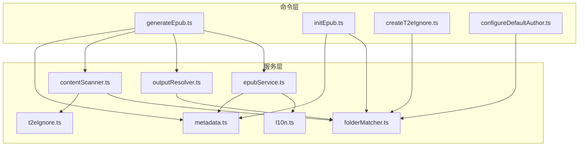
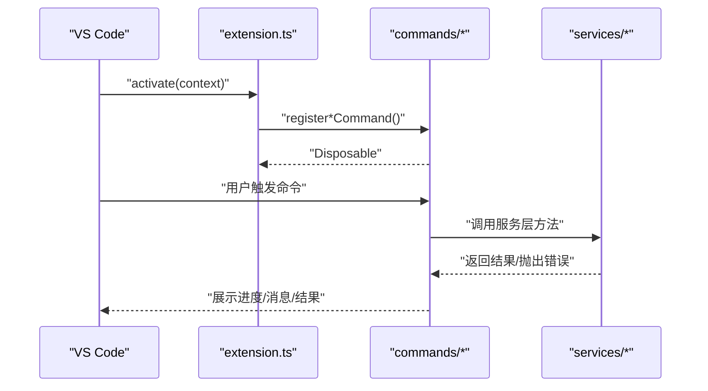
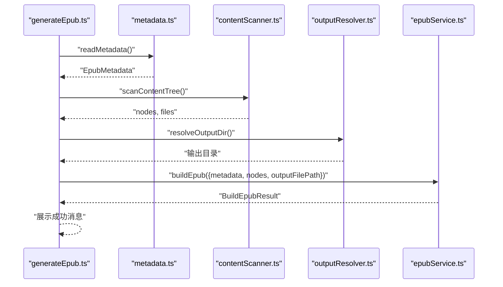
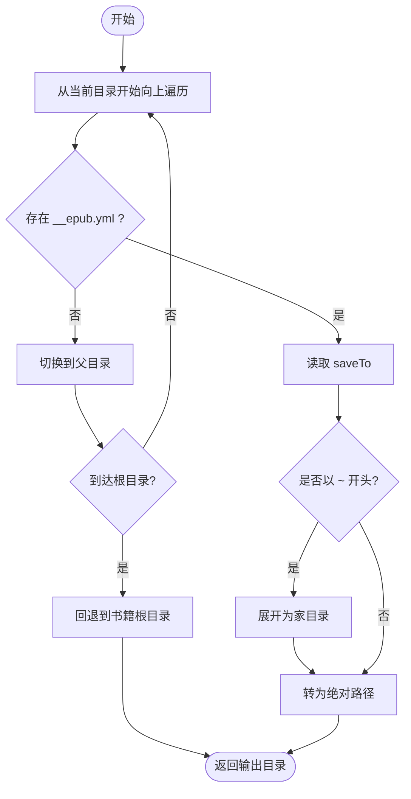
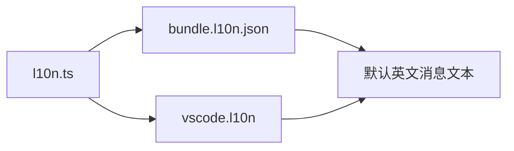
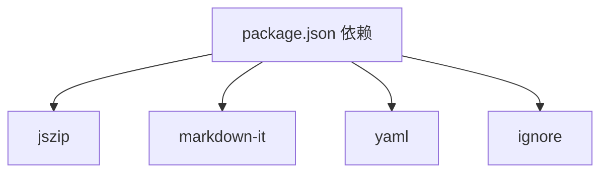
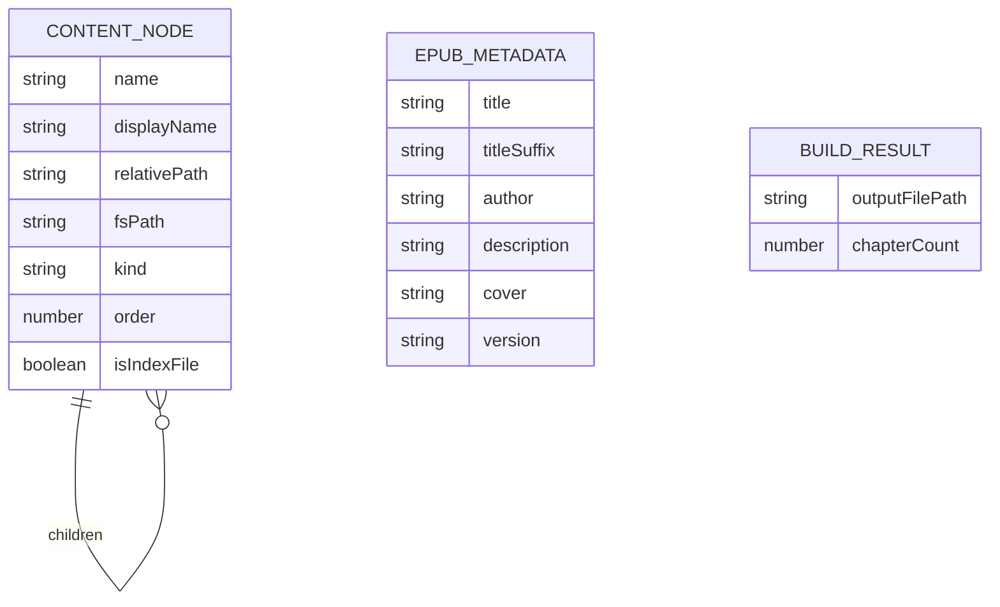

# 技术架构详解

<cite>
**本文引用的文件**
- [package.json](file://package.json)
- [extension.ts](file://src/extension.ts)
- [contentScanner.ts](file://src/services/contentScanner.ts)
- [epubService.ts](file://src/services/epubService.ts)
- [configuration.ts](file://src/services/configuration.ts)
- [outputResolver.ts](file://src/services/outputResolver.ts)
- [l10n.ts](file://src/services/l10n.ts)
- [metadata.ts](file://src/services/metadata.ts)
- [folderMatcher.ts](file://src/services/folderMatcher.ts)
- [t2eIgnore.ts](file://src/services/t2eIgnore.ts)
- [generateEpub.ts](file://src/commands/generateEpub.ts)
- [initEpub.ts](file://src/commands/initEpub.ts)
- [createT2eIgnore.ts](file://src/commands/createT2eIgnore.ts)
- [configureDefaultAuthor.ts](file://src/commands/configureDefaultAuthor.ts)
- [bundle.l10n.json](file://l10n/bundle.l10n.json)
</cite>

## 目录
1. [简介](#简介)
2. [项目结构](#项目结构)
3. [核心组件](#核心组件)
4. [架构总览](#架构总览)
5. [详细组件分析](#详细组件分析)
6. [依赖分析](#依赖分析)
7. [性能考量](#性能考量)
8. [故障排查指南](#故障排查指南)
9. [结论](#结论)
10. [附录](#附录)

## 简介
本文件面向 VS Code 扩展 Folder2EPUB 的技术架构，系统性阐述模块化设计、服务层架构、命令模式实现、扩展入口点工作机制、内容扫描系统、EPUB 构建系统、路径解析与输出管理、国际化支持，以及数据流与组件交互关系。文档同时提供系统边界图与组件分解图，帮助开发者快速理解与维护。

## 项目结构
- 扩展入口位于 src/extension.ts，通过 activate 注册四个命令。
- 命令层位于 src/commands，封装用户交互与流程编排。
- 服务层位于 src/services，包含内容扫描、EPUB 构建、元数据、输出解析、忽略规则、本地化等。
- 国际化资源位于 l10n，配合 VS Code l10n 机制。
- 示例与配置位于 example，包含忽略规则、元数据示例与输出配置。

图表来源
- [extension.ts:1-24](file://src/extension.ts#L1-L24)
- [generateEpub.ts:1-66](file://src/commands/generateEpub.ts#L1-L66)
- [initEpub.ts:1-63](file://src/commands/initEpub.ts#L1-L63)
- [createT2eIgnore.ts:1-34](file://src/commands/createT2eIgnore.ts#L1-L34)
- [configureDefaultAuthor.ts:1-26](file://src/commands/configureDefaultAuthor.ts#L1-L26)
- [contentScanner.ts:1-340](file://src/services/contentScanner.ts#L1-L340)
- [epubService.ts:1-800](file://src/services/epubService.ts#L1-L800)
- [metadata.ts:1-157](file://src/services/metadata.ts#L1-L157)
- [outputResolver.ts:1-90](file://src/services/outputResolver.ts#L1-L90)
- [t2eIgnore.ts:1-45](file://src/services/t2eIgnore.ts#L1-L45)
- [l10n.ts:1-10](file://src/services/l10n.ts#L1-L10)

章节来源
- [package.json:1-114](file://package.json#L1-L114)
- [extension.ts:1-24](file://src/extension.ts#L1-L24)

## 核心组件
- 扩展入口与生命周期
  - activate 中注册四个命令，生命周期钩子简洁，职责清晰。
- 命令层
  - generateEpub：串联元数据读取、内容扫描、输出解析、EPUB 构建与进度提示。
  - initEpub：创建 __t2e.data/metadata.yml，支持默认作者配置。
  - createT2eIgnore：在目录下创建 .t2eignore。
  - configureDefaultAuthor：交互式设置当前工作区默认作者。
- 服务层
  - contentScanner：目录扫描、文件类型识别、排序规则、index 文件策略。
  - epubService：EPUB 3 构建、HTML 渲染、资源管理、OPF/导航/NCX 生成、ZIP 打包。
  - metadata：元数据读取、默认模板、显示标题与文件名格式化。
  - outputResolver：自上而下查找 __epub.yml 并解析 saveTo 输出目录。
  - folderMatcher：目标目录校验、元数据路径计算、存在性判断。
  - t2eIgnore：.t2eignore 规则读取与 ignore 过滤器构建。
  - l10n：统一的 VS Code 本地化对象。
- 国际化
  - l10n 资源文件提供默认英文与中文键值，配合 VS Code l10n 机制。

章节来源
- [extension.ts:13-23](file://src/extension.ts#L13-L23)
- [generateEpub.ts:18-65](file://src/commands/generateEpub.ts#L18-L65)
- [initEpub.ts:18-62](file://src/commands/initEpub.ts#L18-L62)
- [createT2eIgnore.ts:15-33](file://src/commands/createT2eIgnore.ts#L15-L33)
- [configureDefaultAuthor.ts:12-25](file://src/commands/configureDefaultAuthor.ts#L12-L25)
- [contentScanner.ts:51-340](file://src/services/contentScanner.ts#L51-L340)
- [epubService.ts:146-216](file://src/services/epubService.ts#L146-L216)
- [metadata.ts:41-117](file://src/services/metadata.ts#L41-L117)
- [outputResolver.ts:15-90](file://src/services/outputResolver.ts#L15-L90)
- [folderMatcher.ts:23-84](file://src/services/folderMatcher.ts#L23-L84)
- [t2eIgnore.ts:13-44](file://src/services/t2eIgnore.ts#L13-L44)
- [l10n.ts:9-9](file://src/services/l10n.ts#L9-L9)
- [bundle.l10n.json:1-50](file://l10n/bundle.l10n.json#L1-L50)

## 架构总览
- 模块化设计原则
  - 命令层仅负责编排与 UI 交互，业务逻辑下沉至服务层，提升可测试性与复用性。
  - 服务层内部进一步细分关注点，降低耦合度。
- 服务层架构
  - 采用纯函数与不可变数据结构，便于单元测试与演进。
  - 通过接口与类型约束（如 ContentNode、EpubMetadata）保证契约清晰。
- 命令模式实现
  - 每个命令注册为独立 Disposable，便于生命周期管理与资源回收。
  - 命令内部使用 withProgress 提供进度反馈，改善用户体验。
- VS Code API 集成
  - 通过 commands.registerCommand、workspace、window、l10n 等 API 完成功能集成。
  - 菜单贡献基于 explorer/context，限定执行范围（本地文件夹）。

图表来源
- [generateEpub.ts:18-65](file://src/commands/generateEpub.ts#L18-L65)
- [initEpub.ts:18-62](file://src/commands/initEpub.ts#L18-L62)
- [createT2eIgnore.ts:15-33](file://src/commands/createT2eIgnore.ts#L15-L33)
- [configureDefaultAuthor.ts:12-25](file://src/commands/configureDefaultAuthor.ts#L12-L25)
- [contentScanner.ts:51-340](file://src/services/contentScanner.ts#L51-L340)
- [epubService.ts:146-216](file://src/services/epubService.ts#L146-L216)
- [metadata.ts:41-117](file://src/services/metadata.ts#L41-L117)
- [outputResolver.ts:15-90](file://src/services/outputResolver.ts#L15-L90)
- [folderMatcher.ts:23-84](file://src/services/folderMatcher.ts#L23-L84)
- [t2eIgnore.ts:13-44](file://src/services/t2eIgnore.ts#L13-L44)
- [l10n.ts:9-9](file://src/services/l10n.ts#L9-L9)

## 详细组件分析

### 扩展入口与命令注册
- activate 将四个命令注册到 VS Code 上下文，统一纳入 context.subscriptions 管理。
- 命令注册均返回 Disposable，便于扩展停用或重载时自动释放。

图表来源
- [extension.ts:13-17](file://src/extension.ts#L13-L17)
- [generateEpub.ts:18-65](file://src/commands/generateEpub.ts#L18-L65)
- [initEpub.ts:18-62](file://src/commands/initEpub.ts#L18-L62)
- [createT2eIgnore.ts:15-33](file://src/commands/createT2eIgnore.ts#L15-L33)
- [configureDefaultAuthor.ts:12-25](file://src/commands/configureDefaultAuthor.ts#L12-L25)

章节来源
- [extension.ts:13-23](file://src/extension.ts#L13-L23)
- [package.json:43-96](file://package.json#L43-L96)

### 内容扫描系统
- 功能要点
  - 目录遍历：递归扫描，忽略 __t2e.data 与 .t2eignore 规则，仅保留包含有效文件的目录节点。
  - 文件类型识别：仅支持 .md 与 .txt。
  - 排序规则：优先数字前缀，其次中文友好自然排序；同名目录优先于文件。
  - index 文件策略：优先使用当前目录直接的 index 文件，否则递归查找首个可用 index。
  - 拍平文件：将树状节点拍平为线性文件列表，用于后续编号与导航。
- 关键接口
  - scanContentTree：入口，返回 nodes 与 files。
  - compareNodes/compareByName：排序比较。
  - findIndexFile/findFirstFile：index 查找与回退策略。
  - flattenFiles：拍平。
  - parseOrderedName：数字前缀解析与展示名清洗。

图表来源
- [contentScanner.ts:258-329](file://src/services/contentScanner.ts#L258-L329)
- [contentScanner.ts:67-105](file://src/services/contentScanner.ts#L67-L105)
- [contentScanner.ts:113-161](file://src/services/contentScanner.ts#L113-L161)
- [contentScanner.ts:169-182](file://src/services/contentScanner.ts#L169-L182)
- [contentScanner.ts:191-238](file://src/services/contentScanner.ts#L191-L238)
- [t2eIgnore.ts:13-26](file://src/services/t2eIgnore.ts#L13-L26)

章节来源
- [contentScanner.ts:51-340](file://src/services/contentScanner.ts#L51-L340)
- [t2eIgnore.ts:13-44](file://src/services/t2eIgnore.ts#L13-L44)

### EPUB 构建系统
- 功能要点
  - Markdown 渲染：使用 markdown-it，启用 html、linkify、breaks、xhtmlOut。
  - 章节生成：将线性文件列表映射为章节，分配编号与标题，生成 XHTML。
  - 资源管理：收集正文内图片，统一媒体类型与 href，封面可选。
  - 目录与导航：生成 nav.xhtml（EPUB 3 导航）与 toc.ncx（兼容旧阅读器），构建树状导航。
  - OPF 与打包：生成 content.opf，写入 mimetype/container.xml/META-INF，OEBPS/text/styles 下写入资源，最终 ZIP 打包。
- 关键接口
  - buildEpub：主流程入口，返回章节数量与输出路径。
  - createChapters：线性文件转章节，收集图片。
  - createContentOpf/createNavXhtml/createTocNcx：生成核心元数据与导航文件。
  - loadCoverAsset/getMediaType：封面加载与媒体类型映射。
  - escapeXml/indentLines：XML 转义与缩进辅助。

图表来源
- [generateEpub.ts:36-56](file://src/commands/generateEpub.ts#L36-L56)
- [metadata.ts:41-59](file://src/services/metadata.ts#L41-L59)
- [contentScanner.ts:51-58](file://src/services/contentScanner.ts#L51-L58)
- [outputResolver.ts:15-42](file://src/services/outputResolver.ts#L15-L42)
- [epubService.ts:146-216](file://src/services/epubService.ts#L146-L216)

章节来源
- [epubService.ts:146-800](file://src/services/epubService.ts#L146-L800)
- [metadata.ts:8-15](file://src/services/metadata.ts#L8-L15)

### 路径解析与输出管理
- 自上而下查找 __epub.yml，解析 saveTo：
  - 支持相对路径与 ~ 家目录展开。
  - 未找到配置时回退到书籍根目录。
- 与 folderMatcher 协作，确保路径存在与类型正确。

图表来源
- [outputResolver.ts:15-90](file://src/services/outputResolver.ts#L15-L90)
- [folderMatcher.ts:66-84](file://src/services/folderMatcher.ts#L66-L84)

章节来源
- [outputResolver.ts:15-90](file://src/services/outputResolver.ts#L15-L90)
- [folderMatcher.ts:11-15](file://src/services/folderMatcher.ts#L11-L15)

### 国际化支持
- 本地化对象：l10n.ts 直接导出 vscode.l10n，业务代码统一调用 l10n.t()。
- 资源文件：bundle.l10n.json 提供英文与中文键值，键为默认英文消息文本。
- VS Code 集成：package.json 设置 l10n 目录，扩展发布后由 VS Code 进行回退与回译。

图表来源
- [l10n.ts:9-9](file://src/services/l10n.ts#L9-L9)
- [bundle.l10n.json:1-50](file://l10n/bundle.l10n.json#L1-50)
- [package.json:11-11](file://package.json#L11-L11)

章节来源
- [l10n.ts:9-9](file://src/services/l10n.ts#L9-L9)
- [bundle.l10n.json:1-50](file://l10n/bundle.l10n.json#L1-L50)
- [package.json:11-11](file://package.json#L11-L11)

## 依赖分析
- 外部依赖
  - jszip：EPUB 打包。
  - markdown-it：Markdown 渲染。
  - yaml：YAML 解析与序列化。
  - ignore：.t2eignore 规则解析与过滤。
- 内部依赖关系
  - 命令层依赖服务层；服务层之间低耦合，主要通过接口与类型通信。
  - contentScanner 依赖 t2eIgnore 与 folderMatcher；epubService 依赖 metadata、l10n 与 folderMatcher；outputResolver 依赖 folderMatcher。

图表来源
- [package.json:97-112](file://package.json#L97-L112)

章节来源
- [package.json:97-112](file://package.json#L97-L112)

## 性能考量
- 目录扫描
  - 递归遍历与排序为 O(n log n) 主要瓶颈，建议对超大目录启用 .t2eignore 控制范围。
- Markdown 渲染
  - markdown-it 为纯 JavaScript，渲染复杂度与内容规模线性相关；建议避免单文件过大。
- 资源处理
  - 图片收集与媒体类型判定为线性扫描；建议限制封面与正文图片数量与尺寸。
- I/O 与压缩
  - ZIP 生成为内存密集型操作，建议在大型 EPUB 时注意内存占用与磁盘空间。

## 故障排查指南
- 常见错误与定位
  - 缺少 __t2e.data/metadata.yml：initEpub 未执行或文件被删除。
  - 无可用 md/txt 文件：检查 .t2eignore 与文件扩展名。
  - 输出目录解析失败：检查 __epub.yml 与 saveTo 配置。
  - 封面文件异常：确认封面路径、类型与存在性。
- 错误处理策略
  - 命令层使用 try/catch 与错误消息包装，统一提示用户。
  - 服务层在关键步骤抛出明确错误，便于定位问题。

章节来源
- [generateEpub.ts:23-26](file://src/commands/generateEpub.ts#L23-L26)
- [generateEpub.ts:41-43](file://src/commands/generateEpub.ts#L41-L43)
- [outputResolver.ts:15-42](file://src/services/outputResolver.ts#L15-L42)
- [epubService.ts:604-633](file://src/services/epubService.ts#L604-L633)
- [bundle.l10n.json:30-49](file://l10n/bundle.l10n.json#L30-L49)

## 结论
本架构以命令层编排、服务层内聚为核心，结合 VS Code API 与本地化机制，实现了从目录扫描到 EPUB 3 打包的完整链路。模块化与低耦合的设计提升了可维护性与可扩展性；通过 .t2eignore 与 __epub.yml 的配置能力，满足不同场景的输出需求。建议在大规模内容场景下优化 I/O 与内存使用，并完善测试覆盖以保障稳定性。

## 附录
- 数据模型（简化）
  - ContentNode：文件与目录节点，包含排序、显示名、相对路径等。
  - EpubMetadata：标题、作者、描述、封面、版本等。
  - BuildEpubResult：输出文件路径与章节计数。

图表来源
- [contentScanner.ts:10-38](file://src/services/contentScanner.ts#L10-L38)
- [metadata.ts:8-15](file://src/services/metadata.ts#L8-L15)
- [epubService.ts:100-103](file://src/services/epubService.ts#L100-L103)