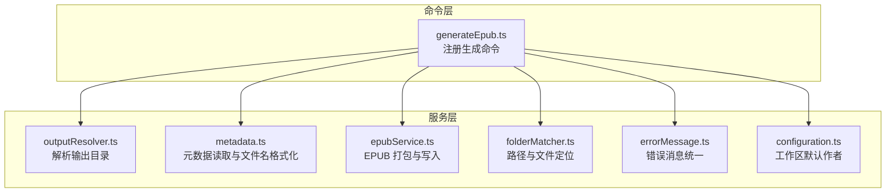
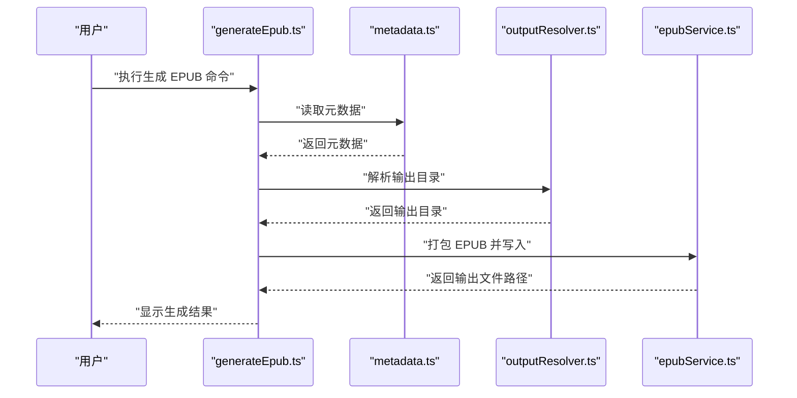
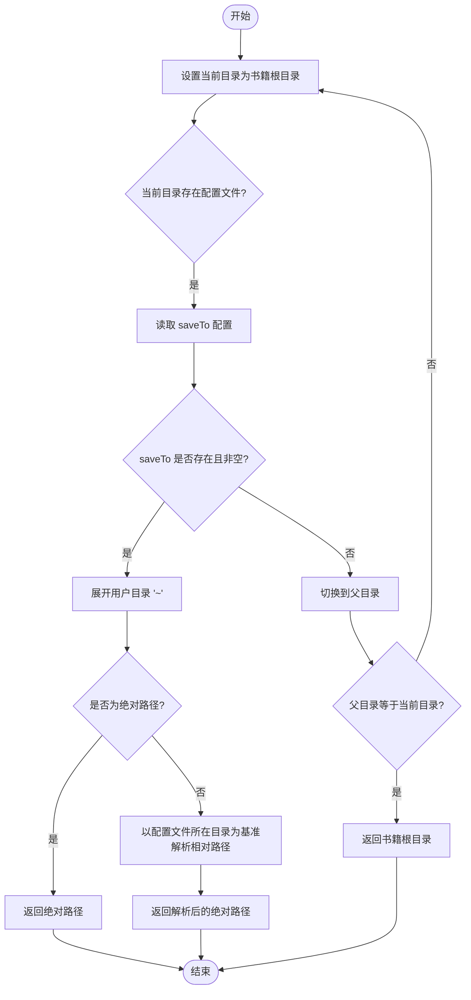
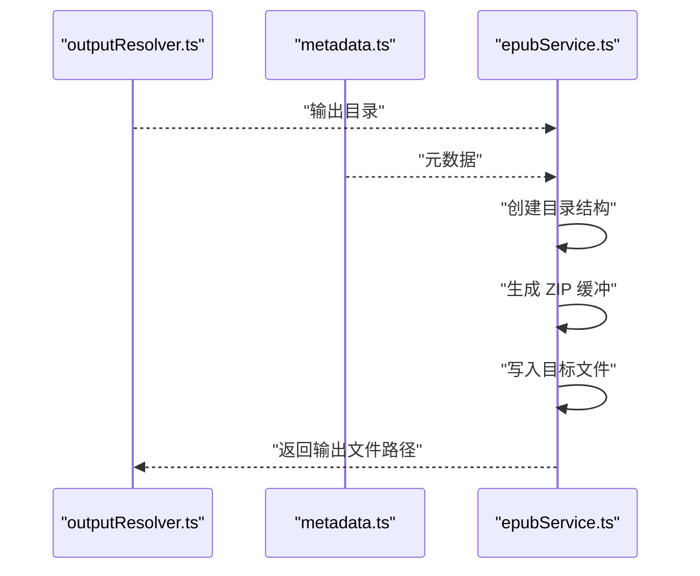
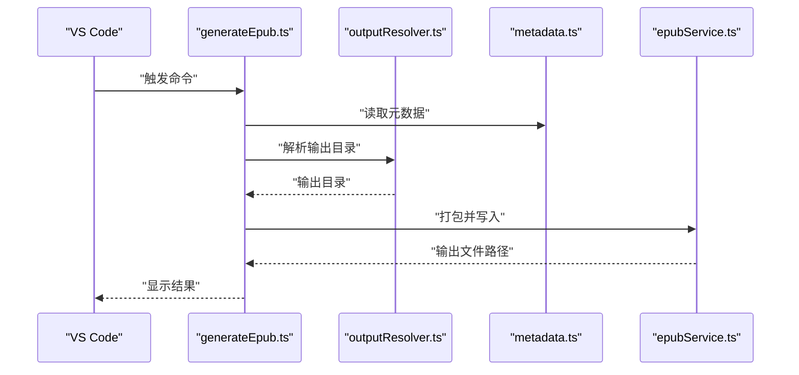
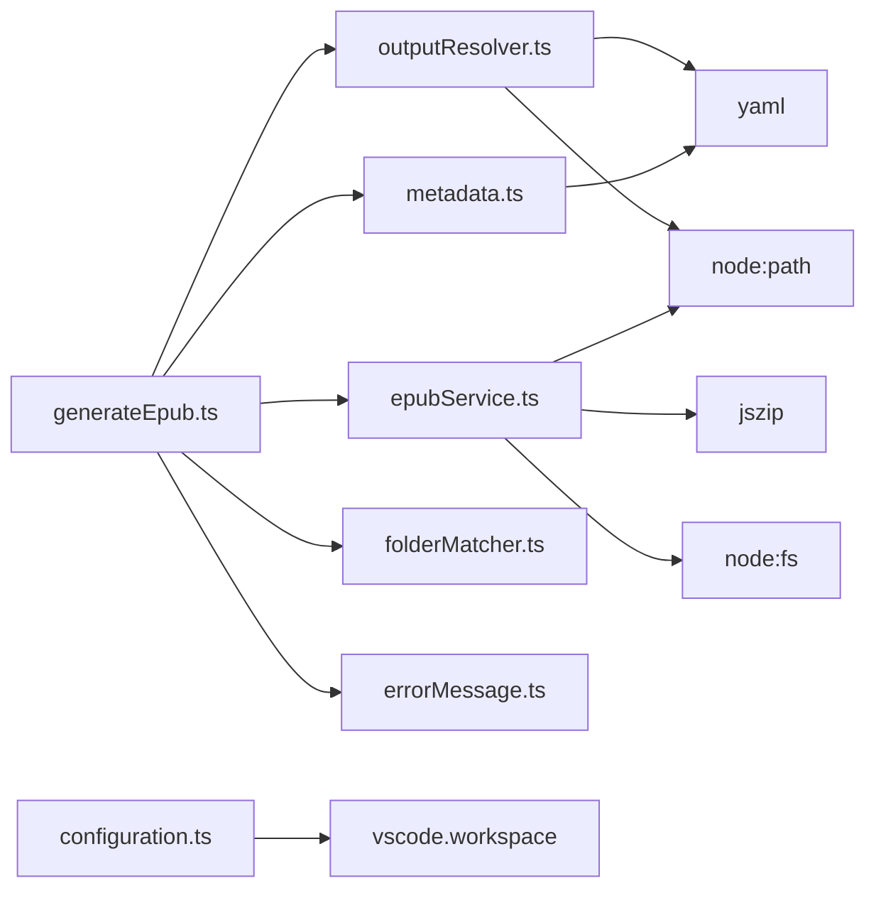

# 输出路径解析系统

<cite>
**本文引用的文件**
- [src/services/outputResolver.ts](file://src/services/outputResolver.ts)
- [src/commands/generateEpub.ts](file://src/commands/generateEpub.ts)
- [src/services/metadata.ts](file://src/services/metadata.ts)
- [src/services/folderMatcher.ts](file://src/services/folderMatcher.ts)
- [src/services/epubService.ts](file://src/services/epubService.ts)
- [src/services/errorMessage.ts](file://src/services/errorMessage.ts)
- [src/services/configuration.ts](file://src/services/configuration.ts)
- [test/output-resolver.test.cjs](file://test/output-resolver.test.cjs)
- [example/__epub.yml](file://example/__epub.yml)
- [example/init-folder/__t2e.data/metadata.yml](file://example/init-folder/__t2e.data/metadata.yml)
- [package.json](file://package.json)
- [README.md](file://README.md)
</cite>

## 目录
1. [简介](#简介)
2. [项目结构](#项目结构)
3. [核心组件](#核心组件)
4. [架构总览](#架构总览)
5. [详细组件分析](#详细组件分析)
6. [依赖关系分析](#依赖关系分析)
7. [性能考量](#性能考量)
8. [故障排除指南](#故障排除指南)
9. [结论](#结论)
10. [附录](#附录)

## 简介
本文件聚焦“输出路径解析系统”，系统性阐述路径解析机制的实现原理与工程实践，涵盖：
- 输入路径的标准化与规范化
- 相对路径的转换与解析基准
- 绝对路径的处理与用户目录展开
- 输出目录的确定逻辑（默认输出位置、用户自定义路径、工作区级别配置）
- 文件命名规则（EPUB 文件名生成、重复文件处理、特殊字符处理）
- 路径冲突解决机制（覆盖策略、备份机制、错误处理）
- 跨平台兼容性处理（路径分隔符、大小写敏感性、文件系统限制）
- 调试与故障排除（日志记录、错误诊断、性能监控）
- 路径解析流程图与配置示例

## 项目结构
围绕输出路径解析的关键模块与职责如下：
- 命令层：负责触发生成流程，串联元数据读取、内容扫描、输出目录解析与打包。
- 服务层：
  - 输出解析：自上而下查找配置文件并解析输出目录。
  - 元数据：读取与格式化元数据，生成 EPUB 文件名。
  - 打包：创建 EPUB 文件并写入目标路径。
  - 错误消息：统一错误信息呈现。
  - 配置：工作区默认作者配置。
- 工具与约定：路径工具、文件名清洗、相对路径标准化。

图表来源
- [src/commands/generateEpub.ts:18-66](file://src/commands/generateEpub.ts#L18-L66)
- [src/services/outputResolver.ts:15-90](file://src/services/outputResolver.ts#L15-L90)
- [src/services/metadata.ts:41-157](file://src/services/metadata.ts#L41-L157)
- [src/services/epubService.ts:203-216](file://src/services/epubService.ts#L203-L216)
- [src/services/folderMatcher.ts:23-84](file://src/services/folderMatcher.ts#L23-L84)
- [src/services/errorMessage.ts:9-16](file://src/services/errorMessage.ts#L9-L16)
- [src/services/configuration.ts:18-80](file://src/services/configuration.ts#L18-L80)

章节来源
- [src/commands/generateEpub.ts:18-66](file://src/commands/generateEpub.ts#L18-L66)
- [src/services/outputResolver.ts:15-90](file://src/services/outputResolver.ts#L15-L90)
- [src/services/metadata.ts:41-157](file://src/services/metadata.ts#L41-L157)
- [src/services/epubService.ts:203-216](file://src/services/epubService.ts#L203-L216)
- [src/services/folderMatcher.ts:23-84](file://src/services/folderMatcher.ts#L23-L84)
- [src/services/errorMessage.ts:9-16](file://src/services/errorMessage.ts#L9-L16)
- [src/services/configuration.ts:18-80](file://src/services/configuration.ts#L18-L80)

## 核心组件
- 输出目录解析器：自当前书籍目录向上查找配置文件，解析 saveTo，支持相对路径与用户目录展开。
- 元数据与文件名：读取元数据，生成 EPUB 文件名，并清洗非法字符。
- EPUB 打包与写入：创建目录结构，生成 ZIP，写入目标文件路径。
- 错误消息统一：将异常转换为可读消息。
- 工作区默认作者：通过 VS Code 配置保存默认作者，影响元数据初始化。

章节来源
- [src/services/outputResolver.ts:15-90](file://src/services/outputResolver.ts#L15-L90)
- [src/services/metadata.ts:41-157](file://src/services/metadata.ts#L41-L157)
- [src/services/epubService.ts:203-216](file://src/services/epubService.ts#L203-L216)
- [src/services/errorMessage.ts:9-16](file://src/services/errorMessage.ts#L9-L16)
- [src/services/configuration.ts:18-80](file://src/services/configuration.ts#L18-L80)

## 架构总览
输出路径解析贯穿“命令 -> 解析 -> 打包”的主干流程，关键步骤：
- 命令触发后，先读取元数据与扫描内容。
- 解析输出目录：自书籍根目录向上查找配置文件，解析 saveTo。
- 生成文件名：基于元数据生成 EPUB 文件名并清洗非法字符。
- 打包并写入：创建目录、生成 ZIP、写入文件。

图表来源
- [src/commands/generateEpub.ts:19-57](file://src/commands/generateEpub.ts#L19-L57)
- [src/services/outputResolver.ts:15-42](file://src/services/outputResolver.ts#L15-L42)
- [src/services/metadata.ts:110-117](file://src/services/metadata.ts#L110-L117)
- [src/services/epubService.ts:203-216](file://src/services/epubService.ts#L203-L216)

## 详细组件分析

### 输出目录解析器（outputResolver.ts）
- 自上而下查找配置文件：从书籍根目录开始，逐级向上查找配置文件，找到后解析 saveTo。
- 相对路径解析基准：saveTo 为相对路径时，以配置文件所在目录为基准进行解析。
- 用户目录展开：支持 "~" 与 "~/..."，展开为当前用户目录。
- 默认输出位置：未找到配置时，返回书籍根目录作为输出目录。

图表来源
- [src/services/outputResolver.ts:15-42](file://src/services/outputResolver.ts#L15-L42)
- [src/services/outputResolver.ts:50-71](file://src/services/outputResolver.ts#L50-L71)
- [src/services/outputResolver.ts:79-89](file://src/services/outputResolver.ts#L79-L89)

章节来源
- [src/services/outputResolver.ts:15-90](file://src/services/outputResolver.ts#L15-L90)
- [test/output-resolver.test.cjs:36-71](file://test/output-resolver.test.cjs#L36-L71)
- [example/__epub.yml:1-2](file://example/__epub.yml#L1-L2)

### 元数据与文件名（metadata.ts）
- 元数据读取：解析 YAML，收敛字段类型，提供默认值。
- 文件名生成：组合标题、副标题与作者，形成 EPUB 文件名。
- 文件名清洗：移除控制字符与非法字符，避免文件系统不兼容。

图表来源
- [src/services/metadata.ts:41-59](file://src/services/metadata.ts#L41-L59)
- [src/services/metadata.ts:110-117](file://src/services/metadata.ts#L110-L117)
- [src/services/metadata.ts:125-145](file://src/services/metadata.ts#L125-L145)

章节来源
- [src/services/metadata.ts:41-157](file://src/services/metadata.ts#L41-L157)

### EPUB 打包与写入（epubService.ts）
- 目录创建：确保输出目录存在。
- ZIP 生成：创建 EPUB 结构并写入内容。
- 文件写入：将生成的缓冲写入目标文件路径。

图表来源
- [src/services/epubService.ts:203-216](file://src/services/epubService.ts#L203-L216)

章节来源
- [src/services/epubService.ts:203-216](file://src/services/epubService.ts#L203-L216)

### 命令集成（generateEpub.ts）
- 命令注册：在 VS Code 中注册生成 EPUB 命令。
- 流程编排：读取元数据、扫描内容、解析输出目录、打包并写入、提示结果。

图表来源
- [src/commands/generateEpub.ts:19-57](file://src/commands/generateEpub.ts#L19-L57)

章节来源
- [src/commands/generateEpub.ts:18-66](file://src/commands/generateEpub.ts#L18-L66)

### 跨平台兼容性与路径处理
- 相对路径标准化：统一使用 "/" 作为分隔符，保证 EPUB 内部引用一致。
- 查询参数与哈希剥离：避免 URI 中的查询与哈希影响文件系统解析。
- 解码容错：对非法编码进行容错解码，防止生成中断。

章节来源
- [src/services/epubService.ts:1025-1052](file://src/services/epubService.ts#L1025-L1052)
- [src/services/epubService.ts:1061-1088](file://src/services/epubService.ts#L1061-L1088)

### 工作区默认作者（configuration.ts）
- 读取与设置：从 VS Code 工作区配置读取默认作者，支持交互式配置。
- 影响范围：初始化元数据时使用该作者值。

章节来源
- [src/services/configuration.ts:18-80](file://src/services/configuration.ts#L18-L80)
- [package.json:66-76](file://package.json#L66-L76)

## 依赖关系分析
- generateEpub.ts 依赖 outputResolver.ts、metadata.ts、epubService.ts、folderMatcher.ts、errorMessage.ts。
- outputResolver.ts 依赖 YAML 解析与 Node.js 路径工具。
- metadata.ts 依赖 YAML 解析与本地化工具。
- epubService.ts 依赖 JSZip、Node.js 文件系统与路径工具。
- configuration.ts 依赖 VS Code 配置 API。

图表来源
- [src/commands/generateEpub.ts:11](file://src/commands/generateEpub.ts#L11)
- [src/services/outputResolver.ts:1-8](file://src/services/outputResolver.ts#L1-L8)
- [src/services/metadata.ts:1-6](file://src/services/metadata.ts#L1-L6)
- [src/services/epubService.ts:168-208](file://src/services/epubService.ts#L168-L208)
- [src/services/configuration.ts:1-4](file://src/services/configuration.ts#L1-L4)

章节来源
- [src/commands/generateEpub.ts:11](file://src/commands/generateEpub.ts#L11)
- [src/services/outputResolver.ts:1-8](file://src/services/outputResolver.ts#L1-L8)
- [src/services/metadata.ts:1-6](file://src/services/metadata.ts#L1-L6)
- [src/services/epubService.ts:168-208](file://src/services/epubService.ts#L168-L208)
- [src/services/configuration.ts:1-4](file://src/services/configuration.ts#L1-L4)

## 性能考量
- 路径解析复杂度：自上而下查找配置文件，最坏情况下为 O(d)，d 为目录深度。
- 文件名清洗：线性扫描字符，复杂度 O(n)，n 为文件名长度。
- 打包写入：ZIP 生成与文件写入受内容规模影响，注意大体积内容的内存占用。
- 建议：
  - 控制书籍层级深度，减少不必要的目录层级。
  - 合理组织内容，避免超长文件名导致的系统限制问题。
  - 大型 EPUB 生成时关注内存峰值，必要时分批处理或优化资源引用。

## 故障排除指南
- 常见错误与处理：
  - 缺少元数据文件：命令执行前校验元数据存在，不存在时提示初始化。
  - 无可用内容文件：扫描结果为空时抛出错误，提示检查内容。
  - 输出目录不可写：打包前创建目录，若失败需检查权限与路径有效性。
  - 非法文件名：通过文件名清洗规避系统不兼容字符。
- 日志与诊断：
  - 使用统一错误消息转换函数，便于在 UI 层展示一致的错误文本。
  - 在关键步骤添加进度提示，帮助定位耗时环节。
- 性能监控：
  - 关注内容扫描与 ZIP 生成阶段的耗时，必要时进行分步计时与缓存优化。

章节来源
- [src/commands/generateEpub.ts:20-64](file://src/commands/generateEpub.ts#L20-L64)
- [src/services/errorMessage.ts:9-16](file://src/services/errorMessage.ts#L9-L16)
- [src/services/epubService.ts:203-216](file://src/services/epubService.ts#L203-L216)

## 结论
输出路径解析系统通过“自上而下查找配置 -> 解析 saveTo -> 展开用户目录 -> 生成文件名 -> 打包写入”的闭环流程，实现了灵活、可配置且跨平台的 EPUB 输出能力。系统在路径标准化、文件名清洗与错误处理方面具备良好的工程实践，能够满足从个人工作流到团队协作的多样化需求。

## 附录

### 路径解析流程图（配置示例）
- 配置文件：在父级目录放置配置文件，指定输出目录。
- 示例：配置文件中使用用户目录快捷方式，解析后展开为实际路径。
- 相对路径：以配置文件所在目录为基准解析相对路径。

图表来源
- [src/services/outputResolver.ts:15-42](file://src/services/outputResolver.ts#L15-L42)
- [example/__epub.yml:1-2](file://example/__epub.yml#L1-L2)

章节来源
- [src/services/outputResolver.ts:15-90](file://src/services/outputResolver.ts#L15-L90)
- [example/__epub.yml:1-2](file://example/__epub.yml#L1-L2)

### 配置示例
- 工作区默认作者：通过 VS Code 配置保存默认作者，影响元数据初始化。
- 元数据模板：初始化时生成包含标题、副标题、作者、描述、封面与版本的元数据文件。
- 生成 EPUB：命令执行时读取元数据、扫描内容、解析输出目录并打包写入。

章节来源
- [package.json:66-76](file://package.json#L66-L76)
- [README.md:50-60](file://README.md#L50-L60)
- [example/init-folder/__t2e.data/metadata.yml:1-7](file://example/init-folder/__t2e.data/metadata.yml#L1-L7)