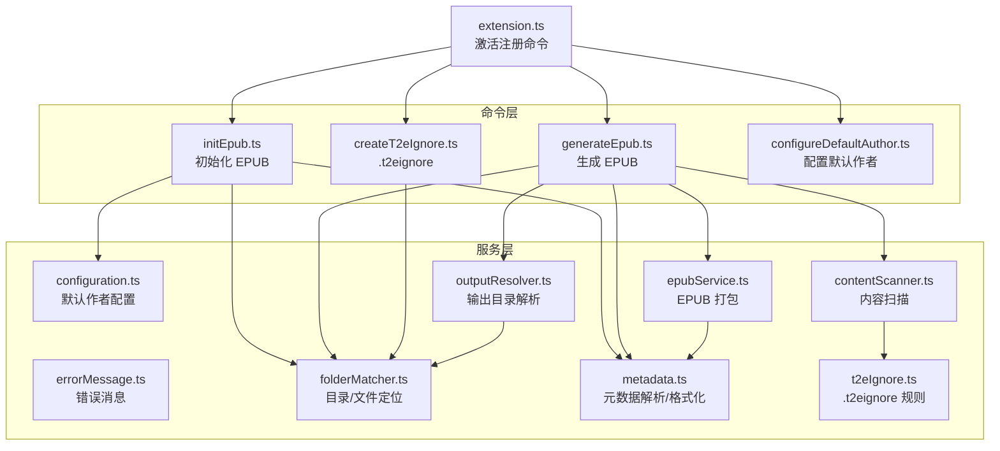
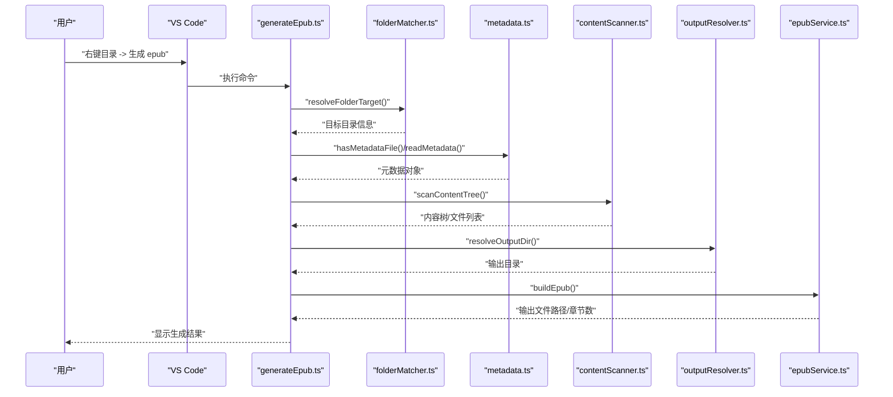
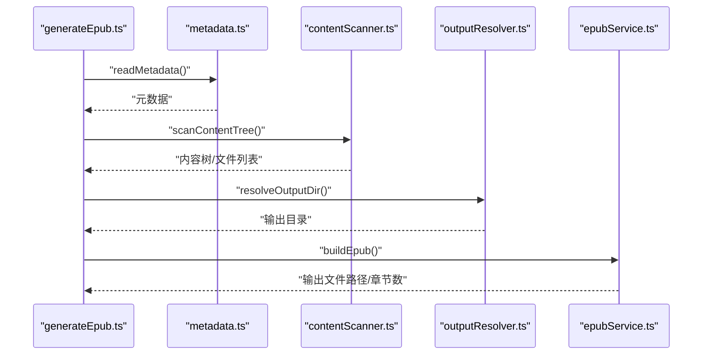
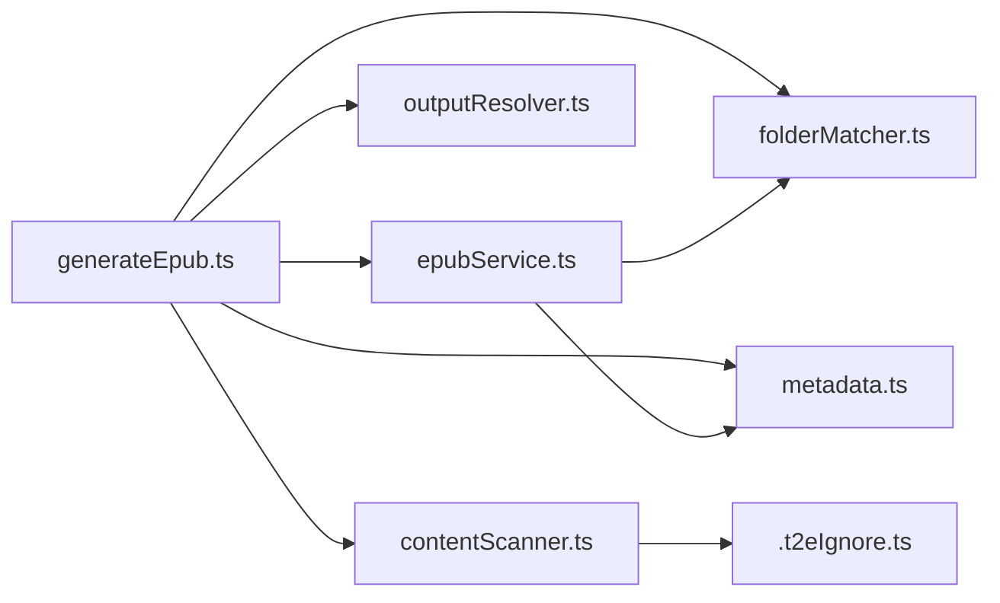

# 故障排除与常见问题

<cite>
**本文引用的文件**
- [package.json](file://package.json)
- [README.md](file://README.md)
- [src/extension.ts](file://src/extension.ts)
- [src/commands/generateEpub.ts](file://src/commands/generateEpub.ts)
- [src/commands/initEpub.ts](file://src/commands/initEpub.ts)
- [src/commands/createT2eIgnore.ts](file://src/commands/createT2eIgnore.ts)
- [src/services/configuration.ts](file://src/services/configuration.ts)
- [src/services/errorMessage.ts](file://src/services/errorMessage.ts)
- [src/services/folderMatcher.ts](file://src/services/folderMatcher.ts)
- [src/services/contentScanner.ts](file://src/services/contentScanner.ts)
- [src/services/metadata.ts](file://src/services/metadata.ts)
- [src/services/outputResolver.ts](file://src/services/outputResolver.ts)
- [src/services/epubService.ts](file://src/services/epubService.ts)
- [src/services/t2eIgnore.ts](file://src/services/t2eIgnore.ts)
- [test/epub-index-navigation.test.cjs](file://test/epub-index-navigation.test.cjs)
</cite>

## 目录
1. [简介](#简介)
2. [项目结构](#项目结构)
3. [核心组件](#核心组件)
4. [架构总览](#架构总览)
5. [详细组件分析](#详细组件分析)
6. [依赖关系分析](#依赖关系分析)
7. [性能考虑](#性能考虑)
8. [故障排除指南](#故障排除指南)
9. [结论](#结论)
10. [附录](#附录)

## 简介
本指南面向使用 VS Code Folder2EPUB 扩展的用户，聚焦安装、配置、生成失败、性能与已知限制等问题的诊断与解决。文档基于扩展源码与测试用例进行归纳，提供系统的问题定位方法、错误消息解读、调试技巧、优化建议、版本兼容性处理、预防性措施与最佳实践。

## 项目结构
扩展采用命令注册与服务模块解耦的设计：入口文件注册四个命令；每个命令串联若干服务模块完成元数据读取、内容扫描、输出目录解析、EPUB 打包等任务。核心文件如下：
- 命令层：生成 EPUB、初始化 EPUB、创建 .t2eignore、配置默认作者
- 服务层：配置读取、错误消息统一、目录与文件定位、内容扫描、元数据解析与格式化、输出目录解析、EPUB 打包、忽略规则解析

图表来源
- [src/extension.ts:13-18](file://src/extension.ts#L13-L18)
- [src/commands/initEpub.ts:18-62](file://src/commands/initEpub.ts#L18-L62)
- [src/commands/generateEpub.ts:18-66](file://src/commands/generateEpub.ts#L18-L66)
- [src/commands/createT2eIgnore.ts:15-34](file://src/commands/createT2eIgnore.ts#L15-L34)
- [src/services/configuration.ts:18-80](file://src/services/configuration.ts#L18-L80)
- [src/services/folderMatcher.ts:23-84](file://src/services/folderMatcher.ts#L23-L84)
- [src/services/contentScanner.ts:51-340](file://src/services/contentScanner.ts#L51-L340)
- [src/services/metadata.ts:41-157](file://src/services/metadata.ts#L41-L157)
- [src/services/outputResolver.ts:15-90](file://src/services/outputResolver.ts#L15-L90)
- [src/services/epubService.ts:146-216](file://src/services/epubService.ts#L146-L216)
- [src/services/t2eIgnore.ts:13-45](file://src/services/t2eIgnore.ts#L13-L45)

章节来源
- [src/extension.ts:13-18](file://src/extension.ts#L13-L18)
- [package.json:43-96](file://package.json#L43-L96)

## 核心组件
- 命令注册与激活：扩展激活时注册所有命令，确保菜单与快捷操作可用。
- 初始化 EPUB：创建元数据目录与文件，必要时引导用户配置默认作者。
- 生成 EPUB：读取元数据、扫描内容、解析输出目录、打包 EPUB。
- 忽略规则：按 .t2eignore 规则过滤文件与目录，支持多层级继承。
- 错误消息：统一将未知错误转换为可读消息，便于用户理解。

章节来源
- [src/extension.ts:13-18](file://src/extension.ts#L13-L18)
- [src/commands/initEpub.ts:18-62](file://src/commands/initEpub.ts#L18-L62)
- [src/commands/generateEpub.ts:18-66](file://src/commands/generateEpub.ts#L18-L66)
- [src/services/t2eIgnore.ts:13-45](file://src/services/t2eIgnore.ts#L13-L45)
- [src/services/errorMessage.ts:9-16](file://src/services/errorMessage.ts#L9-L16)

## 架构总览
下图展示“生成 EPUB”命令的端到端流程：从命令触发到最终输出文件，涵盖校验、扫描、解析与打包等关键步骤。

图表来源
- [src/commands/generateEpub.ts:18-66](file://src/commands/generateEpub.ts#L18-L66)
- [src/services/folderMatcher.ts:23-38](file://src/services/folderMatcher.ts#L23-L38)
- [src/services/metadata.ts:41-59](file://src/services/metadata.ts#L41-L59)
- [src/services/contentScanner.ts:51-58](file://src/services/contentScanner.ts#L51-L58)
- [src/services/outputResolver.ts:15-42](file://src/services/outputResolver.ts#L15-L42)
- [src/services/epubService.ts:146-216](file://src/services/epubService.ts#L146-L216)

## 详细组件分析

### 初始化 EPUB（initEpub）
- 关键行为
  - 校验目标目录是否已有元数据文件，避免覆盖
  - 读取工作区默认作者，若未配置则引导用户输入
  - 创建元数据目录与默认模板
- 常见问题
  - 未打开工作区导致无法设置默认作者
  - 目标目录已存在元数据文件，初始化被中止
- 处理建议
  - 先在 Command Palette 中配置默认作者
  - 确保目标目录不含 __t2e.data/metadata.yml

图表来源
- [src/commands/initEpub.ts:18-62](file://src/commands/initEpub.ts#L18-L62)
- [src/services/configuration.ts:18-80](file://src/services/configuration.ts#L18-L80)
- [src/services/folderMatcher.ts:82-84](file://src/services/folderMatcher.ts#L82-L84)

章节来源
- [src/commands/initEpub.ts:18-62](file://src/commands/initEpub.ts#L18-L62)
- [src/services/configuration.ts:18-80](file://src/services/configuration.ts#L18-L80)
- [src/services/folderMatcher.ts:82-84](file://src/services/folderMatcher.ts#L82-L84)

### 生成 EPUB（generateEpub）
- 关键行为
  - 校验元数据文件存在性
  - 读取元数据、扫描内容、解析输出目录、打包 EPUB
  - 分阶段显示进度，便于用户感知
- 常见问题
  - 缺少元数据文件导致生成失败
  - 目录中无可用 md/txt 文件
  - 输出目录解析异常
- 处理建议
  - 先执行“初始化 EPUB”，确保元数据文件存在
  - 确保目录包含 .md/.txt 文件
  - 检查父级 __epub.yml 的 saveTo 配置

图表来源
- [src/commands/generateEpub.ts:18-66](file://src/commands/generateEpub.ts#L18-L66)
- [src/services/metadata.ts:41-59](file://src/services/metadata.ts#L41-L59)
- [src/services/contentScanner.ts:51-58](file://src/services/contentScanner.ts#L51-L58)
- [src/services/outputResolver.ts:15-42](file://src/services/outputResolver.ts#L15-L42)
- [src/services/epubService.ts:146-216](file://src/services/epubService.ts#L146-L216)

章节来源
- [src/commands/generateEpub.ts:18-66](file://src/commands/generateEpub.ts#L18-L66)

### 忽略规则与内容扫描（.t2eignore 与 contentScanner）
- 关键行为
  - 读取 .t2eignore，按 .gitignore 语法过滤
  - 支持多层级继承，__t2e.data 永远不过滤
  - 按数字前缀优先排序，index 文件优先作为目录入口
- 常见问题
  - .t2eignore 语法错误导致过滤异常
  - 目录中无可用文件导致扫描为空
- 处理建议
  - 使用正确的 .gitignore 语法
  - 确保至少存在一个 .md/.txt 文件

图表来源
- [src/services/contentScanner.ts:258-329](file://src/services/contentScanner.ts#L258-L329)
- [src/services/t2eIgnore.ts:13-45](file://src/services/t2eIgnore.ts#L13-L45)

章节来源
- [src/services/contentScanner.ts:51-340](file://src/services/contentScanner.ts#L51-L340)
- [src/services/t2eIgnore.ts:13-45](file://src/services/t2eIgnore.ts#L13-L45)

### 元数据与输出目录解析
- 关键行为
  - 元数据读取与字段清洗，缺失字段回退为默认值
  - 输出目录解析自上而下查找 __epub.yml 的 saveTo，支持 ~ 展开
- 常见问题
  - 元数据内容无效导致解析失败
  - saveTo 配置不正确导致输出路径异常
- 处理建议
  - 确保 metadata.yml 为合法 YAML
  - saveTo 使用相对路径时以配置文件所在目录为基准

章节来源
- [src/services/metadata.ts:41-157](file://src/services/metadata.ts#L41-L157)
- [src/services/outputResolver.ts:15-90](file://src/services/outputResolver.ts#L15-L90)

### EPUB 打包与封面处理
- 关键行为
  - 生成 content.opf、nav.xhtml、toc.ncx、样式表与章节文件
  - 加载封面并校验媒体类型
- 常见问题
  - 封面文件缺失或非文件
  - 不支持的封面格式
- 处理建议
  - 确保 __t2e.data 下存在封面文件且为文件
  - 使用受支持的图片格式（JPEG/PNG/GIF/SVG/WEBP）

章节来源
- [src/services/epubService.ts:146-216](file://src/services/epubService.ts#L146-L216)
- [src/services/epubService.ts:604-633](file://src/services/epubService.ts#L604-L633)

## 依赖关系分析
- 命令与服务的耦合
  - 命令仅负责编排流程，具体功能由服务模块实现，职责清晰
- 外部依赖
  - ignore：.t2eignore 规则解析
  - jszip：EPUB 打包
  - markdown-it：Markdown 渲染
  - yaml：YAML 解析与序列化

图表来源
- [src/commands/generateEpub.ts:18-66](file://src/commands/generateEpub.ts#L18-L66)
- [src/services/contentScanner.ts:51-340](file://src/services/contentScanner.ts#L51-L340)
- [src/services/epubService.ts:146-216](file://src/services/epubService.ts#L146-L216)
- [src/services/t2eIgnore.ts:13-45](file://src/services/t2eIgnore.ts#L13-L45)

章节来源
- [package.json:97-112](file://package.json#L97-L112)

## 性能考虑
- 扫描与渲染
  - 大型目录扫描与 Markdown 渲染可能耗时较长，建议合理组织目录结构，减少无关文件
- 输出目录
  - saveTo 使用相对路径时注意基准目录，避免不必要的跨盘操作
- 建议
  - 使用 .t2eignore 精确过滤，减少 IO
  - 控制单次生成的文件数量与图片体积

[本节为通用指导，无需特定文件来源]

## 故障排除指南

### 安装与环境
- 症状
  - 扩展无法启用或命令不可用
- 排查
  - 检查 VS Code 版本是否满足最低要求
  - 确认扩展已正确安装并重启 VS Code
- 处理
  - 更新 VS Code 至满足 engines 的版本
  - 重新安装扩展

章节来源
- [package.json:31-33](file://package.json#L31-L33)

### 配置错误
- 症状
  - “请在资源管理器中选择本地目录”或“所选资源不是目录”
- 排查
  - 确认在资源管理器中右键的是本地文件夹
  - 确认 URI scheme 为 file
- 处理
  - 重新在资源管理器中选择本地目录执行命令

章节来源
- [src/services/folderMatcher.ts:23-38](file://src/services/folderMatcher.ts#L23-L38)

- 症状
  - “未配置当前工作区默认作者”
- 排查
  - 未打开工作区或未配置默认作者
- 处理
  - 先在 Command Palette 中配置默认作者，再执行初始化

章节来源
- [src/services/configuration.ts:32-40](file://src/services/configuration.ts#L32-L40)

### 生成失败
- 症状
  - “缺少 __t2e.data/metadata.yml，请先执行初始化”
- 排查
  - 未执行初始化或元数据文件被删除
- 处理
  - 先执行“初始化 EPUB”

章节来源
- [src/commands/generateEpub.ts:23-26](file://src/commands/generateEpub.ts#L23-L26)

- 症状
  - “当前目录中无可生成 EPUB 的 md/txt 文件”
- 排查
  - 目录中无 .md/.txt 文件或被 .t2eignore 过滤
- 处理
  - 添加 .md/.txt 文件或调整 .t2eignore 规则

章节来源
- [src/commands/generateEpub.ts:42-43](file://src/commands/generateEpub.ts#L42-L43)
- [src/services/contentScanner.ts:310-314](file://src/services/contentScanner.ts#L310-L314)

- 症状
  - “未找到封面文件”
- 排查
  - metadata.yml 中 cover 指向的文件不存在或非文件
- 处理
  - 在 __t2e.data 下放置有效封面文件，确保路径正确

章节来源
- [src/services/epubService.ts:610-619](file://src/services/epubService.ts#L610-L619)

- 症状
  - “不支持的封面格式”
- 排查
  - 封面格式不在受支持列表中
- 处理
  - 使用 JPEG/PNG/GIF/SVG/WEBP 格式

章节来源
- [src/services/epubService.ts:641-657](file://src/services/epubService.ts#L641-L657)

- 症状
  - “生成结果缺少导航文件/首章文件”
- 排查
  - 打包过程中目录或文件缺失
- 处理
  - 检查生成流程与输出目录权限

章节来源
- [test/epub-index-navigation.test.cjs:57-64](file://test/epub-index-navigation.test.cjs#L57-L64)

### 目录与导航
- 症状
  - 子目录存在 index 文件但未作为目录入口
- 排查
  - index 文件是否符合命名规则（数字前缀或下划线前缀）
- 处理
  - 使用形如 0000__index.md 或直接 __index.md 的命名

章节来源
- [src/services/contentScanner.ts:113-141](file://src/services/contentScanner.ts#L113-L141)
- [test/epub-index-navigation.test.cjs:74-94](file://test/epub-index-navigation.test.cjs#L74-L94)

- 症状
  - 上层目录无 index 时无法回退到深层 index
- 排查
  - 深层子目录是否存在 index 文件
- 处理
  - 在深层子目录添加 index 文件

章节来源
- [src/services/contentScanner.ts:123-141](file://src/services/contentScanner.ts#L123-L141)
- [test/epub-index-navigation.test.cjs:116-139](file://test/epub-index-navigation.test.cjs#L116-L139)

### 错误消息解读与统一处理
- 统一错误消息
  - 未知错误会被转换为可读文本，便于用户理解
- 建议
  - 出现错误时复制完整消息，结合本指南定位原因

章节来源
- [src/services/errorMessage.ts:9-16](file://src/services/errorMessage.ts#L9-L16)

### 性能问题排查与优化
- 排查
  - 目录层级过深、文件过多、图片过大
- 优化
  - 使用 .t2eignore 精简扫描范围
  - 合理划分章节，避免单文件过大
  - 控制图片尺寸与格式

[本节为通用指导，无需特定文件来源]

### 已知限制与解决方案
- 资源管理器菜单无法基于目录内容动态禁用
  - 现状：菜单对本地目录显示，执行时严格检查元数据文件
  - 方案：遵循命令执行前的前置检查流程
- 建议
  - 生成前先确认元数据文件存在

章节来源
- [README.md:233-240](file://README.md#L233-L240)

### 社区支持与反馈
- 获取帮助
  - 查看扩展主页与仓库说明
  - 提交 Issue 时附带错误消息与最小复现目录结构
- 反馈渠道
  - Issues 页面：https://github.com/someok/vscode-folder2epub/issues

章节来源
- [package.json:23-30](file://package.json#L23-L30)

### 版本兼容性处理
- VS Code 版本
  - 确保满足 engines 中的最低版本要求
- 建议
  - 使用较新稳定版 VS Code，避免旧版本特性差异

章节来源
- [package.json:31-33](file://package.json#L31-L33)

### 预防性措施与最佳实践
- 目录组织
  - 使用数字前缀规范章节命名
  - 子目录优先使用 index 文件作为入口
- 元数据
  - 初始化后检查 metadata.yml 内容
  - 配置默认作者，避免遗漏
- 忽略规则
  - 合理编写 .t2eignore，避免误删内容
- 输出目录
  - 使用 __epub.yml 的 saveTo 指定输出位置，支持 ~ 展开

章节来源
- [README.md:48-122](file://README.md#L48-L122)
- [src/services/outputResolver.ts:79-89](file://src/services/outputResolver.ts#L79-L89)

## 结论
通过理解命令与服务的职责边界、掌握错误消息与日志定位方法、遵循最佳实践与性能优化建议，大多数安装、配置与生成失败问题都能高效解决。遇到复杂问题时，建议结合测试用例思路与最小复现目录进行深入排查。

[本节为总结性内容，无需特定文件来源]

## 附录

### 常见错误与处理对照
- “请执行此命令在资源管理器中的本地目录”
  - 确保在资源管理器中右键本地文件夹
- “所选资源不是目录”
  - 确认选择的是文件夹而非文件
- “未配置当前工作区默认作者”
  - 先在 Command Palette 中配置默认作者
- “缺少 __t2e.data/metadata.yml，请先执行初始化”
  - 先执行“初始化 EPUB”
- “当前目录中无可生成 EPUB 的 md/txt 文件”
  - 添加 .md/.txt 文件或调整 .t2eignore
- “未找到封面文件”
  - 在 __t2e.data 下放置有效封面文件
- “不支持的封面格式”
  - 使用受支持的图片格式

章节来源
- [src/services/folderMatcher.ts:24-31](file://src/services/folderMatcher.ts#L24-L31)
- [src/services/configuration.ts:32-40](file://src/services/configuration.ts#L32-L40)
- [src/commands/generateEpub.ts:23-26](file://src/commands/generateEpub.ts#L23-L26)
- [src/commands/generateEpub.ts:42-43](file://src/commands/generateEpub.ts#L42-L43)
- [src/services/epubService.ts:610-619](file://src/services/epubService.ts#L610-L619)
- [src/services/epubService.ts:641-657](file://src/services/epubService.ts#L641-L657)