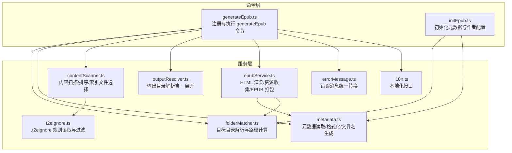
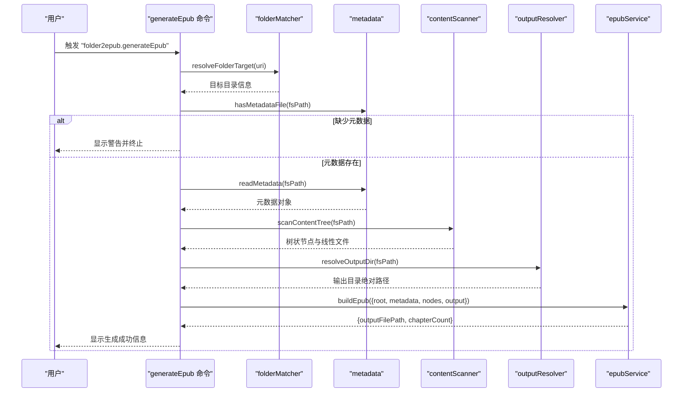
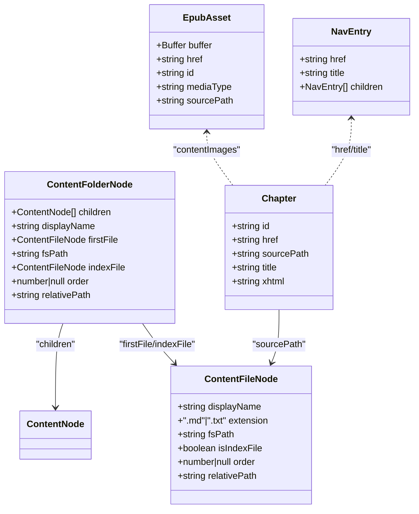
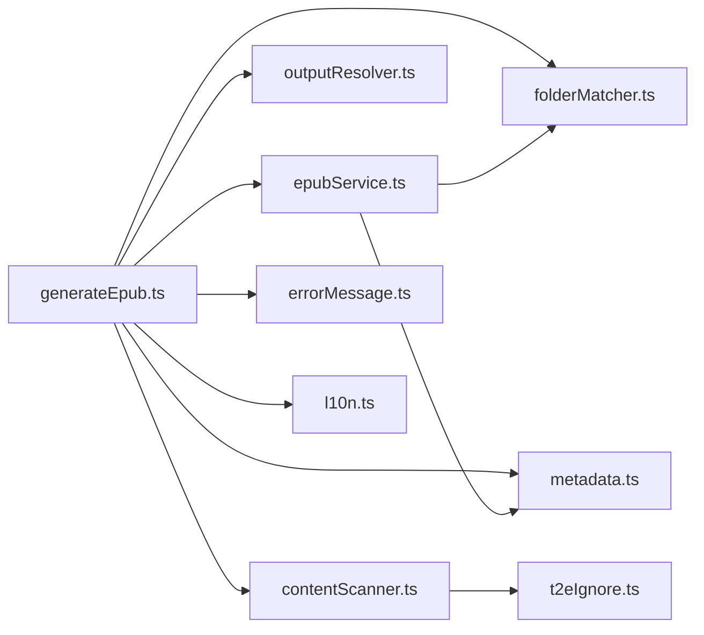

# EPUB 生成功能

<cite>
**本文引用的文件**
- [generateEpub.ts](file://src/commands/generateEpub.ts)
- [contentScanner.ts](file://src/services/contentScanner.ts)
- [epubService.ts](file://src/services/epubService.ts)
- [metadata.ts](file://src/services/metadata.ts)
- [outputResolver.ts](file://src/services/outputResolver.ts)
- [folderMatcher.ts](file://src/services/folderMatcher.ts)
- [t2eIgnore.ts](file://src/services/t2eIgnore.ts)
- [initEpub.ts](file://src/commands/initEpub.ts)
- [errorMessage.ts](file://src/services/errorMessage.ts)
- [l10n.ts](file://src/services/l10n.ts)
- [extension.ts](file://src/extension.ts)
- [package.json](file://package.json)
- [__epub.yml](file://example/__epub.yml)
- [metadata.yml](file://example/init-folder/__t2e.data/metadata.yml)
- [.t2eignore](file://example/init-folder/.t2eignore)
</cite>

## 目录
1. [简介](#简介)
2. [项目结构](#项目结构)
3. [核心组件](#核心组件)
4. [架构总览](#架构总览)
5. [详细组件分析](#详细组件分析)
6. [依赖关系分析](#依赖关系分析)
7. [性能考虑](#性能考虑)
8. [故障排查指南](#故障排查指南)
9. [结论](#结论)
10. [附录](#附录)

## 简介
本文件围绕 VS Code 扩展“Folder2EPUB”的 EPUB 生成能力，系统性梳理 generateEpub 命令的工作流程，涵盖元数据读取、目录内容扫描、输出目录解析、HTML 渲染、资源管理与 EPUB 打包等关键环节。重点阐释内容扫描算法如何识别与处理 Markdown 与纯文本文件，数字前缀排序与中文友好排序机制，以及 EPUB 构建过程中的资源收集、HTML 渲染与文件打包技术。同时提供调用示例、进度报告与用户反馈流程说明、性能优化建议与常见问题解决方案。

## 项目结构
- 命令层：提供用户入口，串联元数据、扫描、打包与反馈。
- 服务层：封装元数据解析、内容扫描、EPUB 构建、输出目录解析、忽略规则、错误消息与本地化等。
- 示例与配置：提供示例元数据、忽略文件与输出配置，便于理解与验证。

图表来源
- [generateEpub.ts:18-66](file://src/commands/generateEpub.ts#L18-L66)
- [contentScanner.ts:51-340](file://src/services/contentScanner.ts#L51-L340)
- [epubService.ts:146-216](file://src/services/epubService.ts#L146-L216)
- [metadata.ts:41-117](file://src/services/metadata.ts#L41-L117)
- [outputResolver.ts:15-42](file://src/services/outputResolver.ts#L15-L42)
- [folderMatcher.ts:23-84](file://src/services/folderMatcher.ts#L23-L84)
- [t2eIgnore.ts:13-44](file://src/services/t2eIgnore.ts#L13-L44)
- [errorMessage.ts:9-15](file://src/services/errorMessage.ts#L9-L15)
- [l10n.ts:9-10](file://src/services/l10n.ts#L9-L10)

章节来源
- [package.json:44-96](file://package.json#L44-L96)
- [extension.ts:13-18](file://src/extension.ts#L13-L18)

## 核心组件
- generateEpub 命令：负责读取元数据、扫描内容、解析输出目录、构建 EPUB 并反馈结果。
- contentScanner：递归扫描目录，过滤 __t2e.data 与 .t2eignore，识别 .md/.txt，解析数字前缀与显示名，构建树与线性文件列表。
- epubService：将内容渲染为 XHTML，收集正文图片与封面，生成 OPF/导航/NCX/样式与正文文件，打包为 EPUB。
- metadata：读取/校验/格式化元数据，生成展示标题与文件名。
- outputResolver：自上而下查找 __epub.yml，解析 saveTo，支持 ~ 展开。
- folderMatcher：统一目录目标解析、路径拼接与元数据文件存在性判断。
- t2eIgnore：读取 .t2eignore 规则，结合 ignore 库进行过滤。
- 错误消息与本地化：统一错误消息转换与多语言支持。

章节来源
- [generateEpub.ts:18-66](file://src/commands/generateEpub.ts#L18-L66)
- [contentScanner.ts:51-340](file://src/services/contentScanner.ts#L51-L340)
- [epubService.ts:146-216](file://src/services/epubService.ts#L146-L216)
- [metadata.ts:41-117](file://src/services/metadata.ts#L41-L117)
- [outputResolver.ts:15-42](file://src/services/outputResolver.ts#L15-L42)
- [folderMatcher.ts:23-84](file://src/services/folderMatcher.ts#L23-L84)
- [t2eIgnore.ts:13-44](file://src/services/t2eIgnore.ts#L13-L44)
- [errorMessage.ts:9-15](file://src/services/errorMessage.ts#L9-L15)
- [l10n.ts:9-10](file://src/services/l10n.ts#L9-L10)

## 架构总览
generateEpub 命令以“进度通知 + 分阶段执行”的方式串联各模块，确保用户在长时间任务中获得明确反馈。核心流程如下：

图表来源
- [generateEpub.ts:19-64](file://src/commands/generateEpub.ts#L19-L64)
- [folderMatcher.ts:23-38](file://src/services/folderMatcher.ts#L23-L38)
- [metadata.ts:41-59](file://src/services/metadata.ts#L41-L59)
- [contentScanner.ts:51-58](file://src/services/contentScanner.ts#L51-L58)
- [outputResolver.ts:15-42](file://src/services/outputResolver.ts#L15-L42)
- [epubService.ts:146-216](file://src/services/epubService.ts#L146-L216)

## 详细组件分析

### generateEpub 命令：工作流与进度反馈
- 输入：可选的 VS Code 资源 URI（本地目录）。
- 校验：目标必须为本地目录，且包含 __t2e.data/metadata.yml。
- 进度：使用 withProgress 以通知位置展示阶段性消息，包括“读取元数据”“扫描目录内容”“解析输出目录”“打包 EPUB 3”。
- 错误处理：统一通过 toErrorMessage 转换并以错误消息提示。
- 成功反馈：显示生成完成与输出文件路径。

章节来源
- [generateEpub.ts:18-66](file://src/commands/generateEpub.ts#L18-L66)
- [folderMatcher.ts:23-38](file://src/services/folderMatcher.ts#L23-L38)
- [errorMessage.ts:9-15](file://src/services/errorMessage.ts#L9-L15)
- [l10n.ts:9-10](file://src/services/l10n.ts#L9-L10)

### 元数据读取与文件名生成
- 读取：从 __t2e.data/metadata.yml 读取并解析 YAML，提供默认值与类型收敛。
- 展示标题：支持主标题 + 副标题组合。
- 文件名：基于标题、副标题与作者生成合法文件名，清洗非法字符。

章节来源
- [metadata.ts:41-117](file://src/services/metadata.ts#L41-L117)
- [folderMatcher.ts:46-58](file://src/services/folderMatcher.ts#L46-L58)

### 目录内容扫描：算法与排序
- 过滤策略：
  - 忽略 __t2e.data（最高优先级硬过滤，不受 .t2eignore 影响）。
  - 应用 .t2eignore 规则（按 .gitignore 语法）。
  - 仅保留 .md 与 .txt。
- 名称解析与排序：
  - 数字前缀规则：形如 N_文件名 的文件/目录，N 作为排序序号；多个连续下划线开头的名称（如 __index）视为显示名，序号为 0。
  - 名称比较：先按 order，再按中文友好自然排序（numeric: true, sensitivity: base），最后按 kind（目录优先于文件）。
- 索引文件选择：
  - 直接子目录优先查找 index 文件；若无则递归在子目录中查找首个 index 文件；若仍无，则回退到首个文件。
- 结果结构：树状节点（含 children、firstFile、indexFile 等）与线性文件列表（用于后续章节编号）。

图表来源
- [contentScanner.ts:258-329](file://src/services/contentScanner.ts#L258-L329)
- [contentScanner.ts:67-105](file://src/services/contentScanner.ts#L67-L105)
- [contentScanner.ts:191-238](file://src/services/contentScanner.ts#L191-L238)
- [t2eIgnore.ts:13-26](file://src/services/t2eIgnore.ts#L13-L26)

章节来源
- [contentScanner.ts:51-340](file://src/services/contentScanner.ts#L51-L340)
- [t2eIgnore.ts:13-44](file://src/services/t2eIgnore.ts#L13-L44)

### 输出目录解析：__epub.yml 与 ~ 展开
- 查找策略：自当前目录向上查找 __epub.yml，找到后读取 saveTo。
- 路径展开：支持 ~ 与 ~/...，分别展开为用户主目录与相对用户主目录的路径；相对路径以配置文件所在目录为基准解析。
- 回退策略：若未找到有效配置，回退到书籍根目录。

章节来源
- [outputResolver.ts:15-42](file://src/services/outputResolver.ts#L15-L42)
- [folderMatcher.ts:7-9](file://src/services/folderMatcher.ts#L7-L9)
- [__epub.yml:1-2](file://example/__epub.yml#L1-L2)

### EPUB 构建：HTML 渲染、资源管理与打包
- Markdown 渲染：
  - 使用 markdown-it，启用 html、linkify、breaks、xhtmlOut。
  - 解析 YAML frontmatter，提取 title 作为章节标题；正文内容去除 frontmatter。
  - 处理内联 HTML 中的  标签，统一改写为包内相对路径。
- 纯文本渲染：按段落拆分，生成 XHTML 段落。
- 章节与导航：
  - 线性编号生成（如 chapter-0001），章节 XHTML 包含标题与样式。
  - 导航结构由树状节点映射为 nav.xhtml 与 toc.ncx（兼容旧阅读器）。
- 资源管理：
  - 收集正文图片与封面，映射 media-type，写入 OEBPS/images 与 styles。
  - 标题页置于 spine 首位，确保打开即展示。
- 打包：
  - 使用 JSZip 生成 EPUB 结构：mimetype（STORE）、META-INF/container.xml、OEBPS/*。
  - content.opf 声明 manifest/spine，包含 nav、ncx、main.css、标题页、章节与图片资源。

图表来源
- [contentScanner.ts:10-38](file://src/services/contentScanner.ts#L10-L38)
- [epubService.ts:105-137](file://src/services/epubService.ts#L105-L137)

章节来源
- [epubService.ts:146-216](file://src/services/epubService.ts#L146-L216)
- [epubService.ts:494-544](file://src/services/epubService.ts#L494-L544)
- [epubService.ts:604-633](file://src/services/epubService.ts#L604-L633)
- [epubService.ts:665-679](file://src/services/epubService.ts#L665-L679)
- [epubService.ts:713-731](file://src/services/epubService.ts#L713-L731)
- [epubService.ts:743-783](file://src/services/epubService.ts#L743-L783)

### 初始化与作者配置
- initEpub：检查元数据是否存在，不存在则创建 __t2e.data/metadata.yml，默认作者来自工作区配置，若未配置则交互式引导。
- configureDefaultAuthor：设置/读取工作区默认作者，供初始化时使用。

章节来源
- [initEpub.ts:18-62](file://src/commands/initEpub.ts#L18-L62)
- [configuration.ts:18-79](file://src/services/configuration.ts#L18-L79)

## 依赖关系分析
- generateEpub 命令依赖：folderMatcher（目标解析）、metadata（元数据）、contentScanner（内容树）、outputResolver（输出目录）、epubService（打包）、l10n（本地化）、errorMessage（错误消息）。
- contentScanner 依赖：t2eIgnore（忽略规则）、folderMatcher（元数据目录常量）。
- epubService 依赖：markdown-it（渲染）、JSZip（打包）、YAML（frontmatter）、folderMatcher（元数据目录常量）、l10n（本地化）。

图表来源
- [generateEpub.ts:5-11](file://src/commands/generateEpub.ts#L5-L11)
- [contentScanner.ts:4-6](file://src/services/contentScanner.ts#L4-L6)
- [epubService.ts:1-16](file://src/services/epubService.ts#L1-L16)

章节来源
- [generateEpub.ts:5-11](file://src/commands/generateEpub.ts#L5-L11)
- [contentScanner.ts:4-6](file://src/services/contentScanner.ts#L4-L6)
- [epubService.ts:1-16](file://src/services/epubService.ts#L1-L16)

## 性能考虑
- I/O 优化：
  - 扫描阶段尽量减少重复 stat/read 操作，合并 .t2eignore 规则一次性应用。
  - 打包阶段使用 JSZip 的异步生成与 DEFLATE 压缩，避免一次性加载大文件至内存。
- 渲染优化：
  - markdown-it 使用一次性 parse + renderer.render，避免重复解析。
  - 图片资源收集采用 Map 去重与序号生成回调，避免重复写入。
- 排序与遍历：
  - 数字前缀解析与中文友好排序在节点构建时完成，减少后续比较成本。
  - flattenFiles 仅在需要线性编号时使用，避免不必要的遍历。
- 建议：
  - 大型项目建议合理使用 .t2eignore，减少扫描范围。
  - 控制单章节内容大小，避免超长渲染链路。
  - 使用外部存储（如网络盘）时注意 I/O 延迟，必要时本地缓存中间产物。

## 故障排查指南
- 目录缺少元数据：
  - 现象：命令提示缺少 __t2e.data/metadata.yml。
  - 处理：先执行“初始化 epub”，或手动创建 __t2e.data/metadata.yml。
- 目录无可用 md/txt 文件：
  - 现象：扫描结果为空，抛出“当前目录无可生成 EPUB 的 md/txt 文件”。
  - 处理：确认目录包含 .md/.txt，检查 .t2eignore 与 __t2e.data 是否被错误过滤。
- 输出目录解析失败：
  - 现象：__epub.yml 未生效或路径不正确。
  - 处理：确认 __epub.yml 存在且包含 saveTo；使用 ~ 或 ~/... 时确保路径展开正确。
- 封面文件缺失或格式不支持：
  - 现象：封面路径不存在、非文件或格式不受支持。
  - 处理：在 __t2e.data 下放置受支持的封面（jpg/jpeg/png/gif/svg/webp），并在 metadata.yml 中正确配置 cover。
- 错误消息显示：
  - 统一通过 toErrorMessage 转换，便于在 UI 中展示。

章节来源
- [generateEpub.ts:23-26](file://src/commands/generateEpub.ts#L23-L26)
- [generateEpub.ts:41-43](file://src/commands/generateEpub.ts#L41-L43)
- [outputResolver.ts:15-42](file://src/services/outputResolver.ts#L15-L42)
- [epubService.ts:604-633](file://src/services/epubService.ts#L604-L633)
- [errorMessage.ts:9-15](file://src/services/errorMessage.ts#L9-L15)

## 结论
generateEpub 命令通过清晰的阶段划分与模块化设计，实现了从目录内容到 EPUB 的端到端自动化。内容扫描算法兼顾数字前缀与中文友好排序，确保章节顺序符合预期；EPUB 构建过程完整覆盖 HTML 渲染、资源收集与打包规范，满足现代阅读器与兼容性需求。配合进度反馈与错误消息统一处理，显著提升了用户体验与可维护性。

## 附录

### 如何调用生成命令（示例）
- 在 VS Code 资源管理器中右键本地目录，选择“Folder2EPUB: 生成 epub”。
- 或通过命令面板执行“Folder2EPUB: 生成 epub”。

章节来源
- [package.json:44-96](file://package.json#L44-L96)
- [extension.ts:13-18](file://src/extension.ts#L13-L18)

### 参数与配置要点
- 元数据：__t2e.data/metadata.yml，包含 title、titleSuffix、author、description、cover、version。
- 输出目录：在任意父级目录放置 __epub.yml，包含 saveTo（支持 ~ 与 ~/...）。
- 忽略规则：在目录下创建 .t2eignore，按 .gitignore 语法过滤。

章节来源
- [metadata.yml:1-7](file://example/init-folder/__t2e.data/metadata.yml#L1-L7)
- [__epub.yml:1-2](file://example/__epub.yml#L1-L2)
- [.t2eignore:1-2](file://example/init-folder/.t2eignore#L1-L2)