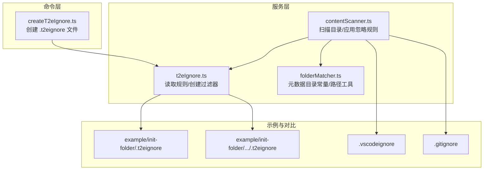
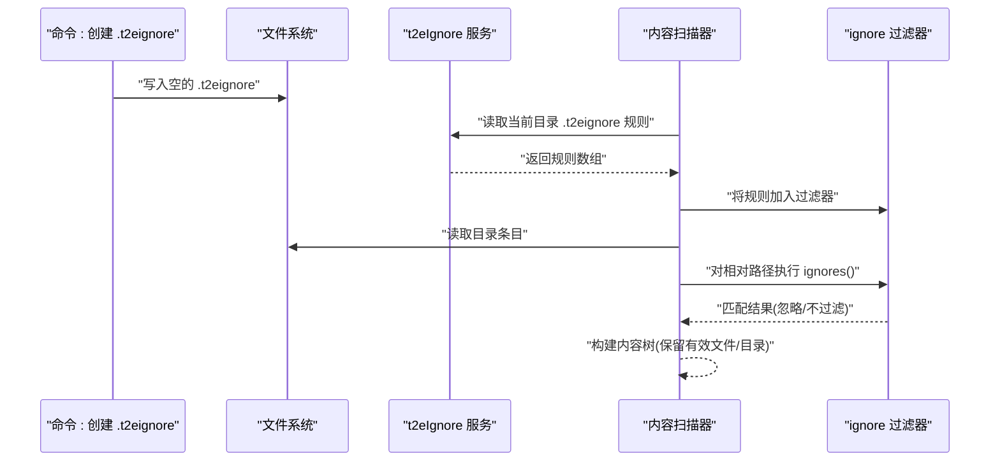
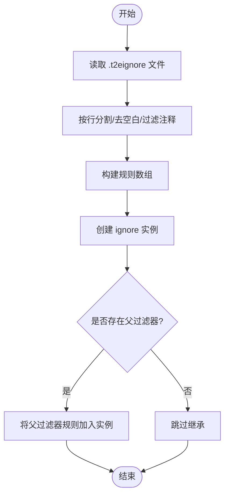
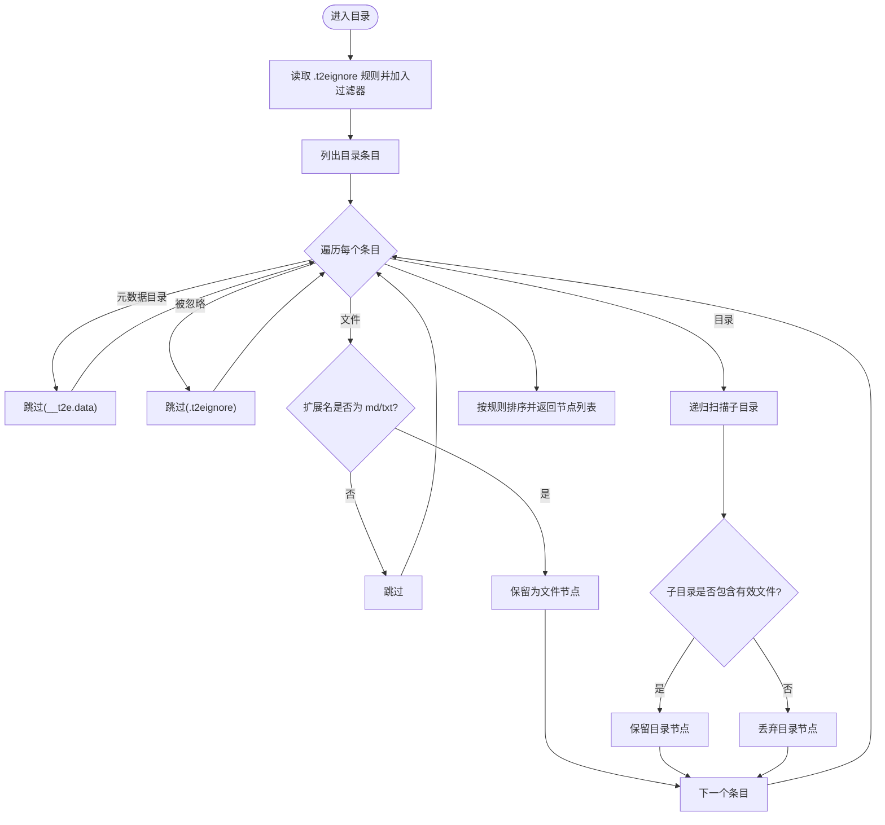
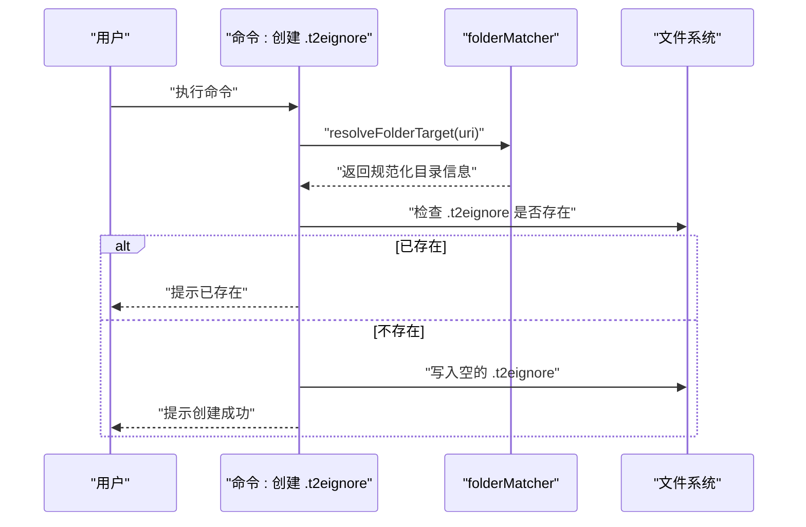
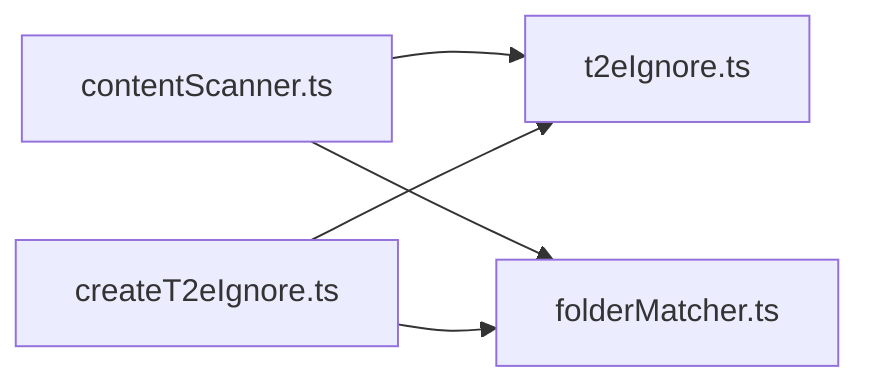

# 忽略文件管理

<cite>
**本文引用的文件**
- [src/services/t2eIgnore.ts](file://src/services/t2eIgnore.ts)
- [src/services/contentScanner.ts](file://src/services/contentScanner.ts)
- [src/commands/createT2eIgnore.ts](file://src/commands/createT2eIgnore.ts)
- [src/services/folderMatcher.ts](file://src/services/folderMatcher.ts)
- [example/init-folder/.t2eignore](file://example/init-folder/.t2eignore)
- [example/init-folder/00102___子目录 1/.t2eignore](file://example/init-folder/00102___子目录 1/.t2eignore)
- [example/init-folder/00102___子目录 1/00200_忽略文件.md](file://example/init-folder/00102___子目录 1/00200_忽略文件.md)
- [.vscodeignore](file://.vscodeignore)
- [.gitignore](file://.gitignore)
</cite>

## 目录
1. [简介](#简介)
2. [项目结构](#项目结构)
3. [核心组件](#核心组件)
4. [架构总览](#架构总览)
5. [详细组件分析](#详细组件分析)
6. [依赖分析](#依赖分析)
7. [性能考虑](#性能考虑)
8. [故障排查指南](#故障排查指南)
9. [结论](#结论)
10. [附录](#附录)

## 简介
本文件围绕“忽略文件管理”功能，系统性说明 .t2eignore 文件的语法与过滤规则、t2eIgnore 服务的实现原理（基于第三方 ignore 库）、目录遍历过程中的过滤机制、VS Code 忽略机制的差异与联系，以及调试技巧与常见问题的解决方法。读者无需深入技术背景即可理解如何正确配置与使用忽略规则。

## 项目结构
与忽略文件管理直接相关的模块与示例分布如下：
- 服务层
  - t2eIgnore 服务：负责读取 .t2eignore 文件、创建与继承 ignore 过滤器
  - contentScanner 内容扫描：在目录遍历时应用忽略规则
  - folderMatcher 目录匹配：提供元数据目录常量与路径工具
- 命令层
  - createT2eIgnore 命令：在选定目录创建空的 .t2eignore 文件
- 示例与对比
  - example/init-folder 下的 .t2eignore 示例
  - .vscodeignore、.gitignore 对比参考

**图表来源**
- [src/services/t2eIgnore.ts:1-45](file://src/services/t2eIgnore.ts#L1-L45)
- [src/services/contentScanner.ts:1-340](file://src/services/contentScanner.ts#L1-L340)
- [src/services/folderMatcher.ts:1-85](file://src/services/folderMatcher.ts#L1-L85)
- [src/commands/createT2eIgnore.ts:1-34](file://src/commands/createT2eIgnore.ts#L1-L34)
- [example/init-folder/.t2eignore:1-2](file://example/init-folder/.t2eignore#L1-L2)
- [example/init-folder/00102___子目录 1/.t2eignore:1-2](file://example/init-folder/00102___子目录 1/.t2eignore#L1-L2)
- [.vscodeignore:1-24](file://.vscodeignore#L1-L24)
- [.gitignore:1-3](file://.gitignore#L1-L3)

**章节来源**
- [src/services/t2eIgnore.ts:1-45](file://src/services/t2eIgnore.ts#L1-L45)
- [src/services/contentScanner.ts:1-340](file://src/services/contentScanner.ts#L1-L340)
- [src/services/folderMatcher.ts:1-85](file://src/services/folderMatcher.ts#L1-L85)
- [src/commands/createT2eIgnore.ts:1-34](file://src/commands/createT2eIgnore.ts#L1-L34)
- [example/init-folder/.t2eignore:1-2](file://example/init-folder/.t2eignore#L1-L2)
- [example/init-folder/00102___子目录 1/.t2eignore:1-2](file://example/init-folder/00102___子目录 1/.t2eignore#L1-L2)
- [.vscodeignore:1-24](file://.vscodeignore#L1-L24)
- [.gitignore:1-3](file://.gitignore#L1-L3)

## 核心组件
- t2eIgnore 服务
  - 功能：读取 .t2eignore 文件，过滤空行与注释行；创建 ignore 过滤器实例；支持从父过滤器继承规则
  - 关键点：使用第三方 ignore 库进行规则编译与匹配；相对路径以“相对于书籍根目录”的相对路径参与匹配
- contentScanner 内容扫描
  - 功能：递归扫描目录，按规则构建内容树；在每个目录读取并合并 .t2eignore 规则；对条目进行忽略过滤
  - 关键点：硬过滤优先级高于 .t2eignore；仅保留包含有效文件的目录；对文件扩展名进行白名单限制
- folderMatcher 目录匹配
  - 功能：提供元数据目录常量（如 __t2e.data），并提供路径计算与存在性判断等辅助
- createT2eIgnore 命令
  - 功能：在 VS Code 资源管理器中选择的本地目录下创建空的 .t2eignore 文件

**章节来源**
- [src/services/t2eIgnore.ts:1-45](file://src/services/t2eIgnore.ts#L1-L45)
- [src/services/contentScanner.ts:251-329](file://src/services/contentScanner.ts#L251-L329)
- [src/services/folderMatcher.ts:7-84](file://src/services/folderMatcher.ts#L7-L84)
- [src/commands/createT2eIgnore.ts:15-33](file://src/commands/createT2eIgnore.ts#L15-L33)

## 架构总览
忽略文件管理贯穿“读取规则 → 创建过滤器 → 目录遍历 → 应用过滤 → 构建内容树”的流程。下图展示了核心交互：

**图表来源**
- [src/commands/createT2eIgnore.ts:15-33](file://src/commands/createT2eIgnore.ts#L15-L33)
- [src/services/t2eIgnore.ts:13-26](file://src/services/t2eIgnore.ts#L13-L26)
- [src/services/contentScanner.ts:258-329](file://src/services/contentScanner.ts#L258-L329)

## 详细组件分析

### 组件一：t2eIgnore 服务
- 作用
  - 读取 .t2eignore 文件，过滤空行与注释行，返回规则数组
  - 创建 ignore 过滤器实例，支持从父过滤器继承规则
- 实现要点
  - 规则读取：按行分割、去空白、过滤空行与以 # 开头的注释行
  - 过滤器创建：基于 ignore 库；可选地将父过滤器规则加入新实例
  - 路径匹配：规则应用于“相对于书籍根目录”的相对路径

**图表来源**
- [src/services/t2eIgnore.ts:13-26](file://src/services/t2eIgnore.ts#L13-L26)
- [src/services/t2eIgnore.ts:36-44](file://src/services/t2eIgnore.ts#L36-L44)

**章节来源**
- [src/services/t2eIgnore.ts:1-45](file://src/services/t2eIgnore.ts#L1-L45)

### 组件二：内容扫描器（目录遍历与过滤）
- 作用
  - 递归扫描书籍根目录，构建内容树；在每个目录读取 .t2eignore 并合并到过滤器
  - 应用硬过滤与忽略过滤，仅保留有效文件与包含有效文件的目录
- 关键流程
  - 读取当前目录 .t2eignore 规则并加入过滤器
  - 硬过滤：元数据目录 __t2e.data 永远被忽略（不受 .t2eignore 影响）
  - 忽略过滤：对相对路径调用 ignores() 判断是否忽略
  - 文件类型过滤：仅保留 md、txt 类型文件
  - 目录保留条件：至少包含一个有效文件时才保留目录节点

**图表来源**
- [src/services/contentScanner.ts:258-329](file://src/services/contentScanner.ts#L258-L329)
- [src/services/folderMatcher.ts:7-8](file://src/services/folderMatcher.ts#L7-L8)

**章节来源**
- [src/services/contentScanner.ts:251-329](file://src/services/contentScanner.ts#L251-L329)
- [src/services/folderMatcher.ts:7-8](file://src/services/folderMatcher.ts#L7-L8)

### 组件三：命令“新增 .t2eignore”
- 作用
  - 在 VS Code 资源管理器中选择的本地目录下创建空的 .t2eignore 文件
- 行为
  - 校验输入 URI 是否为本地目录
  - 若目标路径已存在 .t2eignore，则提示已存在
  - 否则写入空文件并提示创建成功

**图表来源**
- [src/commands/createT2eIgnore.ts:15-33](file://src/commands/createT2eIgnore.ts#L15-L33)
- [src/services/folderMatcher.ts:23-38](file://src/services/folderMatcher.ts#L23-L38)

**章节来源**
- [src/commands/createT2eIgnore.ts:1-34](file://src/commands/createT2eIgnore.ts#L1-L34)
- [src/services/folderMatcher.ts:1-85](file://src/services/folderMatcher.ts#L1-L85)

## 依赖分析
- 外部依赖
  - ignore 库：提供规则编译与匹配能力
- 内部依赖
  - contentScanner 依赖 t2eIgnore 读取规则与创建过滤器
  - contentScanner 依赖 folderMatcher 提供元数据目录常量
  - createT2eIgnore 依赖 folderMatcher 校验目录与路径工具

**图表来源**
- [src/services/contentScanner.ts:1-6](file://src/services/contentScanner.ts#L1-L6)
- [src/services/t2eIgnore.ts:1-3](file://src/services/t2eIgnore.ts#L1-L3)
- [src/services/folderMatcher.ts:1-3](file://src/services/folderMatcher.ts#L1-L3)
- [src/commands/createT2eIgnore.ts:1-8](file://src/commands/createT2eIgnore.ts#L1-L8)

**章节来源**
- [src/services/contentScanner.ts:1-6](file://src/services/contentScanner.ts#L1-L6)
- [src/services/t2eIgnore.ts:1-3](file://src/services/t2eIgnore.ts#L1-L3)
- [src/services/folderMatcher.ts:1-3](file://src/services/folderMatcher.ts#L1-L3)
- [src/commands/createT2eIgnore.ts:1-8](file://src/commands/createT2eIgnore.ts#L1-L8)

## 性能考虑
- 规则数量与复杂度
  - 规则越多、越复杂，匹配耗时越高；建议合并冗余规则、避免过度通配
- 目录层级与文件数量
  - 深层级与大量小文件会增加 IO 与遍历成本；可通过合理组织目录与使用忽略规则减少扫描范围
- 过滤器复用
  - 在同一扫描过程中复用 ignore 实例，避免重复创建与编译规则
- 硬过滤优先
  - 元数据目录 __t2e.data 的硬过滤避免了不必要的规则匹配，有助于提升整体性能

[本节为通用指导，不涉及具体文件分析]

## 故障排查指南
- 常见问题与解决
  - .t2eignore 未生效
    - 检查规则是否正确写入且未被注释；确认规则针对的是“相对于书籍根目录”的相对路径
    - 确认扫描入口是否为正确的书籍根目录
  - 规则被忽略
    - 确认条目未被硬过滤（例如 __t2e.data）优先于 .t2eignore
    - 确认文件扩展名在 md、txt 白名单内
  - 子目录未出现
    - 仅当目录包含至少一个有效文件时才会保留；检查子目录中是否存在 md/txt 文件
  - VS Code 中无法创建 .t2eignore
    - 确保在资源管理器中选择了本地目录；若目标路径已存在 .t2eignore，将提示已存在
- 调试技巧
  - 在 contentScanner 的目录扫描处添加日志，输出当前目录、读取的规则、被忽略的条目与保留的条目
  - 使用最小化示例验证规则：在示例目录中创建 .t2eignore 并观察扫描结果
  - 对比 .vscodeignore 与 .gitignore 的行为差异，确保理解各自适用场景

**章节来源**
- [src/services/contentScanner.ts:258-329](file://src/services/contentScanner.ts#L258-L329)
- [src/commands/createT2eIgnore.ts:15-33](file://src/commands/createT2eIgnore.ts#L15-L33)
- [.vscodeignore:1-24](file://.vscodeignore#L1-L24)
- [.gitignore:1-3](file://.gitignore#L1-L3)

## 结论
.t2eignore 通过第三方 ignore 库实现灵活的路径匹配与过滤，结合硬过滤与扩展名白名单，确保内容扫描阶段高效、准确地构建内容树。通过合理的规则组织与调试手段，可以有效提升扫描效率与准确性。

[本节为总结性内容，不涉及具体文件分析]

## 附录

### .t2eignore 语法与规则说明
- 文件位置
  - 放置于任意目录下，规则仅影响该目录及其子目录
- 规则来源
  - 每进入一个目录，都会读取该目录下的 .t2eignore 并合并到当前过滤器
- 规则格式
  - 支持相对路径匹配；规则应用于“相对于书籍根目录”的相对路径
  - 注释以 # 开头；空行会被忽略
- 优先级与继承
  - 子目录的规则会在父目录规则基础上叠加（后读取的规则覆盖先读取的同名规则）
  - 硬过滤（元数据目录 __t2e.data）优先于 .t2eignore
- 示例与最佳实践
  - 示例一：在 init-folder 根目录忽略特定文件
    - 规则文件路径：[example/init-folder/.t2eignore:1-2](file://example/init-folder/.t2eignore#L1-L2)
  - 示例二：在子目录中忽略特定子目录
    - 规则文件路径：[example/init-folder/00102___子目录 1/.t2eignore:1-2](file://example/init-folder/00102___子目录 1/.t2eignore#L1-L2)
  - 示例三：验证忽略效果
    - 被忽略文件路径：[example/init-folder/00102___子目录 1/00200_忽略文件.md:1-2](file://example/init-folder/00102___子目录 1/00200_忽略文件.md#L1-L2)
- 与 VS Code 忽略机制的区别与联系
  - VS Code 忽略：.vscodeignore 用于控制 VS Code 资源管理器与打包导出等场景的忽略行为
  - Git 忽略：.gitignore 控制 Git 的跟踪行为
  - 本项目忽略：.t2eignore 专用于内容扫描阶段的过滤，不影响 VS Code 或 Git 的忽略行为

**章节来源**
- [src/services/t2eIgnore.ts:13-26](file://src/services/t2eIgnore.ts#L13-L26)
- [src/services/contentScanner.ts:258-329](file://src/services/contentScanner.ts#L258-L329)
- [example/init-folder/.t2eignore:1-2](file://example/init-folder/.t2eignore#L1-L2)
- [example/init-folder/00102___子目录 1/.t2eignore:1-2](file://example/init-folder/00102___子目录 1/.t2eignore#L1-L2)
- [example/init-folder/00102___子目录 1/00200_忽略文件.md:1-2](file://example/init-folder/00102___子目录 1/00200_忽略文件.md#L1-L2)
- [.vscodeignore:1-24](file://.vscodeignore#L1-L24)
- [.gitignore:1-3](file://.gitignore#L1-L3)