# 核心功能详解

<cite>
**本文引用的文件**
- [package.json](file://package.json)
- [src/extension.ts](file://src/extension.ts)
- [src/commands/generateEpub.ts](file://src/commands/generateEpub.ts)
- [src/commands/initEpub.ts](file://src/commands/initEpub.ts)
- [src/commands/createT2eIgnore.ts](file://src/commands/createT2eIgnore.ts)
- [src/commands/configureDefaultAuthor.ts](file://src/commands/configureDefaultAuthor.ts)
- [src/commands/generateMarkdown.ts](file://src/commands/generateMarkdown.ts)
- [src/services/contentScanner.ts](file://src/services/contentScanner.ts)
- [src/services/epubService.ts](file://src/services/epubService.ts)
- [src/services/metadata.ts](file://src/services/metadata.ts)
- [src/services/t2eIgnore.ts](file://src/services/t2eIgnore.ts)
- [src/services/configuration.ts](file://src/services/configuration.ts)
- [src/services/folderMatcher.ts](file://src/services/folderMatcher.ts)
- [src/services/outputResolver.ts](file://src/services/outputResolver.ts)
- [src/services/markdownService.ts](file://src/services/markdownService.ts)
- [src/utils/markdownUtils.ts](file://src/utils/markdownUtils.ts)
- [README.md](file://README.md)
</cite>

## 目录
1. [简介](#简介)
2. [项目结构](#项目结构)
3. [核心组件](#核心组件)
4. [架构总览](#架构总览)
5. [详细组件分析](#详细组件分析)
6. [依赖关系分析](#依赖关系分析)
7. [性能考量](#性能考量)
8. [故障排查指南](#故障排查指南)
9. [结论](#结论)
10. [附录](#附录)

## 简介
本文件面向 VS Code Folder2EPUB 扩展的核心功能，系统性阐述 EPUB 生成命令、项目初始化、.t2eignore 过滤机制、默认作者配置与 VS Code 集成，以及各模块之间的协作关系。文档同时提供工作流图、类图与流程图，帮助读者从高层到细节全面理解扩展如何将"目录即书籍"的内容组织方式转化为符合 EPUB 3 标准的电子书。

**更新** 新增"生成合并 Markdown"功能，提供将目录内容合并为单个 Markdown 文件的能力，并增强了内容处理的灵活性。

## 项目结构
扩展采用"命令层 + 服务层"的分层设计：
- 命令层：注册 VS Code 命令，协调 UI 与业务流程。
- 服务层：封装内容扫描、EPUB 构建、元数据处理、忽略规则、配置与输出解析等核心能力。
- 工具层：提供 Markdown 解析与处理的辅助函数。
- 配置与贡献：通过 package.json 声明命令、菜单、国际化与依赖。

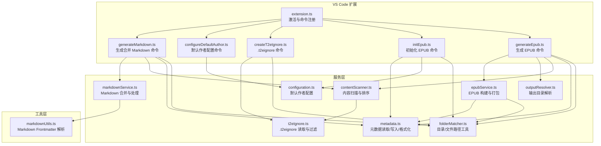

**图表来源**
- [src/extension.ts:13-18](file://src/extension.ts#L13-L18)
- [src/commands/generateEpub.ts:18-65](file://src/commands/generateEpub.ts#L18-L65)
- [src/commands/initEpub.ts:18-62](file://src/commands/initEpub.ts#L18-L62)
- [src/commands/createT2eIgnore.ts:15-33](file://src/commands/createT2eIgnore.ts#L15-L33)
- [src/commands/configureDefaultAuthor.ts:12-25](file://src/commands/configureDefaultAuthor.ts#L12-L25)
- [src/commands/generateMarkdown.ts:17-74](file://src/commands/generateMarkdown.ts#L17-L74)
- [src/services/contentScanner.ts:51-58](file://src/services/contentScanner.ts#L51-L58)
- [src/services/epubService.ts:146-216](file://src/services/epubService.ts#L146-L216)
- [src/services/metadata.ts:41-69](file://src/services/metadata.ts#L41-L69)
- [src/services/t2eIgnore.ts:13-26](file://src/services/t2eIgnore.ts#L13-L26)
- [src/services/configuration.ts:18-40](file://src/services/configuration.ts#L18-L40)
- [src/services/folderMatcher.ts:23-38](file://src/services/folderMatcher.ts#L23-L38)
- [src/services/outputResolver.ts:15-42](file://src/services/outputResolver.ts#L15-L42)
- [src/services/markdownService.ts:30-89](file://src/services/markdownService.ts#L30-L89)
- [src/utils/markdownUtils.ts:11-25](file://src/utils/markdownUtils.ts#L11-L25)

**章节来源**
- [package.json:43-96](file://package.json#L43-L96)
- [src/extension.ts:13-18](file://src/extension.ts#L13-L18)

## 核心组件
- 生成 EPUB 命令：读取元数据、扫描内容、解析输出目录、构建 EPUB 并输出文件。
- 初始化 EPUB 命令：创建元数据目录与模板文件，支持默认作者交互配置。
- .t2eignore 命令：在目标目录创建空的忽略文件。
- 默认作者配置命令：在当前工作区设置默认作者，供初始化时使用。
- **生成合并 Markdown 命令**：将目录内容扫描为单个 Markdown 文件，支持自定义输出位置。
- 内容扫描服务：递归扫描目录，按数字前缀与名称排序，识别 index 文件，合并局部忽略规则。
- EPUB 构建服务：将章节、封面、导航与资源打包为 EPUB 3。
- 元数据服务：读取/写入/格式化 metadata.yml，生成文件名。
- 忽略规则服务：读取 .t2eignore，遵循 .gitignore 语法。
- 路径匹配与输出解析：定位 __t2e.data、__epub.yml，解析输出目录。
- **Markdown 合并服务**：将内容树合并为单个 Markdown 文件，处理标题层级与内容过滤。
- **Markdown 工具函数**：解析 YAML Frontmatter，处理 Markdown 内容。

**章节来源**
- [src/commands/generateEpub.ts:18-65](file://src/commands/generateEpub.ts#L18-L65)
- [src/commands/initEpub.ts:18-62](file://src/commands/initEpub.ts#L18-L62)
- [src/commands/createT2eIgnore.ts:15-33](file://src/commands/createT2eIgnore.ts#L15-L33)
- [src/commands/configureDefaultAuthor.ts:12-25](file://src/commands/configureDefaultAuthor.ts#L12-L25)
- [src/commands/generateMarkdown.ts:17-74](file://src/commands/generateMarkdown.ts#L17-L74)
- [src/services/contentScanner.ts:51-340](file://src/services/contentScanner.ts#L51-L340)
- [src/services/epubService.ts:146-1089](file://src/services/epubService.ts#L146-L1089)
- [src/services/metadata.ts:8-157](file://src/services/metadata.ts#L8-L157)
- [src/services/t2eIgnore.ts:13-45](file://src/services/t2eIgnore.ts#L13-L45)
- [src/services/folderMatcher.ts:23-84](file://src/services/folderMatcher.ts#L23-L84)
- [src/services/outputResolver.ts:15-90](file://src/services/outputResolver.ts#L15-L90)
- [src/services/markdownService.ts:30-137](file://src/services/markdownService.ts#L30-L137)
- [src/utils/markdownUtils.ts:11-25](file://src/utils/markdownUtils.ts#L11-L25)

## 架构总览
下图展示了"生成 EPUB"和"生成合并 Markdown"命令的端到端流程，包括元数据校验、内容扫描、输出目录解析与构建过程。

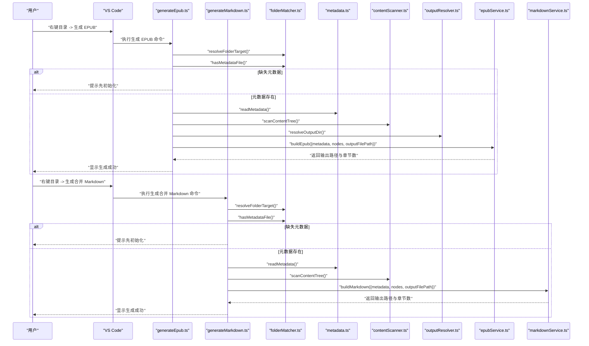

**图表来源**
- [src/commands/generateEpub.ts:19-64](file://src/commands/generateEpub.ts#L19-L64)
- [src/commands/generateMarkdown.ts:18-73](file://src/commands/generateMarkdown.ts#L18-L73)
- [src/services/folderMatcher.ts:23-38](file://src/services/folderMatcher.ts#L23-L38)
- [src/services/metadata.ts:41-59](file://src/services/metadata.ts#L41-L59)
- [src/services/contentScanner.ts:51-58](file://src/services/contentScanner.ts#L51-L58)
- [src/services/outputResolver.ts:15-42](file://src/services/outputResolver.ts#L15-L42)
- [src/services/epubService.ts:146-216](file://src/services/epubService.ts#L146-L216)
- [src/services/markdownService.ts:30-89](file://src/services/markdownService.ts#L30-L89)

## 详细组件分析

### 生成 EPUB 命令（工作流）
- 输入：VS Code 资源管理器中选择的本地目录。
- 校验：确认目录存在且包含 __t2e.data/metadata.yml。
- 流程：
  1) 读取元数据（YAML）。
  2) 扫描内容树（递归 + 忽略规则 + 排序 + index 识别）。
  3) 解析输出目录（沿父级查找 __epub.yml 的 saveTo，支持 ~ 展开）。
  4) 构建 EPUB（章节、封面、导航、样式与资源打包）。
  5) 输出文件并提示结果。

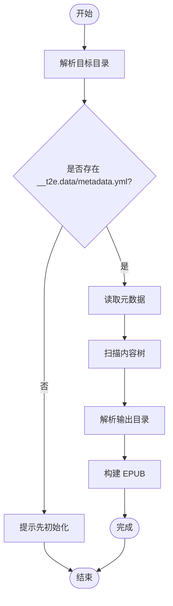

**图表来源**
- [src/commands/generateEpub.ts:19-64](file://src/commands/generateEpub.ts#L19-L64)
- [src/services/folderMatcher.ts:82-84](file://src/services/folderMatcher.ts#L82-L84)
- [src/services/metadata.ts:41-59](file://src/services/metadata.ts#L41-L59)
- [src/services/contentScanner.ts:51-58](file://src/services/contentScanner.ts#L51-L58)
- [src/services/outputResolver.ts:15-42](file://src/services/outputResolver.ts#L15-L42)
- [src/services/epubService.ts:146-216](file://src/services/epubService.ts#L146-L216)

**章节来源**
- [src/commands/generateEpub.ts:18-65](file://src/commands/generateEpub.ts#L18-L65)

### 生成合并 Markdown 命令（新增功能）
- 输入：VS Code 资源管理器中选择的本地目录。
- 校验：确认目录存在且包含 __t2e.data/metadata.yml。
- 流程：
  1) 读取元数据（YAML）。
  2) 扫描内容树（递归 + 忽略规则 + 排序 + index 识别）。
  3) 弹出保存对话框，允许用户选择输出位置和文件名。
  4) 合并内容为单个 Markdown 文件：
     - 根目录文件生成 `##` 标题，子目录层级递增，最多支持 `######`
     - 自动过滤 Markdown 图片语法 ``、HTML `` 标签和 YAML frontmatter
     - 根目录文件内容中的子标题层级会相应调整，避免与章节标题冲突
  5) 写入文件并提示结果。

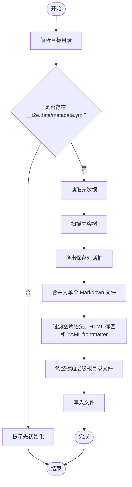

**图表来源**
- [src/commands/generateMarkdown.ts:18-73](file://src/commands/generateMarkdown.ts#L18-L73)
- [src/services/folderMatcher.ts:82-84](file://src/services/folderMatcher.ts#L82-L84)
- [src/services/metadata.ts:41-59](file://src/services/metadata.ts#L41-L59)
- [src/services/contentScanner.ts:51-58](file://src/services/contentScanner.ts#L51-L58)
- [src/services/markdownService.ts:30-89](file://src/services/markdownService.ts#L30-L89)

**章节来源**
- [src/commands/generateMarkdown.ts:17-74](file://src/commands/generateMarkdown.ts#L17-L74)

### 初始化 EPUB 命令（流程）
- 输入：VS Code 资源管理器中选择的本地目录。
- 流程：
  1) 检查是否已有元数据文件，避免覆盖。
  2) 创建 __t2e.data 目录。
  3) 读取当前工作区默认作者；若未配置，弹窗询问是否配置。
  4) 生成默认 metadata.yml（标题=目录名，作者=默认作者，其他字段默认值）。
  5) 成功提示。

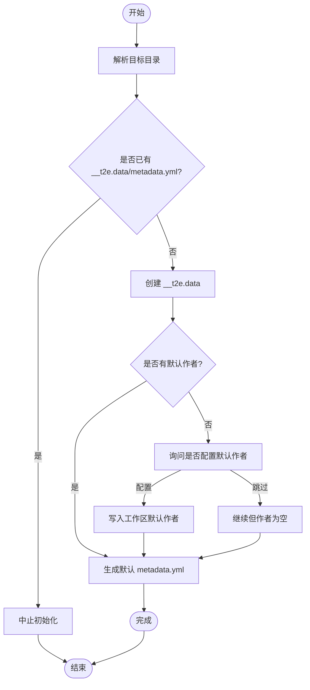

**图表来源**
- [src/commands/initEpub.ts:19-61](file://src/commands/initEpub.ts#L19-L61)
- [src/services/folderMatcher.ts:23-38](file://src/services/folderMatcher.ts#L23-L38)
- [src/services/configuration.ts:18-40](file://src/services/configuration.ts#L18-L40)
- [src/services/metadata.ts:24-33](file://src/services/metadata.ts#L24-L33)

**章节来源**
- [src/commands/initEpub.ts:18-62](file://src/commands/initEpub.ts#L18-L62)

### .t2eignore 过滤机制与配置语法
- 位置：与被扫描目录同级，文件名为 .t2eignore。
- 语法：遵循 .gitignore 语法（空行与以 # 开头的注释行会被忽略）。
- 优先级：
  - __t2e.data 目录为系统保留，不受 .t2eignore 影响。
  - 局部 .t2eignore 会合并到过滤器中，子目录继承父级规则。
- 行为：扫描时对目录条目与文件条目分别进行过滤，仅保留 md/txt 文件，且目录至少包含一个可用文件才会保留。

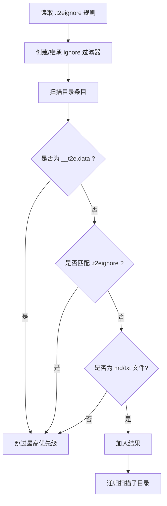

**图表来源**
- [src/services/t2eIgnore.ts:13-26](file://src/services/t2eIgnore.ts#L13-L26)
- [src/services/contentScanner.ts:258-329](file://src/services/contentScanner.ts#L258-L329)

**章节来源**
- [src/services/t2eIgnore.ts:13-45](file://src/services/t2eIgnore.ts#L13-L45)
- [src/services/contentScanner.ts:258-329](file://src/services/contentScanner.ts#L258-L329)

### 默认作者配置与 VS Code 集成
- 配置项：folder2epub.defaultAuthor（作用域 window/workspace）。
- 交互：通过命令"配置当前 Workspace 默认作者"，弹出输入框，支持清空。
- 初始化联动：初始化命令读取当前工作区默认作者，若未配置则提示交互配置后再继续。

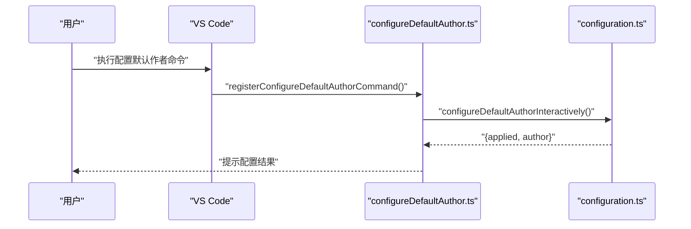

**图表来源**
- [src/commands/configureDefaultAuthor.ts:12-25](file://src/commands/configureDefaultAuthor.ts#L12-L25)
- [src/services/configuration.ts:47-79](file://src/services/configuration.ts#L47-L79)

**章节来源**
- [src/services/configuration.ts:18-40](file://src/services/configuration.ts#L18-L40)
- [src/commands/configureDefaultAuthor.ts:12-25](file://src/commands/configureDefaultAuthor.ts#L12-L25)

### 内容扫描与排序（算法）
- 支持类型：.md 与 .txt。
- 排序规则：
  - 名称形如 "0120_章节名.md"，数字前缀参与排序；无前缀则按名称排序。
  - 目录与文件在去前缀后使用剩余名称进行本地化友好排序。
  - 目录优先链接到 index 文件（支持带前缀的 index 或以多个下划线开头的 index），且该文件不作为独立目录项展示。
- 结果：返回树状节点与线性文件列表，供后续章节编号与导航生成使用。

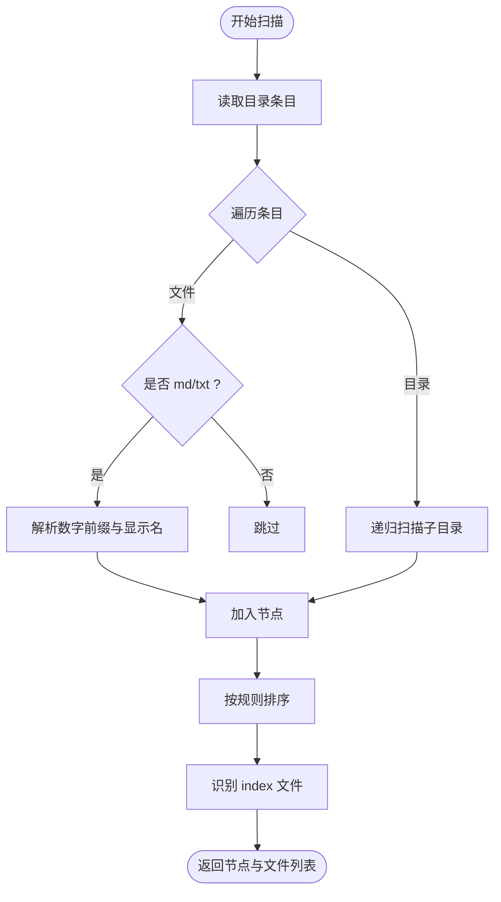

**图表来源**
- [src/services/contentScanner.ts:51-340](file://src/services/contentScanner.ts#L51-L340)

**章节来源**
- [src/services/contentScanner.ts:67-105](file://src/services/contentScanner.ts#L67-L105)
- [src/services/contentScanner.ts:191-238](file://src/services/contentScanner.ts#L191-L238)
- [src/services/contentScanner.ts:258-329](file://src/services/contentScanner.ts#L258-L329)

### EPUB 构建与打包（核心流程）
- 步骤：
  1) 将扫描树映射为章节（含标题、HTML 内容与资源）。
  2) 生成标题页、封面（若配置）、导航与 NCX。
  3) 构建 OEBPS 结构，写入 mimetype、container.xml、content.opf、nav.xhtml、toc.ncx、样式与资源。
  4) 使用 JSZip 生成 EPUB 文件并写出到磁盘。
- 关键点：
  - 章节按线性顺序编号（0001、0002…）。
  - Markdown frontmatter 中的 title 优先作为章节标题。
  - 本地图片引用统一改写为包内路径并打包。
  - 标题页固定在 spine 首位，确保打开即展示。

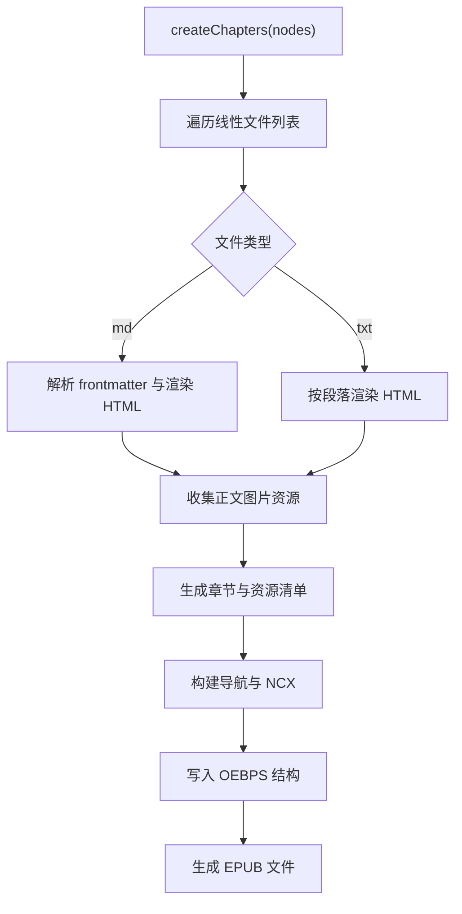

**图表来源**
- [src/services/epubService.ts:494-544](file://src/services/epubService.ts#L494-L544)
- [src/services/epubService.ts:146-216](file://src/services/epubService.ts#L146-L216)
- [src/services/epubService.ts:226-260](file://src/services/epubService.ts#L226-L260)
- [src/services/epubService.ts:340-390](file://src/services/epubService.ts#L340-L390)
- [src/services/epubService.ts:412-430](file://src/services/epubService.ts#L412-L430)
- [src/services/epubService.ts:440-463](file://src/services/epubService.ts#L440-L463)

**章节来源**
- [src/services/epubService.ts:146-1089](file://src/services/epubService.ts#L146-L1089)

### Markdown 合并服务（新增功能）
- 输入：元数据、内容树节点、输出文件路径。
- 处理流程：
  1) 收集所有文件节点（深度遍历内容树）。
  2) 生成小说标题（来自元数据 title）。
  3) 添加作者信息（来自元数据 author）。
  4) 逐个处理文件：
     - 读取原始文本
     - 解析 Markdown frontmatter 获取标题（若存在）
     - 过滤图片语法和 HTML 标签
     - 调整根目录文件的标题层级
     - 清理多余空行
  5) 写入合并后的 Markdown 文件。
- 输出：返回输出文件路径和章节数量。

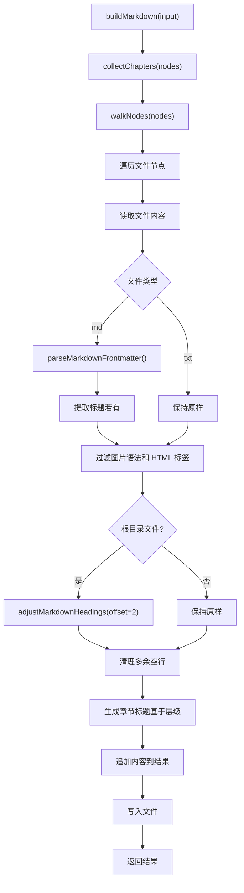

**图表来源**
- [src/services/markdownService.ts:30-89](file://src/services/markdownService.ts#L30-L89)
- [src/services/markdownService.ts:94-106](file://src/services/markdownService.ts#L94-L106)
- [src/services/markdownService.ts:115-136](file://src/services/markdownService.ts#L115-L136)
- [src/utils/markdownUtils.ts:11-25](file://src/utils/markdownUtils.ts#L11-L25)

**章节来源**
- [src/services/markdownService.ts:30-137](file://src/services/markdownService.ts#L30-L137)
- [src/utils/markdownUtils.ts:11-25](file://src/utils/markdownUtils.ts#L11-L25)

### Markdown 工具函数（新增功能）
- parseMarkdownFrontmatter：解析 Markdown 文件开头的 YAML frontmatter，提取 title 并返回清除 frontmatter 后的内容。
- 支持模式：`---\nfrontmatter内容\n---\n` 格式的 YAML 块。
- 错误处理：解析失败时返回原始内容，确保程序稳定性。

**章节来源**
- [src/utils/markdownUtils.ts:11-25](file://src/utils/markdownUtils.ts#L11-L25)

### 元数据模型与文件命名
- 元数据字段：title、titleSuffix、author、description、cover、version。
- 读取：解析 YAML，对字段进行类型收敛与默认值处理。
- 写入：初始化时生成默认模板；后续统一从文件读取。
- 文件命名：基于标题、副标题与作者生成合法文件名，避免非法字符。

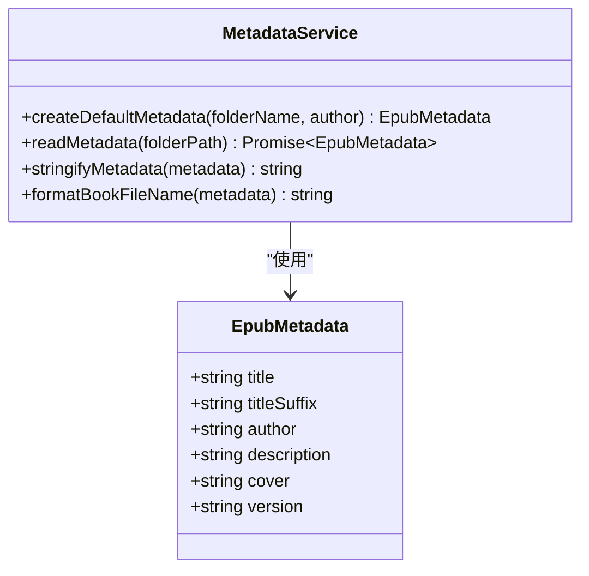

**图表来源**
- [src/services/metadata.ts:8-157](file://src/services/metadata.ts#L8-L157)

**章节来源**
- [src/services/metadata.ts:8-157](file://src/services/metadata.ts#L8-L157)

### 输出目录解析（__epub.yml）
- 查找策略：从当前目录向上查找 __epub.yml，找到后读取 saveTo。
- 支持：绝对路径、相对路径、以及以 ~ 或 ~/ 开头的用户目录展开。
- 回退：未找到配置时回退到当前目录。

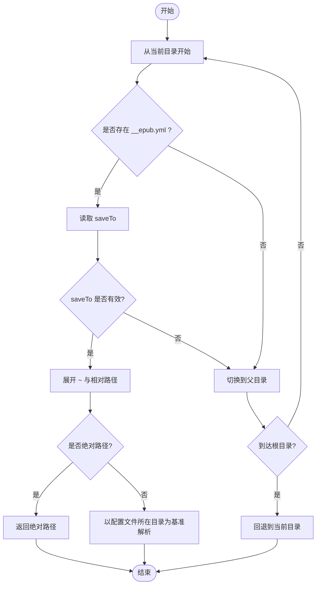

**图表来源**
- [src/services/outputResolver.ts:15-90](file://src/services/outputResolver.ts#L15-L90)

**章节来源**
- [src/services/outputResolver.ts:15-90](file://src/services/outputResolver.ts#L15-L90)

## 依赖关系分析
- 外部依赖：ignore（忽略规则）、jszip（EPUB 打包）、markdown-it（Markdown 渲染）、yaml（YAML 解析）。
- 内部耦合：
  - 命令层依赖服务层；服务层之间低耦合，通过接口与数据结构传递。
  - 内容扫描与 EPUB 构建共享 ContentNode 与 EpubMetadata 类型，保证数据一致性。
  - **生成合并 Markdown 命令**与 EPUB 生成命令共享相同的输入数据结构，但使用不同的输出服务。
  - **Markdown 合并服务**依赖 **Markdown 工具函数**进行 Frontmatter 解析。
  - 输出解析与元数据格式化贯穿生成流程，形成稳定的契约。

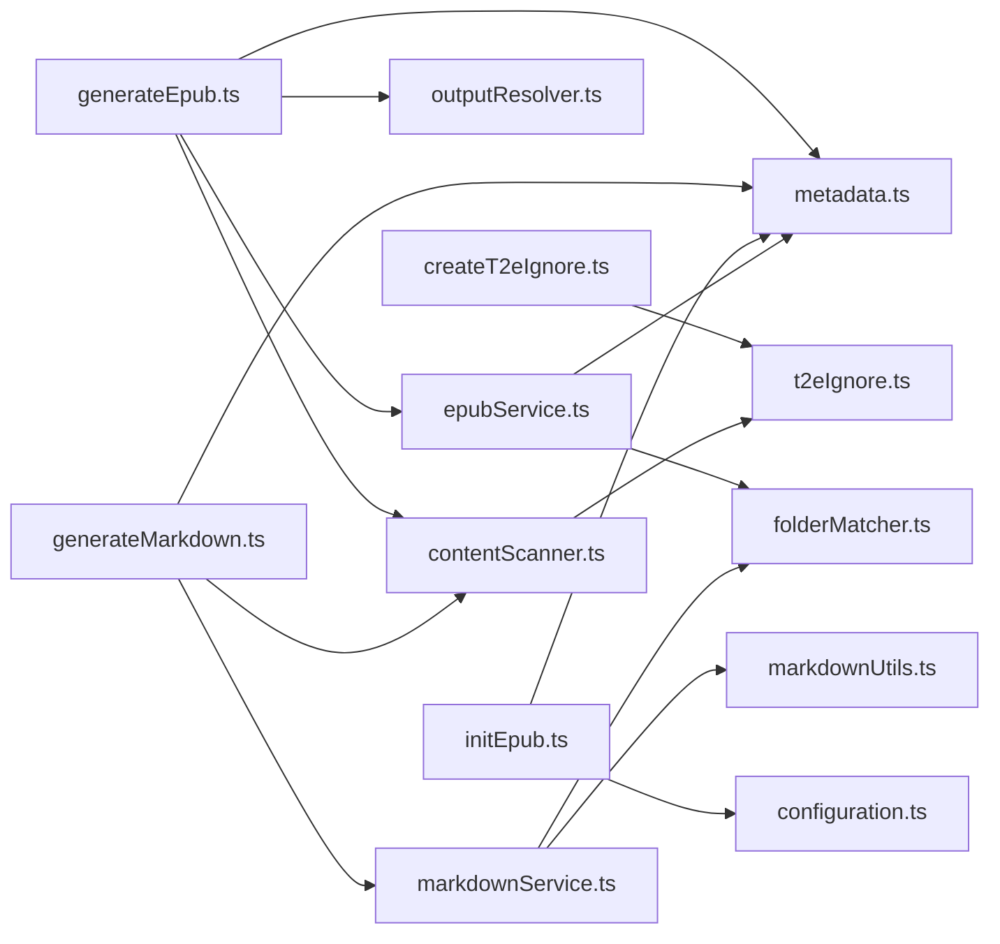

**图表来源**
- [src/commands/generateEpub.ts:5-11](file://src/commands/generateEpub.ts#L5-L11)
- [src/commands/generateMarkdown.ts:5-10](file://src/commands/generateMarkdown.ts#L5-L10)
- [src/commands/initEpub.ts:4-8](file://src/commands/initEpub.ts#L4-L8)
- [src/commands/createT2eIgnore.ts:6-8](file://src/commands/createT2eIgnore.ts#L6-L8)
- [src/services/epubService.ts:13-15](file://src/services/epubService.ts#L13-L15)
- [src/services/markdownService.ts:1-8](file://src/services/markdownService.ts#L1-L8)
- [src/utils/markdownUtils.ts:1-2](file://src/utils/markdownUtils.ts#L1-L2)
- [src/services/contentScanner.ts:1-6](file://src/services/contentScanner.ts#L1-L6)

**章节来源**
- [package.json:97-112](file://package.json#L97-L112)

## 性能考量
- I/O 优化：
  - 扫描阶段尽量减少重复读取，合并 .t2eignore 规则一次性应用。
  - EPUB 打包阶段使用 JSZip 的异步生成与压缩，避免大文件内存峰值过高。
  - **生成合并 Markdown** 采用流式处理，逐个文件读取和处理，避免内存峰值过高。
- 渲染与资源处理：
  - Markdown 渲染与图片重写在 EPUB 构建中完成，建议控制单章节大小与图片数量。
  - **Markdown 合并服务**在内存中处理所有内容，注意大目录树的内存占用。
  - **Markdown 工具函数**使用正则表达式解析 Frontmatter，复杂度与文件大小线性相关。
- 排序与遍历：
  - 目录排序使用本地化友好比较，复杂度 O(n log n)，在合理范围内可控。
  - **深度遍历内容树**的复杂度为 O(n)，其中 n 为文件总数。
  - 线性拍平与导航生成在内存中完成，注意大目录树的内存占用。

## 故障排查指南
- 常见问题与提示：
  - 目录缺少元数据：请先执行"初始化 EPUB"。
  - 目录无可用 md/txt 文件：请检查内容与 .t2eignore 规则。
  - 未配置默认作者：初始化时可交互配置。
  - 输出目录解析失败：检查父级 __epub.yml 的 saveTo 配置与路径有效性。
  - 封面文件缺失或格式不支持：确认 __t2e.data 下的封面文件存在且为受支持格式。
  - **生成合并 Markdown 失败**：检查目录中是否有可用的 md/txt 文件，确认输出路径权限。
- 建议操作：
  - 使用"新增 .t2eignore"在目标目录创建空文件，逐步添加规则。
  - 通过"配置当前 Workspace 默认作者"统一作者来源。
  - 生成前先预览扫描结果（可通过日志或临时输出查看）。
  - **使用"生成合并 Markdown"功能时，建议先在小规模目录上测试，确认标题层级调整符合预期。**

**章节来源**
- [src/commands/generateEpub.ts:20-64](file://src/commands/generateEpub.ts#L20-L64)
- [src/commands/generateMarkdown.ts:18-73](file://src/commands/generateMarkdown.ts#L18-L73)
- [src/commands/initEpub.ts:20-61](file://src/commands/initEpub.ts#L20-L61)
- [src/services/epubService.ts:604-633](file://src/services/epubService.ts#L604-L633)
- [src/services/outputResolver.ts:15-42](file://src/services/outputResolver.ts#L15-L42)

## 结论
VS Code Folder2EPUB 通过清晰的命令与服务分层，实现了从目录到 EPUB 的自动化流程。其核心优势在于：
- 严格的元数据驱动与文件命名规范；
- 灵活的 .t2eignore 过滤与目录排序；
- 完整的 EPUB 3 结构生成与资源打包；
- **新增的合并 Markdown 功能**，提供将目录内容整合为单个文件的能力；
- 与 VS Code 的无缝集成与本地化支持。

**更新建议** 在实际使用中结合 __epub.yml 的输出目录配置与 .t2eignore 的规则管理，以及 **新增的合并 Markdown 功能**，以获得更稳定与可维护的生成体验。

## 附录
- 使用场景示例（基于 README 的示例目录结构）：
  - 目录包含多级子目录与带数字前缀的章节文件，配合 index 文件作为目录入口。
  - Markdown 中引用本地图片，EPUB 构建时自动收集并重写路径。
  - 通过父级 __epub.yml 的 saveTo 将生成产物输出到用户目录或指定子目录。
  - **使用"生成合并 Markdown"功能将整个目录内容导出为单个 Markdown 文件，便于分享或进一步编辑。**
- 最佳实践：
  - 初始化时配置默认作者，避免每次手动填写。
  - 使用 .t2eignore 控制扫描范围，屏蔽临时文件与无关目录。
  - 合理规划章节命名与目录结构，利用数字前缀与 index 文件提升导航体验。
  - 生成前检查元数据与封面配置，确保封面文件存在且格式正确。
  - **使用"生成合并 Markdown"功能时，注意根目录文件的标题层级调整，避免与章节标题冲突。**
  - **对于大型目录，建议先在小规模测试，确认合并效果后再批量处理。**

**章节来源**
- [README.md:81-123](file://README.md#L81-L123)
- [README.md:124-241](file://README.md#L124-L241)
- [README.md:48-55](file://README.md#L48-L55)