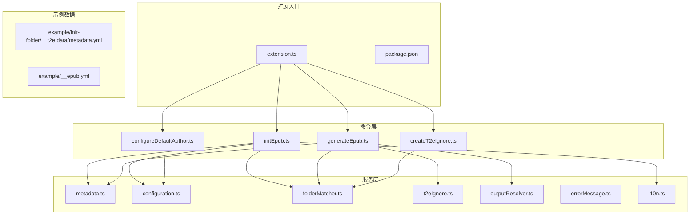
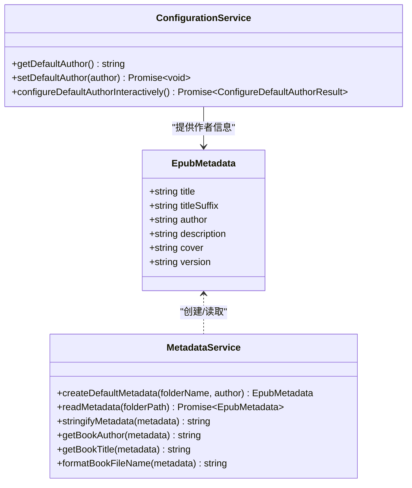
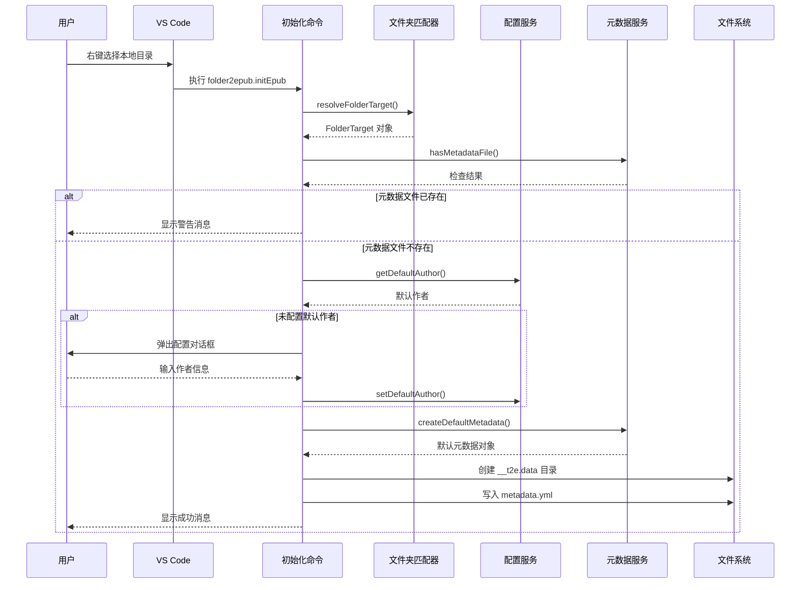
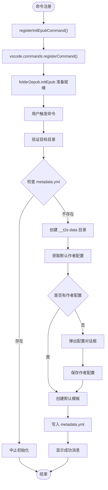
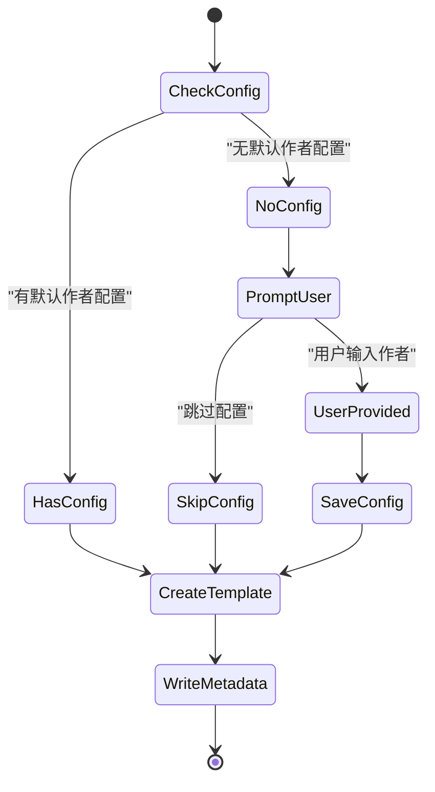
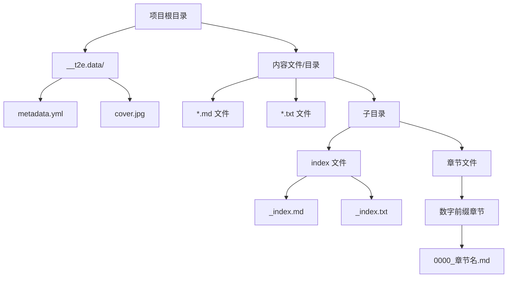
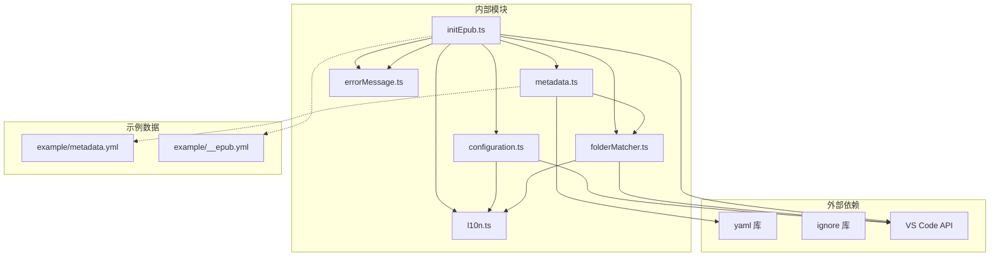

# 项目初始化功能

<cite>
**本文档引用的文件**
- [initEpub.ts](file://src/commands/initEpub.ts)
- [metadata.ts](file://src/services/metadata.ts)
- [configuration.ts](file://src/services/configuration.ts)
- [folderMatcher.ts](file://src/services/folderMatcher.ts)
- [t2eIgnore.ts](file://src/services/t2eIgnore.ts)
- [outputResolver.ts](file://src/services/outputResolver.ts)
- [createT2eIgnore.ts](file://src/commands/createT2eIgnore.ts)
- [extension.ts](file://src/extension.ts)
- [package.json](file://package.json)
- [README.md](file://README.md)
- [__epub.yml](file://example/__epub.yml)
- [metadata.yml](file://example/init-folder/__t2e.data/metadata.yml)
</cite>

## 目录
1. [简介](#简介)
2. [项目结构](#项目结构)
3. [核心组件](#核心组件)
4. [架构概览](#架构概览)
5. [详细组件分析](#详细组件分析)
6. [依赖关系分析](#依赖关系分析)
7. [性能考量](#性能考量)
8. [故障排除指南](#故障排除指南)
9. [结论](#结论)
10. [附录](#附录)

## 简介

项目初始化功能是 VS Code 扩展 Folder2EPUB 的核心特性之一，它提供了将本地文件夹快速转换为 EPUB 电子书的能力。本文档深入解析 `initEpub` 命令的完整工作流程，包括元数据文件创建、项目结构初始化和配置文件生成等关键环节。

该功能采用"目录即书籍"的设计理念，通过在 VS Code 资源管理器中右键选择本地目录，即可一键完成 EPUB 工程的初始化。初始化过程中会自动创建必要的目录结构，生成标准的元数据文件，并提供交互式的配置体验。

## 项目结构

该项目采用模块化设计，按照功能层次进行组织：



**图表来源**
- [extension.ts:1-24](file://src/extension.ts#L1-L24)
- [initEpub.ts:1-63](file://src/commands/initEpub.ts#L1-L63)
- [metadata.ts:1-157](file://src/services/metadata.ts#L1-L157)

**章节来源**
- [extension.ts:1-24](file://src/extension.ts#L1-L24)
- [package.json:1-114](file://package.json#L1-L114)

## 核心组件

### 初始化命令注册

初始化功能通过 VS Code 的命令系统进行注册，主要涉及以下核心组件：

1. **initEpub 命令处理器**：负责完整的初始化流程
2. **元数据服务**：处理 metadata.yml 文件的创建和读取
3. **配置服务**：管理默认作者配置
4. **文件夹匹配器**：验证目标目录的有效性
5. **本地化服务**：提供多语言支持

### 元数据模型定义

系统定义了标准化的 EPUB 元数据接口：



**图表来源**
- [metadata.ts:8-15](file://src/services/metadata.ts#L8-L15)
- [metadata.ts:24-33](file://src/services/metadata.ts#L24-L33)
- [configuration.ts:18-24](file://src/services/configuration.ts#L18-L24)

**章节来源**
- [metadata.ts:8-157](file://src/services/metadata.ts#L8-L157)
- [configuration.ts:1-80](file://src/services/configuration.ts#L1-L80)

## 架构概览

初始化功能的整体架构遵循分层设计原则，确保职责分离和代码可维护性：



**图表来源**
- [initEpub.ts:18-62](file://src/commands/initEpub.ts#L18-L62)
- [folderMatcher.ts:23-38](file://src/services/folderMatcher.ts#L23-L38)
- [configuration.ts:18-40](file://src/services/configuration.ts#L18-L40)
- [metadata.ts:24-33](file://src/services/metadata.ts#L24-L33)

## 详细组件分析

### 初始化命令实现

初始化命令是整个功能的核心，负责协调各个组件完成完整的初始化流程：

#### 命令注册与生命周期

初始化命令通过扩展入口进行注册，确保在 VS Code 启动时即可使用：



**图表来源**
- [initEpub.ts:18-62](file://src/commands/initEpub.ts#L18-L62)

#### 目录验证机制

系统通过严格的目录验证确保操作的安全性：

1. **URI 类型检查**：确保传入的是本地文件系统路径
2. **目录存在性验证**：确认目标路径确实指向一个目录
3. **元数据文件检查**：防止重复初始化覆盖现有配置

#### 作者配置流程

作者配置采用渐进式策略，优先使用工作区配置，必要时引导用户手动输入：



**图表来源**
- [initEpub.ts:30-50](file://src/commands/initEpub.ts#L30-L50)
- [configuration.ts:47-79](file://src/services/configuration.ts#L47-L79)

**章节来源**
- [initEpub.ts:18-62](file://src/commands/initEpub.ts#L18-L62)
- [configuration.ts:18-80](file://src/services/configuration.ts#L18-L80)

### 元数据文件管理

元数据文件是 EPUB 项目的核心配置文件，采用 YAML 格式存储标准化的书籍信息。

#### 元数据结构定义

元数据接口定义了完整的书籍信息字段：

| 字段名 | 类型 | 必填 | 默认值 | 描述 |
|--------|------|------|--------|------|
| title | string | 是 | 目录名 | 书籍主标题 |
| titleSuffix | string | 否 | 空字符串 | 书籍副标题 |
| author | string | 否 | 空字符串 | 书籍作者 |
| description | string | 否 | 空字符串 | 书籍描述 |
| cover | string | 否 | "cover.jpg" | 封面文件名 |
| version | string | 否 | "1.0.0" | 版本号 |

#### YAML 配置语法规范

元数据文件遵循标准 YAML 语法，支持以下特性：

1. **字符串类型**：所有字段均为字符串格式
2. **缩进规则**：使用 2 空格缩进
3. **注释支持**：支持 `#` 开头的注释行
4. **编码格式**：UTF-8 编码

#### 验证规则与错误处理

系统对元数据文件实施严格的验证机制：

1. **文件存在性检查**：确保文件存在且可读
2. **内容格式验证**：检查 YAML 格式正确性
3. **字段类型校验**：确保每个字段为字符串类型
4. **回退机制**：缺失字段使用预设默认值

**章节来源**
- [metadata.ts:8-157](file://src/services/metadata.ts#L8-L157)
- [README.md:50-59](file://README.md#L50-L59)

### 项目结构初始化

初始化过程会创建标准的项目目录结构，确保后续生成流程的顺利进行。

#### 目录结构要求



**图表来源**
- [folderMatcher.ts:7-9](file://src/services/folderMatcher.ts#L7-L9)
- [README.md:81-112](file://README.md#L81-L112)

#### __t2e.data 目录的作用

`__t2e.data` 目录是系统保留的元数据存储目录，具有以下特点：

1. **系统保留**：不会被 `.t2eignore` 文件过滤
2. **集中管理**：所有元数据文件统一存放于此
3. **版本控制友好**：便于 Git 等版本控制系统管理
4. **命名规范**：使用双下划线前缀避免与普通内容混淆

#### 文件权限处理

初始化过程中的文件权限遵循以下策略：

1. **目录创建**：使用递归创建，确保父级目录存在
2. **文件写入**：使用 UTF-8 编码写入元数据文件
3. **权限继承**：继承父级目录的文件权限
4. **安全检查**：避免覆盖现有重要文件

**章节来源**
- [folderMatcher.ts:46-58](file://src/services/folderMatcher.ts#L46-L58)
- [initEpub.ts:28-54](file://src/commands/initEpub.ts#L28-L54)

### 配置文件生成

初始化过程会生成标准的配置文件模板，为后续的 EPUB 生成提供基础配置。

#### 默认配置模板

系统生成的默认元数据模板包含以下字段：

```yaml
title: 当前文件夹名
titleSuffix: ''           # 副标题
author: [当前 Workspace 默认作者；未配置则为空]
description: ''           # 书籍描述
cover: cover.jpg         # 封面文件名
version: 1.0.0           # 版本号
```

#### 配置优先级机制

配置信息的优先级顺序如下：

1. **工作区配置**：当前工作区的默认作者设置
2. **用户配置**：VS Code 用户级别的全局设置
3. **交互输入**：初始化时的用户手动输入
4. **默认值**：系统预设的回退值

#### 配置验证与错误处理

系统对配置文件实施多层次的验证：

1. **语法检查**：确保 YAML 格式正确
2. **字段完整性**：验证必需字段的存在性
3. **类型一致性**：确保字段类型符合预期
4. **范围限制**：检查数值字段的合理范围

**章节来源**
- [metadata.ts:24-33](file://src/services/metadata.ts#L24-L33)
- [configuration.ts:18-40](file://src/services/configuration.ts#L18-L40)

## 依赖关系分析

初始化功能涉及多个模块间的复杂依赖关系，这些关系确保了功能的完整性和可靠性。



**图表来源**
- [package.json:97-102](file://package.json#L97-L102)
- [initEpub.ts:1-8](file://src/commands/initEpub.ts#L1-L8)

### 外部依赖分析

系统对外部依赖的使用体现了最小化原则：

1. **yaml 库**：用于元数据文件的解析和序列化
2. **ignore 库**：用于文件过滤规则的处理
3. **VS Code API**：提供集成开发环境的交互能力

### 内部模块耦合度

各内部模块保持低耦合高内聚的设计：

1. **initEpub.ts**：仅依赖必要的服务模块
2. **metadata.ts**：专注于元数据处理逻辑
3. **configuration.ts**：处理配置相关的业务逻辑
4. **folderMatcher.ts**：提供文件系统操作的通用方法

**章节来源**
- [package.json:97-102](file://package.json#L97-L102)
- [initEpub.ts:1-8](file://src/commands/initEpub.ts#L1-L8)

## 性能考量

初始化功能在设计时充分考虑了性能优化，确保在各种环境下都能提供流畅的用户体验。

### 文件系统操作优化

1. **异步操作**：所有文件系统操作均采用异步模式，避免阻塞主线程
2. **批量处理**：目录创建和文件写入采用批量操作减少系统调用次数
3. **缓存机制**：配置信息在内存中缓存，减少重复读取

### 内存使用优化

1. **流式处理**：大文件读取采用流式处理避免内存峰值
2. **及时释放**：操作完成后及时释放内存资源
3. **垃圾回收**：合理使用 JavaScript 的垃圾回收机制

### 错误恢复机制

1. **原子操作**：文件写入采用临时文件+重命名的方式确保原子性
2. **回滚策略**：失败时自动清理已创建的部分文件
3. **状态检查**：每一步操作都进行状态验证

## 故障排除指南

### 常见问题及解决方案

#### 1. 目录验证失败

**问题现象**：执行初始化命令时报错，提示不是本地目录

**可能原因**：
- 选择了文件而非目录
- 使用了网络驱动器或远程路径
- 权限不足无法访问目标路径

**解决步骤**：
1. 确认在 VS Code 资源管理器中右键点击的是本地文件夹
2. 检查文件夹路径是否为有效的本地绝对路径
3. 确认当前用户对目标目录具有读取权限

#### 2. 元数据文件已存在

**问题现象**：初始化被中止，提示 metadata.yml 已存在

**可能原因**：
- 之前已经执行过初始化操作
- 手动创建了元数据文件
- 项目结构已被其他工具修改

**解决步骤**：
1. 检查 `__t2e.data/metadata.yml` 是否存在
2. 如需重新初始化，先删除现有元数据文件
3. 重新执行初始化命令

#### 3. 作者配置问题

**问题现象**：初始化过程中无法获取默认作者配置

**可能原因**：
- 当前 VS Code 工作区未打开
- 配置项未正确设置
- 权限不足导致配置读取失败

**解决步骤**：
1. 确保 VS Code 已打开工作区
2. 通过命令面板配置默认作者
3. 检查工作区配置文件的权限

#### 4. 文件写入失败

**问题现象**：元数据文件创建失败

**可能原因**：
- 目标目录没有写入权限
- 磁盘空间不足
- 文件系统异常

**解决步骤**：
1. 检查目标目录的写入权限
2. 确认磁盘空间充足
3. 重启 VS Code 后重试

### 调试技巧

#### 日志记录

系统在关键节点添加了详细的日志记录，便于问题诊断：

1. **命令执行日志**：记录初始化命令的完整执行流程
2. **文件操作日志**：记录所有文件系统的读写操作
3. **错误堆栈**：捕获并记录详细的错误信息

#### 验证方法

1. **手动检查**：通过文件浏览器验证目录结构
2. **命令验证**：使用 VS Code 的命令面板验证功能可用性
3. **日志分析**：查看 VS Code 输出面板中的扩展日志

**章节来源**
- [initEpub.ts:58-61](file://src/commands/initEpub.ts#L58-L61)
- [configuration.ts:33-40](file://src/services/configuration.ts#L33-L40)

## 结论

项目初始化功能通过精心设计的架构和严格的实现细节，为 VS Code 用户提供了一键式 EPUB 项目创建体验。该功能不仅满足了基本的初始化需求，还通过完善的错误处理、配置管理和性能优化，确保了在各种使用场景下的稳定性和可靠性。

### 主要优势

1. **用户友好**：简洁直观的交互流程，降低使用门槛
2. **安全可靠**：多重验证机制防止误操作和数据丢失
3. **扩展性强**：模块化设计便于功能扩展和维护
4. **国际化支持**：完整的多语言本地化支持

### 技术亮点

1. **标准化元数据**：采用统一的 YAML 格式确保跨平台兼容性
2. **智能配置管理**：灵活的配置优先级机制适应不同使用场景
3. **健壮的错误处理**：完善的异常捕获和恢复机制
4. **性能优化**：异步操作和缓存策略提升响应速度

## 附录

### 使用示例

#### 基本初始化流程

1. 在 VS Code 资源管理器中右键点击目标文件夹
2. 选择 "Folder2EPUB: 初始化 epub" 命令
3. 如果首次使用，系统会提示配置默认作者
4. 等待初始化完成，检查 `__t2e.data/metadata.yml` 文件

#### 高级配置选项

1. **自定义封面**：在 `__t2e.data/` 目录下放置自定义封面文件
2. **多语言支持**：系统自动跟随 VS Code 的显示语言
3. **工作区隔离**：不同工作区可以有不同的默认配置

### 最佳实践

1. **目录命名**：使用有意义的文件夹名称便于识别
2. **内容组织**：按照章节顺序命名文件，使用数字前缀确保正确排序
3. **元数据维护**：定期更新元数据信息保持准确性
4. **版本控制**：将元数据文件纳入版本控制系统

### 扩展性考虑

系统设计充分考虑了未来的功能扩展需求：

1. **插件架构**：模块化设计便于添加新功能
2. **配置扩展**：元数据结构支持未来字段的添加
3. **国际化支持**：完整的本地化框架支持更多语言
4. **性能优化**：异步架构支持大规模项目的处理