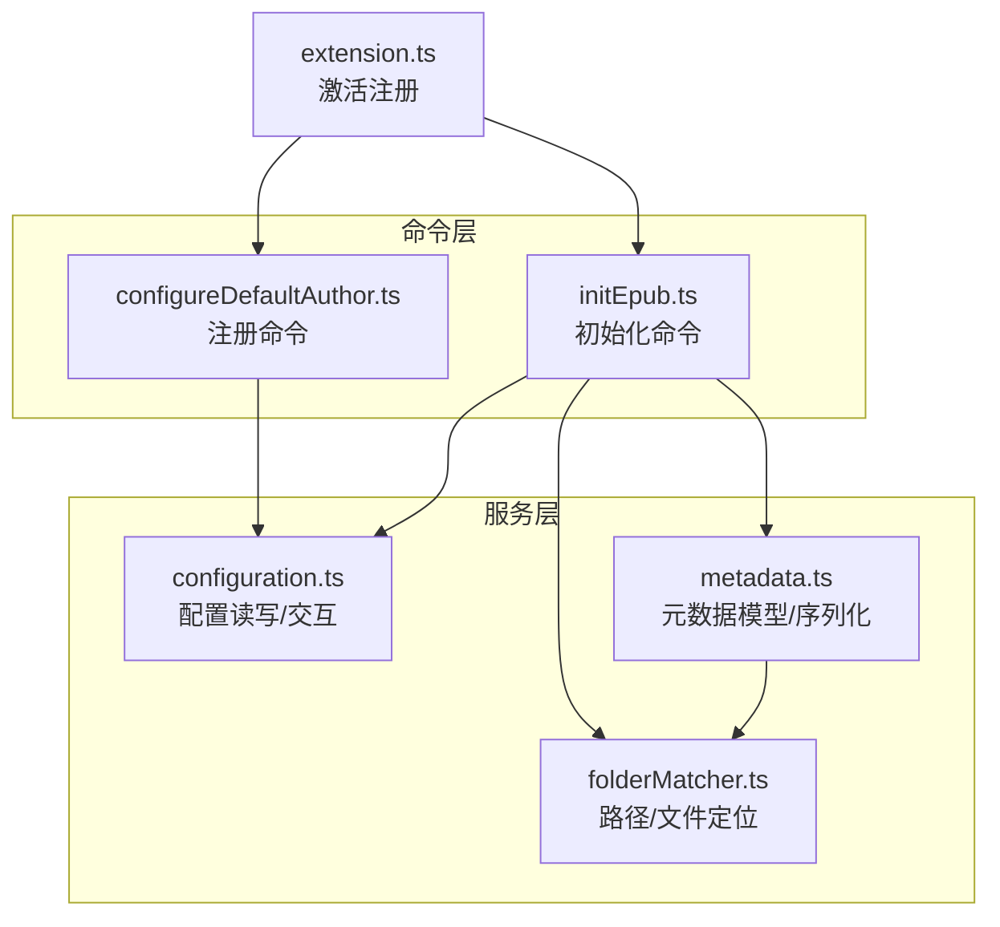
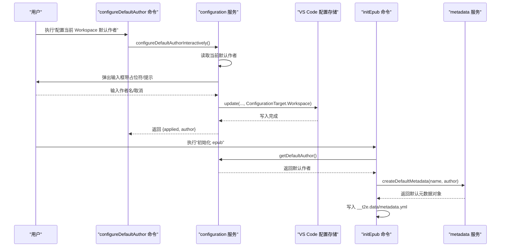
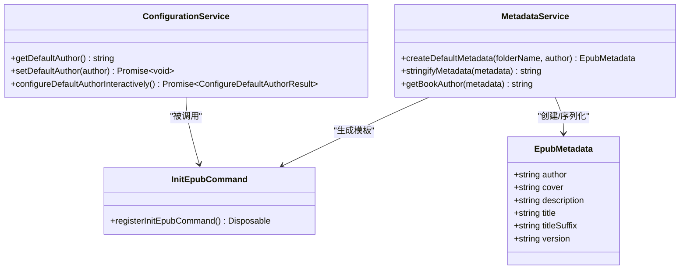
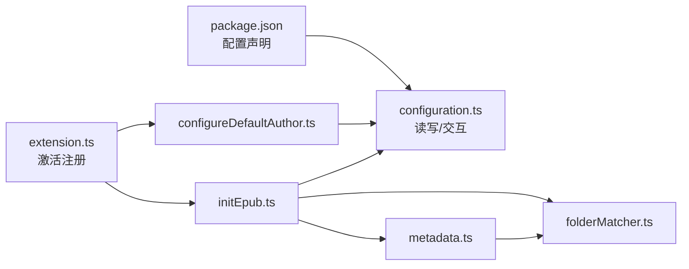
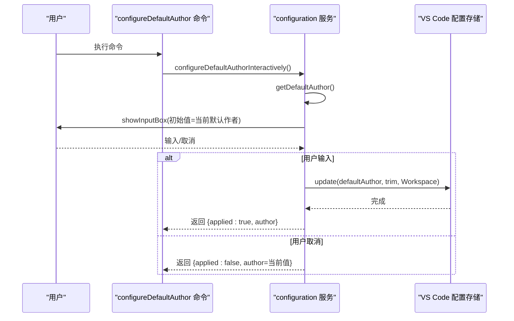

# 默认作者配置

<cite>
**本文引用的文件**
- [configureDefaultAuthor.ts](file://src/commands/configureDefaultAuthor.ts)
- [configuration.ts](file://src/services/configuration.ts)
- [initEpub.ts](file://src/commands/initEpub.ts)
- [metadata.ts](file://src/services/metadata.ts)
- [folderMatcher.ts](file://src/services/folderMatcher.ts)
- [extension.ts](file://src/extension.ts)
- [package.json](file://package.json)
- [README.md](file://README.md)
- [bundle.l10n.json](file://l10n/bundle.l10n.json)
- [bundle.l10n.zh-cn.json](file://l10n/bundle.l10n.zh-cn.json)
</cite>

## 目录
1. [简介](#简介)
2. [项目结构](#项目结构)
3. [核心组件](#核心组件)
4. [架构总览](#架构总览)
5. [详细组件分析](#详细组件分析)
6. [依赖关系分析](#依赖关系分析)
7. [性能考量](#性能考量)
8. [故障排查指南](#故障排查指南)
9. [结论](#结论)
10. [附录](#附录)

## 简介
本技术文档围绕“默认作者配置”功能展开，系统阐述 configureDefaultAuthor 命令的实现原理与工作机制，重点包括：
- VS Code 配置存储机制与工作区级别设置管理
- 配置项的数据结构与验证规则
- 如何在 EPUB 元数据中应用默认作者信息
- 配置读取与更新流程，包括用户交互界面与配置对话框
- 使用场景与配置示例
- 配置优先级与覆盖规则
- 配置迁移与兼容性考虑
- 常见问题与解决方案

## 项目结构
该扩展采用命令驱动的服务化架构，命令层负责用户交互与流程编排，服务层负责具体业务逻辑与数据处理。默认作者配置涉及的关键文件如下：
- 命令注册与入口：extension.ts、configureDefaultAuthor.ts、initEpub.ts
- 配置服务：configuration.ts
- 元数据服务：metadata.ts、folderMatcher.ts
- 配置声明与本地化：package.json、l10n/bundle.l10n*.json

图表来源
- [extension.ts:13-18](file://src/extension.ts#L13-L18)
- [configureDefaultAuthor.ts:12-25](file://src/commands/configureDefaultAuthor.ts#L12-L25)
- [initEpub.ts:18-62](file://src/commands/initEpub.ts#L18-L62)
- [configuration.ts:18-79](file://src/services/configuration.ts#L18-L79)
- [metadata.ts:24-69](file://src/services/metadata.ts#L24-L69)
- [folderMatcher.ts:46-58](file://src/services/folderMatcher.ts#L46-L58)

章节来源
- [extension.ts:13-18](file://src/extension.ts#L13-L18)
- [package.json:43-96](file://package.json#L43-L96)

## 核心组件
- configureDefaultAuthor 命令：注册并执行“配置当前 Workspace 默认作者”，封装交互与错误处理。
- configuration 服务：提供读取/写入默认作者、交互式配置等能力，基于 VS Code 配置 API 实现工作区级持久化。
- initEpub 命令：在初始化 EPUB 时读取默认作者，必要时引导用户配置。
- metadata 服务：定义 EPUB 元数据模型，提供默认模板生成与序列化。
- folderMatcher 服务：提供元数据文件路径计算与存在性判断。

章节来源
- [configureDefaultAuthor.ts:12-25](file://src/commands/configureDefaultAuthor.ts#L12-L25)
- [configuration.ts:18-79](file://src/services/configuration.ts#L18-L79)
- [initEpub.ts:18-62](file://src/commands/initEpub.ts#L18-L62)
- [metadata.ts:8-33](file://src/services/metadata.ts#L8-L33)
- [folderMatcher.ts:46-58](file://src/services/folderMatcher.ts#L46-L58)

## 架构总览
默认作者配置贯穿“命令 -> 服务 -> 配置存储 -> 元数据应用”的链路。命令层负责用户交互与异常兜底；服务层负责配置读写与元数据模板生成；配置存储采用 VS Code 的工作区配置目标；元数据应用体现在初始化时写入 metadata.yml。

图表来源
- [configureDefaultAuthor.ts:12-25](file://src/commands/configureDefaultAuthor.ts#L12-L25)
- [configuration.ts:47-79](file://src/services/configuration.ts#L47-L79)
- [initEpub.ts:18-62](file://src/commands/initEpub.ts#L18-L62)
- [metadata.ts:24-33](file://src/services/metadata.ts#L24-L33)

## 详细组件分析

### 命令：configureDefaultAuthor
- 注册与职责
  - 注册命令 ID：folder2epub.configureDefaultAuthor
  - 调用交互式配置函数，捕获异常并统一提示
- 用户交互
  - 输入框标题、提示、占位符、初始值均来自本地化资源
  - 忽略焦点丢失，保证输入体验
- 错误处理
  - 捕获异常并以统一错误消息提示
  - 返回固定结构的结果对象，便于上层流程复用

章节来源
- [configureDefaultAuthor.ts:12-25](file://src/commands/configureDefaultAuthor.ts#L12-L25)
- [bundle.l10n.json:21-26](file://l10n/bundle.l10n.json#L21-L26)
- [bundle.l10n.zh-cn.json:21-26](file://l10n/bundle.l10n.zh-cn.json#L21-L26)

### 服务：configuration（配置读写与交互）
- 配置键与作用域
  - 配置段：folder2epub
  - 键：defaultAuthor
  - 作用域：window（VS Code 配置声明中指定）
- 读取默认作者
  - 使用 inspect 获取工作区值（workspaceValue），并 trim 去除空白
  - 未配置时返回空字符串
- 写入默认作者
  - 校验当前是否处于有效工作区（存在 workspaceFile 或 workspaceFolders）
  - 使用 ConfigurationTarget.Workspace 写入
  - 写入前 trim
- 交互式配置
  - 读取当前值作为输入框初始值
  - 用户取消时返回未应用状态
  - 成功应用后给出信息提示

章节来源
- [configuration.ts:5-6](file://src/services/configuration.ts#L5-L6)
- [configuration.ts:18-24](file://src/services/configuration.ts#L18-L24)
- [configuration.ts:32-40](file://src/services/configuration.ts#L32-L40)
- [configuration.ts:47-79](file://src/services/configuration.ts#L47-L79)
- [package.json:66-76](file://package.json#L66-L76)

### 服务：metadata（元数据模型与模板）
- 数据结构
  - EpubMetadata：包含 author、cover、description、title、titleSuffix、version
- 默认模板
  - createDefaultMetadata(folderName, author)：以文件夹名为 title，author 来自配置，其余字段使用默认值
- 序列化
  - stringifyMetadata：将对象序列化为 YAML 文本
- 作者规范化
  - getBookAuthor：若 author 为空则回退为本地化“Unknown”

章节来源
- [metadata.ts:8-15](file://src/services/metadata.ts#L8-L15)
- [metadata.ts:24-33](file://src/services/metadata.ts#L24-L33)
- [metadata.ts:67-69](file://src/services/metadata.ts#L67-L69)
- [metadata.ts:77-79](file://src/services/metadata.ts#L77-L79)

### 服务：folderMatcher（路径与文件定位）
- 元数据目录与文件常量：__t2e.data/metadata.yml
- 路径计算：getMetadataDirPath、getMetadataFilePath
- 存在性判断：hasMetadataFile

章节来源
- [folderMatcher.ts:7-9](file://src/services/folderMatcher.ts#L7-L9)
- [folderMatcher.ts:46-58](file://src/services/folderMatcher.ts#L46-L58)
- [folderMatcher.ts:82-84](file://src/services/folderMatcher.ts#L82-L84)

### 命令：initEpub（初始化流程）
- 流程要点
  - 解析目标目录并校验是否为本地目录
  - 若 metadata.yml 已存在则中止初始化
  - 读取默认作者：若为空则弹窗引导用户配置
  - 使用 createDefaultMetadata 生成模板并写入 YAML
- 与默认作者的衔接
  - 优先使用工作区默认作者
  - 用户可选择“立即配置”或“本次留空”

章节来源
- [initEpub.ts:18-62](file://src/commands/initEpub.ts#L18-L62)
- [metadata.ts:24-33](file://src/services/metadata.ts#L24-L33)

### 类图：配置与元数据相关类型

图表来源
- [configuration.ts:18-79](file://src/services/configuration.ts#L18-L79)
- [initEpub.ts:18-62](file://src/commands/initEpub.ts#L18-L62)
- [metadata.ts:8-33](file://src/services/metadata.ts#L8-L33)

## 依赖关系分析
- 命令到服务
  - configureDefaultAuthor.ts 依赖 configuration.ts
  - initEpub.ts 依赖 configuration.ts、metadata.ts、folderMatcher.ts
- 服务到配置
  - configuration.ts 依赖 VS Code 配置 API（工作区目标）
- 配置声明
  - package.json 声明 folder2epub.defaultAuthor，作用域为 window

图表来源
- [package.json:66-76](file://package.json#L66-L76)
- [extension.ts:13-18](file://src/extension.ts#L13-L18)
- [configureDefaultAuthor.ts:12-25](file://src/commands/configureDefaultAuthor.ts#L12-L25)
- [initEpub.ts:18-62](file://src/commands/initEpub.ts#L18-L62)
- [configuration.ts:18-79](file://src/services/configuration.ts#L18-L79)
- [metadata.ts:24-33](file://src/services/metadata.ts#L24-L33)
- [folderMatcher.ts:46-58](file://src/services/folderMatcher.ts#L46-L58)

章节来源
- [package.json:66-76](file://package.json#L66-L76)
- [extension.ts:13-18](file://src/extension.ts#L13-L18)

## 性能考量
- 配置读写均为轻量操作，主要成本在 VS Code 配置存储与文件系统 I/O
- 交互式配置仅在用户主动触发时执行，避免不必要的 UI 开销
- 元数据模板生成与 YAML 序列化为纯内存操作，复杂度低

## 故障排查指南
- “请先打开一个 Workspace，然后再配置默认作者”
  - 现象：尝试配置默认作者时报错
  - 原因：当前未打开任何工作区
  - 处理：在 VS Code 中打开一个工作区后再试
  - 参考来源
    - [configuration.ts:33-35](file://src/services/configuration.ts#L33-L35)
    - [bundle.l10n.json:21](file://l10n/bundle.l10n.json#L21)
    - [bundle.l10n.zh-cn.json:21](file://l10n/bundle.l10n.zh-cn.json#L21)

- “当前 Workspace 尚未配置默认作者。是否现在配置？”
  - 现象：初始化 EPUB 时提示未配置默认作者
  - 处理：点击“立即配置”进入交互式配置；或点击“本次留空”继续初始化但 author 为空
  - 参考来源
    - [initEpub.ts:33-37](file://src/commands/initEpub.ts#L33-L37)
    - [bundle.l10n.json:16](file://l10n/bundle.l10n.json#L16)
    - [bundle.l10n.zh-cn.json:16](file://l10n/bundle.l10n.zh-cn.json#L16)

- “__t2e.data/metadata.yml 已存在，已放弃初始化”
  - 现象：重复初始化时报错
  - 原因：已存在元数据文件，防止覆盖
  - 处理：删除或重命名现有文件后重试
  - 参考来源
    - [initEpub.ts:23-26](file://src/commands/initEpub.ts#L23-L26)
    - [bundle.l10n.json:15](file://l10n/bundle.l10n.json#L15)
    - [bundle.l10n.zh-cn.json:15](file://l10n/bundle.l10n.zh-cn.json#L15)

- “配置当前 Workspace 默认作者失败：...”
  - 现象：命令执行异常
  - 处理：查看错误详情并确保工作区有效、网络正常
  - 参考来源
    - [configureDefaultAuthor.ts:17-23](file://src/commands/configureDefaultAuthor.ts#L17-L23)
    - [bundle.l10n.json:2](file://l10n/bundle.l10n.json#L2)
    - [bundle.l10n.zh-cn.json:2](file://l10n/bundle.l10n.zh-cn.json#L2)

## 结论
默认作者配置通过 VS Code 的工作区配置目标实现持久化，结合交互式输入框与初始化流程无缝衔接，既满足批量项目的一致性需求，又允许用户在必要时覆盖。配置项采用 window 作用域，适合跨项目共享；在初始化时优先使用默认作者，未配置时提供明确引导，确保元数据完整性与用户体验。

## 附录

### 配置项数据结构与验证规则
- 配置键：folder2epub.defaultAuthor
- 类型：string
- 默认值：空字符串
- 作用域：window
- 验证规则
  - 读取时自动 trim
  - 写入前自动 trim
  - 未配置时返回空字符串
- 参考来源
  - [package.json:69-74](file://package.json#L69-L74)
  - [configuration.ts:18-24](file://src/services/configuration.ts#L18-L24)
  - [configuration.ts:32-40](file://src/services/configuration.ts#L32-L40)

### 在 EPUB 元数据中的应用
- 初始化模板
  - 使用 createDefaultMetadata(folderName, author) 生成默认元数据
  - author 字段由工作区默认作者填充
- 文件落盘
  - initEpub 命令将默认模板写入 __t2e.data/metadata.yml
- 作者回退
  - 若 author 为空，getBookAuthor 回退为本地化“Unknown”
- 参考来源
  - [metadata.ts:24-33](file://src/services/metadata.ts#L24-L33)
  - [initEpub.ts:53-54](file://src/commands/initEpub.ts#L53-L54)
  - [metadata.ts:77-79](file://src/services/metadata.ts#L77-L79)

### 配置读取与更新流程（时序）

图表来源
- [configureDefaultAuthor.ts:12-25](file://src/commands/configureDefaultAuthor.ts#L12-L25)
- [configuration.ts:47-79](file://src/services/configuration.ts#L47-L79)

### 用户交互界面与配置对话框
- 输入框属性
  - 标题：配置当前 Workspace 默认作者
  - 提示：用于初始化 __t2e.data/metadata.yml 中的 author；留空表示清除此配置
  - 占位符：例如：鲁迅
  - 初始值：当前默认作者
  - 行为：忽略焦点丢失
- 参考来源
  - [configuration.ts:49-55](file://src/services/configuration.ts#L49-L55)
  - [bundle.l10n.json:22-24](file://l10n/bundle.l10n.json#L22-L24)
  - [bundle.l10n.zh-cn.json:22-24](file://l10n/bundle.l10n.zh-cn.json#L22-L24)

### 使用场景与示例
- 场景一：团队项目统一作者
  - 在工作区中设置默认作者，所有新初始化的书籍元数据 author 字段自动填充
- 场景二：个人项目临时留空
  - 初始化时选择“本次留空”，author 为空，后续手动编辑 metadata.yml
- 场景三：覆盖默认作者
  - 在 metadata.yml 中单独设置 author，优先于默认作者
- 参考来源
  - [README.md:66-71](file://README.md#L66-L71)
  - [initEpub.ts:30-50](file://src/commands/initEpub.ts#L30-L50)

### 配置优先级与覆盖规则
- 优先级
  - 元数据文件中的 author 字段优先于工作区默认作者
  - 初始化时优先使用工作区默认作者，未配置时可引导用户输入
- 覆盖规则
  - 初始化时若 __t2e.data/metadata.yml 已存在则中止，避免覆盖
  - 清除默认作者：在配置对话框留空并确认
- 参考来源
  - [initEpub.ts:23-26](file://src/commands/initEpub.ts#L23-L26)
  - [configuration.ts:64-65](file://src/services/configuration.ts#L64-L65)

### 配置迁移与兼容性
- 作用域变更
  - 配置声明的作用域为 window；若未来改为 workspaceFolder，需评估对多根工作区的影响
- 兼容性
  - 读取时自动 trim，写入前也 trim，避免历史配置中的空白字符导致差异
- 参考来源
  - [package.json:72](file://package.json#L72)
  - [configuration.ts:18-24](file://src/services/configuration.ts#L18-L24)
  - [configuration.ts:32-40](file://src/services/configuration.ts#L32-L40)