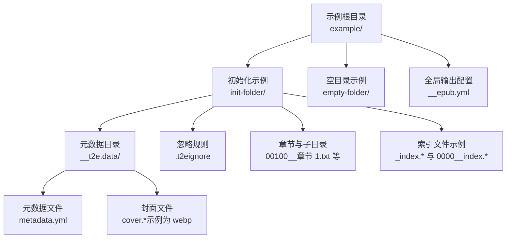
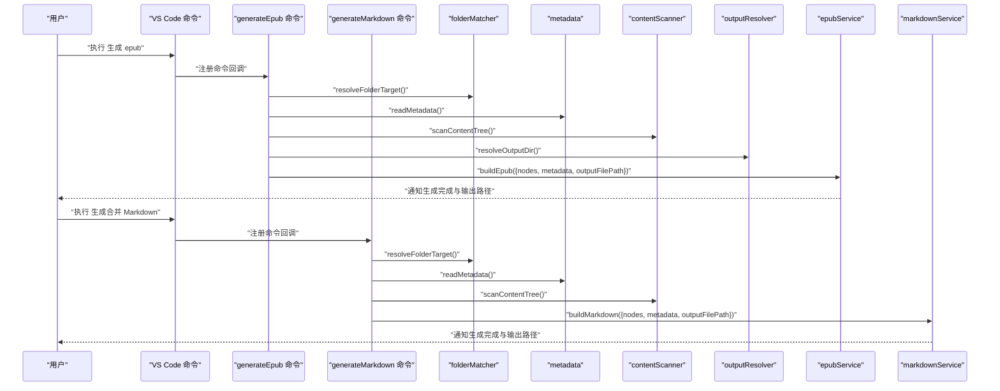
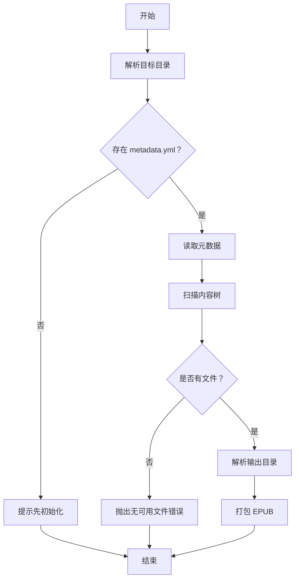
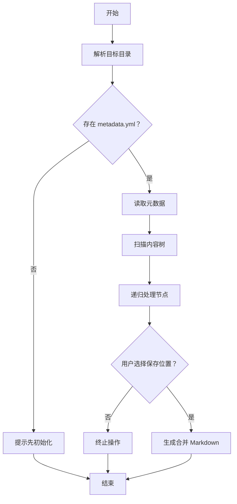
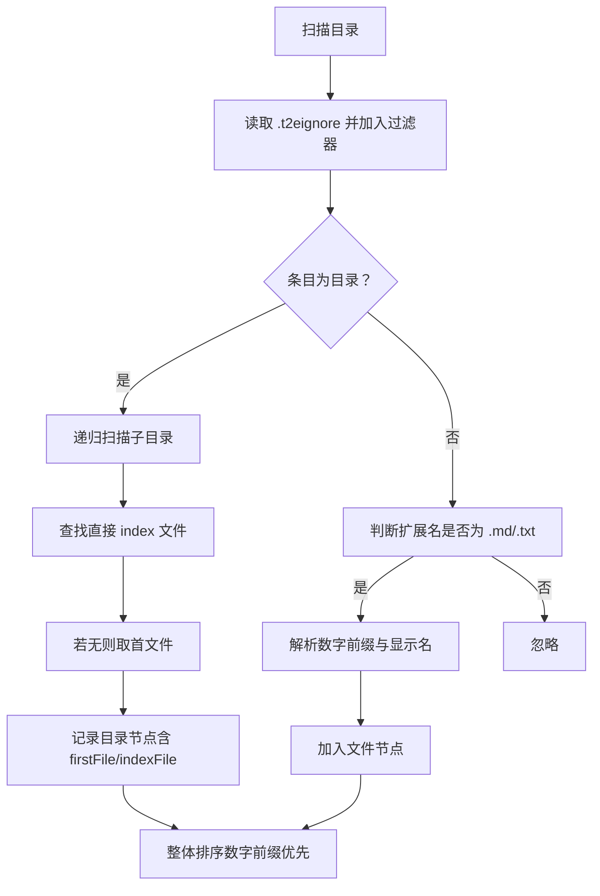
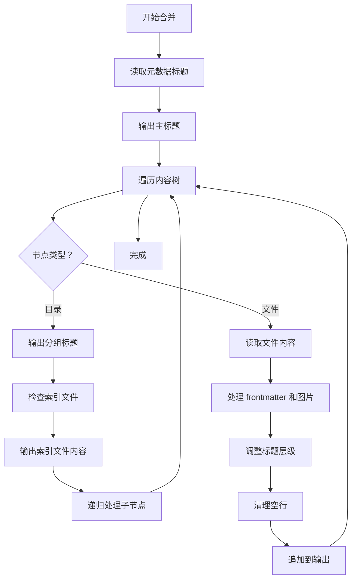
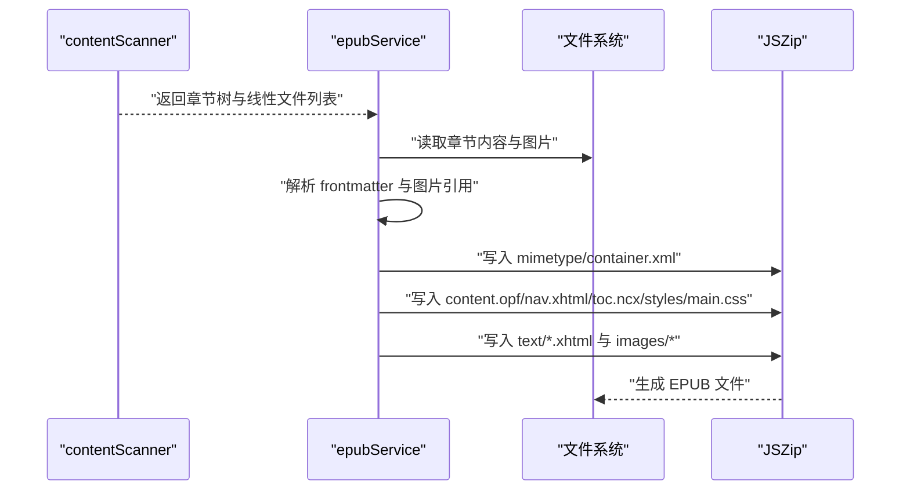
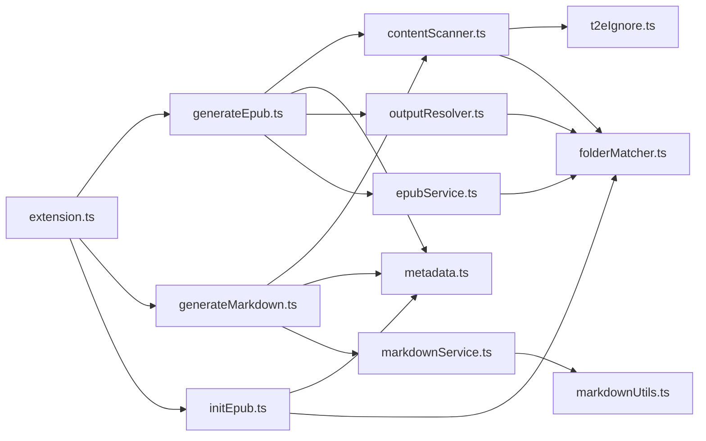

# 示例与最佳实践

<cite>
**本文引用的文件**
- [package.json](file://package.json)
- [README.md](file://README.md)
- [src/extension.ts](file://src/extension.ts)
- [src/commands/generateEpub.ts](file://src/commands/generateEpub.ts)
- [src/commands/generateMarkdown.ts](file://src/commands/generateMarkdown.ts)
- [src/commands/initEpub.ts](file://src/commands/initEpub.ts)
- [src/services/contentScanner.ts](file://src/services/contentScanner.ts)
- [src/services/markdownService.ts](file://src/services/markdownService.ts)
- [src/services/metadata.ts](file://src/services/metadata.ts)
- [src/services/folderMatcher.ts](file://src/services/folderMatcher.ts)
- [src/services/epubService.ts](file://src/services/epubService.ts)
- [src/services/t2eIgnore.ts](file://src/services/t2eIgnore.ts)
- [src/services/outputResolver.ts](file://src/services/outputResolver.ts)
- [src/utils/markdownUtils.ts](file://src/utils/markdownUtils.ts)
- [example/__epub.yml](file://example/__epub.yml)
- [example/init-folder/__t2e.data/metadata.yml](file://example/init-folder/__t2e.data/metadata.yml)
- [example/init-folder/.t2eignore](file://example/init-folder/.t2eignore)
- [example/init-folder/00100__章节 1.txt](file://example/init-folder/00100__章节 1.txt)
- [example/init-folder/00102___子目录 1/0000_index.md](file://example/init-folder/00102___子目录 1/0000_index.md)
- [example/init-folder/00103___子目录 2/000_index.txt](file://example/init-folder/00103___子目录 2/000_index.txt)
- [example/init-folder/00105___index test/_index.txt](file://example/init-folder/00105___index test/_index.txt)
- [example/init-folder/00105___index test/00001_子目录 2-1/_index.md](file://example/init-folder/00105___index test/00001_子目录 2-1/_index.md)
</cite>

## 目录
1. [简介](#简介)
2. [项目结构](#项目结构)
3. [核心组件](#核心组件)
4. [架构总览](#架构总览)
5. [详细组件分析](#详细组件分析)
6. [依赖关系分析](#依赖关系分析)
7. [性能考量](#性能考量)
8. [故障排查指南](#故障排查指南)
9. [结论](#结论)
10. [附录](#附录)

## 简介
本指南围绕 VS Code 扩展 Folder2EPUB 的示例项目与最佳实践展开，帮助你：
- 理解完整的示例项目结构与约定
- 掌握不同内容类型（小说、技术文档、学术论文）的组织方式
- 应用性能优化策略（大文件处理、内存管理、并发控制）
- 设计内容组织（章节划分、索引文件、图片管理）
- 解决常见问题与规避陷阱
- 与其他 VS Code 扩展协同工作
- 关注可访问性与用户体验

## 项目结构
示例项目遵循"目录即书籍"的理念，采用扁平与层级混合的目录布局，配合元数据与忽略规则，形成可复用的模板化工作流。

图中展示了示例项目的典型布局：元数据目录、章节文件、索引文件与忽略规则的协同关系，以及全局输出配置对生成位置的影响。

图表来源
- [example/init-folder/__t2e.data/metadata.yml:1-7](file://example/init-folder/__t2e.data/metadata.yml#L1-L7)
- [example/init-folder/.t2eignore:1-2](file://example/init-folder/.t2eignore#L1-L2)
- [example/init-folder/00100__章节 1.txt:1-9](file://example/init-folder/00100__章节 1.txt#L1-L9)
- [example/__epub.yml:1-2](file://example/__epub.yml#L1-L2)

章节来源
- [README.md:81-123](file://README.md#L81-L123)

## 核心组件
- 扩展入口与命令注册：在激活时注册所有命令，包括"生成 EPUB""生成合并 Markdown""初始化 EPUB""新增 .t2eignore""配置默认作者"。
- 元数据服务：负责默认元数据生成、YAML 解析与序列化、文件名清洗与展示标题组合。
- 内容扫描服务：递归扫描目录，按数字前缀排序，识别索引文件，合并 .t2eignore 规则，过滤 __t2e.data。
- 输出目录解析：自上而下查找 __epub.yml，解析 saveTo，支持 ~ 展开与相对路径解析。
- EPUB 打包服务：将章节、封面、图片、样式与导航文件打包为 EPUB 3，生成 content.opf、nav.xhtml、toc.ncx 与 mimetype。
- Markdown 合并服务：将内容树合并为单个 Markdown 文件，支持标题层级调整与图片过滤。
- 忽略规则服务：读取 .t2eignore，按 .gitignore 语法过滤。
- 目录匹配服务：校验本地目录、定位元数据与配置文件路径。

章节来源
- [src/extension.ts:13-18](file://src/extension.ts#L13-L18)
- [src/commands/generateEpub.ts:18-66](file://src/commands/generateEpub.ts#L18-L66)
- [src/commands/generateMarkdown.ts:17-75](file://src/commands/generateMarkdown.ts#L17-L75)
- [src/commands/initEpub.ts:18-63](file://src/commands/initEpub.ts#L18-L63)
- [src/services/metadata.ts:24-117](file://src/services/metadata.ts#L24-L117)
- [src/services/contentScanner.ts:51-340](file://src/services/contentScanner.ts#L51-L340)
- [src/services/outputResolver.ts:15-90](file://src/services/outputResolver.ts#L15-L90)
- [src/services/epubService.ts:146-216](file://src/services/epubService.ts#L146-L216)
- [src/services/markdownService.ts:30-179](file://src/services/markdownService.ts#L30-L179)
- [src/services/t2eIgnore.ts:13-45](file://src/services/t2eIgnore.ts#L13-L45)
- [src/services/folderMatcher.ts:23-84](file://src/services/folderMatcher.ts#L23-L84)

## 架构总览
下图展示了从命令触发到 EPUB 生成的关键流程与模块交互。

图表来源
- [src/commands/generateEpub.ts:19-57](file://src/commands/generateEpub.ts#L19-L57)
- [src/commands/generateMarkdown.ts:17-75](file://src/commands/generateMarkdown.ts#L17-L75)
- [src/services/folderMatcher.ts:23-38](file://src/services/folderMatcher.ts#L23-L38)
- [src/services/metadata.ts:41-59](file://src/services/metadata.ts#L41-L59)
- [src/services/contentScanner.ts:51-58](file://src/services/contentScanner.ts#L51-L58)
- [src/services/outputResolver.ts:15-42](file://src/services/outputResolver.ts#L15-L42)
- [src/services/epubService.ts:146-216](file://src/services/epubService.ts#L146-L216)
- [src/services/markdownService.ts:30-54](file://src/services/markdownService.ts#L30-L54)

## 详细组件分析

### 命令层：生成 EPUB
- 输入校验：确保目标为本地目录，且存在 __t2e.data/metadata.yml。
- 分阶段进度：读取元数据 → 扫描内容 → 解析输出目录 → 打包 EPUB。
- 错误处理：统一错误消息与本地化文案。

图表来源
- [src/commands/generateEpub.ts:19-66](file://src/commands/generateEpub.ts#L19-L66)

章节来源
- [src/commands/generateEpub.ts:18-66](file://src/commands/generateEpub.ts#L18-L66)

### 命令层：生成合并 Markdown
- 输入校验：确保目标为本地目录，且存在 __t2e.data/metadata.yml。
- 合并流程：读取元数据 → 扫描内容树 → 递归处理节点 → 生成单个 Markdown 文件。
- 输出选择：支持用户选择保存位置，默认文件名为书籍标题。
- 错误处理：统一错误消息与本地化文案。

图表来源
- [src/commands/generateMarkdown.ts:17-75](file://src/commands/generateMarkdown.ts#L17-L75)

章节来源
- [src/commands/generateMarkdown.ts:17-75](file://src/commands/generateMarkdown.ts#L17-L75)

### 命令层：初始化 EPUB
- 创建 __t2e.data 目录与默认 metadata.yml。
- 交互式配置默认作者，支持跳过空作者。
- 防止重复初始化覆盖。

章节来源
- [src/commands/initEpub.ts:18-63](file://src/commands/initEpub.ts#L18-L63)

### 内容扫描与排序
- 支持 .md 与 .txt，自动识别数字前缀与"index"索引文件。
- 目录优先跳转至 index 文件，index 文件本身不再作为独立条目出现。
- 合并 .t2eignore 规则，__t2e.data 不受忽略影响。
- 递归排序：先按数字前缀，再按中文友好自然排序。

图表来源
- [src/services/contentScanner.ts:258-329](file://src/services/contentScanner.ts#L258-L329)
- [src/services/contentScanner.ts:191-238](file://src/services/contentScanner.ts#L191-L238)
- [src/services/contentScanner.ts:113-141](file://src/services/contentScanner.ts#L113-L141)

章节来源
- [src/services/contentScanner.ts:51-340](file://src/services/contentScanner.ts#L51-L340)

### Markdown 合并与处理
- 标题层级调整：根目录文件内容中的子标题自动提升两级，避免与主标题冲突。
- 索引文件处理：目录内的 index 文件内容直接作为分组标题下的内容，不重复输出章节标题。
- Frontmatter 解析：支持 YAML frontmatter 的 title 字段作为章节标题。
- 图片过滤：自动过滤 Markdown 图片与 HTML img 标签，便于纯文本导出。
- 空行清理：合并后自动清理多余的空行，保持内容整洁。

图表来源
- [src/services/markdownService.ts:30-179](file://src/services/markdownService.ts#L30-L179)
- [src/utils/markdownUtils.ts:11-25](file://src/utils/markdownUtils.ts#L11-L25)

章节来源
- [src/services/markdownService.ts:30-179](file://src/services/markdownService.ts#L30-L179)
- [src/utils/markdownUtils.ts:11-25](file://src/utils/markdownUtils.ts#L11-L25)

### 元数据与文件名
- 默认元数据模板：标题、副标题、作者、描述、封面、版本。
- YAML 解析与字段清洗，缺失回退为默认值。
- 文件名清洗：移除非法字符，避免输出失败。

章节来源
- [src/services/metadata.ts:24-117](file://src/services/metadata.ts#L24-L117)

### 输出目录解析
- 自上而下查找 __epub.yml，读取 saveTo。
- 支持 "~" 与 "~/..." 展开为用户目录，支持相对路径解析。

章节来源
- [src/services/outputResolver.ts:15-90](file://src/services/outputResolver.ts#L15-L90)

### EPUB 打包与资源处理
- 解析 Markdown frontmatter，提取标题；支持 HTML 内联图片。
- 收集正文图片资源，统一媒体类型与 href。
- 生成 content.opf、nav.xhtml、toc.ncx 与 mimetype，按 spine 顺序组织章节。
- 标题页优先展示，封面可选。

图表来源
- [src/services/epubService.ts:146-216](file://src/services/epubService.ts#L146-L216)
- [src/services/epubService.ts:494-544](file://src/services/epubService.ts#L494-L544)
- [src/services/epubService.ts:713-783](file://src/services/epubService.ts#L713-L783)

章节来源
- [src/services/epubService.ts:146-1089](file://src/services/epubService.ts#L146-L1089)

### 忽略规则与目录匹配
- 读取 .t2eignore，过滤空行与注释。
- __t2e.data 永远不过滤，确保元数据安全。
- 目录匹配：校验本地目录、返回标准化目标。

章节来源
- [src/services/t2eIgnore.ts:13-45](file://src/services/t2eIgnore.ts#L13-L45)
- [src/services/folderMatcher.ts:23-84](file://src/services/folderMatcher.ts#L23-L84)

## 依赖关系分析
- 扩展入口仅注册命令，命令之间通过服务层解耦。
- 服务层职责清晰：扫描、元数据、输出解析、打包、合并、忽略规则、目录匹配。
- 外部依赖：ignore（忽略规则）、jszip（EPUB 打包）、markdown-it（Markdown 渲染）、yaml（元数据解析）。

图表来源
- [src/extension.ts:3-6](file://src/extension.ts#L3-L6)
- [src/commands/generateEpub.ts:5-11](file://src/commands/generateEpub.ts#L5-L11)
- [src/commands/generateMarkdown.ts:5-10](file://src/commands/generateMarkdown.ts#L5-L10)
- [src/commands/initEpub.ts:4-8](file://src/commands/initEpub.ts#L4-L8)
- [src/services/contentScanner.ts:1-7](file://src/services/contentScanner.ts#L1-L7)
- [src/services/metadata.ts:1-6](file://src/services/metadata.ts#L1-L6)
- [src/services/outputResolver.ts:1-7](file://src/services/outputResolver.ts#L1-L7)
- [src/services/epubService.ts:1-16](file://src/services/epubService.ts#L1-L16)
- [src/services/markdownService.ts:1-9](file://src/services/markdownService.ts#L1-L9)
- [src/services/t2eIgnore.ts:1-3](file://src/services/t2eIgnore.ts#L1-L3)
- [src/services/folderMatcher.ts:1-5](file://src/services/folderMatcher.ts#L1-L5)
- [src/utils/markdownUtils.ts:1-2](file://src/utils/markdownUtils.ts#L1-L2)

章节来源
- [package.json:97-112](file://package.json#L97-L112)

## 性能考量
- 大文件处理
  - 采用分阶段进度反馈，避免长时间无响应。
  - 扫描与渲染分离，先构建章节树，再批量读取与处理资源。
- 内存管理
  - 使用 JSZip 流式压缩，避免一次性将大量图片载入内存。
  - 图片资源按需读取并写入，减少中间副本。
- 并发控制
  - 当前实现为串行处理，适合 VS Code 扩展的 UI 线程模型。
  - 如需进一步加速，可在章节渲染阶段引入有限并发（注意 UI 线程阻塞风险）。
- I/O 优化
  - 合并 .t2eignore 规则，减少多次磁盘读取。
  - 输出目录解析自上而下，避免深层递归查找成本。

章节来源
- [src/commands/generateEpub.ts:28-57](file://src/commands/generateEpub.ts#L28-L57)
- [src/services/epubService.ts:204-210](file://src/services/epubService.ts#L204-L210)

## 故障排查指南
- 缺少元数据文件
  - 现象：执行"生成 EPUB"或"生成合并 Markdown"提示缺少 __t2e.data/metadata.yml。
  - 处理：先执行"初始化 EPUB"，或手动创建 __t2e.data/metadata.yml。
- 无可用章节文件
  - 现象：扫描不到 .md/.txt 文件。
  - 处理：确认文件扩展名与命名规范，检查 .t2eignore 是否误删。
- 封面缺失或格式不支持
  - 现象：封面路径不存在或格式不受支持。
  - 处理：在 __t2e.data 下放置支持的封面文件，并在 metadata.yml 中正确配置。
- 输出目录解析异常
  - 现象：saveTo 未生效或路径不正确。
  - 处理：检查 __epub.yml 的 saveTo 配置，确认 "~" 展开与相对路径解析。
- 索引文件未生效
  - 现象：目录未优先跳转到 index。
  - 处理：确保 index 文件命名符合规范（如 _index.* 或 0000__index.*），且位于目录内。
- 合并 Markdown 失败
  - 现象：生成合并 Markdown 文件时出现错误。
  - 处理：检查文件编码是否为 UTF-8，确认元数据完整，查看 VS Code 输出面板获取详细错误信息。

章节来源
- [src/commands/generateEpub.ts:23-26](file://src/commands/generateEpub.ts#L23-L26)
- [src/commands/generateMarkdown.ts:37-46](file://src/commands/generateMarkdown.ts#L37-L46)
- [src/services/epubService.ts:604-633](file://src/services/epubService.ts#L604-L633)
- [src/services/outputResolver.ts:15-42](file://src/services/outputResolver.ts#L15-L42)
- [src/services/contentScanner.ts:113-141](file://src/services/contentScanner.ts#L113-L141)

## 结论
通过示例项目与核心组件的深入分析，你可以：
- 快速搭建符合约定的书籍目录结构
- 以最小成本生成高质量 EPUB 或合并 Markdown
- 在复杂内容场景下保持可维护性与可扩展性
- 在性能与稳定性之间取得平衡

## 附录

### 示例项目结构与约定
- 目录布局
  - 书籍根目录下可直接放置 .md/.txt 章节。
  - 子目录可继续放置 .md/.txt，支持嵌套层级。
  - 目录内存在 index 文件时，该目录优先跳转至该文件，index 文件不作为独立条目。
- 元数据
  - 默认作者可通过命令面板配置，初始化时写入 __t2e.data/metadata.yml。
  - 支持 YAML frontmatter 的 title 字段作为章节标题。
- 忽略规则
  - 使用 .t2eignore，语法与 .gitignore 类似，支持注释与空行过滤。
  - __t2e.data 不受忽略影响。
- 输出目录
  - 通过父级 __epub.yml 的 saveTo 配置输出位置，支持 "~" 展开与相对路径。

章节来源
- [README.md:48-123](file://README.md#L48-L123)
- [example/init-folder/__t2e.data/metadata.yml:1-7](file://example/init-folder/__t2e.data/metadata.yml#L1-L7)
- [example/init-folder/.t2eignore:1-2](file://example/init-folder/.t2eignore#L1-L2)
- [example/__epub.yml:1-2](file://example/__epub.yml#L1-L2)

### 多场景组织建议
- 小说创作
  - 使用数字前缀组织章节，如 0010_序章.md、0020_第一章.md。
  - 目录内可设置 _index.md 作为章节入口，正文避免重复 h1 标题。
- 技术文档
  - 以子目录组织章节，如 0010_基础篇/0010_安装指南.md。
  - 使用 frontmatter 的 title 覆盖章节标题，提升导航一致性。
- 学术论文
  - 使用 .txt 保存纯文本草稿，必要时在 .md 中添加少量格式。
  - 将参考文献与附录置于独立子目录，便于索引与检索。

章节来源
- [README.md:72-112](file://README.md#L72-L112)

### 目录组织最佳实践
- 数字前缀命名
  - 标准章节：0010_第一章.md、0020_第二章.md
  - 子章节：0010_子章节/0010_子子章节.md
  - 特殊文件：0000_index.md（目录入口）、00300_frontmatter.md（前置内容）
- 目录层级设计
  - 根目录：主要章节与概览
  - 一级子目录：章节分组
  - 二级子目录：章节内部细分
- 索引文件使用
  - 目录内 _index.md 作为该目录的介绍性内容
  - 支持多级索引：0000__index.md 与 _index.txt
  - 索引文件内容直接作为分组标题下的内容，无需重复章节标题

章节来源
- [example/init-folder/00102___子目录 1/0000_index.md:1-4](file://example/init-folder/00102___子目录 1/0000_index.md#L1-L4)
- [example/init-folder/00103___子目录 2/000_index.txt:1-4](file://example/init-folder/00103___子目录 2/000_index.txt#L1-L4)
- [example/init-folder/00105___index test/_index.txt:1-4](file://example/init-folder/00105___index test/_index.txt#L1-L4)
- [example/init-folder/00105___index test/00001_子目录 2-1/_index.md:1-4](file://example/init-folder/00105___index test/00001_子目录 2-1/_index.md#L1-L4)

### 命名约定示例
- 章节文件：0010_章节标题.md 或 0010_章节标题.txt
- 目录文件：0000_index.md（目录入口）
- 前置内容：00300_frontmatter.md
- 特殊命名：__特殊文件（如 __t2e.data、__epub.yml）
- 空前缀：_下划线文件（如 _index.md）

章节来源
- [example/init-folder/00102___子目录 1/0000_index.md:1-4](file://example/init-folder/00102___子目录 1/0000_index.md#L1-L4)
- [example/init-folder/00102___子目录 1/00300_frontmatter.md:1-9](file://example/init-folder/00102___子目录 1/00300_frontmatter.md#L1-L9)

### 使用场景指导
- 单文件导出：使用"生成合并 Markdown"命令导出为单一 Markdown 文件，便于分享与备份。
- EPUB 制作：使用"生成 EPUB"命令制作电子书，支持图片、样式与导航。
- 内容预览：先生成合并 Markdown 文件，检查内容结构与标题层级，再制作 EPUB。
- 多版本管理：同一内容可同时生成 Markdown 文本版本与 EPUB 电子书版本。

章节来源
- [src/commands/generateMarkdown.ts:17-75](file://src/commands/generateMarkdown.ts#L17-L75)
- [src/commands/generateEpub.ts:18-66](file://src/commands/generateEpub.ts#L18-L66)

### 图片管理最佳实践
- 图片路径
  - 使用相对路径引用，EPUB 打包时自动改写为包内路径。
  - 支持 Markdown 与 HTML 内联图片，统一纳入资源清单。
- 封面
  - 在 __t2e.data 下放置封面文件，并在 metadata.yml 中配置 cover。
  - 支持 jpg、png、gif、svg、webp 等常见格式。

章节来源
- [src/services/epubService.ts:713-783](file://src/services/epubService.ts#L713-L783)
- [src/services/epubService.ts:604-633](file://src/services/epubService.ts#L604-L633)

### 与其他 VS Code 扩展的集成建议
- Markdown 预览与编辑：结合 Markdown 预览增强体验，但注意不要在 index 文件中重复 h1 标题。
- 文件树增强：利用资源管理器右键菜单进行一键生成，减少操作步骤。
- 多语言支持：扩展已内置本地化，可与 VS Code 语言切换联动。

章节来源
- [package.json:43-96](file://package.json#L43-L96)

### 可访问性与用户体验优化
- 标题页优先：EPUB 首页展示封面、标题与作者，提升首次打开体验。
- 导航结构：content.opf、nav.xhtml、toc.ncx 三者一致，保证阅读器与旧设备兼容。
- 文件名清洗：避免非法字符导致生成失败，提升自动化稳定性。
- 交互提示：命令执行时提供进度反馈与错误信息，便于用户理解状态。

章节来源
- [src/services/epubService.ts:296-326](file://src/services/epubService.ts#L296-L326)
- [src/services/metadata.ts:110-145](file://src/services/metadata.ts#L110-L145)
- [src/commands/generateEpub.ts:28-57](file://src/commands/generateEpub.ts#L28-L57)