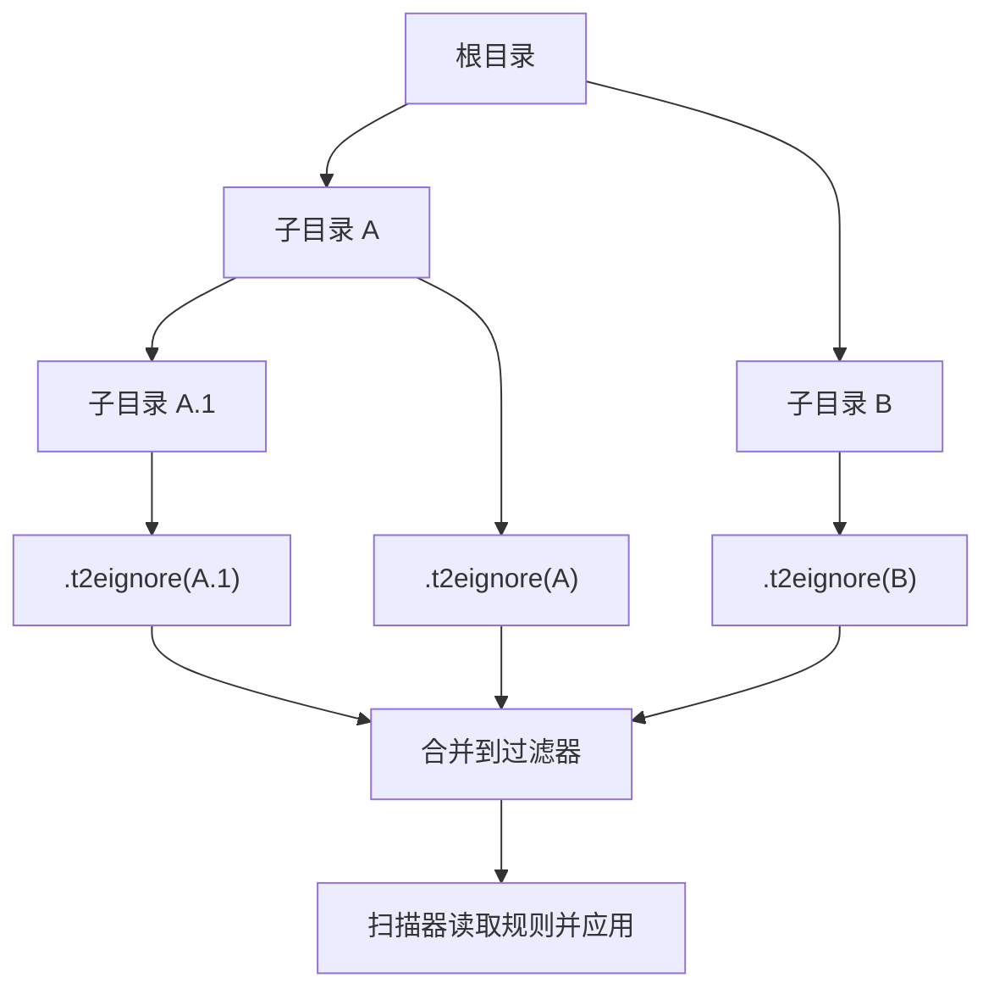
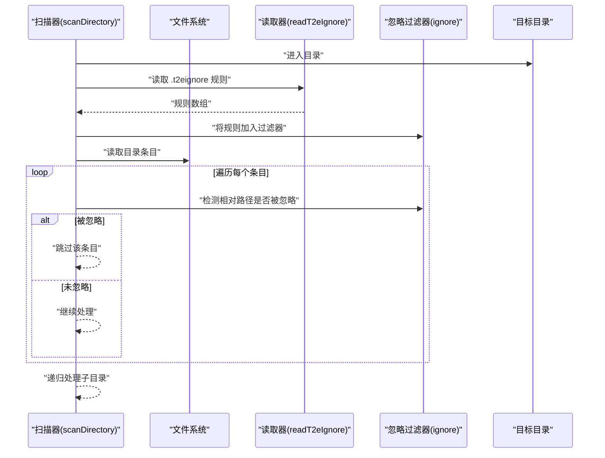
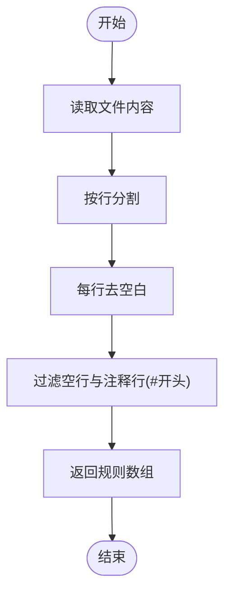
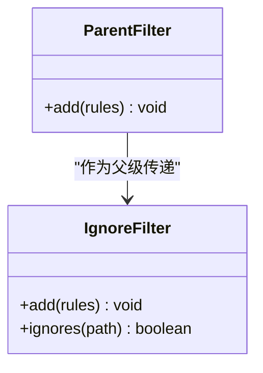
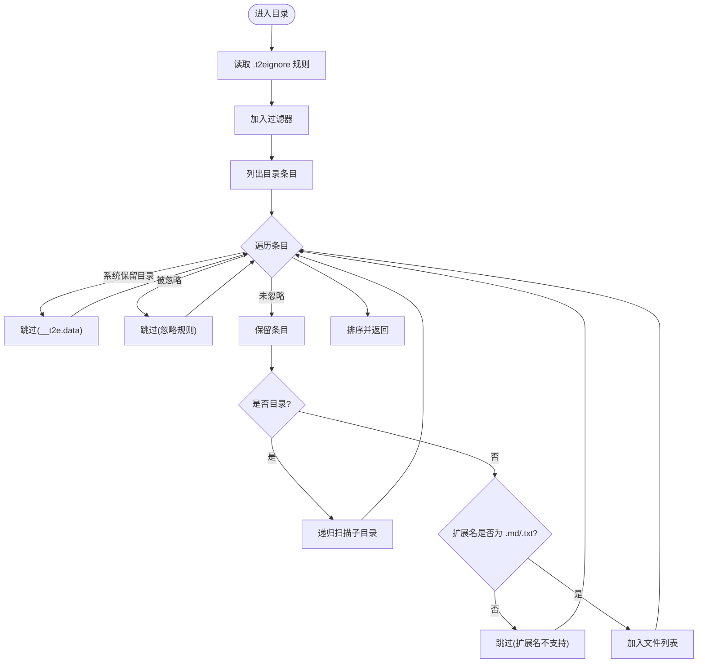
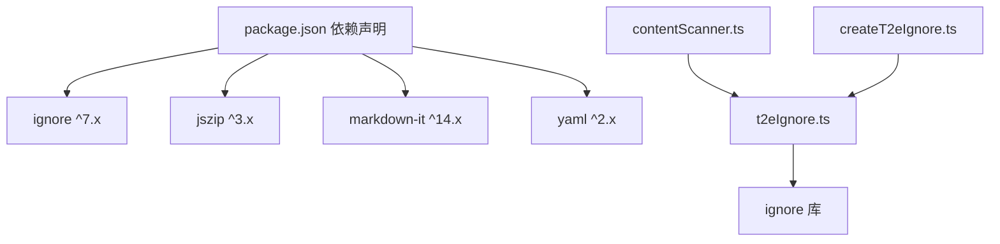

# .t2eignore 忽略规则配置

<cite>
**本文引用的文件**
- [src/services/t2eIgnore.ts](file://src/services/t2eIgnore.ts)
- [src/services/contentScanner.ts](file://src/services/contentScanner.ts)
- [src/commands/createT2eIgnore.ts](file://src/commands/createT2eIgnore.ts)
- [example/init-folder/.t2eignore](file://example/init-folder/.t2eignore)
- [example/init-folder/00102___子目录 1/.t2eignore](file://example/init-folder/00102___子目录 1/.t2eignore)
- [example/init-folder/00102___子目录 1/00200_忽略文件.md](file://example/init-folder/00102___子目录 1/00200_忽略文件.md)
- [README.md](file://README.md)
- [package.json](file://package.json)
</cite>

## 目录
1. [简介](#简介)
2. [项目结构](#项目结构)
3. [核心组件](#核心组件)
4. [架构总览](#架构总览)
5. [详细组件分析](#详细组件分析)
6. [依赖关系分析](#依赖关系分析)
7. [性能考量](#性能考量)
8. [故障排查指南](#故障排查指南)
9. [结论](#结论)
10. [附录](#附录)

## 简介
本指南围绕 .t2eignore 忽略规则进行系统化说明，涵盖语法规则、匹配模式、优先级与组合逻辑、目录遍历过滤机制、最佳实践、调试与验证方法，以及与其他忽略系统的兼容性。.t2eignore 文件采用与 .gitignore 相同的语法，用于在目录扫描阶段过滤不需要参与 EPUB 构建的文件与目录。

## 项目结构
- .t2eignore 文件位于目标目录内，与 .gitignore 同名但作用域不同，仅影响本扩展的扫描流程。
- 扫描器在进入每个目录时读取该目录的 .t2eignore 规则，并将其合并到当前目录的 ignore 过滤器中。
- 系统保留目录 __t2e.data 的过滤优先级高于 .t2eignore，不受忽略规则影响。

**图表来源**
- [src/services/contentScanner.ts:258-329](file://src/services/contentScanner.ts#L258-L329)
- [src/services/t2eIgnore.ts:13-26](file://src/services/t2eIgnore.ts#L13-L26)

**章节来源**
- [README.md:17-41](file://README.md#L17-L41)
- [src/services/contentScanner.ts:258-329](file://src/services/contentScanner.ts#L258-L329)
- [src/services/t2eIgnore.ts:13-26](file://src/services/t2eIgnore.ts#L13-L26)

## 核心组件
- .t2eignore 文件读取与解析
  - 读取指定目录下的 .t2eignore 文件，按行分割、去空白、过滤空行与注释行（以 # 开头）。
  - 返回规则数组；文件不存在时返回空数组。
- 忽略过滤器创建与继承
  - 基于 ignore 库创建过滤器实例，支持从父级过滤器继承规则。
- 目录扫描与过滤
  - 在扫描每个目录时，先读取该目录的 .t2eignore 规则并加入过滤器，再对目录条目进行过滤判断。
  - 系统保留目录 __t2e.data 的过滤优先级最高，不受 .t2eignore 影响。
  - 仅支持 .md 与 .txt 文件，其他扩展名直接忽略。
- VS Code 命令：新增 .t2eignore
  - 在选定目录下创建空的 .t2eignore 文件；若已存在则提示不覆盖。

**章节来源**
- [src/services/t2eIgnore.ts:13-26](file://src/services/t2eIgnore.ts#L13-L26)
- [src/services/t2eIgnore.ts:36-44](file://src/services/t2eIgnore.ts#L36-L44)
- [src/services/contentScanner.ts:258-329](file://src/services/contentScanner.ts#L258-L329)
- [src/commands/createT2eIgnore.ts:15-33](file://src/commands/createT2eIgnore.ts#L15-L33)

## 架构总览
下面的序列图展示了扫描器如何在遍历目录时加载与应用 .t2eignore 规则：

**图表来源**
- [src/services/contentScanner.ts:258-329](file://src/services/contentScanner.ts#L258-L329)
- [src/services/t2eIgnore.ts:13-26](file://src/services/t2eIgnore.ts#L13-L26)

## 详细组件分析

### .t2eignore 文件读取与解析
- 行处理策略
  - 按换行符分割；
  - 对每行进行去空白处理；
  - 过滤空行与注释行（以 # 开头）。
- 返回值
  - 规则数组；不存在时返回空数组。

**图表来源**
- [src/services/t2eIgnore.ts:13-26](file://src/services/t2eIgnore.ts#L13-L26)

**章节来源**
- [src/services/t2eIgnore.ts:13-26](file://src/services/t2eIgnore.ts#L13-L26)

### 忽略过滤器创建与继承
- 创建新过滤器时可选择传入父级过滤器，新实例会继承父级规则。
- 适用于目录层级规则叠加：子目录规则在父级规则基础上追加。

**图表来源**
- [src/services/t2eIgnore.ts:28-44](file://src/services/t2eIgnore.ts#L28-L44)

**章节来源**
- [src/services/t2eIgnore.ts:36-44](file://src/services/t2eIgnore.ts#L36-L44)

### 目录扫描与过滤机制
- 规则加载时机
  - 在进入每个目录时，先读取该目录的 .t2eignore 规则并加入过滤器。
- 过滤优先级
  - 系统保留目录 __t2e.data 的过滤优先级最高，不受 .t2eignore 影响。
  - 忽略过滤器对目录条目进行判断，命中则跳过。
  - 仅支持 .md 与 .txt 文件，其他扩展名直接忽略。
- 目录保留条件
  - 仅当子目录至少包含一个可用文件时，该目录节点才会被保留。

**图表来源**
- [src/services/contentScanner.ts:258-329](file://src/services/contentScanner.ts#L258-L329)

**章节来源**
- [src/services/contentScanner.ts:258-329](file://src/services/contentScanner.ts#L258-L329)

### VS Code 命令：新增 .t2eignore
- 功能
  - 在选定目录下创建空的 .t2eignore 文件；
  - 若文件已存在则提示不覆盖。
- 用户交互
  - 通过命令面板或资源管理器菜单触发；
  - 成功创建后给出信息提示，错误时给出错误提示。

**章节来源**
- [src/commands/createT2eIgnore.ts:15-33](file://src/commands/createT2eIgnore.ts#L15-L33)

## 依赖关系分析
- 外部依赖
  - ignore 库：提供 .gitignore 语法的匹配能力。
  - jszip、markdown-it、yaml：用于 EPUB 打包、Markdown 渲染与元数据处理。
- 内部模块
  - t2eIgnore.ts：.t2eignore 读取与过滤器创建；
  - contentScanner.ts：目录扫描与过滤；
  - createT2eIgnore.ts：VS Code 命令注册与文件创建。

**图表来源**
- [package.json:97-102](file://package.json#L97-L102)
- [src/services/t2eIgnore.ts](file://src/services/t2eIgnore.ts#L3)
- [src/services/contentScanner.ts:1-6](file://src/services/contentScanner.ts#L1-L6)
- [src/commands/createT2eIgnore.ts:1-8](file://src/commands/createT2eIgnore.ts#L1-L8)

**章节来源**
- [package.json:97-102](file://package.json#L97-L102)
- [src/services/t2eIgnore.ts](file://src/services/t2eIgnore.ts#L3)
- [src/services/contentScanner.ts:1-6](file://src/services/contentScanner.ts#L1-L6)
- [src/commands/createT2eIgnore.ts:1-8](file://src/commands/createT2eIgnore.ts#L1-L8)

## 性能考量
- 规则数量与复杂度
  - 规则越多、越复杂的匹配模式会增加过滤判断的时间成本。
- 目录层级深度
  - 深层目录结构会带来多次 .t2eignore 读取与规则合并操作。
- 建议
  - 合理拆分规则，避免冗余与过度通配；
  - 将常用规则放置在靠近根目录的位置，减少深层规则叠加带来的开销。

[本节为通用指导，无需特定文件引用]

## 故障排查指南
- 规则未生效
  - 确认 .t2eignore 文件位于正确的目录；
  - 检查规则是否被注释（以 # 开头会被过滤掉）；
  - 确认相对路径是否正确（扫描器使用相对路径进行匹配）。
- 规则冲突
  - 子目录规则会叠加到父级规则上，注意规则顺序与覆盖关系；
  - 如需临时排除某规则，可在子目录添加更具体的规则。
- 系统保留目录被误删
  - __t2e.data 不受 .t2eignore 影响，若被删除会导致元数据缺失；
  - 重新初始化元数据目录以恢复。
- VS Code 命令无法创建 .t2eignore
  - 若目标目录已存在同名文件，命令会提示不覆盖；
  - 请先删除或重命名现有文件后再尝试创建。

**章节来源**
- [src/services/contentScanner.ts:272-280](file://src/services/contentScanner.ts#L272-L280)
- [src/commands/createT2eIgnore.ts:21-24](file://src/commands/createT2eIgnore.ts#L21-L24)

## 结论
.t2eignore 采用 .gitignore 语法，结合扫描器的目录遍历与过滤机制，提供了灵活而强大的忽略控制能力。通过合理规划规则层次与路径，可高效地筛选出参与 EPUB 构建的内容，同时确保系统保留目录不受影响。

[本节为总结性内容，无需特定文件引用]

## 附录

### 语法规则与匹配模式
- 语法来源
  - 采用与 .gitignore 相同的语法，具体细节由 ignore 库实现。
- 规则来源与优先级
  - 每进入一个目录，都会读取该目录的 .t2eignore 规则并加入过滤器；
  - 子目录规则叠加到父级规则之上；
  - 系统保留目录 __t2e.data 的过滤优先级最高，不受 .t2eignore 影响。
- 匹配范围
  - 使用相对路径进行匹配，规则针对当前目录下的文件与子目录生效。

**章节来源**
- [README.md:17-41](file://README.md#L17-L41)
- [src/services/contentScanner.ts:258-329](file://src/services/contentScanner.ts#L258-L329)
- [src/services/t2eIgnore.ts:13-26](file://src/services/t2eIgnore.ts#L13-L26)

### 规则示例与使用场景
- 示例一：忽略特定文件
  - 场景：忽略某个固定文件名的文件。
  - 参考文件：[example/init-folder/.t2eignore:1-2](file://example/init-folder/.t2eignore#L1-L2)
- 示例二：忽略整个子目录
  - 场景：忽略某个子目录及其所有内容。
  - 参考文件：[example/init-folder/00102___子目录 1/.t2eignore:1-2](file://example/init-folder/00102___子目录 1/.t2eignore#L1-L2)
- 示例三：验证忽略效果
  - 参考文件：[example/init-folder/00102___子目录 1/00200_忽略文件.md:1-2](file://example/init-folder/00102___子目录 1/00200_忽略文件.md#L1-L2)

**章节来源**
- [example/init-folder/.t2eignore:1-2](file://example/init-folder/.t2eignore#L1-L2)
- [example/init-folder/00102___子目录 1/.t2eignore:1-2](file://example/init-folder/00102___子目录 1/.t2eignore#L1-L2)
- [example/init-folder/00102___子目录 1/00200_忽略文件.md:1-2](file://example/init-folder/00102___子目录 1/00200_忽略文件.md#L1-L2)

### 规则调试与验证方法
- 步骤
  - 在目标目录创建或修改 .t2eignore；
  - 通过 VS Code 菜单执行“生成 epub”或相关命令；
  - 观察输出结果中是否包含被忽略的文件或目录；
  - 如需定位问题，逐步缩小规则范围，确认具体哪条规则导致忽略。
- 注意
  - 相对路径必须与实际目录结构一致；
  - 注释行以 # 开头会被过滤掉，不会参与匹配。

**章节来源**
- [src/commands/createT2eIgnore.ts:15-33](file://src/commands/createT2eIgnore.ts#L15-L33)
- [src/services/contentScanner.ts:272-280](file://src/services/contentScanner.ts#L272-L280)

### 与其他忽略系统的兼容性
- 与 .gitignore 的关系
  - .t2eignore 采用与 .gitignore 相同的语法，便于复用已有经验；
  - 两者作用域不同：.gitignore 影响 Git 系统，.t2eignore 仅影响本扩展的扫描流程。
- 与 .vscodeignore 的关系
  - .vscodeignore 用于 VS Code 资源管理器的 UI 展示过滤；
  - 本扩展的扫描与过滤逻辑独立于 .vscodeignore，遵循 .t2eignore 与系统保留目录的优先级。

**章节来源**
- [README.md:17-41](file://README.md#L17-L41)