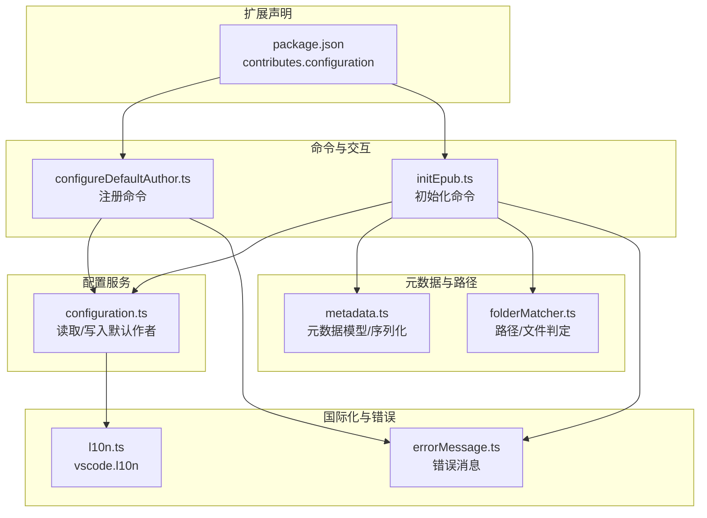
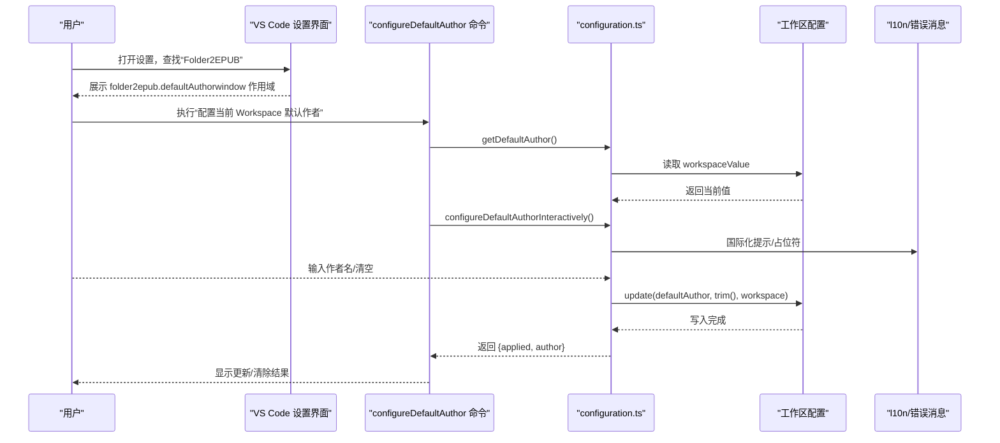
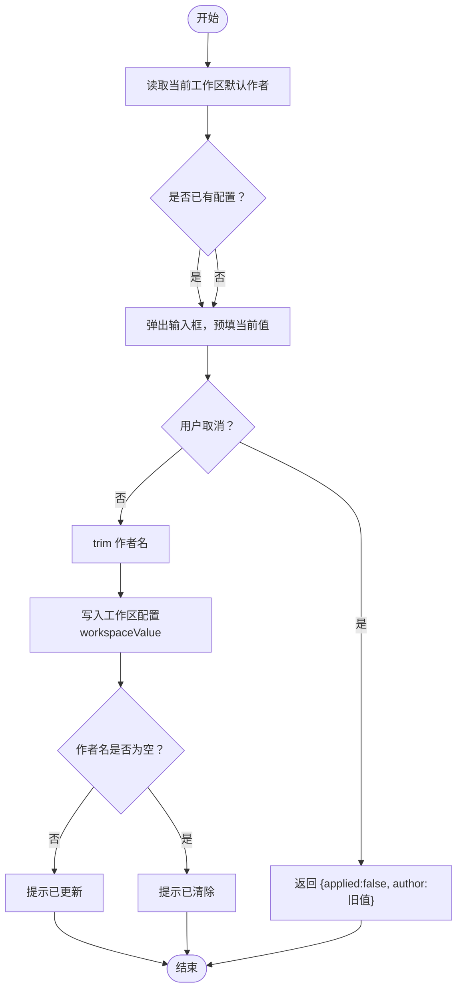
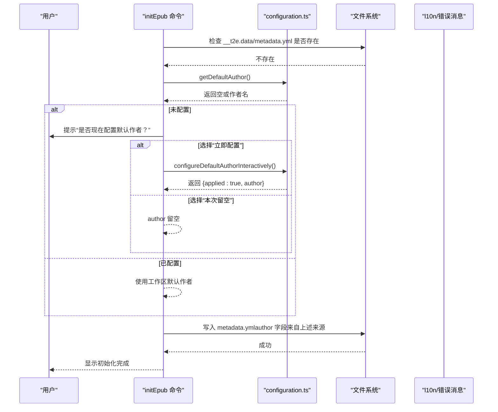
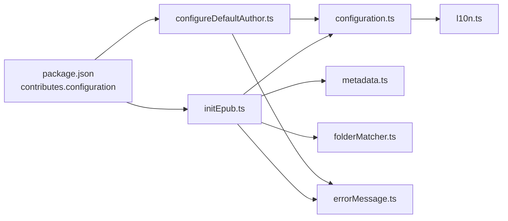

# VS Code 配置

<cite>
**本文引用的文件**
- [package.json](file://package.json)
- [src/services/configuration.ts](file://src/services/configuration.ts)
- [src/commands/configureDefaultAuthor.ts](file://src/commands/configureDefaultAuthor.ts)
- [src/commands/initEpub.ts](file://src/commands/initEpub.ts)
- [src/services/metadata.ts](file://src/services/metadata.ts)
- [src/services/folderMatcher.ts](file://src/services/folderMatcher.ts)
- [src/services/errorMessage.ts](file://src/services/errorMessage.ts)
- [src/services/l10n.ts](file://src/services/l10n.ts)
- [l10n/bundle.l10n.json](file://l10n/bundle.l10n.json)
- [l10n/bundle.l10n.zh-cn.json](file://l10n/bundle.l10n.zh-cn.json)
- [README.md](file://README.md)
</cite>

## 目录
1. [简介](#简介)
2. [项目结构](#项目结构)
3. [核心组件](#核心组件)
4. [架构总览](#架构总览)
5. [详细组件分析](#详细组件分析)
6. [依赖关系分析](#依赖关系分析)
7. [性能考量](#性能考量)
8. [故障排除指南](#故障排除指南)
9. [结论](#结论)
10. [附录](#附录)

## 简介
本指南聚焦 VS Code 扩展 Folder2EPUB 的 VS Code 配置，围绕默认作者设置与工作区级配置项进行系统讲解。内容涵盖：
- package.json 中的配置字段与扩展设置界面
- 默认作者配置的读取、写入与交互流程
- 配置的作用域与优先级（用户级 vs 工作区级）
- 配置验证与常见问题排查
- 配置备份与迁移建议

## 项目结构
该扩展通过 package.json 的 contributes.configuration 声明配置项，通过命令注册与服务层实现配置读写与交互。核心文件分布如下：
- 配置声明与贡献：package.json
- 配置读写与交互：src/services/configuration.ts
- 命令入口与错误处理：src/commands/configureDefaultAuthor.ts、src/commands/initEpub.ts
- 元数据与文件路径：src/services/metadata.ts、src/services/folderMatcher.ts
- 国际化与错误消息：l10n/*、src/services/errorMessage.ts

图表来源
- [package.json:66-76](file://package.json#L66-L76)
- [src/commands/configureDefaultAuthor.ts:12-25](file://src/commands/configureDefaultAuthor.ts#L12-L25)
- [src/commands/initEpub.ts:18-62](file://src/commands/initEpub.ts#L18-L62)
- [src/services/configuration.ts:18-79](file://src/services/configuration.ts#L18-L79)
- [src/services/metadata.ts:24-69](file://src/services/metadata.ts#L24-L69)
- [src/services/folderMatcher.ts:23-84](file://src/services/folderMatcher.ts#L23-L84)
- [src/services/errorMessage.ts:9-15](file://src/services/errorMessage.ts#L9-L15)
- [src/services/l10n.ts:1-9](file://src/services/l10n.ts#L1-L9)

章节来源
- [package.json:43-96](file://package.json#L43-L96)
- [src/extension.ts:13-18](file://src/extension.ts#L13-L18)

## 核心组件
- 配置声明与作用域
  - 在 package.json 的 contributes.configuration 中声明了 folder2epub.defaultAuthor 配置项，默认类型为 string，作用域为 window（工作区级），描述为 Markdown 文本。
- 配置读取与写入
  - 通过 configuration.ts 提供 getDefaultAuthor 与 setDefaultAuthor 方法，使用 VS Code 配置 API 读取/写入工作区配置。
- 交互式配置
  - configureDefaultAuthor.ts 注册命令，调用 configuration.ts 的交互式配置方法，弹出输入框并提示更新/清除结果。
- 初始化流程中的作者使用
  - initEpub.ts 在初始化 metadata.yml 时，优先使用工作区默认作者；若未配置则引导用户配置后再继续。

章节来源
- [package.json:66-76](file://package.json#L66-L76)
- [src/services/configuration.ts:18-79](file://src/services/configuration.ts#L18-L79)
- [src/commands/configureDefaultAuthor.ts:12-25](file://src/commands/configureDefaultAuthor.ts#L12-L25)
- [src/commands/initEpub.ts:18-62](file://src/commands/initEpub.ts#L18-L62)

## 架构总览
下图展示了“配置声明—命令—服务—UI/文件系统”的整体交互链路。

图表来源
- [package.json:66-76](file://package.json#L66-L76)
- [src/commands/configureDefaultAuthor.ts:12-25](file://src/commands/configureDefaultAuthor.ts#L12-L25)
- [src/services/configuration.ts:18-79](file://src/services/configuration.ts#L18-L79)
- [src/services/l10n.ts:1-9](file://src/services/l10n.ts#L1-L9)

## 详细组件分析

### 配置声明与扩展设置界面
- 声明位置：package.json 的 contributes.configuration.properties
- 字段：folder2epub.defaultAuthor
  - 类型：string
  - 默认值：空字符串
  - 作用域：window（工作区级）
  - 描述：Markdown 文本，用于说明该配置在初始化时写入 __t2e.data/metadata.yml 的 author 字段
- 贡献菜单：在资源管理器目录右键菜单中提供“生成 epub”“初始化 epub”“新增 .t2eignore”等命令，均基于工作区上下文可用。

章节来源
- [package.json:66-76](file://package.json#L66-L76)
- [package.json:77-95](file://package.json#L77-L95)

### 配置读取与写入服务
- 读取：getDefaultAuthor 使用 inspect 获取 workspaceValue，若未配置则返回空字符串
- 写入：setDefaultAuthor 在存在工作区文件或工作区文件夹的情况下，将作者名 trim 后写入工作区配置
- 交互：configureDefaultAuthorInteractively 弹出输入框，支持清空；成功后提示更新/清除

图表来源
- [src/services/configuration.ts:18-79](file://src/services/configuration.ts#L18-L79)

章节来源
- [src/services/configuration.ts:18-79](file://src/services/configuration.ts#L18-L79)

### 初始化命令中的作者使用
- initEpub.ts 在初始化 metadata.yml 前，先尝试读取工作区默认作者
- 若未配置，弹出警告并提供“立即配置”“本次留空”两个选项
- 用户选择“立即配置”后，调用交互式配置流程；否则保持 author 为空字符串

图表来源
- [src/commands/initEpub.ts:18-62](file://src/commands/initEpub.ts#L18-L62)
- [src/services/configuration.ts:18-79](file://src/services/configuration.ts#L18-L79)
- [src/services/metadata.ts:24-33](file://src/services/metadata.ts#L24-L33)

章节来源
- [src/commands/initEpub.ts:18-62](file://src/commands/initEpub.ts#L18-L62)
- [src/services/metadata.ts:24-33](file://src/services/metadata.ts#L24-L33)

### 国际化与错误消息
- l10n.ts 导出 vscode.l10n，业务代码统一使用 l10n.t() 进行本地化
- errorMessage.ts 将任意错误标准化为可展示的字符串，保证 UI 一致性
- l10n/bundle.l10n.json 与 bundle.l10n.zh-cn.json 提供英文与中文翻译

章节来源
- [src/services/l10n.ts:1-9](file://src/services/l10n.ts#L1-L9)
- [src/services/errorMessage.ts:9-15](file://src/services/errorMessage.ts#L9-L15)
- [l10n/bundle.l10n.json:1-50](file://l10n/bundle.l10n.json#L1-L50)
- [l10n/bundle.l10n.zh-cn.json:1-50](file://l10n/bundle.l10n.zh-cn.json#L1-L50)

## 依赖关系分析
- 配置声明依赖 VS Code 配置系统（window 作用域）
- 命令依赖配置服务与文件系统
- 元数据服务依赖 YAML 解析与文件路径工具
- 错误与国际化贯穿所有交互

图表来源
- [package.json:66-76](file://package.json#L66-L76)
- [src/commands/configureDefaultAuthor.ts:12-25](file://src/commands/configureDefaultAuthor.ts#L12-L25)
- [src/commands/initEpub.ts:18-62](file://src/commands/initEpub.ts#L18-L62)
- [src/services/configuration.ts:18-79](file://src/services/configuration.ts#L18-L79)
- [src/services/metadata.ts:24-69](file://src/services/metadata.ts#L24-L69)
- [src/services/folderMatcher.ts:23-84](file://src/services/folderMatcher.ts#L23-L84)
- [src/services/errorMessage.ts:9-15](file://src/services/errorMessage.ts#L9-L15)
- [src/services/l10n.ts:1-9](file://src/services/l10n.ts#L1-L9)

章节来源
- [src/extension.ts:13-18](file://src/extension.ts#L13-L18)

## 性能考量
- 配置读取与写入均为轻量操作，主要成本在 VS Code 配置 API 的 IO
- 初始化流程涉及文件系统写入与 YAML 序列化，建议在大型目录上谨慎使用
- 建议在工作区根目录下集中管理配置，减少跨目录切换带来的配置读取次数

## 故障排除指南
- 无法配置默认作者
  - 现象：抛出“请先打开一个工作区”类错误
  - 原因：未打开工作区（无 workspaceFile 或 workspaceFolders）
  - 处理：在 VS Code 中打开一个工作区后再执行命令
- 配置未生效
  - 现象：初始化时 author 仍为空
  - 原因：工作区作用域未正确写入或被更高优先级覆盖
  - 处理：确认作用域为 window（工作区级），并在当前工作区中查看与编辑
- 初始化被中断
  - 现象：metadata.yml 已存在导致初始化中止
  - 处理：删除 __t2e.data/metadata.yml 后重试，或先生成 EPUB 再调整元数据
- 生成 EPUB 时报错
  - 现象：封面缺失、图片路径异常、目录结构错误
  - 处理：检查 __t2e.data/metadata.yml 的 cover 字段与实际封面文件；确保图片路径在当前目录范围内；遵循数字前缀排序规则

章节来源
- [src/services/configuration.ts:32-40](file://src/services/configuration.ts#L32-L40)
- [src/commands/initEpub.ts:23-26](file://src/commands/initEpub.ts#L23-L26)
- [src/services/metadata.ts:41-59](file://src/services/metadata.ts#L41-L59)
- [README.md:233-241](file://README.md#L233-L241)

## 结论
- Folder2EPUB 的配置体系以工作区级（window）为主，通过命令与服务层实现默认作者的读取、写入与交互
- 配置项简单明确，易于理解与维护；结合初始化流程，能有效提升 EPUB 生成的一致性
- 建议在工作区根目录集中管理配置，并配合 README 的约定与规则使用，以获得最佳体验

## 附录

### 配置项说明与最佳实践
- 配置项：folder2epub.defaultAuthor
  - 类型：string
  - 默认值：空字符串
  - 作用域：window（工作区级）
  - 用途：初始化 __t2e.data/metadata.yml 时写入 author 字段
- 修改方法
  - VS Code 设置界面：在“Folder2EPUB”分类下找到“默认作者”，直接编辑
  - 命令交互：执行“配置当前 Workspace 默认作者”，弹出输入框进行编辑
- 最佳实践
  - 在团队协作中，建议在工作区根目录的 .vscode/settings.json 中固定作者，避免不同成员使用不同默认值
  - 若需全局默认作者，可在用户设置中添加，但扩展默认仅读取工作区配置

章节来源
- [package.json:66-76](file://package.json#L66-L76)
- [src/services/configuration.ts:18-79](file://src/services/configuration.ts#L18-L79)
- [README.md:66-71](file://README.md#L66-L71)

### 配置优先级与作用域
- 作用域：window（工作区级）
- 优先级：工作区配置覆盖用户配置
- 适用场景：不同项目采用不同作者时，推荐使用工作区配置；全局默认作者可考虑用户配置

章节来源
- [package.json:72](file://package.json#L72)
- [src/services/configuration.ts:18-24](file://src/services/configuration.ts#L18-L24)

### 配置验证与备份
- 验证
  - 在初始化 EPUB 前，可通过命令交互确认当前工作区默认作者是否正确
  - 生成 EPUB 后检查 __t2e.data/metadata.yml 的 author 字段
- 备份与迁移
  - 备份：将工作区根目录 .vscode/settings.json 中的 folder2epub.defaultAuthor 条目复制到新环境
  - 迁移：从用户配置迁移到工作区配置时，注意删除用户配置中的同名条目，避免冲突

章节来源
- [src/commands/initEpub.ts:30-50](file://src/commands/initEpub.ts#L30-L50)
- [README.md:66-71](file://README.md#L66-L71)