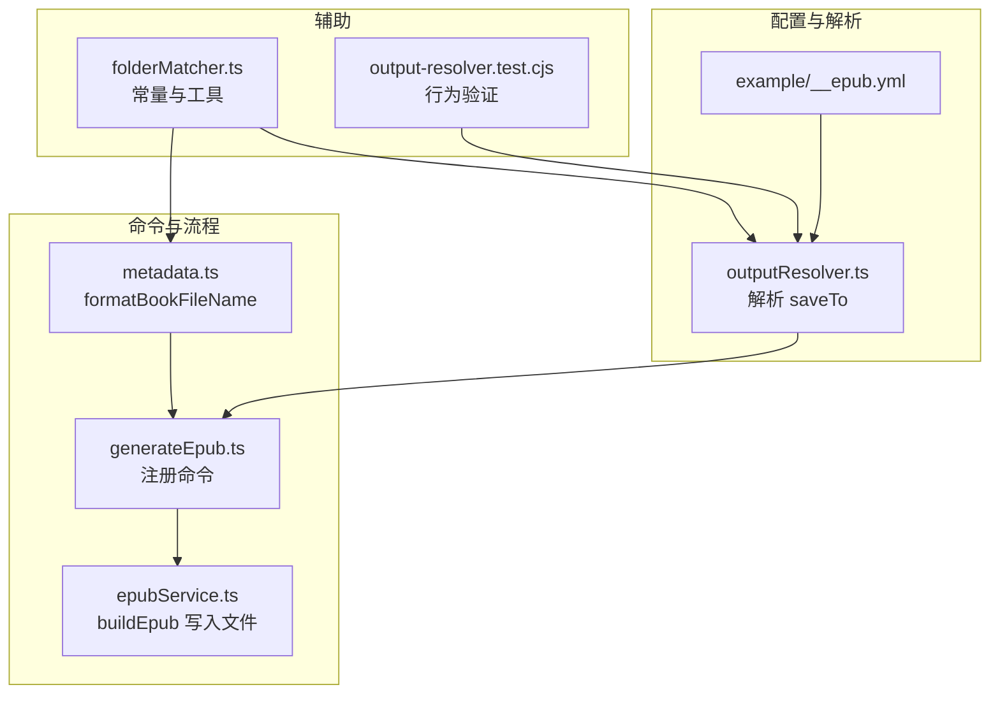
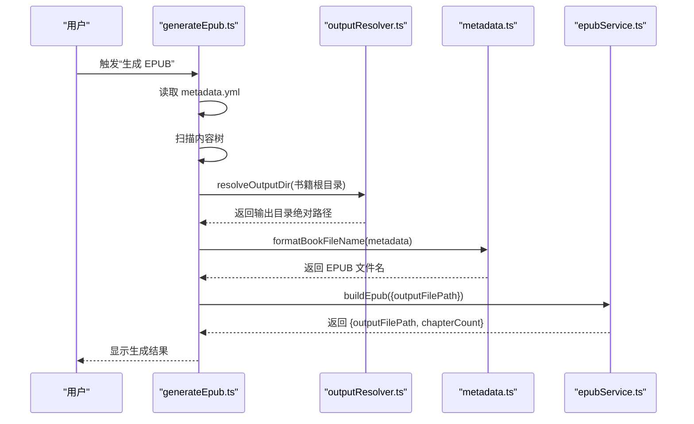
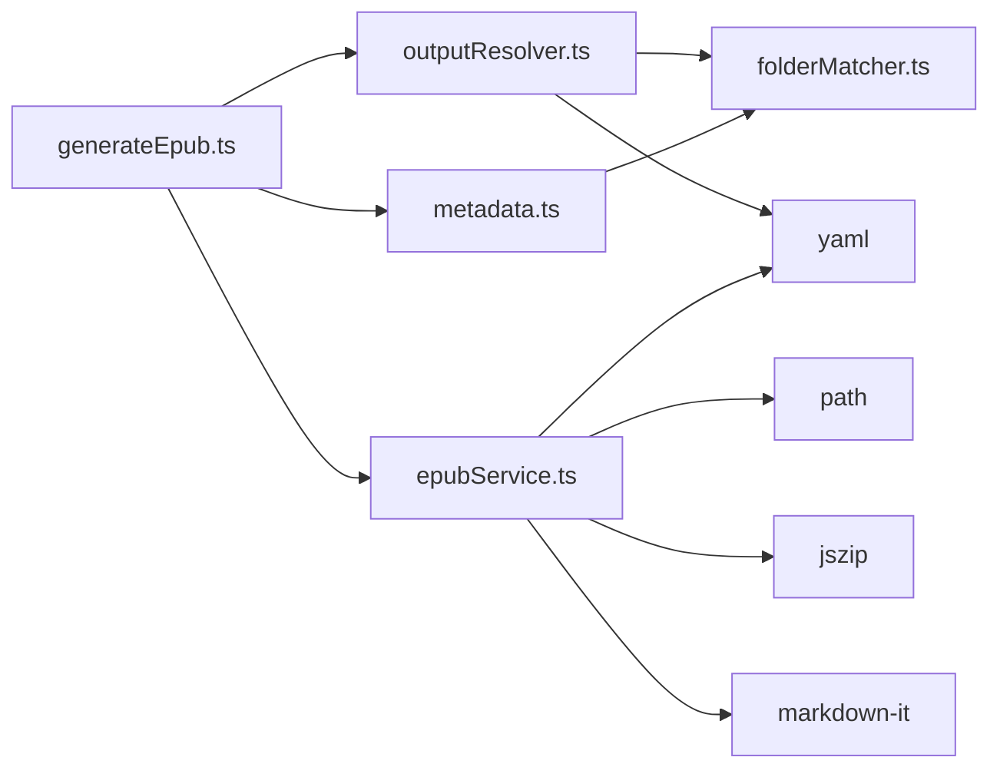

# 输出配置

<cite>
**本文引用的文件**
- [example/__epub.yml](file://example/__epub.yml)
- [src/services/outputResolver.ts](file://src/services/outputResolver.ts)
- [src/services/folderMatcher.ts](file://src/services/folderMatcher.ts)
- [src/services/metadata.ts](file://src/services/metadata.ts)
- [src/commands/generateEpub.ts](file://src/commands/generateEpub.ts)
- [src/services/epubService.ts](file://src/services/epubService.ts)
- [test/output-resolver.test.cjs](file://test/output-resolver.test.cjs)
- [package.json](file://package.json)
</cite>

## 目录
1. [简介](#简介)
2. [项目结构](#项目结构)
3. [核心组件](#核心组件)
4. [架构总览](#架构总览)
5. [详细组件分析](#详细组件分析)
6. [依赖关系分析](#依赖关系分析)
7. [性能考量](#性能考量)
8. [故障排查指南](#故障排查指南)
9. [结论](#结论)
10. [附录](#附录)

## 简介
本指南聚焦于输出配置，围绕 __epub.yml 中的 saveTo 设置，系统阐述：
- 输出目录解析机制与路径基准
- 变量与占位符替换规则
- 输出文件名规则与清洗策略
- 相对路径与绝对路径的使用方法
- 多平台路径兼容性
- 验证与调试方法
- 最佳实践与安全注意事项

## 项目结构
与输出配置直接相关的模块与文件如下：
- 配置文件：example/__epub.yml
- 输出目录解析：src/services/outputResolver.ts
- 目录与文件常量：src/services/folderMatcher.ts
- 元数据与文件名格式化：src/services/metadata.ts
- 生成命令流程：src/commands/generateEpub.ts
- EPUB 打包与输出文件写入：src/services/epubService.ts
- 输出解析测试：test/output-resolver.test.cjs
- 插件配置与依赖：package.json

图表来源
- [example/__epub.yml:1-2](file://example/__epub.yml#L1-L2)
- [src/services/outputResolver.ts:15-42](file://src/services/outputResolver.ts#L15-L42)
- [src/services/metadata.ts:110-117](file://src/services/metadata.ts#L110-L117)
- [src/commands/generateEpub.ts:46-48](file://src/commands/generateEpub.ts#L46-L48)
- [src/services/epubService.ts:203-210](file://src/services/epubService.ts#L203-L210)
- [src/services/folderMatcher.ts:7-9](file://src/services/folderMatcher.ts#L7-L9)
- [test/output-resolver.test.cjs:36-71](file://test/output-resolver.test.cjs#L36-L71)

章节来源
- [example/__epub.yml:1-2](file://example/__epub.yml#L1-L2)
- [src/services/outputResolver.ts:15-42](file://src/services/outputResolver.ts#L15-L42)
- [src/services/folderMatcher.ts:7-9](file://src/services/folderMatcher.ts#L7-L9)
- [src/services/metadata.ts:110-117](file://src/services/metadata.ts#L110-L117)
- [src/commands/generateEpub.ts:46-48](file://src/commands/generateEpub.ts#L46-L48)
- [src/services/epubService.ts:203-210](file://src/services/epubService.ts#L203-L210)
- [test/output-resolver.test.cjs:36-71](file://test/output-resolver.test.cjs#L36-L71)

## 核心组件
- 配置文件 __epub.yml
  - 仅包含 saveTo 一项，用于声明输出目录。
  - 示例：[example/__epub.yml:1-2](file://example/__epub.yml#L1-L2)
- 输出目录解析器 resolveOutputDir
  - 从当前书籍目录向上查找 __epub.yml，读取 saveTo 并解析为绝对路径。
  - 支持 ~、~/... 展开到用户目录；相对路径以配置文件所在目录为基准。
  - 参考：[src/services/outputResolver.ts:15-42](file://src/services/outputResolver.ts#L15-L42)
- 文件名格式化 formatBookFileName
  - 基于 metadata 生成最终 EPUB 文件名，并进行非法字符清洗。
  - 参考：[src/services/metadata.ts:110-117](file://src/services/metadata.ts#L110-L117)
- 生成命令 generateEpub
  - 串联读取 metadata、扫描内容、解析输出目录、打包 EPUB 并写入文件。
  - 参考：[src/commands/generateEpub.ts:46-48](file://src/commands/generateEpub.ts#L46-L48)
- EPUB 打包与写入
  - 创建目录、生成 ZIP、写入文件，返回输出路径。
  - 参考：[src/services/epubService.ts:203-210](file://src/services/epubService.ts#L203-L210)

章节来源
- [example/__epub.yml:1-2](file://example/__epub.yml#L1-L2)
- [src/services/outputResolver.ts:15-42](file://src/services/outputResolver.ts#L15-L42)
- [src/services/metadata.ts:110-117](file://src/services/metadata.ts#L110-L117)
- [src/commands/generateEpub.ts:46-48](file://src/commands/generateEpub.ts#L46-L48)
- [src/services/epubService.ts:203-210](file://src/services/epubService.ts#L203-L210)

## 架构总览
输出配置在命令执行流程中的位置如下：

图表来源
- [src/commands/generateEpub.ts:34-57](file://src/commands/generateEpub.ts#L34-L57)
- [src/services/outputResolver.ts:15-42](file://src/services/outputResolver.ts#L15-L42)
- [src/services/metadata.ts:110-117](file://src/services/metadata.ts#L110-L117)
- [src/services/epubService.ts:146-216](file://src/services/epubService.ts#L146-L216)

## 详细组件分析

### 配置文件 __epub.yml 与 saveTo
- 作用：声明输出目录，允许使用相对路径或以 ~ 开头的用户目录路径。
- 示例：[example/__epub.yml:1-2](file://example/__epub.yml#L1-L2)
- 解析要点：
  - 仅支持 saveTo 键；其他键会被忽略。
  - 若 saveTo 为空或非字符串，视为未配置。
  - 参考：[src/services/outputResolver.ts:50-71](file://src/services/outputResolver.ts#L50-L71)

章节来源
- [example/__epub.yml:1-2](file://example/__epub.yml#L1-L2)
- [src/services/outputResolver.ts:50-71](file://src/services/outputResolver.ts#L50-L71)

### 输出目录解析机制
- 查找策略：从当前书籍目录向上查找 __epub.yml，找到后读取 saveTo。
- 路径基准：
  - 绝对路径：直接使用。
  - 相对路径：以 __epub.yml 所在目录为基准解析。
  - 用户目录：支持 ~、~/...，展开为当前用户主目录。
- 解析函数：resolveOutputDir
  - 参考：[src/services/outputResolver.ts:15-42](file://src/services/outputResolver.ts#L15-L42)
- 测试覆盖：
  - ~ 展开到用户目录
  - ~ 作为根目录
  - 相对路径基于 __epub.yml 所在目录解析
  - 参考：[test/output-resolver.test.cjs:36-71](file://test/output-resolver.test.cjs#L36-L71)

图表来源
- [src/services/outputResolver.ts:15-42](file://src/services/outputResolver.ts#L15-L42)
- [test/output-resolver.test.cjs:36-71](file://test/output-resolver.test.cjs#L36-L71)

章节来源
- [src/services/outputResolver.ts:15-42](file://src/services/outputResolver.ts#L15-L42)
- [test/output-resolver.test.cjs:36-71](file://test/output-resolver.test.cjs#L36-L71)

### 输出文件名规则与清洗
- 生成逻辑：基于 metadata.title、titleSuffix、author 组合生成文件名。
- 清洗策略：移除控制字符与文件系统禁用字符，替换为下划线，空白裁剪，空则回退为 book.epub。
- 参考：[src/services/metadata.ts:110-145](file://src/services/metadata.ts#L110-L145)

章节来源
- [src/services/metadata.ts:110-145](file://src/services/metadata.ts#L110-L145)

### 路径解析与变量替换规则
- 变量/占位符：
  - ~：当前用户主目录（由解析器展开）。
  - 相对路径：以 __epub.yml 所在目录为基准。
- 不支持的占位符：示例配置中未出现其他变量（如环境变量），解析器也不做环境变量替换。
- 参考：[src/services/outputResolver.ts:79-89](file://src/services/outputResolver.ts#L79-L89)

章节来源
- [src/services/outputResolver.ts:79-89](file://src/services/outputResolver.ts#L79-L89)

### 相对路径与绝对路径的使用
- 绝对路径：直接使用，无需基准。
- 相对路径：以 __epub.yml 所在目录为基准解析，确保跨子目录场景的一致性。
- 参考：[src/services/outputResolver.ts:24-30](file://src/services/outputResolver.ts#L24-L30)

章节来源
- [src/services/outputResolver.ts:24-30](file://src/services/outputResolver.ts#L24-L30)

### 多平台路径兼容性
- 跨平台差异：
  - Windows 使用反斜杠分隔符，Unix/Linux/macOS 使用正斜杠。
- 行为说明：
  - 生成 EPUB 时，内部使用 POSIX 风格的相对路径（例如 text/xxx.xhtml），这与 ZIP 规范一致。
  - 相对路径标准化：将平台分隔符统一为 /，并保证以 ./ 或 ../ 开头，便于跨平台兼容。
  - 参考：[src/services/epubService.ts:1061-1088](file://src/services/epubService.ts#L1061-L1088)
- 实践建议：
  - 在 __epub.yml 中使用正斜杠分隔的相对路径更稳妥。
  - 避免硬编码反斜杠导致在其他平台不可用。

章节来源
- [src/services/epubService.ts:1061-1088](file://src/services/epubService.ts#L1061-L1088)

### 输出目录最佳实践
- 使用 ~ 或 ~/... 指向用户目录，便于跨平台共享。
- 使用相对路径时，明确基准为 __epub.yml 所在目录，避免深层嵌套导致路径过长。
- 保持输出目录存在且可写，解析器不会自动创建目录。
- 参考：[src/services/outputResolver.ts:24-30](file://src/services/outputResolver.ts#L24-L30)

章节来源
- [src/services/outputResolver.ts:24-30](file://src/services/outputResolver.ts#L24-L30)

### 安全考虑
- 权限与路径有效性：解析器不检查目录是否存在或可写，应在外部确保输出目录可用。
- 路径注入：避免将不受信任的输入直接拼接到路径中；使用解析器提供的基准解析。
- 文件名合法性：通过清洗策略避免非法字符导致的写入失败。
- 参考：[src/services/metadata.ts:125-145](file://src/services/metadata.ts#L125-L145)

章节来源
- [src/services/metadata.ts:125-145](file://src/services/metadata.ts#L125-L145)

### 验证与调试方法
- 单元测试验证：
  - 测试用例覆盖 ~ 展开、~ 作为根目录、相对路径基于 __epub.yml 所在目录解析。
  - 参考：[test/output-resolver.test.cjs:36-71](file://test/output-resolver.test.cjs#L36-L71)
- 命令流程验证：
  - 在 VS Code 中执行“生成 EPUB”，观察通知与最终输出路径。
  - 参考：[src/commands/generateEpub.ts:46-57](file://src/commands/generateEpub.ts#L46-L57)
- 日志与错误提示：
  - 未找到 __t2e.data/metadata.yml 时会提示初始化。
  - 参考：[src/commands/generateEpub.ts:23-26](file://src/commands/generateEpub.ts#L23-L26)

章节来源
- [test/output-resolver.test.cjs:36-71](file://test/output-resolver.test.cjs#L36-L71)
- [src/commands/generateEpub.ts:23-26](file://src/commands/generateEpub.ts#L23-L26)

## 依赖关系分析
- generateEpub.ts 依赖：
  - outputResolver.ts：解析输出目录
  - metadata.ts：生成文件名
  - epubService.ts：实际写入文件
- outputResolver.ts 依赖：
  - folderMatcher.ts：常量与工具（如 __epub.yml 名称）
  - yaml：解析配置文本
- metadata.ts 依赖：
  - folderMatcher.ts：__t2e.data 目录与文件路径
  - yaml：序列化/反序列化
- epubService.ts 依赖：
  - jszip：打包 EPUB
  - path：路径操作
  - markdown-it：渲染 Markdown
  - yaml：frontmatter 解析

图表来源
- [src/commands/generateEpub.ts:1-11](file://src/commands/generateEpub.ts#L1-L11)
- [src/services/outputResolver.ts:1-7](file://src/services/outputResolver.ts#L1-L7)
- [src/services/metadata.ts:1-6](file://src/services/metadata.ts#L1-L6)
- [src/services/epubService.ts:1-16](file://src/services/epubService.ts#L1-L16)
- [src/services/folderMatcher.ts:1-9](file://src/services/folderMatcher.ts#L1-L9)

章节来源
- [src/commands/generateEpub.ts:1-11](file://src/commands/generateEpub.ts#L1-L11)
- [src/services/outputResolver.ts:1-7](file://src/services/outputResolver.ts#L1-L7)
- [src/services/metadata.ts:1-6](file://src/services/metadata.ts#L1-L6)
- [src/services/epubService.ts:1-16](file://src/services/epubService.ts#L1-L16)
- [src/services/folderMatcher.ts:1-9](file://src/services/folderMatcher.ts#L1-L9)

## 性能考量
- 解析 saveTo 仅涉及文件系统查找与少量字符串处理，开销极低。
- 文件名清洗为线性扫描，复杂度 O(n)，通常可忽略。
- EPUB 打包写入为 I/O 密集型，主要瓶颈在于磁盘写入速度与文件数量。

## 故障排查指南
- 问题：找不到 __t2e.data/metadata.yml
  - 现象：命令提示先初始化。
  - 处理：先执行“初始化 EPUB”，再生成。
  - 参考：[src/commands/generateEpub.ts:23-26](file://src/commands/generateEpub.ts#L23-L26)
- 问题：输出目录不存在或不可写
  - 现象：写入失败或权限错误。
  - 处理：确保输出目录存在且可写；解析器不会自动创建。
  - 参考：[src/services/outputResolver.ts:24-30](file://src/services/outputResolver.ts#L24-L30)
- 问题：相对路径解析不符合预期
  - 现象：期望的输出目录与实际不符。
  - 处理：确认 __epub.yml 所在目录，相对路径以该目录为基准。
  - 参考：[src/services/outputResolver.ts:24-30](file://src/services/outputResolver.ts#L24-L30)
- 问题：Windows 下路径分隔符导致异常
  - 现象：路径包含反斜杠导致跨平台不一致。
  - 处理：在 __epub.yml 使用正斜杠；EPUB 内部使用 POSIX 风格。
  - 参考：[src/services/epubService.ts:1061-1088](file://src/services/epubService.ts#L1061-L1088)

章节来源
- [src/commands/generateEpub.ts:23-26](file://src/commands/generateEpub.ts#L23-L26)
- [src/services/outputResolver.ts:24-30](file://src/services/outputResolver.ts#L24-L30)
- [src/services/epubService.ts:1061-1088](file://src/services/epubService.ts#L1061-L1088)

## 结论
- saveTo 是唯一的输出目录配置项，支持 ~、~/... 与相对路径。
- 相对路径以 __epub.yml 所在目录为基准，确保跨子目录一致性。
- 文件名由 metadata 生成并通过清洗策略保障合法性。
- 多平台兼容性通过内部 POSIX 风格路径与路径标准化实现。
- 建议遵循最佳实践，提前准备输出目录，使用 ~ 或相对路径提升可移植性。

## 附录
- 相关配置与依赖
  - 插件配置与脚本：[package.json:1-114](file://package.json#L1-L114)
  - 目录与文件常量：[src/services/folderMatcher.ts:7-9](file://src/services/folderMatcher.ts#L7-L9)
  - 输出解析测试：[test/output-resolver.test.cjs:36-71](file://test/output-resolver.test.cjs#L36-L71)