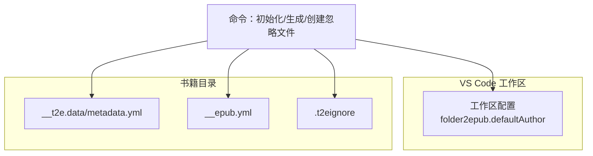
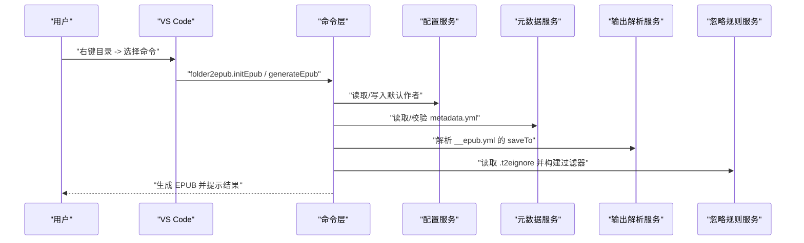
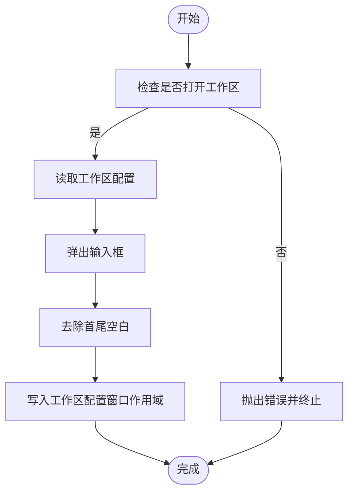
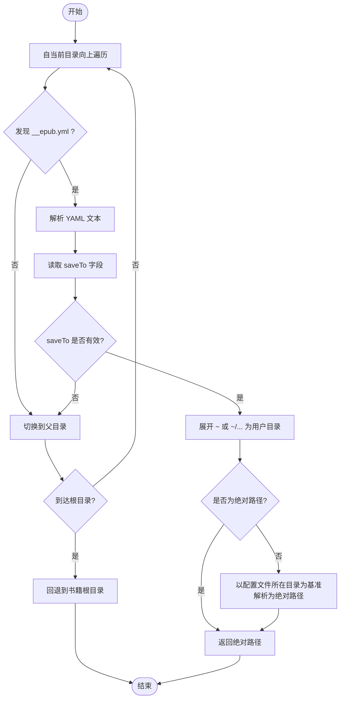
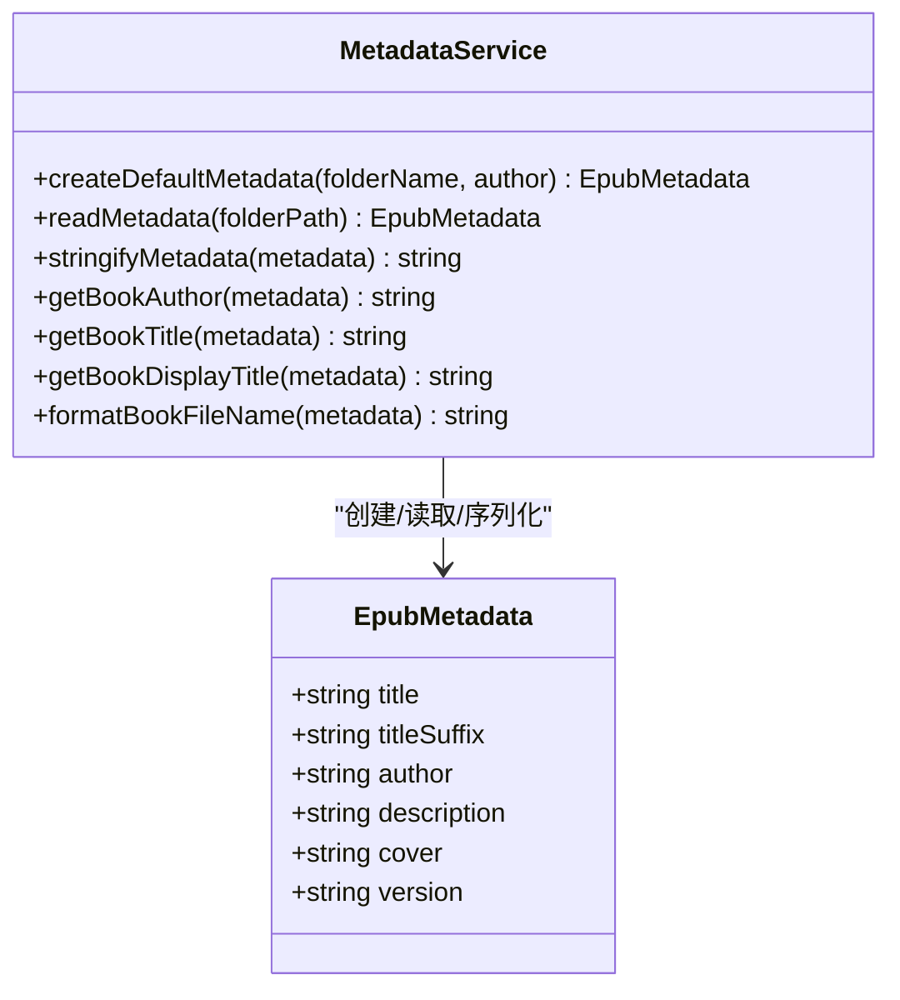
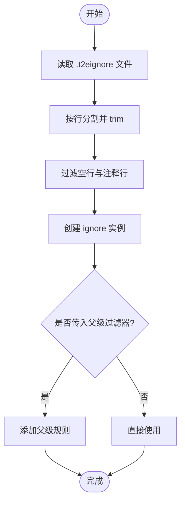
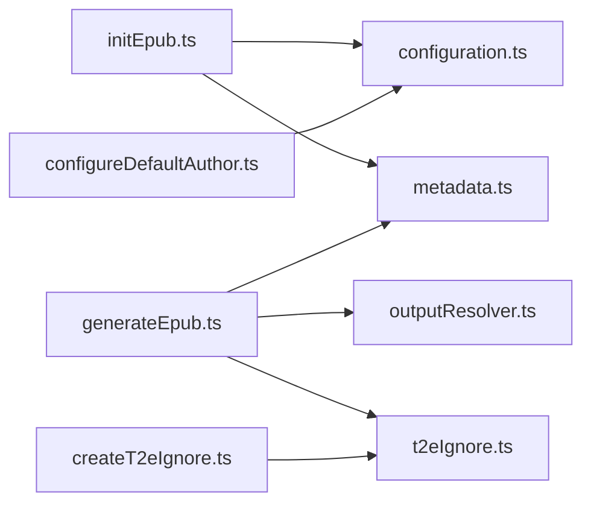

# 配置与定制

<cite>
**本文引用的文件**
- [package.json](file://package.json)
- [README.md](file://README.md)
- [example/__epub.yml](file://example/__epub.yml)
- [example/init-folder/__t2e.data/metadata.yml](file://example/init-folder/__t2e.data/metadata.yml)
- [src/services/configuration.ts](file://src/services/configuration.ts)
- [src/services/metadata.ts](file://src/services/metadata.ts)
- [src/services/outputResolver.ts](file://src/services/outputResolver.ts)
- [src/services/t2eIgnore.ts](file://src/services/t2eIgnore.ts)
- [src/services/folderMatcher.ts](file://src/services/folderMatcher.ts)
- [src/commands/configureDefaultAuthor.ts](file://src/commands/configureDefaultAuthor.ts)
- [src/commands/createT2eIgnore.ts](file://src/commands/createT2eIgnore.ts)
- [src/commands/initEpub.ts](file://src/commands/initEpub.ts)
- [src/services/l10n.ts](file://src/services/l10n.ts)
- [l10n/bundle.l10n.json](file://l10n/bundle.l10n.json)
</cite>

## 目录
1. [简介](#简介)
2. [项目结构](#项目结构)
3. [核心组件](#核心组件)
4. [架构总览](#架构总览)
5. [详细组件分析](#详细组件分析)
6. [依赖关系分析](#依赖关系分析)
7. [性能考量](#性能考量)
8. [故障排除指南](#故障排除指南)
9. [结论](#结论)
10. [附录](#附录)

## 简介
本指南聚焦 VS Code 扩展 Folder2EPUB 的“配置与定制”。内容涵盖：
- VS Code 工作区配置项（默认作者）
- 项目级配置文件格式与字段（__epub.yml、metadata.yml）
- 忽略规则文件（.t2eignore）语法与过滤机制
- 输出目录配置与路径解析（含 ~ 展开）
- 多语言与本地化设置
- 配置验证与常见问题排查
- 配置迁移与版本兼容建议

## 项目结构
该扩展围绕“目录即书籍”的理念，通过 VS Code 资源管理器右键菜单触发命令，完成 EPUB 初始化、扫描与打包。关键配置位置如下：
- 工作区配置项：VS Code 设置（窗口作用域）
- 书籍元数据：__t2e.data/metadata.yml
- 输出目录：父级 __epub.yml 的 saveTo 字段
- 忽略规则：.t2eignore（按 .gitignore 语法）

**图表来源**
- [package.json:66-76](file://package.json#L66-L76)
- [src/services/folderMatcher.ts:7-9](file://src/services/folderMatcher.ts#L7-L9)
- [src/services/outputResolver.ts:15-42](file://src/services/outputResolver.ts#L15-L42)
- [src/services/t2eIgnore.ts:5](file://src/services/t2eIgnore.ts#L5)

**章节来源**
- [package.json:43-96](file://package.json#L43-L96)
- [README.md:10-47](file://README.md#L10-L47)

## 核心组件
- 工作区默认作者配置：通过命令交互式设置，写入窗口作用域配置，供初始化时填充 metadata.yml 的 author 字段。
- 元数据管理：读取/校验/序列化 __t2e.data/metadata.yml，提供标题、作者、描述、封面、版本等字段处理。
- 输出目录解析：自当前目录向上查找 __epub.yml，解析 saveTo，支持相对路径与 ~ 用户目录展开。
- 忽略规则：读取 .t2eignore，按 .gitignore 语法过滤文件与目录，__t2e.data 为系统保留目录不受影响。
- 命令注册：初始化 EPUB、生成 EPUB、创建 .t2eignore。

**章节来源**
- [src/services/configuration.ts:18-40](file://src/services/configuration.ts#L18-L40)
- [src/services/metadata.ts:41-69](file://src/services/metadata.ts#L41-L69)
- [src/services/outputResolver.ts:15-42](file://src/services/outputResolver.ts#L15-L42)
- [src/services/t2eIgnore.ts:13-26](file://src/services/t2eIgnore.ts#L13-L26)
- [src/commands/initEpub.ts:18-62](file://src/commands/initEpub.ts#L18-L62)
- [src/commands/configureDefaultAuthor.ts:12-25](file://src/commands/configureDefaultAuthor.ts#L12-L25)
- [src/commands/createT2eIgnore.ts:15-33](file://src/commands/createT2eIgnore.ts#L15-L33)

## 架构总览
下图展示从命令触发到生成 EPUB 的关键流程与配置交互：

**图表来源**
- [src/commands/initEpub.ts:19-62](file://src/commands/initEpub.ts#L19-L62)
- [src/services/configuration.ts:18-40](file://src/services/configuration.ts#L18-L40)
- [src/services/metadata.ts:41-59](file://src/services/metadata.ts#L41-L59)
- [src/services/outputResolver.ts:15-42](file://src/services/outputResolver.ts#L15-L42)
- [src/services/t2eIgnore.ts:13-26](file://src/services/t2eIgnore.ts#L13-L26)

## 详细组件分析

### VS Code 工作区配置：默认作者
- 配置键：folder2epub.defaultAuthor（窗口作用域）
- 行为：
  - 读取：返回当前工作区中保存的默认作者，未配置时为空字符串
  - 写入：交互式输入后写入工作区配置，trim 后保存
  - 命令入口：Folder2EPUB: 配置当前 Workspace 默认作者
- 使用场景：初始化 EPUB 时自动填充 metadata.yml 的 author 字段

**图表来源**
- [src/services/configuration.ts:32-40](file://src/services/configuration.ts#L32-L40)
- [src/commands/configureDefaultAuthor.ts:13-24](file://src/commands/configureDefaultAuthor.ts#L13-L24)

**章节来源**
- [package.json:66-76](file://package.json#L66-L76)
- [src/services/configuration.ts:18-40](file://src/services/configuration.ts#L18-L40)
- [src/commands/configureDefaultAuthor.ts:12-25](file://src/commands/configureDefaultAuthor.ts#L12-L25)

### 项目级配置文件：__epub.yml
- 位置：从当前目录向上查找，遇到首个 __epub.yml 即采用
- 字段：saveTo（输出目录）
  - 支持相对路径与 ~（用户目录）展开
  - 相对路径以配置文件所在目录为基准
- 解析逻辑：
  - 读取 YAML 文本
  - 提取 saveTo 字段
  - 展开 ~ 或 ~/... 为用户主目录
  - 若非绝对路径则以配置文件所在目录为基准解析为绝对路径
  - 未找到时回退到书籍根目录

**图表来源**
- [src/services/outputResolver.ts:15-42](file://src/services/outputResolver.ts#L15-L42)
- [src/services/outputResolver.ts:50-71](file://src/services/outputResolver.ts#L50-L71)
- [src/services/outputResolver.ts:79-89](file://src/services/outputResolver.ts#L79-L89)

**章节来源**
- [src/services/outputResolver.ts:15-42](file://src/services/outputResolver.ts#L15-L42)
- [example/__epub.yml:1-2](file://example/__epub.yml#L1-L2)

### 项目级配置文件：metadata.yml
- 位置：__t2e.data/metadata.yml
- 字段：
  - title：书名（回退为“未命名”）
  - titleSuffix：副标题（可选）
  - author：作者（缺失时回退为“未知”）
  - description：简介（可选）
  - cover：封面文件名（默认 cover.jpg）
  - version：版本号（默认 1.0.0）
- 读取与校验：
  - 读取 YAML 文本并解析为对象
  - 非对象或字段类型异常时抛出错误
- 序列化：用于初始化时写入默认模板

**图表来源**
- [src/services/metadata.ts:8-33](file://src/services/metadata.ts#L8-L33)
- [src/services/metadata.ts:41-69](file://src/services/metadata.ts#L41-L69)

**章节来源**
- [src/services/metadata.ts:8-33](file://src/services/metadata.ts#L8-L33)
- [src/services/metadata.ts:41-69](file://src/services/metadata.ts#L41-L69)
- [example/init-folder/__t2e.data/metadata.yml:1-7](file://example/init-folder/__t2e.data/metadata.yml#L1-L7)

### 忽略规则：.t2eignore
- 语法：遵循 .gitignore 语法
- 读取与过滤：
  - 读取指定目录下的 .t2eignore
  - 过滤空行与注释行（以 # 开头）
  - 构建 ignore 过滤器实例
  - 支持继承父级过滤器规则
- 特殊说明：
  - __t2e.data 为系统保留目录，不受 .t2eignore 影响
  - 生成阶段会按层级收集各目录的 .t2eignore 并合并

**图表来源**
- [src/services/t2eIgnore.ts:13-26](file://src/services/t2eIgnore.ts#L13-L26)
- [src/services/t2eIgnore.ts:36-44](file://src/services/t2eIgnore.ts#L36-L44)

**章节来源**
- [src/services/t2eIgnore.ts:5-45](file://src/services/t2eIgnore.ts#L5-L45)
- [README.md:39-40](file://README.md#L39-L40)

### 输出目录配置与路径解析
- 解析策略：
  - 自当前书籍根目录向上查找 __epub.yml
  - 读取 saveTo 字段
  - 展开 ~ 或 ~/... 为用户主目录
  - 若为相对路径，以配置文件所在目录为基准解析为绝对路径
  - 未找到配置时回退到书籍根目录
- 命令集成：
  - 初始化命令：创建 __t2e.data/metadata.yml
  - 生成命令：读取元数据、扫描内容、打包 EPUB，并将结果写入解析得到的输出目录

**章节来源**
- [src/services/outputResolver.ts:15-42](file://src/services/outputResolver.ts#L15-L42)
- [src/commands/initEpub.ts:18-62](file://src/commands/initEpub.ts#L18-L62)

### 多语言与本地化设置
- 本地化对象：通过 VS Code l10n 接口提供
- 国际化资源：
  - bundle.l10n.json：默认英文键值
  - bundle.l10n.zh-cn.json：简体中文翻译
- 语言跟随：扩展自动跟随 VS Code 显示语言

**章节来源**
- [src/services/l10n.ts:1-10](file://src/services/l10n.ts#L1-L10)
- [l10n/bundle.l10n.json:1-50](file://l10n/bundle.l10n.json#L1-L50)
- [README.md:18](file://README.md#L18)

## 依赖关系分析
- 命令层依赖配置、元数据、输出解析与忽略规则服务
- 配置服务依赖 VS Code 配置 API
- 元数据服务依赖 YAML 解析库
- 输出解析服务依赖 YAML 解析与 Node 路径/操作系统模块
- 忽略规则服务依赖 ignore 库

**图表来源**
- [src/commands/initEpub.ts:18-62](file://src/commands/initEpub.ts#L18-L62)
- [src/commands/configureDefaultAuthor.ts:12-25](file://src/commands/configureDefaultAuthor.ts#L12-L25)
- [src/commands/createT2eIgnore.ts:15-33](file://src/commands/createT2eIgnore.ts#L15-L33)
- [src/services/metadata.ts:41-69](file://src/services/metadata.ts#L41-L69)
- [src/services/outputResolver.ts:15-42](file://src/services/outputResolver.ts#L15-L42)
- [src/services/t2eIgnore.ts:13-26](file://src/services/t2eIgnore.ts#L13-L26)

**章节来源**
- [src/commands/initEpub.ts:18-62](file://src/commands/initEpub.ts#L18-L62)
- [src/commands/configureDefaultAuthor.ts:12-25](file://src/commands/configureDefaultAuthor.ts#L12-L25)
- [src/commands/createT2eIgnore.ts:15-33](file://src/commands/createT2eIgnore.ts#L15-L33)

## 性能考量
- 忽略规则构建：.t2eignore 规则数量较多时，建议集中放置于根目录以减少层级扫描成本
- YAML 解析：metadata.yml 与 __epub.yml 结构简单，解析开销极低
- 文件系统访问：输出目录解析与元数据读取均为少量 IO，整体性能受磁盘吞吐与文件数量影响
- 建议：
  - 控制 .t2eignore 规则数量与复杂度
  - 将大体量临时文件放入被忽略的子目录
  - 合理组织目录层级，避免过深嵌套导致遍历成本上升

## 故障排除指南
- “请在资源管理器中对本地目录执行此命令”
  - 现象：命令在非本地目录或非文件协议 URI 上执行
  - 处理：确保在资源管理器中右键本地文件夹
  - 参考：[src/services/folderMatcher.ts:23-38](file://src/services/folderMatcher.ts#L23-L38)
- “所选资源不是目录”
  - 现象：URI 指向文件而非目录
  - 处理：确认选择的是文件夹
  - 参考：[src/services/folderMatcher.ts:28-31](file://src/services/folderMatcher.ts#L28-L31)
- “缺少 __t2e.data/metadata.yml”
  - 现象：生成 EPUB 前未初始化
  - 处理：先执行“初始化 epub”，或手动创建 __t2e.data/metadata.yml
  - 参考：[README.md:6](file://README.md#L6)
- “metadata.yml 内容无效”
  - 现象：YAML 解析失败或字段类型异常
  - 处理：检查 YAML 语法与字段类型，确保为对象
  - 参考：[src/services/metadata.ts:45-47](file://src/services/metadata.ts#L45-L47)
- “未配置当前工作区默认作者”
  - 现象：初始化时未设置默认作者
  - 处理：通过命令 Palette 设置默认作者，或在初始化时选择跳过
  - 参考：[src/commands/initEpub.ts:33-49](file://src/commands/initEpub.ts#L33-L49)
- “无法创建 .t2eignore”
  - 现象：目标目录已存在同名文件
  - 处理：删除或编辑现有文件后再创建
  - 参考：[src/commands/createT2eIgnore.ts:21-24](file://src/commands/createT2eIgnore.ts#L21-L24)
- “输出目录解析失败”
  - 现象：__epub.yml 未找到或 saveTo 非法
  - 处理：在书籍根目录或其父级创建 __epub.yml，并正确填写 saveTo
  - 参考：[src/services/outputResolver.ts:15-42](file://src/services/outputResolver.ts#L15-L42)

**章节来源**
- [src/services/folderMatcher.ts:23-38](file://src/services/folderMatcher.ts#L23-L38)
- [src/commands/initEpub.ts:33-49](file://src/commands/initEpub.ts#L33-L49)
- [src/commands/createT2eIgnore.ts:21-24](file://src/commands/createT2eIgnore.ts#L21-L24)
- [src/services/metadata.ts:45-47](file://src/services/metadata.ts#L45-L47)
- [src/services/outputResolver.ts:15-42](file://src/services/outputResolver.ts#L15-L42)

## 结论
- 默认作者通过工作区配置注入 metadata.yml，提升初始化一致性
- __epub.yml 的 saveTo 提供灵活的输出目录控制，支持 ~ 展开与相对路径解析
- .t2eignore 采用 .gitignore 语法，便于团队协作与跨平台兼容
- 元数据字段标准化，便于生成稳定的 EPUB 文件名与展示标题
- 建议在团队内约定 __epub.yml 与 metadata.yml 的字段语义，确保跨环境一致

## 附录

### 配置示例与最佳实践
- __epub.yml 示例
  - 保存到用户下载目录：[example/__epub.yml:1-2](file://example/__epub.yml#L1-L2)
  - 保存到相对子目录：在 __epub.yml 中写入相对路径，解析时以配置文件所在目录为基准
- metadata.yml 示例
  - 初始化模板字段：[example/init-folder/__t2e.data/metadata.yml:1-7](file://example/init-folder/__t2e.data/metadata.yml#L1-L7)
  - 建议：title 与 author 必填，cover 与 description 可选；版本号按需更新
- .t2eignore 语法
  - 使用 .gitignore 语法编写规则，支持注释与空行
  - __t2e.data 不受忽略规则影响
- 输出目录最佳实践
  - 在仓库根目录放置 __epub.yml，统一管理所有书籍输出
  - 使用 ~ 或 ~/... 以适配不同平台用户目录

**章节来源**
- [example/__epub.yml:1-2](file://example/__epub.yml#L1-L2)
- [example/init-folder/__t2e.data/metadata.yml:1-7](file://example/init-folder/__t2e.data/metadata.yml#L1-L7)
- [README.md:39-40](file://README.md#L39-L40)

### 配置迁移与版本兼容
- 版本升级建议
  - 保持 __epub.yml 与 metadata.yml 字段不变，新增字段时提供默认值
  - 如需变更字段语义，应在 README 中明确记录并在迁移脚本中处理
- 迁移步骤
  - 备份现有 __epub.yml 与 metadata.yml
  - 更新字段或结构后，重新生成默认模板并比对差异
  - 在 CI 中增加 YAML 语法校验与最小化回归测试

**章节来源**
- [README.md:143-154](file://README.md#L143-L154)