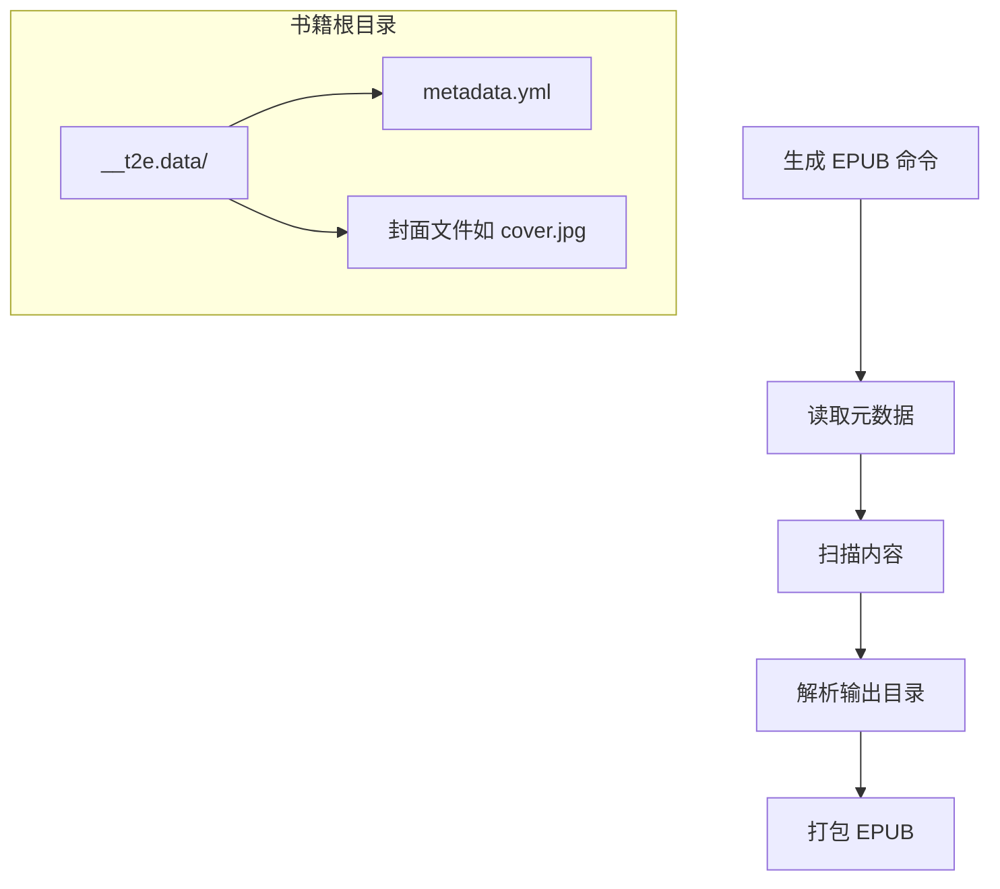
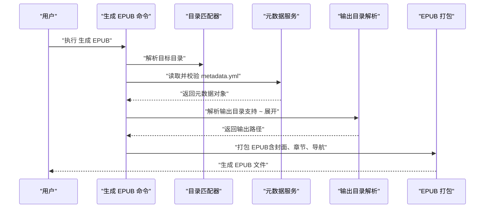
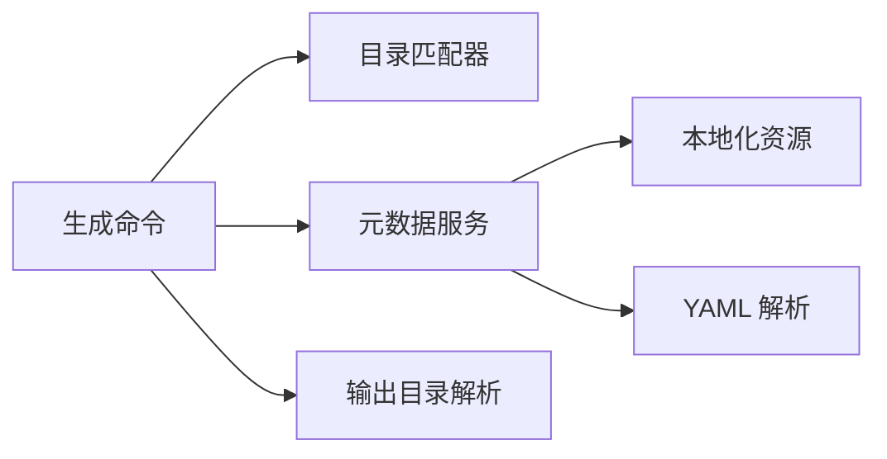

# 项目元数据配置

<cite>
**本文引用的文件**
- [example/__epub.yml](file://example/__epub.yml)
- [example/init-folder/__t2e.data/metadata.yml](file://example/init-folder/__t2e.data/metadata.yml)
- [src/services/metadata.ts](file://src/services/metadata.ts)
- [src/services/folderMatcher.ts](file://src/services/folderMatcher.ts)
- [src/commands/initEpub.ts](file://src/commands/initEpub.ts)
- [src/commands/generateEpub.ts](file://src/commands/generateEpub.ts)
- [src/services/configuration.ts](file://src/services/configuration.ts)
- [src/services/outputResolver.ts](file://src/services/outputResolver.ts)
- [README.md](file://README.md)
- [package.json](file://package.json)
- [l10n/bundle.l10n.json](file://l10n/bundle.l10n.json)
- [l10n/bundle.l10n.zh-cn.json](file://l10n/bundle.l10n.zh-cn.json)
</cite>

## 目录
1. [简介](#简介)
2. [项目结构](#项目结构)
3. [核心组件](#核心组件)
4. [架构总览](#架构总览)
5. [详细组件分析](#详细组件分析)
6. [依赖关系分析](#依赖关系分析)
7. [性能考量](#性能考量)
8. [故障排查指南](#故障排查指南)
9. [结论](#结论)
10. [附录](#附录)

## 简介
本指南聚焦于项目中的元数据配置，围绕元数据文件 metadata.yml 的结构、字段语义、校验规则、文件命名格式化、继承机制与多语言支持进行系统说明。同时结合实际代码实现，给出配置示例、最佳实践与版本管理建议。

## 项目结构
- 元数据文件位于每个书籍根目录下的固定子目录中，遵循固定的文件名约定。
- 生成 EPUB 的流程会先读取元数据，再扫描内容、解析输出目录，最后打包 EPUB。
- 输出目录可通过父级配置文件进行继承与覆盖。

图表来源
- [src/commands/generateEpub.ts:18-66](file://src/commands/generateEpub.ts#L18-L66)
- [src/services/metadata.ts:41-69](file://src/services/metadata.ts#L41-L69)
- [src/services/folderMatcher.ts:46-58](file://src/services/folderMatcher.ts#L46-L58)
- [src/services/outputResolver.ts:15-42](file://src/services/outputResolver.ts#L15-L42)

章节来源
- [src/services/folderMatcher.ts:7-15](file://src/services/folderMatcher.ts#L7-L15)
- [src/commands/generateEpub.ts:18-66](file://src/commands/generateEpub.ts#L18-L66)
- [README.md:16-18](file://README.md#L16-L18)

## 核心组件
- 元数据模型与读取
  - 元数据接口定义了标题、副标题、作者、描述、封面、版本等字段。
  - 读取时对字段进行类型收敛与默认值处理，异常时抛出错误。
- 文件命名与格式化
  - 提供文件名清洗函数，移除非法字符，保证输出文件名合法。
  - 基于元数据生成最终 EPUB 文件名，包含书名、副标题与作者。
- 初始化与生成命令
  - 初始化命令在未存在元数据时创建默认模板，并可交互设置默认作者。
  - 生成命令在执行前严格校验元数据文件的存在性与有效性。
- 输出目录解析
  - 自顶向下查找父级配置文件，解析输出目录，支持使用波浪号展开到用户目录。

章节来源
- [src/services/metadata.ts:8-15](file://src/services/metadata.ts#L8-L15)
- [src/services/metadata.ts:41-69](file://src/services/metadata.ts#L41-L69)
- [src/services/metadata.ts:110-145](file://src/services/metadata.ts#L110-L145)
- [src/commands/initEpub.ts:18-63](file://src/commands/initEpub.ts#L18-L63)
- [src/commands/generateEpub.ts:18-66](file://src/commands/generateEpub.ts#L18-L66)
- [src/services/outputResolver.ts:15-42](file://src/services/outputResolver.ts#L15-L42)

## 架构总览
元数据在生成流程中的关键位置如下：

图表来源
- [src/commands/generateEpub.ts:18-66](file://src/commands/generateEpub.ts#L18-L66)
- [src/services/metadata.ts:41-69](file://src/services/metadata.ts#L41-L69)
- [src/services/outputResolver.ts:15-42](file://src/services/outputResolver.ts#L15-L42)

## 详细组件分析

### 元数据模型与字段说明
- 字段清单与语义
  - title：书名。用于展示与文件命名。缺失时回退为“未命名”。
  - titleSuffix：副标题/版本标识等。用于展示标题拼接，不影响文件命名。
  - author：作者。用于展示与文件命名。缺失时回退为“佚名”。
  - description：书籍描述。可为空。
  - cover：封面文件名。需与 __t2e.data 下的实际文件一致，否则生成时会报错。
  - version：版本号。用于展示与文件命名。缺失时回退为“1.0.0”。

- 字段类型与默认值
  - 所有字段在读取时被收敛为字符串类型；非字符串或缺失时采用默认值。
  - 默认值来源于初始化模板：书名取目录名，作者取工作区默认作者（可为空），封面默认文件名，版本默认“1.0.0”。

- 必填与校验
  - 生成 EPUB 前必须存在元数据文件；文件内容必须为有效的 YAML 对象。
  - 封面路径必须指向 __t2e.data 下存在的文件，否则报错。

- 文件命名格式化规则
  - 文件名由书名、副标题（可选）、作者组成，经过清洗函数处理非法字符，最终以 .epub 结尾。
  - 清洗规则：移除控制字符与非法字符，替换为下划线；空白仅作修剪；空值回退为默认文件名。

- 多语言支持
  - 回退文案（如“未命名”、“佚名”）来自本地化资源文件，随 VS Code 语言切换。

章节来源
- [src/services/metadata.ts:8-15](file://src/services/metadata.ts#L8-L15)
- [src/services/metadata.ts:24-33](file://src/services/metadata.ts#L24-L33)
- [src/services/metadata.ts:41-69](file://src/services/metadata.ts#L41-L69)
- [src/services/metadata.ts:77-89](file://src/services/metadata.ts#L77-L89)
- [src/services/metadata.ts:97-102](file://src/services/metadata.ts#L97-L102)
- [src/services/metadata.ts:110-145](file://src/services/metadata.ts#L110-L145)
- [l10n/bundle.l10n.json:31-32](file://l10n/bundle.l10n.json#L31-L32)
- [l10n/bundle.l10n.zh-cn.json:31-32](file://l10n/bundle.l10n.zh-cn.json#L31-L32)

### 初始化与元数据模板
- 初始化流程
  - 若目录已存在元数据文件，初始化命令会中止。
  - 若未配置工作区默认作者，初始化命令会交互提示配置。
  - 成功后在 __t2e.data 下写入默认模板。

- 默认模板字段
  - 书名：目录名
  - 副标题：空字符串
  - 作者：工作区默认作者（可为空）
  - 描述：空字符串
  - 封面：默认文件名
  - 版本：1.0.0

章节来源
- [src/commands/initEpub.ts:18-63](file://src/commands/initEpub.ts#L18-L63)
- [src/services/configuration.ts:18-24](file://src/services/configuration.ts#L18-L24)
- [src/services/metadata.ts:24-33](file://src/services/metadata.ts#L24-L33)

### 生成 EPUB 流程中的元数据使用
- 生成命令在执行时：
  - 校验元数据文件存在性
  - 读取并校验元数据内容
  - 扫描内容文件
  - 解析输出目录（支持 ~ 展开）
  - 打包 EPUB 并生成文件名

章节来源
- [src/commands/generateEpub.ts:18-66](file://src/commands/generateEpub.ts#L18-L66)
- [src/services/outputResolver.ts:15-42](file://src/services/outputResolver.ts#L15-L42)

### 元数据文件与目录约定
- 元数据文件位置
  - 每个书籍根目录下固定子目录 __t2e.data 下的 metadata.yml。
- 目录匹配与存在性判断
  - 提供计算路径与存在性检测的工具方法。

章节来源
- [src/services/folderMatcher.ts:7-15](file://src/services/folderMatcher.ts#L7-L15)
- [src/services/folderMatcher.ts:46-58](file://src/services/folderMatcher.ts#L46-L58)
- [src/services/folderMatcher.ts:82-84](file://src/services/folderMatcher.ts#L82-L84)

### 输出目录解析与继承机制
- 继承机制
  - 从当前目录向上遍历查找父级配置文件，找到首个有效配置即停止。
  - 支持使用波浪号（~）指向用户目录，可为相对路径或绝对路径。
- 配置文件
  - 父级配置文件名为固定常量，内容包含输出目录字段。

章节来源
- [src/services/outputResolver.ts:15-42](file://src/services/outputResolver.ts#L15-L42)
- [src/services/outputResolver.ts:44-71](file://src/services/outputResolver.ts#L44-L71)
- [src/services/outputResolver.ts:79-89](file://src/services/outputResolver.ts#L79-L89)
- [example/__epub.yml:1-2](file://example/__epub.yml#L1-L2)

### 多语言元数据配置指导
- 本地化资源
  - 回退文案（如“未命名”、“佚名”）来自本地化资源文件，随 VS Code 语言切换。
- 元数据字段本身不区分语言，但展示标题会根据副标题进行拼接，适合多语言场景下的标题表达。

章节来源
- [l10n/bundle.l10n.json:31-32](file://l10n/bundle.l10n.json#L31-L32)
- [l10n/bundle.l10n.zh-cn.json:31-32](file://l10n/bundle.l10n.zh-cn.json#L31-L32)
- [src/services/metadata.ts:97-102](file://src/services/metadata.ts#L97-L102)

### 验证规则与错误处理
- 元数据内容必须为有效对象，否则抛出错误。
- 封面路径必须存在于 __t2e.data 下，否则报错。
- 生成命令在缺少元数据文件或无可用内容时给出明确提示。

章节来源
- [src/services/metadata.ts:45-47](file://src/services/metadata.ts#L45-L47)
- [src/commands/generateEpub.ts:23-26](file://src/commands/generateEpub.ts#L23-L26)

## 依赖关系分析
- 组件耦合
  - 生成命令依赖目录匹配器、元数据服务与输出目录解析服务。
  - 元数据服务依赖本地化模块与 YAML 解析库。
- 关键依赖链
  - 生成命令 → 目录匹配器（定位元数据）→ 元数据服务（读取与格式化）→ 输出目录解析（继承与展开）→ EPUB 打包。

图表来源
- [src/commands/generateEpub.ts:18-66](file://src/commands/generateEpub.ts#L18-L66)
- [src/services/metadata.ts:1-6](file://src/services/metadata.ts#L1-L6)
- [src/services/outputResolver.ts:1-7](file://src/services/outputResolver.ts#L1-L7)

章节来源
- [src/commands/generateEpub.ts:18-66](file://src/commands/generateEpub.ts#L18-L66)
- [src/services/metadata.ts:1-6](file://src/services/metadata.ts#L1-L6)
- [src/services/outputResolver.ts:1-7](file://src/services/outputResolver.ts#L1-L7)

## 性能考量
- 元数据读取与 YAML 解析为轻量操作，对整体性能影响可忽略。
- 文件名清洗与 EPUB 打包为主要耗时环节，建议保持元数据简洁、封面文件尺寸合理。
- 输出目录解析为单次自顶向下遍历，通常层级有限，性能稳定。

## 故障排查指南
- 缺少元数据文件
  - 现象：生成命令提示缺少元数据文件。
  - 处理：先执行初始化命令创建元数据文件。
- 元数据内容无效
  - 现象：读取元数据时报内容无效。
  - 处理：检查 YAML 语法与对象结构，确保为有效对象。
- 封面文件缺失或格式不支持
  - 现象：生成过程中提示封面文件不存在或格式不支持。
  - 处理：确认 __t2e.data 下存在对应封面文件，且为受支持格式。
- 输出目录解析异常
  - 现象：输出路径不符合预期。
  - 处理：检查父级配置文件中的输出目录字段，确认路径是否正确或波浪号展开是否符合预期。

章节来源
- [src/commands/generateEpub.ts:23-26](file://src/commands/generateEpub.ts#L23-L26)
- [src/services/metadata.ts:45-47](file://src/services/metadata.ts#L45-L47)
- [l10n/bundle.l10n.json:36-38](file://l10n/bundle.l10n.json#L36-L38)
- [src/services/outputResolver.ts:15-42](file://src/services/outputResolver.ts#L15-L42)

## 结论
本指南系统梳理了元数据配置的结构、字段语义、校验规则、文件命名格式化、继承机制与多语言支持。结合初始化与生成命令的实现，读者可据此规范地维护元数据，确保 EPUB 生成流程顺利进行。

## 附录

### 元数据字段定义与默认值
- 字段
  - title：字符串；回退值“未命名”
  - titleSuffix：字符串；默认空
  - author：字符串；回退值“佚名”
  - description：字符串；默认空
  - cover：字符串；默认文件名
  - version：字符串；默认“1.0.0”

章节来源
- [src/services/metadata.ts:8-15](file://src/services/metadata.ts#L8-L15)
- [src/services/metadata.ts:24-33](file://src/services/metadata.ts#L24-L33)
- [src/services/metadata.ts:77-89](file://src/services/metadata.ts#L77-L89)
- [l10n/bundle.l10n.json:31-32](file://l10n/bundle.l10n.json#L31-L32)

### 配置示例与字段说明
- 示例一：基础元数据
  - 参考示例文件路径：[example/init-folder/__t2e.data/metadata.yml](file://example/init-folder/__t2e.data/metadata.yml)
- 示例二：父级输出目录配置
  - 参考示例文件路径：[example/__epub.yml](file://example/__epub.yml)
- 初始化模板字段
  - 参考说明：[README.md:50-59](file://README.md#L50-L59)

章节来源
- [example/init-folder/__t2e.data/metadata.yml:1-7](file://example/init-folder/__t2e.data/metadata.yml#L1-L7)
- [example/__epub.yml:1-2](file://example/__epub.yml#L1-L2)
- [README.md:50-59](file://README.md#L50-L59)

### 元数据验证规则与必填字段
- 必填文件：metadata.yml
- 必填字段：无硬性必填字段，但生成流程依赖其存在与有效
- 校验规则：
  - 元数据内容必须为有效对象
  - 封面路径必须存在且为文件
  - 生成命令在无可用内容时会报错

章节来源
- [src/commands/generateEpub.ts:23-26](file://src/commands/generateEpub.ts#L23-L26)
- [src/services/metadata.ts:45-47](file://src/services/metadata.ts#L45-L47)
- [l10n/bundle.l10n.json:36-38](file://l10n/bundle.l10n.json#L36-L38)

### 文件名格式化规则
- 规则要点
  - 移除控制字符与非法字符，替换为下划线
  - 修剪空白；空值回退为默认文件名
  - 生成格式包含书名、副标题（可选）、作者
- 参考实现路径：[src/services/metadata.ts:110-145](file://src/services/metadata.ts#L110-L145)

章节来源
- [src/services/metadata.ts:110-145](file://src/services/metadata.ts#L110-L145)

### 元数据继承机制
- 继承来源：父级目录中的固定配置文件
- 解析策略：自顶向下查找，遇到首个有效配置即停止
- 支持特性：波浪号展开到用户目录

章节来源
- [src/services/outputResolver.ts:15-42](file://src/services/outputResolver.ts#L15-L42)
- [src/services/outputResolver.ts:79-89](file://src/services/outputResolver.ts#L79-L89)

### 多语言元数据配置指导
- 回退文案随语言切换
  - “未命名”、“佚名”等文案来自本地化资源
- 标题拼接
  - 副标题会参与展示标题拼接，适合多语言场景

章节来源
- [l10n/bundle.l10n.json:31-32](file://l10n/bundle.l10n.json#L31-L32)
- [l10n/bundle.l10n.zh-cn.json:31-32](file://l10n/bundle.l10n.zh-cn.json#L31-L32)
- [src/services/metadata.ts:97-102](file://src/services/metadata.ts#L97-L102)

### 元数据更新与版本管理建议
- 版本字段
  - 使用 semver 风格字符串，建议在每次重大/次要/补丁更新时递增对应位
- 更新流程
  - 修改元数据文件中的版本字段
  - 如涉及封面或标题变更，建议同步更新封面文件名与元数据
- 发布前检查
  - package.json 中的版本号与发布策略需与元数据版本保持一致的发布节奏
  - 参考发布说明与版本递增策略：[README.md:143-154](file://README.md#L143-L154)

章节来源
- [src/services/metadata.ts:12-14](file://src/services/metadata.ts#L12-L14)
- [README.md:143-154](file://README.md#L143-L154)
- [package.json:5](file://package.json#L5)