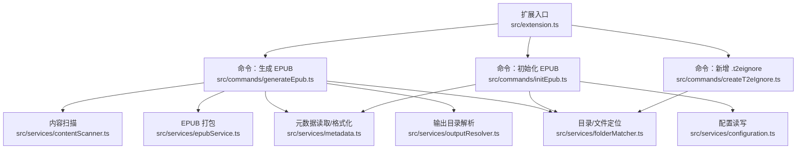
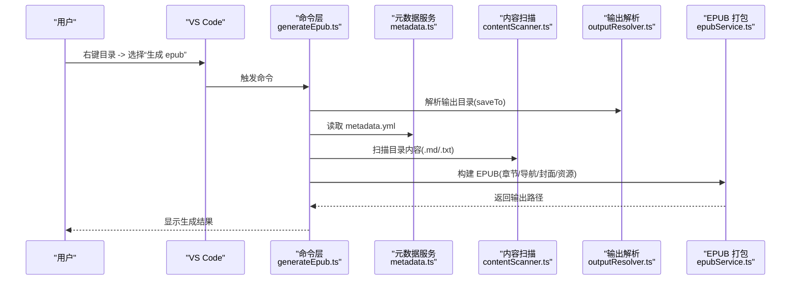
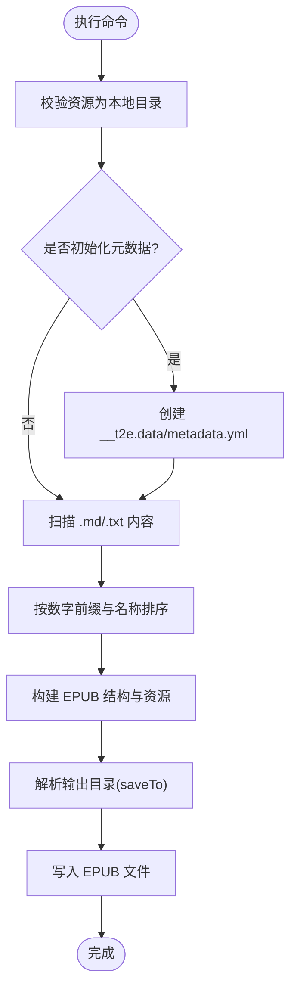
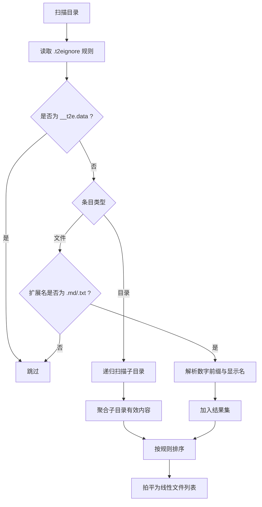
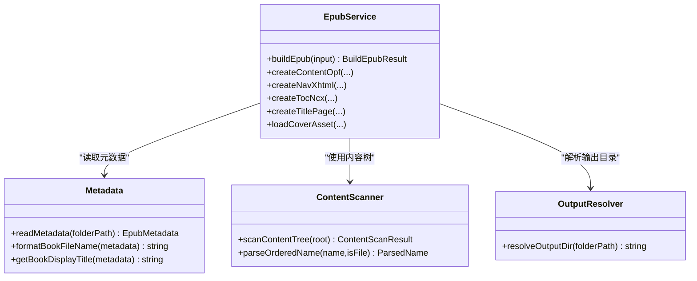
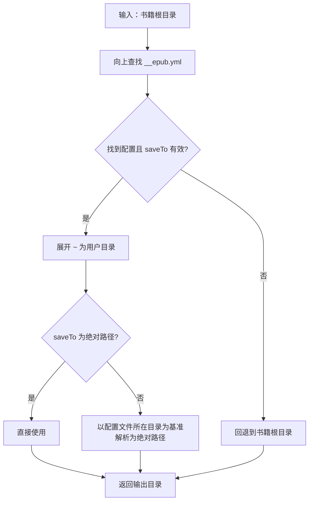
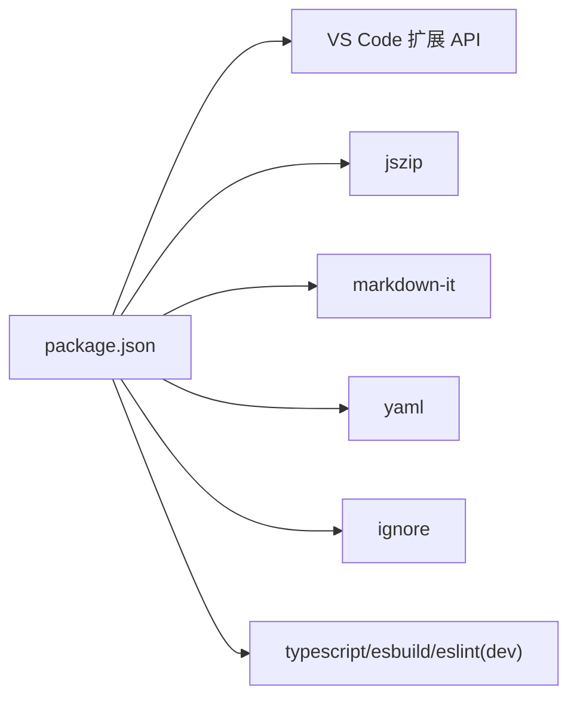

# 项目概述

<cite>
**本文引用的文件**
- [package.json](file://package.json)
- [README.md](file://README.md)
- [src/extension.ts](file://src/extension.ts)
- [src/commands/generateEpub.ts](file://src/commands/generateEpub.ts)
- [src/commands/initEpub.ts](file://src/commands/initEpub.ts)
- [src/commands/createT2eIgnore.ts](file://src/commands/createT2eIgnore.ts)
- [src/services/epubService.ts](file://src/services/epubService.ts)
- [src/services/contentScanner.ts](file://src/services/contentScanner.ts)
- [src/services/metadata.ts](file://src/services/metadata.ts)
- [src/services/outputResolver.ts](file://src/services/outputResolver.ts)
- [src/services/folderMatcher.ts](file://src/services/folderMatcher.ts)
- [src/services/configuration.ts](file://src/services/configuration.ts)
- [l10n/bundle.l10n.json](file://l10n/bundle.l10n.json)
- [l10n/bundle.l10n.zh-cn.json](file://l10n/bundle.l10n.zh-cn.json)
- [example/__epub.yml](file://example/__epub.yml)
</cite>

## 目录
1. [简介](#简介)
2. [项目结构](#项目结构)
3. [核心组件](#核心组件)
4. [架构总览](#架构总览)
5. [详细组件分析](#详细组件分析)
6. [依赖关系分析](#依赖关系分析)
7. [性能考量](#性能考量)
8. [故障排查指南](#故障排查指南)
9. [结论](#结论)
10. [附录](#附录)

## 简介
Folder2EPUB 是一款面向 VS Code 生态的扩展，旨在将本地文件夹内容一键转换为符合 EPUB 3.0 标准的电子书。它采用“目录即书籍”的内容组织理念，通过资源管理器右键菜单与命令面板，帮助用户快速初始化 EPUB 元数据、扫描目录内容、解析 Markdown/TXT 及其图片资源，并最终打包生成 EPUB 文件。项目支持多语言界面（中文/英文），并提供灵活的输出目录解析与忽略规则。

- 目标用户
  - 需要将知识库、教程、手册、小说等文本内容批量导出为电子书的作者与编辑
  - 偏好 VS Code 本地开发工作流的创作者与技术文档维护者
  - 希望以最小成本获得可阅读器兼容 EPUB 的个人与团队

- 在 VS Code 生态中的定位
  - 作为“其他”类扩展，提供轻量、专注的本地内容 EPUB 化能力
  - 与 VS Code 的资源管理器、命令面板、国际化机制无缝集成

- EPUB 3.0 与目录即书籍
  - EPUB 3.0 是当前主流电子书标准，支持现代阅读器的导航、样式与多媒体能力
  - “目录即书籍”强调以文件夹层级与命名约定组织内容，天然契合 EPUB 的层级导航与章节映射

**章节来源**
- [README.md:1-241](file://README.md#L1-L241)
- [package.json:1-114](file://package.json#L1-L114)

## 项目结构
项目采用按职责分层的组织方式：
- 根配置与贡献
  - package.json：扩展元数据、VS Code 贡献（命令、菜单、国际化）、依赖声明
  - README.md：功能说明、使用约定、示例与发布流程
- 扩展入口
  - src/extension.ts：激活函数，注册所有命令
- 命令层
  - src/commands/*：围绕“生成 EPUB”“初始化 EPUB”“新增 .t2eignore”等核心操作封装
- 服务层
  - src/services/*：内容扫描、EPUB 打包、元数据、输出目录解析、忽略规则、配置与本地化等

**图表来源**
- [src/extension.ts:1-24](file://src/extension.ts#L1-L24)
- [src/commands/generateEpub.ts:1-66](file://src/commands/generateEpub.ts#L1-L66)
- [src/commands/initEpub.ts:1-63](file://src/commands/initEpub.ts#L1-L63)
- [src/commands/createT2eIgnore.ts:1-34](file://src/commands/createT2eIgnore.ts#L1-L34)
- [src/services/contentScanner.ts:1-340](file://src/services/contentScanner.ts#L1-L340)
- [src/services/epubService.ts:1-800](file://src/services/epubService.ts#L1-L800)
- [src/services/metadata.ts:1-157](file://src/services/metadata.ts#L1-L157)
- [src/services/outputResolver.ts:1-90](file://src/services/outputResolver.ts#L1-L90)
- [src/services/folderMatcher.ts:1-85](file://src/services/folderMatcher.ts#L1-L85)
- [src/services/configuration.ts:1-80](file://src/services/configuration.ts#L1-L80)

**章节来源**
- [package.json:43-96](file://package.json#L43-L96)
- [src/extension.ts:13-23](file://src/extension.ts#L13-L23)

## 核心组件
- 命令与菜单集成
  - 资源管理器右键菜单：在本地目录上提供“生成 epub”“初始化 epub”“新增 .t2eignore”
  - 命令面板：通过“Folder2EPUB: 配置当前 Workspace 默认作者”设置默认作者
- 内容扫描与排序
  - 支持 .md/.txt，按数字前缀优先、名称次之的自然排序
  - 目录优先跳转至 index 文件，index 文件不重复作为独立目录项
- EPUB 打包
  - 生成 content.opf、nav.xhtml、toc.ncx、样式与资源，遵循 EPUB 3.0 结构
  - 支持封面、正文图片、标题页、导航目录
- 元数据与输出
  - 元数据文件：__t2e.data/metadata.yml
  - 输出目录：支持通过父级 __epub.yml 的 saveTo 配置，支持 ~ 展开到用户目录
- 忽略规则与安全
  - .t2eignore 支持 .gitignore 语法，__t2e.data 不受忽略影响
- 国际化
  - 多语言界面（英文/中文），自动跟随 VS Code 显示语言

**章节来源**
- [package.json:77-95](file://package.json#L77-L95)
- [README.md:5-122](file://README.md#L5-L122)
- [src/services/contentScanner.ts:51-340](file://src/services/contentScanner.ts#L51-L340)
- [src/services/epubService.ts:146-216](file://src/services/epubService.ts#L146-L216)
- [src/services/metadata.ts:41-117](file://src/services/metadata.ts#L41-L117)
- [src/services/outputResolver.ts:15-90](file://src/services/outputResolver.ts#L15-L90)
- [l10n/bundle.l10n.json:1-50](file://l10n/bundle.l10n.json#L1-L50)
- [l10n/bundle.l10n.zh-cn.json:1-50](file://l10n/bundle.l10n.zh-cn.json#L1-L50)

## 架构总览
整体流程分为“初始化元数据”“扫描内容”“构建 EPUB”“输出文件”四个阶段，命令层负责编排，服务层提供具体能力。

**图表来源**
- [src/commands/generateEpub.ts:18-66](file://src/commands/generateEpub.ts#L18-L66)
- [src/services/metadata.ts:41-59](file://src/services/metadata.ts#L41-L59)
- [src/services/contentScanner.ts:51-58](file://src/services/contentScanner.ts#L51-L58)
- [src/services/outputResolver.ts:15-42](file://src/services/outputResolver.ts#L15-L42)
- [src/services/epubService.ts:146-216](file://src/services/epubService.ts#L146-L216)

## 详细组件分析

### 命令层与菜单集成
- 生成 EPUB
  - 校验元数据文件存在性
  - 分阶段进度反馈：读取元数据、扫描内容、解析输出目录、打包 EPUB
  - 错误消息统一通过本地化服务输出
- 初始化 EPUB
  - 优先使用当前 Workspace 默认作者；未配置时引导用户输入
  - 创建 __t2e.data/metadata.yml
- 新增 .t2eignore
  - 在目标目录创建空文件，避免覆盖已有文件

**图表来源**
- [src/commands/generateEpub.ts:19-65](file://src/commands/generateEpub.ts#L19-L65)
- [src/commands/initEpub.ts:19-62](file://src/commands/initEpub.ts#L19-L62)
- [src/commands/createT2eIgnore.ts:16-33](file://src/commands/createT2eIgnore.ts#L16-L33)

**章节来源**
- [src/commands/generateEpub.ts:18-66](file://src/commands/generateEpub.ts#L18-L66)
- [src/commands/initEpub.ts:18-63](file://src/commands/initEpub.ts#L18-L63)
- [src/commands/createT2eIgnore.ts:15-34](file://src/commands/createT2eIgnore.ts#L15-L34)

### 内容扫描与排序
- 支持扩展名：.md/.txt
- 排序规则
  - 文件/目录名形如 0120_章节名.md，数字前缀参与排序
  - 去掉数字前缀后，使用剩余名称作为显示名
  - 目录优先跳转至 index 文件，index 文件不作为独立目录项
- 忽略规则
  - 递归读取 .t2eignore，遵循 .gitignore 语法
  - __t2e.data 目录不受忽略影响
- 索引文件查找
  - 直接子目录优先；若无则在子树中查找首个 index 文件

**图表来源**
- [src/services/contentScanner.ts:258-340](file://src/services/contentScanner.ts#L258-L340)
- [src/services/contentScanner.ts:67-105](file://src/services/contentScanner.ts#L67-L105)
- [src/services/contentScanner.ts:191-238](file://src/services/contentScanner.ts#L191-L238)

**章节来源**
- [src/services/contentScanner.ts:51-340](file://src/services/contentScanner.ts#L51-L340)

### EPUB 打包与结构
- 核心文件
  - mimetype（仅存储）
  - META-INF/container.xml
  - OEBPS/content.opf（包信息、清单、阅读顺序）
  - OEBPS/nav.xhtml（导航页）
  - OEBPS/toc.ncx（兼容旧阅读器）
  - OEBPS/styles/main.css（基础样式）
  - OEBPS/text/*.xhtml（章节与标题页）
  - OEBPS/images/*（封面与正文图片）
- 关键流程
  - 解析 Markdown/TXT，提取 frontmatter 标题，渲染为 XHTML
  - 收集并重写图片资源路径，保证相对路径正确
  - 构建导航树与章节映射，确保目录与阅读顺序一致
  - 生成随机唯一标识与修改时间戳

**图表来源**
- [src/services/epubService.ts:146-216](file://src/services/epubService.ts#L146-L216)
- [src/services/metadata.ts:41-117](file://src/services/metadata.ts#L41-L117)
- [src/services/contentScanner.ts:51-58](file://src/services/contentScanner.ts#L51-L58)
- [src/services/outputResolver.ts:15-42](file://src/services/outputResolver.ts#L15-L42)

**章节来源**
- [src/services/epubService.ts:146-800](file://src/services/epubService.ts#L146-L800)

### 元数据与输出目录解析
- 元数据
  - 默认模板：标题、副标题、作者、描述、封面、版本
  - 读取与序列化：YAML 解析与 stringify
  - 文件名格式化：清洗非法字符，生成规范文件名
- 输出目录
  - 自顶向下查找 __epub.yml，读取 saveTo
  - 支持 ~ 与 ~/... 展开到用户目录
  - 相对路径以配置文件所在目录为基准

**图表来源**
- [src/services/outputResolver.ts:15-90](file://src/services/outputResolver.ts#L15-L90)
- [example/__epub.yml:1-2](file://example/__epub.yml#L1-L2)

**章节来源**
- [src/services/metadata.ts:24-117](file://src/services/metadata.ts#L24-L117)
- [src/services/outputResolver.ts:15-90](file://src/services/outputResolver.ts#L15-L90)

### 目录/文件定位与忽略规则
- 目录定位
  - 校验资源为本地目录，返回统一结构
  - 计算 __t2e.data 与 metadata.yml 的绝对路径
- 忽略规则
  - 读取 .t2eignore，合并到过滤器
  - __t2e.data 永远不过滤
  - 递归扫描时即时应用过滤

**章节来源**
- [src/services/folderMatcher.ts:23-84](file://src/services/folderMatcher.ts#L23-L84)
- [src/services/contentScanner.ts:258-340](file://src/services/contentScanner.ts#L258-L340)

### 国际化与本地化
- 本地化键值
  - 英文与中文键值分别位于 bundle.l10n.json 与 bundle.l10n.zh-cn.json
  - VS Code l10n 机制自动选择语言
- 常见提示
  - 生成/初始化/创建失败、缺少元数据、输出目录解析、封面与图片资源错误等

**章节来源**
- [l10n/bundle.l10n.json:1-50](file://l10n/bundle.l10n.json#L1-L50)
- [l10n/bundle.l10n.zh-cn.json:1-50](file://l10n/bundle.l10n.zh-cn.json#L1-L50)

## 依赖关系分析
- VS Code 扩展框架
  - 命令注册、菜单贡献、国际化、工作区配置
- 核心依赖
  - jszip：EPUB 打包（ZIP 容器）
  - markdown-it：Markdown 渲染
  - yaml：YAML 解析与序列化
  - ignore：.t2eignore 忽略规则
- 开发依赖
  - esbuild、typescript、eslint 等

**图表来源**
- [package.json:97-112](file://package.json#L97-L112)

**章节来源**
- [package.json:97-112](file://package.json#L97-L112)

## 性能考量
- I/O 与内存
  - 扫描与读取大量 .md/.txt 时，注意磁盘 I/O；建议合理使用 .t2eignore 控制扫描范围
  - EPUB 打包阶段使用 JSZip 流式生成，压缩级别与资源大小直接影响内存占用
- 渲染与图片处理
  - Markdown 渲染与图片路径重写为 CPU 密集型步骤；建议控制单次生成的章节数量与图片尺寸
- 输出目录解析
  - 自顶向下查找 __epub.yml 的路径解析为 O(h)（h 为目录层级），通常可忽略

[本节为通用指导，无需特定文件引用]

## 故障排查指南
- 常见问题与提示
  - 缺少元数据文件：执行“初始化 EPUB”后再生成
  - 目录中无可用 .md/.txt：确认内容扫描规则与 .t2eignore
  - 输出目录解析失败：检查 __epub.yml 的 saveTo 配置与路径有效性
  - 封面缺失或格式不支持：确认 __t2e.data 下封面文件存在且为支持格式
  - 图片资源异常：检查图片路径是否相对当前文件，是否在目录范围内
- 交互与日志
  - 命令执行期间的进度提示有助于定位卡顿阶段
  - 错误消息通过本地化统一输出，便于定位问题

**章节来源**
- [src/commands/generateEpub.ts:23-63](file://src/commands/generateEpub.ts#L23-L63)
- [src/services/epubService.ts:604-633](file://src/services/epubService.ts#L604-L633)
- [src/services/outputResolver.ts:15-42](file://src/services/outputResolver.ts#L15-L42)

## 结论
Folder2EPUB 以简洁稳定的架构实现了从本地目录到 EPUB 3.0 的自动化转换，兼顾易用性与可扩展性。通过“目录即书籍”的组织方式与严格的扫描/排序规则，用户可在 VS Code 中高效完成电子书制作。未来可考虑增强动态菜单状态、更细粒度的错误恢复与增量构建等能力，持续提升用户体验。

[本节为总结，无需特定文件引用]

## 附录
- 开发与发布
  - 安装依赖、编译、打包与发布流程详见 README
- 示例配置
  - 示例 __epub.yml 展示 saveTo 的使用方法

**章节来源**
- [README.md:124-241](file://README.md#L124-L241)
- [example/__epub.yml:1-2](file://example/__epub.yml#L1-L2)